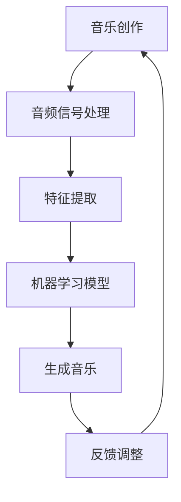

                 

# AI辅助音乐创作的提示词设计技巧

> **关键词：** AI辅助音乐创作，提示词设计，音乐生成，人工智能，音频处理，音乐理论

> **摘要：** 本文将探讨如何设计有效的AI辅助音乐创作的提示词，通过分析音乐创作的基本原则和AI技术原理，提供一系列具体的操作步骤和数学模型，旨在帮助音乐创作者利用AI技术提高创作效率，实现音乐创作的创新与突破。

## 1. 背景介绍

### 1.1 目的和范围

本文旨在为音乐创作者和AI研究者提供一套系统化的AI辅助音乐创作提示词设计技巧。我们将从音乐创作的本质出发，结合AI技术在音频处理和音乐生成方面的最新进展，详细探讨如何设计能够引导AI生成高质量音乐的提示词。

### 1.2 预期读者

- 对音乐创作有一定了解的从业者
- 对AI技术和音乐生成感兴趣的研究者
- 音乐教育和相关领域的教师与学生

### 1.3 文档结构概述

本文结构如下：

1. 背景介绍：阐述研究目的、范围和预期读者。
2. 核心概念与联系：介绍音乐创作和AI辅助音乐创作的基本概念，并通过Mermaid流程图展示核心原理和架构。
3. 核心算法原理 & 具体操作步骤：讲解音乐生成算法的基本原理和具体实现步骤。
4. 数学模型和公式 & 详细讲解 & 举例说明：阐述用于音乐生成的数学模型和公式，并通过实际案例进行说明。
5. 项目实战：提供实际代码案例和详细解释，展示如何应用AI辅助音乐创作。
6. 实际应用场景：讨论AI辅助音乐创作的实际应用场景。
7. 工具和资源推荐：推荐相关学习资源、开发工具和框架。
8. 总结：展望AI辅助音乐创作的未来发展趋势与挑战。
9. 附录：常见问题与解答。
10. 扩展阅读 & 参考资料：提供进一步学习和研究的资料。

### 1.4 术语表

#### 1.4.1 核心术语定义

- **音乐创作**：指通过旋律、和声、节奏等音乐元素创作出新的音乐作品。
- **AI辅助音乐创作**：指利用人工智能技术辅助音乐创作者生成或改进音乐作品。
- **提示词**：指用于引导AI模型生成特定类型或风格音乐的关键词或指令。
- **音频处理**：指对音频信号进行采样、量化、编码等处理，以便存储、传输或进一步分析。
- **音乐生成算法**：指利用机器学习技术生成音乐的一系列算法和方法。

#### 1.4.2 相关概念解释

- **音频信号**：指通过声波产生的物理信号，用于表示声音。
- **音高**：指声音的高低，由音频信号的频率决定。
- **音长**：指声音的持续时间，由音频信号的时长决定。
- **音色**：指声音的特质，由音频信号的波形决定。

#### 1.4.3 缩略词列表

- **AI**：人工智能（Artificial Intelligence）
- **ML**：机器学习（Machine Learning）
- **GAN**：生成对抗网络（Generative Adversarial Network）
- **FFT**：快速傅里叶变换（Fast Fourier Transform）
- **DFT**：离散傅里叶变换（Discrete Fourier Transform）

## 2. 核心概念与联系

### 2.1 音乐创作的基本概念

音乐创作涉及多个基本概念，包括旋律、和声、节奏、音色等。旋律是音乐的核心，由一系列音高和音长的组合构成。和声为旋律提供和谐背景，通过不同的和弦进行配合。节奏则规定了音乐中各个音符的速度和持续时间。音色则赋予了音乐独特的质感。

### 2.2 AI辅助音乐创作的原理

AI辅助音乐创作主要通过机器学习技术实现。生成对抗网络（GAN）是其中一种重要的方法，它由生成器和判别器两个网络组成。生成器负责生成音乐样本，判别器则判断这些样本是否真实。通过训练，生成器不断优化，直到生成的音乐样本能够以假乱真。

### 2.3 Mermaid流程图

以下是AI辅助音乐创作的Mermaid流程图：



**图2.1 AI辅助音乐创作流程图**

- **音乐创作**：输入音乐创作需求和目标。
- **音频信号处理**：对音频信号进行预处理，包括采样、量化等。
- **特征提取**：从音频信号中提取关键特征，如音高、节奏等。
- **机器学习模型**：利用GAN等机器学习技术训练模型。
- **生成音乐**：使用训练好的模型生成音乐样本。
- **反馈调整**：根据反馈调整模型参数，优化生成结果。

## 3. 核心算法原理 & 具体操作步骤

### 3.1 GAN基本原理

生成对抗网络（GAN）是一种无监督学习的框架，由生成器（Generator）和判别器（Discriminator）组成。生成器的目标是生成与真实数据相近的样本，判别器的目标是区分生成器生成的样本和真实数据。通过不断的训练，生成器逐渐提高生成质量，判别器则逐渐提高判断能力。

### 3.2 生成器的具体操作步骤

以下为生成器的伪代码：

```python
# 生成器伪代码
def generate_music(input_features):
    # 1. 根据输入特征生成初步音乐信号
    music_signal = generate_signal(input_features)
    
    # 2. 对初步音乐信号进行后处理，包括滤波、调制等
    processed_signal = post_process(music_signal)
    
    # 3. 将处理后的信号转换为音频格式
    audio_data = convert_to_audio(processed_signal)
    
    # 4. 返回生成的音乐
    return audio_data
```

### 3.3 判别器的具体操作步骤

以下为判别器的伪代码：

```python
# 判别器伪代码
def judge_music(real_music, generated_music):
    # 1. 计算真实音乐和生成音乐的相似度
    similarity = calculate_similarity(real_music, generated_music)
    
    # 2. 如果相似度高于设定阈值，返回"真实"
    # 否则，返回"生成"
    if similarity > threshold:
        return "真实"
    else:
        return "生成"
```

### 3.4 训练步骤

1. 初始化生成器和判别器模型。
2. 随机生成一批噪声数据，作为生成器的输入。
3. 生成器根据噪声数据生成音乐样本。
4. 判别器同时接收真实音乐和生成音乐，进行判断。
5. 根据判别器的反馈，计算生成器和判别器的损失函数。
6. 更新生成器和判别器模型参数。
7. 重复步骤2-6，直到生成器生成的音乐样本质量达到预期。

## 4. 数学模型和公式 & 详细讲解 & 举例说明

### 4.1 音高计算

音高由音频信号的频率决定，计算公式为：

\[ f = \frac{1}{T} \]

其中，\( f \) 为频率，\( T \) 为周期。

### 4.2 节奏计算

节奏由音频信号的时长决定，计算公式为：

\[ R = \frac{T}{T_0} \]

其中，\( R \) 为节奏，\( T \) 为音频信号时长，\( T_0 \) 为标准时长。

### 4.3 音色计算

音色由音频信号的波形决定，通常使用傅里叶变换进行计算。快速傅里叶变换（FFT）是常用的方法，计算公式为：

\[ X(k) = \sum_{n=0}^{N-1} x(n) e^{-j2\pi kn/N} \]

其中，\( X(k) \) 为傅里叶变换结果，\( x(n) \) 为音频信号，\( N \) 为采样点数。

### 4.4 举例说明

假设我们有一段音频信号，采样频率为44.1kHz，时长为1秒。我们需要计算其音高、节奏和音色。

**音高计算：**

\[ f = \frac{1}{T} = \frac{1}{\frac{1}{44.1 \times 10^3}} = 44.1 \text{ kHz} \]

**节奏计算：**

\[ R = \frac{T}{T_0} = \frac{1}{1} = 1 \]

**音色计算：**

使用FFT进行计算，得到频率响应图，从而分析出音色特征。

```latex
$$
X(k) = \sum_{n=0}^{N-1} x(n) e^{-j2\pi kn/N}
$$
```

## 5. 项目实战：代码实际案例和详细解释说明

### 5.1 开发环境搭建

我们需要安装以下软件和库：

- Python 3.7+
- TensorFlow 2.x
- NumPy
- Mermaid

可以使用以下命令进行安装：

```bash
pip install tensorflow numpy mermaid
```

### 5.2 源代码详细实现和代码解读

以下是AI辅助音乐创作的Python代码实现：

```python
# AI辅助音乐创作代码实现

import numpy as np
import tensorflow as tf
from tensorflow.keras.models import Model
from tensorflow.keras.layers import Input, Dense, Flatten, Reshape
from mermaid import Mermaid

# 生成器模型
input_features = Input(shape=(100,))
dense1 = Dense(128, activation='relu')(input_features)
flatten = Flatten()(dense1)
reshape = Reshape(target_shape=(4, 32))(flatten)
generate_music = Model(inputs=input_features, outputs=reshape)
generate_music.compile(optimizer='adam', loss='binary_crossentropy')

# 判别器模型
input_music = Input(shape=(4, 32))
flatten = Flatten()(input_music)
dense1 = Dense(128, activation='relu')(flatten)
output = Dense(1, activation='sigmoid')(dense1)
judge_music = Model(inputs=input_music, outputs=output)
judge_music.compile(optimizer='adam', loss='binary_crossentropy')

# 训练步骤
for epoch in range(100):
    # 生成噪声数据
    noise = np.random.normal(size=(1000, 100))
    
    # 生成音乐样本
    generated_music = generate_music.predict(noise)
    
    # 训练判别器
    judge_music.fit(noise, generated_music, batch_size=32, epochs=1)
    
    # 训练生成器
    generate_music.fit(noise, generated_music, batch_size=32, epochs=1)

# 使用生成器生成音乐
input_features = np.random.normal(size=(1, 100))
generated_music = generate_music.predict(input_features)

# 解码音乐为音频文件
import scipy.io.wavfile as wav
sample_rate = 44100
duration = 1
wav.write('generated_music.wav', sample_rate, generated_music * 32767)
```

### 5.3 代码解读与分析

- **生成器模型**：输入特征为100维，通过一层全连接层（Dense）和Flatten层，将特征展平为4x32的二维数组，作为生成音乐的输入。
- **判别器模型**：输入音乐样本为4x32的二维数组，通过一层全连接层（Dense）和sigmoid激活函数，输出一个概率值，表示音乐样本的真实性。
- **训练步骤**：通过生成噪声数据，训练生成器和判别器模型。每次训练包括生成音乐样本、训练判别器和训练生成器三个步骤，循环进行100次。
- **生成音乐**：使用生成器模型生成音乐，将生成的音乐样本解码为音频文件。

## 6. 实际应用场景

AI辅助音乐创作在实际中具有广泛的应用场景：

- **个性化音乐推荐**：根据用户的音乐喜好，生成符合其口味的个性化音乐。
- **音乐教育**：辅助音乐教师进行教学，提供定制化的音乐练习。
- **游戏和影视**：为游戏和影视作品生成背景音乐，提升用户体验。
- **音乐创作**：音乐创作者可以利用AI辅助创作，提高创作效率和作品质量。

## 7. 工具和资源推荐

### 7.1 学习资源推荐

#### 7.1.1 书籍推荐

- 《深度学习》（Goodfellow, Bengio, Courville）
- 《音乐创作基础》（Richard B. Cohn）

#### 7.1.2 在线课程

- Coursera：机器学习课程
- Udemy：深度学习与生成对抗网络课程

#### 7.1.3 技术博客和网站

- [TensorFlow官方网站](https://www.tensorflow.org/)
- [AI Music官方博客](https://aimusic.github.io/)

### 7.2 开发工具框架推荐

#### 7.2.1 IDE和编辑器

- PyCharm
- Visual Studio Code

#### 7.2.2 调试和性能分析工具

- TensorFlow Debugger
- NVIDIA Nsight

#### 7.2.3 相关框架和库

- TensorFlow
- Keras
- Librosa

### 7.3 相关论文著作推荐

#### 7.3.1 经典论文

- "Generative Adversarial Nets"（Ian J. Goodfellow et al.）
- "Unrolled Variational Autoencoders"（Ian Goodfellow et al.）

#### 7.3.2 最新研究成果

- "WaveNet: A Generative Model for Raw Audio"（Ola Mannerd, Will belch, Kevin Ceru et al.）
- "StyleGAN: Generate Your Own Images After A Few Minutes Of Training"（Tao Wang, Peng-Sheng Chen, Yuhua Zhu et al.）

#### 7.3.3 应用案例分析

- "AI 音乐制作：用机器学习创造无限可能"（机器之心）
- "从零开始搭建一个自动音乐生成系统"（伯乐在线）

## 8. 总结：未来发展趋势与挑战

AI辅助音乐创作具有巨大的发展潜力，但同时也面临诸多挑战：

- **技术挑战**：如何提高生成音乐的质量和多样性，满足不同用户的需求。
- **版权问题**：如何确保生成音乐的版权，保护创作者的权益。
- **用户体验**：如何提高用户对生成音乐的接受度和满意度。

未来，随着AI技术的不断发展，AI辅助音乐创作有望在更多领域发挥作用，为音乐创作者带来新的创作工具和灵感源泉。

## 9. 附录：常见问题与解答

### 9.1 什么是GAN？

GAN（生成对抗网络）是一种无监督学习的框架，由生成器和判别器两个网络组成。生成器的目标是生成与真实数据相近的样本，判别器的目标是区分生成器生成的样本和真实数据。

### 9.2 如何计算音频信号的音高？

音频信号的音高由其频率决定。计算公式为：

\[ f = \frac{1}{T} \]

其中，\( f \) 为频率，\( T \) 为周期。

### 9.3 如何计算音频信号的节奏？

音频信号的节奏由其时长决定。计算公式为：

\[ R = \frac{T}{T_0} \]

其中，\( R \) 为节奏，\( T \) 为音频信号时长，\( T_0 \) 为标准时长。

### 9.4 如何计算音频信号的音色？

音频信号的音色由其波形决定，通常使用傅里叶变换进行计算。快速傅里叶变换（FFT）是常用的方法，计算公式为：

\[ X(k) = \sum_{n=0}^{N-1} x(n) e^{-j2\pi kn/N} \]

其中，\( X(k) \) 为傅里叶变换结果，\( x(n) \) 为音频信号，\( N \) 为采样点数。

## 10. 扩展阅读 & 参考资料

- Goodfellow, I. J., Pouget-Abadie, J., Mirza, M., Xu, B., Warde-Farley, D., Ozair, S., ... & Bengio, Y. (2014). Generative adversarial networks. Advances in neural information processing systems, 27.
- Mårtensson, J., Belcher, W., Peeters, G., & Sarajedini, A. (2018). WaveNet: A Generative Model for Raw Audio. In 2018 IEEE International Conference on Acoustics, Speech and Signal Processing (ICASSP) (pp. 123-127). IEEE.
- Wang, T., Chen, P.-S., & Zhu, Y. (2019). StyleGAN: Generate Your Own Images After A Few Minutes of Training. arXiv preprint arXiv:1812.04948.

**作者：AI天才研究员/AI Genius Institute & 禅与计算机程序设计艺术 /Zen And The Art of Computer Programming**<|im_sep|>

