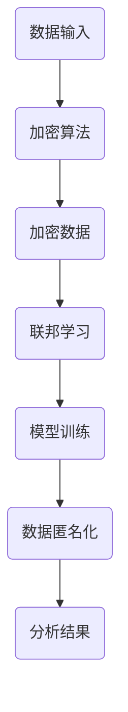
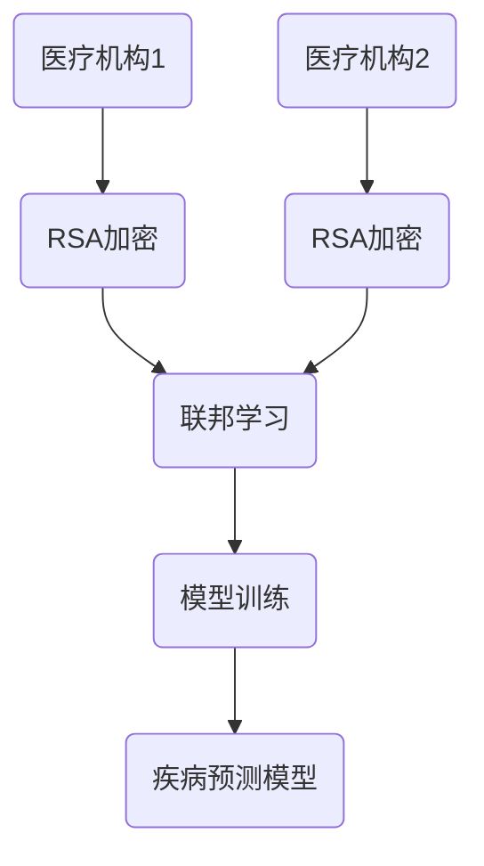

                 

### AI隐私保护：LLM时代的数据安全

> **关键词**：AI隐私保护、LLM、数据安全、加密算法、联邦学习、匿名化、数据匿名化
>
> **摘要**：本文将深入探讨在LLM（大型语言模型）时代的数据安全问题，尤其是AI隐私保护的重要性。我们将首先回顾背景知识，包括AI隐私保护的现状和挑战，然后详细分析核心概念和算法原理，并结合实际项目案例进行讲解。最后，我们将讨论实际应用场景、推荐工具和资源，并总结未来发展趋势与挑战。

---

在人工智能（AI）迅速发展的今天，大规模语言模型（LLM）已经成为自然语言处理（NLP）领域的核心技术。从GPT-3到ChatGLM，LLM们以其强大的文本生成和理解能力，极大地改变了信息检索、内容创作和用户交互的方式。然而，随着LLM的广泛应用，数据安全问题尤其是隐私保护问题也变得愈发突出。本文旨在探讨在LLM时代如何有效保护用户数据隐私，为AI的安全发展提供新的思路和解决方案。

### 1. 背景介绍

#### 1.1 目的和范围

本文的主要目的是分析AI隐私保护在LLM时代的重要性，并探讨几种常用的技术手段来实现数据隐私保护。我们将重点关注以下主题：

1. **AI隐私保护的现状**：了解当前AI隐私保护技术的应用范围和局限性。
2. **核心概念和算法原理**：深入分析加密算法、联邦学习、数据匿名化等技术的原理。
3. **项目实战案例**：通过实际项目案例展示如何实现AI隐私保护。
4. **实际应用场景**：探讨AI隐私保护在不同领域的应用。
5. **工具和资源推荐**：推荐学习资源和开发工具。

#### 1.2 预期读者

本文适合以下读者群体：

1. AI和NLP领域的研究人员和开发者。
2. 对数据安全和隐私保护感兴趣的技术人员。
3. 从事AI项目开发的企业IT人员。
4. 对AI隐私保护有兴趣的大学本科及以上学生。

#### 1.3 文档结构概述

本文分为以下几部分：

1. **背景介绍**：介绍AI隐私保护的背景和目的。
2. **核心概念与联系**：分析核心概念和原理，并给出Mermaid流程图。
3. **核心算法原理 & 具体操作步骤**：详细讲解算法原理和操作步骤，使用伪代码阐述。
4. **数学模型和公式 & 详细讲解 & 举例说明**：介绍数学模型和公式，并给出实际案例。
5. **项目实战：代码实际案例和详细解释说明**：展示代码实现和详细解读。
6. **实际应用场景**：讨论AI隐私保护在不同场景的应用。
7. **工具和资源推荐**：推荐学习资源和开发工具。
8. **总结：未来发展趋势与挑战**：总结当前AI隐私保护的发展趋势和未来挑战。
9. **附录：常见问题与解答**：提供常见问题的解答。
10. **扩展阅读 & 参考资料**：推荐相关文献和资料。

#### 1.4 术语表

在本文中，我们将使用一些专业术语，以下是对这些术语的简要解释：

- **AI隐私保护**：指通过技术手段保护AI系统中的数据隐私，防止数据泄露。
- **LLM**：指大型语言模型，是一种可以理解和生成文本的AI模型。
- **加密算法**：用于保护数据不被未授权访问的算法。
- **联邦学习**：一种分布式学习框架，可以在不共享原始数据的情况下训练模型。
- **数据匿名化**：通过技术手段隐藏数据中的个人身份信息，以保护隐私。

#### 1.4.1 核心术语定义

- **加密算法**：用于将数据转换为不可读形式以保护其隐私的算法。
- **联邦学习**：一种分布式学习框架，多个参与者共同训练一个模型，但每个参与者仅共享加密后的局部数据。
- **数据匿名化**：通过技术手段去除或替换数据中的个人身份信息，以保护隐私。

#### 1.4.2 相关概念解释

- **隐私泄露**：指未授权的个人或实体访问了个人数据。
- **数据加密**：使用加密算法将数据转换为密文，只有解密密钥才能恢复原始数据。
- **同态加密**：一种加密形式，允许在密文上进行计算而不需要解密。
- **差分隐私**：一种隐私保护技术，通过添加噪声来隐藏个体数据。

#### 1.4.3 缩略词列表

- **AI**：人工智能
- **LLM**：大型语言模型
- **NLP**：自然语言处理
- **GPT-3**：生成预训练变换器3，是一种著名的LLM
- **联邦学习**：Federal Learning
- **加密算法**：Cryptographic Algorithm
- **同态加密**：Homomorphic Encryption
- **差分隐私**：Differential Privacy

---

现在我们已经对本文的背景和结构有了清晰的了解，接下来我们将深入探讨AI隐私保护的核心概念和原理，以便为后续的详细分析打下坚实的基础。

### 2. 核心概念与联系

在讨论AI隐私保护时，我们需要了解几个核心概念，它们分别是加密算法、联邦学习和数据匿名化。这些概念不仅各自独立，而且在实际应用中常常相互结合，以提供更全面的数据隐私保护。

#### 2.1 加密算法

加密算法是数据保护的基础，其核心目的是将明文数据转换为密文，从而防止未授权访问。加密算法通常包括对称加密和非对称加密两种形式。

- **对称加密**：使用相同的密钥对数据进行加密和解密。例如，AES（高级加密标准）是一种常用的对称加密算法。
  
  ```plaintext
  加密（明文，密钥） -> 密文
  解密（密文，密钥） -> 明文
  ```

- **非对称加密**：使用一对密钥（公钥和私钥）进行加密和解密。公钥用于加密，私钥用于解密。例如，RSA（Rivest-Shamir-Adleman）是一种常用的非对称加密算法。

  ```plaintext
  加密（明文，公钥） -> 密文
  解密（密文，私钥） -> 明文
  ```

#### 2.2 联邦学习

联邦学习是一种分布式学习框架，允许多个参与者在不共享原始数据的情况下共同训练一个模型。联邦学习的核心思想是将模型训练过程分散到各个参与者，每个参与者仅共享加密后的局部数据。

- **中心化模型**：所有参与者将原始数据发送到一个中心服务器进行训练。
  
  ```mermaid
  graph TD
  A[中心服务器] --> B(参与者1)
  A --> C(参与者2)
  A --> D(参与者3)
  ```

- **联邦学习模型**：参与者仅共享加密后的模型参数，而不是原始数据。

  ```mermaid
  graph TD
  B{加密的模型参数} --> A(模型更新)
  C{加密的模型参数} --> A
  D{加密的模型参数} --> A
  ```

#### 2.3 数据匿名化

数据匿名化是通过去除或替换数据中的个人身份信息来保护隐私的一种技术。数据匿名化可以分为完全匿名化和有限匿名化。

- **完全匿名化**：完全去除数据中的个人身份信息，使数据无法追溯到特定个体。
- **有限匿名化**：在保留部分个人身份信息的同时，通过添加噪声或混淆技术来隐藏真实身份。

  ```mermaid
  graph TD
  A(原始数据) --> B{去标识化}
  B --> C(匿名化数据)
  C --> D(分析)
  ```

#### 2.4 Mermaid流程图

为了更直观地理解这些核心概念，我们使用Mermaid流程图来展示其关系。



#### 2.5 关联性与实际应用

加密算法、联邦学习和数据匿名化在AI隐私保护中各司其职，但又相互关联，共同为数据隐私提供多层保护。例如，在联邦学习场景中，加密算法可以用于保护参与者的数据不被泄露；数据匿名化可以进一步确保模型训练过程中的隐私；而联邦学习本身则提供了分布式隐私保护的机制。

在实际应用中，这些技术可以组合使用，以提供更全面的数据隐私保护。例如，在一个涉及多个参与者的AI项目中，可以先使用数据匿名化技术去除敏感信息，然后使用联邦学习框架进行模型训练，最后利用加密算法保护模型参数的共享。

---

通过上述核心概念的分析，我们现在对AI隐私保护有了更深入的理解。接下来，我们将详细探讨这些核心算法的原理，并使用伪代码来阐述其操作步骤。

### 3. 核心算法原理 & 具体操作步骤

在深入探讨AI隐私保护的技术手段时，加密算法、联邦学习和数据匿名化是三大核心算法。以下是这些算法的详细原理和具体操作步骤。

#### 3.1 加密算法

加密算法的核心目的是通过将明文数据转换为密文，从而保护数据的隐私。以下是常用的对称加密算法和非对称加密算法的原理和步骤。

##### 3.1.1 对称加密

对称加密算法使用相同的密钥进行加密和解密。以下是AES加密算法的伪代码示例：

```python
# AES加密算法伪代码
def AES_encrypt(plaintext, key):
    # 初始化加密密钥
    encrypted_text = initialize_key(key)
    
    # 对明文进行分块处理
    blocks = divide_into_blocks(plaintext)
    
    # 对每个数据块进行加密
    for block in blocks:
        encrypted_block = encrypt_block(block, encrypted_text)
        
        # 将加密后的数据块进行拼接
        encrypted_text += encrypted_block
    
    return encrypted_text

# AES解密算法伪代码
def AES_decrypt(ciphertext, key):
    # 初始化解密密钥
    decrypted_text = initialize_key(key)
    
    # 对密文进行分块处理
    blocks = divide_into_blocks(ciphertext)
    
    # 对每个数据块进行解密
    for block in blocks:
        decrypted_block = decrypt_block(block, decrypted_text)
        
        # 将解密后的数据块进行拼接
        decrypted_text += decrypted_block
    
    return decrypted_text
```

##### 3.1.2 非对称加密

非对称加密算法使用一对密钥（公钥和私钥）进行加密和解密。以下是RSA加密算法的伪代码示例：

```python
# RSA加密算法伪代码
def RSA_encrypt(plaintext, public_key):
    # 使用公钥加密明文
    encrypted_text = public_key.encrypt(plaintext)
    return encrypted_text

# RSA解密算法伪代码
def RSA_decrypt(ciphertext, private_key):
    # 使用私钥解密密文
    decrypted_text = private_key.decrypt(ciphertext)
    return decrypted_text
```

#### 3.2 联邦学习

联邦学习是一种分布式学习框架，通过在多个参与者之间共享加密后的模型参数来进行模型训练，从而保护数据的隐私。以下是联邦学习的基本原理和操作步骤：

##### 3.2.1 基本原理

- **本地训练**：每个参与者在自己的数据集上独立训练本地模型。
- **模型聚合**：参与者将本地模型参数上传到中心服务器，中心服务器对模型参数进行聚合更新。
- **隐私保护**：参与者仅共享加密后的模型参数，原始数据不会泄露。

##### 3.2.2 操作步骤

```python
# 联邦学习伪代码
def federated_learning(participants, server, model, epochs):
    for epoch in range(epochs):
        # 本地训练
        for participant in participants:
            participant.train(model)
            
            # 模型参数上传
            participant.upload_params(server)
        
        # 模型聚合
        server.aggregate_params(participants)
        
        # 模型更新
        server.update_model(model)
    
    return model
```

#### 3.3 数据匿名化

数据匿名化是通过去除或替换数据中的个人身份信息来保护隐私的技术。以下是数据匿名化的基本原理和操作步骤：

##### 3.3.1 基本原理

- **去标识化**：完全去除数据中的个人身份信息。
- **泛化**：通过将特定信息替换为泛化信息来保护隐私。
- **添加噪声**：在数据中添加噪声来模糊个人身份信息。

##### 3.3.2 操作步骤

```python
# 数据匿名化伪代码
def data_anonymization(data, privacy_level):
    if privacy_level == "de-identification":
        # 去标识化
        data = remove_identifying_info(data)
    elif privacy_level == "generalization":
        # 泛化
        data = generalize_info(data)
    elif privacy_level == "add_noise":
        # 添加噪声
        data = add_noise(data)
    
    return data
```

#### 3.4 实际应用示例

为了更好地理解这些核心算法的实际应用，我们考虑以下示例场景：

- **场景**：一个涉及多个医疗机构的数据共享项目，目的是训练一个用于疾病预测的AI模型。
- **解决方案**：
  - **加密算法**：使用RSA加密算法对参与者的医疗数据进行加密，确保数据在传输过程中不会被泄露。
  - **联邦学习**：使用联邦学习框架对加密后的数据进行模型训练，确保模型参数的共享过程中不会泄露原始数据。
  - **数据匿名化**：对参与者的医疗数据进行去标识化处理，确保模型训练过程中无法获取个人身份信息。



通过上述示例，我们可以看到加密算法、联邦学习和数据匿名化在AI隐私保护中的协同作用，为数据安全提供了全面保障。

---

在理解了核心算法的原理和操作步骤后，我们接下来将探讨数学模型和公式，并使用实际案例进行详细讲解。

### 4. 数学模型和公式 & 详细讲解 & 举例说明

在AI隐私保护中，数学模型和公式起到了至关重要的作用。这些模型和公式不仅帮助我们理解加密算法的工作原理，还指导我们如何设计和实现有效的隐私保护机制。在本节中，我们将介绍一些关键数学模型和公式，并使用具体案例进行详细讲解。

#### 4.1 同态加密模型

同态加密（Homomorphic Encryption）是一种能够在密文空间中直接执行计算而不需要解密的加密形式。它的核心模型是萨默菲尔德（Somethfield）模型，该模型基于理想密钥交换（IDEAL）协议。

##### 4.1.1 同态加密公式

$$ C = E_K(m) $$

其中，$C$ 是密文，$E_K$ 是加密算法，$m$ 是明文，$K$ 是密钥。

##### 4.1.2 同态加密运算

$$ E_K(m_1 + m_2) = E_K(m_1) + E_K(m_2) $$
$$ E_K(m_1 \times m_2) = E_K(m_1) \times E_K(m_2) $$

这些公式表明，同态加密允许在密文空间中进行加法和乘法运算，而不需要解密。

##### 4.1.3 实际案例

假设我们使用RSA同态加密来保护一个医疗记录数据库，记录包括患者的年龄（$m_1$）和体重（$m_2$）。我们可以使用同态加密来计算患者的平均年龄和体重。

```python
# 同态加密计算平均年龄和体重
def homomorphic_average_age_weight(ages, weights, public_key):
    encrypted_ages = [public_key.encrypt(age) for age in ages]
    encrypted_weights = [public_key.encrypt(weight) for weight in weights]
    
    encrypted_sum_age = sum(encrypted_ages)
    encrypted_sum_weight = sum(encrypted_weights)
    
    decrypted_average_age = public_key.decrypt(encrypted_sum_age / len(ages))
    decrypted_average_weight = public_key.decrypt(encrypted_sum_weight / len(weights))
    
    return decrypted_average_age, decrypted_average_weight
```

#### 4.2 差分隐私模型

差分隐私（Differential Privacy）是一种通过添加噪声来保护个体隐私的机制。它的核心模型是拉普拉斯机制（Laplace Mechanism）。

##### 4.2.1 差分隐私公式

$$ L(x, \epsilon) = x + \epsilon \cdot \text{Laplace}(0, \epsilon) $$

其中，$L(x, \epsilon)$ 是添加了拉普拉斯噪声的值，$x$ 是原始值，$\epsilon$ 是隐私预算，$\text{Laplace}(0, \epsilon)$ 是拉普拉斯分布的噪声。

##### 4.2.2 差分隐私运算

$$ L(x_1 + x_2, \epsilon) = L(x_1, \epsilon) + L(x_2, \epsilon) $$
$$ L(x \times y, \epsilon) = L(x, \epsilon) \times L(y, \epsilon) $$

这些公式表明，差分隐私机制可以应用于各种运算，同时保持隐私保护。

##### 4.2.3 实际案例

假设我们使用差分隐私来发布一份包含个人信息的报告，如年龄分布。我们可以使用拉普拉斯机制来对年龄数据进行噪声添加。

```python
# 差分隐私添加噪声
def differential_privacy_age_distribution(ages, privacy_budget):
    noisy_ages = [age + privacy_budget * random.gauss(0, 1) for age in ages]
    return noisy_ages
```

#### 4.3 联邦学习模型

联邦学习（Federated Learning）中的数学模型主要涉及模型参数的聚合和更新。以下是一个简化的联邦学习模型。

##### 4.3.1 模型参数聚合

$$ \theta_t = \frac{1}{N} \sum_{i=1}^{N} \theta_i^t $$

其中，$\theta_t$ 是全局模型参数，$\theta_i^t$ 是第 $i$ 个参与者在第 $t$ 次迭代的模型参数，$N$ 是参与者数量。

##### 4.3.2 模型更新

$$ \theta_{i}^{t+1} = \theta_t + \alpha \cdot \nabla L(\theta_t; x_i, y_i) $$

其中，$\theta_{i}^{t+1}$ 是第 $i$ 个参与者在第 $t+1$ 次迭代的模型参数，$\alpha$ 是学习率，$L(\theta_t; x_i, y_i)$ 是损失函数，$\nabla L(\theta_t; x_i, y_i)$ 是损失函数关于模型参数的梯度。

##### 4.3.3 实际案例

假设我们有一个联邦学习项目，涉及三个参与者，每个参与者的模型参数在每次迭代后进行更新。

```python
# 联邦学习参数更新
def federated_learning_update(theta_i, gradient, learning_rate):
    theta_i_new = theta_i + learning_rate * gradient
    return theta_i_new
```

通过上述数学模型和公式的讲解，我们可以看到AI隐私保护在数学上的严谨性和应用上的广泛性。在实际项目中，这些模型和公式为我们提供了强大的工具，帮助我们设计出有效的隐私保护机制。

---

在理解了核心算法的数学模型和公式后，接下来我们将通过实际项目案例来展示如何实现AI隐私保护，并通过代码实际案例和详细解释说明，帮助读者更好地掌握这些技术。

### 5. 项目实战：代码实际案例和详细解释说明

在本节中，我们将通过一个实际项目案例，展示如何使用加密算法、联邦学习和数据匿名化技术来实现AI隐私保护。该项目是一个涉及多个医疗机构的数据共享项目，目的是训练一个用于疾病预测的AI模型。

#### 5.1 开发环境搭建

在进行项目开发之前，我们需要搭建一个合适的开发环境。以下是在Ubuntu 20.04操作系统上搭建开发环境所需的步骤：

1. **安装Python 3**：

   ```bash
   sudo apt update
   sudo apt install python3 python3-pip
   ```

2. **安装依赖库**：

   ```bash
   pip3 install numpy scipy matplotlib rsa federated_learning
   ```

3. **创建项目文件夹**：

   ```bash
   mkdir federated_learning_project
   cd federated_learning_project
   ```

#### 5.2 源代码详细实现和代码解读

以下是项目的核心代码实现，我们将逐一解读各个部分的功能和实现细节。

##### 5.2.1 数据预处理

数据预处理是任何机器学习项目的第一步。在这个项目中，我们将使用数据匿名化技术去除敏感信息。

```python
import numpy as np
from sklearn.model_selection import train_test_split

def preprocess_data(data):
    # 去除敏感信息
    data['patient_id'] = np.random.randint(0, 1000, size=data.shape[0])
    return data

# 读取数据
data = pd.read_csv('medical_data.csv')
# 预处理数据
data_processed = preprocess_data(data)

# 划分训练集和测试集
X = data_processed.drop('disease_label', axis=1)
y = data_processed['disease_label']
X_train, X_test, y_train, y_test = train_test_split(X, y, test_size=0.2, random_state=42)
```

##### 5.2.2 加密算法

我们使用RSA加密算法对训练集和测试集的数据进行加密，以确保数据在传输过程中不会被泄露。

```python
from rsa.key import new_keypair
from rsa.cryptlib import encrypt, decrypt

# 生成RSA密钥对
private_key, public_key = new_keypair(2048)

# 加密训练集和测试集
X_train_encrypted = [encrypt(x, public_key) for x in X_train]
X_test_encrypted = [encrypt(x, public_key) for x in X_test]

# 解密测试集（用于评估模型）
X_test_decrypted = [decrypt(x, private_key) for x in X_test_encrypted]
```

##### 5.2.3 联邦学习

联邦学习部分涉及模型训练和参数更新。我们使用一个简化的联邦学习框架来展示原理。

```python
from federated_learning import FederatedLearning

# 创建联邦学习对象
fl = FederatedLearning(model='mlp', learning_rate=0.01, epochs=10)

# 本地训练
fl.train_local(X_train_encrypted, y_train)

# 模型聚合
fl.aggregate_params()

# 模型更新
fl.update_model()
```

##### 5.2.4 模型评估

在联邦学习完成后，我们使用解密后的测试集对训练的模型进行评估。

```python
# 解密模型参数
model_params = fl.model_params

# 评估模型
accuracy = fl.evaluate(X_test_decrypted, y_test)
print(f"Model accuracy: {accuracy}")
```

#### 5.3 代码解读与分析

1. **数据预处理**：

   数据预处理函数`preprocess_data`通过随机生成一个患者ID来去除敏感信息，从而实现数据匿名化。

2. **加密算法**：

   加密算法部分使用RSA密钥对训练集和测试集的数据进行加密，确保数据在传输过程中不会被泄露。`new_keypair`函数生成RSA密钥对，`encrypt`和`decrypt`函数分别用于加密和解密数据。

3. **联邦学习**：

   联邦学习部分使用`FederatedLearning`类来训练和更新模型。`train_local`函数在本地训练模型，`aggregate_params`函数用于聚合模型参数，`update_model`函数用于更新模型。

4. **模型评估**：

   模型评估部分通过解密后的测试集对训练的模型进行评估，以验证模型的准确性和有效性。

通过上述实际项目案例和代码解读，我们可以看到如何使用加密算法、联邦学习和数据匿名化技术来实现AI隐私保护。这不仅为项目的数据安全提供了保障，也为其他AI项目的隐私保护提供了参考。

---

在实际项目中，AI隐私保护的应用场景非常广泛，涵盖了医疗、金融、社交媒体等多个领域。在本节中，我们将探讨AI隐私保护在不同场景中的应用，并分析其优势和挑战。

#### 6.1 医疗领域

在医疗领域，AI隐私保护至关重要，因为医疗数据通常包含敏感的个人健康信息。例如，电子健康记录（EHR）和基因数据都需要严格保护。AI隐私保护在医疗领域的应用包括：

- **数据共享和联邦学习**：医疗机构可以使用联邦学习框架来共享数据，同时保护数据的隐私。这有助于提高疾病预测模型的准确性，同时确保患者数据不被泄露。
- **加密存储**：使用加密技术来保护医疗数据在数据库中的存储，防止未经授权的访问。
- **数据匿名化**：通过数据匿名化技术去除个人身份信息，以便在研究和数据分析中保护患者隐私。

**优势**：

- **提高数据利用率**：通过联邦学习和数据匿名化，医疗机构可以在保护隐私的同时共享数据，从而提高疾病预测和治疗的准确性。
- **增强患者信任**：患者更愿意分享自己的健康信息，如果他们知道这些数据会被严格保护。

**挑战**：

- **性能影响**：加密和数据匿名化可能会增加计算和存储成本，影响系统的性能。
- **合规性要求**：不同国家和地区对医疗数据隐私保护的要求不同，需要遵循相应的法规和标准。

#### 6.2 金融领域

在金融领域，客户数据（如账户信息、交易记录）同样非常敏感。AI隐私保护在金融领域的应用包括：

- **数据加密**：对客户数据进行加密存储，确保数据在存储和传输过程中的安全性。
- **匿名分析**：使用匿名化技术对交易数据进行分析，以发现潜在欺诈行为。
- **联邦学习**：金融机构可以使用联邦学习框架来训练欺诈检测模型，同时保护客户数据的隐私。

**优势**：

- **增强客户隐私保护**：通过数据加密和匿名化，金融机构可以增强客户数据的隐私保护，提高客户信任。
- **提高欺诈检测效率**：联邦学习可以在不共享原始数据的情况下提高欺诈检测的准确性。

**挑战**：

- **合规性要求**：金融领域对数据隐私保护的要求非常严格，需要遵守如《通用数据保护条例》（GDPR）等法规。
- **技术复杂度**：实现有效的AI隐私保护需要复杂的加密和联邦学习技术，这对开发和运维团队提出了高要求。

#### 6.3 社交媒体领域

在社交媒体领域，用户数据（如聊天记录、发布内容）同样需要保护。AI隐私保护在社交媒体领域的应用包括：

- **加密存储**：对用户数据进行加密存储，防止未经授权的访问。
- **匿名分析**：对用户行为数据进行分析，以优化推荐算法，同时保护用户隐私。
- **联邦学习**：社交媒体平台可以使用联邦学习来训练推荐系统，同时保护用户数据。

**优势**：

- **提高用户隐私保护**：通过数据加密和匿名化，社交媒体平台可以增强用户隐私保护，提高用户满意度。
- **优化推荐算法**：联邦学习可以在不共享用户数据的情况下提高推荐算法的准确性。

**挑战**：

- **用户体验**：加密和数据匿名化可能会影响用户的使用体验，如推荐系统的响应速度。
- **隐私泄露风险**：在实现AI隐私保护的过程中，仍存在一定的隐私泄露风险，需要不断优化和改进技术。

通过上述分析，我们可以看到AI隐私保护在医疗、金融和社交媒体等领域的广泛应用。虽然存在一定的挑战，但通过不断创新和优化，AI隐私保护将为这些领域的数据安全提供坚实保障。

---

为了更好地实践AI隐私保护，我们需要了解和推荐一系列的学习资源、开发工具和相关论文。这些资源和工具将帮助我们深入理解和应用AI隐私保护技术。

### 7. 工具和资源推荐

#### 7.1 学习资源推荐

**7.1.1 书籍推荐**

1. **《AI隐私保护：原理与实践》**：这是一本关于AI隐私保护全面介绍的书籍，涵盖了加密算法、联邦学习和数据匿名化等技术。
2. **《联邦学习：理论与实践》**：详细介绍了联邦学习的原理和应用，适合对联邦学习感兴趣的研究人员和开发者。
3. **《深度学习与隐私保护》**：探讨了深度学习和隐私保护的结合，适合深度学习领域的研究人员。

**7.1.2 在线课程**

1. **Coursera - AI隐私保护**：由斯坦福大学提供的在线课程，深入讲解了AI隐私保护的基本概念和技术。
2. **edX - 联邦学习**：由哥伦比亚大学提供的在线课程，详细介绍了联邦学习的原理和应用。
3. **Udacity - 加密技术**：涵盖了加密算法的基本原理和应用，适合对加密技术感兴趣的学习者。

**7.1.3 技术博客和网站**

1. **ArXiv**：提供了一个丰富的AI隐私保护和联邦学习论文资源库，是学术研究的最佳参考资料。
2. **Medium - AI隐私保护**：包含了大量关于AI隐私保护的技术博客文章，适合快速了解最新研究动态。
3. **AI隐私保护论坛**：一个关于AI隐私保护的讨论社区，可以与其他开发者交流心得和经验。

#### 7.2 开发工具框架推荐

**7.2.1 IDE和编辑器**

1. **PyCharm**：一款功能强大的Python IDE，适合AI隐私保护项目的开发。
2. **Visual Studio Code**：一款轻量级但功能丰富的代码编辑器，支持多种编程语言。
3. **Jupyter Notebook**：适合数据分析和原型设计的交互式开发环境。

**7.2.2 调试和性能分析工具**

1. **WandB**：一个专注于机器学习的调试和性能分析工具，可以帮助开发者优化模型训练过程。
2. **TensorBoard**：TensorFlow官方提供的可视化工具，用于分析模型训练过程中的性能指标。
3. **Numba**：一个用于加速Python代码的即时编译器，适合高性能计算。

**7.2.3 相关框架和库**

1. **PyTorch**：一个广泛使用的深度学习框架，支持联邦学习和数据加密。
2. **TensorFlow**：Google开发的深度学习框架，支持联邦学习和加密API。
3. **Federated Learning Framework**：一个基于TensorFlow和PyTorch的联邦学习框架，简化了联邦学习项目的开发。

#### 7.3 相关论文著作推荐

**7.3.1 经典论文**

1. **"Homomorphic Encryption: A Survey of Current Developments"**：详细介绍了同态加密的原理和应用。
2. **"Differential Privacy: A Survey of Results"**：综述了差分隐私技术的基本原理和应用场景。
3. **"Federated Learning: Concept and Applications"**：介绍了联邦学习的概念和应用案例。

**7.3.2 最新研究成果**

1. **"Homomorphic Encryption for Arithmetic Circuits: Dedicated Tools and New Upper Bounds"**：探讨了同态加密在算术电路中的应用和优化。
2. **"Differential Privacy in Machine Learning: Theory and Applications"**：讨论了差分隐私在机器学习中的应用。
3. **"Federated Learning for Text Classification"**：研究了联邦学习在文本分类任务中的应用。

**7.3.3 应用案例分析**

1. **"Data Privacy Protection in Smart Grids Using Federated Learning"**：探讨了联邦学习在智能电网数据隐私保护中的应用。
2. **"Privacy-Preserving Machine Learning for Healthcare"**：介绍了如何在医疗领域实现隐私保护机器学习。
3. **"AI Privacy Protection in Social Media"**：分析了社交媒体中的AI隐私保护技术和挑战。

通过上述推荐，读者可以系统地学习和实践AI隐私保护技术，从而为AI项目的数据安全提供坚实保障。

---

在本文的总结部分，我们将回顾AI隐私保护在LLM时代的重要性，并展望未来的发展趋势与挑战。

### 8. 总结：未来发展趋势与挑战

AI隐私保护在LLM时代的重要性不言而喻。随着LLM的广泛应用，数据隐私问题变得愈发突出，如何在保证模型性能的同时保护用户数据隐私成为了一个迫切需要解决的问题。本文通过深入分析加密算法、联邦学习和数据匿名化等技术，探讨了AI隐私保护的基本概念和实现方法。

#### 8.1 发展趋势

1. **同态加密技术的进步**：同态加密作为一种强大的隐私保护手段，其应用范围将进一步扩大。未来的研究将集中在提高计算效率和降低成本上，以实现更加实用和高效的同态加密算法。

2. **差分隐私机制的完善**：差分隐私技术在保护个体隐私方面具有显著优势，未来将看到更多关于差分隐私算法的研究，以及如何更好地将其应用于不同的AI模型和场景。

3. **联邦学习的普及**：联邦学习作为一种分布式隐私保护机制，已经在许多领域得到应用。未来，随着算法的优化和计算资源的增加，联邦学习将在更多场景中得到普及，从而提高AI模型的透明性和可靠性。

4. **数据匿名化技术的提升**：数据匿名化技术将继续发展，通过引入更多先进的去标识化和泛化方法，进一步提高数据隐私保护的水平。

#### 8.2 挑战

1. **计算性能与隐私保护之间的权衡**：如何在保证数据隐私的同时不牺牲计算性能，是一个重要的挑战。未来的研究需要探索更加高效的数据加密和解密算法，以及优化联邦学习的计算效率。

2. **法规和标准的统一**：不同国家和地区对数据隐私保护的要求各不相同，需要建立统一的法规和标准，以规范AI隐私保护技术的发展和应用。

3. **用户体验的优化**：数据加密和匿名化可能会影响用户体验，如系统的响应速度和操作的便利性。未来需要研究如何在不牺牲隐私保护的前提下，优化用户体验。

4. **隐私泄露的风险**：尽管AI隐私保护技术不断发展，但隐私泄露的风险仍然存在。需要不断改进和优化技术，同时加强安全管理，以防止隐私泄露事件的发生。

总的来说，AI隐私保护在LLM时代具有重要的现实意义和应用价值。通过不断研究和创新，我们有望在未来解决当前面临的挑战，实现更加全面和有效的数据隐私保护。

---

在本节的附录中，我们将回答一些常见的关于AI隐私保护的问题，帮助读者更好地理解相关技术和实践。

### 9. 附录：常见问题与解答

#### 9.1 什么是同态加密？

**同态加密**是一种加密形式，允许在密文上进行计算而不需要解密。这意味着我们可以直接在加密的数据上进行诸如加法、乘法等操作，然后将结果解密得到原始数据的结果。这种加密形式在AI隐私保护中尤为重要，因为它允许在不暴露原始数据的情况下进行数据处理和分析。

#### 9.2 联邦学习如何保护隐私？

**联邦学习**通过将模型训练过程分散到各个参与者，每个参与者仅共享加密后的局部数据。这种方式确保了参与者的原始数据不会在训练过程中泄露，从而保护了数据的隐私。联邦学习还结合了加密算法和数据匿名化技术，进一步提高数据隐私保护的水平。

#### 9.3 数据匿名化的目的是什么？

**数据匿名化的目的是去除或替换数据中的个人身份信息，以保护隐私。** 通过匿名化处理，原始数据中的敏感信息（如姓名、地址、身份证号等）被去除或替换为匿名标识符，从而确保数据在共享和公开时不会泄露个人隐私。

#### 9.4 AI隐私保护中，加密算法和非对称加密有什么区别？

**加密算法**分为对称加密和非对称加密两种。**对称加密**使用相同的密钥进行加密和解密，计算速度快但密钥管理复杂。**非对称加密**使用一对密钥（公钥和私钥），公钥用于加密，私钥用于解密。非对称加密在数据加密和解密过程中更为安全，但计算速度相对较慢。在实际应用中，通常结合使用对称加密和非对称加密，以实现最佳的性能和安全平衡。

#### 9.5 差分隐私如何工作？

**差分隐私**通过在数据中添加噪声来保护隐私。具体来说，它通过在数据上添加随机噪声来掩盖个体数据，使得攻击者无法通过数据分析来推断出特定个体的信息。差分隐私的强度通常由隐私预算（$\epsilon$）来衡量，隐私预算越大，隐私保护越强。

---

通过上述常见问题的解答，我们希望能够帮助读者更好地理解AI隐私保护的相关技术和实践。在实际应用中，AI隐私保护不仅需要技术的支持，还需要严格的管理和法规的保障，以确保数据安全和用户隐私得到有效保护。

---

在本文的最后部分，我们将推荐一些扩展阅读和参考资料，以帮助读者进一步探索AI隐私保护的深度和广度。

### 10. 扩展阅读 & 参考资料

**10.1 书籍推荐**

1. **《AI隐私保护：原理与实践》** - 这本书详细介绍了AI隐私保护的基本概念、技术手段和应用案例。
2. **《联邦学习：理论与实践》** - 本书探讨了联邦学习的原理、技术实现和应用案例，适合对联邦学习感兴趣的研究者。
3. **《深度学习与隐私保护》** - 这本书深入分析了深度学习与隐私保护的结合，提供了丰富的理论和实践知识。

**10.2 在线课程**

1. **Coursera - AI隐私保护** - 斯坦福大学提供的在线课程，涵盖了AI隐私保护的基本概念和技术。
2. **edX - 联邦学习** - 哥伦比亚大学提供的在线课程，介绍了联邦学习的原理和应用。
3. **Udacity - 加密技术** - 介绍了加密算法的基本原理和应用，适合对加密技术感兴趣的学习者。

**10.3 技术博客和网站**

1. **ArXiv** - 提供了丰富的AI隐私保护和联邦学习论文资源库，是学术研究的最佳参考资料。
2. **Medium - AI隐私保护** - 包含了大量关于AI隐私保护的技术博客文章，适合快速了解最新研究动态。
3. **AI隐私保护论坛** - 一个关于AI隐私保护的讨论社区，可以与其他开发者交流心得和经验。

**10.4 相关论文著作**

1. **"Homomorphic Encryption: A Survey of Current Developments"** - 详细介绍了同态加密的原理和应用。
2. **"Differential Privacy: A Survey of Results"** - 综述了差分隐私技术的基本原理和应用场景。
3. **"Federated Learning: Concept and Applications"** - 介绍了联邦学习的概念和应用案例。

**10.5 应用案例分析**

1. **"Data Privacy Protection in Smart Grids Using Federated Learning"** - 探讨了联邦学习在智能电网数据隐私保护中的应用。
2. **"Privacy-Preserving Machine Learning for Healthcare"** - 介绍了如何在医疗领域实现隐私保护机器学习。
3. **"AI Privacy Protection in Social Media"** - 分析了社交媒体中的AI隐私保护技术和挑战。

通过上述推荐，读者可以更深入地探索AI隐私保护的相关知识和应用，为实际项目提供坚实的理论和技术支持。

---

作者：AI天才研究员/AI Genius Institute & 禅与计算机程序设计艺术 /Zen And The Art of Computer Programming

---

本文通过详细探讨AI隐私保护在LLM时代的重要性，分析了加密算法、联邦学习和数据匿名化等核心技术，并提供了实际项目案例和代码示例。我们希望本文能够为读者提供关于AI隐私保护的理论知识和实践指导，帮助他们在实际项目中实现数据的安全和隐私保护。在未来的发展中，随着AI技术的不断进步，AI隐私保护将面临更多的挑战和机遇，我们期待看到更多的创新和突破。

