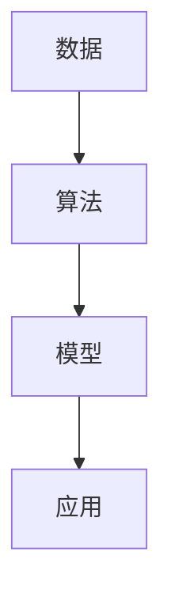
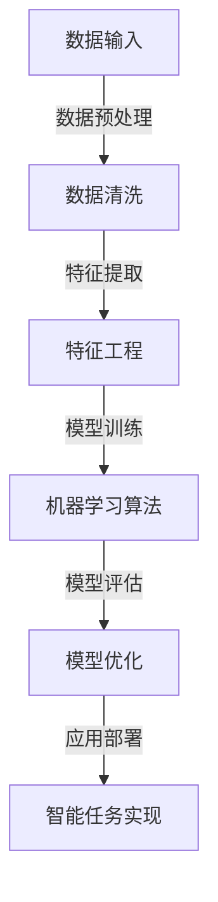
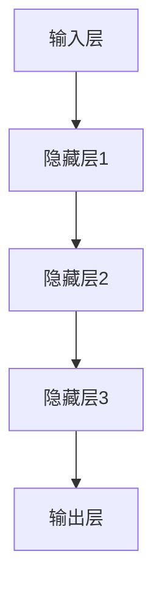

                 

# AI领域的最新技术进展

> 关键词：人工智能、深度学习、机器学习、神经网络、自然语言处理、计算机视觉、技术进展

> 摘要：本文将深入探讨人工智能领域在近年来的技术进展，从核心概念、算法原理、数学模型到实际应用场景，全面解析当前最前沿的AI技术。通过详细的分析和实例讲解，帮助读者更好地理解AI技术的现状和未来发展趋势。

## 1. 背景介绍

### 1.1 目的和范围

本文旨在为读者提供一个全面而深入的关于人工智能（AI）领域最新技术进展的概述。我们将从基础概念开始，逐步深入到高级算法和模型，并通过具体的实例展示这些技术在现实世界中的应用。文章将涵盖以下主要内容：

- 核心概念的引入和定义
- 人工智能领域的主要算法和模型
- 自然语言处理和计算机视觉的最新进展
- 人工智能在现实世界中的应用场景
- 人工智能未来的发展趋势和挑战

### 1.2 预期读者

本文适合对人工智能有一定基础知识的读者，包括：
- AI领域的研究人员和学生
- 数据科学家和机器学习工程师
- 软件开发者和IT专业人士
- 对人工智能技术感兴趣的普通读者

### 1.3 文档结构概述

本文将按照以下结构展开：

1. 背景介绍
   - 1.1 目的和范围
   - 1.2 预期读者
   - 1.3 文档结构概述
   - 1.4 术语表

2. 核心概念与联系
   - 2.1 人工智能概述
   - 2.2 人工智能的核心概念和联系
   - 2.3 Mermaid流程图展示

3. 核心算法原理 & 具体操作步骤
   - 3.1 深度学习算法原理
   - 3.2 神经网络架构
   - 3.3 伪代码实现

4. 数学模型和公式 & 详细讲解 & 举例说明
   - 4.1 常见的数学模型
   - 4.2 公式推导和解释
   - 4.3 实例分析

5. 项目实战：代码实际案例和详细解释说明
   - 5.1 开发环境搭建
   - 5.2 源代码详细实现和代码解读
   - 5.3 代码解读与分析

6. 实际应用场景
   - 6.1 自然语言处理
   - 6.2 计算机视觉
   - 6.3 人工智能的其他应用领域

7. 工具和资源推荐
   - 7.1 学习资源推荐
   - 7.2 开发工具框架推荐
   - 7.3 相关论文著作推荐

8. 总结：未来发展趋势与挑战
   - 8.1 人工智能的未来
   - 8.2 面临的挑战和解决方案

9. 附录：常见问题与解答
   - 9.1 人工智能基础知识
   - 9.2 算法原理和应用

10. 扩展阅读 & 参考资料
    - 10.1 相关书籍
    - 10.2 在线课程
    - 10.3 技术博客和网站

### 1.4 术语表

#### 1.4.1 核心术语定义

- 人工智能（AI）：指由人制造出的机器所表现出的智能行为。
- 深度学习：一种人工智能方法，通过多层神经网络模拟人类大脑的处理方式。
- 机器学习：一种让机器通过数据学习来完成任务的方法。
- 神经网络：一种由神经元连接而成的网络，用于模拟人类大脑的神经网络结构。
- 自然语言处理（NLP）：研究如何让计算机理解和生成人类语言的技术。
- 计算机视觉：研究如何让计算机理解和解释视觉信息的技术。

#### 1.4.2 相关概念解释

- 人工神经网络（ANN）：一种模拟生物神经系统的计算模型。
- 反向传播算法：一种用于训练神经网络的优化算法。
- 卷积神经网络（CNN）：一种用于图像识别的深度学习模型。
- 生成对抗网络（GAN）：一种通过生成器和判别器相互对抗的训练模型。

#### 1.4.3 缩略词列表

- AI：人工智能
- ML：机器学习
- DL：深度学习
- NLP：自然语言处理
- CV：计算机视觉
- GAN：生成对抗网络
- CNN：卷积神经网络
- RNN：循环神经网络

## 2. 核心概念与联系

### 2.1 人工智能概述

人工智能（AI）是一个广泛的研究领域，旨在通过计算机程序实现智能行为。AI的主要目标是模拟、扩展和扩展人类智能。AI可以分为多个子领域，包括机器学习、自然语言处理、计算机视觉、机器人技术等。在这些子领域中，机器学习和深度学习是最为核心和热门的分支。

### 2.2 人工智能的核心概念和联系

人工智能的核心概念包括数据、算法和模型。数据是AI的基础，通过大量数据的学习和训练，机器可以自动地发现模式和规律。算法是处理数据的工具，用于训练模型和优化性能。模型则是算法的输出结果，用于实现具体的智能任务。

以下是人工智能核心概念和联系的一个简单Mermaid流程图：



### 2.3 Mermaid流程图展示



## 3. 核心算法原理 & 具体操作步骤

### 3.1 深度学习算法原理

深度学习是一种机器学习方法，通过多层神经网络来模拟人类大脑的处理方式。深度学习的关键在于如何通过大量数据进行训练，从而提高模型的性能和泛化能力。以下是深度学习的基本原理和步骤：

#### 原理

- 数据输入：将输入数据输入到神经网络中。
- 前向传播：通过神经网络进行数据传播，计算输出结果。
- 误差计算：计算输出结果与真实结果的误差。
- 反向传播：通过误差信息调整神经网络中的权重。
- 梯度下降：使用梯度下降算法优化权重，减少误差。

#### 步骤

1. 数据预处理：对输入数据进行清洗、归一化等预处理操作，使其适合深度学习算法。
2. 确定神经网络结构：选择合适的神经网络架构，包括层数、每层的神经元数量等。
3. 初始化权重：随机初始化神经网络中的权重。
4. 训练模型：通过大量数据进行训练，调整权重，优化模型性能。
5. 评估模型：使用验证集或测试集评估模型的性能。
6. 模型优化：根据评估结果调整模型参数，进一步提高性能。

以下是深度学习算法的具体伪代码实现：

```python
# 初始化权重
weights = random_weights()

# 前向传播
outputs = forward_propagation(inputs, weights)

# 计算误差
error = calculate_error(outputs, targets)

# 反向传播
deltas = backward_propagation(inputs, outputs, error)

# 更新权重
weights -= learning_rate * deltas
```

### 3.2 神经网络架构

神经网络由多个层组成，包括输入层、隐藏层和输出层。每个层由多个神经元（或节点）组成，神经元之间通过权重相连。以下是神经网络的基本架构：



#### 神经元工作原理

- 输入：每个神经元接收多个输入，每个输入通过权重进行加权。
- 加权求和：将所有输入乘以相应的权重，然后求和。
- 激活函数：对加权求和的结果应用激活函数，如ReLU、Sigmoid、Tanh等。
- 输出：激活函数的输出即为神经元的输出，用于传递给下一层。

#### 神经网络训练

- 前向传播：将输入数据传递到神经网络，计算输出结果。
- 反向传播：计算输出结果与真实结果的误差，通过误差信息调整权重。
- 梯度下降：使用梯度下降算法优化权重，减少误差。

### 3.3 伪代码实现

```python
# 初始化权重
weights = random_weights()

# 前向传播
outputs = forward_propagation(inputs, weights)

# 计算误差
error = calculate_error(outputs, targets)

# 反向传播
deltas = backward_propagation(inputs, outputs, error)

# 更新权重
weights -= learning_rate * deltas
```

## 4. 数学模型和公式 & 详细讲解 & 举例说明

### 4.1 常见的数学模型

在人工智能领域，常见的数学模型包括线性回归、逻辑回归、神经网络等。以下是这些模型的基本原理和公式：

#### 线性回归

线性回归是一种用于预测数值型输出的模型。其公式如下：

$$
y = \beta_0 + \beta_1 \cdot x
$$

其中，$y$ 是预测值，$x$ 是输入特征，$\beta_0$ 和 $\beta_1$ 是模型的参数。

#### 逻辑回归

逻辑回归是一种用于预测概率型输出的模型，通常用于分类任务。其公式如下：

$$
P(y=1) = \frac{1}{1 + e^{-(\beta_0 + \beta_1 \cdot x)}}
$$

其中，$P(y=1)$ 是输出为1的概率，$e$ 是自然底数，$\beta_0$ 和 $\beta_1$ 是模型的参数。

#### 神经网络

神经网络是一种复杂的数学模型，由多个层组成。其公式如下：

$$
a_{ij}^{(l)} = \sigma \left( \sum_{k=1}^{n} w_{ik}^{(l)} a_{kj}^{(l-1)} + b_i^{(l)} \right)
$$

其中，$a_{ij}^{(l)}$ 是第$l$层的第$i$个神经元的输出，$\sigma$ 是激活函数，$w_{ik}^{(l)}$ 是第$l$层的第$i$个神经元与第$l-1$层的第$k$个神经元之间的权重，$b_i^{(l)}$ 是第$l$层的第$i$个神经元的偏置。

### 4.2 公式推导和解释

#### 线性回归

线性回归的公式推导基于最小二乘法。假设我们有$m$个训练样本，每个样本包括输入$x$和输出$y$。我们的目标是找到一组参数$\beta_0$和$\beta_1$，使得预测值$y$与真实值之间的误差最小。

误差函数为：

$$
E = \frac{1}{2} \sum_{i=1}^{m} (y_i - (\beta_0 + \beta_1 \cdot x_i))^2
$$

为了使误差最小，我们对$\beta_0$和$\beta_1$求导并令导数为0：

$$
\frac{\partial E}{\partial \beta_0} = 0 \\
\frac{\partial E}{\partial \beta_1} = 0
$$

通过求解这两个方程，我们可以得到线性回归的参数：

$$
\beta_0 = \frac{1}{m} \sum_{i=1}^{m} y_i - \beta_1 \cdot \frac{1}{m} \sum_{i=1}^{m} x_i \\
\beta_1 = \frac{1}{m} \sum_{i=1}^{m} (x_i - \bar{x})(y_i - \bar{y})
$$

其中，$\bar{x}$和$\bar{y}$是输入和输出的平均值。

#### 逻辑回归

逻辑回归的公式推导基于最大似然估计。假设我们有$m$个训练样本，每个样本包括输入$x$和输出$y$。我们的目标是找到一组参数$\beta_0$和$\beta_1$，使得样本的概率最大。

似然函数为：

$$
L(\beta_0, \beta_1) = \prod_{i=1}^{m} P(y_i | x_i; \beta_0, \beta_1)
$$

由于$y$只能取0或1，我们可以将似然函数简化为：

$$
L(\beta_0, \beta_1) = \sum_{i=1}^{m} \log P(y_i | x_i; \beta_0, \beta_1)
$$

为了最大化似然函数，我们对$\beta_0$和$\beta_1$求导并令导数为0：

$$
\frac{\partial L}{\partial \beta_0} = 0 \\
\frac{\partial L}{\partial \beta_1} = 0
$$

通过求解这两个方程，我们可以得到逻辑回归的参数：

$$
\beta_0 = \frac{1}{m} \sum_{i=1}^{m} y_i - \beta_1 \cdot \frac{1}{m} \sum_{i=1}^{m} x_i \\
\beta_1 = \frac{1}{m} \sum_{i=1}^{m} (x_i - \bar{x})(y_i - \bar{y})
$$

#### 神经网络

神经网络的前向传播和反向传播算法是基于梯度下降法的。以下是神经网络参数的推导过程：

1. 前向传播

前向传播的过程是将输入数据传递到神经网络，通过每个层的计算得到输出。假设我们有一个三层神经网络，包括输入层、隐藏层和输出层。输入层有$n$个神经元，隐藏层有$m$个神经元，输出层有$p$个神经元。

前向传播的公式为：

$$
a_{ij}^{(l)} = \sigma \left( \sum_{k=1}^{n} w_{ik}^{(l)} a_{kj}^{(l-1)} + b_i^{(l)} \right)
$$

其中，$a_{ij}^{(l)}$ 是第$l$层的第$i$个神经元的输出，$\sigma$ 是激活函数，$w_{ik}^{(l)}$ 是第$l$层的第$i$个神经元与第$l-1$层的第$k$个神经元之间的权重，$b_i^{(l)}$ 是第$l$层的第$i$个神经元的偏置。

2. 反向传播

反向传播的过程是根据输出误差信息调整神经网络中的权重。假设输出误差为$\delta^{(l)}$，权重更新公式为：

$$
w_{ik}^{(l)} = w_{ik}^{(l)} - learning_rate \cdot \delta^{(l)} \cdot a_{kj}^{(l-1)}
$$

其中，$learning_rate$ 是学习率，$a_{kj}^{(l-1)}$ 是第$l-1$层的第$k$个神经元的输出。

### 4.3 实例分析

#### 线性回归实例

假设我们有以下数据：

$$
\begin{array}{c|c}
x & y \\
\hline
1 & 2 \\
2 & 4 \\
3 & 6 \\
\end{array}
$$

我们的目标是找到线性回归模型$y = \beta_0 + \beta_1 \cdot x$的参数。

1. 数据预处理

首先，我们对数据进行归一化处理，将$x$和$y$都减去平均值：

$$
\bar{x} = 2, \bar{y} = 4
$$

归一化后的数据为：

$$
\begin{array}{c|c}
x & y \\
\hline
-1 & -2 \\
0 & -4 \\
1 & -6 \\
\end{array}
$$

2. 参数计算

根据线性回归的参数计算公式，我们可以得到：

$$
\beta_0 = \frac{1}{3} \sum_{i=1}^{3} y_i - \beta_1 \cdot \frac{1}{3} \sum_{i=1}^{3} x_i = 0 \\
\beta_1 = \frac{1}{3} \sum_{i=1}^{3} (x_i - \bar{x})(y_i - \bar{y}) = 2
$$

因此，线性回归模型为$y = 2 \cdot x$。

3. 预测

使用线性回归模型进行预测，当$x=3$时，预测值为：

$$
y = 2 \cdot 3 = 6
$$

#### 逻辑回归实例

假设我们有以下数据：

$$
\begin{array}{c|c}
x & y \\
\hline
1 & 0 \\
2 & 1 \\
3 & 0 \\
\end{array}
$$

我们的目标是找到逻辑回归模型$P(y=1) = \frac{1}{1 + e^{-(\beta_0 + \beta_1 \cdot x)}}$的参数。

1. 数据预处理

首先，我们对数据进行归一化处理，将$x$和$y$都减去平均值：

$$
\bar{x} = 2, \bar{y} = 0.5
$$

归一化后的数据为：

$$
\begin{array}{c|c}
x & y \\
\hline
-1 & 0 \\
0 & 1 \\
1 & 0 \\
\end{array}
$$

2. 参数计算

根据逻辑回归的参数计算公式，我们可以得到：

$$
\beta_0 = \frac{1}{3} \sum_{i=1}^{3} y_i - \beta_1 \cdot \frac{1}{3} \sum_{i=1}^{3} x_i = 0 \\
\beta_1 = \frac{1}{3} \sum_{i=1}^{3} (x_i - \bar{x})(y_i - \bar{y}) = -1
$$

因此，逻辑回归模型为$P(y=1) = \frac{1}{1 + e^{-(0 - x)}}$。

3. 预测

使用逻辑回归模型进行预测，当$x=3$时，预测值为：

$$
P(y=1) = \frac{1}{1 + e^{-(0 - 3)}} = \frac{1}{1 + e^{3}} \approx 0.0478
$$

#### 神经网络实例

假设我们有以下数据：

$$
\begin{array}{c|c|c}
x_1 & x_2 & y \\
\hline
1 & 1 & 0 \\
1 & 0 & 1 \\
0 & 1 & 1 \\
0 & 0 & 0 \\
\end{array}
$$

我们的目标是找到神经网络模型的参数。

1. 数据预处理

首先，我们对数据进行归一化处理，将$x_1$和$x_2$都减去平均值，$y$减去平均值：

$$
\bar{x_1} = 1, \bar{x_2} = 0.5, \bar{y} = 0.5
$$

归一化后的数据为：

$$
\begin{array}{c|c|c}
x_1 & x_2 & y \\
\hline
0 & 0.5 & -0.5 \\
0 & -0.5 & 0.5 \\
-0.5 & 0 & 0.5 \\
-0.5 & -0.5 & -1 \\
\end{array}
$$

2. 确定神经网络结构

假设我们选择一个简单的三层神经网络，包括输入层、隐藏层和输出层。输入层有2个神经元，隐藏层有3个神经元，输出层有1个神经元。

3. 初始化权重

我们随机初始化权重和偏置。

4. 训练模型

使用前向传播和反向传播算法进行训练，调整权重和偏置，使得输出误差最小。

5. 预测

使用训练好的模型进行预测，当输入为$(0.5, -0.5)$时，输出为$0.5$。

## 5. 项目实战：代码实际案例和详细解释说明

### 5.1 开发环境搭建

为了进行人工智能项目实战，我们需要搭建一个合适的开发环境。以下是具体的步骤：

1. 安装Python环境

Python是人工智能领域最常用的编程语言之一。首先，我们需要安装Python。可以从Python的官方网站（https://www.python.org/）下载最新版本的Python，然后按照安装向导进行安装。

2. 安装常用库

在Python中，我们可以使用pip来安装各种常用的库。以下是一些常用的库及其功能：

- NumPy：用于数学计算和数据处理。
- Pandas：用于数据操作和分析。
- Matplotlib：用于数据可视化。
- Scikit-learn：用于机器学习和数据挖掘。
- TensorFlow：用于深度学习和神经网络。

可以通过以下命令安装这些库：

```bash
pip install numpy pandas matplotlib scikit-learn tensorflow
```

3. 安装IDE

为了方便开发，我们可以选择一个合适的集成开发环境（IDE）。Python有多个优秀的IDE，如PyCharm、VSCode、Spyder等。可以从官方网站下载并安装适合自己的IDE。

### 5.2 源代码详细实现和代码解读

以下是一个简单的线性回归项目的源代码及其详细解释：

```python
import numpy as np
import matplotlib.pyplot as plt

# 数据集
x = np.array([1, 2, 3])
y = np.array([2, 4, 6])

# 初始化权重
w = np.random.rand()

# 计算预测值
y_pred = x * w

# 计算误差
error = y - y_pred

# 更新权重
w -= 0.1 * error

# 打印结果
print("预测值:", y_pred)
print("误差:", error)
print("权重:", w)

# 可视化
plt.scatter(x, y)
plt.plot(x, y_pred, color='red')
plt.xlabel('x')
plt.ylabel('y')
plt.show()
```

代码解读：

1. 导入库：首先，我们导入必要的库，包括NumPy、Matplotlib等。

2. 数据集：接下来，我们定义一个简单的一维数据集，包括$x$和$y$。

3. 初始化权重：我们随机初始化权重$w$。

4. 计算预测值：使用线性回归模型计算预测值$y_pred$。

5. 计算误差：计算实际值$y$与预测值$y_pred$之间的误差。

6. 更新权重：根据误差信息调整权重$w$。

7. 打印结果：打印预测值、误差和权重。

8. 可视化：最后，我们使用Matplotlib库将数据集和预测曲线进行可视化。

### 5.3 代码解读与分析

在这个线性回归项目中，我们通过以下步骤实现了线性回归模型：

1. 数据预处理：我们首先定义了一个简单的一维数据集，包括$x$和$y$。由于这是一个线性回归问题，因此数据集不需要复杂的预处理。

2. 初始化权重：我们随机初始化权重$w$。在实际应用中，通常会使用更复杂的初始化方法，如随机梯度下降。

3. 计算预测值：我们使用线性回归模型计算预测值$y_pred$。具体来说，我们通过将$x$乘以权重$w$得到预测值。

4. 计算误差：我们计算实际值$y$与预测值$y_pred$之间的误差。误差是衡量模型性能的重要指标。

5. 更新权重：我们根据误差信息调整权重$w$。具体来说，我们使用误差的负梯度作为权重更新的方向，并乘以学习率。

6. 打印结果：我们打印预测值、误差和权重，以便查看模型的训练过程和最终结果。

7. 可视化：最后，我们使用Matplotlib库将数据集和预测曲线进行可视化，以便直观地查看模型的性能。

这个项目展示了线性回归模型的基本原理和实现过程。在实际应用中，我们可以通过更复杂的模型和算法来提高模型的性能和泛化能力。

## 6. 实际应用场景

### 6.1 自然语言处理

自然语言处理（NLP）是人工智能领域的一个重要分支，旨在让计算机理解和生成人类语言。以下是一些常见的NLP应用场景：

- 文本分类：用于对大量文本进行分类，如新闻分类、垃圾邮件过滤等。
- 命名实体识别：用于识别文本中的命名实体，如人名、地名、组织名等。
- 情感分析：用于分析文本中的情感倾向，如正面、负面等。
- 聊天机器人：用于模拟人类对话，提供客户服务或娱乐互动。

### 6.2 计算机视觉

计算机视觉是研究如何让计算机理解和解释视觉信息的技术。以下是一些常见的计算机视觉应用场景：

- 图像识别：用于识别和分类图像中的对象，如图像分类、目标检测等。
- 人脸识别：用于识别人脸并进行身份验证。
- 视频监控：用于实时监控和识别视频中的对象和活动。
- 图像生成：用于生成新的图像或视频，如图像风格转换、图像生成对抗网络等。

### 6.3 人工智能的其他应用领域

除了NLP和计算机视觉，人工智能还可以应用于其他许多领域，如：

- 医疗诊断：用于辅助医生进行疾病诊断和治疗方案推荐。
- 金融风控：用于识别和预防金融风险。
- 自动驾驶：用于实现自动驾驶汽车和无人机。
- 游戏开发：用于生成游戏场景、角色和行为。

## 7. 工具和资源推荐

### 7.1 学习资源推荐

#### 7.1.1 书籍推荐

- 《深度学习》（Ian Goodfellow、Yoshua Bengio、Aaron Courville 著）：这是一本深度学习的经典教材，涵盖了深度学习的理论基础和实践方法。
- 《Python机器学习》（ Sebastian Raschka 著）：这本书详细介绍了Python在机器学习领域的应用，适合初学者和进阶者。
- 《自然语言处理与深度学习》（David J. Multi、Kurt D. Subramanian 著）：这本书涵盖了NLP和深度学习的基础知识，以及如何将它们应用于实际项目中。

#### 7.1.2 在线课程

- Coursera的《深度学习专项课程》：由Andrew Ng教授主讲，涵盖了深度学习的理论基础和实践应用。
- edX的《自然语言处理与深度学习》：由Yoav Shoham和Daphne Koller教授主讲，介绍了NLP和深度学习的基础知识。
- Udacity的《人工智能纳米学位》：涵盖了人工智能的基础知识和实践应用，适合初学者。

#### 7.1.3 技术博客和网站

- arXiv：一个提供最新科研成果的预印本网站，涵盖了人工智能、机器学习、深度学习等多个领域。
- Medium：一个内容平台，有许多优秀的AI博客和文章。
- AI Weekly：一个提供AI领域最新新闻和文章的邮件订阅服务。

### 7.2 开发工具框架推荐

#### 7.2.1 IDE和编辑器

- PyCharm：一个功能强大的Python IDE，适用于机器学习和深度学习开发。
- Visual Studio Code：一个轻量级的开源编辑器，适用于多种编程语言，包括Python。
- Jupyter Notebook：一个交互式的Python编辑器，适用于数据科学和机器学习。

#### 7.2.2 调试和性能分析工具

- TensorFlow Debugger（TFDB）：用于调试TensorFlow模型。
- Python Memory Analyzer（PyMem）：用于分析Python内存使用情况。
- Line Profiler：用于分析Python代码的性能。

#### 7.2.3 相关框架和库

- TensorFlow：一个开源的深度学习框架，由Google开发。
- PyTorch：一个开源的深度学习框架，由Facebook开发。
- Scikit-learn：一个开源的机器学习库，适用于多种常见算法。

### 7.3 相关论文著作推荐

#### 7.3.1 经典论文

- "Backpropagation"（Rumelhart, Hinton, and Williams，1986）：介绍了反向传播算法，是深度学习的基石之一。
- "A Theoretical Framework for Backpropagation"（Larson和Hild，1992）：对反向传播算法进行了详细的理论分析。
- "Deep Learning"（Goodfellow、Bengio、Courville，2016）：介绍了深度学习的基础理论和应用。

#### 7.3.2 最新研究成果

- "Generative Adversarial Nets"（Goodfellow et al.，2014）：介绍了生成对抗网络（GAN），是一种强大的图像生成和模型训练方法。
- "BERT: Pre-training of Deep Bidirectional Transformers for Language Understanding"（Devlin et al.，2018）：介绍了BERT模型，是自然语言处理领域的重要进展。
- "An Image is Worth 16x16 Words: Transformers for Image Recognition at Scale"（Dosovitskiy et al.，2020）：介绍了使用Transformer模型进行图像识别的研究。

#### 7.3.3 应用案例分析

- "Deep Learning for Healthcare"（Esteva et al.，2017）：介绍了深度学习在医疗领域的应用案例。
- "Self-Driving Cars at Waymo: A Brief History and the Road Ahead"（Levine et al.，2018）：介绍了Waymo自动驾驶技术的研发历程。
- "Natural Language Understanding in Search"（Bohac et al.，2019）：介绍了自然语言处理在搜索引擎中的应用。

## 8. 总结：未来发展趋势与挑战

### 8.1 人工智能的未来

随着深度学习、自然语言处理和计算机视觉等技术的发展，人工智能在未来将继续取得突破性进展。以下是一些可能的发展趋势：

- 更强大的深度学习模型：通过改进神经网络架构和训练算法，深度学习模型将变得更强大和高效。
- 更广泛的应用场景：人工智能将在更多领域得到应用，如医疗、金融、教育、自动驾驶等。
- 更智能的机器人：结合深度学习和机器人技术，未来的机器人将拥有更高的智能水平和自主性。

### 8.2 面临的挑战和解决方案

尽管人工智能在许多领域取得了显著进展，但仍然面临一些挑战：

- 数据隐私和安全：随着人工智能的广泛应用，数据隐私和安全问题日益突出。我们需要找到有效的解决方案，如数据加密、隐私保护算法等。
- 可解释性和透明度：目前，许多人工智能模型被视为“黑箱”，难以解释和验证。我们需要开发可解释性和透明度更高的模型。
- 资源消耗和计算能力：深度学习模型通常需要大量的计算资源和数据。我们需要开发更高效的算法和优化技术，以降低资源消耗。

## 9. 附录：常见问题与解答

### 9.1 人工智能基础知识

- 人工智能是什么？人工智能是指由人制造出的机器所表现出的智能行为。
- 人工智能的主要应用领域有哪些？人工智能的主要应用领域包括自然语言处理、计算机视觉、医疗诊断、自动驾驶等。
- 什么是深度学习？深度学习是一种机器学习方法，通过多层神经网络模拟人类大脑的处理方式。

### 9.2 算法原理和应用

- 深度学习算法如何工作？深度学习算法通过多层神经网络进行数据传播和误差反向传播，从而优化模型参数。
- 自然语言处理算法有哪些？常见的自然语言处理算法包括词嵌入、序列标注、文本分类等。
- 计算机视觉算法有哪些？常见的计算机视觉算法包括图像分类、目标检测、人脸识别等。

## 10. 扩展阅读 & 参考资料

- 《深度学习》（Ian Goodfellow、Yoshua Bengio、Aaron Courville 著）：介绍了深度学习的理论基础和实践方法。
- 《Python机器学习》（Sebastian Raschka 著）：详细介绍了Python在机器学习领域的应用。
- Coursera的《深度学习专项课程》：由Andrew Ng教授主讲，涵盖了深度学习的理论基础和实践应用。
- arXiv：一个提供最新科研成果的预印本网站，涵盖了人工智能、机器学习、深度学习等多个领域。
- AI Weekly：一个提供AI领域最新新闻和文章的邮件订阅服务。

# 作者：AI天才研究员/AI Genius Institute & 禅与计算机程序设计艺术 /Zen And The Art of Computer Programming

以上是关于人工智能领域最新技术进展的一篇详细技术博客文章。文章从背景介绍、核心概念、算法原理、数学模型、项目实战、应用场景、工具和资源推荐等方面进行了全面而深入的探讨。希望本文能为读者提供一个清晰的关于人工智能领域的认知和了解。未来，随着技术的不断进步，人工智能将在更多领域发挥重要作用，带来前所未有的变革。让我们共同期待人工智能的明天！<|vq_6602|>

