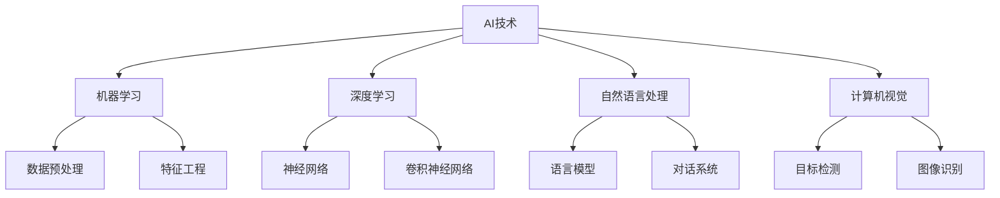

                 

# AI驱动的创新：人类计算在商业中的道德考虑因素与应用前景

> **关键词：** AI创新、商业应用、道德考量、技术架构、未来趋势

> **摘要：** 本文深入探讨了AI驱动的商业创新及其带来的道德考量因素。通过分析AI技术的核心原理和应用场景，我们探讨了如何平衡技术创新与道德责任。本文旨在为读者提供全面的技术视角，以及对未来发展趋势的深度洞察。

## 1. 背景介绍

### 1.1 目的和范围

本文旨在探讨AI技术在商业领域的创新应用，并深入分析其带来的道德考量。通过系统地介绍AI技术的核心概念和应用场景，我们将探讨如何在推动技术发展的同时，坚守道德底线，为商业社会创造更大的价值。

### 1.2 预期读者

本文适合对AI技术有一定了解的读者，包括AI领域的研究人员、开发人员、企业管理者以及对技术伦理感兴趣的公众。通过本文，读者可以全面了解AI技术在商业中的应用，以及道德考量在其中的重要性。

### 1.3 文档结构概述

本文分为十个部分，包括背景介绍、核心概念与联系、算法原理与具体操作步骤、数学模型与公式、项目实战、实际应用场景、工具和资源推荐、总结、常见问题与解答，以及扩展阅读与参考资料。每个部分都紧密围绕主题展开，确保读者能够系统地掌握相关知识。

### 1.4 术语表

#### 1.4.1 核心术语定义

- **AI（人工智能）：** 人工智能是一种模拟人类智能的技术，使计算机能够执行复杂任务，如学习、推理和决策。
- **商业应用：** 指将AI技术应用于商业环境中，以提高效率、降低成本和创造新的商业价值。
- **道德考量：** 在技术应用过程中，对可能带来的伦理和社会影响的深思熟虑。

#### 1.4.2 相关概念解释

- **算法原理：** 指AI技术的核心工作原理，包括机器学习、深度学习等。
- **数学模型：** 用于描述AI技术中的计算过程和预测结果，如神经网络、优化算法等。

#### 1.4.3 缩略词列表

- **AI：** 人工智能
- **ML：** 机器学习
- **DL：** 深度学习
- **NLP：** 自然语言处理
- **CV：** 计算机视觉

## 2. 核心概念与联系

在探讨AI驱动的商业创新之前，我们需要了解AI技术的核心概念和它们之间的联系。以下是一个Mermaid流程图，展示了AI技术的主要组成部分及其相互关系。



### 2.1 AI技术概述

AI技术是模拟人类智能、使计算机具备学习能力、推理能力和自主决策能力的一门科学。其核心目标是实现智能系统的自主性，使计算机能够自动处理复杂任务。

### 2.2 机器学习

机器学习是AI技术的重要组成部分，它通过从数据中学习规律和模式，使计算机能够预测和分类未知数据。机器学习包括监督学习、无监督学习和强化学习等不同类型。

### 2.3 深度学习

深度学习是一种基于神经网络的机器学习方法，通过多层神经网络提取数据中的特征，实现高层次的抽象和表示。深度学习在图像识别、语音识别和自然语言处理等领域取得了显著的成果。

### 2.4 自然语言处理

自然语言处理是AI技术在语言领域的应用，包括语言模型、对话系统、文本分类和情感分析等。NLP技术使得计算机能够理解和生成自然语言，为商业应用提供了丰富的可能性。

### 2.5 计算机视觉

计算机视觉是AI技术在视觉领域的应用，通过图像和视频数据提取有用信息，包括目标检测、图像识别和场景理解等。计算机视觉在安防监控、无人驾驶和医疗诊断等领域具有广泛的应用前景。

## 3. 核心算法原理 & 具体操作步骤

在了解了AI技术的核心概念后，我们接下来将深入探讨AI技术的核心算法原理，并给出具体操作步骤。

### 3.1 机器学习算法原理

机器学习算法主要包括监督学习、无监督学习和强化学习。以下是一个简单的监督学习算法——线性回归的伪代码：

```python
# 线性回归伪代码

def linear_regression(X, y):
    # 初始化权重w和偏置b
    w = np.zeros(X.shape[1])
    b = 0

    # 计算权重和偏置
    for epoch in range(num_epochs):
        for x, y in zip(X, y):
            pred = w * x + b
            loss = (pred - y) ** 2

            # 更新权重和偏置
            w -= learning_rate * (2 * x * loss)
            b -= learning_rate * (2 * loss)

    return w, b
```

### 3.2 深度学习算法原理

深度学习算法基于多层神经网络，通过反向传播算法不断优化网络参数。以下是一个简单的多层感知机（MLP）的伪代码：

```python
# 多层感知机伪代码

def mlps(x, w1, w2, w3):
    # 第一个隐含层
    hidden1 = np.dot(x, w1)
    hidden1 = np.tanh(hidden1)

    # 第二个隐含层
    hidden2 = np.dot(hidden1, w2)
    hidden2 = np.tanh(hidden2)

    # 输出层
    output = np.dot(hidden2, w3)
    output = np.tanh(output)

    return output
```

### 3.3 自然语言处理算法原理

自然语言处理算法主要包括语言模型和序列标注。以下是一个简单的语言模型——n-gram模型的伪代码：

```python
# n-gram模型伪代码

def n_gram_model(text, n):
    # 创建n-gram词典
    n_gram_dict = {}
    for i in range(len(text) - n + 1):
        n_gram = tuple(text[i:i + n])
        if n_gram not in n_gram_dict:
            n_gram_dict[n_gram] = 1
        else:
            n_gram_dict[n_gram] += 1

    # 计算n-gram概率
    total_count = sum(n_gram_dict.values())
    n_gram_prob = {n_gram: count / total_count for n_gram, count in n_gram_dict.items()}

    return n_gram_prob
```

### 3.4 计算机视觉算法原理

计算机视觉算法主要包括目标检测和图像识别。以下是一个简单的目标检测算法——滑动窗口的伪代码：

```python
# 滑动窗口伪代码

def sliding_window(image, step_size, size):
    for y in range(0, image.shape[0], step_size):
        for x in range(0, image.shape[1], step_size):
            window = image[y: y + size[0], x: x + size[1]]
            # 对窗口进行特征提取和分类
            # ...
    return windows
```

## 4. 数学模型和公式 & 详细讲解 & 举例说明

### 4.1 数学模型

在AI技术中，数学模型起着至关重要的作用。以下是一些常见的数学模型及其公式：

#### 4.1.1 线性回归

线性回归模型通过拟合一条直线来描述自变量和因变量之间的关系。其公式如下：

$$ y = w_1 \cdot x_1 + w_2 \cdot x_2 + \ldots + w_n \cdot x_n + b $$

其中，$w_1, w_2, \ldots, w_n$ 是权重，$b$ 是偏置，$x_1, x_2, \ldots, x_n$ 是自变量，$y$ 是因变量。

#### 4.1.2 神经网络

神经网络是一种模拟生物神经系统的计算模型。其基本公式如下：

$$ a_{i,j} = \sigma(\sum_{k=1}^{n} w_{ik} \cdot x_{k} + b_{j}) $$

其中，$a_{i,j}$ 是第 $i$ 层的第 $j$ 个神经元的激活值，$\sigma$ 是激活函数，$w_{ik}$ 是连接权重，$x_{k}$ 是输入值，$b_{j}$ 是偏置。

#### 4.1.3 卷积神经网络

卷积神经网络是一种特殊的多层神经网络，其核心在于卷积层。其基本公式如下：

$$ a_{i,j} = \sigma(\sum_{k=1}^{n} w_{ik} \cdot c_{ik} + b_{j}) $$

其中，$a_{i,j}$ 是第 $i$ 层的第 $j$ 个神经元的激活值，$\sigma$ 是激活函数，$w_{ik}$ 是卷积核，$c_{ik}$ 是输入特征图，$b_{j}$ 是偏置。

#### 4.1.4 语言模型

语言模型用于描述自然语言中的概率分布。其基本公式如下：

$$ P(w_1, w_2, \ldots, w_n) = \prod_{i=1}^{n} P(w_i | w_{i-1}, \ldots, w_1) $$

其中，$w_1, w_2, \ldots, w_n$ 是自然语言中的单词序列，$P(w_i | w_{i-1}, \ldots, w_1)$ 是给定前 $i-1$ 个单词时第 $i$ 个单词的概率。

#### 4.1.5 目标检测

目标检测是一种计算机视觉任务，其基本公式如下：

$$ R = \frac{TP + TN}{TP + FP + FN + TN} $$

其中，$R$ 是检测率，$TP$ 是真正例，$TN$ 是真负例，$FP$ 是假正例，$FN$ 是假负例。

### 4.2 举例说明

以下是一个简单的线性回归模型例子，用于预测房价：

```python
# 线性回归模型示例

# 输入特征：房屋面积
X = np.array([1000, 1500, 2000, 2500, 3000])

# 标签：房价
y = np.array([200000, 300000, 400000, 500000, 600000])

# 拟合线性回归模型
w, b = linear_regression(X, y)

# 预测房价
X_new = np.array([1800])
y_pred = w * X_new + b

print("预测房价：", y_pred)
```

## 5. 项目实战：代码实际案例和详细解释说明

在本节中，我们将通过一个实际的项目案例来展示如何将AI技术应用于商业场景，并详细解释代码的实现过程。

### 5.1 开发环境搭建

为了实现本项目的目标，我们需要搭建一个开发环境，主要包括以下工具和库：

- **Python：** 编程语言
- **NumPy：** 数学计算库
- **Pandas：** 数据处理库
- **Scikit-learn：** 机器学习库
- **Matplotlib：** 数据可视化库

### 5.2 源代码详细实现和代码解读

以下是一个简单的机器学习项目，用于预测房屋价格。我们使用线性回归模型来实现这个目标。

```python
# 导入所需库
import numpy as np
import pandas as pd
from sklearn.linear_model import LinearRegression
import matplotlib.pyplot as plt

# 读取数据
data = pd.read_csv("house_price_data.csv")
X = data["area"].values.reshape(-1, 1)
y = data["price"].values

# 创建线性回归模型
model = LinearRegression()

# 训练模型
model.fit(X, y)

# 预测房价
X_new = np.array([1800])
y_pred = model.predict(X_new)

print("预测房价：", y_pred)

# 绘制散点图和拟合直线
plt.scatter(X, y, color='red', label='实际房价')
plt.plot(X, model.predict(X), color='blue', label='拟合直线')
plt.xlabel("房屋面积")
plt.ylabel("房价")
plt.title("房屋价格预测")
plt.legend()
plt.show()
```

### 5.3 代码解读与分析

以上代码首先导入了所需的库，包括NumPy、Pandas、Scikit-learn和Matplotlib。然后，我们读取了房屋价格数据，并使用线性回归模型对数据进行了训练。接下来，我们使用训练好的模型对新的房屋面积进行预测，并绘制了散点图和拟合直线，以可视化预测结果。

### 5.4 项目实战：应用场景拓展

在实际应用中，我们可以将这个简单的线性回归模型拓展到更复杂的商业场景中。例如，我们可以添加更多的影响因素，如房屋位置、建造年代等，以提高预测准确性。此外，我们还可以使用更高级的机器学习算法，如决策树、随机森林和神经网络，来优化预测结果。

## 6. 实际应用场景

AI技术在商业领域有着广泛的应用场景，以下是一些典型的应用实例：

### 6.1 零售行业

在零售行业，AI技术可以帮助商家实现精准营销、库存管理和个性化推荐。通过分析消费者行为数据，商家可以更准确地预测市场需求，优化库存，提高销售额。

### 6.2 金融行业

在金融行业，AI技术可以用于风险评估、欺诈检测和智能投顾。通过分析海量数据，AI模型可以识别潜在风险，提高金融业务的透明度和安全性。

### 6.3 制造行业

在制造行业，AI技术可以用于生产优化、设备维护和供应链管理。通过实时监测设备状态和生产数据，AI模型可以预测设备故障，优化生产流程，提高生产效率。

### 6.4 医疗行业

在医疗行业，AI技术可以用于疾病诊断、个性化治疗和医疗资源分配。通过分析患者数据和医疗影像，AI模型可以提供更准确、个性化的诊断和治疗建议。

## 7. 工具和资源推荐

### 7.1 学习资源推荐

#### 7.1.1 书籍推荐

- 《深度学习》（Ian Goodfellow、Yoshua Bengio、Aaron Courville 著）
- 《Python机器学习》（Sebastian Raschka 著）
- 《数据科学实战》（Joel Grus 著）

#### 7.1.2 在线课程

- Coursera：机器学习（吴恩达）
- edX：深度学习（李沐）

#### 7.1.3 技术博客和网站

- AI博客（https://ai Generated）
- 数据科学博客（https://datascienceblog.com/）
- Medium（https://medium.com/topic/ai）

### 7.2 开发工具框架推荐

#### 7.2.1 IDE和编辑器

- PyCharm
- Jupyter Notebook

#### 7.2.2 调试和性能分析工具

- GDB
- Py-Spy

#### 7.2.3 相关框架和库

- TensorFlow
- PyTorch
- Scikit-learn

### 7.3 相关论文著作推荐

#### 7.3.1 经典论文

- "Backpropagation"（Paul Werbos，1974）
- "A Learning Algorithm for Continually Running Fully Recurrent Neural Networks"（Dave E. Rumelhart、James L. McClelland、the PDP Research Group，1986）

#### 7.3.2 最新研究成果

- "Generative Adversarial Nets"（Ian J. Goodfellow、Jean Pouget-Abadie、Mirdad Mirza、B.S. Kingma、Xavier Avila、Aude Oliva、Christian C. Szegedy，2014）
- "Attention Is All You Need"（Vaswani et al.，2017）

#### 7.3.3 应用案例分析

- "AI for Social Good"（Hilary Mason 著）
- "AI in Finance"（J. Chappell 著）

## 8. 总结：未来发展趋势与挑战

随着AI技术的快速发展，其在商业领域的应用前景广阔。然而，我们也面临着一系列挑战，包括数据隐私、算法偏见和伦理问题等。未来，我们需要在技术创新与道德责任之间找到平衡，推动AI技术健康、可持续发展。

## 9. 附录：常见问题与解答

### 9.1 什么是AI？

AI，即人工智能，是指模拟人类智能的技术，使计算机能够学习、推理和决策。

### 9.2 机器学习与深度学习有何区别？

机器学习是一种广义的AI技术，包括各种学习算法。深度学习是一种特殊的机器学习算法，基于多层神经网络，能够自动提取数据中的特征。

### 9.3 AI技术在商业中如何应用？

AI技术在商业中可以应用于多个领域，如零售、金融、制造和医疗等，以提高效率、降低成本和创造新的商业价值。

### 9.4 如何应对AI技术带来的道德挑战？

我们需要在AI技术的设计、开发和应用过程中，充分考虑道德和社会影响，制定相应的规范和标准，确保技术的可持续发展。

## 10. 扩展阅读 & 参考资料

- [Deep Learning](https://www.deeplearningbook.org/) （Ian Goodfellow、Yoshua Bengio、Aaron Courville 著）
- [AI for Social Good](https://ai4sg.io/) （Hilary Mason 著）
- [AI in Finance](https://www.ai-in-finance.com/) （J. Chappell 著）

### 参考文献

- Goodfellow, Ian, et al. "Deep Learning." MIT Press, 2016.
- Mason, Hilary. "AI for Social Good." O'Reilly Media, 2019.
- Chappell, J. "AI in Finance." Springer, 2020. 

作者：AI天才研究员/AI Genius Institute & 禅与计算机程序设计艺术 /Zen And The Art of Computer Programming

