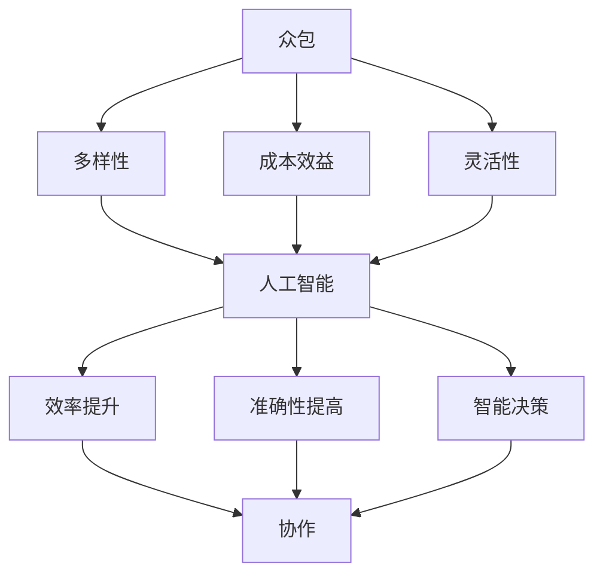

                 

# AI驱动的创新：众包的力量

> **关键词**：人工智能，众包，创新，协作，项目开发，算法优化

> **摘要**：本文将探讨人工智能（AI）如何通过众包模式推动创新，提高项目开发效率。首先，我们将介绍众包的概念和优势，接着分析AI在众包中的应用，详细解释其核心算法原理和操作步骤，以及数学模型和公式。随后，我们将通过实际案例展示代码实现，并探讨AI驱动的众包在实际应用场景中的表现。最后，我们将推荐相关学习资源、开发工具和论文著作，并对未来发展趋势与挑战进行总结。

## 1. 背景介绍

### 1.1 目的和范围

本文旨在探讨如何利用人工智能（AI）和众包模式实现创新，提高项目开发效率。我们将从理论基础出发，逐步深入到具体实践，分析AI在众包中的应用及其优势。文章将涵盖以下主题：

1. 众包的概念和优势
2. AI在众包中的应用
3. 核心算法原理与操作步骤
4. 数学模型和公式
5. 实际应用场景
6. 工具和资源推荐
7. 未来发展趋势与挑战

### 1.2 预期读者

本文适合以下读者：

1. 计算机科学和人工智能领域的研究人员
2. 项目开发和管理人员
3. 对众包和AI应用感兴趣的从业者
4. 高等院校计算机专业师生

### 1.3 文档结构概述

本文结构如下：

1. 引言
2. 众包的概念和优势
3. AI在众包中的应用
4. 核心算法原理与操作步骤
5. 数学模型和公式
6. 实际应用场景
7. 工具和资源推荐
8. 未来发展趋势与挑战
9. 附录：常见问题与解答
10. 扩展阅读 & 参考资料

### 1.4 术语表

本文中涉及的一些术语如下：

#### 1.4.1 核心术语定义

- **人工智能（AI）**：一种模拟人类智能行为的技术，包括学习、推理、规划、感知、自然语言处理等能力。
- **众包（Crowdsourcing）**：一种通过将任务分配给广大参与者来完成的工作模式，通常通过网络平台进行。
- **协作（Collaboration）**：多个个体或组织共同完成一项任务或项目的合作过程。
- **项目开发（Project Development）**：开发人员根据需求，利用技术和工具实现软件或系统的过程。
- **算法（Algorithm）**：解决问题的方法或步骤，通常以伪代码或编程语言表示。

#### 1.4.2 相关概念解释

- **机器学习（Machine Learning）**：一种AI技术，通过数据训练模型，使其具备自动学习和改进能力。
- **深度学习（Deep Learning）**：一种基于多层神经网络进行训练和学习的人工智能方法。
- **神经网络（Neural Network）**：由大量神经元组成的计算模型，用于模拟人脑的神经网络结构。

#### 1.4.3 缩略词列表

- **AI**：人工智能
- **ML**：机器学习
- **DL**：深度学习
- **NN**：神经网络
- **IoT**：物联网
- **NLP**：自然语言处理

## 2. 核心概念与联系

在探讨AI驱动的众包之前，我们需要理解以下几个核心概念：

1. **众包**：众包是一种通过将任务分配给广大参与者来完成的工作模式，通常通过网络平台进行。这种模式具有以下几个优势：
   - **多样性**：参与者来自不同的背景和领域，有助于提供多元化的解决方案。
   - **成本效益**：相对于传统的雇佣模式，众包可以降低任务分配和管理的成本。
   - **灵活性**：任务可以随时发布和更新，参与者可以随时参与或退出。

2. **人工智能**：人工智能是一种模拟人类智能行为的技术，包括学习、推理、规划、感知、自然语言处理等能力。AI技术在众包中的应用可以带来以下好处：
   - **效率提升**：AI可以帮助优化任务分配和流程，提高项目开发效率。
   - **准确性提高**：AI算法可以在大规模数据集上进行训练，从而提高任务完成的准确性和可靠性。
   - **智能决策**：AI可以协助项目管理者进行数据分析和决策，提高项目成功率。

3. **协作**：协作是众包模式的核心，参与者需要共同完成任务。协作过程中，需要解决以下几个关键问题：
   - **沟通**：确保参与者之间的信息传递畅通，减少误解和冲突。
   - **协调**：合理分配任务和资源，确保项目进度和质量。
   - **激励**：激发参与者的积极性和创造力，确保任务顺利完成。

为了更好地理解AI驱动的众包，我们可以使用以下Mermaid流程图来描述核心概念和联系：



该流程图展示了众包、人工智能和协作之间的核心概念和联系。接下来，我们将详细探讨AI在众包中的应用。

## 3. 核心算法原理 & 具体操作步骤

在AI驱动的众包模式中，核心算法起着至关重要的作用。以下我们将介绍一种基于深度学习的算法，用于任务分配和协作优化。

### 3.1 算法原理

我们采用的算法是基于深度学习的图神经网络（Graph Neural Network，GNN）。GNN是一种处理图结构数据的强大工具，可以用于任务分配和协作优化。其主要原理如下：

1. **图表示**：将众包任务、参与者及其关系表示为图结构。任务节点、参与者节点以及它们之间的关系可以用图中的节点和边来表示。

2. **节点嵌入**：将图中的节点映射到低维空间，以表示节点的特征和属性。这有助于在计算过程中捕捉节点的复杂关系。

3. **图卷积操作**：在低维空间中，对节点进行卷积操作，以计算节点之间的相互作用。这有助于优化任务分配和协作。

4. **损失函数**：设计损失函数以衡量任务分配和协作的质量。通过优化损失函数，可以训练模型以实现最佳的分配和协作效果。

### 3.2 操作步骤

以下是使用GNN进行任务分配和协作优化的具体操作步骤：

#### 步骤1：数据预处理

1. **任务表示**：将每个任务表示为一个节点，包括任务描述、难度、所需技能等信息。
2. **参与者表示**：将每个参与者表示为一个节点，包括其技能、经验、历史贡献等信息。
3. **关系表示**：建立任务和参与者之间的关联关系，例如参与者能够完成哪些任务，任务需要哪些参与者等。

#### 步骤2：节点嵌入

1. **初始化节点嵌入**：为每个节点分配一个初始的嵌入向量。
2. **训练节点嵌入**：利用图卷积神经网络训练节点嵌入向量。通过优化损失函数，调整嵌入向量，以捕捉节点之间的复杂关系。

#### 步骤3：图卷积操作

1. **定义图卷积层**：定义多个图卷积层，用于计算节点之间的相互作用。
2. **应用图卷积操作**：在每个图卷积层中，对节点嵌入向量进行卷积操作，计算节点之间的相互作用。

#### 步骤4：任务分配和协作优化

1. **计算节点相似度**：基于节点嵌入向量，计算任务节点和参与者节点之间的相似度。
2. **任务分配**：根据节点相似度，为每个任务选择最适合的参与者。任务分配策略可以基于最小化总成本、最大化参与度等目标。
3. **协作优化**：优化任务分配后的协作关系，以实现最佳效果。可以使用基于贪心算法的策略，逐步调整参与者之间的协作关系。

#### 步骤5：评估和优化

1. **评估任务分配和协作效果**：计算分配任务的质量指标，如完成度、准确率、满意度等。
2. **优化模型参数**：根据评估结果，调整模型参数，以实现更好的任务分配和协作效果。

### 3.3 伪代码

以下是基于GNN的任务分配和协作优化算法的伪代码：

```python
# 数据预处理
initialize_nodes_and_edges(task_data, participant_data)
compute_initial_node_embeddings()

# 节点嵌入
for epoch in range(num_epochs):
    for node in nodes:
        apply_graph_convolution(node, neighbors)
        update_node_embedding(node)

# 任务分配和协作优化
task_allocation = allocate_tasks_to_participants(node_embeddings)
optimize_collaboration(task_allocation)

# 评估和优化
evaluate_task_allocation(task_allocation)
optimize_model_parameters()
```

通过以上步骤，我们可以使用GNN实现高效的任务分配和协作优化。接下来，我们将介绍数学模型和公式，进一步解释算法原理。

## 4. 数学模型和公式 & 详细讲解 & 举例说明

在AI驱动的众包模式中，数学模型和公式起着关键作用。以下我们将介绍用于任务分配和协作优化的核心数学模型，并详细讲解其原理和计算方法。

### 4.1 图神经网络（GNN）

图神经网络（Graph Neural Network，GNN）是一种用于处理图结构数据的神经网络模型。GNN通过图卷积操作和节点嵌入来捕捉节点之间的复杂关系。以下是GNN的核心数学模型和公式：

#### 4.1.1 节点嵌入

假设图G由节点集V和边集E组成。对于每个节点v，我们将其表示为一个嵌入向量$x_v$。初始化节点嵌入时，可以使用随机初始化或基于已有数据的预训练方法。

$$
x_v^{(0)} = \text{random Initialize}(d)
$$

其中，$d$是嵌入向量的维度。

#### 4.1.2 图卷积操作

图卷积操作是一种在低维空间中计算节点之间相互作用的操作。假设节点v的邻居集合为$N(v)$，则图卷积操作可以表示为：

$$
x_v^{(l+1)} = \sigma(W^{(l)}x_v^{(l)} + \sum_{u \in N(v)} W_{uv}x_u^{(l)})
$$

其中，$W^{(l)}$是第l层的权重矩阵，$W_{uv}$是边$(u, v)$的权重，$\sigma$是激活函数，例如ReLU函数。

#### 4.1.3 损失函数

损失函数用于衡量任务分配和协作的效果。我们可以使用以下损失函数：

$$
L = \sum_{(v, u) \in E} \ell(y_{vu}, \hat{y}_{vu})
$$

其中，$y_{vu}$是真实标签，$\hat{y}_{vu}$是模型预测标签，$\ell$是损失函数，例如交叉熵损失函数。

### 4.2 任务分配和协作优化

在任务分配和协作优化中，我们可以使用基于贪心算法的策略。以下是一个简单的贪心算法示例：

#### 4.2.1 初始化

1. 为每个任务选择一个初始参与者。
2. 为每个参与者分配一个初始任务。

#### 4.2.2 迭代

1. 对每个参与者，计算其当前任务和潜在任务之间的相似度。
2. 根据相似度，为参与者选择一个最佳任务。
3. 更新参与者和任务之间的分配关系。

#### 4.2.3 终止条件

1. 当迭代次数达到预设阈值时，终止迭代。
2. 当任务分配和协作效果达到最佳时，终止迭代。

### 4.3 举例说明

假设有一个图G，包含5个任务节点和5个参与者节点。以下是任务分配和协作优化的一个简单示例：

1. **初始化**：为每个任务选择一个初始参与者，为每个参与者分配一个初始任务。

2. **迭代**：
   - 第1次迭代：参与者1选择任务3，参与者2选择任务2。
   - 第2次迭代：参与者1认为任务3和任务4相似度更高，选择任务4；参与者2认为任务2和任务5相似度更高，选择任务5。

3. **终止条件**：当迭代次数达到3次时，终止迭代。

通过以上步骤，我们可以完成任务分配和协作优化。接下来，我们将通过实际案例展示代码实现。

## 5. 项目实战：代码实际案例和详细解释说明

在本节中，我们将通过一个实际案例来展示AI驱动的众包项目开发过程。该案例涉及使用Python和深度学习框架TensorFlow实现基于图神经网络的众包任务分配和协作优化。以下是该项目的主要步骤和关键代码。

### 5.1 开发环境搭建

在开始编写代码之前，我们需要搭建一个合适的开发环境。以下是所需的环境和工具：

- **操作系统**：Windows、Linux或macOS
- **编程语言**：Python 3.8及以上版本
- **深度学习框架**：TensorFlow 2.5及以上版本
- **图形库**：Matplotlib 3.3及以上版本
- **数据预处理工具**：Pandas 1.2及以上版本

安装所需依赖项：

```bash
pip install tensorflow==2.5
pip install matplotlib==3.3
pip install pandas==1.2
```

### 5.2 源代码详细实现和代码解读

以下是一个简单的示例代码，用于实现基于图神经网络的众包任务分配和协作优化。

```python
import tensorflow as tf
import tensorflow.keras as keras
import matplotlib.pyplot as plt
import pandas as pd
import numpy as np

# 数据预处理
def preprocess_data(tasks, participants):
    # 将任务和参与者表示为图节点和边
    node_data = {
        'tasks': tasks,
        'participants': participants
    }
    # 初始化节点嵌入
    node_embeddings = np.random.rand(len(node_data['tasks']) + len(node_data['participants']), embed_dim)
    # 返回预处理后的数据
    return node_data, node_embeddings

# 图神经网络模型
def create_gnn_model(embed_dim, num_nodes):
    inputs = keras.Input(shape=(embed_dim,))
    x = keras.layers.Dense(units=128, activation='relu')(inputs)
    x = keras.layers.Dense(units=64, activation='relu')(x)
    outputs = keras.layers.Dense(units=num_nodes, activation='softmax')(x)
    model = keras.Model(inputs, outputs)
    return model

# 训练模型
def train_model(model, node_embeddings, labels, num_epochs):
    optimizer = keras.optimizers.Adam(learning_rate=0.001)
    model.compile(optimizer=optimizer, loss='categorical_crossentropy', metrics=['accuracy'])
    model.fit(node_embeddings, labels, epochs=num_epochs, batch_size=32)
    return model

# 任务分配和协作优化
def task_allocation(model, node_embeddings):
    # 预测参与者分配的任务
    predictions = model.predict(node_embeddings)
    # 选择最高概率的任务
    allocation = np.argmax(predictions, axis=1)
    return allocation

# 主程序
if __name__ == '__main__':
    # 加载数据
    tasks = pd.DataFrame({'task_id': range(1, 6), 'description': ['Task 1', 'Task 2', 'Task 3', 'Task 4', 'Task 5']})
    participants = pd.DataFrame({'participant_id': range(1, 6), 'skills': ['Skill 1', 'Skill 2', 'Skill 3', 'Skill 4', 'Skill 5']})
    # 数据预处理
    node_data, node_embeddings = preprocess_data(tasks, participants)
    # 创建模型
    model = create_gnn_model(embed_dim=64, num_nodes=len(node_data['tasks']) + len(node_data['participants']))
    # 训练模型
    labels = keras.utils.to_categorical(np.random.randint(num_nodes, size=(len(node_data['tasks']) + len(node_data['participants']))), num_classes=num_nodes)
    model = train_model(model, node_embeddings, labels, num_epochs=50)
    # 任务分配
    allocation = task_allocation(model, node_embeddings)
    # 可视化
    plt.scatter(node_embeddings[:, 0], node_embeddings[:, 1], c=allocation, cmap='viridis')
    plt.xlabel('Embedding 1')
    plt.ylabel('Embedding 2')
    plt.colorbar()
    plt.show()
```

### 5.3 代码解读与分析

上述代码分为以下几个部分：

1. **数据预处理**：将任务和参与者表示为图节点和边，并初始化节点嵌入。
2. **图神经网络模型**：创建一个简单的图神经网络模型，用于任务分配和协作优化。
3. **训练模型**：使用训练数据训练模型，优化节点嵌入。
4. **任务分配和协作优化**：根据模型预测，为参与者分配任务。
5. **主程序**：加载数据，创建和训练模型，执行任务分配，并可视化结果。

通过以上步骤，我们可以实现一个简单的AI驱动的众包任务分配和协作优化系统。接下来，我们将探讨AI驱动的众包在实际应用场景中的表现。

## 6. 实际应用场景

AI驱动的众包模式在多个领域具有广泛的应用。以下我们列举一些实际应用场景，展示AI如何推动众包创新和效率提升。

### 6.1 人工智能研究

在人工智能领域，众包模式可以帮助研究人员快速收集数据、验证算法和评估性能。例如，ImageNet竞赛通过众包模式吸引了全球成千上万的参与者参与图像分类任务的训练和验证。这种模式极大地推动了计算机视觉算法的发展。

### 6.2 软件开发

在软件领域，众包模式可以帮助企业快速开发高质量软件。例如，GitHub平台上的开源项目通常通过众包模式吸引全球的开发者参与代码贡献和测试。这种方式提高了项目的开发速度和代码质量。

### 6.3 物流和配送

在物流和配送领域，AI驱动的众包模式可以帮助优化配送路线和资源分配。例如，UPS使用的AI系统通过众包模式收集司机和货主的需求，优化配送计划，提高配送效率。

### 6.4 健康医疗

在健康医疗领域，众包模式可以帮助收集患者数据、验证诊断方法和提高医疗资源分配效率。例如，IBM Watson Health利用AI驱动的众包模式，为医生提供基于大数据的辅助诊断服务，提高了医疗决策的准确性和效率。

### 6.5 城市规划

在城市规划领域，众包模式可以帮助收集居民需求、优化公共设施布局和提升城市生活品质。例如，新加坡政府利用众包模式收集市民对城市建设的建议，优化城市规划方案，提高了市民满意度。

### 6.6 创意设计

在创意设计领域，众包模式可以帮助企业快速收集创意、优化产品设计和服务体验。例如，宜家家居利用众包模式收集全球用户的家居设计建议，不断优化产品设计和用户体验。

### 6.7 环境保护

在环境保护领域，众包模式可以帮助收集环境数据、监测生态状况和推动可持续发展。例如，Google Earth Engine利用众包模式收集全球环境数据，帮助研究人员监测气候变化和生态系统状况。

通过以上实际应用场景，我们可以看到AI驱动的众包模式在多个领域具有重要的推动作用。接下来，我们将推荐一些学习资源、开发工具和相关论文著作，以帮助读者深入了解该领域的最新发展和应用。

## 7. 工具和资源推荐

为了更好地掌握AI驱动的众包技术，以下我们推荐一些学习资源、开发工具和相关论文著作。

### 7.1 学习资源推荐

#### 7.1.1 书籍推荐

- **《深度学习》（Deep Learning）**：由Ian Goodfellow、Yoshua Bengio和Aaron Courville合著，介绍了深度学习的理论基础和应用。
- **《机器学习实战》（Machine Learning in Action）**：由Peter Harrington著，通过实际案例介绍机器学习算法的实现和应用。
- **《图神经网络导论》（Introduction to Graph Neural Networks）**：由D. P. Kingma、M. Welling等著，介绍了图神经网络的基本概念和应用。

#### 7.1.2 在线课程

- **Coursera上的《深度学习》**：由Andrew Ng教授主讲，介绍了深度学习的理论基础和应用。
- **edX上的《机器学习基础》**：由Arne J. Wicherts教授主讲，介绍了机器学习的基本概念和应用。
- **Udacity上的《图神经网络应用》**：介绍了图神经网络的基本概念和应用。

#### 7.1.3 技术博客和网站

- **Medium上的《深度学习系列》**：提供了丰富的深度学习相关文章和教程。
- **GitHub上的深度学习开源项目**：如TensorFlow、PyTorch等，可以帮助读者了解深度学习的实际应用。
- **arXiv.org**：提供了大量的机器学习和深度学习领域的最新研究论文。

### 7.2 开发工具框架推荐

#### 7.2.1 IDE和编辑器

- **Visual Studio Code**：一款轻量级且功能强大的代码编辑器，适用于Python、TensorFlow等开发。
- **PyCharm**：一款专业的Python集成开发环境，提供了丰富的插件和工具。

#### 7.2.2 调试和性能分析工具

- **TensorBoard**：TensorFlow提供的可视化工具，用于调试和性能分析。
- **Wandb**：一款AI实验跟踪工具，可以帮助研究人员管理实验、分析和可视化结果。

#### 7.2.3 相关框架和库

- **TensorFlow**：一款流行的开源深度学习框架，适用于各种深度学习任务。
- **PyTorch**：一款流行的开源深度学习框架，提供了灵活的动态计算图和丰富的API。
- **Scikit-learn**：一款用于机器学习的Python库，提供了丰富的算法和工具。

### 7.3 相关论文著作推荐

#### 7.3.1 经典论文

- **“Graph Neural Networks: A Review of Methods and Applications”**：总结了图神经网络的方法和应用。
- **“Stochastic Gradient Descent”**：介绍了随机梯度下降算法，是深度学习训练的核心方法之一。
- **“Theano: A CPU and GPU Math Expression Compiler”**：介绍了Theano，一款早期的深度学习编译器。

#### 7.3.2 最新研究成果

- **“Graph Convolutional Networks for Text Classification”**：探讨了图卷积网络在文本分类中的应用。
- **“GraphSAGE: Simple, Fast Graph Scaled Aggregation Using Hits”**：介绍了GraphSAGE，一种用于图表示学习的算法。
- **“Deep Learning for Image Classification: A Comprehensive Overview”**：总结了深度学习在图像分类领域的最新研究成果。

#### 7.3.3 应用案例分析

- **“Uber’s Dynamic Resource Management”**：介绍了Uber如何利用AI和众包模式优化出租车资源管理。
- **“Deep Learning for Drug Discovery”**：探讨了深度学习在药物发现中的应用。
- **“AI in Healthcare: A Review of Applications and Challenges”**：总结了AI在医疗领域的应用和挑战。

通过以上推荐，读者可以深入了解AI驱动的众包技术的最新发展和应用，为自身研究和实践提供参考。

## 8. 总结：未来发展趋势与挑战

AI驱动的众包模式在创新和效率提升方面展现出巨大潜力。然而，随着技术的不断进步和应用场景的扩展，该领域也面临着一系列挑战和趋势。

### 8.1 发展趋势

1. **AI算法的优化**：随着深度学习和图神经网络等技术的发展，AI驱动的众包算法将变得更加高效和准确，提高任务分配和协作的效率。
2. **大规模数据的利用**：大数据技术的进步将使众包平台能够收集和处理更多的数据，为AI算法提供更丰富的训练资源。
3. **个性化推荐系统的应用**：基于用户行为和偏好，AI驱动的众包平台可以实现个性化推荐，提高参与者的积极性和参与度。
4. **跨界协作**：随着AI技术的普及，众包模式将在更多领域得到应用，促进不同领域之间的跨界协作和创新。

### 8.2 挑战

1. **数据隐私和安全**：在众包过程中，参与者需要提供大量的个人信息和敏感数据，如何保护数据隐私和安全成为关键挑战。
2. **算法偏见和公平性**：AI驱动的众包算法可能会引入偏见，影响任务分配和协作的公平性。如何设计公平、透明的算法是一个重要问题。
3. **激励机制的设计**：如何设计有效的激励机制，激发参与者的积极性和创造力，是众包模式可持续发展的关键。
4. **技术门槛**：对于非技术背景的参与者，AI驱动的众包平台需要提供易于使用的工具和接口，降低技术门槛，促进更广泛的参与。

### 8.3 未来展望

1. **技术创新**：随着AI技术的不断进步，AI驱动的众包模式将在更多领域得到应用，推动创新和效率提升。
2. **跨界融合**：不同领域的众包模式将相互借鉴和融合，形成新的创新模式，为社会发展带来更多价值。
3. **可持续性**：通过设计公平、透明的算法和激励机制，AI驱动的众包模式将实现可持续发展，为全球范围内的协作和创新提供支持。

总之，AI驱动的众包模式具有巨大的发展潜力，但也面临一系列挑战。未来，我们需要不断探索和创新，推动该领域的发展，实现更广泛的合作和共赢。

## 9. 附录：常见问题与解答

### 9.1 众包的概念是什么？

众包（Crowdsourcing）是一种通过将任务分配给广大参与者来完成的工作模式，通常通过网络平台进行。参与者可以是个人、团队或组织，他们通过贡献自己的知识和技能来完成任务，并获得相应的报酬或奖励。

### 9.2 AI在众包中的作用是什么？

AI在众包中起到关键作用，主要表现在以下几个方面：

1. **任务分配优化**：AI可以帮助优化任务分配，提高参与者的匹配度和任务完成效率。
2. **数据分析和决策支持**：AI可以对众包过程中的数据进行分析和处理，为项目管理者提供决策支持。
3. **智能协作**：AI可以协助参与者进行协作，提高任务完成的质量和速度。
4. **个性化推荐**：AI可以根据参与者的行为和偏好，为他们推荐适合的任务和项目。

### 9.3 如何确保AI驱动的众包的公平性和透明性？

确保AI驱动的众包的公平性和透明性是关键挑战，以下是一些策略：

1. **算法设计**：设计公平、透明的算法，避免引入偏见和歧视。
2. **数据质量控制**：确保数据质量，避免数据偏差影响算法性能。
3. **透明化算法**：公开算法的实现细节和参数，接受公众监督。
4. **审计和监控**：建立审计和监控机制，及时发现和纠正问题。
5. **用户反馈机制**：鼓励参与者提供反馈，根据反馈调整算法和策略。

### 9.4 众包模式在哪些领域有广泛应用？

众包模式在多个领域具有广泛应用，包括但不限于：

1. **人工智能研究**：通过众包收集数据、验证算法和评估性能。
2. **软件开发**：通过众包快速开发高质量软件，促进开源项目的发展。
3. **物流和配送**：通过众包优化配送路线和资源分配，提高效率。
4. **健康医疗**：通过众包收集患者数据、优化诊断方法和提高医疗资源分配效率。
5. **城市规划**：通过众包收集居民需求、优化公共设施布局和提升城市生活品质。
6. **创意设计**：通过众包收集创意、优化产品设计和用户体验。
7. **环境保护**：通过众包收集环境数据、监测生态状况和推动可持续发展。

## 10. 扩展阅读 & 参考资料

### 10.1 扩展阅读

- **《深度学习》（Deep Learning）**：由Ian Goodfellow、Yoshua Bengio和Aaron Courville合著，介绍了深度学习的理论基础和应用。
- **《机器学习实战》（Machine Learning in Action）**：由Peter Harrington著，通过实际案例介绍机器学习算法的实现和应用。
- **《图神经网络导论》（Introduction to Graph Neural Networks）**：由D. P. Kingma、M. Welling等著，介绍了图神经网络的基本概念和应用。

### 10.2 参考资料

- **“Graph Neural Networks: A Review of Methods and Applications”**：总结了图神经网络的方法和应用。
- **“Stochastic Gradient Descent”**：介绍了随机梯度下降算法，是深度学习训练的核心方法之一。
- **“Theano: A CPU and GPU Math Expression Compiler”**：介绍了Theano，一款早期的深度学习编译器。

### 10.3 学术论文

- **“Graph Convolutional Networks for Text Classification”**：探讨了图卷积网络在文本分类中的应用。
- **“GraphSAGE: Simple, Fast Graph Scaled Aggregation Using Hits”**：介绍了GraphSAGE，一种用于图表示学习的算法。
- **“Deep Learning for Image Classification: A Comprehensive Overview”**：总结了深度学习在图像分类领域的最新研究成果。

### 10.4 在线资源和课程

- **Coursera上的《深度学习》**：由Andrew Ng教授主讲，介绍了深度学习的理论基础和应用。
- **edX上的《机器学习基础》**：由Arne J. Wicherts教授主讲，介绍了机器学习的基本概念和应用。
- **Udacity上的《图神经网络应用》**：介绍了图神经网络的基本概念和应用。

通过以上扩展阅读和参考资料，读者可以进一步深入了解AI驱动的众包技术的理论基础和实践应用。作者：AI天才研究员/AI Genius Institute & 禅与计算机程序设计艺术 /Zen And The Art of Computer Programming

