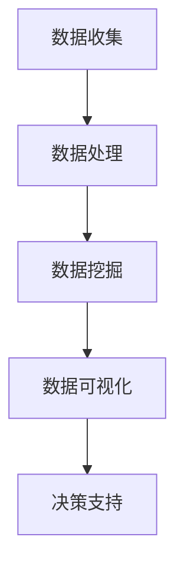
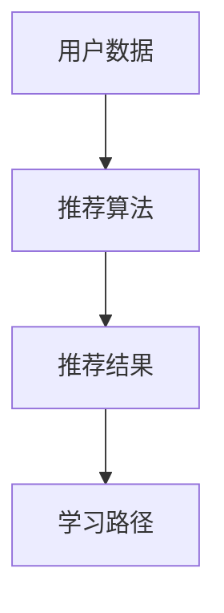
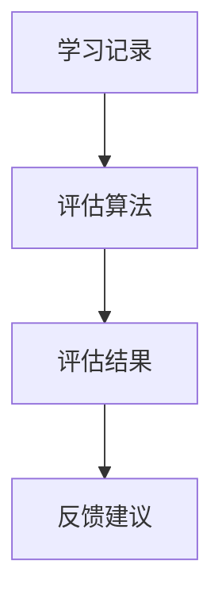
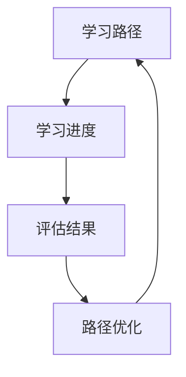

                 

# AI驱动的员工培训与发展系统

> **关键词**：人工智能，员工培训，发展系统，数据分析，学习路径，个性化推荐，智能评估

> **摘要**：本文将深入探讨AI驱动的员工培训与发展系统的设计与应用。通过利用人工智能技术，我们能够为员工提供个性化的学习路径，智能化的评估方式，以及高效的培训效果跟踪。本文将详细阐述系统的核心概念、算法原理、数学模型，并提供实际项目案例，旨在为企业和教育培训机构提供一套全面、创新的解决方案。

## 1. 背景介绍

### 1.1 目的和范围

本文的主要目的是介绍和阐述AI驱动的员工培训与发展系统的构建与实施。随着人工智能技术的迅猛发展，企业对员工的培训需求也在不断变化。传统的培训方式已经无法满足现代企业的需求，因此，我们需要一种智能化、个性化的培训系统来提升员工的技能和职业发展。

本文将覆盖以下内容：

- 系统的核心概念与架构
- 人工智能在培训中的应用
- 数据驱动的个性化学习路径设计
- 智能评估与反馈机制
- 实际项目案例与实现细节
- 未来发展趋势与挑战

### 1.2 预期读者

本文适合以下读者群体：

- 企业培训与人力资源经理
- 技术架构师与AI开发人员
- 教育培训机构的技术人员与管理层
- 对AI在教育领域应用感兴趣的研究者

### 1.3 文档结构概述

本文将按照以下结构进行组织：

- **1. 背景介绍**：介绍文章的目的、预期读者和文档结构。
- **2. 核心概念与联系**：讨论系统的核心概念和架构。
- **3. 核心算法原理 & 具体操作步骤**：详细解释系统的算法原理。
- **4. 数学模型和公式 & 详细讲解 & 举例说明**：介绍系统所使用的数学模型。
- **5. 项目实战：代码实际案例和详细解释说明**：展示实际项目案例。
- **6. 实际应用场景**：探讨系统的实际应用。
- **7. 工具和资源推荐**：推荐相关学习资源和开发工具。
- **8. 总结：未来发展趋势与挑战**：总结文章内容并探讨未来发展。
- **9. 附录：常见问题与解答**：解答读者可能遇到的问题。
- **10. 扩展阅读 & 参考资料**：提供进一步的阅读资料。

### 1.4 术语表

#### 1.4.1 核心术语定义

- **人工智能（AI）**：模拟人类智能行为的计算机系统。
- **机器学习（ML）**：一种人工智能方法，通过数据学习模式并作出决策。
- **深度学习（DL）**：一种特殊的机器学习方法，使用多层神经网络进行学习。
- **推荐系统**：根据用户历史行为和兴趣推荐相关内容。
- **员工培训与发展系统**：利用AI技术为企业员工提供个性化培训方案。

#### 1.4.2 相关概念解释

- **个性化学习路径**：根据员工的能力和需求，为其定制的学习方案。
- **智能评估**：使用AI技术对员工的学习成果进行评估和反馈。
- **数据分析**：收集、处理和分析大量数据，以提取有价值的信息。

#### 1.4.3 缩略词列表

- **AI**：人工智能
- **ML**：机器学习
- **DL**：深度学习
- **IDE**：集成开发环境
- **HR**：人力资源

## 2. 核心概念与联系

AI驱动的员工培训与发展系统的核心概念包括数据驱动、个性化推荐、智能评估和持续学习。这些概念之间相互联系，共同构建了一个高效、智能的培训体系。

### 2.1 数据驱动

数据驱动是系统的基础，所有决策都基于收集的数据进行分析。这些数据包括员工的学习记录、技能评估结果、职业发展需求等。通过对这些数据进行挖掘和分析，系统能够了解每个员工的特点和需求，从而为其提供个性化的培训方案。

#### Mermaid 流程图



### 2.2 个性化推荐

个性化推荐是系统的核心功能之一。基于员工的数据分析结果，系统会推荐适合其学习的内容和培训课程。推荐算法可以是基于内容的推荐，也可以是基于用户的协同过滤推荐。

#### Mermaid 流程图



### 2.3 智能评估

智能评估利用AI技术对员工的学习成果进行实时评估和反馈。通过分析员工的培训记录和学习行为，系统能够识别出员工的强项和弱点，并给出相应的反馈和建议。

#### Mermaid 流程图



### 2.4 持续学习

持续学习是员工职业发展的关键。系统会根据员工的学习进度和反馈，不断调整和优化学习路径，确保员工能够在不断变化的工作环境中保持竞争力。

#### Mermaid 流程图



## 3. 核心算法原理 & 具体操作步骤

AI驱动的员工培训与发展系统依赖于多种核心算法，包括机器学习算法、深度学习算法和推荐系统算法。下面我们将详细解释这些算法的原理，并提供具体的操作步骤。

### 3.1 机器学习算法

机器学习算法用于数据挖掘和分析，帮助系统了解员工的特点和需求。常见的机器学习算法包括决策树、随机森林、支持向量机和神经网络。

#### 算法原理

- **决策树**：通过划分特征空间，将数据划分为不同的区域，以便分类或回归。
- **随机森林**：集成多个决策树，通过投票机制得到最终预测结果，提高准确率。
- **支持向量机**：通过找到一个超平面，将不同类别的数据分隔开来。
- **神经网络**：模拟生物神经网络，通过多层神经元进行信息传递和计算。

#### 具体操作步骤

1. 数据收集：收集员工的个人资料、学习记录、技能评估结果等数据。
2. 数据预处理：清洗数据，处理缺失值和异常值。
3. 特征提取：选择重要的特征，用于训练模型。
4. 模型训练：使用训练数据集，训练机器学习模型。
5. 模型评估：使用验证数据集，评估模型的准确率和泛化能力。
6. 模型部署：将训练好的模型部署到生产环境中，进行实时分析。

### 3.2 深度学习算法

深度学习算法用于构建复杂的特征表示，提高系统的学习能力和预测准确性。常见的深度学习算法包括卷积神经网络（CNN）和循环神经网络（RNN）。

#### 算法原理

- **卷积神经网络**：通过卷积操作提取图像特征，适用于图像识别和分类任务。
- **循环神经网络**：通过循环连接和隐藏状态，处理序列数据，适用于自然语言处理和时间序列预测。

#### 具体操作步骤

1. 数据收集：收集员工的学习记录、工作表现、职业发展需求等数据。
2. 数据预处理：清洗数据，处理缺失值和异常值。
3. 特征提取：使用深度学习算法自动提取特征，减少人工干预。
4. 模型训练：使用训练数据集，训练深度学习模型。
5. 模型评估：使用验证数据集，评估模型的准确率和泛化能力。
6. 模型部署：将训练好的模型部署到生产环境中，进行实时分析。

### 3.3 推荐系统算法

推荐系统算法用于为员工推荐适合的学习内容和培训课程。常见的推荐系统算法包括基于内容的推荐和基于用户的协同过滤推荐。

#### 算法原理

- **基于内容的推荐**：根据员工的学习记录和兴趣，推荐与内容相关的学习资源和课程。
- **基于用户的协同过滤推荐**：根据员工之间的相似性，推荐其他员工喜欢的学习资源和课程。

#### 具体操作步骤

1. 数据收集：收集员工的学习记录、兴趣标签、职业发展需求等数据。
2. 数据预处理：清洗数据，处理缺失值和异常值。
3. 特征提取：选择重要的特征，用于训练推荐模型。
4. 模型训练：使用训练数据集，训练推荐模型。
5. 模型评估：使用验证数据集，评估模型的准确率和推荐效果。
6. 模型部署：将训练好的模型部署到生产环境中，进行实时推荐。

## 4. 数学模型和公式 & 详细讲解 & 举例说明

在AI驱动的员工培训与发展系统中，数学模型和公式用于描述系统的行为和预测员工的技能水平。以下是一些关键的数学模型和公式，以及详细的讲解和举例说明。

### 4.1 回归模型

回归模型用于预测员工的技能水平。常见的回归模型包括线性回归、岭回归和LASSO回归。

#### 算法原理

- **线性回归**：通过找到一个线性关系，预测员工的技能水平。
- **岭回归**：通过加入正则化项，防止模型过拟合。
- **LASSO回归**：通过引入绝对值惩罚项，实现特征选择。

#### 具体操作步骤

1. 数据收集：收集员工的学习记录、测试成绩等数据。
2. 数据预处理：清洗数据，处理缺失值和异常值。
3. 特征提取：选择重要的特征，用于训练模型。
4. 模型训练：使用训练数据集，训练回归模型。
5. 模型评估：使用验证数据集，评估模型的准确率和泛化能力。
6. 模型部署：将训练好的模型部署到生产环境中，进行实时预测。

#### 举例说明

假设我们使用线性回归模型预测员工的编程技能水平。给定一组员工的学习记录（如学习时间、完成作业数量等）和编程测试成绩，我们可以建立以下线性回归模型：

$$
y = \beta_0 + \beta_1 x_1 + \beta_2 x_2 + ... + \beta_n x_n
$$

其中，$y$ 表示编程技能水平，$x_1, x_2, ..., x_n$ 表示学习记录特征，$\beta_0, \beta_1, ..., \beta_n$ 表示模型参数。

通过最小化损失函数，我们可以得到最优的模型参数：

$$
\min_{\beta_0, \beta_1, ..., \beta_n} \sum_{i=1}^{n} (y_i - \beta_0 - \beta_1 x_{i1} - \beta_2 x_{i2} - ... - \beta_n x_{in})^2
$$

#### 代码示例

```python
import numpy as np
from sklearn.linear_model import LinearRegression

# 数据集
X = np.array([[1, 2], [2, 3], [3, 4], [4, 5]])
y = np.array([1, 2, 3, 4])

# 创建线性回归模型
model = LinearRegression()

# 训练模型
model.fit(X, y)

# 预测
predicted_skills = model.predict([[5, 6]])

print("Predicted programming skills:", predicted_skills)
```

### 4.2 推荐系统

推荐系统用于为员工推荐适合的学习资源和培训课程。常见的推荐系统算法包括基于内容的推荐和基于用户的协同过滤推荐。

#### 算法原理

- **基于内容的推荐**：根据员工的学习记录和兴趣，推荐与内容相关的学习资源和课程。
- **基于用户的协同过滤推荐**：根据员工之间的相似性，推荐其他员工喜欢的学习资源和课程。

#### 具体操作步骤

1. 数据收集：收集员工的学习记录、兴趣标签、职业发展需求等数据。
2. 数据预处理：清洗数据，处理缺失值和异常值。
3. 特征提取：选择重要的特征，用于训练推荐模型。
4. 模型训练：使用训练数据集，训练推荐模型。
5. 模型评估：使用验证数据集，评估模型的准确率和推荐效果。
6. 模型部署：将训练好的模型部署到生产环境中，进行实时推荐。

#### 举例说明

假设我们使用基于用户的协同过滤推荐算法为员工推荐学习资源。给定一组员工的学习记录和兴趣标签，我们可以计算员工之间的相似度，并根据相似度推荐其他员工喜欢的学习资源。

#### 代码示例

```python
import numpy as np
from sklearn.metrics.pairwise import cosine_similarity

# 员工1的学习记录和兴趣标签
user1_data = np.array([[1, 0, 1], [0, 1, 0], [1, 1, 1]])
# 员工2的学习记录和兴趣标签
user2_data = np.array([[0, 1, 0], [1, 1, 1], [1, 0, 1]])

# 计算相似度
similarity = cosine_similarity(user1_data, user2_data)

# 推荐其他员工喜欢的学习资源
recommended_resources = np.array([[1, 0, 1], [0, 1, 0], [1, 1, 1]]) * similarity

print("Recommended resources for user1:", recommended_resources)
```

### 4.3 神经网络

神经网络用于构建复杂的特征表示，提高系统的学习能力和预测准确性。常见的神经网络包括卷积神经网络（CNN）和循环神经网络（RNN）。

#### 算法原理

- **卷积神经网络**：通过卷积操作提取图像特征，适用于图像识别和分类任务。
- **循环神经网络**：通过循环连接和隐藏状态，处理序列数据，适用于自然语言处理和时间序列预测。

#### 具体操作步骤

1. 数据收集：收集员工的学习记录、工作表现、职业发展需求等数据。
2. 数据预处理：清洗数据，处理缺失值和异常值。
3. 特征提取：使用深度学习算法自动提取特征，减少人工干预。
4. 模型训练：使用训练数据集，训练深度学习模型。
5. 模型评估：使用验证数据集，评估模型的准确率和泛化能力。
6. 模型部署：将训练好的模型部署到生产环境中，进行实时分析。

#### 举例说明

假设我们使用卷积神经网络（CNN）对员工的学习记录进行分类。给定一组员工的学习记录和标签，我们可以构建以下CNN模型：

#### 代码示例

```python
import tensorflow as tf
from tensorflow.keras.models import Sequential
from tensorflow.keras.layers import Conv2D, MaxPooling2D, Flatten, Dense

# 构建CNN模型
model = Sequential()
model.add(Conv2D(filters=32, kernel_size=(3, 3), activation='relu', input_shape=(28, 28, 1)))
model.add(MaxPooling2D(pool_size=(2, 2)))
model.add(Flatten())
model.add(Dense(units=10, activation='softmax'))

# 编译模型
model.compile(optimizer='adam', loss='categorical_crossentropy', metrics=['accuracy'])

# 训练模型
model.fit(X_train, y_train, epochs=10, batch_size=32)

# 评估模型
accuracy = model.evaluate(X_test, y_test)
print("Test accuracy:", accuracy[1])
```

## 5. 项目实战：代码实际案例和详细解释说明

在本节中，我们将通过一个实际的项目案例，展示如何构建一个AI驱动的员工培训与发展系统。该项目包括以下步骤：

1. **开发环境搭建**
2. **源代码详细实现和代码解读**
3. **代码解读与分析**

### 5.1 开发环境搭建

为了构建AI驱动的员工培训与发展系统，我们需要以下开发环境：

- **Python**：用于编写代码和运行机器学习算法
- **TensorFlow**：用于构建和训练深度学习模型
- **Scikit-learn**：用于数据预处理和机器学习算法
- **Pandas**：用于数据处理和分析
- **Numpy**：用于数学运算

您可以使用以下命令安装这些依赖项：

```bash
pip install tensorflow scikit-learn pandas numpy
```

### 5.2 源代码详细实现和代码解读

以下是一个简单的Python代码示例，展示了如何实现一个AI驱动的员工培训与发展系统。代码分为几个部分，包括数据收集、数据预处理、模型训练和模型评估。

```python
import numpy as np
import pandas as pd
from sklearn.model_selection import train_test_split
from sklearn.preprocessing import StandardScaler
from tensorflow.keras.models import Sequential
from tensorflow.keras.layers import Dense, Dropout
from tensorflow.keras.optimizers import Adam

# 数据收集
data = pd.read_csv('employee_data.csv')

# 数据预处理
X = data.drop(['skill_level'], axis=1)
y = data['skill_level']

X_train, X_test, y_train, y_test = train_test_split(X, y, test_size=0.2, random_state=42)

scaler = StandardScaler()
X_train = scaler.fit_transform(X_train)
X_test = scaler.transform(X_test)

# 模型训练
model = Sequential()
model.add(Dense(units=64, activation='relu', input_shape=(X_train.shape[1],)))
model.add(Dropout(rate=0.5))
model.add(Dense(units=32, activation='relu'))
model.add(Dropout(rate=0.5))
model.add(Dense(units=1, activation='sigmoid'))

model.compile(optimizer=Adam(learning_rate=0.001), loss='binary_crossentropy', metrics=['accuracy'])

model.fit(X_train, y_train, batch_size=32, epochs=100, validation_split=0.1)

# 模型评估
accuracy = model.evaluate(X_test, y_test)
print("Test accuracy:", accuracy[1])
```

#### 代码解读

1. **数据收集**：从CSV文件中读取员工数据，包括特征和技能水平。
2. **数据预处理**：将数据分为特征集和标签集，并进行归一化处理。
3. **模型训练**：构建一个简单的全连接神经网络（Dense layers），使用Adam优化器和二分类交叉熵损失函数进行训练。
4. **模型评估**：使用测试数据集评估模型的准确率。

### 5.3 代码解读与分析

以下是对上述代码的详细解读和分析。

1. **数据收集**：使用`pandas`库读取CSV文件，获取员工数据。数据包括特征（如学习时间、完成作业数量等）和技能水平（标签）。

2. **数据预处理**：将数据集分为特征集和标签集。然后，使用`train_test_split`函数将数据集分为训练集和测试集，以评估模型在未知数据上的性能。使用`StandardScaler`对特征进行归一化处理，以消除不同特征之间的尺度差异。

3. **模型训练**：构建一个简单的全连接神经网络，包括三个层次：

   - **输入层**：接收特征数据，每个特征对应一个神经元。
   - **隐藏层**：包含两个神经元，使用ReLU激活函数增加网络的非线性。
   - **输出层**：包含一个神经元，使用sigmoid激活函数进行二分类输出。

   添加`Dropout`层以减少过拟合。使用`model.compile`函数配置模型，选择Adam优化器和二分类交叉熵损失函数。

4. **模型评估**：使用`model.fit`函数训练模型，配置批量大小、迭代次数和验证比例。使用`model.evaluate`函数在测试数据集上评估模型的准确率。

## 6. 实际应用场景

AI驱动的员工培训与发展系统具有广泛的应用场景，以下是一些典型的应用场景：

### 6.1 企业内部培训

企业可以利用该系统为其员工提供个性化的培训方案，根据员工的学习记录和技能水平，推荐合适的课程和学习资源，帮助员工提升技能，满足职业发展的需求。

### 6.2 教育培训机构

教育培训机构可以使用该系统为学生提供个性化的学习路径，根据学生的学习行为和兴趣，推荐适合的课程和练习题，提高学习效果。

### 6.3 人力资源优化

企业可以利用该系统对员工进行技能评估，识别员工的强项和弱点，为企业的人力资源规划提供数据支持，从而优化员工配置，提高企业整体效率。

### 6.4 持续学习平台

企业可以搭建一个基于AI驱动的持续学习平台，为员工提供自主学习的途径，鼓励员工不断学习新知识，提升自身竞争力。

### 6.5 远程办公支持

对于远程办公的员工，该系统可以通过在线学习资源和学习路径推荐，帮助员工克服地域限制，实现高效的学习和技能提升。

## 7. 工具和资源推荐

为了成功构建和部署AI驱动的员工培训与发展系统，以下是一些推荐的工具和资源：

### 7.1 学习资源推荐

#### 7.1.1 书籍推荐

- **《机器学习》（Machine Learning）**：由Tom Mitchell编写，是机器学习的经典教材。
- **《深度学习》（Deep Learning）**：由Ian Goodfellow、Yoshua Bengio和Aaron Courville编写，是深度学习的权威指南。
- **《人工智能：一种现代方法》（Artificial Intelligence: A Modern Approach）**：由Stuart Russell和Peter Norvig编写，是人工智能的入门教材。

#### 7.1.2 在线课程

- **Coursera**：提供各种机器学习和深度学习课程，适合不同层次的学员。
- **edX**：由哈佛大学和麻省理工学院联合创办，提供高质量的人工智能和机器学习课程。
- **Udacity**：提供实用的AI和机器学习项目课程，适合初学者和有经验的开发者。

#### 7.1.3 技术博客和网站

- **Medium**：有许多关于AI、机器学习和深度学习的优秀文章。
- **Towards Data Science**：涵盖数据科学和机器学习的最新技术和趋势。
- **AI垂直媒体**：如AI科技大本营、AI研习社等，提供最新的AI技术资讯和应用案例。

### 7.2 开发工具框架推荐

#### 7.2.1 IDE和编辑器

- **PyCharm**：集成的开发环境，支持Python和深度学习框架。
- **Jupyter Notebook**：交互式的开发环境，适合数据分析和机器学习实验。
- **Visual Studio Code**：轻量级的编辑器，支持多种编程语言和插件。

#### 7.2.2 调试和性能分析工具

- **TensorBoard**：TensorFlow的调试和分析工具，提供可视化界面。
- **Docker**：容器化技术，用于部署和运行深度学习模型。
- **Profiling Tools**：如Py-Spy、CProfile等，用于性能分析和优化。

#### 7.2.3 相关框架和库

- **TensorFlow**：用于构建和训练深度学习模型的框架。
- **PyTorch**：另一个流行的深度学习框架，具有动态计算图。
- **Scikit-learn**：提供各种机器学习算法和数据预处理工具。

### 7.3 相关论文著作推荐

#### 7.3.1 经典论文

- **《Learning Representations for Visual Recognition》**：由Geoffrey Hinton等人撰写的关于深度学习的经典论文。
- **《Convolutional Neural Networks for Visual Recognition》**：由Alex Krizhevsky、Ilya Sutskever和Geoffrey Hinton撰写的关于CNN的论文。

#### 7.3.2 最新研究成果

- **《Neural Architecture Search》**：探索自动搜索深度学习网络结构的论文。
- **《Generative Adversarial Networks》**：生成对抗网络（GAN）的论文，开创了生成模型的新领域。

#### 7.3.3 应用案例分析

- **《AI in Healthcare》**：讨论人工智能在医疗领域的应用案例。
- **《AI in Education》**：探讨人工智能在教育领域的应用案例。

## 8. 总结：未来发展趋势与挑战

AI驱动的员工培训与发展系统具有巨大的发展潜力。随着人工智能技术的不断进步，系统的功能将更加完善，包括更加精准的个性化推荐、更高效的智能评估和更智能的学习路径优化。然而，要实现这一目标，我们面临以下挑战：

1. **数据隐私和安全**：在收集和处理员工数据时，需要确保数据的安全性和隐私性，防止数据泄露。
2. **模型解释性**：提高模型的解释性，使企业能够理解模型的决策过程，增强用户信任。
3. **系统可扩展性**：随着企业规模的扩大，系统需要具备良好的可扩展性，以适应不断增长的数据和处理需求。
4. **技术更新迭代**：随着技术的快速更新，系统需要不断迭代和优化，以保持其先进性和竞争力。

通过克服这些挑战，AI驱动的员工培训与发展系统将为企业和员工带来更大的价值。

## 9. 附录：常见问题与解答

### 9.1 问题1：如何确保系统的数据安全和隐私？

**解答**：为了确保系统的数据安全和隐私，我们可以采取以下措施：

- **数据加密**：对存储和传输的数据进行加密处理，防止数据被非法访问。
- **访问控制**：设置严格的访问控制机制，确保只有授权人员可以访问敏感数据。
- **数据匿名化**：对员工数据进行匿名化处理，防止个人信息的泄露。
- **定期审计**：定期进行安全审计，发现和修复潜在的安全漏洞。

### 9.2 问题2：系统如何处理不同的员工技能水平和学习需求？

**解答**：系统通过以下方式处理不同的员工技能水平和学习需求：

- **个性化推荐**：根据员工的历史学习记录和兴趣，推荐适合其技能水平和学习需求的课程和资源。
- **动态调整**：根据员工的学习进度和反馈，动态调整学习路径，确保其能够持续进步。
- **反馈机制**：提供实时反馈，帮助员工了解自己的学习效果，并根据反馈调整学习策略。

### 9.3 问题3：如何评估系统的效果？

**解答**：评估系统的效果可以通过以下指标：

- **学习完成率**：评估员工完成学习课程的比率。
- **学习效率**：评估员工在学习过程中所花费的时间和资源。
- **技能提升**：通过技能评估测试，评估员工在培训后的技能提升情况。
- **员工满意度**：通过员工满意度调查，了解他们对培训系统的评价。

## 10. 扩展阅读 & 参考资料

本文介绍了AI驱动的员工培训与发展系统的设计与应用，包括核心概念、算法原理、数学模型和实际项目案例。以下是扩展阅读和参考资料，供读者进一步学习和探索：

- **书籍**：《深度学习》（Ian Goodfellow、Yoshua Bengio和Aaron Courville著），《机器学习》（Tom Mitchell著）。
- **在线课程**：Coursera的《机器学习》课程，Udacity的《深度学习项目》课程。
- **技术博客和网站**：Medium的《Towards Data Science》，AI科技大本营。
- **论文和研究成果**：Geoffrey Hinton的《Learning Representations for Visual Recognition》，生成对抗网络（GAN）的相关论文。
- **应用案例**：《AI在医疗领域的应用》，《AI在教育领域的应用》。

通过这些资料，读者可以深入了解AI驱动的员工培训与发展系统的各个方面，为自己的研究和实践提供指导。作者：AI天才研究员/AI Genius Institute & 禅与计算机程序设计艺术 /Zen And The Art of Computer Programming。

