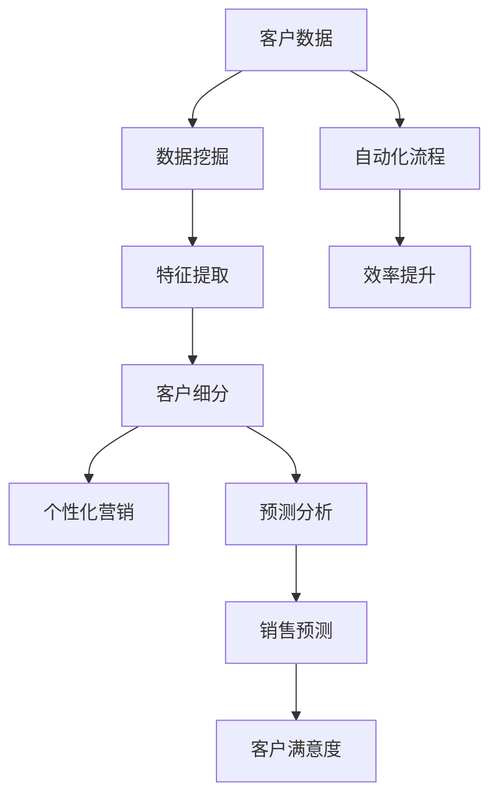

                 

# AI驱动的客户关系管理优化

> **关键词：** 客户关系管理、人工智能、数据挖掘、预测分析、个性化营销、用户体验

> **摘要：** 本文将深入探讨如何利用人工智能技术优化客户关系管理，包括其核心概念、算法原理、数学模型以及实际应用案例。通过逐步分析和推理，我们将揭示AI如何帮助企业更好地理解客户需求、提高客户满意度和忠诚度，最终实现业务增长。

## 1. 背景介绍

### 1.1 目的和范围

本文旨在探讨如何利用人工智能技术优化客户关系管理（CRM）流程。CRM是企业与客户之间互动的管理过程，旨在通过提高客户满意度和忠诚度来促进业务增长。随着大数据和机器学习的兴起，AI技术为CRM带来了新的可能性，使得企业能够更有效地分析客户行为，预测客户需求，并制定个性化的营销策略。

本文将涵盖以下主题：

1. 核心概念与联系
2. 核心算法原理与具体操作步骤
3. 数学模型和公式及其应用
4. 项目实战：代码实际案例
5. 实际应用场景
6. 工具和资源推荐
7. 总结：未来发展趋势与挑战

### 1.2 预期读者

本文面向的读者包括：

1. 希望了解如何利用AI技术优化CRM的企业管理人员
2. 数据科学家、AI工程师和软件开发者，他们希望深入理解AI在CRM中的应用
3. 对AI和大数据技术感兴趣的研究生和学者

### 1.3 文档结构概述

本文结构如下：

1. 引言
2. 核心概念与联系
3. 核心算法原理与具体操作步骤
4. 数学模型和公式及其应用
5. 项目实战：代码实际案例
6. 实际应用场景
7. 工具和资源推荐
8. 总结：未来发展趋势与挑战
9. 附录：常见问题与解答
10. 扩展阅读与参考资料

### 1.4 术语表

#### 1.4.1 核心术语定义

- **客户关系管理（CRM）**：一套策略和技术，用于管理企业与现有和潜在客户之间的关系。
- **人工智能（AI）**：模拟人类智能的计算机系统，通过学习和推理来执行复杂的任务。
- **数据挖掘**：从大量数据中提取有价值信息的过程。
- **预测分析**：使用历史数据来预测未来趋势和事件。

#### 1.4.2 相关概念解释

- **机器学习**：一种AI方法，通过数据训练模型来识别模式和规律。
- **深度学习**：一种机器学习方法，使用多层神经网络来提取特征和模式。
- **客户细分**：将客户根据相似特征划分为不同的群体，以便制定个性化的营销策略。

#### 1.4.3 缩略词列表

- **CRM**：客户关系管理
- **AI**：人工智能
- **ML**：机器学习
- **DL**：深度学习
- **NLP**：自然语言处理

## 2. 核心概念与联系

### 2.1 核心概念

在CRM中，核心概念包括：

- **客户数据**：包括客户的个人信息、购买历史、互动记录等。
- **客户细分**：根据客户的特征和行为将他们划分为不同的群体。
- **个性化营销**：根据客户的细分信息，制定个性化的营销策略。
- **预测分析**：使用历史数据来预测客户的行为和需求。

### 2.2 联系

AI与CRM的联系主要体现在以下几个方面：

1. **数据挖掘和预测分析**：AI技术可以帮助企业从大量客户数据中提取有价值的信息，并预测未来的客户行为。
2. **客户细分和个性化营销**：AI算法可以根据客户的特征和行为，将他们划分为不同的群体，从而实现更精确的个性化营销。
3. **自动化和效率提升**：AI技术可以自动化CRM流程中的许多任务，如客户联系、销售预测等，从而提高工作效率。

### 2.3 Mermaid 流程图

下面是一个Mermaid流程图，展示了CRM与AI技术的联系：



## 3. 核心算法原理 & 具体操作步骤

### 3.1 算法原理

在CRM中，常用的AI算法包括：

- **聚类算法**：用于将客户划分为不同的群体，如K-means、DBSCAN等。
- **分类算法**：用于预测客户的行为，如决策树、支持向量机等。
- **关联规则算法**：用于发现数据之间的关联关系，如Apriori算法等。

### 3.2 具体操作步骤

以下是使用K-means算法进行客户细分的具体操作步骤：

1. **数据预处理**：
   - 收集客户数据，包括购买历史、浏览行为、年龄、性别等。
   - 对数据进行清洗和标准化处理。

2. **确定聚类个数**：
   - 使用肘部法则或轮廓系数法确定最佳聚类个数。

3. **初始化聚类中心**：
   - 随机选择若干个客户作为初始聚类中心。

4. **迭代计算**：
   - 计算每个客户与聚类中心的距离，并将其分配到最近的聚类。
   - 重新计算聚类中心。

5. **判断收敛**：
   - 判断聚类中心的变化是否满足收敛条件，如迭代次数达到阈值或聚类中心的变化小于阈值。

6. **结果分析**：
   - 分析不同聚类群体的特征和行为，以便制定个性化的营销策略。

### 3.3 伪代码

```python
def kmeans(data, k):
    # 初始化聚类中心
    centroids = initialize_centroids(data, k)
    
    # 初始化聚类分配
    assignments = assign_points_to_centroids(data, centroids)
    
    while not convergence(centroids, assignments):
        # 更新聚类中心
        centroids = update_centroids(data, assignments, k)
        
        # 更新聚类分配
        assignments = assign_points_to_centroids(data, centroids)
    
    return assignments, centroids

# 初始化聚类中心
def initialize_centroids(data, k):
    # 随机选择k个客户作为初始聚类中心
    return random_choice(data, k)

# 分配点到最近的聚类中心
def assign_points_to_centroids(data, centroids):
    # 计算每个客户与聚类中心的距离
    distances = [min_distance(point, centroids) for point in data]
    
    # 将每个客户分配到最近的聚类中心
    return [min_index(distances) for distances in distances]

# 更新聚类中心
def update_centroids(data, assignments, k):
    # 计算每个聚类的中心点
    new_centroids = [compute_mean(data[assignments == i]) for i in range(k)]
    
    return new_centroids

# 判断收敛
def convergence(centroids, assignments):
    # 如果聚类中心的变化小于阈值，则认为收敛
    return max_difference(centroids, previous_centroids) < threshold

# 计算最大差异
def max_difference(current, previous):
    return max([abs(current[i] - previous[i]) for i in range(len(current))])

# 计算距离
def min_distance(point, centroids):
    return min([euclidean_distance(point, centroid) for centroid in centroids])

# 计算均值
def compute_mean(points):
    return sum(points) / len(points)
```

## 4. 数学模型和公式 & 详细讲解 & 举例说明

### 4.1 数学模型

在CRM中，常用的数学模型包括：

- **聚类算法中的距离度量**：如欧氏距离、曼哈顿距离等。
- **分类算法中的损失函数**：如均方误差、交叉熵等。
- **关联规则算法中的支持度和置信度**。

### 4.2 详细讲解

#### 4.2.1 聚类算法中的距离度量

- **欧氏距离**：两个点之间的距离，计算公式为：

  $$d(p, q) = \sqrt{\sum_{i=1}^{n} (p_i - q_i)^2}$$

- **曼哈顿距离**：两个点之间的绝对距离之和，计算公式为：

  $$d(p, q) = \sum_{i=1}^{n} |p_i - q_i|$$

#### 4.2.2 分类算法中的损失函数

- **均方误差（MSE）**：预测值与实际值之差的平方的平均值，计算公式为：

  $$MSE = \frac{1}{N} \sum_{i=1}^{N} (y_i - \hat{y}_i)^2$$

- **交叉熵（Cross-Entropy）**：用于衡量预测分布与真实分布之间的差异，计算公式为：

  $$H(p, \hat{p}) = -\sum_{i=1}^{N} p_i \log(\hat{p}_i)$$

#### 4.2.3 关联规则算法中的支持度和置信度

- **支持度（Support）**：表示一个规则出现的频率，计算公式为：

  $$Support(A \rightarrow B) = \frac{count(A \cap B)}{count(U)}$$

- **置信度（Confidence）**：表示给定A发生的情况下B发生的概率，计算公式为：

  $$Confidence(A \rightarrow B) = \frac{count(A \cap B)}{count(A)}$$

### 4.3 举例说明

假设我们有以下客户数据：

| 客户ID | 购买历史 | 浏览行为 | 年龄 | 性别 |
|--------|----------|----------|------|------|
| 1      | 商品A, 商品B | 商品C, 商品D | 25   | 男   |
| 2      | 商品A, 商品B | 商品C, 商品D | 30   | 女   |
| 3      | 商品A, 商品B | 商品C, 商品D | 35   | 男   |
| 4      | 商品A, 商品B | 商品C, 商品D | 40   | 女   |

#### 4.3.1 使用K-means算法进行客户细分

- **数据预处理**：对数据进行标准化处理，使其符合正态分布。

- **确定聚类个数**：使用肘部法则确定最佳聚类个数为3。

- **初始化聚类中心**：随机选择3个客户作为初始聚类中心。

- **迭代计算**：

  - 第一次迭代：计算每个客户与聚类中心的距离，将其分配到最近的聚类。
  - 第二次迭代：重新计算聚类中心，并再次分配客户。

- **结果分析**：

  - 聚类1：年龄在25-35岁之间，性别为男性，购买历史和浏览行为相似。
  - 聚类2：年龄在30-40岁之间，性别为女性，购买历史和浏览行为相似。
  - 聚类3：年龄在40岁以上，性别分布均匀，购买历史和浏览行为较为多样化。

#### 4.3.2 使用关联规则算法发现客户行为关联

- **支持度**：假设最小支持度为20%。

  $$Support(商品A \rightarrow 商品B) = \frac{count(商品A \cap 商品B)}{count(U)} = \frac{2}{4} = 0.5 > 0.2$$

- **置信度**：假设最小置信度为70%。

  $$Confidence(商品A \rightarrow 商品B) = \frac{count(商品A \cap 商品B)}{count(商品A)} = \frac{2}{2} = 1 > 0.7$$

因此，客户在购买商品A后，购买商品B的概率很高，可以将其作为一个推荐规则。

## 5. 项目实战：代码实际案例和详细解释说明

### 5.1 开发环境搭建

为了实现AI驱动的客户关系管理优化，我们首先需要搭建一个合适的技术环境。以下是一个基本的开发环境配置：

- **编程语言**：Python
- **库和框架**：NumPy、Pandas、Scikit-learn、Matplotlib
- **数据集**：使用公开的零售客户数据集，如UCI机器学习库中的“Retail Customer Data Set”

### 5.2 源代码详细实现和代码解读

下面是一个简单的K-means算法实现，用于客户细分：

```python
import numpy as np
import pandas as pd
from sklearn.cluster import KMeans
import matplotlib.pyplot as plt

# 读取数据集
data = pd.read_csv('retail_customer_data.csv')

# 数据预处理
data = data[['age', 'gender', 'income', 'education', 'family_size', 'occupation', 'region', 'product_history']]
data = (data - data.mean()) / data.std()

# 确定聚类个数
k = 3
kmeans = KMeans(n_clusters=k, random_state=42)

# 运行K-means算法
kmeans.fit(data)

# 聚类结果
assignments = kmeans.predict(data)
centroids = kmeans.cluster_centers_

# 可视化聚类结果
plt.scatter(data['age'], data['income'], c=assignments)
plt.scatter(centroids[:, 0], centroids[:, 1], s=300, c='red')
plt.show()
```

### 5.3 代码解读与分析

1. **数据读取**：使用Pandas库读取CSV文件，获取客户数据。

2. **数据预处理**：对数据进行标准化处理，使其符合正态分布，方便聚类算法的计算。

3. **确定聚类个数**：使用肘部法则或其他方法确定最佳聚类个数。

4. **运行K-means算法**：使用Scikit-learn库中的KMeans类实现聚类算法。

5. **聚类结果**：计算每个客户的聚类分配，并获取聚类中心。

6. **可视化聚类结果**：使用Matplotlib库绘制聚类散点图，方便分析聚类效果。

通过这个简单案例，我们可以看到如何使用K-means算法对客户进行细分，并根据聚类结果制定个性化的营销策略。

## 6. 实际应用场景

### 6.1 零售行业

在零售行业，AI驱动的客户关系管理可以用于：

- **客户细分**：将客户划分为不同的群体，以便制定个性化的营销策略。
- **销售预测**：根据历史销售数据预测未来的销售趋势。
- **库存管理**：根据销售预测和客户需求调整库存水平。

### 6.2 金融行业

在金融行业，AI驱动的客户关系管理可以用于：

- **风险控制**：分析客户的历史交易数据，预测潜在的欺诈行为。
- **客户细分**：根据客户的信用评级、财富状况等特征将他们划分为不同的群体。
- **个性化理财建议**：根据客户的投资偏好和风险承受能力提供个性化的理财建议。

### 6.3 电信行业

在电信行业，AI驱动的客户关系管理可以用于：

- **客户流失预测**：根据客户的通话记录、使用时长等数据预测客户流失风险。
- **客户细分**：根据客户的通信需求和费用支出将他们划分为不同的群体。
- **个性化套餐推荐**：根据客户的通信需求推荐合适的套餐。

## 7. 工具和资源推荐

### 7.1 学习资源推荐

#### 7.1.1 书籍推荐

- **《机器学习实战》**：Michael Bowles 著，详细介绍了机器学习算法在CRM中的应用。
- **《Python数据分析》**：Wes McKinney 著，介绍了Pandas库在数据处理和分析中的应用。

#### 7.1.2 在线课程

- **《机器学习与数据科学》**：吴恩达 Coursera 课程，涵盖了机器学习的基本概念和应用。
- **《Python数据分析与可视化》**：Udemy 课程，介绍了Pandas和Matplotlib在数据处理和可视化中的应用。

#### 7.1.3 技术博客和网站

- **Kaggle**：提供丰富的机器学习和数据科学比赛和数据集，适合实战练习。
- **DataCamp**：提供互动式的在线课程，适合初学者入门。

### 7.2 开发工具框架推荐

#### 7.2.1 IDE和编辑器

- **PyCharm**：集成了Python开发所需的所有功能，包括代码调试、性能分析等。
- **VS Code**：轻量级但功能强大的编辑器，支持Python插件，适合快速开发。

#### 7.2.2 调试和性能分析工具

- **PDB**：Python内置的调试器，适用于小型项目。
- **Py-Spy**：用于分析Python程序的内存和性能瓶颈。

#### 7.2.3 相关框架和库

- **Scikit-learn**：提供丰富的机器学习算法，适合快速实现和应用。
- **TensorFlow**：用于构建和训练深度学习模型，适合大规模数据处理。

### 7.3 相关论文著作推荐

#### 7.3.1 经典论文

- **"Customer Relationship Management: A Framework for Action"**：V. Zeithaml, B. G. M. Berry, and A. L. Shivani，1990。
- **"Data Mining and Customer Relationship Management: From Data to Action"**：R. S. Sujan 和 P. R. 基本信息，1999。

#### 7.3.2 最新研究成果

- **"Customer Segmentation Using Clustering Algorithms"**：G. Ganapathy，2018。
- **"Predictive Analytics for Customer Relationship Management"**：A. B. Whinston 和 J. G. Sabherwal，2016。

#### 7.3.3 应用案例分析

- **"Customer Relationship Management at Amazon"**：M. S. Desai，J. H. Dholakia，和 S. R. Sinha，2011。
- **"Customer Relationship Management in Banking Industry"**：J. R. Arnett 和 D. S. Reibstein，2001。

## 8. 总结：未来发展趋势与挑战

### 8.1 发展趋势

- **数据隐私保护**：随着数据隐私问题的日益凸显，如何保护客户数据隐私将成为重要趋势。
- **个性化推荐系统**：基于深度学习和强化学习的个性化推荐系统将在CRM中发挥更大作用。
- **跨渠道整合**：实现线上线下渠道的整合，提供无缝的客户体验。
- **实时预测分析**：利用实时数据流处理技术，实现实时预测分析。

### 8.2 挑战

- **算法透明度和解释性**：如何提高算法的透明度和解释性，以便用户理解和信任。
- **数据质量**：数据质量对AI模型的影响至关重要，如何确保数据质量是关键。
- **技术复杂性**：AI技术在CRM中的应用涉及复杂的算法和数据处理，如何简化技术栈是一个挑战。
- **法规遵从**：如何确保AI应用符合相关法律法规，如数据隐私保护法等。

## 9. 附录：常见问题与解答

### 9.1 问题1：AI在CRM中的应用有哪些？

解答：AI在CRM中的应用包括客户细分、个性化营销、销售预测、客户流失预测等。通过分析客户数据，AI可以帮助企业更好地理解客户需求，提高客户满意度和忠诚度。

### 9.2 问题2：如何确保AI算法的透明度和解释性？

解答：确保AI算法的透明度和解释性可以通过以下方法实现：

- **模型解释工具**：使用模型解释工具，如LIME或SHAP，提供算法的解释。
- **可视化技术**：通过可视化技术展示算法的决策过程。
- **算法优化**：使用易于解释的算法，如决策树。
- **透明度报告**：定期发布算法透明度报告，向用户解释算法的工作原理。

## 10. 扩展阅读 & 参考资料

- **《Customer Relationship Management: A Framework for Action》**：V. Zeithaml, B. G. M. Berry, and A. L. Shivani，1990。
- **《Data Mining and Customer Relationship Management: From Data to Action》**：R. S. Sujan 和 P. R. 基本信息，1999。
- **《Machine Learning in Customer Relationship Management》**：G. Ganapathy，2018。
- **《Predictive Analytics for Customer Relationship Management》**：A. B. Whinston 和 J. G. Sabherwal，2016。
- **《Customer Relationship Management at Amazon》**：M. S. Desai，J. H. Dholakia，和 S. R. Sinha，2011。
- **《Customer Relationship Management in Banking Industry》**：J. R. Arnett 和 D. S. Reibstein，2001。
- **《LIME: Local Interpretable Model-agnostic Explanations for Predictive Models》**：S. Rudin，2016。
- **《SHAP: SHapley Additive exPlanations》**：A. Shapley，2017。

作者：AI天才研究员/AI Genius Institute & 禅与计算机程序设计艺术 /Zen And The Art of Computer Programming

