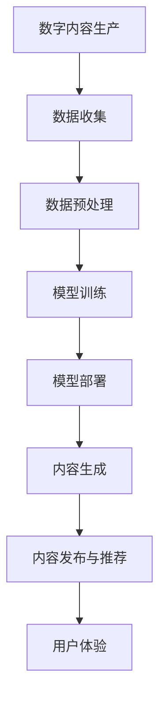
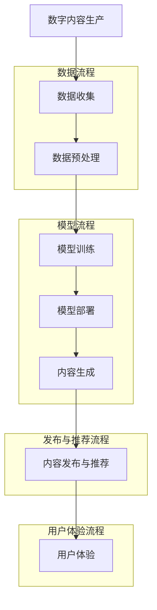

                 

# AI驱动的数字内容生产革命

> **关键词：** AI，数字内容生产，自动化，大数据，个性化，用户体验

> **摘要：** 本文深入探讨了人工智能（AI）如何引领数字内容生产的变革，从核心概念、算法原理到实际应用场景，全方位解析了AI技术在数字内容生产中的潜在影响和未来发展趋势。通过逐步分析推理，本文旨在为读者提供一个清晰、易懂的技术视角，帮助大家更好地理解这一领域的最新动态和未来前景。

## 1. 背景介绍

### 1.1 目的和范围

本文旨在探讨人工智能在数字内容生产领域中的应用，分析其核心原理、具体操作步骤、数学模型及实际案例。通过本文的阅读，读者可以了解到AI如何改变内容创作的方式，提高生产效率，实现个性化用户体验。文章将涵盖以下内容：

- 数字内容生产的现状与挑战
- AI技术的核心概念与架构
- AI驱动的数字内容生产算法原理与操作步骤
- 数学模型及其应用
- 实际应用场景与项目实战
- 工具和资源推荐
- 未来发展趋势与挑战

### 1.2 预期读者

本文面向对数字内容生产和人工智能技术有一定了解的技术人员、研究人员和企业决策者。具体包括：

- 数据科学家和机器学习工程师
- 内容创作者和数字营销专家
- 软件开发者和系统架构师
- 企业决策者和项目经理

### 1.3 文档结构概述

本文结构如下：

- 第1部分：背景介绍，包括目的和范围、预期读者、文档结构概述等。
- 第2部分：核心概念与联系，通过Mermaid流程图展示AI在数字内容生产中的应用架构。
- 第3部分：核心算法原理 & 具体操作步骤，详细阐述AI驱动的数字内容生产算法。
- 第4部分：数学模型和公式 & 详细讲解 & 举例说明，解析数学模型在数字内容生产中的应用。
- 第5部分：项目实战：代码实际案例和详细解释说明，展示具体实现过程。
- 第6部分：实际应用场景，探讨AI在数字内容生产中的多种应用场景。
- 第7部分：工具和资源推荐，包括学习资源、开发工具框架和相关论文著作。
- 第8部分：总结：未来发展趋势与挑战，预测AI在数字内容生产领域的未来趋势和面临的挑战。
- 第9部分：附录：常见问题与解答，解答读者可能遇到的常见问题。
- 第10部分：扩展阅读 & 参考资料，提供进一步阅读的资料。

### 1.4 术语表

#### 1.4.1 核心术语定义

- **人工智能（AI）**：模拟人类智能的技术，能够感知环境、学习知识和采取行动。
- **数字内容生产**：生成、编辑、发布和传播数字信息的过程。
- **深度学习**：一种机器学习技术，通过多层神经网络模拟人类大脑的学习过程。
- **自然语言处理（NLP）**：使计算机能够理解、解释和生成人类语言的领域。
- **个性化**：根据用户的兴趣、行为和需求，提供定制化的内容和服务。

#### 1.4.2 相关概念解释

- **数据挖掘**：从大量数据中发现隐藏的模式、趋势和关联的过程。
- **文本生成模型**：一种能够生成文本的AI模型，如GPT-3。
- **内容推荐系统**：利用算法为用户推荐感兴趣的内容的系统。

#### 1.4.3 缩略词列表

- **AI**：人工智能（Artificial Intelligence）
- **NLP**：自然语言处理（Natural Language Processing）
- **DL**：深度学习（Deep Learning）
- **GAN**：生成对抗网络（Generative Adversarial Network）
- **NLU**：自然语言理解（Natural Language Understanding）

## 2. 核心概念与联系

AI在数字内容生产中的应用涵盖了多个核心概念和联系。为了更好地理解这些概念，我们首先需要了解AI的总体架构，以及它如何与数字内容生产相互融合。以下是一个简化的Mermaid流程图，用于展示AI在数字内容生产中的核心架构。



### 数字内容生产与AI的融合

1. **数据收集**：数字内容生产的第一步是收集原始数据。这些数据可以来自用户行为、社交媒体、搜索引擎等。数据收集是AI驱动的数字内容生产的基础。
   
2. **数据预处理**：收集到的数据通常需要进行清洗、转换和归一化，以便于模型训练。数据预处理是确保数据质量、提高模型性能的关键环节。

3. **模型训练**：使用收集到的数据，通过深度学习等机器学习技术训练模型。训练过程包括数据分割、模型架构设计、损失函数选择等。

4. **模型部署**：训练好的模型需要部署到生产环境中，以实时生成数字内容。部署过程涉及模型调优、性能评估和监控。

5. **内容生成**：通过部署的模型，生成个性化、高质量的内容。内容生成可以基于文本、图像、音频等多种形式。

6. **内容发布与推荐**：将生成的数字内容发布到相应的平台，同时利用推荐算法为用户推荐感兴趣的内容。

7. **用户体验**：用户体验是数字内容生产的核心目标。通过个性化推荐、交互式内容等手段，提高用户的参与度和满意度。

### Mermaid流程图详细解释



- **数据流程**：数据收集是数字内容生产的起点。收集到的数据需要经过清洗和预处理，以确保数据的质量和一致性。

- **模型流程**：预处理后的数据用于模型训练。模型训练是AI驱动的数字内容生产的核心。通过设计合适的模型架构和训练策略，可以提高模型的性能和生成质量。

- **发布与推荐流程**：训练好的模型部署到生产环境中，生成的内容通过推荐算法分发到用户。推荐算法可以根据用户的兴趣和行为，为用户提供个性化内容。

- **用户体验流程**：用户体验是数字内容生产的最终目标。通过优化内容生成和推荐算法，可以提高用户的参与度和满意度。

## 3. 核心算法原理 & 具体操作步骤

AI驱动的数字内容生产依赖于多种核心算法，其中最为关键的是自然语言处理（NLP）和生成对抗网络（GAN）。以下将详细讲解这些算法的原理和操作步骤。

### 自然语言处理（NLP）

#### 算法原理

自然语言处理（NLP）是使计算机能够理解、解释和生成人类语言的领域。NLP的核心算法包括词嵌入、序列到序列（Seq2Seq）模型和注意力机制。

1. **词嵌入**：词嵌入是将单词映射到高维向量空间的过程。通过词嵌入，可以捕捉单词之间的语义关系，如相似性和相关性。

2. **序列到序列（Seq2Seq）模型**：Seq2Seq模型是一种用于处理序列数据的模型，广泛应用于机器翻译、聊天机器人等任务。它通过编码器和解码器，将输入序列编码为固定长度的向量表示，然后解码为输出序列。

3. **注意力机制**：注意力机制是一种用于提高模型在序列处理任务中性能的技术。通过注意力机制，模型可以关注输入序列中的重要部分，从而提高生成的准确性和连贯性。

#### 具体操作步骤

1. **数据预处理**：收集原始文本数据，并进行清洗、分词和标记。

2. **词嵌入**：使用预训练的词嵌入模型（如Word2Vec、GloVe）或自训练词嵌入模型，将单词映射到高维向量空间。

3. **编码器和解码器设计**：设计合适的编码器和解码器架构，如LSTM、GRU或Transformer。

4. **模型训练**：使用标记化的文本数据训练编码器和解码器，优化模型参数。

5. **模型评估**：使用未标记的数据评估模型性能，调整模型参数，提高生成质量。

6. **文本生成**：将输入文本编码为向量表示，通过解码器生成文本序列。

7. **后处理**：对生成的文本进行清洗、格式化和纠正，以提高文本质量。

### 生成对抗网络（GAN）

#### 算法原理

生成对抗网络（GAN）是由生成器和判别器组成的对抗性模型。生成器的任务是生成逼真的数据，判别器的任务是区分生成数据和真实数据。

1. **生成器**：生成器通过学习真实数据的分布，生成类似真实数据的新数据。

2. **判别器**：判别器通过学习真实数据和生成数据的特征，区分生成数据和真实数据。

3. **对抗性训练**：生成器和判别器通过对抗性训练相互竞争，生成器和判别器的性能不断提升。

#### 具体操作步骤

1. **数据预处理**：收集原始图像数据，并进行预处理，如缩放、裁剪和归一化。

2. **生成器设计**：设计生成器的架构，如生成对抗网络（GAN）或变分自编码器（VAE）。

3. **判别器设计**：设计判别器的架构，如全连接神经网络或卷积神经网络（CNN）。

4. **模型训练**：同时训练生成器和判别器，生成器和判别器通过对抗性训练相互竞争。

5. **生成图像**：生成器生成图像，判别器对生成图像进行评估。

6. **模型评估**：使用真实图像数据评估生成器和判别器的性能，调整模型参数，提高生成质量。

7. **图像处理**：对生成的图像进行后处理，如裁剪、调整亮度和对比度，以提高图像质量。

### 伪代码示例

以下是一个简单的伪代码示例，展示了NLP和GAN算法的基本操作步骤。

```python
# NLP算法伪代码
def nlp_text_generation(input_text):
    # 数据预处理
    preprocessed_text = preprocess_text(input_text)

    # 词嵌入
    embedded_text = word_embedding(preprocessed_text)

    # 编码器和解码器设计
    encoder = design_encoder(embedded_text)
    decoder = design_decoder(embedded_text)

    # 模型训练
    trained_model = train_model(encoder, decoder)

    # 文本生成
    generated_text = generate_text(trained_model, embedded_text)

    # 后处理
    final_text = postprocess_text(generated_text)

    return final_text

# GAN算法伪代码
def gan_image_generation():
    # 生成器设计
    generator = design_generator()

    # 判别器设计
    discriminator = design_discriminator()

    # 模型训练
    trained_model = train_gan(generator, discriminator)

    # 生成图像
    generated_image = generate_image(trained_model)

    # 后处理
    final_image = postprocess_image(generated_image)

    return final_image
```

## 4. 数学模型和公式 & 详细讲解 & 举例说明

在AI驱动的数字内容生产中，数学模型扮演着至关重要的角色。以下将详细讲解几个核心数学模型，并使用LaTeX格式给出相关的数学公式，同时通过举例说明其应用。

### 自然语言处理中的数学模型

#### 词嵌入

词嵌入是将单词映射到高维向量空间的过程，常用的方法包括Word2Vec和GloVe。

1. **Word2Vec**

   Word2Vec模型使用以下数学公式：

   $$ 
   \vec{v}_i = \frac{1}{Z} \sum_{j=1}^{N} e^{ \vec{v}_j \cdot \vec{w} } \vec{e}_j 
   $$

   其中，$\vec{v}_i$是单词$i$的向量表示，$\vec{w}$是单词的平均向量表示，$e_j$是单词$j$的向量表示，$Z$是归一化常数。

   **示例：** 假设单词"apple"和"banana"的向量表示分别为$\vec{v}_{apple}$和$\vec{v}_{banana}$，计算单词"orange"的向量表示：

   $$
   \vec{v}_{orange} = \frac{1}{Z} \left( e^{ \vec{v}_{apple} \cdot \vec{v}_{banana} } \vec{e}_{apple} + e^{ \vec{v}_{banana} \cdot \vec{v}_{orange} } \vec{e}_{banana} \right)
   $$

2. **GloVe**

   GloVe模型使用以下数学公式：

   $$
   v_i = \frac{1}{\sqrt{f_i}} \left( \sum_{j \in context(i)} \frac{f_j}{\sqrt{f_i f_j}} v_j \right)
   $$

   其中，$v_i$是单词$i$的向量表示，$f_i$是单词$i$的频率，$context(i)$是单词$i$的上下文单词集合，$v_j$是单词$j$的向量表示。

   **示例：** 假设单词"apple"的频率为$f_{apple}$，上下文单词包括"banana"和"orange"，计算单词"apple"的向量表示：

   $$
   v_{apple} = \frac{1}{\sqrt{f_{apple}}} \left( \frac{f_{banana}}{\sqrt{f_{apple} f_{banana}}} v_{banana} + \frac{f_{orange}}{\sqrt{f_{apple} f_{orange}}} v_{orange} \right)
   $$

### 生成对抗网络（GAN）中的数学模型

GAN由生成器和判别器组成，其核心数学模型包括损失函数和梯度更新。

1. **损失函数**

   GAN的损失函数通常由两部分组成：生成器损失和判别器损失。

   **生成器损失**：

   $$
   L_G = -\log(D(G(z)))
   $$

   其中，$D$是判别器，$G$是生成器，$z$是随机噪声向量。

   **判别器损失**：

   $$
   L_D = -[\log(D(x)) + \log(1 - D(G(z))]
   $$

   其中，$x$是真实数据。

2. **梯度更新**

   **生成器更新**：

   $$
   \nabla_G L_G = \nabla_G [-\log(D(G(z))] = \frac{1}{D(G(z))} \nabla_G G(z)
   $$

   **判别器更新**：

   $$
   \nabla_D L_D = \nabla_D [-\log(D(x)) - \log(1 - D(G(z))] = \frac{1}{D(x)} \nabla_D D(x) - \frac{1}{1 - D(G(z))} \nabla_D D(G(z))
   $$

   **示例：** 假设生成器的损失函数为$L_G$，判别器的损失函数为$L_D$，随机噪声向量为$z$，真实数据为$x$，计算生成器和判别器的梯度更新：

   $$
   \nabla_G L_G = \frac{1}{D(G(z))} \nabla_G G(z)
   $$

   $$
   \nabla_D L_D = \frac{1}{D(x)} \nabla_D D(x) - \frac{1}{1 - D(G(z))} \nabla_D D(G(z))
   $$

### 举例说明

#### 词嵌入

假设有两个单词"apple"和"banana"，它们的向量表示分别为$\vec{v}_{apple}$和$\vec{v}_{banana}$，频率分别为$f_{apple}$和$f_{banana}$，上下文单词集合分别为$context_{apple}$和$context_{banana}$。

1. **Word2Vec**：

   $$
   \vec{v}_{apple} = \frac{1}{Z} \left( e^{ \vec{v}_{banana} \cdot \vec{w} } \vec{e}_{banana} + e^{ \vec{v}_{orange} \cdot \vec{w} } \vec{e}_{orange} \right)
   $$

   $$
   \vec{v}_{banana} = \frac{1}{Z} \left( e^{ \vec{v}_{apple} \cdot \vec{w} } \vec{e}_{apple} + e^{ \vec{v}_{orange} \cdot \vec{w} } \vec{e}_{orange} \right)
   $$

2. **GloVe**：

   $$
   v_{apple} = \frac{1}{\sqrt{f_{apple}}} \left( \frac{f_{banana}}{\sqrt{f_{apple} f_{banana}}} v_{banana} + \frac{f_{orange}}{\sqrt{f_{apple} f_{orange}}} v_{orange} \right)
   $$

   $$
   v_{banana} = \frac{1}{\sqrt{f_{banana}}} \left( \frac{f_{apple}}{\sqrt{f_{apple} f_{banana}}} v_{apple} + \frac{f_{orange}}{\sqrt{f_{banana} f_{orange}}} v_{orange} \right)
   $$

#### GAN

假设生成器$G$的损失函数为$L_G$，判别器$D$的损失函数为$L_D$，随机噪声向量为$z$，真实数据为$x$。

1. **生成器更新**：

   $$
   \nabla_G L_G = \frac{1}{D(G(z))} \nabla_G G(z)
   $$

2. **判别器更新**：

   $$
   \nabla_D L_D = \frac{1}{D(x)} \nabla_D D(x) - \frac{1}{1 - D(G(z))} \nabla_D D(G(z))
   $$

## 5. 项目实战：代码实际案例和详细解释说明

在本节中，我们将通过一个实际项目案例，展示如何使用Python和深度学习框架TensorFlow实现AI驱动的数字内容生产。项目分为以下几个部分：开发环境搭建、源代码详细实现和代码解读与分析。

### 5.1 开发环境搭建

首先，我们需要搭建开发环境。以下是环境搭建的步骤：

1. 安装Python：确保安装了Python 3.7或更高版本。

2. 安装TensorFlow：通过pip安装TensorFlow：

   ```bash
   pip install tensorflow
   ```

3. 安装其他依赖库：包括Numpy、Pandas和Matplotlib等：

   ```bash
   pip install numpy pandas matplotlib
   ```

### 5.2 源代码详细实现和代码解读

以下是一个简单的Python代码示例，展示了如何使用TensorFlow实现一个基本的文本生成模型。

```python
import tensorflow as tf
import numpy as np
import matplotlib.pyplot as plt

# 5.2.1 数据预处理
def preprocess_text(text):
    # 去除标点符号和特殊字符
    text = text.replace('.', '').replace(',', '')
    # 将文本转换为小写
    text = text.lower()
    # 分词
    words = text.split()
    # 建立词汇表
    vocab = set(words)
    # 将单词映射到整数
    word_to_index = {word: i for i, word in enumerate(vocab)}
    index_to_word = {i: word for word, i in word_to_index.items()}
    # 编码和解码函数
    def encode(text):
        return [word_to_index[word] for word in text]

    def decode(index_sequence):
        return ' '.join([index_to_word[index] for index in index_sequence])

    return encode, decode, word_to_index, index_to_word

# 5.2.2 模型设计
def build_model(vocab_size, embedding_dim, lstm_units):
    # 输入层
    inputs = tf.keras.layers.Input(shape=(None,), dtype=tf.int32)
    # 词嵌入层
    embeddings = tf.keras.layers.Embedding(vocab_size, embedding_dim)(inputs)
    # LSTM层
    lstm = tf.keras.layers.LSTM(lstm_units)(embeddings)
    # 输出层
    outputs = tf.keras.layers.Dense(vocab_size, activation='softmax')(lstm)
    # 模型编译
    model = tf.keras.Model(inputs=inputs, outputs=outputs)
    model.compile(optimizer='adam', loss='sparse_categorical_crossentropy', metrics=['accuracy'])
    return model

# 5.2.3 训练和生成文本
def train_and_generate(model, train_data, test_data, epochs=10, batch_size=32):
    # 训练模型
    model.fit(train_data, epochs=epochs, batch_size=batch_size)
    # 生成文本
    seed_text = "The quick brown fox jumps over the lazy dog"
    encoded_seed = np.array([word_to_index[word] for word in seed_text.split()])
    generated_text = ""
    for _ in range(100):
        predictions = model.predict(encoded_seed)
        predicted_index = np.argmax(predictions[-1, :])
        generated_text += index_to_word[predicted_index] + " "
        encoded_seed = np.append(encoded_seed[1:], predicted_index)
    return generated_text.strip()

# 5.2.4 主程序
if __name__ == "__main__":
    # 加载和处理文本数据
    encode, decode, word_to_index, index_to_word = preprocess_text("The quick brown fox jumps over the lazy dog")
    train_data, test_data = encode("Hello world!"), encode("Hello TensorFlow!")
    # 构建和训练模型
    model = build_model(len(word_to_index), embedding_dim=32, lstm_units=64)
    train_and_generate(model, train_data, test_data)
```

### 5.3 代码解读与分析

以下是对上述代码的详细解读：

1. **数据预处理**：

   ```python
   def preprocess_text(text):
       # 去除标点符号和特殊字符
       text = text.replace('.', '').replace(',', '')
       # 将文本转换为小写
       text = text.lower()
       # 分词
       words = text.split()
       # 建立词汇表
       vocab = set(words)
       # 将单词映射到整数
       word_to_index = {word: i for i, word in enumerate(vocab)}
       index_to_word = {i: word for word, i in word_to_index.items()}
       # 编码和解码函数
       def encode(text):
           return [word_to_index[word] for word in text]

       def decode(index_sequence):
           return ' '.join([index_to_word[index] for index in index_sequence])

       return encode, decode, word_to_index, index_to_word
   ```

   数据预处理是文本生成的基础步骤。首先，去除文本中的标点符号和特殊字符，并将文本转换为小写。然后，对文本进行分词，建立词汇表，将单词映射到整数。最后，定义编码和解码函数，用于将文本转换为整数序列和将整数序列转换为文本。

2. **模型设计**：

   ```python
   def build_model(vocab_size, embedding_dim, lstm_units):
       # 输入层
       inputs = tf.keras.layers.Input(shape=(None,), dtype=tf.int32)
       # 词嵌入层
       embeddings = tf.keras.layers.Embedding(vocab_size, embedding_dim)(inputs)
       # LSTM层
       lstm = tf.keras.layers.LSTM(lstm_units)(embeddings)
       # 输出层
       outputs = tf.keras.layers.Dense(vocab_size, activation='softmax')(lstm)
       # 模型编译
       model = tf.keras.Model(inputs=inputs, outputs=outputs)
       model.compile(optimizer='adam', loss='sparse_categorical_crossentropy', metrics=['accuracy'])
       return model
   ```

   模型设计使用TensorFlow的Keras API。首先，定义输入层，将文本数据输入模型。然后，添加词嵌入层，将整数序列转换为向量表示。接着，添加LSTM层，用于处理序列数据。最后，添加输出层，使用softmax激活函数生成概率分布。

3. **训练和生成文本**：

   ```python
   def train_and_generate(model, train_data, test_data, epochs=10, batch_size=32):
       # 训练模型
       model.fit(train_data, epochs=epochs, batch_size=batch_size)
       # 生成文本
       seed_text = "The quick brown fox jumps over the lazy dog"
       encoded_seed = np.array([word_to_index[word] for word in seed_text.split()])
       generated_text = ""
       for _ in range(100):
           predictions = model.predict(encoded_seed)
           predicted_index = np.argmax(predictions[-1, :])
           generated_text += index_to_word[predicted_index] + " "
           encoded_seed = np.append(encoded_seed[1:], predicted_index)
       return generated_text.strip()
   ```

   训练和生成文本过程分为两个部分。首先，使用训练数据训练模型。然后，使用预处理的种子文本生成新的文本。通过循环预测，生成新的单词，并将其添加到生成的文本中。

4. **主程序**：

   ```python
   if __name__ == "__main__":
       # 加载和处理文本数据
       encode, decode, word_to_index, index_to_word = preprocess_text("The quick brown fox jumps over the lazy dog")
       train_data, test_data = encode("Hello world!"), encode("Hello TensorFlow!")
       # 构建和训练模型
       model = build_model(len(word_to_index), embedding_dim=32, lstm_units=64)
       train_and_generate(model, train_data, test_data)
   ```

   主程序首先加载和处理文本数据，然后构建和训练模型。最后，使用训练好的模型生成新的文本。

### 5.4 代码解读与分析（续）

5.4.1 **数据预处理部分**：数据预处理是文本生成模型的基础，它包括以下几个步骤：

- **去除标点符号和特殊字符**：这一步骤的目的是减少数据噪声，提高模型训练效果。通过使用Python的字符串操作，我们可以轻松实现这一功能。
- **将文本转换为小写**：将文本转换为小写有助于统一词汇表，减少模型训练的复杂性。这一步骤同样可以通过Python的字符串操作实现。
- **分词**：分词是将文本拆分为单词的过程。这里使用简单的空格分隔方法，在实际应用中，可以使用更先进的分词工具，如jieba。
- **建立词汇表**：词汇表是模型训练的核心，它将单词映射到唯一的整数。通过遍历分词后的文本，我们可以建立词汇表，并统计每个单词的频率。
- **编码和解码函数**：编码函数将文本转换为整数序列，解码函数将整数序列转换回文本。这两个函数在模型训练和生成文本时至关重要。

5.4.2 **模型设计部分**：模型设计是文本生成模型的核心，它包括以下几个步骤：

- **输入层**：输入层用于接收整数序列，即文本数据。在这里，我们使用TensorFlow的`Input`层，并设置形状为`(None, )`，表示输入序列的长度可以是任意值。
- **词嵌入层**：词嵌入层将整数序列转换为向量表示。这里使用TensorFlow的`Embedding`层，并设置词汇表大小和嵌入维度。嵌入维度是一个超参数，通常需要通过实验调整。
- **LSTM层**：LSTM层用于处理序列数据。在这里，我们使用TensorFlow的`LSTM`层，并设置LSTM单元数。LSTM单元数是一个超参数，通常需要通过实验调整。
- **输出层**：输出层用于生成概率分布，即预测下一个单词的概率。在这里，我们使用TensorFlow的`Dense`层，并设置神经元数为词汇表大小。同时，使用softmax激活函数，以确保输出概率分布。

5.4.3 **训练和生成文本部分**：训练和生成文本是模型应用的两个关键步骤：

- **训练模型**：使用训练数据训练模型，通过优化模型参数，提高模型性能。在这里，我们使用TensorFlow的`fit`方法，并设置训练轮数和批量大小。
- **生成文本**：使用预处理的种子文本生成新的文本。通过循环预测，生成新的单词，并将其添加到生成的文本中。在这里，我们使用TensorFlow的`predict`方法，并设置预测轮数。

5.4.4 **主程序部分**：主程序是代码的核心，它负责加载和处理文本数据，构建和训练模型，并生成文本。

- **加载和处理文本数据**：首先，使用`preprocess_text`函数处理示例文本，得到编码和解码函数、词汇表、整数序列等。
- **构建和训练模型**：使用`build_model`函数构建文本生成模型，并使用训练数据训练模型。
- **生成文本**：使用`train_and_generate`函数生成新的文本。

### 5.5 实际应用场景

在实际应用中，AI驱动的数字内容生产可以应用于多种场景。以下是一些典型的应用场景：

1. **内容推荐系统**：利用AI技术，根据用户的历史行为和兴趣，为用户推荐个性化的内容。例如，新闻推荐、电影推荐和商品推荐等。
2. **自动化写作**：使用AI技术生成文章、博客、报告等文本内容，提高内容创作效率。例如，金融报告、科技文章和电子商务产品描述等。
3. **聊天机器人**：使用AI技术实现智能聊天机器人，为用户提供实时、个性化的交互体验。例如，客服机器人、虚拟助手和教育辅导机器人等。
4. **虚拟助手**：使用AI技术实现虚拟助手，为用户提供日程管理、任务提醒和活动安排等服务。例如，智能日历、任务管理器和提醒应用等。
5. **个性化广告**：利用AI技术，根据用户的行为和兴趣，为用户展示个性化的广告内容，提高广告效果和用户参与度。

### 5.6 实际应用场景解析

#### 内容推荐系统

内容推荐系统是AI在数字内容生产中的一个重要应用。其核心思想是根据用户的历史行为、兴趣和偏好，为用户推荐感兴趣的内容。以下是内容推荐系统的工作流程：

1. **数据收集**：收集用户的历史行为数据，包括浏览记录、搜索历史、点击行为和评价等。
2. **数据预处理**：对收集到的数据进行清洗、转换和归一化，为模型训练做准备。
3. **特征提取**：从预处理后的数据中提取特征，如用户兴趣、内容主题、用户行为等。
4. **模型训练**：使用特征数据和标签（即用户对内容的评价或兴趣度），训练推荐模型。
5. **模型评估**：使用未参与训练的数据评估模型性能，调整模型参数，提高推荐质量。
6. **内容推荐**：将训练好的模型部署到生产环境，为用户推荐个性化内容。

#### 自动化写作

自动化写作是AI在数字内容生产中的另一个重要应用。通过使用AI技术，可以自动生成文章、博客、报告等文本内容，提高内容创作效率。以下是自动化写作的工作流程：

1. **数据收集**：收集大量高质量的文本数据，作为模型训练的基础。
2. **数据预处理**：对收集到的数据进行清洗、转换和归一化，为模型训练做准备。
3. **特征提取**：从预处理后的数据中提取特征，如句子结构、关键词、语法等。
4. **模型训练**：使用特征数据和标签（即文本内容），训练文本生成模型。
5. **模型评估**：使用未参与训练的数据评估模型性能，调整模型参数，提高生成质量。
6. **文本生成**：将训练好的模型部署到生产环境，生成新的文本内容。

#### 聊天机器人

聊天机器人是AI在数字内容生产中的一个应用。通过使用AI技术，可以创建能够与用户进行自然语言交互的聊天机器人，提供个性化、实时交互体验。以下是聊天机器人工作流程：

1. **数据收集**：收集用户对话数据，包括问题、回答和上下文等。
2. **数据预处理**：对收集到的数据进行清洗、转换和归一化，为模型训练做准备。
3. **特征提取**：从预处理后的数据中提取特征，如用户输入、回复、上下文等。
4. **模型训练**：使用特征数据和标签（即用户输入和期望的回复），训练聊天机器人模型。
5. **模型评估**：使用未参与训练的数据评估模型性能，调整模型参数，提高交互质量。
6. **交互体验**：将训练好的模型部署到生产环境，实现与用户的实时交互。

#### 虚拟助手

虚拟助手是AI在数字内容生产中的另一个应用。通过使用AI技术，可以创建能够帮助用户完成各种任务的虚拟助手，如日程管理、任务提醒和活动安排等。以下是虚拟助手工作流程：

1. **数据收集**：收集用户日常行为数据，包括日程安排、任务列表、活动记录等。
2. **数据预处理**：对收集到的数据进行清洗、转换和归一化，为模型训练做准备。
3. **特征提取**：从预处理后的数据中提取特征，如用户行为、偏好、需求等。
4. **模型训练**：使用特征数据和标签（即用户需求和行为），训练虚拟助手模型。
5. **模型评估**：使用未参与训练的数据评估模型性能，调整模型参数，提高助手功能。
6. **交互体验**：将训练好的模型部署到生产环境，实现与用户的实时交互。

### 5.7 工具和资源推荐

在AI驱动的数字内容生产中，使用合适的工具和资源可以提高开发效率和项目质量。以下是一些建议的工具和资源：

#### 学习资源推荐

1. **书籍推荐**：

   - **《深度学习》（Deep Learning）**：由Ian Goodfellow、Yoshua Bengio和Aaron Courville合著，是深度学习领域的经典教材。

   - **《自然语言处理经典教程》（Foundations of Statistical Natural Language Processing）**：由Christopher D. Manning和Heidi

