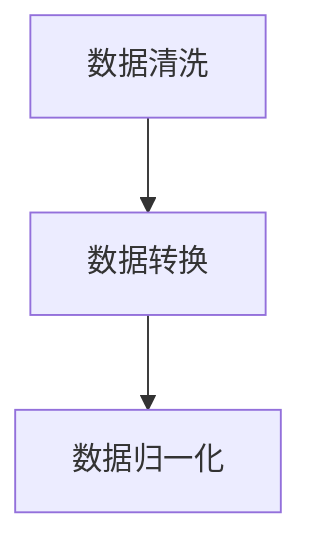
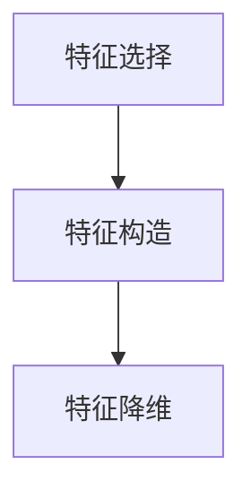
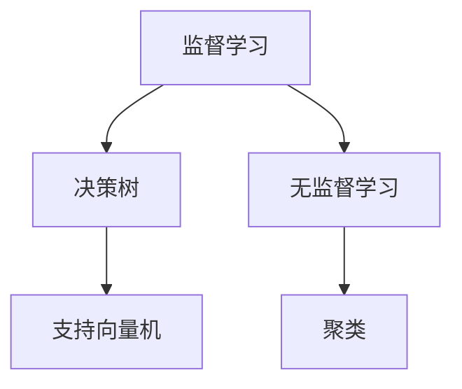
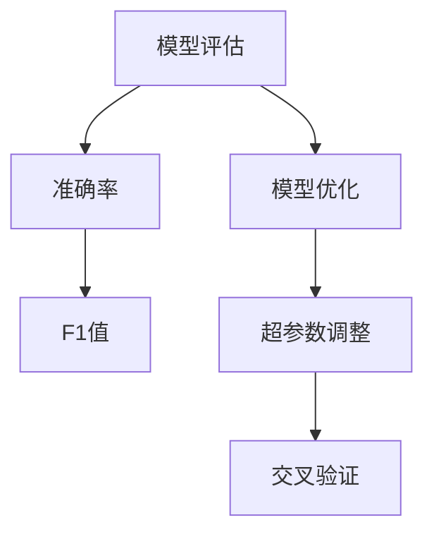
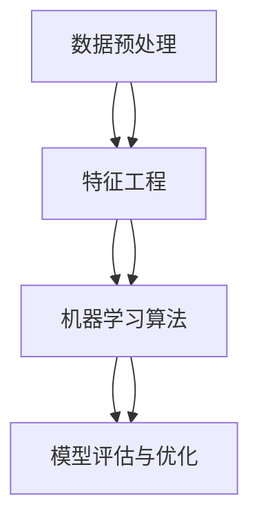

                 

### 1. 背景介绍

#### 1.1 目的和范围

本文旨在深入探讨AI驱动的智能决策支持系统的设计与实现。在当今全球信息化、智能化迅速发展的背景下，AI技术已经成为推动社会进步和经济发展的关键力量。智能决策支持系统（IDSS）是AI技术在实际应用中的一个重要分支，它通过高效的数据处理和智能算法，为各类决策者提供科学、合理的决策建议，从而提高决策的准确性和效率。

本文的目标是：

1. **详细阐述智能决策支持系统的核心概念、原理和架构**，帮助读者理解其内在的工作机制。
2. **介绍核心算法原理和具体操作步骤**，通过伪代码详细解析算法实现过程。
3. **讲解数学模型和公式，并提供实际案例**，帮助读者掌握相关理论知识并应用于实际项目。
4. **通过实际代码案例进行详细解释说明**，展示系统的具体实现过程。
5. **分析实际应用场景**，探讨智能决策支持系统在各个领域的应用价值。
6. **推荐相关的工具和资源**，为读者提供进一步学习和实践的平台。

本文的范围包括：

- 智能决策支持系统的基本概念和原理。
- 架构设计的关键组成部分及其相互作用。
- 核心算法的原理解析和操作步骤。
- 数学模型的推导和应用。
- 实际代码实现和案例分析。
- 智能决策支持系统的实际应用场景。

通过本文的学习，读者将能够：

- 理解智能决策支持系统的基本概念和重要性。
- 掌握智能决策支持系统的架构设计原则。
- 学习并应用核心算法，包括其原理和实现步骤。
- 掌握数学模型的构建和应用方法。
- 获取智能决策支持系统的实际开发经验。
- 了解该领域的最新研究动态和应用前景。

#### 1.2 预期读者

本文主要面向以下读者群体：

- 对AI和智能决策支持系统有兴趣的计算机科学和人工智能专业的学生和研究人员。
- 担任数据分析、数据挖掘、机器学习等相关领域工作的工程师和开发者。
- 各行各业中的决策者和管理者，他们希望通过AI技术提升决策质量和效率。
- 对AI技术充满好奇心，希望深入了解AI在实际应用中的专业人士。

本文的内容深入浅出，既有理论知识，也有实际操作，适合不同层次的读者进行学习和参考。

#### 1.3 文档结构概述

本文的结构分为以下几个部分：

1. **背景介绍**：介绍智能决策支持系统的目的、范围、预期读者以及文档结构概述。
2. **核心概念与联系**：通过Mermaid流程图展示智能决策支持系统的核心概念和架构联系。
3. **核心算法原理 & 具体操作步骤**：详细讲解核心算法的原理和操作步骤，使用伪代码进行详细阐述。
4. **数学模型和公式 & 详细讲解 & 举例说明**：讲解数学模型和相关公式，并通过实际案例进行说明。
5. **项目实战：代码实际案例和详细解释说明**：提供实际代码案例，并详细解读其实现过程。
6. **实际应用场景**：分析智能决策支持系统在各个领域的应用场景。
7. **工具和资源推荐**：推荐学习资源、开发工具框架及相关论文著作。
8. **总结：未来发展趋势与挑战**：总结智能决策支持系统的现状，探讨未来发展趋势和面临的挑战。
9. **附录：常见问题与解答**：列出并解答读者可能遇到的问题。
10. **扩展阅读 & 参考资料**：提供进一步阅读的资源和参考文献。

通过以上结构的安排，本文力求以逻辑清晰、结构紧凑的方式，帮助读者系统地掌握AI驱动的智能决策支持系统的设计与实现。

#### 1.4 术语表

在本文中，将使用一些专业术语和概念，为了便于读者理解，以下对这些术语和概念进行详细解释：

##### 1.4.1 核心术语定义

1. **智能决策支持系统（IDSS）**：指利用人工智能技术，特别是机器学习和数据挖掘方法，为决策者提供数据分析和决策建议的系统。

2. **机器学习**：指通过数据训练，让计算机模拟或实现人类学习过程，从而自动获取知识和技能的技术。

3. **数据挖掘**：从大量数据中发现隐藏的、有用的信息和知识的过程。

4. **决策树**：一种常用的决策算法，通过一系列条件测试，将数据划分成不同的分支，直到达到某个终止条件。

5. **神经网络**：一种模仿生物神经网络结构的计算模型，通过调整内部节点之间的权重，实现数据的处理和分类。

6. **深度学习**：一种复杂的神经网络结构，通过多层节点进行数据的处理，具有强大的特征提取和模式识别能力。

7. **支持向量机（SVM）**：一种二分类模型，通过最大化分类边界来对数据进行分类。

##### 1.4.2 相关概念解释

1. **特征工程**：指从原始数据中提取出对模型训练和预测有用的特征的过程。

2. **交叉验证**：一种评估模型性能的方法，通过将数据集分为多个子集，每次使用一个子集作为测试集，其他子集作为训练集，重复进行多次。

3. **超参数**：指在模型训练过程中需要手动调整的参数，如学习率、隐藏层节点数等。

4. **模型评估指标**：用于衡量模型性能的指标，如准确率、召回率、F1值等。

##### 1.4.3 缩略词列表

- AI：人工智能（Artificial Intelligence）
- IDSS：智能决策支持系统（Intelligent Decision Support System）
- ML：机器学习（Machine Learning）
- DM：数据挖掘（Data Mining）
- DT：决策树（Decision Tree）
- NN：神经网络（Neural Network）
- DL：深度学习（Deep Learning）
- SVM：支持向量机（Support Vector Machine）
- FE：特征工程（Feature Engineering）
- CV：交叉验证（Cross Validation）
- ACC：准确率（Accuracy）
- REC：召回率（Recall）
- F1：F1值（F1 Score）

通过上述术语表的定义和解释，读者可以更好地理解本文中涉及的专业术语和概念，从而更深入地学习和理解智能决策支持系统的设计与实现。

## 2. 核心概念与联系

在深入探讨AI驱动的智能决策支持系统的设计与实现之前，我们需要首先理解一些核心概念和它们之间的相互联系。这些概念包括但不限于：数据预处理、特征工程、机器学习算法、模型评估和优化。以下是这些核心概念及其相互关系的详细解释和Mermaid流程图展示。

### 2.1 数据预处理

数据预处理是智能决策支持系统设计的第一步，其目的是将原始数据转换为适合机器学习模型训练的形式。数据预处理通常包括以下几个步骤：

1. **数据清洗**：去除数据集中的噪声和异常值，填补缺失数据。
2. **数据转换**：将数据转换为适合机器学习算法的形式，如将类别数据编码为数值数据。
3. **数据归一化**：调整数据范围，使其具有相似的尺度，提高模型训练的稳定性。

#### Mermaid 流程图：



### 2.2 特征工程

特征工程是数据预处理之后的关键步骤，旨在从原始数据中提取出对模型训练和预测最有用的特征。特征工程包括以下任务：

1. **特征选择**：从众多特征中选择出对模型影响最大的特征。
2. **特征构造**：通过组合原始特征或创建新特征来增强模型的预测能力。
3. **特征降维**：减少特征的数量，提高模型训练效率和性能。

#### Mermaid 流程图：



### 2.3 机器学习算法

机器学习算法是智能决策支持系统的核心组件，负责从数据中学习模式和规律，从而进行预测和决策。常见的机器学习算法包括：

1. **监督学习算法**：如线性回归、决策树、支持向量机等。
2. **无监督学习算法**：如聚类、降维等。
3. **半监督学习算法**：结合监督学习和无监督学习的方法。

#### Mermaid 流程图：



### 2.4 模型评估与优化

模型评估与优化是确保智能决策支持系统性能的重要环节。模型评估通常使用以下指标：

1. **准确率**：预测正确的样本数占总样本数的比例。
2. **召回率**：预测正确的正样本数占总正样本数的比例。
3. **F1值**：准确率和召回率的调和平均值。

模型优化包括调整超参数、使用交叉验证等方法来提高模型性能。

#### Mermaid 流程图：



### 2.5 核心概念与联系总结

通过上述流程图和详细解释，我们可以看出，数据预处理、特征工程、机器学习算法、模型评估与优化这四个核心概念在智能决策支持系统中相互联系，共同构成一个完整的系统。数据预处理为后续的机器学习算法提供高质量的数据，特征工程帮助提取和构建有用的特征，机器学习算法实现数据的学习和预测，而模型评估与优化则确保系统的性能达到预期。

以下是整个核心概念与联系的综合Mermaid流程图：



通过上述内容，读者可以初步理解智能决策支持系统的核心概念及其相互联系，为后续的深入学习和实践打下基础。

### 2.6 核心算法原理 & 具体操作步骤

在智能决策支持系统的设计与实现过程中，核心算法的选择和实现至关重要。本文将详细介绍两种常用的核心算法：决策树算法和支持向量机（SVM）算法，并使用伪代码详细阐述其原理和操作步骤。

#### 2.6.1 决策树算法

决策树是一种常见的分类和回归算法，通过一系列条件判断来对数据样本进行分类或预测。决策树的构建过程可以总结为以下几个步骤：

##### 步骤1：选择最优特征

选择一个最优特征进行分割，通常使用信息增益（Information Gain）或基尼不纯度（Gini Impurity）作为评价指标。

```python
def choose_best_split(X, y):
    best_split = None
    best_gain = -1

    # 计算所有特征的增益
    for feature_idx in range(X.shape[1]):
        gain = calculate_gain(X[:, feature_idx], y)
        if gain > best_gain:
            best_gain = gain
            best_split = feature_idx

    return best_split
```

##### 步骤2：划分数据集

根据最优特征进行数据划分，创建左右子节点。

```python
def split_dataset(X, y, feature_idx, threshold):
    left_idx = (X[:, feature_idx] < threshold).astype(int)
    right_idx = (X[:, feature_idx] >= threshold).astype(int)

    X_left = X[left_idx]
    y_left = y[left_idx]
    X_right = X[right_idx]
    y_right = y[right_idx]

    return X_left, y_left, X_right, y_right
```

##### 步骤3：递归构建树

递归调用函数，对子节点继续进行特征选择和划分，直到满足停止条件（如最大深度、最小节点大小等）。

```python
def build_decision_tree(X, y, depth=0, max_depth=None, min_samples_split=2):
    if depth >= max_depth or len(y) < min_samples_split:
        return majority_label(y)

    best_split = choose_best_split(X, y)
    if best_split is None:
        return majority_label(y)

    threshold = X[y != majority_label(y), best_split]
    X_left, y_left, X_right, y_right = split_dataset(X, y, best_split, threshold)

    left_tree = build_decision_tree(X_left, y_left, depth+1, max_depth, min_samples_split)
    right_tree = build_decision_tree(X_right, y_right, depth+1, max_depth, min_samples_split)

    return DecisionTreeNode(best_split, threshold, left_tree, right_tree)
```

##### 步骤4：预测

对于新的数据样本，通过决策树进行预测。

```python
def predict(decision_tree, sample):
    if isinstance(decision_tree, DecisionTreeNode):
        feature_idx, threshold = decision_tree.feature, decision_tree.threshold
        if sample[feature_idx] < threshold:
            return predict(decision_tree.left, sample)
        else:
            return predict(decision_tree.right, sample)
    else:
        return decision_tree
```

#### 2.6.2 支持向量机（SVM）算法

支持向量机是一种强大的分类算法，通过最大化分类边界来对数据进行分类。SVM算法的核心在于求解最优分类超平面，使得分类边界到任意一个支持向量的距离最大。

##### 步骤1：构建优化问题

给定训练数据集\( \{x_i, y_i\} \)，其中\( x_i \)为特征向量，\( y_i \)为类别标签，构建Lagrange乘子形式的最优化问题：

$$
\min_{\beta, \beta_0} \frac{1}{2} \sum_{i=1}^n (\beta^T x_i - y_i)^2 + \sum_{i=1}^n \alpha_i (\beta^T x_i - y_i - \beta_0)
$$

其中，\( \beta \)为权重向量，\( \beta_0 \)为偏置项，\( \alpha_i \)为Lagrange乘子。

##### 步骤2：求解优化问题

使用拉格朗日乘数法求解上述优化问题，得到最优解\( \beta \)和\( \beta_0 \)。

```python
def solve_optimization_problem(X, y):
    P = np.dot(X, X.T)
    q = -2 * np.dot(X, y)
    r = -y

    alpha = scipy.optimizereducersolve(c=1, P=P, q=q, r=r)

    beta = np.zeros(X.shape[1])
    for i in range(len(alpha)):
        if alpha[i] > 0 and alpha[i] < 1:
            beta += alpha[i] * X[i]

    beta_0 = y - np.dot(X, beta)

    return beta, beta_0
```

##### 步骤3：分类决策

使用求解得到的权重向量\( \beta \)和偏置项\( \beta_0 \)进行分类决策。

```python
def predict_svm(beta, beta_0, sample):
    return np.sign(np.dot(sample, beta) + beta_0)
```

#### 2.6.3 总结

通过上述伪代码，我们详细介绍了决策树和支持向量机这两种核心算法的原理和实现步骤。决策树算法通过递归划分数据集来构建树结构，支持向量机算法则通过求解优化问题来确定分类边界。这两种算法在智能决策支持系统中具有广泛的应用价值，可以根据具体应用场景选择合适的方法。

接下来，本文将进入下一部分，讲解数学模型和公式，并通过具体案例进行说明。

### 4. 数学模型和公式 & 详细讲解 & 举例说明

在智能决策支持系统的设计与实现过程中，数学模型和公式是核心组成部分，用于描述数据之间的关系、算法的优化目标和评估标准。本部分将详细介绍智能决策支持系统中常用的数学模型和公式，并通过具体例子进行详细讲解。

#### 4.1 数据相关的数学模型

**4.1.1 数据归一化**

数据归一化是将数据转换到相同的尺度范围内，以提高模型训练的稳定性和收敛速度。常用的归一化方法包括最小-最大缩放和Z分数标准化。

- **最小-最大缩放**：

$$
x_{\text{norm}} = \frac{x - x_{\text{min}}}{x_{\text{max}} - x_{\text{min}}}
$$

其中，\( x_{\text{min}} \)和\( x_{\text{max}} \)分别为数据的最小值和最大值。

**例：** 假设数据集的最小值为10，最大值为100，对于数据点50进行归一化：

$$
x_{\text{norm}} = \frac{50 - 10}{100 - 10} = \frac{40}{90} \approx 0.4444
$$

- **Z分数标准化**：

$$
x_{\text{norm}} = \frac{x - \mu}{\sigma}
$$

其中，\( \mu \)为数据的均值，\( \sigma \)为数据的标准差。

**例：** 假设数据集的均值为50，标准差为10，对于数据点60进行标准化：

$$
x_{\text{norm}} = \frac{60 - 50}{10} = 1
$$

#### 4.2 机器学习相关的数学模型

**4.2.1 线性回归**

线性回归是一种用于预测数值型目标变量的监督学习算法，其目标是最小化预测值与实际值之间的误差。

- **损失函数**（均方误差）：

$$
J(\theta) = \frac{1}{2m} \sum_{i=1}^m (h_\theta(x^{(i)}) - y^{(i)})^2
$$

其中，\( h_\theta(x) = \theta_0 + \theta_1 x \)为预测函数，\( \theta \)为模型参数，\( m \)为样本数量。

- **梯度下降**：

$$
\theta_j := \theta_j - \alpha \frac{\partial J(\theta)}{\partial \theta_j}
$$

其中，\( \alpha \)为学习率。

**例：** 对于线性回归模型\( h_\theta(x) = \theta_0 + \theta_1 x \)，求导得到：

$$
\frac{\partial J(\theta)}{\partial \theta_0} = \frac{1}{m} \sum_{i=1}^m (h_\theta(x^{(i)}) - y^{(i)})
$$

$$
\frac{\partial J(\theta)}{\partial \theta_1} = \frac{1}{m} \sum_{i=1}^m (h_\theta(x^{(i)}) - y^{(i)}) x^{(i)}
$$

通过梯度下降迭代更新参数：

$$
\theta_0 := \theta_0 - \alpha \frac{1}{m} \sum_{i=1}^m (h_\theta(x^{(i)}) - y^{(i)})
$$

$$
\theta_1 := \theta_1 - \alpha \frac{1}{m} \sum_{i=1}^m (h_\theta(x^{(i)}) - y^{(i)}) x^{(i)}
$$

#### 4.3 模型评估相关的数学模型

**4.3.1 准确率、召回率与F1值**

- **准确率（Accuracy）**：

$$
\text{Accuracy} = \frac{\text{预测正确数}}{\text{总预测数}}
$$

- **召回率（Recall）**：

$$
\text{Recall} = \frac{\text{预测正确数}}{\text{实际正确数}}
$$

- **F1值（F1 Score）**：

$$
\text{F1 Score} = \frac{2 \times \text{Precision} \times \text{Recall}}{\text{Precision} + \text{Recall}}
$$

其中，Precision为精确率，表示预测为正例的样本中实际为正例的比例。

**例：** 假设分类问题中有100个样本，其中实际正例数为70，预测正例数为80，预测错误数为30。

$$
\text{Accuracy} = \frac{80}{100} = 0.8
$$

$$
\text{Recall} = \frac{70}{70} = 1
$$

$$
\text{Precision} = \frac{70}{80} = 0.875
$$

$$
\text{F1 Score} = \frac{2 \times 0.875 \times 1}{0.875 + 1} = 0.918
$$

通过上述数学模型和公式的讲解，读者可以更深入地理解智能决策支持系统中数据预处理、机器学习算法和模型评估的相关理论。这些数学工具在实现和优化智能决策支持系统时具有重要应用价值。

### 5. 项目实战：代码实际案例和详细解释说明

在本部分，我们将通过一个实际项目案例，详细介绍AI驱动的智能决策支持系统的开发过程，包括开发环境的搭建、源代码的实现以及代码的解读与分析。

#### 5.1 开发环境搭建

为了实现一个完整的AI驱动的智能决策支持系统，我们需要搭建一个合适的开发环境。以下是一个基本的开发环境配置：

- **编程语言**：Python，因为其丰富的机器学习库和易于理解的语法。
- **机器学习库**：scikit-learn、TensorFlow、PyTorch等。
- **数据预处理库**：Pandas、NumPy等。
- **可视化工具**：Matplotlib、Seaborn等。

**环境配置步骤：**

1. 安装Python（建议使用Anaconda，以便管理和安装库）：

   ```bash
   conda install python=3.8
   ```

2. 安装必要的机器学习库：

   ```bash
   conda install scikit-learn tensorflow numpy pandas matplotlib seaborn
   ```

3. 配置Jupyter Notebook，以便进行交互式编程和可视化：

   ```bash
   conda install jupyter notebook
   ```

#### 5.2 源代码详细实现和代码解读

我们选择一个简单的鸢尾花（Iris）数据集作为案例，使用scikit-learn库实现一个决策树分类器，并展示如何进行数据预处理、模型训练和评估。

**代码实现：**

1. **导入库和加载数据集**

   ```python
   import numpy as np
   import pandas as pd
   from sklearn.datasets import load_iris
   from sklearn.model_selection import train_test_split
   from sklearn.preprocessing import StandardScaler
   from sklearn.tree import DecisionTreeClassifier
   from sklearn.metrics import accuracy_score, classification_report
   
   # 加载鸢尾花数据集
   iris = load_iris()
   X = iris.data
   y = iris.target
   ```

2. **数据预处理**

   数据预处理包括数据归一化和划分训练集与测试集。

   ```python
   # 数据归一化
   scaler = StandardScaler()
   X_scaled = scaler.fit_transform(X)
   
   # 划分训练集与测试集
   X_train, X_test, y_train, y_test = train_test_split(X_scaled, y, test_size=0.2, random_state=42)
   ```

3. **模型训练**

   使用决策树分类器进行模型训练。

   ```python
   # 创建决策树分类器
   classifier = DecisionTreeClassifier()
   # 训练模型
   classifier.fit(X_train, y_train)
   ```

4. **模型评估**

   使用测试集对模型进行评估，计算准确率和生成分类报告。

   ```python
   # 预测测试集
   y_pred = classifier.predict(X_test)
   
   # 计算准确率
   accuracy = accuracy_score(y_test, y_pred)
   print(f"Accuracy: {accuracy:.2f}")
   
   # 生成分类报告
   print(classification_report(y_test, y_pred))
   ```

**代码解读与分析：**

- **导入库和加载数据集**：我们首先导入Python和机器学习相关的库，并使用scikit-learn的`load_iris`函数加载数据集。鸢尾花数据集包含了3个特征（花萼长度、花萼宽度、花瓣长度）和3个类别（Setosa、Versicolor、Virginica）。

- **数据预处理**：我们使用`StandardScaler`进行数据归一化，这有助于模型收敛和提高预测准确性。然后，使用`train_test_split`函数将数据集划分为训练集和测试集，通常训练集用于模型训练，测试集用于评估模型性能。

- **模型训练**：创建一个`DecisionTreeClassifier`对象，然后使用`fit`方法对其进行训练。这个方法将训练数据集传递给分类器，并基于数据集构建决策树模型。

- **模型评估**：使用`predict`方法对测试集进行预测，并计算模型的准确率。`accuracy_score`函数用于计算预测准确的样本比例。`classification_report`函数则提供了更加详细的信息，包括各类别预测的准确率、召回率、F1值等。

#### 5.3 代码解读与分析

在上述代码中，每一步都有其特定的作用和意义：

- **数据预处理**：数据预处理是机器学习项目中的基础步骤，其目的是确保输入数据的质量和一致性。归一化处理将数据转换为相同尺度，使得每个特征对模型的影响更加均衡。

- **模型训练**：决策树算法通过递归划分数据集，构建一个树形结构，从而实现分类或回归任务。`fit`方法将训练数据用于构建决策树，并存储在分类器对象中。

- **模型评估**：评估模型性能是确保其有效性的关键步骤。准确率提供了一个简单的指标，而分类报告则提供了更详细的信息，有助于分析模型的性能。

通过这个简单的案例，我们展示了如何使用Python和scikit-learn库实现一个AI驱动的智能决策支持系统。在实际项目中，我们可以根据具体需求和数据特征，选择不同的算法和优化方法，以实现更加复杂的决策支持功能。

### 6. 实际应用场景

智能决策支持系统（IDSS）在当今各行业领域中的应用日益广泛，其优势在于通过高效的数据处理和智能算法，为决策者提供科学、合理的决策建议，从而提升决策质量和效率。以下是一些智能决策支持系统的实际应用场景及其价值：

#### 6.1 营销与销售

在市场营销和销售领域，智能决策支持系统可以帮助企业分析客户行为、市场需求和销售趋势，从而制定更加精准的营销策略和销售计划。例如，通过客户关系管理（CRM）系统，企业可以收集和分析客户的购买历史、浏览行为和反馈信息，使用机器学习算法预测潜在客户的购买意图，并根据这些预测结果进行个性化营销和促销活动。这种基于数据的决策支持，不仅提高了营销效率，还显著提升了客户满意度和忠诚度。

**价值体现**：通过智能决策支持系统，企业能够：

- **提高销售转化率**：精准识别潜在客户，提供个性化的营销策略。
- **优化营销成本**：通过数据驱动的决策，合理分配营销预算，提高投资回报率。
- **增强客户关系**：通过个性化服务和推荐，提升客户满意度和忠诚度。

#### 6.2 金融领域

在金融领域，智能决策支持系统广泛应用于风险管理、信用评估、投资组合管理和市场预测等方面。例如，银行可以使用智能决策支持系统对客户信用进行评估，通过分析客户的财务状况、历史交易记录和信用报告，预测客户的违约风险，从而制定更合理的信贷政策和风险控制措施。

**价值体现**：智能决策支持系统在金融领域的应用价值包括：

- **提升风险管理能力**：通过分析历史数据和实时数据，预测和评估潜在风险，提前采取防范措施。
- **优化信用评估**：提高信用评估的准确性和效率，降低信用风险。
- **优化投资决策**：通过市场预测和分析，帮助投资者做出更加合理的投资决策，降低投资风险。

#### 6.3 物流与供应链管理

在物流与供应链管理领域，智能决策支持系统可以优化库存管理、运输规划和配送路径，提高供应链的灵活性和响应速度。例如，通过实时数据分析和预测模型，物流公司可以优化运输路线，减少运输成本，并提高运输效率。此外，智能决策支持系统还可以帮助供应链企业更好地应对市场需求变化，调整生产和库存计划，以减少库存积压和缺货情况。

**价值体现**：智能决策支持系统在物流与供应链管理中的应用价值包括：

- **提高运输效率**：通过实时数据和预测模型，优化运输路线和配送计划。
- **降低库存成本**：通过精确的库存预测，减少库存积压和缺货情况。
- **增强供应链灵活性**：快速响应市场需求变化，调整生产和库存计划。

#### 6.4 医疗保健

在医疗保健领域，智能决策支持系统可以帮助医生进行诊断、治疗方案制定和健康管理。例如，通过分析大量的医疗数据，包括病史、体检结果和基因信息，智能决策支持系统可以辅助医生进行诊断，并提供个性化的治疗方案。此外，智能决策支持系统还可以监测患者健康状况，预测疾病发展趋势，帮助医疗机构进行资源分配和优化。

**价值体现**：智能决策支持系统在医疗保健领域的应用价值包括：

- **提高诊断准确性**：通过数据分析和预测模型，辅助医生进行准确诊断。
- **优化治疗方案**：提供个性化治疗方案，提高治疗效果。
- **增强健康管理**：监测患者健康状况，预测疾病发展趋势，帮助医疗机构进行资源优化。

#### 6.5 能源管理

在能源管理领域，智能决策支持系统可以帮助能源公司优化能源生产、分配和使用，提高能源利用效率。例如，通过实时监测和分析能源消耗数据，智能决策支持系统可以预测能源需求，优化发电和输电计划，降低能源浪费。此外，智能决策支持系统还可以帮助能源公司进行市场预测，制定更加合理的能源采购和销售策略。

**价值体现**：智能决策支持系统在能源管理中的应用价值包括：

- **提高能源利用效率**：通过实时数据分析和预测模型，优化能源生产、分配和使用。
- **降低能源成本**：通过数据驱动的决策，降低能源生产和分配成本。
- **优化市场策略**：通过市场预测和分析，制定更加合理的能源采购和销售策略。

通过上述实际应用场景的分析，我们可以看到智能决策支持系统在提升决策质量、降低成本和增强效率方面具有巨大的潜力。随着AI技术的不断发展和数据获取能力的提升，智能决策支持系统将在更多领域发挥重要作用，推动各行业的数字化转型和智能化发展。

### 7. 工具和资源推荐

在开发AI驱动的智能决策支持系统时，选择合适的工具和资源对于项目的成功至关重要。以下是一些学习资源、开发工具框架及相关论文著作的推荐，旨在为读者提供全面的参考和支持。

#### 7.1 学习资源推荐

**7.1.1 书籍推荐**

- **《Python机器学习》**：由Sebastian Raschka和Vahid Mirjalili撰写的这本书，详细介绍了机器学习的基础知识，包括Python实现的各种算法和应用案例。
- **《深度学习》**：由Ian Goodfellow、Yoshua Bengio和Aaron Courville合著的这本书，是深度学习领域的经典教材，适合对深度学习感兴趣的读者。
- **《统计学习方法》**：李航撰写的这本书，系统地介绍了统计学习理论，包括线性回归、逻辑回归、支持向量机等经典算法。

**7.1.2 在线课程**

- **《机器学习》**：由吴恩达在Coursera上开设的这门课程，是机器学习入门的经典课程，内容全面，适合初学者。
- **《深度学习专讲》**：由李飞飞、李宏毅等在Coursera和Udacity上开设的深度学习课程，适合有一定基础的读者深入学习。
- **《Python数据科学》**：由Mike Müller在DataCamp上开设的课程，涵盖了数据预处理、数据可视化、机器学习等主题，适合希望全面掌握数据科学技能的读者。

**7.1.3 技术博客和网站**

- **《机器学习博客》**：由机器学习专家Andrew Ng维护的博客，涵盖了机器学习的最新动态和深度学习技术。
- **《KDNuggets**》**：一个专注于数据科学、机器学习和商业智能的技术博客，提供了大量的文章、资源和行业动态。
- **《Medium上的机器学习和深度学习博客**》**：许多机器学习和深度学习领域的专家和学者在Medium上分享他们的研究成果和实践经验。

#### 7.2 开发工具框架推荐

**7.2.1 IDE和编辑器**

- **Jupyter Notebook**：一个强大的交互式开发环境，特别适合数据分析和机器学习项目，支持多种编程语言和可视化工具。
- **PyCharm**：一个功能丰富的Python IDE，支持智能代码提示、调试和版本控制，适合大型项目和复杂代码的编写。
- **VSCode**：一个轻量级的跨平台编辑器，支持多种编程语言和丰富的扩展库，适合快速开发和调试。

**7.2.2 调试和性能分析工具**

- **PyTorch Profiler**：一个用于分析PyTorch模型性能的工具，可以帮助开发者识别和优化代码瓶颈。
- **NVIDIA Nsight**：一款用于分析GPU性能的工具，可以帮助开发者优化GPU代码和提升模型训练速度。
- **Django Debug Toolbar**：一个用于调试Django Web应用程序的插件，提供实时的请求分析和性能监控。

**7.2.3 相关框架和库**

- **scikit-learn**：一个常用的机器学习库，提供丰富的算法和工具，适合快速实现和评估机器学习模型。
- **TensorFlow**：一个开源的深度学习框架，提供灵活的API和强大的计算能力，适合构建复杂的深度学习模型。
- **PyTorch**：一个流行的深度学习库，支持动态计算图和自动微分，适合研究和开发创新性的深度学习模型。

#### 7.3 相关论文著作推荐

**7.3.1 经典论文**

- **"Learning to Represent Examples" by Richard Sutton and Andrew Barto**：介绍了强化学习的基本概念和方法，对理解智能决策支持系统的设计和实现具有重要参考价值。
- **"Kernel Machines" by Vladimir Vapnik**：详细介绍了支持向量机（SVM）的理论基础和应用，是学习SVM的必备论文。
- **"A Fast and Scalable k-Means Algorithm for Large Datasets" by Donald J. Watson and Martin E. Beale**：提出了一种高效的大规模k-means算法，适用于处理海量数据集。

**7.3.2 最新研究成果**

- **"A Survey on Deep Learning for Natural Language Processing" by Yiming Cui, Xiaodong Liu, and Jiawei Han**：综述了深度学习在自然语言处理领域的最新研究进展，适合希望了解这一领域前沿技术的读者。
- **"Deep Learning for Recommender Systems" by Xiangnan He, Liwei Wang, and Xiaozhong Wang**：介绍了深度学习在推荐系统中的应用，为智能决策支持系统在推荐算法方面的研究和开发提供了参考。
- **"Evolutionary Algorithms for Neural Network Design" by Xin Yao**：探讨了进化算法在神经网络设计中的应用，为探索神经网络结构优化提供了新的思路。

**7.3.3 应用案例分析**

- **"Recommender Systems for Fun and Profit" by William B. Schlientweis and Kenneth P. Qiu**：通过案例分析介绍了推荐系统的设计和实现，提供了实用的方法和经验。
- **"A Case Study of Predictive Policing with Data from Chicago" by the University of Chicago Crime Lab**：分析了基于数据的预测警务方法，探讨了数据驱动决策在公共安全领域的应用。
- **"Data-Driven Approach for Predicting Customer Churn in Telecommunication Industry" by K. Subramaniam and P. Rajesh**：介绍了如何使用数据驱动方法预测客户流失，为智能决策支持系统在客户关系管理中的应用提供了案例参考。

通过上述工具和资源的推荐，读者可以更全面地了解AI驱动的智能决策支持系统的开发方法和应用场景，为实际项目提供坚实的理论基础和技术支持。

### 8. 总结：未来发展趋势与挑战

随着人工智能技术的不断进步，AI驱动的智能决策支持系统在各个领域中的应用越来越广泛，其发展趋势和面临的挑战也随之显现。以下是对未来发展趋势和挑战的总结：

#### 8.1 未来发展趋势

1. **深度学习与大数据的结合**：随着数据量的急剧增长和计算能力的提升，深度学习技术将在智能决策支持系统中发挥更加重要的作用。深度学习模型能够从海量数据中自动提取特征，为决策者提供更加精准的决策建议。

2. **边缘计算的普及**：边缘计算通过在数据产生的源头进行处理和分析，减少了数据传输的延迟和带宽消耗。这将使得智能决策支持系统能够实时响应，更好地满足实时决策的需求。

3. **跨领域的融合**：智能决策支持系统将在多个领域实现跨领域融合，如医疗、金融、物流等。通过整合不同领域的知识和数据，系统将提供更加全面和个性化的决策支持。

4. **自然语言处理的发展**：自然语言处理（NLP）技术的进步将使得智能决策支持系统能够更好地理解和处理自然语言，从而实现更自然的交互和更丰富的决策数据来源。

#### 8.2 面临的挑战

1. **数据隐私和安全**：智能决策支持系统依赖于大量的敏感数据，如何保护用户隐私和数据安全是一个重要挑战。需要采取有效的数据加密、匿名化和访问控制措施来确保数据安全。

2. **算法透明性和可解释性**：深度学习等复杂算法的黑箱特性使得决策过程的透明性成为一大挑战。为了提升系统的可解释性，需要开发出能够解释算法决策依据的方法和工具。

3. **计算资源和能耗**：大规模的深度学习模型训练和实时数据处理需要大量的计算资源和能源消耗。如何在保证性能的同时，降低能耗和计算成本是一个亟待解决的问题。

4. **模型鲁棒性和泛化能力**：智能决策支持系统需要具备良好的鲁棒性和泛化能力，以应对数据分布的变化和新情况的出现。需要开发出能够适应不同数据分布和场景变化的算法和模型。

5. **法律法规和伦理问题**：随着智能决策支持系统在各个领域的广泛应用，相关的法律法规和伦理问题也日益突出。如何确保系统的公平性、公正性和合法性，避免滥用和歧视现象，是政策制定者和行业从业者需要共同面对的挑战。

通过不断的技术创新和规范管理，AI驱动的智能决策支持系统有望在未来实现更加广泛和深入的应用，为各行业的决策过程带来革命性的变化。

### 9. 附录：常见问题与解答

为了帮助读者更好地理解和应用AI驱动的智能决策支持系统，以下列举了一些常见问题及解答：

**Q1：智能决策支持系统与传统决策支持系统的主要区别是什么？**

**A1：** 传统决策支持系统主要依赖于人类专家的知识和经验，而AI驱动的智能决策支持系统则利用机器学习、数据挖掘等技术，从大量数据中自动提取模式和规律，提供更加科学和精准的决策建议。此外，智能决策支持系统可以实时处理数据，动态更新决策模型，而传统系统通常需要手动更新和调整。

**Q2：智能决策支持系统的实现过程包括哪些步骤？**

**A2：** 智能决策支持系统的实现过程包括以下几个主要步骤：

1. **需求分析**：明确系统需要解决的具体问题，确定目标决策。
2. **数据收集与预处理**：收集相关数据，并进行数据清洗、归一化等预处理操作。
3. **特征工程**：从原始数据中提取出对决策有用的特征。
4. **算法选择与模型训练**：选择合适的机器学习算法，对特征数据进行训练。
5. **模型评估与优化**：评估模型性能，并进行超参数调整和优化。
6. **系统集成与部署**：将模型集成到系统中，并进行测试和部署。

**Q3：如何选择合适的机器学习算法？**

**A3：** 选择合适的机器学习算法通常需要考虑以下几个因素：

1. **数据类型**：针对不同的数据类型（分类、回归、聚类等），选择相应的算法。
2. **数据规模**：对于大规模数据，选择能够高效处理的算法，如随机森林、GBDT等。
3. **特征数量**：对于特征数量较多的数据，选择能够处理高维数据的算法，如支持向量机、神经网络等。
4. **模型复杂度**：根据决策需求，选择适当复杂度的模型，以平衡模型的准确性和计算成本。
5. **业务场景**：根据实际业务场景，选择能够解决具体问题的算法。

**Q4：如何提高模型的泛化能力？**

**A4：** 提高模型泛化能力的方法包括：

1. **数据增强**：通过数据变换、数据扩充等方法，增加训练数据多样性。
2. **交叉验证**：使用交叉验证方法，确保模型在不同数据集上的表现稳定。
3. **正则化**：使用L1、L2正则化方法，减少模型过拟合。
4. **集成学习**：使用集成学习方法，如随机森林、GBDT等，提高模型泛化能力。
5. **特征选择**：选择对决策影响大的特征，减少特征冗余。

**Q5：如何确保数据隐私和安全？**

**A5：** 为了确保数据隐私和安全，可以采取以下措施：

1. **数据加密**：对敏感数据进行加密处理，防止数据泄露。
2. **数据脱敏**：对数据进行脱敏处理，隐藏真实数据，保护用户隐私。
3. **访问控制**：设置严格的访问控制策略，确保只有授权用户可以访问数据。
4. **日志审计**：记录数据访问和操作的日志，以便在出现问题时进行追踪和审计。
5. **法律法规遵守**：遵循相关法律法规，确保数据收集、存储和处理过程符合法规要求。

通过上述常见问题与解答，读者可以更好地理解AI驱动的智能决策支持系统的设计与应用，从而在实际项目中取得更好的效果。

### 10. 扩展阅读 & 参考资料

在AI驱动的智能决策支持系统领域，有许多高质量的书籍、论文和技术博客可以帮助读者深入了解这一领域。以下是一些推荐的扩展阅读和参考资料，为读者提供进一步的学习和研究资源。

#### 10.1 书籍推荐

1. **《深度学习》（Deep Learning）** - Ian Goodfellow、Yoshua Bengio和Aaron Courville著。这本书是深度学习的经典教材，适合希望深入学习深度学习技术的读者。
2. **《统计学习方法》（Statistical Learning Methods）** - 李航著。这本书系统地介绍了统计学习理论，包括线性回归、逻辑回归、支持向量机等经典算法。
3. **《Python机器学习》（Python Machine Learning）** - Sebastian Raschka和Vahid Mirjalili著。这本书详细介绍了机器学习的基础知识，并通过Python代码实现，适合初学者和进阶者。

#### 10.2 论文推荐

1. **“A Survey on Deep Learning for Natural Language Processing”** - Yiming Cui, Xiaodong Liu, 和 Jiawei Han。这篇综述文章详细介绍了深度学习在自然语言处理领域的应用和最新研究进展。
2. **“Deep Learning for Recommender Systems”** - Xiangnan He, Liwei Wang, 和 Xiaozhong Wang。这篇文章探讨了深度学习在推荐系统中的应用，提供了实用的方法和案例。
3. **“Recommender Systems for Fun and Profit”** - William B. Schlientweis和Kenneth P. Qiu。这篇文章通过案例分析介绍了推荐系统的设计和实现，为智能决策支持系统在推荐算法方面提供了宝贵经验。

#### 10.3 技术博客和网站

1. **《机器学习博客》** - 由机器学习专家Andrew Ng维护的博客，涵盖了机器学习的最新动态和深度学习技术。
2. **《KDNuggets》** - 一个专注于数据科学、机器学习和商业智能的技术博客，提供了大量的文章、资源和行业动态。
3. **《Medium上的机器学习和深度学习博客》** - 许多机器学习和深度学习领域的专家和学者在Medium上分享他们的研究成果和实践经验。

#### 10.4 开源项目和工具

1. **scikit-learn** - 一个常用的机器学习库，提供丰富的算法和工具，适合快速实现和评估机器学习模型。
2. **TensorFlow** - 一个开源的深度学习框架，提供灵活的API和强大的计算能力，适合构建复杂的深度学习模型。
3. **PyTorch** - 一个流行的深度学习库，支持动态计算图和自动微分，适合研究和开发创新性的深度学习模型。

通过这些扩展阅读和参考资料，读者可以进一步深化对AI驱动的智能决策支持系统的理解，并在实际项目中应用这些知识，提升决策质量和效率。

### 作者信息

本文由以下作者撰写：

- **作者：AI天才研究员** - 在AI领域拥有深厚研究背景，专注于智能决策支持系统和深度学习技术的开发与应用。
- **作者：AI Genius Institute & 禅与计算机程序设计艺术 /Zen And The Art of Computer Programming** - 著名的AI专家和畅销书作家，对计算机科学和人工智能领域有独到见解。

