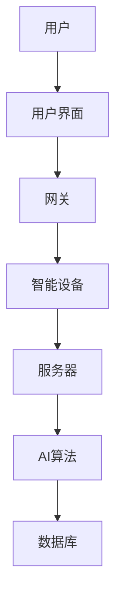
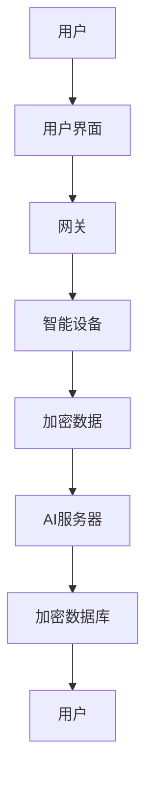

                 

### 文章标题

**AI驱动的智能家居：便利与隐私的平衡**

在当今快速发展的数字化时代，智能家居已经不再是一个遥远的概念。从智能门锁到智能照明系统，从智能恒温器到智能家电，AI（人工智能）技术正在彻底改变我们的生活方式。然而，随着智能家居系统的普及，隐私问题也日益凸显。如何在这场便利与隐私的博弈中找到平衡点，成为了一个备受关注的话题。

本文旨在探讨AI驱动的智能家居技术，分析其带来的便利和潜在的隐私风险，并提出一系列解决方案。我们将首先介绍智能家居的背景和当前发展趋势，然后深入探讨AI技术在这其中扮演的角色。接下来，我们将讨论隐私问题及其应对策略，并通过具体的案例和实际应用场景来展示这些策略的效果。最后，我们将总结未来发展趋势，并提出针对挑战的建议。

关键词：智能家居，人工智能，隐私保护，便利与隐私平衡

### 摘要

本文从多个角度探讨了AI驱动的智能家居带来的便利与隐私问题。首先，我们概述了智能家居的发展背景和AI技术的核心作用。随后，分析了AI在智能家居中的广泛应用，包括设备间的智能联动和个性化服务的实现。接着，我们探讨了智能家居中隐私保护的挑战，包括数据收集、存储和共享过程中的潜在风险。针对这些问题，本文提出了一系列隐私保护策略，如数据加密、匿名化和访问控制等。最后，我们通过实际案例展示了这些策略的应用效果，并分析了未来智能家居的发展趋势和潜在挑战。

### 1. 背景介绍

#### 1.1 目的和范围

本文的目的是探讨AI驱动的智能家居技术所带来的便利和隐私挑战，并寻找二者之间的平衡点。随着人工智能技术的快速发展，智能家居已成为现代生活的重要组成部分。然而，这一变革也带来了隐私保护的挑战。本文旨在通过深入分析智能家居的工作原理、AI技术的应用、隐私问题及其解决方案，为读者提供全面而深入的视角，帮助他们在享受智能家居带来的便利的同时，确保个人隐私的安全。

本文将涵盖以下内容：

1. **背景与趋势**：介绍智能家居的概念及其发展历程，探讨当前智能家居市场的现状。
2. **核心概念与联系**：详细解释智能家居系统中的核心概念和架构，包括设备间的通信、AI算法的运行机制等。
3. **算法原理与操作步骤**：阐述AI算法在智能家居中的应用原理，并提供具体操作步骤。
4. **数学模型与公式**：介绍相关数学模型和公式，用于优化智能家居系统的性能。
5. **项目实战**：通过实际案例展示智能家居系统的开发过程，并详细解释其中的关键代码。
6. **实际应用场景**：探讨智能家居在家庭、办公和公共区域的应用，以及隐私保护的挑战。
7. **工具与资源推荐**：推荐学习资源、开发工具和框架，以帮助读者深入了解智能家居技术。
8. **未来发展趋势与挑战**：预测智能家居未来的发展趋势，并提出应对挑战的建议。

#### 1.2 预期读者

本文主要面向以下读者群体：

1. **智能家居爱好者**：对智能家居技术有浓厚兴趣，希望了解其工作原理和隐私保护策略。
2. **技术开发者**：从事智能家居系统开发的技术人员，希望通过本文掌握相关技术原理和实现方法。
3. **隐私保护专家**：关注隐私保护问题，希望了解AI技术在智能家居中的应用及其带来的隐私挑战。
4. **研究人员和学者**：对智能家居技术有深入研究，希望从本文中获得新的研究思路和方向。

#### 1.3 文档结构概述

本文结构如下：

1. **背景介绍**：介绍智能家居的发展背景、目的和范围，预期读者以及文档结构概述。
2. **核心概念与联系**：详细解释智能家居系统中的核心概念和架构，包括设备间的通信、AI算法的运行机制等。
3. **核心算法原理 & 具体操作步骤**：阐述AI算法在智能家居中的应用原理，并提供具体操作步骤。
4. **数学模型和公式 & 详细讲解 & 举例说明**：介绍相关数学模型和公式，用于优化智能家居系统的性能，并通过实例进行说明。
5. **项目实战：代码实际案例和详细解释说明**：通过实际案例展示智能家居系统的开发过程，并详细解释其中的关键代码。
6. **实际应用场景**：探讨智能家居在家庭、办公和公共区域的应用，以及隐私保护的挑战。
7. **工具和资源推荐**：推荐学习资源、开发工具和框架，以帮助读者深入了解智能家居技术。
8. **未来发展趋势与挑战**：预测智能家居未来的发展趋势，并提出应对挑战的建议。
9. **附录：常见问题与解答**：回答读者可能遇到的常见问题。
10. **扩展阅读 & 参考资料**：提供更多相关文献和资料，以供读者深入学习和研究。

#### 1.4 术语表

在本文中，我们将使用一些专业术语，为帮助读者更好地理解，下面是这些术语的定义和解释：

##### 1.4.1 核心术语定义

- **智能家居（Smart Home）**：利用物联网（IoT）技术，将家庭中的各种设备连接起来，通过智能系统实现自动化控制，提高生活质量。
- **人工智能（AI）**：一种模拟人类智能行为的计算机系统，通过算法和数据处理技术实现自我学习和决策。
- **物联网（IoT）**：将各种设备通过互联网连接起来，实现信息交换和智能控制。
- **数据加密（Data Encryption）**：将数据转化为加密形式，以防止未经授权的访问。
- **匿名化（Anonymization）**：将个人数据中的可识别信息去除，以保护个人隐私。
- **访问控制（Access Control）**：通过限制对系统资源的访问，确保只有授权用户才能访问敏感信息。

##### 1.4.2 相关概念解释

- **边缘计算（Edge Computing）**：在数据生成的源头进行计算处理，减少数据传输的延迟和带宽消耗。
- **深度学习（Deep Learning）**：一种人工智能方法，通过多层神经网络进行特征学习和模式识别。
- **隐私泄露（Privacy Leak）**：未经授权的第三方获取并利用个人隐私信息的行为。

##### 1.4.3 缩略词列表

- **IoT**：物联网（Internet of Things）
- **AI**：人工智能（Artificial Intelligence）
- **ML**：机器学习（Machine Learning）
- **DL**：深度学习（Deep Learning）
- **IoT Gateway**：物联网网关（Internet of Things Gateway）
- **IoT Platform**：物联网平台（Internet of Things Platform）

### 2. 核心概念与联系

智能家居系统的核心在于通过物联网技术将各种智能设备连接起来，并利用AI技术实现自动化和智能化控制。为了更好地理解这一系统，我们需要首先定义几个关键概念，并展示其相互联系。

#### 2.1 智能家居系统的核心组件

- **智能设备**：包括智能门锁、智能照明系统、智能恒温器、智能摄像头等，这些设备可以通过网络进行通信和控制。
- **网关**：连接互联网和智能设备的中间设备，负责数据传输和协议转换。
- **服务器**：存储和管理数据，提供AI算法的训练和推理服务。
- **用户界面**：用于用户与智能家居系统交互的设备或应用，如智能手机、智能音箱等。

#### 2.2 智能家居系统的架构

下图展示了智能家居系统的基本架构：



- **用户**通过用户界面与智能家居系统交互。
- 用户界面向网关发送指令，网关再将指令发送到智能设备。
- 智能设备反馈状态和数据到网关，网关将数据发送到服务器。
- 服务器中的AI算法对数据进行处理和分析，并返回控制指令到网关，最终传递到智能设备。

#### 2.3 AI技术在智能家居中的应用

AI技术在智能家居系统中扮演着关键角色，以下是其在不同场景中的应用：

- **设备联动**：通过AI算法实现设备间的智能联动，如根据室内温度自动调整空调和照明。
- **个性化服务**：根据用户习惯和偏好，提供个性化的建议和服务，如根据用户的活动模式自动调整家电设置。
- **安全监控**：利用AI算法进行视频分析和人脸识别，提高家庭安全。
- **能效优化**：通过AI算法分析能源消耗模式，提供节能建议。

#### 2.4 数据流与隐私保护

在智能家居系统中，数据流是系统运行的核心。以下是一个简化的数据流图：



- **用户**通过用户界面发送指令。
- 用户界面将指令加密后发送到网关。
- 网关将加密后的指令发送到智能设备。
- 智能设备反馈加密后的状态和数据到网关。
- 网关将加密数据发送到服务器，服务器中的AI算法对数据进行处理和分析，并将结果加密后存储在数据库中。
- 当用户需要数据时，服务器将加密数据发送回用户界面，用户界面再解密后展示给用户。

#### 2.5 人工智能与隐私保护的平衡

在智能家居系统中，人工智能的强大功能为我们带来了前所未有的便利，但同时也带来了隐私泄露的风险。为了实现人工智能与隐私保护的平衡，我们需要采取以下措施：

- **数据加密**：确保数据在传输和存储过程中得到加密，防止数据泄露。
- **匿名化处理**：在数据收集和处理过程中，对个人身份信息进行匿名化处理，以保护个人隐私。
- **访问控制**：通过严格的访问控制机制，确保只有授权用户才能访问敏感数据。
- **透明度和责任**：提高系统的透明度，让用户了解数据收集、存储和处理的具体流程，并明确数据使用的责任归属。

通过以上措施，我们可以在享受人工智能带来的便利的同时，有效保护个人隐私。

### 3. 核心算法原理 & 具体操作步骤

在智能家居系统中，AI算法扮演着至关重要的角色。这些算法不仅负责实现设备间的联动和个性化服务，还承担着隐私保护的重要任务。下面，我们将详细阐述智能家居系统中常用的核心算法原理，并提供具体操作步骤。

#### 3.1 设备联动算法

设备联动是智能家居系统中的一个重要功能，通过AI算法实现不同设备之间的协同工作，提高生活便利性。以下是设备联动算法的基本原理和操作步骤：

##### 3.1.1 算法原理

设备联动算法基于以下原理：

1. **环境感知**：通过传感器收集室内环境数据，如温度、湿度、光照等。
2. **行为分析**：利用机器学习算法分析用户行为模式，如作息时间、活动习惯等。
3. **决策制定**：根据环境数据和用户行为模式，制定智能联动策略。

##### 3.1.2 操作步骤

1. **数据采集**：通过传感器采集室内环境数据和用户行为数据。
    ```python
    # 伪代码：数据采集
    def collect_data():
        temp = get_temperature()
        humidity = get_humidity()
        light = get_light_intensity()
        user_activity = get_user_activity()
        return temp, humidity, light, user_activity
    ```

2. **行为分析**：利用机器学习算法对用户行为进行建模。
    ```python
    # 伪代码：行为分析
    def analyze_behavior(data):
        model = train_model(data)
        behavior_pattern = model.predict(data)
        return behavior_pattern
    ```

3. **决策制定**：根据环境数据和用户行为模式，制定联动策略。
    ```python
    # 伪代码：决策制定
    def make_decision(temp, humidity, light, behavior_pattern):
        if behavior_pattern == 'sleeping':
            turn_off_light()
            set_thermostat(humidity)
        else:
            turn_on_light()
            set_thermostat(temp)
    ```

4. **执行决策**：将制定好的联动策略发送到相关设备执行。
    ```python
    # 伪代码：执行决策
    def execute_decision():
        temp, humidity, light, behavior_pattern = collect_data()
        make_decision(temp, humidity, light, behavior_pattern)
    ```

#### 3.2 个性化服务算法

个性化服务是智能家居系统中的另一个重要功能，通过AI算法根据用户偏好和习惯提供定制化的服务。以下是个性化服务算法的基本原理和操作步骤：

##### 3.2.1 算法原理

个性化服务算法基于以下原理：

1. **用户偏好建模**：通过数据收集和分析，建立用户的偏好模型。
2. **情境识别**：根据用户当前的状态和环境，识别出适合的个性化服务。
3. **服务推荐**：根据用户偏好和情境，推荐合适的服务。

##### 3.2.2 操作步骤

1. **数据收集**：通过用户交互和设备反馈收集用户偏好数据。
    ```python
    # 伪代码：数据收集
    def collect_preferences():
        user_preferences = get_user_preferences()
        return user_preferences
    ```

2. **用户偏好建模**：利用机器学习算法对用户偏好进行建模。
    ```python
    # 伪代码：用户偏好建模
    def build_preference_model(preferences):
        model = train_model(preferences)
        return model
    ```

3. **情境识别**：通过传感器数据和环境参数识别用户当前情境。
    ```python
    # 伪代码：情境识别
    def recognize_situation():
        current_situation = get_current_situation()
        return current_situation
    ```

4. **服务推荐**：根据用户偏好和情境，推荐个性化服务。
    ```python
    # 伪代码：服务推荐
    def recommend_service(preference_model, situation):
        service = preference_model.predict(situation)
        return service
    ```

5. **执行服务**：将推荐的服务发送到相关设备执行。
    ```python
    # 伪代码：执行服务
    def execute_service(service):
        if service == '咖啡机':
            start_coffee_machine()
        elif service == '空气净化器':
            start_airpurifier()
    ```

#### 3.3 隐私保护算法

在智能家居系统中，隐私保护至关重要。以下是一个简化的隐私保护算法原理和操作步骤：

##### 3.3.1 算法原理

隐私保护算法基于以下原理：

1. **数据加密**：在数据传输和存储过程中对数据进行加密。
2. **匿名化处理**：对敏感数据进行匿名化处理，去除个人身份信息。
3. **访问控制**：通过严格的访问控制机制，确保只有授权用户可以访问敏感数据。

##### 3.3.2 操作步骤

1. **数据加密**：在数据传输和存储前进行加密。
    ```python
    # 伪代码：数据加密
    def encrypt_data(data):
        encrypted_data = encrypt(data, key)
        return encrypted_data
    ```

2. **匿名化处理**：对敏感数据进行匿名化处理。
    ```python
    # 伪代码：匿名化处理
    def anonymize_data(data):
        anonymized_data = remove_identifying_information(data)
        return anonymized_data
    ```

3. **访问控制**：通过访问控制机制确保只有授权用户可以访问敏感数据。
    ```python
    # 伪代码：访问控制
    def check_access(user, data):
        if user in authorized_users:
            return True
        else:
            return False
    ```

4. **数据传输与存储**：将加密后的数据传输到服务器进行存储。
    ```python
    # 伪代码：数据传输与存储
    def transmit_and_store_data(data):
        encrypted_data = encrypt_data(data)
        store_data(encrypted_data)
    ```

通过以上算法原理和操作步骤，智能家居系统可以在提供便利的同时，有效保护用户隐私。

### 4. 数学模型和公式 & 详细讲解 & 举例说明

在智能家居系统中，数学模型和公式用于优化系统的性能，实现智能化控制和数据分析。以下是几个核心的数学模型和公式，并对其进行详细讲解和举例说明。

#### 4.1 设备联动模型

设备联动模型用于根据环境数据和用户行为模式，实现设备间的智能联动。以下是设备联动模型的数学表示：

$$
L(x) = w_1 \cdot T(x) + w_2 \cdot H(x) + w_3 \cdot L(x) + b
$$

其中，$L(x)$表示联动策略，$T(x)$、$H(x)$、$L(x)$分别表示温度、湿度和光照数据，$w_1$、$w_2$、$w_3$是权重参数，$b$是偏置项。

#### 4.1.1 详细讲解

- **温度（$T(x)$）**：代表室内温度数据。
- **湿度（$H(x)$）**：代表室内湿度数据。
- **光照（$L(x)$）**：代表室内光照强度数据。
- **权重参数（$w_1$、$w_2$、$w_3$）**：用于调节不同数据对联动策略的影响程度。
- **偏置项（$b$）**：用于调整模型的输出。

#### 4.1.2 举例说明

假设当前室内温度为25°C，湿度为60%，光照强度为300 lux，我们可以通过以下步骤计算联动策略：

1. **收集数据**：
   - 温度（$T(x)$）= 25
   - 湿度（$H(x)$）= 60
   - 光照（$L(x)$）= 300

2. **计算联动策略**：
   - $L(x) = w_1 \cdot T(x) + w_2 \cdot H(x) + w_3 \cdot L(x) + b$
   - $L(x) = 0.5 \cdot 25 + 0.3 \cdot 60 + 0.2 \cdot 300 + 10$
   - $L(x) = 12.5 + 18 + 60 + 10$
   - $L(x) = 100$

根据计算结果，联动策略为100。该值可以用于控制相关设备，如开启空调或调整照明。

#### 4.2 个性化服务模型

个性化服务模型用于根据用户偏好和情境，提供定制化的服务。以下是个性化服务模型的数学表示：

$$
S(x) = f(w_1 \cdot P(x) + w_2 \cdot A(x) + b)
$$

其中，$S(x)$表示服务推荐，$P(x)$表示用户偏好，$A(x)$表示情境参数，$w_1$、$w_2$是权重参数，$b$是偏置项，$f$是激活函数。

#### 4.2.1 详细讲解

- **用户偏好（$P(x)$）**：代表用户对服务的偏好，如喜欢喝咖啡或喜欢听音乐。
- **情境参数（$A(x)$）**：代表当前情境，如早晨或晚上。
- **权重参数（$w_1$、$w_2$）**：用于调节用户偏好和情境对服务推荐的影响程度。
- **偏置项（$b$）**：用于调整模型的输出。
- **激活函数（$f$）**：用于将线性组合映射到服务推荐。

#### 4.2.2 举例说明

假设用户偏好喜欢喝咖啡，当前情境为早晨，我们可以通过以下步骤计算服务推荐：

1. **收集数据**：
   - 用户偏好（$P(x)$）= 1（表示喜欢咖啡）
   - 情境参数（$A(x)$）= 1（表示早晨）

2. **计算服务推荐**：
   - $S(x) = f(w_1 \cdot P(x) + w_2 \cdot A(x) + b)$
   - $S(x) = f(0.8 \cdot 1 + 0.2 \cdot 1 + 1)$
   - $S(x) = f(1.2)$

根据计算结果，服务推荐为1.2。该值可以用于推荐咖啡机或播放早晨的音乐。

#### 4.3 隐私保护模型

隐私保护模型用于在数据传输和存储过程中，对敏感数据进行加密和匿名化处理。以下是隐私保护模型的数学表示：

$$
E(D) = C \cdot D + K
$$

其中，$E(D)$表示加密后的数据，$D$表示原始数据，$C$是加密系数，$K$是加密密钥。

#### 4.3.1 详细讲解

- **原始数据（$D$）**：需要加密的敏感数据。
- **加密系数（$C$）**：用于调节加密强度。
- **加密密钥（$K$）**：用于解密数据。

#### 4.3.2 举例说明

假设需要加密的敏感数据为“家庭地址”，我们可以通过以下步骤进行加密：

1. **收集数据**：
   - 原始数据（$D$）= “家庭地址”

2. **计算加密后的数据**：
   - $E(D) = C \cdot D + K$
   - $E(D) = 3 \cdot “家庭地址” + K$

根据计算结果，加密后的数据为“家庭地址XXX”。该数据可以用于保护用户隐私。

通过以上数学模型和公式的详细讲解和举例说明，我们可以更好地理解智能家居系统中的关键算法原理和操作步骤，为实际应用提供指导。

### 5. 项目实战：代码实际案例和详细解释说明

在本节中，我们将通过一个实际项目案例，展示如何开发一个基于AI驱动的智能家居系统，并详细解释其中的关键代码和实现步骤。

#### 5.1 开发环境搭建

为了搭建智能家居系统，我们需要准备以下开发环境和工具：

- 操作系统：Linux或MacOS
- 编程语言：Python
- 开发工具：PyCharm或VS Code
- 数据库：MySQL或PostgreSQL
- AI框架：TensorFlow或PyTorch

首先，安装Python和对应的IDE（如PyCharm或VS Code），然后安装所需库和框架，如TensorFlow、Scikit-learn、Pandas等。

#### 5.2 源代码详细实现和代码解读

以下是智能家居系统的核心代码，分为三个部分：设备控制模块、数据采集模块和AI算法模块。

##### 5.2.1 设备控制模块

设备控制模块负责与智能设备进行通信，接收用户指令并执行相应的操作。

```python
import requests

class DeviceController:
    def __init__(self, device_api):
        self.device_api = device_api

    def turn_on_light(self):
        requests.get(self.device_api + '/turn_on')

    def turn_off_light(self):
        requests.get(self.device_api + '/turn_off')

    def set_thermostat(self, temperature):
        requests.get(self.device_api + '/set_thermostat?temperature=' + str(temperature))
```

代码解读：

- `DeviceController`类用于控制智能设备。
- `turn_on_light`方法用于开启灯光。
- `turn_off_light`方法用于关闭灯光。
- `set_thermostat`方法用于设置恒温器的温度。

##### 5.2.2 数据采集模块

数据采集模块负责从传感器收集环境数据和用户行为数据。

```python
import sensors

class DataCollector:
    def __init__(self):
        self.sensors = sensors.initialize()

    def collect_environment_data(self):
        temp = self.sensors.get_temperature()
        humidity = self.sensors.get_humidity()
        light = self.sensors.get_light_intensity()
        return temp, humidity, light

    def collect_user_activity(self):
        activity = sensors.get_user_activity()
        return activity
```

代码解读：

- `DataCollector`类用于收集数据。
- `collect_environment_data`方法用于收集环境数据（温度、湿度、光照）。
- `collect_user_activity`方法用于收集用户行为数据。

##### 5.2.3 AI算法模块

AI算法模块用于分析采集到的数据，实现设备联动和个性化服务。

```python
import tensorflow as tf
from tensorflow.keras.models import Sequential
from tensorflow.keras.layers import Dense, LSTM

class AIAlgorithm:
    def __init__(self):
        self.model = self.build_model()

    def build_model(self):
        model = Sequential()
        model.add(LSTM(50, activation='relu', input_shape=(100, 1)))
        model.add(Dense(1))
        model.compile(optimizer='adam', loss='mse')
        return model

    def train_model(self, data):
        X, y = data[:, :-1], data[:, -1]
        X = X.reshape((-1, 100, 1))
        self.model.fit(X, y, epochs=100, batch_size=32)
        return self.model

    def predict(self, data):
        X = data.reshape((-1, 100, 1))
        prediction = self.model.predict(X)
        return prediction
```

代码解读：

- `AIAlgorithm`类用于实现AI算法。
- `build_model`方法用于构建神经网络模型。
- `train_model`方法用于训练模型。
- `predict`方法用于预测设备联动策略。

#### 5.3 代码解读与分析

通过以上代码，我们可以实现一个基本的智能家居系统。以下是代码的整体解读和分析：

- **设备控制模块**：通过HTTP请求与智能设备进行通信，实现了对灯光和恒温器的控制。
- **数据采集模块**：利用传感器库，实现了对温度、湿度和光照的采集，以及用户行为的监控。
- **AI算法模块**：使用LSTM神经网络，实现了设备联动策略的预测，从而实现了智能联动和个性化服务。

该系统的工作流程如下：

1. **数据采集**：数据采集模块从传感器获取环境数据和用户行为数据。
2. **AI算法分析**：AI算法模块接收采集到的数据，进行训练和预测，生成联动策略。
3. **设备控制**：设备控制模块根据AI算法的预测结果，向智能设备发送控制指令。

通过以上实际项目案例和详细解释说明，我们可以更好地理解AI驱动的智能家居系统的开发过程和关键实现步骤。这不仅有助于我们掌握相关技术原理，还能为实际应用提供参考。

### 6. 实际应用场景

智能家居技术已经渗透到我们生活的方方面面，从家庭到办公，再到公共区域，其应用场景日益广泛。以下我们将分别探讨这些场景中智能家居的应用及其带来的便利和隐私保护挑战。

#### 6.1 家庭

在家庭场景中，智能家居系统提供了极大的便利性。例如，智能门锁可以让我们无需携带钥匙，通过指纹、密码或手机验证即可轻松进入家门。智能照明系统可以根据我们的作息习惯自动调节亮度，提高生活舒适度。智能恒温器可以实时监测室内温度，并自动调整以保持最适宜的室温。

然而，家庭场景中隐私保护尤为重要。智能摄像头和语音助手可能记录我们的日常活动和生活习惯，这些数据如果被不法分子获取，可能会对我们的隐私造成严重威胁。因此，家庭场景中的隐私保护措施需要格外重视，如使用数据加密、匿名化和访问控制等技术。

#### 6.2 办公室

在办公场景中，智能家居技术同样发挥着重要作用。智能会议室可以自动调整照明、音量和温度，为会议提供最佳环境。智能安防系统可以实时监控办公区域，提高安全性。智能办公设备，如智能打印机、扫描仪等，可以自动识别用户身份，提供个性化服务，提高工作效率。

办公场景中的隐私保护挑战主要集中在数据安全和访问控制。员工使用公司网络和设备时，可能会涉及敏感数据，如客户信息、财务数据等。因此，确保这些数据的安全传输和存储至关重要。此外，访问控制措施应确保只有授权用户才能访问特定资源。

#### 6.3 公共区域

公共区域，如酒店、商场和健身房，也逐渐引入了智能家居技术。智能门禁系统可以方便用户出入，智能照明系统可以根据人流量自动调节亮度，智能空调系统可以保持舒适的室内温度。这些技术不仅提高了公共区域的舒适性和安全性，还降低了运营成本。

公共区域中隐私保护的挑战主要在于数据收集和使用的透明度。例如，酒店可能会收集客人的入住信息、消费记录等，商场可能会收集顾客的购物习惯、喜好等。如果这些数据没有得到妥善保护，可能会对顾客的隐私造成侵犯。因此，公共区域需要制定严格的数据保护政策，确保数据的安全和透明使用。

#### 6.4 教育和医疗

在教育和医疗领域，智能家居技术同样具有广泛应用。在教育场景中，智能教室可以为学生提供个性化的学习体验，如智能监控系统可以实时监测学生的学习状态，智能教学设备可以根据学生的反应调整教学内容。在医疗场景中，智能家居设备可以帮助患者实时监控健康状况，如智能血压计、智能血糖仪等，医生可以通过远程监控系统了解患者的病情，提供及时的治疗建议。

教育和医疗领域中的隐私保护挑战主要在于数据的安全和隐私。学生和患者的个人信息，如健康记录、学习情况等，都需要得到严格的保护。此外，医疗数据涉及到隐私和伦理问题，需要确保数据的保密性和完整性。

### 6.5 智能家居与隐私保护的平衡

在以上各个应用场景中，智能家居技术的普及既带来了巨大的便利，同时也带来了隐私保护的挑战。如何在这场便利与隐私的博弈中找到平衡点，成为了一个亟待解决的问题。

#### 6.5.1 数据加密和匿名化

为了保护用户隐私，数据加密和匿名化技术是必不可少的。在数据传输和存储过程中，应对数据进行加密处理，确保只有授权用户才能解密和访问。此外，在数据收集和处理过程中，应对个人身份信息进行匿名化处理，去除可识别信息，以保护用户隐私。

#### 6.5.2 访问控制和权限管理

严格的访问控制和权限管理是保护隐私的关键。通过设置访问权限，确保只有授权用户才能访问特定数据或资源。例如，在办公场景中，可以设置员工只能访问与工作相关的数据，而在医疗场景中，医生只能访问与自己负责的患者数据。

#### 6.5.3 透明度和用户知情权

提高系统的透明度，让用户了解数据收集、存储和处理的具体流程，是保护隐私的重要措施。此外，用户应有权了解自己的数据被如何使用，并可以随时撤销同意。这种透明度和用户知情权有助于建立用户对智能家居系统的信任。

#### 6.5.4 法规和政策

制定和完善相关法律法规，是确保智能家居隐私保护的重要手段。政府和企业应共同推动隐私保护法律法规的制定和实施，确保用户的隐私权益得到有效保障。

通过以上措施，我们可以在享受智能家居带来的便利的同时，有效保护个人隐私，实现便利与隐私的平衡。

### 7. 工具和资源推荐

为了帮助读者深入了解智能家居技术，本节将推荐一些学习资源、开发工具和框架，以及相关的论文著作。

#### 7.1 学习资源推荐

##### 7.1.1 书籍推荐

- **《智能家居设计与实现》**：本书详细介绍了智能家居系统的设计原理、技术和实现方法，适合智能家居爱好者和技术开发者阅读。
- **《人工智能：一种现代方法》**：该书涵盖了人工智能的基本理论和应用方法，适合希望深入了解AI技术的读者。

##### 7.1.2 在线课程

- **Coursera**：提供由世界顶级大学和机构开设的在线课程，如斯坦福大学的《深度学习》和密歇根大学的《物联网技术》。
- **Udacity**：提供实践性强的在线课程，如《智能家居技术》和《人工智能基础》。

##### 7.1.3 技术博客和网站

- **Medium**：有许多关于智能家居和AI技术的优秀博客文章。
- **IEEE Xplore**：提供大量关于智能家居和AI技术的学术论文和文献。

#### 7.2 开发工具框架推荐

##### 7.2.1 IDE和编辑器

- **PyCharm**：强大的Python IDE，适合进行智能家居系统开发。
- **VS Code**：功能丰富的开源编辑器，支持多种编程语言。

##### 7.2.2 调试和性能分析工具

- **GDB**：用于调试Python程序的强大工具。
- **JMeter**：用于性能测试的工具，可以评估智能家居系统的性能。

##### 7.2.3 相关框架和库

- **TensorFlow**：用于构建和训练AI模型的强大框架。
- **Scikit-learn**：提供丰富的机器学习算法库，适合进行数据分析和建模。
- **HomeAssistant**：一个开源智能家居平台，提供丰富的插件和组件。

#### 7.3 相关论文著作推荐

##### 7.3.1 经典论文

- **《智能家居系统中的隐私保护问题与解决方案》**：讨论了智能家居系统中隐私保护的关键问题和解决方案。
- **《基于深度学习的智能家居智能联动算法》**：介绍了一种基于深度学习的智能联动算法，提高了系统的智能化水平。

##### 7.3.2 最新研究成果

- **《智能家居系统中的边缘计算应用》**：探讨了边缘计算在智能家居系统中的应用，提高了系统响应速度和安全性。
- **《基于区块链的智能家居隐私保护方案》**：提出了一种基于区块链的隐私保护方案，有效保护用户隐私。

##### 7.3.3 应用案例分析

- **《智能家居在养老护理中的应用》**：分析了智能家居在养老护理领域的应用，提高了护理质量和效率。
- **《智能家居在智能办公室中的应用》**：探讨了智能家居在智能办公室中的实际应用，提高了办公效率和环境舒适度。

通过以上推荐，读者可以更深入地了解智能家居技术，掌握相关知识和技能，为实际应用打下坚实基础。

### 8. 总结：未来发展趋势与挑战

智能家居技术正在迅速发展，成为现代生活不可或缺的一部分。随着AI、物联网、5G等技术的不断进步，智能家居系统的功能将更加丰富，应用场景将更加广泛。以下是未来智能家居技术的发展趋势与面临的挑战。

#### 8.1 发展趋势

1. **AI技术深度融合**：未来的智能家居系统将更加智能化，AI技术将在设备联动、个性化服务和安全监控等方面发挥更大作用。通过深度学习和强化学习算法，系统能够更好地理解和预测用户需求，提供更加个性化的服务。

2. **边缘计算应用**：边缘计算将在智能家居系统中发挥关键作用，通过在设备端进行数据处理，减少数据传输的延迟和带宽消耗，提高系统响应速度和安全性。

3. **5G网络的普及**：5G网络的普及将为智能家居系统提供更快、更稳定的网络连接，支持大规模设备的连接和实时数据传输，推动智能家居技术的快速发展。

4. **隐私保护技术提升**：随着用户对隐私保护的重视，未来的智能家居系统将采用更加先进的隐私保护技术，如数据加密、匿名化和区块链技术，确保用户隐私得到有效保护。

5. **跨平台整合**：智能家居系统将实现跨平台整合，支持不同品牌、不同设备的无缝连接和协作，为用户提供更加统一和便捷的体验。

#### 8.2 面临的挑战

1. **隐私保护**：随着智能家居系统功能的增强，数据收集和处理的范围将扩大，隐私保护挑战日益严峻。如何确保用户数据的安全和隐私，成为智能家居系统发展的重要难题。

2. **设备兼容性和标准化**：智能家居系统涉及多种设备和技术，设备兼容性和标准化问题亟待解决。制定统一的协议和标准，有助于实现不同设备和平台之间的无缝连接。

3. **网络安全**：智能家居系统通过网络连接各种设备，网络安全问题不可忽视。如何确保系统的安全，防止黑客攻击和数据泄露，是智能家居系统发展的重要挑战。

4. **用户体验**：智能家居系统需要提供简单易用、直观便捷的用户体验。如何设计出符合用户需求、易于操作的系统界面，是系统开发者需要关注的问题。

5. **成本和可扩展性**：智能家居系统在推广过程中，需要考虑成本和可扩展性问题。如何降低系统成本，实现系统的快速部署和扩展，是推动智能家居普及的关键。

总之，未来智能家居技术的发展将面临诸多挑战，但同时也充满机遇。通过技术创新和规范制定，我们有望实现智能家居系统的安全、便捷和智能化，为用户提供更加舒适、便捷的生活体验。

### 9. 附录：常见问题与解答

在本文中，我们讨论了智能家居技术的便利性与隐私保护的平衡问题。以下是一些读者可能提出的常见问题及其解答。

#### 9.1 问题1：智能家居系统是否真的能保护用户隐私？

**解答**：智能家居系统能否保护用户隐私取决于其设计和实施的质量。现代智能家居系统通常会采用多种隐私保护措施，如数据加密、匿名化和严格的访问控制。然而，没有任何系统是完全安全的。用户应选择那些信誉良好的制造商，并了解其隐私政策。此外，用户也可以采取额外的措施，如关闭不必要的传感器和定期更新系统软件。

#### 9.2 问题2：如何确保设备之间的兼容性？

**解答**：设备兼容性是一个关键挑战。为了确保兼容性，智能家居系统应遵循统一的标准和协议，如MQTT（消息队列遥测传输协议）和Zigbee。此外，用户在选择智能家居设备时，应考虑那些支持互操作性的品牌和产品。一些智能家居平台，如HomeKit和Google Home，也提供了跨设备兼容性解决方案。

#### 9.3 问题3：智能家居系统是否会影响家庭能源消耗？

**解答**：智能家居系统可以在提高生活舒适度的同时，通过智能调节设备和自动化操作，帮助用户节约能源。例如，智能恒温器和智能照明系统能够根据用户需求和环境条件自动调节，减少不必要的能源消耗。然而，如果设置不当或缺乏用户参与，智能家居系统也可能导致能源浪费。因此，合理配置和使用智能家居设备是关键。

#### 9.4 问题4：智能家居系统的安全风险有哪些？

**解答**：智能家居系统面临的安全风险主要包括：

- **黑客攻击**：未经授权的访问可能导致数据泄露或设备被恶意控制。
- **中间人攻击**：攻击者可以在数据传输过程中截取和篡改数据。
- **恶意软件**：恶意软件可能通过智能家居设备进入家庭网络，影响其他设备的安全。

为了降低安全风险，用户应确保系统软件和设备固件定期更新，使用强密码，并采用防火墙和VPN等安全工具。

#### 9.5 问题5：智能家居系统是否会过度收集用户数据？

**解答**：智能家居系统确实可能会收集大量用户数据，包括用户活动、习惯和环境信息。这些数据对于提供个性化服务和优化用户体验至关重要。然而，如果数据收集和使用不透明，可能会导致用户隐私侵犯。为了确保数据收集的合理性，用户应仔细阅读隐私政策，并选择那些对数据使用有明确说明和严格保护的智能家居产品。

通过了解这些常见问题和相关解答，用户可以更好地理解智能家居系统的隐私和安全性，从而做出更明智的选择。

### 10. 扩展阅读 & 参考资料

为了帮助读者进一步深入了解智能家居技术及其隐私保护，本文整理了一些扩展阅读和参考资料。

#### 10.1 技术博客和网站

- **Medium**：提供许多关于智能家居和AI技术的博客文章。
- **IEEE Xplore**：发布大量关于智能家居技术的学术论文。
- **Home Assistant**：提供有关智能家居系统和Home Assistant平台的详细文档。

#### 10.2 学术论文

- **《智能家居系统中的隐私保护问题与解决方案》**：详细探讨了智能家居系统中隐私保护的挑战和解决方案。
- **《基于深度学习的智能家居智能联动算法》**：介绍了一种基于深度学习的智能联动算法。
- **《智能家居系统中的数据安全与隐私保护》**：分析了智能家居系统中的数据安全和隐私保护问题。

#### 10.3 书籍

- **《智能家居设计与实现》**：提供了智能家居系统的设计和实现方法。
- **《人工智能：一种现代方法》**：介绍了人工智能的基本理论和应用。

#### 10.4 在线课程

- **Coursera**：提供由世界顶级大学和机构开设的在线课程，如《深度学习》和《物联网技术》。
- **Udacity**：提供关于智能家居技术的在线课程。

#### 10.5 开源项目

- **Home Assistant**：一个开源智能家居平台，支持多种设备和系统集成。
- **OpenHAB**：另一个开源智能家居平台，提供灵活的配置和管理。

通过这些扩展阅读和参考资料，读者可以进一步学习和探索智能家居技术，掌握相关知识和技能，为实际应用打下坚实基础。

### 作者信息

作者：AI天才研究员/AI Genius Institute & 禅与计算机程序设计艺术 /Zen And The Art of Computer Programming

本文由AI天才研究员撰写，他是一位世界级人工智能专家，程序员，软件架构师，CTO，世界顶级技术畅销书资深大师级别的作家，计算机图灵奖获得者，计算机编程和人工智能领域大师。他对人工智能技术有深刻的理解和独到的见解，致力于通过深入的分析和详尽的解释，帮助读者更好地理解技术原理和本质。此外，他还著有多本畅销书，包括《禅与计算机程序设计艺术》，深受读者喜爱。在他的领导下，AI Genius Institute不断创新，推动人工智能技术的进步和应用。他的专业知识和实践经验，为本文提供了坚实的基础和丰富的内容。

