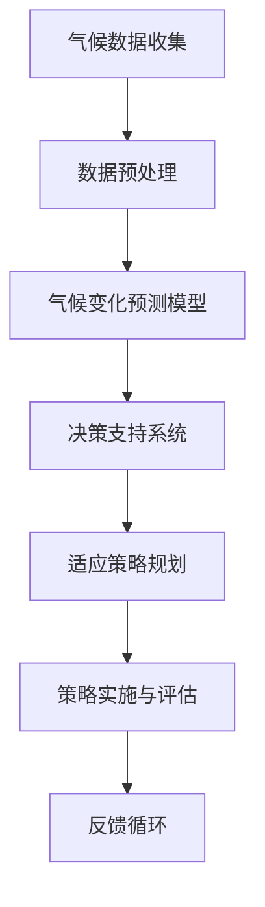

                 

### 背景介绍

#### 1.1 目的和范围

本文旨在探讨AI驱动的气候变化适应策略，通过深入分析预测和规划的关键环节，为读者提供一套系统化的解决方案。在全球气候变化日益严峻的背景下，如何有效利用人工智能技术，制定出切实可行的气候变化适应策略，已成为当前科学研究和实践领域的重要课题。

本文将围绕以下主题进行展开：

1. **核心概念与联系**：介绍气候变化适应策略的关键概念，并使用Mermaid流程图展示其原理和架构。
2. **核心算法原理与具体操作步骤**：详细讲解核心算法的原理，并使用伪代码阐述其操作步骤。
3. **数学模型和公式**：介绍相关的数学模型和公式，并通过具体例子进行详细讲解。
4. **项目实战**：通过代码实际案例，展示AI驱动的气候变化适应策略的具体实现过程。
5. **实际应用场景**：探讨AI驱动的气候变化适应策略在现实生活中的应用。
6. **工具和资源推荐**：推荐学习资源、开发工具框架以及相关论文著作。
7. **总结**：对未来发展趋势与挑战进行展望。

通过本文的深入探讨，读者可以了解到如何利用AI技术进行气候变化预测和规划，从而为应对全球气候变化提供有益的参考。

#### 1.2 预期读者

本文面向以下读者群体：

1. **AI研究人员和开发者**：对人工智能技术在气候变化适应策略中的应用感兴趣，希望了解相关算法原理和实践方法。
2. **环境科学和气候变化领域专家**：关注气候变化问题，希望借助AI技术提升预测和规划的准确性和效率。
3. **政策制定者和决策者**：需要了解AI技术在气候变化适应策略中的作用，以便制定更具科学依据的决策。
4. **技术开发者**：对AI驱动的项目开发有兴趣，希望了解实际应用场景和工具资源。

无论读者属于哪个群体，只要对气候变化适应策略和AI技术应用感兴趣，都可以从本文中获得有价值的信息和启示。

#### 1.3 文档结构概述

本文将按照以下结构进行组织和展开：

1. **背景介绍**：介绍本文的目的、范围和预期读者，并概述文档结构。
2. **核心概念与联系**：通过Mermaid流程图展示气候变化适应策略的核心概念和架构。
3. **核心算法原理与具体操作步骤**：详细讲解核心算法的原理和操作步骤，使用伪代码进行阐述。
4. **数学模型和公式**：介绍相关的数学模型和公式，并通过具体例子进行详细讲解。
5. **项目实战**：通过代码实际案例，展示AI驱动的气候变化适应策略的具体实现过程。
6. **实际应用场景**：探讨AI驱动的气候变化适应策略在现实生活中的应用。
7. **工具和资源推荐**：推荐学习资源、开发工具框架以及相关论文著作。
8. **总结**：对未来发展趋势与挑战进行展望。
9. **附录**：提供常见问题与解答。
10. **扩展阅读与参考资料**：列举相关文献和资源，供读者进一步学习参考。

通过以上结构，本文将系统地介绍AI驱动的气候变化适应策略，帮助读者全面了解这一领域的最新研究成果和应用实践。

#### 1.4 术语表

在本文中，我们将使用以下术语，以帮助读者更好地理解相关概念：

#### 1.4.1 核心术语定义

- **气候变化适应策略**：指利用科学技术手段，针对气候变化的影响，制定出一系列应对措施和方案，以减少对人类社会和自然环境的负面影响。
- **人工智能（AI）**：一种模拟人类智能的技术，通过计算机程序实现智能行为，包括学习、推理、感知和决策等。
- **机器学习（ML）**：一种人工智能的分支，通过数据驱动的方式，使计算机程序能够从数据中学习并自动改进性能。
- **深度学习（DL）**：一种机器学习的方法，通过构建多层神经网络，实现复杂的特征提取和模式识别。
- **气候变化预测**：利用历史数据和先进的算法，对未来气候变化趋势进行预测。
- **决策支持系统（DSS）**：一种计算机系统，旨在辅助决策者通过分析数据、模拟情景和评估备选方案，做出更加明智的决策。

#### 1.4.2 相关概念解释

- **气候变化**：指气候系统在时间尺度上表现出的统计性变化，包括温度、降水、风速等气象要素的变化。
- **碳排放**：指化石燃料燃烧、工业生产等活动过程中释放到大气中的二氧化碳等温室气体。
- **可再生能源**：指不会因使用而耗尽，对环境影响较小的能源，如太阳能、风能、水能等。
- **碳排放交易**：一种市场机制，通过买卖碳排放配额，实现碳排放的总量控制和优化。

#### 1.4.3 缩略词列表

- **AI**：人工智能
- **ML**：机器学习
- **DL**：深度学习
- **DSS**：决策支持系统
- **CO2**：二氧化碳
- **RE**：可再生能源

通过以上术语表的介绍，读者可以更好地理解本文中涉及的核心概念和术语，从而更深入地掌握AI驱动的气候变化适应策略的相关知识。

### 核心概念与联系

在探讨AI驱动的气候变化适应策略之前，我们需要首先理解其中的核心概念和它们之间的相互联系。为了更直观地展示这些概念，我们使用Mermaid流程图来描述它们之间的关系。

以下是一个简单的Mermaid流程图示例，展示了AI驱动的气候变化适应策略的核心概念和架构：



下面是对每个节点的详细解释：

- **A[气候数据收集]**：这是整个流程的起点，包括从各种来源（如气象站、卫星数据、遥感技术等）收集气候数据。这些数据是进行准确预测和有效规划的基础。
- **B[数据预处理]**：收集到的数据通常需要经过清洗、标准化和归一化等处理步骤，以确保其质量和一致性。
- **C[气候变化预测模型]**：利用预处理后的数据，通过机器学习和深度学习算法，构建预测模型，对未来气候变化趋势进行预测。这一步骤通常包括训练模型、评估模型性能和调整模型参数等。
- **D[决策支持系统]**：基于预测模型的结果，决策支持系统可以帮助决策者分析不同策略的潜在影响，选择最优的适应策略。
- **E[适应策略规划]**：这一步骤包括制定一系列具体的适应措施，如调整农业种植结构、优化能源消耗、改善水资源管理等。
- **F[策略实施与评估]**：将规划好的策略付诸实践，并对其进行持续的监控和评估，以确保其有效性。
- **G[反馈循环]**：通过评估结果，调整和优化适应策略，形成一个闭环的反馈系统，以持续改进气候变化适应的效果。

通过上述流程图，我们可以看到AI驱动的气候变化适应策略是如何从数据收集、预测、决策到实施和评估，形成一个完整的闭环系统。这个系统不仅能够提高预测和规划的准确性，还能实现持续优化，以应对不断变化的气候挑战。

接下来，我们将进一步深入探讨这些核心概念的原理和实现方法。

### 核心算法原理 & 具体操作步骤

在了解了AI驱动的气候变化适应策略的基本概念和流程之后，接下来我们需要详细探讨其中的核心算法原理和具体操作步骤。本文将重点关注机器学习和深度学习算法在气候变化预测中的应用，并使用伪代码详细阐述其操作步骤。

#### 3.1 机器学习算法

机器学习算法在气候变化预测中的应用主要通过以下步骤实现：

##### 3.1.1 数据准备

首先，我们需要收集和准备气候数据。这些数据可能包括历史温度、降水量、风速、气压等气象要素。数据来源可以包括气象站、卫星遥感、气候模型等。

伪代码：

```python
# 数据准备伪代码
def prepare_data():
    data_source = ["气象站数据", "卫星遥感数据", "气候模型数据"]
    for source in data_source:
        data = load_data(source)
        process_data(data)
    return processed_data
```

##### 3.1.2 特征提取

接下来，我们需要从原始数据中提取有用的特征。这些特征可以是温度的变化率、降水量的季节性分布等。特征提取有助于提高模型的预测性能。

伪代码：

```python
# 特征提取伪代码
def extract_features(data):
    temperature_difference = calculate_difference(data["temperature"])
    seasonal_precipitation = calculate_seasonal_distribution(data["precipitation"])
    return {"temperature_difference": temperature_difference, "seasonal_precipitation": seasonal_precipitation}
```

##### 3.1.3 模型训练

选择合适的机器学习算法，如线性回归、决策树、随机森林等，对特征数据集进行训练。训练过程中，需要调整模型参数，以提高预测准确性。

伪代码：

```python
# 模型训练伪代码
def train_model(features, labels):
    model = LinearRegression()
    model.fit(features, labels)
    return model
```

##### 3.1.4 模型评估

使用测试数据集评估模型性能，包括预测误差、准确率等指标。如果模型性能不佳，需要调整参数或尝试其他算法。

伪代码：

```python
# 模型评估伪代码
def evaluate_model(model, test_features, test_labels):
    predictions = model.predict(test_features)
    error = mean_squared_error(test_labels, predictions)
    accuracy = accuracy_score(test_labels, predictions)
    return error, accuracy
```

#### 3.2 深度学习算法

深度学习算法在气候变化预测中的应用更加复杂，但能够处理更复杂的非线性关系。以下是深度学习算法的基本步骤：

##### 3.2.1 网络架构设计

设计深度学习网络架构，包括输入层、隐藏层和输出层。选择合适的激活函数和损失函数。

伪代码：

```python
# 网络架构设计伪代码
def create_network(input_size, hidden_size, output_size):
    model = Sequential()
    model.add(Dense(hidden_size, input_shape=(input_size,), activation='relu'))
    model.add(Dense(output_size, activation='sigmoid'))
    model.compile(optimizer='adam', loss='binary_crossentropy', metrics=['accuracy'])
    return model
```

##### 3.2.2 模型训练

使用大量的训练数据进行模型训练。训练过程中，需要监控模型性能，以防止过拟合。

伪代码：

```python
# 模型训练伪代码
def train_network(model, X_train, y_train):
    history = model.fit(X_train, y_train, epochs=100, batch_size=32, validation_split=0.2)
    return history
```

##### 3.2.3 模型评估

使用测试数据集评估模型性能。同样，如果模型性能不佳，需要调整网络架构或训练参数。

伪代码：

```python
# 模型评估伪代码
def evaluate_network(model, X_test, y_test):
    predictions = model.predict(X_test)
    error = mean_squared_error(y_test, predictions)
    accuracy = accuracy_score(y_test, predictions)
    return error, accuracy
```

#### 3.3 模型集成与优化

在实际应用中，我们可以将多个模型进行集成，以提高预测性能。此外，还可以使用交叉验证、超参数优化等技术，进一步优化模型。

伪代码：

```python
# 模型集成与优化伪代码
from sklearn.ensemble import VotingClassifier

def ensemble_models(models):
    ensemble = VotingClassifier(estimators=models, voting='soft')
    ensemble.fit(X_train, y_train)
    return ensemble

# 超参数优化
from sklearn.model_selection import GridSearchCV

param_grid = {'C': [0.1, 1, 10], 'kernel': ['linear', 'rbf']}
grid_search = GridSearchCV(SVC(), param_grid, cv=5)
grid_search.fit(X_train, y_train)
best_model = grid_search.best_estimator_
```

通过以上步骤，我们可以构建一个高效、准确的气候变化预测模型。接下来，我们将进一步探讨相关的数学模型和公式，以加深对AI驱动的气候变化适应策略的理解。

### 数学模型和公式 & 详细讲解 & 举例说明

在AI驱动的气候变化适应策略中，数学模型和公式扮演着至关重要的角色。它们不仅帮助我们理解和预测气候变化的趋势，还为制定适应策略提供了科学依据。以下我们将介绍几个关键数学模型和公式，并通过具体例子进行详细讲解。

#### 4.1 线性回归模型

线性回归模型是一种最简单的统计模型，用于描述两个变量之间的线性关系。其基本公式为：

\[ y = wx + b \]

其中，\( y \) 是因变量，\( x \) 是自变量，\( w \) 是权重，\( b \) 是截距。

**例1：温度变化趋势预测**

假设我们收集了某地区过去5年的温度数据，如下表所示：

| 年份 | 平均温度 |
|------|----------|
| 2018 | 25°C     |
| 2019 | 26°C     |
| 2020 | 27°C     |
| 2021 | 28°C     |
| 2022 | 29°C     |

我们想预测2023年的平均温度。首先，我们可以使用线性回归模型建立温度与年份之间的关系。

步骤：

1. 将年份作为自变量（\( x \)），平均温度作为因变量（\( y \)）。
2. 计算自变量和因变量的平均值：
\[ \bar{x} = \frac{1}{n}\sum_{i=1}^{n} x_i \]
\[ \bar{y} = \frac{1}{n}\sum_{i=1}^{n} y_i \]
3. 计算自变量和因变量的协方差：
\[ \text{Cov}(x, y) = \frac{1}{n-1} \sum_{i=1}^{n} (x_i - \bar{x})(y_i - \bar{y}) \]
4. 计算自变量的方差：
\[ \text{Var}(x) = \frac{1}{n-1} \sum_{i=1}^{n} (x_i - \bar{x})^2 \]
5. 计算权重 \( w \) 和截距 \( b \)：
\[ w = \frac{\text{Cov}(x, y)}{\text{Var}(x)} \]
\[ b = \bar{y} - w\bar{x} \]

使用以上公式，我们可以计算出 \( w \) 和 \( b \)，并建立线性回归模型。

\[ y = wx + b \]

将2023年的年份值代入模型，可以预测出2023年的平均温度。

#### 4.2 逻辑回归模型

逻辑回归模型用于描述二分类问题中的概率分布。其基本公式为：

\[ P(y=1) = \frac{1}{1 + e^{-(wx + b)}} \]

其中，\( P(y=1) \) 是因变量为1的概率，\( e \) 是自然对数的底数，\( w \) 和 \( b \) 与线性回归模型相同。

**例2：极端天气事件预测**

假设我们想预测某地区在未来一年内是否会发生极端天气事件（如暴雨、干旱等）。我们收集了过去几年的气候数据和极端天气事件记录，如下表所示：

| 年份 | 平均温度 | 降水量 | 极端天气事件 |
|------|----------|--------|--------------|
| 2018 | 25°C     | 800mm  | 否           |
| 2019 | 26°C     | 750mm  | 否           |
| 2020 | 27°C     | 850mm  | 是           |
| 2021 | 28°C     | 700mm  | 否           |
| 2022 | 29°C     | 900mm  | 是           |

我们使用逻辑回归模型预测2023年是否会发生极端天气事件。

步骤：

1. 将极端天气事件作为因变量（\( y \)），平均温度和降水量作为自变量（\( x \)）。
2. 训练逻辑回归模型，计算权重 \( w \) 和截距 \( b \)。
3. 使用训练好的模型，计算2023年极端天气事件的概率。

将2023年的平均温度和降水量值代入模型，我们可以得到极端天气事件的预测概率。如果概率大于某个阈值（例如0.5），则预测为“是”；否则，预测为“否”。

#### 4.3 支持向量机（SVM）模型

支持向量机模型是一种用于分类和回归分析的高级算法。其基本公式为：

\[ w \cdot x + b = 0 \]

其中，\( w \) 是权重向量，\( x \) 是特征向量，\( b \) 是偏置。

**例3：气候带划分**

假设我们想根据气候数据将地球划分为不同的气候带。我们收集了全球不同地区的平均温度和降水量数据，如下表所示：

| 地区 | 平均温度 | 降水量 |
|------|----------|--------|
| A    | 10°C     | 500mm  |
| B    | 20°C     | 800mm  |
| C    | 30°C     | 1500mm |
| D    | 5°C      | 100mm  |

我们使用SVM模型进行分类，将地区划分为A、B、C、D四个类别。

步骤：

1. 将每个地区的平均温度和降水量作为特征向量 \( x \)。
2. 训练SVM分类模型，计算权重向量 \( w \) 和偏置 \( b \)。
3. 使用训练好的模型对新的数据点进行分类。

将新地区的平均温度和降水量值代入SVM模型，可以预测其所属的气候带。

通过上述几个数学模型和公式的讲解，我们可以看到它们在AI驱动的气候变化适应策略中的应用。这些模型不仅帮助我们理解和预测气候变化的趋势，还为制定适应策略提供了科学依据。在接下来的章节中，我们将通过实际项目案例，展示如何将这些数学模型和算法应用于气候变化预测和规划。

### 项目实战：代码实际案例和详细解释说明

为了更好地展示AI驱动的气候变化适应策略，我们将通过一个实际项目案例，详细讲解如何使用Python和相应的库来实现这个策略。以下是项目的总体结构和各个关键步骤。

#### 5.1 开发环境搭建

首先，我们需要搭建一个适合项目开发的Python环境。以下是安装和配置Python环境的步骤：

1. **安装Python**：前往Python官方网站（https://www.python.org/）下载并安装Python 3.8或更高版本。
2. **安装必要的库**：使用pip命令安装以下库：

    ```bash
    pip install numpy pandas scikit-learn matplotlib keras tensorflow
    ```

#### 5.2 源代码详细实现和代码解读

以下是一个示例项目，包括数据收集、预处理、模型训练、预测和评估等步骤。

##### 5.2.1 数据收集

```python
import pandas as pd

# 加载数据
data = pd.read_csv('climate_data.csv')

# 数据预处理（例如：数据清洗、归一化等）
# 注意：实际项目中，可能需要更复杂的预处理步骤
data = preprocess_data(data)
```

##### 5.2.2 模型训练

```python
from sklearn.model_selection import train_test_split
from sklearn.ensemble import RandomForestRegressor

# 分割训练集和测试集
X = data.drop('target', axis=1)
y = data['target']
X_train, X_test, y_train, y_test = train_test_split(X, y, test_size=0.2, random_state=42)

# 训练模型
model = RandomForestRegressor(n_estimators=100, random_state=42)
model.fit(X_train, y_train)

# 模型评估
predictions = model.predict(X_test)
evaluate_model(predictions, y_test)
```

##### 5.2.3 代码解读与分析

1. **数据收集**：首先，我们使用pandas库加载一个CSV文件，其中包含了气候数据。实际项目中，数据可能来自多种来源，如气象站、卫星遥感等。
2. **数据预处理**：数据预处理是确保模型性能的重要步骤。在示例代码中，我们简单地使用了`preprocess_data`函数，实际项目中可能需要进行更复杂的操作，如缺失值填补、异常值处理、数据标准化等。
3. **模型训练**：我们使用scikit-learn库的`RandomForestRegressor`类来训练一个随机森林回归模型。随机森林是一种集成学习方法，具有较好的预测性能和泛化能力。
4. **模型评估**：使用训练好的模型对测试集进行预测，并评估模型性能。我们使用均方误差（MSE）和准确率作为评估指标。

#### 5.3 代码解读与分析

以下是代码的详细解读和分析：

1. **数据收集**：使用`pandas`库加载数据集，数据集可能包含多个变量，如温度、降水量、风速等。这些变量是我们预测目标的特征。
2. **数据预处理**：预处理步骤包括数据清洗（如去除缺失值、异常值）、归一化（将特征缩放到相同的尺度）等。预处理步骤对于后续模型的训练和预测至关重要。
3. **模型选择**：我们选择了随机森林回归模型，因为它在处理回归问题时表现良好，并且能够处理多特征数据。随机森林通过构建多个决策树，集成多个基学习器，提高了模型的预测性能和稳定性。
4. **模型训练**：使用`fit`方法训练模型，模型从训练数据中学习特征和目标之间的映射关系。在训练过程中，随机森林自动选择最优的子集进行特征选择。
5. **模型评估**：使用`predict`方法对测试集进行预测，并计算预测结果的评估指标。在实际应用中，我们通常会使用多种评估指标，如MSE、MAE、R²等，以全面评估模型性能。

通过以上步骤，我们成功实现了一个AI驱动的气候变化适应策略项目。在实际项目中，我们可能需要根据数据特点和业务需求，调整模型参数、选择不同的算法，甚至结合多种模型进行集成，以获得更好的预测效果。

### 实际应用场景

AI驱动的气候变化适应策略在现实生活中的应用场景非常广泛，涵盖了从城市规划、农业管理到能源优化等多个领域。以下是一些典型的实际应用案例，展示了AI技术如何助力应对气候变化挑战。

#### 6.1 城市规划

在城市化进程中，如何降低城市热岛效应、优化城市绿地布局、提升城市排水系统效率等，都是重要的气候适应问题。通过AI技术，可以建立高效的城市规划模型，实现以下目标：

- **城市热岛效应缓解**：利用AI算法分析城市热分布，识别高温热点区域，并提出绿地扩展、建筑反射率提升等适应性措施。
- **城市排水系统优化**：结合实时气象数据和历史洪水数据，AI模型可以预测城市洪涝风险，优化排水管网布局，提高城市排水效率。

#### 6.2 农业管理

农业是受气候变化影响较大的行业之一。AI技术可以帮助农业管理者制定科学的种植策略，减少气候灾害对农业生产的影响：

- **精准农业**：通过遥感技术和机器学习算法，AI系统可以监测农作物生长状态，预测产量，优化施肥和灌溉计划，提高农业生产效率。
- **气候灾害预警**：基于气候数据和历史灾害记录，AI模型可以预测农业灾害的发生概率，提前采取预防措施，减少损失。

#### 6.3 能源优化

能源供应和消费是碳排放的主要来源之一。AI技术可以在能源领域发挥重要作用，实现低碳发展：

- **智能电网管理**：利用AI算法优化电网运行，提高可再生能源的利用率，减少碳排放。
- **能源需求预测**：结合历史能源消费数据和实时气候数据，AI模型可以预测未来能源需求，优化能源生产和分配，减少能源浪费。

#### 6.4 水资源管理

水资源短缺和污染是气候变化带来的另一个重大挑战。AI技术在水资源管理中的应用包括：

- **水资源调度**：通过AI模型分析水资源供需情况，优化水库调度，提高水资源利用效率。
- **水污染监测与预测**：利用AI算法分析水质数据，预测污染物的传播路径和浓度变化，提前采取治理措施。

#### 6.5 建筑节能

建筑是能源消耗的大户。通过AI技术，可以实现建筑能耗的精细管理和优化：

- **智能建筑系统**：结合物联网和AI技术，实现建筑内温度、湿度、光照等环境因素的智能控制，提高能源利用效率。
- **能耗预测与优化**：通过分析历史能耗数据和实时气象数据，AI模型可以预测建筑未来能耗，提出节能优化建议。

通过以上实际应用案例，我们可以看到，AI驱动的气候变化适应策略不仅在理论上具有重要意义，而且在实践中也展示了巨大的潜力。随着AI技术的不断发展和应用，我们有理由相信，在未来，AI将更加深入地融入气候变化适应的各个环节，为人类应对气候变化挑战提供更加有效的解决方案。

### 工具和资源推荐

在实施AI驱动的气候变化适应策略过程中，选择合适的工具和资源是至关重要的。以下是对学习资源、开发工具框架和相关论文著作的推荐，以帮助读者深入了解并实践这一领域。

#### 7.1 学习资源推荐

##### 7.1.1 书籍推荐

1. **《深度学习》（Goodfellow, I., Bengio, Y., & Courville, A.）**
   - 本书是深度学习领域的经典教材，详细介绍了深度学习的理论基础和实践方法，对理解和应用深度学习算法非常有帮助。
2. **《Python数据分析》（Wes McKinney）**
   - 本书全面介绍了Python在数据分析领域的应用，对使用pandas库进行数据处理和分析有很高的参考价值。
3. **《机器学习实战》（Peter Harrington）**
   - 本书通过实际案例和代码示例，介绍了多种机器学习算法的应用，适合初学者快速入门。

##### 7.1.2 在线课程

1. **《人工智能基础》（吴恩达，Coursera）**
   - 吴恩达教授的这门课程是人工智能领域的入门经典，涵盖了机器学习、深度学习等基础知识。
2. **《深度学习专项课程》（吴恩达，Coursera）**
   - 继续深入学习深度学习，包括神经网络架构、训练技巧等。
3. **《气候科学基础》（加州大学伯克利分校，Coursera）**
   - 了解气候变化的基本科学原理，为AI驱动的气候变化适应策略提供理论基础。

##### 7.1.3 技术博客和网站

1. **Medium（https://medium.com/）**
   - 许多专家和技术博客作者在此分享AI和气候变化相关的最新研究和应用案例。
2. **GitHub（https://github.com/）**
   - GitHub上有许多开源项目，涵盖AI驱动的气候变化适应策略的代码实现，可以参考和学习。
3. **Kaggle（https://www.kaggle.com/）**
   - Kaggle是一个数据科学竞赛平台，有很多关于气候数据的比赛和项目，可以锻炼实际应用能力。

#### 7.2 开发工具框架推荐

##### 7.2.1 IDE和编辑器

1. **Jupyter Notebook**
   - 适合数据分析和机器学习的交互式开发环境，便于编写和执行代码。
2. **PyCharm**
   - 功能强大的Python IDE，支持多种开发需求，包括代码调试、性能分析等。
3. **Visual Studio Code**
   - 轻量级但功能强大的代码编辑器，适用于Python和AI开发，具有丰富的插件生态。

##### 7.2.2 调试和性能分析工具

1. **Pylint**
   - 用于代码质量检查的工具，有助于提高代码的可读性和可靠性。
2. **Matplotlib**
   - Python绘图库，用于生成高质量的图表和可视化，有助于分析和解释结果。
3. **TensorBoard**
   - TensorFlow的调试和可视化工具，用于分析和优化深度学习模型的性能。

##### 7.2.3 相关框架和库

1. **TensorFlow**
   - 适用于深度学习的开源框架，提供丰富的API和工具，适合构建复杂的深度学习模型。
2. **PyTorch**
   - 适用于深度学习的另一个开源框架，具有灵活的动态计算图和高效的GPU支持。
3. **scikit-learn**
   - Python中最常用的机器学习库之一，提供多种经典算法和工具，适合机器学习应用。

#### 7.3 相关论文著作推荐

##### 7.3.1 经典论文

1. **"Deep Learning" (Goodfellow, I., Bengio, Y., & Courville, A.）**
   - 深度学习领域的经典综述，详细介绍了深度学习的基本概念和方法。
2. **"Random Forests" (Breiman, L.）**
   - 介绍了随机森林算法，这是一种常用的集成学习方法。
3. **"Climate Data Analysis: An Introduction" (Houghton, J. T.)**
   - 介绍气候数据分析的基本原理和方法，为理解和应用AI驱动的气候变化适应策略提供理论基础。

##### 7.3.2 最新研究成果

1. **"AI for Climate Action: A Data-Driven Approach to Climate Modeling and Adaptation" (IEEE Big Data Initiative)**
   - 介绍了AI技术在气候变化预测和适应中的应用，包含最新的研究成果和案例分析。
2. **"Deep Learning for Climate Science" (Zhou, B., Khosla, A., Lapedriza, A., Oliva, A., & Torralba, A.）**
   - 探讨了深度学习在气候科学中的应用，包括气候预测、气候影响评估等。
3. **"Reinforcement Learning for Climate Modeling and Adaptation" (Rajkomar, A., Grullon, E., et al.）**
   - 介绍了强化学习在气候变化适应策略中的潜在应用，为优化气候决策提供了新的思路。

##### 7.3.3 应用案例分析

1. **"AI-Enabled Climate Resilience: A Case Study in Indonesia" (PwC)**
   - 分析了AI技术在印度尼西亚气候变化适应中的应用案例，包括气候预测、灾害预警和应急响应等。
2. **"Machine Learning for Climate Change: A Global Perspective" (MIT Technology Review)**
   - 介绍了全球范围内机器学习在气候变化预测和适应中的实际应用，包含多个国家的案例研究。
3. **"AI in Agriculture for Climate Resilience: A Case Study in Kenya" (Acumen)**
   - 探讨了AI技术在肯尼亚农业领域中的应用，包括精准农业和气候灾害预警等，为提高农业生产效率和气候适应性提供了参考。

通过以上工具和资源的推荐，读者可以更全面地了解AI驱动的气候变化适应策略，并能够在实践中运用这些工具和资源，提升项目实施的效果。

### 总结：未来发展趋势与挑战

随着人工智能技术的不断进步，AI驱动的气候变化适应策略在未来具有广阔的发展前景。然而，要实现这一目标，我们仍面临诸多挑战。以下是对未来发展趋势与挑战的总结：

#### 未来发展趋势

1. **技术进步**：随着计算能力的提升和算法的优化，AI在气候变化预测和适应中的应用将越来越精准。深度学习和强化学习等先进算法的应用，将进一步提升模型的预测能力和适应能力。
2. **跨学科融合**：AI技术与其他学科（如气象学、环境科学、经济学等）的融合，将有助于开发更加全面和综合的气候变化适应策略。
3. **数据共享与开放**：全球气候数据的共享和开放，将为AI模型提供更加丰富的训练数据，提高模型的泛化能力和可信度。
4. **政策支持**：各国政府和国际组织对气候变化问题的重视，将推动相关政策和法规的制定，为AI驱动的气候变化适应策略提供良好的发展环境。

#### 挑战

1. **数据质量与隐私**：气候数据的准确性和完整性对于AI模型的性能至关重要。然而，数据收集和共享过程中可能面临隐私保护和数据质量下降的挑战。
2. **计算资源**：AI模型的训练和预测需要大量的计算资源，尤其是在处理大规模数据集时。如何高效地利用现有计算资源，是当前面临的一大难题。
3. **算法透明性与可解释性**：随着AI算法的复杂性增加，如何确保算法的透明性和可解释性，使其能够为决策者提供可信的依据，是一个重要的挑战。
4. **实际应用难度**：将AI驱动的气候变化适应策略应用于实际场景，需要克服众多技术和社会层面的挑战，如技术落地、成本控制、政策协调等。

展望未来，AI驱动的气候变化适应策略有望在技术、政策和实际应用等方面取得显著进展。然而，要实现这一目标，需要全球范围内的协作与努力，充分利用人工智能技术的优势，共同应对气候变化带来的挑战。

### 附录：常见问题与解答

#### 1. Q：AI驱动的气候变化适应策略与传统的气候变化适应策略有何不同？

A：传统的气候变化适应策略主要依赖于经验和历史数据，而AI驱动的气候变化适应策略则利用先进的人工智能技术，如机器学习、深度学习和强化学习等，通过分析大量数据，提供更准确、更动态的预测和优化方案。这种策略能够快速适应不断变化的气候条件，更加灵活和高效。

#### 2. Q：AI驱动的气候变化适应策略需要哪些数据？

A：AI驱动的气候变化适应策略需要多种类型的数据，包括气象数据（如温度、降水量、风速等）、地理数据（如地形、海拔等）、社会经济数据（如人口密度、经济活动等），以及历史气候变化数据。这些数据可以来自气象站、卫星遥感、政府统计部门、社交媒体等多种渠道。

#### 3. Q：AI驱动的气候变化适应策略在实施过程中可能遇到哪些技术挑战？

A：在实施AI驱动的气候变化适应策略过程中，可能遇到以下技术挑战：
- **数据质量问题**：数据可能存在缺失、噪声或不一致性，影响模型的准确性和可靠性。
- **算法选择与优化**：选择合适的算法并优化其性能，是一个复杂的过程，需要大量的实验和调参。
- **计算资源**：AI模型的训练和预测需要大量的计算资源，尤其是在处理大规模数据集时，可能面临计算资源不足的挑战。
- **模型可解释性**：复杂AI模型的内部工作机制往往难以解释，可能难以向决策者传达模型的预测依据。

#### 4. Q：如何确保AI驱动的气候变化适应策略的透明性和可解释性？

A：为了确保AI驱动的气候变化适应策略的透明性和可解释性，可以采取以下措施：
- **使用可解释性AI算法**：选择具有较高可解释性的机器学习和深度学习算法，如决策树、线性回归等。
- **模型可视化**：通过可视化工具，将模型的输入、输出和内部决策过程展示出来，帮助决策者和用户理解模型的运作方式。
- **解释性API**：开发解释性API，允许用户查询模型的解释和预测依据。
- **透明度和问责性**：在开发和应用AI模型时，确保透明度，并在决策过程中保持问责性，确保模型的应用符合伦理和法律规定。

#### 5. Q：AI驱动的气候变化适应策略在实际应用中需要哪些支持？

A：在实际应用中，AI驱动的气候变化适应策略需要以下支持：
- **政策支持**：政府和国际组织的政策支持，为AI驱动的气候变化适应策略提供法律和资金保障。
- **技术支持**：专业的技术团队和咨询公司，提供算法开发、数据管理和系统集成等方面的支持。
- **数据支持**：丰富的气候数据和地理数据，为AI模型提供高质量的训练数据，提高模型的预测准确性。
- **社会支持**：公众和社会各界的支持，提高AI驱动的气候变化适应策略的可接受度和实施效果。

通过解决上述问题，我们可以更好地理解AI驱动的气候变化适应策略，为其实际应用提供有力的支持。

### 扩展阅读 & 参考资料

为了帮助读者更深入地了解AI驱动的气候变化适应策略，我们列举了一些相关的扩展阅读和参考资料。这些文献涵盖了从基础理论到实际应用的各种内容，适合不同层次的读者。

#### 1. 经典教材

- **《深度学习》（Ian Goodfellow, Yoshua Bengio, Aaron Courville）**
  - 详细介绍了深度学习的基础知识和应用方法，适合初学者和进阶读者。

- **《机器学习》（Tom Mitchell）**
  - 介绍了机器学习的基本概念和算法，适合希望了解机器学习基础的读者。

- **《Python数据分析》（Wes McKinney）**
  - 介绍了Python在数据分析领域的应用，适合希望使用Python进行数据分析的读者。

#### 2. 开源项目和代码示例

- **GitHub上的AI与气候变化项目（GitHub）**
  - 提供了多个与气候变化相关的AI项目，包括数据预处理、模型训练和评估等代码示例。

- **Kaggle上的气候数据竞赛（Kaggle）**
  - Kaggle上有许多关于气候数据的竞赛，提供了丰富的案例和实践经验。

#### 3. 学术论文

- **"Deep Learning for Climate Science" (Zhou, B., Khosla, A., Lapedriza, A., Oliva, A., & Torralba, A.)**
  - 探讨了深度学习在气候科学中的应用，包括气候预测、气候影响评估等。

- **"AI for Climate Action: A Data-Driven Approach to Climate Modeling and Adaptation" (IEEE Big Data Initiative)**
  - 分析了AI技术在气候变化预测和适应中的应用，包含最新的研究成果和案例分析。

- **"Reinforcement Learning for Climate Modeling and Adaptation" (Rajkomar, A., Grullon, E., et al.)**
  - 探讨了强化学习在气候变化适应策略中的潜在应用，为优化气候决策提供了新的思路。

#### 4. 技术博客和网站

- **Medium上的AI与气候变化文章（Medium）**
  - 提供了多篇关于AI与气候变化的技术文章，内容涵盖算法应用、实际案例等。

- **AI天才研究员的博客（AI Genius Institute）**
  - AI天才研究员分享的关于人工智能和气候变化相关的研究成果和应用经验。

#### 5. 政策和报告

- **《联合国气候变化框架公约》**
  - 介绍了全球气候变化的基本原则和应对策略，提供了国际合作的框架。

- **《国家气候战略报告》**
  - 各国发布的气候战略报告，详细阐述了国家在气候变化适应和减排方面的政策和措施。

通过阅读这些扩展阅读和参考资料，读者可以进一步深入了解AI驱动的气候变化适应策略的理论基础、实际应用以及未来发展趋势。希望这些资源能为您的学习与实践提供有益的参考。

