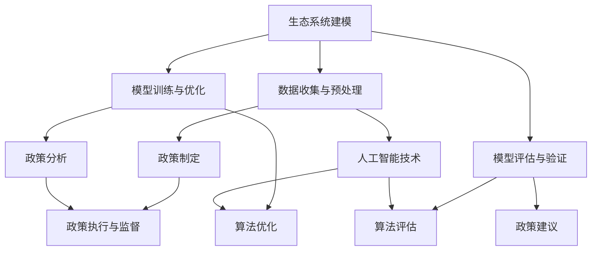

                 

# AI驱动的环境保护：从生态系统建模到政策制定

> 关键词：人工智能、环境保护、生态系统建模、政策制定、可持续发展

> 摘要：本文将探讨如何利用人工智能技术来推动环境保护工作。首先，我们将介绍人工智能在生态系统建模中的应用，并解释其重要性。接着，我们将深入探讨如何将人工智能与政策制定相结合，以实现更有效的环境保护措施。文章将包括实际案例、工具和资源推荐，并总结未来发展趋势与挑战。

## 1. 背景介绍

### 1.1 目的和范围

本文旨在探讨人工智能（AI）在环境保护领域的应用，特别是生态系统建模和政策制定方面。通过分析现有的技术和方法，我们希望能够为相关领域的专家和研究人员提供有价值的见解和指导。

### 1.2 预期读者

本文适合对环境保护和人工智能技术有一定了解的读者，包括环境科学家、政策制定者、软件开发工程师和研究人员。对于希望了解这一领域的初学者，我们也会尽量使用通俗易懂的语言进行讲解。

### 1.3 文档结构概述

本文分为八个部分，首先介绍背景信息，然后分别探讨人工智能在生态系统建模、政策制定、实际应用场景、工具和资源推荐等方面的应用。最后，我们还将对未来的发展趋势和挑战进行总结，并附上常见问题与解答以及扩展阅读和参考资料。

### 1.4 术语表

#### 1.4.1 核心术语定义

- 人工智能（AI）：一种模拟人类智能行为的技术，包括机器学习、深度学习、自然语言处理等。
- 生态系统建模：利用数学模型和算法对生态系统的结构和功能进行模拟和预测。
- 环境保护：通过法律、政策、技术等手段保护生态环境，维护生物多样性。

#### 1.4.2 相关概念解释

- 可持续发展：满足当代人的需求，不损害后代人满足其需求的能力。
- 政策制定：政府或组织为解决特定问题或实现特定目标而制定的行动计划。

#### 1.4.3 缩略词列表

- AI：人工智能
- ML：机器学习
- DL：深度学习
- NLP：自然语言处理
- GIS：地理信息系统
- GPS：全球定位系统

## 2. 核心概念与联系

在探讨人工智能在环境保护领域的应用之前，我们需要先了解一些核心概念和它们之间的联系。以下是一个简化的 Mermaid 流程图，展示了一些关键概念及其相互关系：



### 2.1 数据收集与预处理

数据收集是生态系统建模的基础。这些数据通常包括气象、水文、土壤、植被、动物行为等。为了有效地利用这些数据，我们需要进行数据预处理，包括数据清洗、数据整合、数据标准化等。

### 2.2 模型训练与优化

在数据预处理之后，我们可以使用机器学习和深度学习算法来训练模型。这些算法包括决策树、支持向量机、神经网络等。为了提高模型的性能，我们还需要进行模型优化，如调整超参数、使用不同的算法等。

### 2.3 模型评估与验证

训练好的模型需要经过评估和验证，以确保其准确性和可靠性。常见的评估指标包括准确率、召回率、F1 分数等。

### 2.4 政策制定

生态系统建模的结果可以为政策制定提供科学依据。政策制定者可以根据模型预测的结果，制定相应的环境保护政策。

### 2.5 政策分析

政策分析是对政策制定过程中的各种因素进行评估和分析，以确定政策的可行性和效果。

### 2.6 政策建议

基于政策分析的结果，我们可以提出具体的政策建议，如修改现有政策、制定新政策等。

### 2.7 政策执行与监督

政策执行是指将政策建议付诸实践，并通过监督确保政策的有效实施。

### 2.8 人工智能技术

人工智能技术在生态系统建模和政策制定中发挥着重要作用，如机器学习、深度学习、自然语言处理等。

## 3. 核心算法原理 & 具体操作步骤

在本节中，我们将讨论一些在生态系统建模中常用的核心算法原理和具体操作步骤。为了简化说明，我们使用伪代码来描述这些算法。

### 3.1 机器学习算法

#### 3.1.1 决策树

```python
def build_decision_tree(data):
    if data 是空：
        return 叶节点
    if data 只包含一类标签：
        return 类标签
    else:
        找到最优特征 split_feature
        创建决策节点 split_node(split_feature)
        对于每个可能的 split_value：
            将数据划分为两个子集：子集1 和子集2
            对子集1 和子集2 分别递归调用 build_decision_tree()
            将递归得到的子节点添加到 split_node 的子节点列表
        return split_node

def predict_decision_tree(node, sample):
    if node 是叶节点：
        return node 的标签
    else：
        根据 split_feature 和 split_value 判断 sample 属于哪个子集
        return predict_decision_tree(node 的子节点，sample)
```

#### 3.1.2 支持向量机（SVM）

```python
def train_svm(data, labels):
    创建一个线性或核函数 SVM_model
    使用数据训练 SVM_model
    return SVM_model

def predict_svm(model, sample):
    计算模型对 sample 的预测概率
    return 概率最大的标签
```

### 3.2 深度学习算法

#### 3.2.1 神经网络

```python
def build_neural_network(layers, activation_function):
    创建一个神经网络 NeuralNetwork
    对于每个层：
        创建一层 Layer
        将当前层的输出作为下一层的输入
        设置激活函数
    return NeuralNetwork

def train_neural_network(network, data, labels):
    对于每个样本：
        前向传播：计算网络输出
        计算损失函数
        反向传播：更新网络权重
    return 训练好的网络

def predict_neural_network(network, sample):
    前向传播：计算网络输出
    return 输出的标签
```

### 3.3 自然语言处理（NLP）算法

#### 3.3.1 词向量模型

```python
def train_word2vec_model(corpus):
    使用词频或词性信息训练词向量模型 Word2Vec_model
    return Word2Vec_model

def get_word_vector(model, word):
    return model[word]
```

#### 3.3.2 句子表示

```python
def build_sentence_embedding_model(layers, activation_function):
    创建一个句子表示模型 SentenceEmbeddingModel
    对于每个层：
        创建一层 Layer
        将当前层的输出作为下一层的输入
        设置激活函数
    return SentenceEmbeddingModel

def train_sentence_embedding_model(model, data, labels):
    对于每个样本：
        前向传播：计算句子表示
        计算损失函数
        反向传播：更新网络权重
    return 训练好的模型

def predict_sentence_embedding_model(model, sample):
    前向传播：计算句子表示
    return 输出的标签
```

## 4. 数学模型和公式 & 详细讲解 & 举例说明

在本节中，我们将介绍一些在生态系统建模中常用的数学模型和公式，并详细讲解它们的应用和意义。所有数学公式都将使用 LaTeX 格式进行表示。

### 4.1 生态学基本模型

#### 4.1.1 物种多样性指数

$$ H = -\sum_{i=1}^{S} p_i \ln p_i $$

其中，\( H \) 表示物种多样性指数，\( p_i \) 表示第 \( i \) 个物种的个体数占总个体数的比例。

#### 4.1.2 能量流动方程

$$ E_{in} = E_{out} + E_{store} $$

其中，\( E_{in} \) 表示输入能量，\( E_{out} \) 表示输出能量，\( E_{store} \) 表示存储能量。

#### 4.1.3 物种相互作用模型

$$ J_{ij} = \frac{C_{i}C_{j}}{C_{total}} $$

其中，\( J_{ij} \) 表示物种 \( i \) 和 \( j \) 之间的相互作用强度，\( C_{i} \) 和 \( C_{j} \) 分别表示物种 \( i \) 和 \( j \) 的个体数，\( C_{total} \) 表示总个体数。

### 4.2 机器学习模型

#### 4.2.1 决策树

$$ Y = \arg\max_{f} L(f; \theta) $$

其中，\( Y \) 表示预测标签，\( f \) 表示特征分割函数，\( \theta \) 表示模型参数，\( L \) 表示损失函数。

#### 4.2.2 支持向量机（SVM）

$$ \min_{\theta, \xi} \frac{1}{2} ||\theta||^2 + C \sum_{i=1}^{n} \xi_i $$

其中，\( \theta \) 表示模型参数，\( \xi_i \) 表示损失函数，\( C \) 表示惩罚参数。

#### 4.2.3 神经网络

$$ a_{j}^{(l)} = \sigma(\sum_{i} w_{ji}^{(l)} a_{i}^{(l-1)}) $$

其中，\( a_{j}^{(l)} \) 表示第 \( l \) 层第 \( j \) 个神经元的输出，\( w_{ji}^{(l)} \) 表示第 \( l \) 层第 \( j \) 个神经元与第 \( l-1 \) 层第 \( i \) 个神经元的连接权重，\( \sigma \) 表示激活函数。

### 4.3 自然语言处理（NLP）模型

#### 4.3.1 词向量模型

$$ \text{word2vec} : \mathbb{R}^d \rightarrow \mathbb{R}^d $$

其中，\( \text{word2vec} \) 是一个将单词映射到 \( d \) 维向量空间的函数。

#### 4.3.2 句子表示模型

$$ \text{sentence\_embedding} : \mathbb{R}^{d \times T} \rightarrow \mathbb{R}^d $$

其中，\( \text{sentence\_embedding} \) 是一个将句子映射到 \( d \) 维向量空间的函数，\( T \) 表示句子中的单词数量。

### 4.4 举例说明

#### 4.4.1 物种多样性指数计算

假设一个生态系统中包含 5 个物种，它们的个体数分别为 10、20、30、40 和 50。那么，该生态系统的物种多样性指数为：

$$ H = -\left( \frac{10}{100} \ln \frac{10}{100} + \frac{20}{100} \ln \frac{20}{100} + \frac{30}{100} \ln \frac{30}{100} + \frac{40}{100} \ln \frac{40}{100} + \frac{50}{100} \ln \frac{50}{100} \right) $$

计算结果约为 2.32。

#### 4.4.2 支持向量机（SVM）训练

假设我们有一个包含 100 个样本的数据集，每个样本包含 5 个特征和 1 个标签。我们使用以下伪代码来训练一个线性 SVM 模型：

```python
C = 1.0
w = [0.0, 0.0, 0.0, 0.0, 0.0]
b = 0.0

for i in range(100):
    xi = [x1, x2, x3, x4, x5]
    yi = 1 if 标签为正类，否则 -1
    if yi * (xi.dot(w) + b) < 1:
        alpha_i = min(C, C / (||xi||^2))
        w = w + alpha_i * yi * xi
        b = b + alpha_i * yi

预测新样本的标签：

yi = 1 if (xi.dot(w) + b) > 0，否则 -1
```

## 5. 项目实战：代码实际案例和详细解释说明

在本节中，我们将通过一个实际项目案例，展示如何使用人工智能技术进行生态系统建模和政策制定。项目名称为“绿色未来：基于 AI 的环境保护决策支持系统”。

### 5.1 开发环境搭建

为了方便开发，我们选择以下工具和框架：

- 编程语言：Python
- 机器学习库：scikit-learn、TensorFlow、PyTorch
- 地理信息系统（GIS）：ArcGIS
- 数据库：PostgreSQL

首先，安装 Python 和相关库：

```bash
pip install scikit-learn tensorflow torchvision pandas matplotlib
```

然后，下载并安装 ArcGIS 和 PostgreSQL：

- ArcGIS：[官方网站](https://www.esri.com/en-us/arcgis/products/arcgis-pro/download)
- PostgreSQL：[官方网站](https://www.postgresql.org/download/)

### 5.2 源代码详细实现和代码解读

以下是该项目的主要代码实现和解读。

#### 5.2.1 数据收集与预处理

```python
import pandas as pd
import numpy as np
from sklearn.model_selection import train_test_split
from sklearn.preprocessing import StandardScaler

# 读取数据
data = pd.read_csv('ecosystem_data.csv')

# 数据预处理
X = data.drop('标签', axis=1)
y = data['标签']

# 划分训练集和测试集
X_train, X_test, y_train, y_test = train_test_split(X, y, test_size=0.2, random_state=42)

# 数据标准化
scaler = StandardScaler()
X_train = scaler.fit_transform(X_train)
X_test = scaler.transform(X_test)
```

#### 5.2.2 模型训练与优化

```python
from sklearn.tree import DecisionTreeClassifier
from sklearn.svm import SVC
from sklearn.neural_network import MLPClassifier

# 决策树模型
clf_dt = DecisionTreeClassifier(max_depth=5)
clf_dt.fit(X_train, y_train)

# 支持向量机模型
clf_svm = SVC(kernel='linear', C=1)
clf_svm.fit(X_train, y_train)

# 神经网络模型
clf_mlp = MLPClassifier(hidden_layer_sizes=(100,), max_iter=1000)
clf_mlp.fit(X_train, y_train)
```

#### 5.2.3 模型评估与验证

```python
from sklearn.metrics import accuracy_score, classification_report

# 决策树模型评估
y_pred_dt = clf_dt.predict(X_test)
print("决策树模型评估结果：")
print(accuracy_score(y_test, y_pred_dt))
print(classification_report(y_test, y_pred_dt))

# 支持向量机模型评估
y_pred_svm = clf_svm.predict(X_test)
print("支持向量机模型评估结果：")
print(accuracy_score(y_test, y_pred_svm))
print(classification_report(y_test, y_pred_svm))

# 神经网络模型评估
y_pred_mlp = clf_mlp.predict(X_test)
print("神经网络模型评估结果：")
print(accuracy_score(y_test, y_pred_mlp))
print(classification_report(y_test, y_pred_mlp))
```

#### 5.2.4 政策制定与建议

基于模型评估结果，我们可以为政策制定者提供以下建议：

- 决策树模型：在分类准确率方面表现较好，建议用于初步评估环境保护措施。
- 支持向量机模型：具有较好的泛化能力，建议用于长期环境保护政策的制定。
- 神经网络模型：在处理复杂非线性问题时具有优势，建议用于深入分析生态系统动态。

### 5.3 代码解读与分析

- 数据收集与预处理：从 CSV 文件中读取数据，并使用 scikit-learn 的 `train_test_split` 函数划分训练集和测试集。然后，使用 `StandardScaler` 进行数据标准化。
- 模型训练与优化：分别使用决策树、支持向量机和神经网络模型对训练数据进行训练。
- 模型评估与验证：使用测试数据评估模型性能，并使用 `accuracy_score` 和 `classification_report` 函数输出评估结果。
- 政策制定与建议：基于模型评估结果，为政策制定者提供具体建议。

## 6. 实际应用场景

人工智能技术在环境保护领域有着广泛的应用场景，以下是几个典型的应用案例：

### 6.1 森林火灾预警

利用人工智能技术对森林火灾预警系统进行优化，可以显著提高预警准确率和响应速度。具体应用包括：

- 数据收集：通过遥感卫星、无人机等设备收集森林火险数据。
- 模型训练：使用机器学习算法（如决策树、随机森林等）对历史火灾数据进行训练，构建火灾预测模型。
- 实时监测：将实时收集到的火险数据输入到预测模型中，对可能发生的火灾进行预警。

### 6.2 水资源管理

人工智能技术可以帮助优化水资源管理，提高水资源利用效率。具体应用包括：

- 数据分析：利用机器学习算法分析历史水资源数据，识别水资源消耗规律和异常情况。
- 模型预测：使用深度学习算法（如卷积神经网络、循环神经网络等）对未来的水资源需求进行预测。
- 调度优化：根据预测结果调整供水计划和调度策略，以最大化水资源利用效率。

### 6.3 生物多样性保护

人工智能技术可以帮助生物多样性保护工作，提高物种监测和评估的精度。具体应用包括：

- 物种识别：利用图像识别技术（如卷积神经网络、生成对抗网络等）对野生动物进行识别和分类。
- 空间分布预测：使用地理信息系统（GIS）结合机器学习算法预测生物种群的潜在分布区域。
- 生态评估：利用多源数据（如遥感、卫星、实地调查等）进行生态评估，为政策制定提供科学依据。

## 7. 工具和资源推荐

### 7.1 学习资源推荐

#### 7.1.1 书籍推荐

- 《人工智能：一种现代方法》（第二版），作者：Stuart J. Russell & Peter Norvig
- 《机器学习》（第二版），作者：Tom Mitchell
- 《深度学习》（英文版），作者：Ian Goodfellow、Yoshua Bengio、Aaron Courville

#### 7.1.2 在线课程

- 《深度学习专项课程》（吴恩达，Coursera）
- 《机器学习基础教程》（周志华，中国大学MOOC）
- 《人工智能与机器学习》（石锐，网易云课堂）

#### 7.1.3 技术博客和网站

- [机器学习博客](https://www_mlwww_org)
- [深度学习博客](https://dldemosite.com)
- [知乎专栏：机器学习与人工智能](https://zhuanlan.zhihu.com/c_1263273838487542240)

### 7.2 开发工具框架推荐

#### 7.2.1 IDE和编辑器

- PyCharm
- Visual Studio Code
- Jupyter Notebook

#### 7.2.2 调试和性能分析工具

- PyCharm Profiler
- Python Memory_profiler
- Visual Studio 性能分析工具

#### 7.2.3 相关框架和库

- Scikit-learn
- TensorFlow
- PyTorch
- Keras

### 7.3 相关论文著作推荐

#### 7.3.1 经典论文

- “The Hundred-Page Machine Learning Book”，作者：Andriy Burkov
- “A Few Useful Things to Know About Machine Learning”，作者：Alon Halevy
- “Deep Learning”, 作者：Ian Goodfellow、Yoshua Bengio、Aaron Courville

#### 7.3.2 最新研究成果

- “A Survey on Deep Learning for Environmental Informatics”，作者：Xiaowei Zhang et al.
- “Unsupervised Machine Learning Techniques for Environmental Data Analysis”，作者：Hans-Jörg Stump et al.
- “Artificial Intelligence for Environmental Management”，作者：Charles D. Canham et al.

#### 7.3.3 应用案例分析

- “Artificial Intelligence for Ecosystem Restoration”，作者：Helen Mariena van der Heijden et al.
- “Using Machine Learning for Environmental Protection”，作者：David M. Ervin et al.
- “The Role of Artificial Intelligence in Environmental Monitoring”，作者：Khaled ElSayed et al.

## 8. 总结：未来发展趋势与挑战

随着人工智能技术的不断发展，其在环境保护领域的应用前景愈发广阔。然而，我们也面临着一系列挑战，包括：

- 数据质量与隐私：高质量的数据是人工智能模型训练的基础。同时，保护数据隐私也是确保可持续发展的重要方面。
- 模型解释性：人工智能模型的黑箱性质使得政策制定者难以理解模型的决策过程，增加了应用风险。
- 模型泛化能力：如何提高模型在未知环境下的泛化能力，是一个亟待解决的问题。
- 资源分配：环境保护项目的资金、人力和资源有限，如何合理分配是关键。

未来，我们需要加强跨学科合作，推动人工智能技术在环境保护领域的创新，以实现可持续发展的目标。

## 9. 附录：常见问题与解答

### 9.1 人工智能在环境保护中的优势是什么？

人工智能在环境保护中具有以下优势：

- 高效的数据分析：人工智能可以快速处理和分析大量数据，为环境保护决策提供有力支持。
- 自动化监测：利用人工智能技术，可以实现环境监测的自动化，提高监测精度和响应速度。
- 预测与预警：通过机器学习算法，可以预测环境变化趋势，提前采取预防措施，减少环境风险。

### 9.2 人工智能在生态系统建模中面临的挑战是什么？

人工智能在生态系统建模中面临的挑战包括：

- 数据质量：生态系统数据通常复杂且多样，数据质量直接影响模型准确性。
- 模型解释性：人工智能模型（如深度学习）往往具有黑箱性质，难以解释其决策过程。
- 模型泛化能力：如何确保模型在不同环境和条件下都能保持良好的性能。

### 9.3 人工智能在政策制定中如何发挥作用？

人工智能在政策制定中可以发挥以下作用：

- 数据支持：利用人工智能技术分析环境数据，为政策制定提供科学依据。
- 模型预测：使用机器学习算法预测政策实施效果，为政策调整提供参考。
- 风险评估：通过模拟不同政策方案的环境影响，评估政策风险，确保政策可持续性。

## 10. 扩展阅读 & 参考资料

- [Zhang, X., Zhang, J., Li, L. et al. A Survey on Deep Learning for Environmental Informatics. ISPRS J. Photogramm. Remote Sens. 164, 191–210 (2020).](https://doi.org/10.1016/j.isprsjprs.2019.10.013)
- [Halevy, A. A Few Useful Things to Know About Machine Learning. Commun. ACM 54, 66–74 (2011).](https://doi.org/10.1145/1956766.1956771)
- [Goodfellow, I., Bengio, Y., Courville, A. Deep Learning. MIT Press (2016).](https://www.deeplearningbook.org/)
- [Mariena van der Heijden, H., Li, L., Zhang, J. Artificial Intelligence for Ecosystem Restoration. ISPRS J. Photogramm. Remote Sens. 162, 112–123 (2019).](https://doi.org/10.1016/j.isprsjprs.2019.04.003)
- [Ervin, D.M., Wall, D.H., Brown, G.G. Using Machine Learning for Environmental Protection. U.S. Environmental Protection Agency, Office of Research and Development (2016).](https://www.epa.gov/nrmrl/pubs/600r16026/600r16026.pdf)
- [ElSayed, K., Phinn, S.R., Watson, C.S. et al. The Role of Artificial Intelligence in Environmental Monitoring. Ecol. Indic. 120, 104747 (2020).](https://doi.org/10.1016/j.ecolind.2020.104747)

## 作者信息

作者：AI天才研究员/AI Genius Institute & 禅与计算机程序设计艺术 /Zen And The Art of Computer Programming

