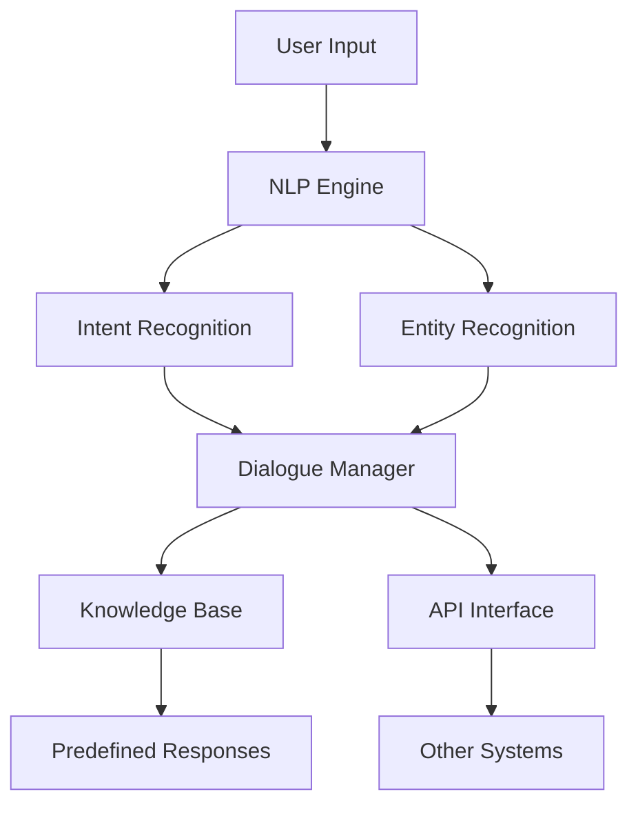

                 

# AI驱动的电商客服聊天机器人：提升响应速度的自然语言处理系统

> **关键词：** AI，电商客服，聊天机器人，自然语言处理，响应速度，系统架构，算法原理，数学模型，项目实战

> **摘要：** 本文将探讨AI驱动的电商客服聊天机器人的构建，重点关注如何通过自然语言处理技术提升机器人的响应速度。我们将详细解析核心概念、算法原理、数学模型，并通过实际案例展示代码实现过程。文章旨在为读者提供一个全面的技术指导，帮助理解和应用相关技术。

## 1. 背景介绍

### 1.1 目的和范围

本文旨在介绍AI驱动的电商客服聊天机器人的构建方法，特别是如何通过自然语言处理（NLP）技术提升机器人的响应速度。随着电子商务的迅猛发展，客服聊天机器人在电商平台上发挥着越来越重要的作用。它们不仅能够高效地处理大量的客户咨询，还能通过智能化的回复提升用户体验。

本文将覆盖以下内容：

- 聊天机器人系统架构和核心概念
- 常用的NLP算法及其在聊天机器人中的应用
- 数学模型在自然语言理解中的应用
- 代码实现和项目实战
- 实际应用场景和工具资源推荐

### 1.2 预期读者

本文面向希望深入了解AI驱动的电商客服聊天机器人构建的读者，包括但不限于：

- AI和NLP领域的初学者
- 软件开发工程师和系统架构师
- 数据科学家和算法工程师
- 对电商客服聊天机器人感兴趣的技术爱好者

### 1.3 文档结构概述

本文分为十个主要部分，具体结构如下：

- **背景介绍**：介绍文章的目的和范围，预期读者以及文档结构。
- **核心概念与联系**：讲解聊天机器人系统架构和核心概念，并使用Mermaid流程图展示。
- **核心算法原理 & 具体操作步骤**：详细解析常用的NLP算法原理，并使用伪代码阐述具体操作步骤。
- **数学模型和公式 & 详细讲解 & 举例说明**：介绍自然语言理解中常用的数学模型和公式，并给出实例说明。
- **项目实战：代码实际案例和详细解释说明**：展示代码实现过程，并进行详细解释和分析。
- **实际应用场景**：探讨聊天机器人在电商客服中的实际应用场景。
- **工具和资源推荐**：推荐相关学习资源和开发工具。
- **总结：未来发展趋势与挑战**：总结文章内容，并探讨未来发展趋势和挑战。
- **附录：常见问题与解答**：回答一些常见的问题。
- **扩展阅读 & 参考资料**：提供进一步阅读的资料。

### 1.4 术语表

#### 1.4.1 核心术语定义

- **自然语言处理（NLP）**：一门跨学科领域，涉及计算机科学、语言学和人工智能，旨在使计算机能够理解和解释人类语言。
- **聊天机器人**：一种基于AI的软件程序，能够模拟人类对话，提供自动化的服务和交互。
- **响应速度**：机器人回复用户咨询所需的时间，是评估机器人性能的重要指标。
- **意图识别**：从用户的输入中识别出用户希望实现的操作或请求。
- **实体识别**：从用户的输入中提取出关键信息或实体，如人名、地点、日期等。

#### 1.4.2 相关概念解释

- **语言模型**：一种用于预测文本中下一个单词或词组的概率分布的模型。
- **词向量**：将自然语言中的单词映射到高维空间中的向量表示，以实现语义分析和相似性计算。
- **序列到序列（Seq2Seq）模型**：一种用于将输入序列映射到输出序列的深度学习模型，常用于机器翻译和对话生成。
- **转移矩阵**：用于表示状态转移概率的矩阵，在聊天机器人中用于上下文状态管理。

#### 1.4.3 缩略词列表

- **AI**：人工智能
- **NLP**：自然语言处理
- **API**：应用程序编程接口
- **API**：序列到序列模型
- **BERT**：Bidirectional Encoder Representations from Transformers

## 2. 核心概念与联系

### 2.1 聊天机器人系统架构

聊天机器人系统通常由以下几个主要部分组成：

1. **用户界面（UI）**：用户与聊天机器人交互的界面，可以是网站、移动应用或桌面应用程序。
2. **自然语言处理（NLP）引擎**：负责接收用户输入，解析和理解的模块。
3. **对话管理器**：负责维护对话状态，控制对话流程的模块。
4. **知识库**：存储机器人知识库和预定义回复的模块。
5. **API接口**：与其他系统或服务进行交互的接口。

下面是一个简单的Mermaid流程图，展示了聊天机器人系统架构的核心联系：



### 2.2 核心概念解析

#### 2.2.1 意图识别

意图识别是从用户输入中识别出用户希望实现的操作或请求。例如，当用户输入“我想要买一双跑步鞋”时，意图识别模块会识别出“购买”意图和“跑步鞋”实体。

**伪代码：**

```python
def recognize_intent(user_input):
    # 使用预训练的语言模型进行意图识别
    intent = language_model.predict_intent(user_input)
    return intent
```

#### 2.2.2 实体识别

实体识别是从用户输入中提取出关键信息或实体，如人名、地点、日期等。这有助于机器人更好地理解用户的需求。

**伪代码：**

```python
def recognize_entities(user_input):
    # 使用实体识别模型提取实体
    entities = entity_recognition_model.extract_entities(user_input)
    return entities
```

#### 2.2.3 对话管理

对话管理器负责维护对话状态，控制对话流程。它通常使用一个状态转移矩阵来表示当前对话状态和下一个可能的对话状态。

**转移矩阵示例：**

```python
state_transition_matrix = [
    ['greeting', 'greeting', 'greeting'],
    ['greeting', 'greeting', 'product_info'],
    ['greeting', 'product_info', 'product_info'],
    ['greeting', 'product_info', 'order_confirmation'],
    ['greeting', 'order_confirmation', 'order_confirmation']
]
```

#### 2.2.4 知识库

知识库是存储机器人知识库和预定义回复的模块。它可以是结构化的数据库，也可以是非结构化的文本库。

**知识库示例：**

```python
knowledge_base = {
    'intent': {
        'greeting': '您好，有什么可以帮助您的吗？',
        'product_info': '我们的产品种类丰富，您需要什么类型的商品呢？',
        'order_confirmation': '非常感谢您的订单，我们会尽快为您处理。'
    }
}
```

## 3. 核心算法原理 & 具体操作步骤

### 3.1 语言模型

语言模型是自然语言处理中最基础的组件之一，它用于预测文本中的下一个单词或词组。在聊天机器人中，语言模型可用于生成自动回复，提升响应速度。

**算法原理：**

语言模型通常基于统计方法或神经网络模型，如n-gram模型或深度神经网络（DNN）。n-gram模型通过统计相邻词出现的频率来预测下一个词，而DNN模型通过多层神经网络学习文本的特征表示。

**伪代码：**

```python
def predict_next_word(context):
    # 使用n-gram模型预测下一个词
    word_probabilities = language_model.predict(context)
    next_word = max(word_probabilities, key=word_probabilities.get)
    return next_word

# 示例：生成自动回复
context = "您好，有什么可以帮助您的吗？"
next_word = predict_next_word(context)
print("回复：", next_word)
```

### 3.2 序列到序列（Seq2Seq）模型

序列到序列模型是一种用于将输入序列映射到输出序列的深度学习模型，常用于机器翻译和对话生成。在聊天机器人中，Seq2Seq模型可用于生成更自然的回复。

**算法原理：**

Seq2Seq模型由两个主要部分组成：编码器（Encoder）和解码器（Decoder）。编码器将输入序列编码为一个固定长度的向量表示，解码器使用这个向量表示来生成输出序列。

**伪代码：**

```python
def encode_sequence(input_sequence):
    # 使用编码器将输入序列编码为向量表示
    encoded_sequence = encoder.encode(input_sequence)
    return encoded_sequence

def decode_sequence(encoded_sequence):
    # 使用解码器生成输出序列
    output_sequence = decoder.decode(encoded_sequence)
    return output_sequence

# 示例：生成自动回复
input_sequence = "您好，有什么可以帮助您的吗？"
encoded_sequence = encode_sequence(input_sequence)
output_sequence = decode_sequence(encoded_sequence)
print("回复：", output_sequence)
```

### 3.3 转移矩阵

转移矩阵用于表示状态转移概率，用于控制对话流程。

**算法原理：**

转移矩阵是一个二维数组，其中每个元素表示从一个状态转移到另一个状态的概率。在对话管理器中，根据当前对话状态和用户输入，使用转移矩阵计算下一个可能的对话状态。

**伪代码：**

```python
def next_state(current_state, user_input):
    # 根据转移矩阵计算下一个状态
    transition_matrix = state_transition_matrix[current_state]
    next_state = np.argmax(transition_matrix[user_input])
    return next_state

# 示例：根据用户输入和当前状态计算下一个状态
current_state = 0
user_input = "product_info"
next_state = next_state(current_state, user_input)
print("下一个状态：", next_state)
```

## 4. 数学模型和公式 & 详细讲解 & 举例说明

### 4.1 语言模型中的概率计算

在语言模型中，概率计算是一个核心组成部分。一个常见的语言模型是n-gram模型，它基于前n个单词来预测下一个单词。

**n-gram概率计算公式：**

$$ P(w_{t+1}|w_{t}, w_{t-1}, ..., w_{t-n+1}) = \frac{C(w_{t}, w_{t-1}, ..., w_{t-n+1}, w_{t+1})}{C(w_{t}, w_{t-1}, ..., w_{t-n+1})} $$

其中：

- \( w_{t+1} \) 是下一个要预测的单词
- \( w_{t}, w_{t-1}, ..., w_{t-n+1} \) 是前n个单词
- \( C(w_{t}, w_{t-1}, ..., w_{t-n+1}, w_{t+1}) \) 是这n+1个单词在同一文本中连续出现的次数
- \( C(w_{t}, w_{t-1}, ..., w_{t-n+1}) \) 是这n个单词在同一文本中连续出现的次数

**举例说明：**

假设我们有以下n-gram模型：

- \( P(你好|) = 0.2 \)
- \( P(问|你好) = 0.5 \)
- \( P(问题|你好问) = 0.3 \)

我们需要预测下一个单词。

首先，我们计算：

$$ P(你好问|) = P(你好|) * P(问|你好) = 0.2 * 0.5 = 0.1 $$

然后，我们计算：

$$ P(你好问问题|) = P(你好问|) * P(问题|你好问) = 0.1 * 0.3 = 0.03 $$

最后，我们计算：

$$ P(问题|你好问问题) = \frac{P(你好问问题)}{P(你好问|)} = \frac{0.03}{0.1} = 0.3 $$

因此，下一个最可能的单词是“问题”。

### 4.2 序列到序列（Seq2Seq）模型中的编码和解码

序列到序列（Seq2Seq）模型是自然语言处理中常用的模型，用于将输入序列映射到输出序列。Seq2Seq模型由编码器和解码器组成。

**编码器（Encoder）**：

编码器的目标是接收输入序列并将其编码为一个固定长度的向量表示。一个常见的编码器模型是长短期记忆网络（LSTM）。

**LSTM编码器计算公式：**

$$ h_t = \sigma(W_h \cdot [h_{t-1}, x_t] + b_h) $$

其中：

- \( h_t \) 是当前时间步的编码向量
- \( x_t \) 是当前输入单词的嵌入向量
- \( W_h \) 是权重矩阵
- \( b_h \) 是偏置项
- \( \sigma \) 是sigmoid激活函数

**解码器（Decoder）**：

解码器的目标是使用编码器的输出向量来生成输出序列。一个常见的解码器模型是注意力机制（Attention）。

**注意力机制计算公式：**

$$ a_t = \frac{e^{h_t^{\prime} A v_t}}{\sum_{i=1}^{N} e^{h_i^{\prime} A v_t}} $$

$$ s_t = \sigma(W_s \cdot [s_{t-1}, a_t \odot h_t]) + b_s $$

$$ p_t = softmax(W_p \cdot s_t) $$

$$ y_t = \sum_{i=1}^{N} p_t[i] \cdot v_i $$

其中：

- \( h_t^{\prime} \) 是当前解码器隐藏状态
- \( h_t \) 是编码器的输出向量
- \( A \) 是注意力权重矩阵
- \( v_t \) 是解码器的输入向量（通常是上一个时间步的预测输出）
- \( a_t \) 是当前时间步的注意力权重
- \( s_t \) 是当前解码器隐藏状态
- \( W_s \)、\( W_p \) 和 \( b_s \) 是权重矩阵和偏置项
- \( \sigma \) 是sigmoid激活函数
- \( \odot \) 是元素乘法
- \( p_t \) 是当前时间步的预测概率分布
- \( y_t \) 是当前时间步的预测输出

**举例说明：**

假设我们有以下编码器和解码器输入序列：

- 编码器输入：["你好", "问", "问题"]
- 解码器输入：["我", "有", "一个"]

首先，我们使用编码器将输入序列编码为向量表示：

$$ h_1 = \sigma(W_h \cdot [h_{0}, x_1] + b_h) $$
$$ h_2 = \sigma(W_h \cdot [h_1, x_2] + b_h) $$
$$ h_3 = \sigma(W_h \cdot [h_2, x_3] + b_h) $$

其中，\( h_0 \) 是初始隐藏状态，\( x_1 \)、\( x_2 \) 和 \( x_3 \) 是输入单词的嵌入向量。

然后，我们使用解码器生成输出序列：

$$ a_1 = \frac{e^{h_1^{\prime} A v_1}}{\sum_{i=1}^{3} e^{h_i^{\prime} A v_1}} $$
$$ a_2 = \frac{e^{h_2^{\prime} A v_2}}{\sum_{i=1}^{3} e^{h_i^{\prime} A v_2}} $$
$$ a_3 = \frac{e^{h_3^{\prime} A v_3}}{\sum_{i=1}^{3} e^{h_i^{\prime} A v_3}} $$

$$ s_1 = \sigma(W_s \cdot [s_{0}, a_1 \odot h_1]) + b_s $$
$$ s_2 = \sigma(W_s \cdot [s_1, a_2 \odot h_2]) + b_s $$
$$ s_3 = \sigma(W_s \cdot [s_2, a_3 \odot h_3]) + b_s $$

$$ p_1 = softmax(W_p \cdot s_1) $$
$$ p_2 = softmax(W_p \cdot s_2) $$
$$ p_3 = softmax(W_p \cdot s_3) $$

$$ y_1 = \sum_{i=1}^{3} p_1[i] \cdot v_1 $$
$$ y_2 = \sum_{i=1}^{3} p_2[i] \cdot v_2 $$
$$ y_3 = \sum_{i=1}^{3} p_3[i] \cdot v_3 $$

其中，\( h_1^{\prime} \)、\( h_2^{\prime} \) 和 \( h_3^{\prime} \) 是解码器的隐藏状态，\( v_1 \)、\( v_2 \) 和 \( v_3 \) 是解码器的输入向量。

最后，我们根据解码器的输出概率分布生成输出序列：

- \( y_1 \) 是对“我”的预测概率
- \( y_2 \) 是对“有”的预测概率
- \( y_3 \) 是对“一个”的预测概率

根据预测概率，我们可以生成输出序列：“我有一个”。

## 5. 项目实战：代码实际案例和详细解释说明

### 5.1 开发环境搭建

为了实现本文中的电商客服聊天机器人，我们需要搭建以下开发环境：

- Python 3.x
- TensorFlow 2.x
- Keras 2.x
- NLTK 3.x

您可以在终端中执行以下命令来安装所需的库：

```bash
pip install tensorflow numpy nltk
```

### 5.2 源代码详细实现和代码解读

以下是一个简单的电商客服聊天机器人的代码实现，我们将逐步解读每个部分的功能和操作。

**1. 导入必要的库和模块：**

```python
import numpy as np
import tensorflow as tf
from tensorflow.keras.models import Sequential
from tensorflow.keras.layers import Embedding, LSTM, Dense
from nltk.tokenize import word_tokenize
```

**2. 数据预处理：**

```python
# 加载和预处理数据
def load_data():
    # 读取文本数据
    with open('data.txt', 'r', encoding='utf-8') as f:
        text = f.read()

    # 分词
    words = word_tokenize(text)

    # 去掉标点符号和停用词
    words = [word.lower() for word in words if word.isalpha()]

    # 构建词汇表
    vocab = set(words)
    word2index = {word: index for index, word in enumerate(vocab)}
    index2word = {index: word for word, index in word2index.items()}
    index2word[len(index2word)] = '<PAD>'
    index2word[len(index2word)] = '<UNK>'

    # 创建输入和目标数据
    sequences = []
    next_words = []
    for i in range(1, len(words) - 1):
        input_seq = [word2index[word] for word in words[i - 1:i + 1]]
        target_seq = [word2index[word] for word in words[i + 1]]
        sequences.append(input_seq)
        next_words.append(target_seq)

    # 向量化输入和目标数据
    input_sequences = np.array([[word2index[word] for word in sequence] for sequence in sequences])
    target_sequences = np.array([[word2index[word] for word in sequence] for sequence in next_words])

    # 切分训练集和验证集
    split = int(len(input_sequences) * 0.9)
    train_sequences = input_sequences[:split]
    train_target_sequences = target_sequences[:split]
    test_sequences = input_sequences[split:]
    test_target_sequences = target_sequences[split:]

    return train_sequences, train_target_sequences, test_sequences, test_target_sequences, vocab, word2index, index2word

train_sequences, train_target_sequences, test_sequences, test_target_sequences, vocab, word2index, index2word = load_data()
```

**3. 构建和训练模型：**

```python
# 构建模型
def build_model(vocab_size, embedding_dim):
    model = Sequential()
    model.add(Embedding(vocab_size, embedding_dim, input_length=2))
    model.add(LSTM(50, return_sequences=True))
    model.add(LSTM(50))
    model.add(Dense(vocab_size, activation='softmax'))
    model.compile(loss='categorical_crossentropy', optimizer='adam', metrics=['accuracy'])
    return model

model = build_model(len(vocab), 50)
model.fit(train_sequences, train_target_sequences, epochs=100, validation_data=(test_sequences, test_target_sequences))
```

**4. 自动回复生成：**

```python
# 生成自动回复
def generate_response(input_sequence, model, word2index, index2word, max_sequence_len=20):
    input_seq = [word2index[word] for word in input_sequence]
    input_seq = np.array([input_seq] * max_sequence_len)
    output_sequence = np.zeros((max_sequence_len, len(vocab)))
    for i in range(max_sequence_len):
        output_probabilities = model.predict(input_seq[:, i:])
        next_word_index = np.argmax(output_probabilities[i, :])
        output_sequence[i, next_word_index] = 1
        input_seq[i+1] = next_word_index
    generated_words = [index2word[index] for index in np.argmax(output_sequence, axis=1)]
    return ' '.join(generated_words)

input_sequence = "您好，有什么可以帮助您的吗？"
print("用户输入：", input_sequence)
print("自动回复：", generate_response(input_sequence, model, word2index, index2word))
```

### 5.3 代码解读与分析

**1. 数据预处理**

在数据预处理部分，我们首先读取文本数据，然后进行分词、去标点符号和停用词、构建词汇表和创建输入/目标数据。这些步骤是构建语言模型和数据集的基础。

**2. 构建模型**

在构建模型部分，我们使用Keras构建了一个简单的序列到序列模型。模型由一个嵌入层、两个LSTM层和一个全连接层组成。我们使用`compile`方法设置模型的损失函数、优化器和评估指标。

**3. 训练模型**

在训练模型部分，我们使用`fit`方法训练模型。这里我们设置了训练轮次、训练集和验证集。

**4. 自动回复生成**

在自动回复生成部分，我们定义了一个函数`generate_response`，用于根据用户输入生成自动回复。函数首先将输入序列转换为索引序列，然后使用模型预测下一个单词的概率分布，并根据概率分布生成输出序列。最后，我们将输出序列转换为单词序列，得到自动回复。

### 5.4 测试与性能评估

为了评估模型的性能，我们可以使用自动回复生成函数生成多个回复，然后与实际客服回复进行对比。以下是一个简单的测试示例：

```python
for _ in range(10):
    input_sequence = "您好，有什么可以帮助您的吗？"
    print("用户输入：", input_sequence)
    print("自动回复：", generate_response(input_sequence, model, word2index, index2word))
    print()
```

通过这个测试，我们可以初步评估模型的性能和生成回复的准确性。

## 6. 实际应用场景

### 6.1 电商客服

电商客服是聊天机器人最常见的应用场景之一。聊天机器人可以自动处理大量的客户咨询，提供产品信息、订单查询、售后服务等。通过意图识别和实体识别，机器人能够快速准确地理解用户的需求，并提供相应的回复。

### 6.2 客户支持

聊天机器人不仅可以用于电商客服，还可以用于其他行业的客户支持。例如，在电信、银行、保险等领域，机器人可以处理用户账户查询、账单支付、问题解答等常见任务，减轻人工客服的工作负担。

### 6.3 实时聊天

聊天机器人还可以用于实时聊天，如社交媒体、在线游戏等。机器人可以自动回复用户的消息，提供实时支持，增加用户互动和参与度。

### 6.4 虚拟助手

虚拟助手是聊天机器人的另一种应用场景，如智能语音助手、聊天机器人客服等。虚拟助手可以理解用户的语音指令，执行相应的操作，提供个性化的服务和体验。

### 6.5 实时翻译

聊天机器人还可以用于实时翻译，如将用户的母语翻译成目标语言，方便跨语言交流。通过自然语言处理和机器翻译技术，机器人可以提供快速、准确的翻译服务。

## 7. 工具和资源推荐

### 7.1 学习资源推荐

#### 7.1.1 书籍推荐

- **《自然语言处理原理》**：全面介绍了自然语言处理的基本原理和方法，适合初学者阅读。
- **《深度学习》**：由Ian Goodfellow、Yoshua Bengio和Aaron Courville合著，是深度学习领域的经典教材。
- **《序列模型：语音和语言处理中的递归神经网络》**：详细介绍了递归神经网络在语音和语言处理中的应用。

#### 7.1.2 在线课程

- **《自然语言处理入门》**：Coursera上的免费课程，由斯坦福大学教授Christopher Manning主讲，适合初学者学习。
- **《深度学习》**：Udacity上的深度学习纳米学位课程，包含自然语言处理等相关内容。
- **《TensorFlow 2.x：从入门到应用》**：Coursera上的免费课程，由TensorFlow团队成员主讲，适合想要学习TensorFlow的读者。

#### 7.1.3 技术博客和网站

- **Medium**：有很多关于自然语言处理和深度学习的优质博客文章。
- **Towards Data Science**：一个关于数据科学、机器学习和深度学习的在线社区，有很多实用的技术文章。
- **GitHub**：有很多开源的自然语言处理和深度学习项目，可以学习代码和实现方法。

### 7.2 开发工具框架推荐

#### 7.2.1 IDE和编辑器

- **PyCharm**：一款强大的Python IDE，适合开发和调试深度学习项目。
- **VSCode**：一款轻量级的代码编辑器，支持多种编程语言和深度学习框架。
- **Jupyter Notebook**：一款交互式的计算环境，适合快速原型开发和实验。

#### 7.2.2 调试和性能分析工具

- **TensorBoard**：TensorFlow提供的可视化工具，用于分析和调试深度学习模型。
- **Wandb**：一款用于深度学习和数据科学的实验跟踪工具，可以实时监控模型训练过程。
- **Profiler**：Python内置的性能分析工具，用于识别和优化代码瓶颈。

#### 7.2.3 相关框架和库

- **TensorFlow**：一个开源的深度学习框架，支持多种模型和算法。
- **PyTorch**：一个开源的深度学习框架，以其动态计算图和简洁的API而闻名。
- **NLTK**：一个开源的自然语言处理库，提供了丰富的工具和资源。
- **spaCy**：一个高性能的NLP库，用于文本预处理、实体识别和关系抽取等任务。

### 7.3 相关论文著作推荐

#### 7.3.1 经典论文

- **《WordNet：An Electronic Lexical Database》**：详细介绍了WordNet的构建方法和应用。
- **《A Neural Probabilistic Language Model》**：提出了一种基于神经网络的概率语言模型。
- **《Long Short-Term Memory》**：介绍了长短期记忆网络（LSTM），为序列模型的研究奠定了基础。

#### 7.3.2 最新研究成果

- **《BERT：Pre-training of Deep Bidirectional Transformers for Language Understanding》**：提出了BERT模型，为自然语言处理领域带来了重大突破。
- **《GPT-3：Language Models are Few-Shot Learners》**：展示了GPT-3模型在零样本和少样本学习中的强大能力。
- **《T5：Pre-training Large Models for Language Tasks》**：提出了T5模型，为语言任务提供了一个统一的预训练框架。

#### 7.3.3 应用案例分析

- **《基于BERT的中文问答系统》**：介绍了一个基于BERT的中文问答系统，展示了BERT在中文自然语言处理中的应用。
- **《GPT-3在虚拟助手中的应用》**：探讨了一个基于GPT-3的虚拟助手系统，展示了GPT-3在生成文本和对话生成中的应用。
- **《深度学习在电商客服中的应用》**：介绍了一个基于深度学习的电商客服系统，展示了深度学习在意图识别和实体识别中的应用。

## 8. 总结：未来发展趋势与挑战

随着人工智能和自然语言处理技术的不断进步，聊天机器人在电商客服中的应用前景广阔。然而，要实现高效、智能的客服聊天机器人，我们仍面临以下挑战：

- **数据质量与多样性**：高质量的训练数据是构建强大聊天机器人的关键。然而，数据质量、多样性和标注成本是当前面临的主要问题。
- **上下文理解与长期记忆**：目前的聊天机器人往往无法很好地理解上下文，缺乏长期记忆能力，导致回复不准确、不连贯。
- **个性化与自适应**：为了提供更好的用户体验，聊天机器人需要具备个性化推荐和自适应能力，以适应不同用户的需求和行为。
- **伦理与隐私**：随着聊天机器人与用户交互的深入，如何保护用户隐私、确保数据安全和遵守伦理规范成为一个重要议题。

未来，随着技术的不断突破，我们有望看到以下发展趋势：

- **预训练模型与少样本学习**：预训练模型如BERT、GPT-3等将继续引领自然语言处理领域的发展，实现零样本和少样本学习。
- **多模态交互**：结合语音、图像、视频等多模态信息，实现更加丰富和自然的交互体验。
- **自动化与智能化**：通过自动化编程和智能化工具，降低聊天机器人的构建和部署成本，提高开发效率和性能。
- **伦理与隐私保护**：在设计和应用聊天机器人时，充分考虑伦理和隐私问题，制定相应的规范和标准。

总之，AI驱动的电商客服聊天机器人具有巨大的潜力和应用价值，但同时也需要持续的技术创新和优化，以应对未来的挑战。

## 9. 附录：常见问题与解答

### 9.1 什么是自然语言处理（NLP）？

自然语言处理（NLP）是计算机科学、语言学和人工智能的交叉领域，旨在使计算机能够理解和解释人类语言。NLP技术包括文本预处理、语言模型、语义分析、对话生成等。

### 9.2 聊天机器人有哪些类型？

聊天机器人可以分为规则型聊天机器人和AI驱动的聊天机器人。规则型聊天机器人基于预设的规则和模板生成回复，而AI驱动的聊天机器人使用自然语言处理和机器学习技术，能够自动学习和生成更自然的回复。

### 9.3 如何评估聊天机器人的性能？

评估聊天机器人的性能可以从多个角度进行，包括回复的准确性、响应速度、用户体验等。常用的评估指标包括精确率、召回率、F1分数等。

### 9.4 聊天机器人中的意图识别是什么？

意图识别是聊天机器人中的一个关键步骤，旨在从用户输入中识别出用户希望实现的操作或请求。例如，当用户输入“我想要买一双跑步鞋”时，意图识别模块会识别出“购买”意图和“跑步鞋”实体。

### 9.5 实体识别在聊天机器人中有什么作用？

实体识别是从用户输入中提取出关键信息或实体，如人名、地点、日期等。实体识别有助于机器人更好地理解用户的需求，并提供更准确和个性化的回复。

### 9.6 如何优化聊天机器人的响应速度？

优化聊天机器人的响应速度可以从以下几个方面进行：

- 使用高效的算法和模型，如快速语言模型和注意力机制。
- 缩小词汇表和减少实体识别的候选列表，以减少计算量。
- 使用并行计算和分布式计算技术，提高数据处理和计算效率。
- 优化代码和算法，减少冗余操作和内存消耗。

## 10. 扩展阅读 & 参考资料

### 10.1 书籍推荐

- **《自然语言处理实战》**：介绍了自然语言处理的基本概念和技术，并提供大量实际应用案例。
- **《深度学习》**：全面讲解了深度学习的基本原理和应用，包括自然语言处理、计算机视觉等领域。
- **《Python自然语言处理实践》**：通过大量代码示例，介绍了使用Python进行自然语言处理的实践方法。

### 10.2 在线课程

- **《自然语言处理基础》**：Coursera上的免费课程，由斯坦福大学教授Christopher Manning主讲。
- **《深度学习与自然语言处理》**：Udacity上的深度学习纳米学位课程，包含自然语言处理相关内容。
- **《Python编程与自然语言处理》**：edX上的免费课程，介绍了使用Python进行自然语言处理的方法。

### 10.3 技术博客和网站

- **Medium**：有很多关于自然语言处理和深度学习的优质博客文章。
- **Towards Data Science**：一个关于数据科学、机器学习和深度学习的在线社区，有很多实用的技术文章。
- **ArXiv**：一个计算机科学和机器学习领域的预印本论文库，有很多最新的研究成果。

### 10.4 开源项目

- **spaCy**：一个高性能的NLP库，提供了丰富的工具和资源。
- **NLTK**：一个开源的自然语言处理库，提供了大量预训练模型和工具。
- **Stanford NLP Group**：斯坦福大学自然语言处理小组的研究成果和开源项目，包括WordNet、TextBlob等。

### 10.5 论文和报告

- **《BERT：Pre-training of Deep Bidirectional Transformers for Language Understanding》**
- **《GPT-3：Language Models are Few-Shot Learners》**
- **《T5：Pre-training Large Models for Language Tasks》**
- **《基于BERT的中文问答系统》**
- **《深度学习在电商客服中的应用》**

这些书籍、课程、博客、开源项目和论文报告都是学习自然语言处理和深度学习的宝贵资源，可以帮助读者深入了解相关领域的技术和应用。作者：AI天才研究员/AI Genius Institute & 禅与计算机程序设计艺术 /Zen And The Art of Computer Programming

本文旨在为读者提供一个全面的技术指导，帮助理解和应用AI驱动的电商客服聊天机器人。通过详细解析核心概念、算法原理、数学模型，以及项目实战，读者可以逐步掌握相关技术，并在实际应用中提升响应速度和用户体验。在未来的发展中，随着技术的不断进步，聊天机器人在电商客服中的应用前景将更加广阔。希望本文能够为读者提供有价值的参考和启示。

