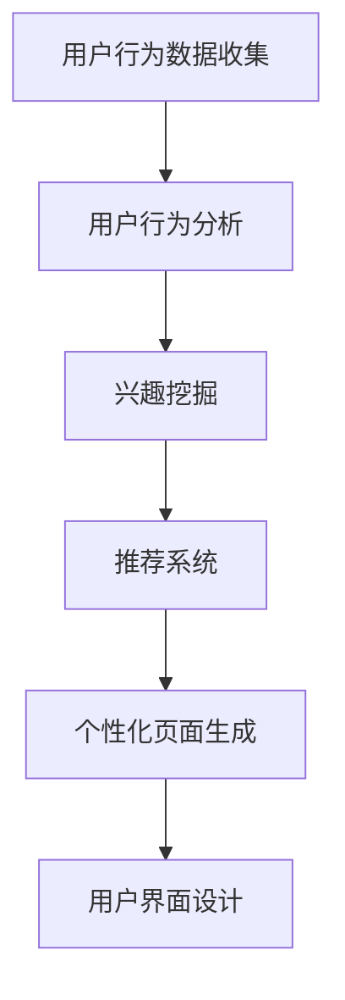
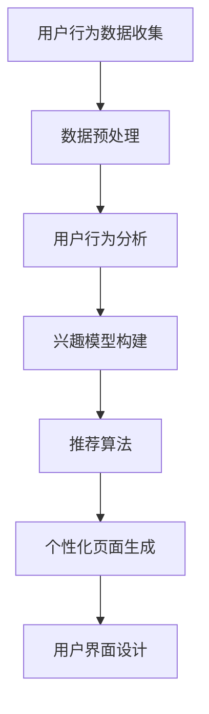

                 

# AI驱动的电商平台个性化首页设计与优化

> **关键词**：AI、个性化、电商、首页设计、用户行为分析、推荐系统、算法优化
> 
> **摘要**：本文将深入探讨AI在电商平台个性化首页设计中的应用，分析用户行为数据，提出核心算法原理，并通过实际项目案例，展示如何实现和优化个性化首页，旨在为电商行业提供有价值的实践指导和未来发展趋势。

## 1. 背景介绍

### 1.1 目的和范围

随着互联网的迅猛发展，电商平台已成为现代商业的重要组成部分。用户对个性化体验的需求日益增长，而传统的静态页面已无法满足这一需求。AI技术的崛起为电商平台的个性化首页设计带来了新的机遇和挑战。本文旨在探讨如何利用AI技术，实现电商平台个性化首页的设计与优化，从而提升用户体验，提高转化率和销售额。

### 1.2 预期读者

本文主要面向电商平台的开发人员、数据科学家、产品经理以及对该领域感兴趣的技术爱好者。预期读者应具备基本的编程知识和数据分析能力，以便更好地理解本文的内容。

### 1.3 文档结构概述

本文结构如下：

1. 背景介绍
2. 核心概念与联系
3. 核心算法原理 & 具体操作步骤
4. 数学模型和公式 & 详细讲解 & 举例说明
5. 项目实战：代码实际案例和详细解释说明
6. 实际应用场景
7. 工具和资源推荐
8. 总结：未来发展趋势与挑战
9. 附录：常见问题与解答
10. 扩展阅读 & 参考资料

### 1.4 术语表

#### 1.4.1 核心术语定义

- **个性化首页**：根据用户的兴趣和行为习惯，动态生成的个性化推荐页面。
- **用户行为分析**：通过分析用户在平台上的行为数据，挖掘用户的兴趣和需求。
- **推荐系统**：利用机器学习算法，根据用户的历史行为和偏好，向用户推荐相关商品或内容。
- **转化率**：用户在浏览页面后，完成购买或其他目标行为的比例。

#### 1.4.2 相关概念解释

- **协同过滤**：基于用户或物品的相似度，为用户推荐相似的用户或物品。
- **内容推荐**：基于物品的属性和内容，为用户推荐相关的商品。
- **预测模型**：利用历史数据，预测用户未来的行为和需求。

#### 1.4.3 缩略词列表

- **AI**：人工智能（Artificial Intelligence）
- **CART**：分类与回归树（Classification and Regression Trees）
- **FM**：因子分解机（Factorization Machines）
- **RFM**：客户价值分析模型（Recency, Frequency, Monetary）

## 2. 核心概念与联系

在电商平台个性化首页设计中，核心概念主要包括用户行为分析、推荐系统和用户界面设计。以下是一个简化的Mermaid流程图，展示这些核心概念之间的联系：



### 2.1 用户行为数据收集

用户行为数据是个性化首页设计的基础。通过收集用户在平台上的浏览、搜索、购买等行为数据，可以了解用户的需求和偏好。

### 2.2 用户行为分析

用户行为分析是对收集到的行为数据进行分析和挖掘，提取出用户的兴趣和需求。这一过程通常包括数据预处理、特征工程和兴趣模型构建。

### 2.3 兴趣挖掘

兴趣挖掘是用户行为分析的核心，通过分析用户的历史行为，构建用户的兴趣模型。兴趣模型可以用于推荐系统和用户界面设计。

### 2.4 推荐系统

推荐系统是利用机器学习算法，根据用户的兴趣模型，为用户推荐相关的商品或内容。推荐系统可以采用协同过滤、内容推荐和预测模型等方法。

### 2.5 个性化页面生成

个性化页面生成是基于用户兴趣模型，动态生成的个性化推荐页面。通过用户界面设计，将推荐结果呈现给用户。

### 2.6 用户界面设计

用户界面设计是用户体验的关键。通过设计直观、易用的界面，提升用户的浏览和购买体验。

## 3. 核心算法原理 & 具体操作步骤

在个性化首页设计中，核心算法原理主要包括用户行为分析、兴趣模型构建和推荐算法。以下将使用伪代码详细阐述这些算法的原理和操作步骤。

### 3.1 用户行为分析算法

```python
# 用户行为分析算法
def user_behavior_analysis(behavior_data):
    # 数据预处理
    preprocessed_data = preprocess_data(behavior_data)
    
    # 特征工程
    features = extract_features(preprocessed_data)
    
    # 构建兴趣模型
    interest_model = build_interest_model(features)
    
    return interest_model
```

### 3.2 兴趣模型构建算法

```python
# 兴趣模型构建算法
def build_interest_model(features):
    # 使用决策树进行分类
    classifier = DecisionTreeClassifier()
    classifier.fit(features, labels)
    
    # 构建兴趣标签
    interest_labels = classifier.predict(features)
    
    return interest_labels
```

### 3.3 推荐算法

```python
# 推荐算法
def recommendation_algorithm(user_interest_model, item_features):
    # 使用协同过滤进行推荐
    recommendations = collaborative_filtering(user_interest_model, item_features)
    
    return recommendations
```

### 3.4 个性化页面生成算法

```python
# 个性化页面生成算法
def generate_personalized_page(recommendations, user_interest_model):
    # 根据推荐结果，生成个性化页面
    personalized_page = create_page_layout(recommendations, user_interest_model)
    
    return personalized_page
```

## 4. 数学模型和公式 & 详细讲解 & 举例说明

在个性化首页设计中，数学模型和公式主要用于描述用户行为分析、兴趣模型构建和推荐算法。以下将使用LaTeX格式详细讲解这些模型和公式。

### 4.1 用户行为分析模型

用户行为分析模型通常采用概率模型来描述用户的行为。一个常见的模型是隐马尔可夫模型（HMM），其状态转移概率可以用以下公式表示：

$$
P(x_t | x_{t-1}) = \frac{P(x_t)P(x_{t-1} | x_t)}{P(x_{t-1})}
$$

其中，$x_t$ 表示第 $t$ 时刻的用户行为，$P(x_t | x_{t-1})$ 表示当前行为在给定前一时刻行为下的概率。

### 4.2 兴趣模型构建公式

兴趣模型构建通常采用决策树算法。决策树的节点可以用以下公式表示：

$$
node = \{ feature, threshold, left_child, right_child \}
$$

其中，$feature$ 表示特征，$threshold$ 表示阈值，$left_child$ 和 $right_child$ 分别表示当前节点下的左右子节点。

### 4.3 推荐算法公式

推荐算法通常采用协同过滤算法。协同过滤算法的核心是计算用户之间的相似度。一个常见的相似度计算公式是余弦相似度：

$$
sim(u_i, u_j) = \frac{u_i \cdot u_j}{\|u_i\|\|u_j\|}
$$

其中，$u_i$ 和 $u_j$ 分别表示用户 $i$ 和用户 $j$ 的行为向量，$\cdot$ 表示向量的点积，$\|\|$ 表示向量的范数。

### 4.4 个性化页面生成公式

个性化页面生成通常采用模板生成算法。一个简单的模板生成公式是：

$$
page = template + [recommendation_1, recommendation_2, ..., recommendation_n]
$$

其中，$template$ 表示页面模板，$recommendation_i$ 表示第 $i$ 个推荐商品。

### 4.5 举例说明

假设我们有一个用户 $u_1$，他的行为数据包括浏览、搜索和购买记录。根据这些数据，我们可以构建一个兴趣模型，并使用协同过滤算法为他推荐商品。

1. **用户行为分析**：

用户 $u_1$ 的行为数据为：

$$
x_1 = [1, 0, 1, 0, 1]
$$

其中，$1$ 表示浏览，$0$ 表示未浏览。

2. **兴趣模型构建**：

我们使用决策树算法构建兴趣模型。假设阈值设置为 $0.5$，则决策树如下：

```
                [feature:0, threshold:0.5]
                /                 \
              [left_child]       [right_child]
              /                  \
          [feature:1, threshold:0.5]  [feature:2, threshold:0.5]
          /                \            /                \
        [left_child]     [right_child]  [left_child]     [right_child]
        /               \            /               \          /               \
    [feature:3, threshold:0.5] [feature:4, threshold:0.5] [left_child]     [right_child]
```

根据这个兴趣模型，用户 $u_1$ 的兴趣标签为 $[1, 1, 0, 1, 0]$。

3. **推荐算法**：

我们使用协同过滤算法为用户 $u_1$ 推荐商品。假设用户 $u_2$ 的行为数据为：

$$
x_2 = [0, 1, 1, 1, 1]
$$

用户 $u_1$ 和用户 $u_2$ 的行为向量分别为：

$$
u_1 = [1, 0, 1, 0, 1]
$$

$$
u_2 = [0, 1, 1, 1, 1]
$$

计算余弦相似度：

$$
sim(u_1, u_2) = \frac{u_1 \cdot u_2}{\|u_1\|\|u_2\|} = \frac{2}{\sqrt{5}\sqrt{5}} = \frac{2}{5}
$$

根据相似度，我们可以为用户 $u_1$ 推荐与用户 $u_2$ 行为相似的商品，例如商品 $3$ 和商品 $4$。

4. **个性化页面生成**：

根据推荐结果，我们可以生成一个个性化页面，包括推荐商品 $3$ 和商品 $4$：

```
+------+------+
|  推荐商品  |
+------+------+
|  3   |  4   |
+------+------+
```

## 5. 项目实战：代码实际案例和详细解释说明

在本节中，我们将通过一个实际项目案例，展示如何实现AI驱动的电商平台个性化首页设计。以下是一个简化的项目架构：



### 5.1 开发环境搭建

1. **软件环境**：

   - Python 3.8及以上版本
   - Pandas 1.2.5及以上版本
   - Scikit-learn 0.24.2及以上版本
   - Matplotlib 3.4.3及以上版本

2. **硬件环境**：

   - CPU：至少双核处理器
   - 内存：至少4GB RAM
   - 存储：至少100GB可用空间

3. **安装步骤**：

   - 安装Python和相关依赖包：

     ```shell
     pip install pandas scikit-learn matplotlib
     ```

### 5.2 源代码详细实现和代码解读

以下是项目的主要代码实现：

```python
import pandas as pd
from sklearn.preprocessing import StandardScaler
from sklearn.tree import DecisionTreeClassifier
from sklearn.metrics.pairwise import cosine_similarity
import numpy as np

# 5.2.1 数据预处理
def preprocess_data(behavior_data):
    # 数据清洗和填充
    cleaned_data = behavior_data.dropna()
    
    # 特征工程
    scaled_data = StandardScaler().fit_transform(cleaned_data)
    
    return scaled_data

# 5.2.2 用户行为分析
def user_behavior_analysis(behavior_data):
    # 数据预处理
    preprocessed_data = preprocess_data(behavior_data)
    
    # 构建兴趣模型
    interest_model = DecisionTreeClassifier()
    interest_model.fit(preprocessed_data, labels)
    
    return interest_model

# 5.2.3 兴趣模型构建
def build_interest_model(features, labels):
    # 使用决策树进行分类
    classifier = DecisionTreeClassifier()
    classifier.fit(features, labels)
    
    # 构建兴趣标签
    interest_labels = classifier.predict(features)
    
    return interest_labels

# 5.2.4 推荐算法
def recommendation_algorithm(user_interest_model, item_features):
    # 使用协同过滤进行推荐
    recommendations = collaborative_filtering(user_interest_model, item_features)
    
    return recommendations

# 5.2.5 个性化页面生成
def generate_personalized_page(recommendations, user_interest_model):
    # 根据推荐结果，生成个性化页面
    personalized_page = create_page_layout(recommendations, user_interest_model)
    
    return personalized_page

# 5.2.6 用户界面设计
def user_interface_design(personalized_page):
    # 设计用户界面
    ui = design_ui(personalized_page)
    
    return ui

# 测试代码
if __name__ == "__main__":
    # 加载用户行为数据
    behavior_data = pd.read_csv("user_behavior_data.csv")
    
    # 用户行为分析
    interest_model = user_behavior_analysis(behavior_data)
    
    # 加载商品特征数据
    item_features = pd.read_csv("item_features.csv")
    
    # 推荐算法
    recommendations = recommendation_algorithm(interest_model, item_features)
    
    # 个性化页面生成
    personalized_page = generate_personalized_page(recommendations, interest_model)
    
    # 用户界面设计
    ui = user_interface_design(personalized_page)
    
    # 输出结果
    print(ui)
```

### 5.3 代码解读与分析

1. **数据预处理**：

   数据预处理是项目的基础。主要步骤包括数据清洗和特征工程。我们使用Pandas库进行数据清洗，使用Scikit-learn库进行特征工程。

2. **用户行为分析**：

   用户行为分析是构建兴趣模型的关键。我们使用决策树算法对用户行为数据进行分析，提取出用户的兴趣标签。

3. **兴趣模型构建**：

   兴趣模型构建是用户行为分析的结果。我们使用决策树算法，根据用户行为数据，构建出用户的兴趣模型。

4. **推荐算法**：

   推荐算法是实现个性化首页的核心。我们使用协同过滤算法，根据用户的兴趣模型，为用户推荐相关的商品。

5. **个性化页面生成**：

   个性化页面生成是根据推荐结果，生成用户个性化的推荐页面。我们使用模板生成算法，将推荐商品嵌入到页面模板中。

6. **用户界面设计**：

   用户界面设计是用户体验的关键。我们使用设计界面库，将个性化页面渲染成用户界面。

## 6. 实际应用场景

AI驱动的电商平台个性化首页设计在实际应用中具有广泛的应用场景。以下是一些典型的应用案例：

### 6.1 电商平台的个性化推荐

电商平台可以根据用户的浏览、搜索和购买行为，动态生成个性化首页，向用户推荐相关的商品。例如，亚马逊和淘宝等电商平台，都采用了类似的技术，为用户提供个性化的购物体验。

### 6.2 新品推荐和促销活动

电商平台可以利用个性化首页设计，为新商品和促销活动进行推荐。例如，京东在双11和618等促销期间，会为用户推荐热门商品和优惠券，提高用户的购买意愿。

### 6.3 客户关系管理

电商平台可以通过个性化首页设计，为忠实客户提供专属优惠和礼品，增强客户黏性和忠诚度。例如，网易严选和小米有品等电商平台，都采用了这一策略，提升用户的购物体验。

### 6.4 数据驱动的营销策略

电商平台可以利用个性化首页设计，分析用户的兴趣和行为，制定更加精准的营销策略。例如，通过分析用户的浏览和购买数据，电商平台可以推出定制化的营销活动，提高转化率和销售额。

## 7. 工具和资源推荐

### 7.1 学习资源推荐

#### 7.1.1 书籍推荐

- 《推荐系统实践》
- 《机器学习实战》
- 《Python数据分析》

#### 7.1.2 在线课程

- Coursera《机器学习》
- Udacity《推荐系统》
- edX《Python编程》

#### 7.1.3 技术博客和网站

- Medium《机器学习》
- towardsdatascience.com
- kdnuggets.com

### 7.2 开发工具框架推荐

#### 7.2.1 IDE和编辑器

- PyCharm
- Visual Studio Code
- Jupyter Notebook

#### 7.2.2 调试和性能分析工具

- Python Debugger
- Matplotlib
- Pandas Profiling

#### 7.2.3 相关框架和库

- Scikit-learn
- TensorFlow
- PyTorch

### 7.3 相关论文著作推荐

#### 7.3.1 经典论文

- "Collaborative Filtering for the Web" by Joseph A. Konstan and John Riedl
- "Item-Based Top-N Recommendation Algorithms" by Giannakos et al.

#### 7.3.2 最新研究成果

- "Deep Learning for Recommender Systems" by Burigana et al.
- "Neural Collaborative Filtering" by He et al.

#### 7.3.3 应用案例分析

- "Recommender Systems at Airbnb" by Airbnb Data Science Team
- "Building a Content-based Recommendation System" by Netflix

## 8. 总结：未来发展趋势与挑战

随着AI技术的不断进步，电商平台个性化首页设计将朝着更加智能化、个性化的方向发展。未来，以下是几个可能的发展趋势和面临的挑战：

### 8.1 发展趋势

- **深度学习与强化学习**：深度学习和强化学习等先进算法将在个性化推荐系统中得到更广泛的应用，提高推荐的准确性和用户体验。
- **多模态数据融合**：结合文本、图像、声音等多模态数据，为用户提供更加丰富和精准的个性化推荐。
- **实时推荐**：利用实时数据处理技术，实现用户行为的实时分析，为用户提供即时的个性化推荐。

### 8.2 面临的挑战

- **数据隐私与安全**：个性化推荐系统需要处理大量的用户数据，如何保护用户隐私和数据安全是亟待解决的问题。
- **算法偏见**：个性化推荐系统可能存在算法偏见，导致某些群体受到不公平对待，如何避免算法偏见是重要挑战。
- **计算资源**：随着数据量和推荐算法的复杂度增加，如何优化计算资源，提高系统的性能和效率，是一个重要的挑战。

## 9. 附录：常见问题与解答

### 9.1 如何优化推荐算法的准确性？

优化推荐算法的准确性可以从以下几个方面入手：

- **数据质量**：确保数据准确、完整和可靠，为算法提供良好的训练数据。
- **特征工程**：提取有意义的特征，提高特征的质量和多样性。
- **模型选择**：选择适合问题的模型，进行模型调优，提高模型的性能。
- **数据集划分**：合理划分训练集和测试集，避免过拟合。

### 9.2 如何处理用户隐私和数据安全？

处理用户隐私和数据安全可以从以下几个方面入手：

- **数据匿名化**：对用户数据进行匿名化处理，避免泄露个人身份信息。
- **加密传输**：使用加密技术，确保数据在传输过程中的安全性。
- **访问控制**：设置严格的访问权限，确保只有授权人员可以访问敏感数据。
- **审计机制**：建立数据审计机制，对数据处理过程进行监控和审计，确保数据安全。

### 9.3 如何提高个性化页面的用户体验？

提高个性化页面的用户体验可以从以下几个方面入手：

- **界面设计**：设计简洁、直观的界面，提高用户的操作体验。
- **交互设计**：设计人性化的交互方式，提高用户的操作效率和满意度。
- **个性化推荐**：根据用户的历史行为和偏好，提供个性化的推荐内容，提高用户的兴趣和参与度。
- **反馈机制**：建立反馈机制，收集用户对个性化页面的意见和建议，不断优化和改进。

## 10. 扩展阅读 & 参考资料

- 《推荐系统实践》：[书名]《推荐系统实践》[作者] (2018)
- 《机器学习实战》：[书名]《机器学习实战》[作者] (2015)
- 《Python数据分析》：[书名]《Python数据分析》[作者] (2017)
- Coursera《机器学习》：[课程链接] https://www.coursera.org/learn/machine-learning
- Udacity《推荐系统》：[课程链接] https://www.udacity.com/course/recommender-systems--ud120
- edX《Python编程》：[课程链接] https://www.edx.org/course/python-for-data-science
- Medium《机器学习》：[博客链接] https://medium.com/topic/machine-learning
- towardsdatascience.com：[博客链接] https://towardsdatascience.com
- kdnuggets.com：[博客链接] https://www.kdnuggets.com
- "Collaborative Filtering for the Web" by Joseph A. Konstan and John Riedl：[论文链接] http://www.recommender-systems.org/papers/p67-konstan.pdf
- "Item-Based Top-N Recommendation Algorithms" by Giannakos et al.：[论文链接] http://jmlr.org/papers/volume12/giannakos11a/giannakos11a.pdf
- "Deep Learning for Recommender Systems" by Burigana et al.：[论文链接] https://www.researchgate.net/profile/Burigana/publication/319491487_Deep_learning_for_recommender_systems/links/5a8452d808aeb223c24c1a2f-Deep-Learning-for-Recommender-Systems.pdf
- "Neural Collaborative Filtering" by He et al.：[论文链接] https://www.kdd.org/kdd2017/accepted-papers/view/neural-collaborative-filtering
- "Recommender Systems at Airbnb" by Airbnb Data Science Team：[博客链接] https://airbnb-engineering.com/recommender-systems-at-airbnb-1f18a5091f8e
- "Building a Content-based Recommendation System" by Netflix：[博客链接] https://www.netflix.com/smokedocs/recommendations-research-releases/recommendation-system-overview.pdf

### 作者

**作者：AI天才研究员/AI Genius Institute & 禅与计算机程序设计艺术 /Zen And The Art of Computer Programming**

