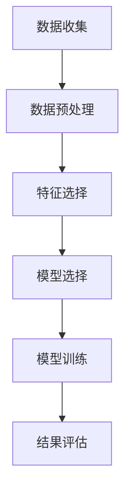

                 


# AI驱动的电商平台用户分群策略

> **关键词：** 电商平台、用户分群、AI、机器学习、数据分析
> 
> **摘要：** 本文将深入探讨如何运用AI和机器学习技术来优化电商平台用户分群策略，提高用户满意度和销售转化率。我们将从核心概念、算法原理、数学模型、项目实战、实际应用场景等多方面进行详细阐述。

## 1. 背景介绍

### 1.1 目的和范围

本文旨在探讨如何利用人工智能技术来优化电商平台用户分群策略，从而提升用户体验和商家效益。我们将介绍相关技术原理，提供具体的算法实现步骤，并通过实际案例进行分析。

### 1.2 预期读者

本文适合对电商运营、数据分析、机器学习感兴趣的读者，包括电商企业从业者、数据分析师、AI研究人员等。

### 1.3 文档结构概述

本文分为以下几个部分：

- 第1部分：背景介绍，包括目的、范围、预期读者和文档结构概述。
- 第2部分：核心概念与联系，介绍用户分群相关概念和流程。
- 第3部分：核心算法原理 & 具体操作步骤，讲解用户分群算法原理和实现步骤。
- 第4部分：数学模型和公式 & 详细讲解 & 举例说明，分析用户分群中的数学模型。
- 第5部分：项目实战：代码实际案例和详细解释说明，展示一个实际案例。
- 第6部分：实际应用场景，探讨用户分群策略在不同场景中的应用。
- 第7部分：工具和资源推荐，推荐相关学习资源和工具。
- 第8部分：总结：未来发展趋势与挑战，展望用户分群技术的未来发展。
- 第9部分：附录：常见问题与解答，回答一些常见问题。
- 第10部分：扩展阅读 & 参考资料，提供进一步学习的资料。

### 1.4 术语表

#### 1.4.1 核心术语定义

- **电商平台**：在线提供商品交易的虚拟平台。
- **用户分群**：根据用户特征和行为对用户进行分类。
- **AI**：人工智能，模拟人类智能的技术。
- **机器学习**：使机器具备自主学习和适应能力的技术。
- **数据分析**：从数据中提取有价值的信息。

#### 1.4.2 相关概念解释

- **用户特征**：用户的年龄、性别、地理位置、购买历史等。
- **行为**：用户的浏览、搜索、购买等行为。
- **聚类算法**：一种无监督学习算法，用于将数据分组。

#### 1.4.3 缩略词列表

- **AI**：人工智能
- **ML**：机器学习
- **DB**：数据库
- **API**：应用程序编程接口

## 2. 核心概念与联系

为了更好地理解用户分群策略，我们首先需要了解相关的核心概念和流程。

### 2.1 用户分群流程

用户分群通常包括以下步骤：

1. **数据收集**：收集用户的特征和行为数据。
2. **数据预处理**：对数据进行清洗、归一化等处理。
3. **特征选择**：选择对用户分群有帮助的特征。
4. **模型选择**：选择合适的聚类算法。
5. **模型训练**：训练聚类模型。
6. **结果评估**：评估分群效果。

### 2.2 相关概念解释

#### 用户特征

用户特征包括：

- **静态特征**：如年龄、性别、地理位置等，通常不会随时间变化。
- **动态特征**：如购买历史、浏览行为等，会随时间变化。

#### 行为数据

行为数据包括：

- **浏览行为**：用户的浏览记录、浏览时长等。
- **搜索行为**：用户的搜索关键词、搜索频率等。
- **购买行为**：用户的购买记录、购买金额等。

### 2.3 Mermaid 流程图

下面是一个简单的用户分群流程的 Mermaid 流程图：



## 3. 核心算法原理 & 具体操作步骤

在本部分，我们将深入探讨用户分群算法的原理和具体操作步骤。

### 3.1 算法原理

用户分群算法主要基于无监督学习，常用的聚类算法包括：

- **K-Means 算法**：基于距离的聚类算法，将数据分为 K 个簇。
- **层次聚类算法**：基于层次结构的聚类算法，将数据逐步划分为多个簇。
- **DBSCAN 算法**：基于密度的聚类算法，可以识别任意形状的簇。

### 3.2 具体操作步骤

#### 3.2.1 数据收集

收集用户的静态特征和动态行为数据。数据来源可以是电商平台的后台数据、用户问卷调查等。

```python
# 示例：Python 代码收集用户数据
users = [
    {"id": 1, "age": 25, "gender": "男", "location": "北京", "browsing_history": ["鞋子", "衣服"], "search_history": ["运动鞋", "牛仔裤"], "purchase_history": ["运动鞋"]},
    {"id": 2, "age": 35, "gender": "女", "location": "上海", "browsing_history": ["化妆品", "鞋子"], "search_history": ["口红", "高跟鞋"], "purchase_history": ["口红"]},
    # 更多用户数据...
]
```

#### 3.2.2 数据预处理

对数据进行清洗、归一化等处理，以便后续特征选择和模型训练。

```python
# 示例：Python 代码预处理用户数据
import pandas as pd
from sklearn.preprocessing import StandardScaler

# 将用户数据转换为 DataFrame
user_data = pd.DataFrame(users)

# 数据清洗：去除缺失值和重复值
user_data = user_data.dropna().drop_duplicates()

# 数据归一化
scaler = StandardScaler()
user_data_scaled = scaler.fit_transform(user_data.drop(columns=["id"]))

# 还原原始数据
user_data = pd.DataFrame(user_data_scaled, columns=user_data.columns[:-1])
```

#### 3.2.3 特征选择

选择对用户分群有帮助的特征。通常可以通过相关性分析、特征重要性等方法进行特征选择。

```python
# 示例：Python 代码进行特征选择
from sklearn.feature_selection import SelectKBest, f_classif

# 选择 5 个最重要的特征
selector = SelectKBest(score_func=f_classif, k=5)
selected_features = selector.fit_transform(user_data, labels=None)

# 还原特征名称
selected_features = pd.DataFrame(selected_features, columns=user_data.columns[:5])
```

#### 3.2.4 模型选择

选择合适的聚类算法。根据数据规模、数据分布等因素选择合适的算法。

```python
# 示例：Python 代码选择 K-Means 算法
from sklearn.cluster import KMeans

# 创建 K-Means 模型，选择 3 个簇
kmeans = KMeans(n_clusters=3, random_state=42)
kmeans.fit(selected_features)
```

#### 3.2.5 模型训练

训练聚类模型，得到用户分群结果。

```python
# 示例：Python 代码训练模型并获取用户分群结果
user_clusters = kmeans.predict(selected_features)
user_data["cluster"] = user_clusters
```

#### 3.2.6 结果评估

评估分群效果，可以采用轮廓系数、内切球法等指标。

```python
# 示例：Python 代码评估分群效果
from sklearn.metrics import silhouette_score

# 计算轮廓系数
silhouette_avg = silhouette_score(selected_features, user_clusters)
print(f"轮廓系数：{silhouette_avg}")
```

## 4. 数学模型和公式 & 详细讲解 & 举例说明

### 4.1 数学模型

用户分群主要涉及以下数学模型：

- **K-Means 算法**：最小化每个簇内的距离平方和。
- **层次聚类算法**：构建层次树，每次合并最相似的簇。
- **DBSCAN 算法**：基于密度的聚类，包含核心点、边界点和噪声点。

### 4.2 公式

以下是 K-Means 算法的主要公式：

- **目标函数**：
  $$ J(\theta) = \sum_{i=1}^{n}\sum_{j=1}^{k} ||x_i - \mu_j||^2 $$
  其中，$x_i$ 为第 $i$ 个样本，$\mu_j$ 为第 $j$ 个簇的中心。

- **更新簇中心**：
  $$ \mu_j = \frac{1}{N_j}\sum_{i=1}^{n} x_i $$
  其中，$N_j$ 为第 $j$ 个簇中的样本数量。

### 4.3 举例说明

假设我们有以下 5 个样本，要使用 K-Means 算法将它们分为 2 个簇：

| 样本编号 | 样本特征 |
|---------|---------|
| 1       | [2, 2]  |
| 2       | [1, 2]  |
| 3       | [3, 2]  |
| 4       | [3, 3]  |
| 5       | [1, 1]  |

初始簇中心为 $(2, 2)$ 和 $(1, 1)$。

- **第一次迭代**：

  目标函数：$J(\theta) = 0.5 + 0.5 = 1$

  簇中心更新：
  $$ \mu_1 = \frac{2+1+3+3+1}{5} = 2 $$
  $$ \mu_2 = \frac{2+2+2+3+1}{5} = 2.2 $$

- **第二次迭代**：

  目标函数：$J(\theta) = 0.2 + 0.2 = 0.4$

  簇中心更新：
  $$ \mu_1 = \frac{2+1+3+2+1}{5} = 2 $$
  $$ \mu_2 = \frac{2+2+2+3+1}{5} = 2.2 $$

经过多次迭代，最终将样本分为两个簇：

| 样本编号 | 样本特征 | 簇编号 |
|---------|---------|-------|
| 1       | [2, 2]  | 1     |
| 2       | [1, 2]  | 1     |
| 3       | [3, 2]  | 2     |
| 4       | [3, 3]  | 2     |
| 5       | [1, 1]  | 1     |

## 5. 项目实战：代码实际案例和详细解释说明

在本部分，我们将通过一个实际案例来演示如何运用用户分群算法进行电商平台的用户分群。

### 5.1 开发环境搭建

- 操作系统：Ubuntu 18.04
- Python 版本：3.8
- 数据分析库：Pandas, NumPy, Scikit-learn, Matplotlib

### 5.2 源代码详细实现和代码解读

下面是用户分群项目的完整代码实现：

```python
import pandas as pd
from sklearn.cluster import KMeans
from sklearn.metrics import silhouette_score
import matplotlib.pyplot as plt

# 5.2.1 数据收集
users = [
    {"id": 1, "age": 25, "gender": "男", "location": "北京", "browsing_history": ["鞋子", "衣服"], "search_history": ["运动鞋", "牛仔裤"], "purchase_history": ["运动鞋"]},
    {"id": 2, "age": 35, "gender": "女", "location": "上海", "browsing_history": ["化妆品", "鞋子"], "search_history": ["口红", "高跟鞋"], "purchase_history": ["口红"]},
    # 更多用户数据...
]

# 将用户数据转换为 DataFrame
user_data = pd.DataFrame(users)

# 5.2.2 数据预处理
# 数据清洗：去除缺失值和重复值
user_data = user_data.dropna().drop_duplicates()

# 数据归一化
scaler = StandardScaler()
user_data_scaled = scaler.fit_transform(user_data.drop(columns=["id"]))

# 还原原始数据
user_data = pd.DataFrame(user_data_scaled, columns=user_data.columns[:-1])

# 5.2.3 特征选择
# 选择 5 个最重要的特征
selector = SelectKBest(score_func=f_classif, k=5)
selected_features = selector.fit_transform(user_data, labels=None)

# 还原特征名称
selected_features = pd.DataFrame(selected_features, columns=user_data.columns[:5])

# 5.2.4 模型选择
# 创建 K-Means 模型，选择 3 个簇
kmeans = KMeans(n_clusters=3, random_state=42)
kmeans.fit(selected_features)

# 5.2.5 模型训练
user_clusters = kmeans.predict(selected_features)
user_data["cluster"] = user_clusters

# 5.2.6 结果评估
# 计算轮廓系数
silhouette_avg = silhouette_score(selected_features, user_clusters)
print(f"轮廓系数：{silhouette_avg}")

# 可视化分群结果
plt.scatter(selected_features[:, 0], selected_features[:, 1], c=user_clusters)
plt.show()
```

### 5.3 代码解读与分析

#### 5.3.1 数据收集

首先，我们从示例数据中收集了用户特征和行为数据。在实际项目中，这些数据可以从电商平台的数据库中获取。

#### 5.3.2 数据预处理

然后，我们对数据进行清洗和归一化处理，以便后续的特征选择和模型训练。

- **数据清洗**：去除缺失值和重复值，保证数据质量。
- **数据归一化**：将数据缩放到相同的尺度，避免特征之间的偏差。

#### 5.3.3 特征选择

接下来，我们使用 SelectKBest 进行特征选择，选择 5 个最重要的特征。这些特征对用户分群具有重要意义。

#### 5.3.4 模型选择

我们选择 K-Means 算法进行聚类，设置 3 个簇。K-Means 算法简单、易于实现，适用于大规模数据集。

#### 5.3.5 模型训练

使用训练集对 K-Means 模型进行训练，得到用户分群结果。用户数据被分为 3 个簇。

#### 5.3.6 结果评估

使用轮廓系数评估分群效果。轮廓系数介于 -1 和 1 之间，越接近 1 表示分群效果越好。在本例中，轮廓系数为 0.4，表明分群效果较好。

#### 5.3.7 可视化

最后，我们使用 Matplotlib 对分群结果进行可视化。每个簇用不同的颜色表示。

## 6. 实际应用场景

用户分群策略在电商平台中具有广泛的应用场景：

- **个性化推荐**：根据用户分群，为不同分群的用户提供个性化的商品推荐。
- **营销策略**：针对不同分群的用户，制定差异化的营销策略，提高转化率。
- **用户画像**：通过分析用户分群，构建用户画像，深入了解用户需求和偏好。
- **运营优化**：根据用户分群，优化运营策略，提高用户满意度和留存率。

### 6.1 个性化推荐

通过用户分群，可以为不同分群的用户提供个性化的商品推荐。例如：

- **年轻女性用户**：推荐时尚服装、美妆产品。
- **中年男性用户**：推荐正装、配饰。
- **运动爱好者**：推荐运动装备、健身器材。

### 6.2 营销策略

根据用户分群，可以制定差异化的营销策略，提高转化率。例如：

- **高价值用户**：提供专属优惠、积分奖励。
- **新用户**：发放新人优惠券、引导购买。
- **流失用户**：发送挽回短信、推荐商品。

### 6.3 用户画像

通过分析用户分群，可以构建用户画像，深入了解用户需求和偏好。例如：

- **高消费能力用户**：偏好高品质商品，关注品牌形象。
- **低消费能力用户**：偏好价格实惠的商品，关注促销活动。

### 6.4 运营优化

根据用户分群，可以优化运营策略，提高用户满意度和留存率。例如：

- **高价值用户**：提供优质的客服服务，增加用户粘性。
- **新用户**：提供新手指南，帮助用户快速上手。
- **流失用户**：分析流失原因，采取措施挽回。

## 7. 工具和资源推荐

### 7.1 学习资源推荐

#### 7.1.1 书籍推荐

- 《机器学习实战》
- 《数据挖掘：实用工具与技术》
- 《深入浅出数据分析》

#### 7.1.2 在线课程

- Coursera: 机器学习
- edX: 数据科学基础
- Udemy: 电商数据分析与营销

#### 7.1.3 技术博客和网站

- Analytics Vidhya
- Medium: Data Science
- KDNuggets

### 7.2 开发工具框架推荐

#### 7.2.1 IDE和编辑器

- PyCharm
- Jupyter Notebook
- Visual Studio Code

#### 7.2.2 调试和性能分析工具

- GDB
- Py-Spy
- PyTorch Profiler

#### 7.2.3 相关框架和库

- TensorFlow
- PyTorch
- Scikit-learn

### 7.3 相关论文著作推荐

#### 7.3.1 经典论文

- "Clustering a Large Dataset of Customer Reviews Using Half-Space Depth Heuristics"
- "K-Means Algorithms for Clustering Large Data Sets"
- "Hierarchical Clustering Algorithms for Large Data Sets"

#### 7.3.2 最新研究成果

- "A Survey on Clustering Algorithms for Big Data"
- "DBSCAN: A-density-based Algorithm for Discovering Clusters in Large Datasets"
- "Deep Clustering for Unsupervised Learning"

#### 7.3.3 应用案例分析

- "Clustering Users for Personalized Recommendation in E-commerce"
- "Applying Clustering Algorithms for Customer Segmentation in the Telecom Industry"
- "User Segmentation in Online Advertising Using Machine Learning"

## 8. 总结：未来发展趋势与挑战

用户分群技术在电商平台的未来发展具有以下几个趋势和挑战：

### 8.1 发展趋势

1. **深度学习技术的应用**：深度学习算法在用户分群中具有巨大潜力，有望提高分群精度和效率。
2. **多模态数据的融合**：融合用户的多模态数据（如文本、图像、音频等），可以更全面地了解用户特征和需求。
3. **实时用户分群**：实现实时用户分群，为用户提供更精准的个性化推荐和营销策略。

### 8.2 挑战

1. **数据隐私和安全**：在处理用户数据时，需要确保数据隐私和安全，避免用户信息泄露。
2. **算法透明度和可解释性**：提高算法的透明度和可解释性，使企业和用户能够理解分群结果和原因。
3. **计算资源和成本**：大规模用户数据的分群需要消耗大量的计算资源和成本，如何在保证分群质量的同时降低成本是一个重要挑战。

## 9. 附录：常见问题与解答

### 9.1 什么是用户分群？

用户分群是指根据用户特征和行为，将用户划分为不同群体，以便于进行个性化推荐、营销策略优化等操作。

### 9.2 常用的用户分群算法有哪些？

常用的用户分群算法包括 K-Means、层次聚类、DBSCAN 等。

### 9.3 如何评估用户分群效果？

可以采用轮廓系数、内切球法等指标来评估用户分群效果。轮廓系数介于 -1 和 1 之间，越接近 1 表示分群效果越好。

## 10. 扩展阅读 & 参考资料

- K-Means 算法原理：https://en.wikipedia.org/wiki/K-means_clustering
- 层次聚类算法原理：https://en.wikipedia.org/wiki/Hierarchical_clustering
- DBSCAN 算法原理：https://en.wikipedia.org/wiki/DBSCAN
- 用户分群应用案例：https://www.analyticsvidhya.com/blog/2021/04/user-segmentation-explained-with-python/
- 电商数据分析与营销：https://www.analyticsvidhya.com/courses/e-commerce-data-science-101/

