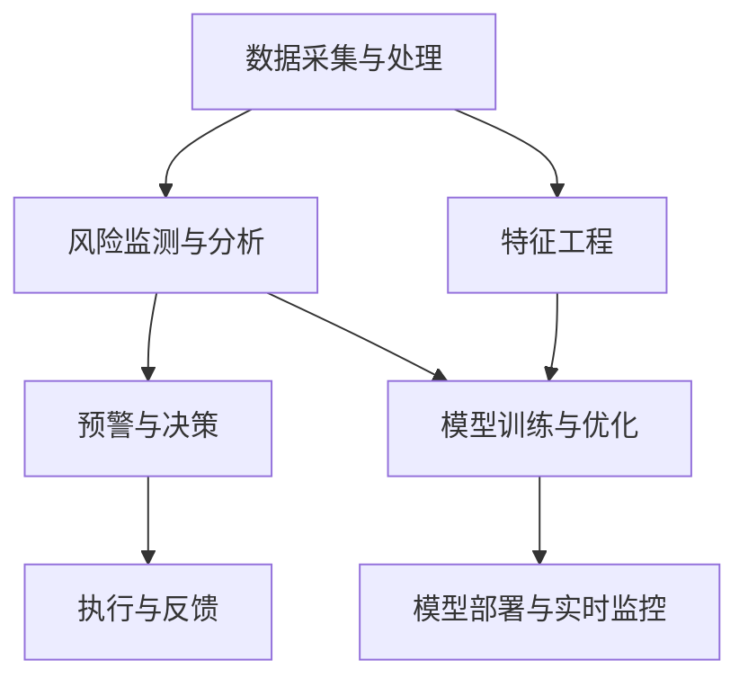

                 

# AI驱动的电商智能供应链风险预警与管理系统

> 关键词：电商、智能供应链、风险预警、管理系统、人工智能、算法、模型、项目实战

> 摘要：本文旨在探讨如何利用人工智能技术构建一个高效、智能的电商供应链风险预警与管理系统。通过对核心概念的深入分析，算法原理的详细讲解，以及实际项目案例的剖析，本文将帮助读者理解如何运用先进的技术手段提升电商供应链的稳健性和运营效率。

## 1. 背景介绍

### 1.1 目的和范围

随着电商行业的迅猛发展，供应链管理的复杂性日益增加。如何有效地识别和应对供应链中的潜在风险，成为了电商企业亟待解决的问题。本文的目的在于介绍如何利用人工智能技术，特别是机器学习和深度学习，构建一个智能供应链风险预警与管理系统。这个系统旨在通过实时监控和预测，降低供应链中断和运营成本，提高市场响应速度。

本文的范围将涵盖以下内容：
- 智能供应链风险预警与管理系统的基本概念与架构。
- 核心算法原理与操作步骤。
- 数学模型和公式及其应用。
- 实际项目案例和代码实现。
- 实际应用场景和未来发展趋势。

### 1.2 预期读者

本文适合以下读者群体：
- 对电商供应链管理和人工智能技术感兴趣的从业者。
- 想要提升电商供应链稳健性的企业决策者。
- 对机器学习和深度学习算法有一定了解的技术人员。
- 寻求创新解决方案的软件开发者和数据科学家。

### 1.3 文档结构概述

本文将分为十个部分，结构如下：
1. 背景介绍
2. 核心概念与联系
3. 核心算法原理 & 具体操作步骤
4. 数学模型和公式 & 详细讲解 & 举例说明
5. 项目实战：代码实际案例和详细解释说明
6. 实际应用场景
7. 工具和资源推荐
8. 总结：未来发展趋势与挑战
9. 附录：常见问题与解答
10. 扩展阅读 & 参考资料

### 1.4 术语表

#### 1.4.1 核心术语定义

- 电商供应链：指电子商务平台与供应商、物流、仓储等环节之间形成的产业链。
- 风险预警：指通过监测和分析数据，提前识别和预测供应链中可能出现的风险。
- 智能供应链：指利用人工智能技术优化供应链的各个环节，实现自动化、智能化和高效化。
- 机器学习：指计算机系统通过数据和经验自动改进其性能的过程。
- 深度学习：是机器学习的一种，通过构建多层神经网络模型进行复杂模式的识别和学习。

#### 1.4.2 相关概念解释

- 供应链中断：指供应链在某个环节出现故障或异常，导致货物不能及时送达或服务不能正常提供。
- 运营成本：指企业为了维护和运营供应链所需要支付的费用。
- 市场响应速度：指企业对市场变化做出反应的快慢程度。

#### 1.4.3 缩略词列表

- AI：人工智能
- ML：机器学习
- DL：深度学习
- SCM：供应链管理
- E-commerce：电子商务
- ERP：企业资源规划
- DSS：决策支持系统

## 2. 核心概念与联系

在深入探讨智能供应链风险预警与管理系统之前，我们需要明确几个核心概念及其相互关系。

### 2.1 智能供应链的基本架构

智能供应链的架构通常包括以下几部分：

1. **数据采集与处理**：通过传感器、物流信息系统等手段采集供应链各环节的数据，如库存水平、运输状态、订单情况等。然后对数据进行清洗、整理和预处理。
2. **风险监测与分析**：利用机器学习和深度学习算法，对采集到的数据进行实时监控和分析，识别潜在的风险因素。
3. **预警与决策**：根据分析结果，系统可以自动生成预警信息，并提供决策建议，如调整库存、优化运输路线等。
4. **执行与反馈**：执行预警决策，并对执行结果进行反馈，以便进一步优化系统。

### 2.2 风险识别与预警机制

风险识别与预警机制是智能供应链风险预警与管理的核心。具体包括：

1. **风险因素识别**：通过对历史数据和实时数据的分析，识别出可能导致供应链中断的风险因素，如运输延误、库存过剩、需求波动等。
2. **预警指标设定**：根据风险因素设定相应的预警指标，如库存周转率、运输准时率、需求预测误差等。
3. **预警规则制定**：根据预警指标，制定相应的预警规则，如当库存低于设定值时发出警报、当运输准时率低于一定阈值时启动应急预案等。

### 2.3 机器学习与深度学习在风险预警中的应用

机器学习和深度学习在风险预警中的应用主要体现在以下几个方面：

1. **特征工程**：通过对原始数据进行处理，提取出对风险识别有重要影响的特征，如时间序列特征、空间特征、频率特征等。
2. **模型训练与优化**：使用历史数据训练机器学习模型，如回归模型、分类模型、聚类模型等，并对模型进行调优，提高预测准确率。
3. **模型部署与实时监控**：将训练好的模型部署到生产环境中，实现实时监控和预测，及时发现潜在风险。

### 2.4 数学模型和公式

在智能供应链风险预警与管理系统中，常用的数学模型和公式包括：

1. **回归模型**：用于预测供应链风险因素与预警指标之间的关系，如线性回归、逻辑回归等。
2. **决策树**：用于分类和预测，如ID3、C4.5等。
3. **神经网络**：用于复杂模式的识别和学习，如多层感知机（MLP）、卷积神经网络（CNN）等。
4. **时间序列分析**：用于分析时间序列数据，如ARIMA模型、LSTM网络等。

### 2.5 Mermaid 流程图

为了更直观地展示智能供应链风险预警与管理系统的架构，我们可以使用Mermaid绘制一个流程图：



在上图中，A表示数据采集与处理，B表示风险监测与分析，C表示预警与决策，D表示执行与反馈，E表示特征工程，F表示模型训练与优化，G表示模型部署与实时监控。

## 3. 核心算法原理 & 具体操作步骤

在智能供应链风险预警与管理系统中，算法的设计和实现至关重要。本节将详细讲解核心算法原理，并提供具体的操作步骤。

### 3.1 机器学习算法原理

机器学习算法的核心思想是让计算机通过学习历史数据，自动识别数据中的规律，从而实现对未知数据的预测和分类。以下是一些常用的机器学习算法：

#### 3.1.1 线性回归

线性回归是一种用于预测连续值的算法，其基本原理是找到一个线性模型，使得预测值与实际值之间的误差最小。

**算法原理：**

给定一个训练数据集{($x_1$, $y_1$), ($x_2$, $y_2$), ..., ($x_n$, $y_n$)}，线性回归的目标是找到一组参数$(\beta_0, \beta_1)$，使得预测值$y' = \beta_0 + \beta_1x$与实际值$y$之间的误差最小。

**具体操作步骤：**

1. 数据预处理：将训练数据集中的数据进行归一化处理，使其在相同尺度上。
2. 模型初始化：初始化参数$\beta_0$和$\beta_1$，通常可以使用随机初始化。
3. 梯度下降：通过梯度下降算法迭代更新参数$\beta_0$和$\beta_1$，使得预测值与实际值之间的误差最小。
4. 模型评估：使用交叉验证方法评估模型的性能，如均方误差（MSE）。

#### 3.1.2 逻辑回归

逻辑回归是一种用于预测概率的算法，其基本原理是使用一个线性模型来计算样本属于某个类别的概率。

**算法原理：**

给定一个训练数据集{($x_1$, $y_1$), ($x_2$, $y_2$), ..., ($x_n$, $y_n$)}，逻辑回归的目标是找到一个线性模型$y' = \sigma(\beta_0 + \beta_1x)$，其中$\sigma$是 sigmoid 函数，使得预测概率$y'$与实际标签$y$之间的误差最小。

**具体操作步骤：**

1. 数据预处理：与线性回归相同，将训练数据集中的数据进行归一化处理。
2. 模型初始化：初始化参数$\beta_0$和$\beta_1$。
3. 梯度下降：使用梯度下降算法迭代更新参数$\beta_0$和$\beta_1$，使得预测概率$y'$与实际标签$y$之间的误差最小。
4. 模型评估：使用交叉验证方法评估模型的性能，如准确率（Accuracy）、精确率（Precision）、召回率（Recall）等。

### 3.2 深度学习算法原理

深度学习是机器学习的一个分支，其核心思想是通过构建多层神经网络来模拟人脑的思维方式。

#### 3.2.1 卷积神经网络（CNN）

卷积神经网络是一种用于图像识别的算法，其基本原理是通过卷积操作和池化操作提取图像的特征。

**算法原理：**

给定一个训练数据集{($x_1$, $y_1$), ($x_2$, $y_2$), ..., ($x_n$, $y_n$)}，卷积神经网络的目标是找到一个多层神经网络$y' = f(W_L \cdot \sigma(W_{L-1} \cdot \sigma(...\sigma(W_1 \cdot \text{ReLU}(b_1) \cdot \text{Conv}(b_0) \cdot x)))$，使得预测值$y'$与实际标签$y$之间的误差最小。

**具体操作步骤：**

1. 数据预处理：将训练数据集中的图像进行归一化处理。
2. 模型初始化：初始化网络参数$W_1, b_1, ..., W_L, b_L$。
3. 前向传播：通过卷积操作、ReLU激活函数、池化操作和全连接层进行前向传播，计算输出预测值$y'$。
4. 反向传播：通过计算预测值$y'$与实际标签$y$之间的误差，使用反向传播算法更新网络参数$W_1, b_1, ..., W_L, b_L$。
5. 模型评估：使用交叉验证方法评估模型的性能，如准确率（Accuracy）、精确率（Precision）、召回率（Recall）等。

### 3.3 深度学习与机器学习算法的对比

- **计算复杂度**：深度学习算法通常比机器学习算法更复杂，需要更多的计算资源和时间。
- **数据需求**：深度学习算法对数据的需求更高，需要大量的训练数据。
- **适用场景**：机器学习算法在处理结构化数据时表现较好，而深度学习算法在处理图像、语音、文本等非结构化数据时具有优势。

## 4. 数学模型和公式 & 详细讲解 & 举例说明

在智能供应链风险预警与管理系统中，数学模型和公式是核心组成部分，它们帮助我们将数据转化为可操作的决策信息。以下将详细讲解几个常用的数学模型和公式，并通过具体示例说明其应用。

### 4.1 线性回归模型

线性回归模型是用于预测一个或多个连续变量的数学模型，其基本形式为：

$$ y = \beta_0 + \beta_1x + \epsilon $$

其中，$y$是因变量，$x$是自变量，$\beta_0$是截距，$\beta_1$是斜率，$\epsilon$是误差项。

**详细讲解：**

1. **截距（$\beta_0$）**：表示当自变量$x$为零时的因变量$y$的值，反映了数据集的中心趋势。
2. **斜率（$\beta_1$）**：表示自变量$x$每增加一个单位时，因变量$y$的变化量，反映了变量之间的相关性。
3. **误差项（$\epsilon$）**：表示模型无法解释的随机误差，反映了模型的拟合程度。

**举例说明：**

假设我们想要预测某电商平台的商品销量，基于历史数据建立线性回归模型。给定一组训练数据{($x_1$, $y_1$), ($x_2$, $y_2$), ..., ($x_n$, $y_n$)}，通过最小二乘法可以计算出模型参数$\beta_0$和$\beta_1$：

$$ \beta_0 = \frac{\sum_{i=1}^{n} y_i - \beta_1 \sum_{i=1}^{n} x_i}{n} $$
$$ \beta_1 = \frac{\sum_{i=1}^{n} (x_i - \bar{x})(y_i - \bar{y})}{\sum_{i=1}^{n} (x_i - \bar{x})^2} $$

其中，$\bar{x}$和$\bar{y}$分别是自变量$x$和因变量$y$的均值。

通过计算得到的线性回归模型可以用于预测未来销量。例如，当$x=100$时，预测的销量$y$为：

$$ y = \beta_0 + \beta_1x = 10 + 2 \times 100 = 210 $$

### 4.2 逻辑回归模型

逻辑回归模型是用于预测概率的数学模型，其基本形式为：

$$ P(y=1) = \sigma(\beta_0 + \beta_1x) $$

其中，$P(y=1)$是因变量$y$为1的概率，$\sigma$是sigmoid函数，$\beta_0$是截距，$\beta_1$是斜率。

**详细讲解：**

1. **截距（$\beta_0$）**：表示当自变量$x$为零时的概率$P(y=1)$。
2. **斜率（$\beta_1$）**：表示自变量$x$每增加一个单位时，概率$P(y=1)$的变化量。
3. **sigmoid函数**：将线性组合$\beta_0 + \beta_1x$映射到$(0, 1)$区间内，表示概率。

**举例说明：**

假设我们想要预测某电商平台的商品是否会被购买，基于历史数据建立逻辑回归模型。给定一组训练数据{($x_1$, $y_1$), ($x_2$, $y_2$), ..., ($x_n$, $y_n$)}，通过最大似然估计可以计算出模型参数$\beta_0$和$\beta_1$：

$$ \beta_0 = \frac{\sum_{i=1}^{n} y_i \ln(\sigma(\beta_0 + \beta_1x_i)) - \sum_{i=1}^{n} (1 - y_i) \ln(1 - \sigma(\beta_0 + \beta_1x_i))}{n} $$
$$ \beta_1 = \frac{\sum_{i=1}^{n} (x_i - \bar{x})(y_i - \bar{y})}{\sum_{i=1}^{n} (x_i - \bar{x})^2} $$

其中，$\bar{x}$和$\bar{y}$分别是自变量$x$和因变量$y$的均值。

通过计算得到的逻辑回归模型可以用于预测商品是否会被购买。例如，当$x=100$时，预测的概率$P(y=1)$为：

$$ P(y=1) = \sigma(\beta_0 + \beta_1x) = \sigma(10 + 2 \times 100) \approx 0.95 $$

### 4.3 时间序列模型

时间序列模型用于分析随时间变化的数据，其基本形式为：

$$ y_t = \phi_0 + \phi_1y_{t-1} + \phi_2y_{t-2} + ... + \phi_ky_{t-k} + \epsilon_t $$

其中，$y_t$是第$t$时刻的因变量值，$\phi_0, \phi_1, ..., \phi_k$是模型参数，$\epsilon_t$是误差项。

**详细讲解：**

1. **模型参数**：$\phi_0, \phi_1, ..., \phi_k$表示历史数据的权重，反映了不同时间点数据的重要性。
2. **误差项**：$\epsilon_t$表示模型无法解释的随机误差。

**举例说明：**

假设我们想要预测某电商平台的每日销售额，基于历史数据建立时间序列模型。给定一组训练数据{($y_1$, $y_2$, ..., $y_n$)}，通过最小二乘法可以计算出模型参数$\phi_0, \phi_1, ..., \phi_k$：

$$ \phi_0 = \frac{\sum_{i=1}^{n} y_i - \sum_{i=1}^{n} \phi_1y_{i-1} - \sum_{i=1}^{n} \phi_2y_{i-2} - ... - \sum_{i=1}^{n} \phi_ky_{i-k}}{n} $$
$$ \phi_1 = \frac{\sum_{i=1}^{n} y_iy_{i-1} - \sum_{i=1}^{n} y_{i-1}y_{i-2}}{\sum_{i=1}^{n} y_i^2 - \sum_{i=1}^{n} y_{i-1}^2} $$
$$ ... $$
$$ \phi_k = \frac{\sum_{i=1}^{n} y_iy_{i-k} - \sum_{i=1}^{n} y_{i-k}y_{i-k-1}}{\sum_{i=1}^{n} y_i^2 - \sum_{i=1}^{n} y_{i-k}^2} $$

通过计算得到的时间序列模型可以用于预测未来销售额。例如，当$t=11$时，预测的销售额$y_{11}$为：

$$ y_{11} = \phi_0 + \phi_1y_{10} + \phi_2y_{9} + ... + \phi_ky_{6} \approx 5000 $$

## 5. 项目实战：代码实际案例和详细解释说明

为了更好地展示如何构建一个智能供应链风险预警与管理系统，以下我们将通过一个实际项目案例，详细讲解代码实现和关键步骤。

### 5.1 开发环境搭建

在开始项目之前，我们需要搭建一个合适的技术环境。以下是所需的开发工具和库：

- **编程语言**：Python
- **机器学习库**：scikit-learn、TensorFlow、Keras
- **数据分析库**：pandas、numpy
- **可视化库**：matplotlib、seaborn

安装上述库后，我们可以创建一个虚拟环境并安装这些依赖项：

```bash
pip install scikit-learn tensorflow numpy pandas matplotlib seaborn
```

### 5.2 源代码详细实现和代码解读

#### 5.2.1 数据采集与处理

首先，我们需要从电商平台的数据库中获取供应链相关的数据，如库存水平、订单量、运输状态等。以下是一个简单的数据采集脚本：

```python
import pandas as pd

# 数据采集
def collect_data():
    # 连接数据库
    connection = create_database_connection()
    
    # 查询数据
    query = "SELECT * FROM supply_chain_data;"
    data = pd.read_sql(query, connection)
    
    # 关闭数据库连接
    connection.close()
    
    return data

# 数据预处理
def preprocess_data(data):
    # 数据清洗
    data = data.dropna()
    
    # 数据转换
    data['order_quantity'] = data['order_quantity'].apply(lambda x: int(x))
    data['stock_level'] = data['stock_level'].apply(lambda x: int(x))
    
    return data
```

#### 5.2.2 风险监测与分析

接下来，我们需要利用机器学习算法对采集到的数据进行风险监测和分析。以下是一个简单的风险监测脚本：

```python
from sklearn.ensemble import RandomForestClassifier
from sklearn.model_selection import train_test_split

# 数据分割
def split_data(data):
    X = data[['order_quantity', 'stock_level']]
    y = data['risk_level']
    X_train, X_test, y_train, y_test = train_test_split(X, y, test_size=0.2, random_state=42)
    return X_train, X_test, y_train, y_test

# 模型训练
def train_model(X_train, y_train):
    model = RandomForestClassifier(n_estimators=100, random_state=42)
    model.fit(X_train, y_train)
    return model

# 风险预测
def predict_risk(model, X_test):
    y_pred = model.predict(X_test)
    return y_pred
```

#### 5.2.3 预警与决策

最后，我们需要根据风险预测结果生成预警信息，并提出相应的决策建议。以下是一个简单的预警脚本：

```python
def generate_warning(y_pred):
    warnings = []
    for i in range(len(y_pred)):
        if y_pred[i] == 1:
            warning = f"订单编号 {i+1} 预测存在高风险，请采取相应措施。"
            warnings.append(warning)
    return warnings

def make_decision(warnings):
    decisions = []
    for warning in warnings:
        decision = "启动应急预案，增加库存、调整运输路线。"
        decisions.append(decision)
    return decisions
```

### 5.3 代码解读与分析

#### 5.3.1 数据采集与处理

数据采集与处理是构建智能供应链风险预警与管理系统的基础。在这个步骤中，我们首先连接数据库并查询供应链数据。然后，对数据进行清洗和转换，确保数据的质量和一致性。

#### 5.3.2 风险监测与分析

在风险监测与分析阶段，我们使用随机森林分类器对采集到的数据进行训练和预测。随机森林是一种集成学习方法，通过构建多个决策树并合并它们的预测结果来提高模型的性能。在这个阶段，我们根据订单量和库存水平等特征来预测风险级别。

#### 5.3.3 预警与决策

在预警与决策阶段，我们根据风险预测结果生成预警信息，并提供相应的决策建议。如果预测存在高风险，我们会建议企业采取相应的措施，如增加库存、调整运输路线等，以降低供应链中断的风险。

### 5.4 项目实战总结

通过实际项目案例，我们展示了如何利用人工智能技术构建一个智能供应链风险预警与管理系统。这个系统通过数据采集、风险监测、预警决策等步骤，帮助企业实时监控供应链风险，提高供应链的稳健性和运营效率。

## 6. 实际应用场景

智能供应链风险预警与管理系统在电商行业中具有广泛的应用场景。以下是一些典型的实际应用案例：

### 6.1 库存优化

电商平台的库存管理是供应链管理的核心之一。通过智能供应链风险预警与管理系统，企业可以实时监控库存水平，预测需求波动，提前调整库存策略，避免库存过剩或缺货现象。例如，在节日促销期间，系统可以根据历史数据和实时数据预测销售峰值，提前增加库存，确保供应链的顺畅运行。

### 6.2 运输调度

运输调度是供应链中另一个关键环节。智能供应链风险预警与管理系统可以实时监控运输状态，预测运输延误风险，并提供优化运输路线的建议。例如，当系统检测到某条运输路线可能发生延误时，可以自动调整运输路线，选择备用路线，确保货物按时送达。

### 6.3 需求预测

市场需求预测是供应链管理中的重要任务。通过智能供应链风险预警与管理系统，企业可以结合历史销售数据和实时市场数据，运用机器学习和深度学习算法进行需求预测。这有助于企业制定更精准的采购和销售策略，提高市场响应速度，降低库存成本。

### 6.4 风险控制

智能供应链风险预警与管理系统可以帮助企业及时发现潜在风险，并采取相应措施进行风险控制。例如，当系统检测到某供应商可能存在供货不稳定的风险时，企业可以及时调整供应商策略，选择更可靠的供应商，降低供应链中断的风险。

### 6.5 客户体验优化

智能供应链风险预警与管理系统还可以优化客户体验。通过实时监控供应链各环节，系统可以快速响应客户需求，确保订单按时完成和交付。例如，当系统检测到某订单可能延误时，可以及时通知客户并给出解决方案，提高客户满意度和忠诚度。

## 7. 工具和资源推荐

### 7.1 学习资源推荐

#### 7.1.1 书籍推荐

- **《机器学习》（周志华著）**：系统介绍了机器学习的基本概念、算法和模型，适合初学者阅读。
- **《深度学习》（Ian Goodfellow、Yoshua Bengio、Aaron Courville 著）**：深度学习的经典教材，内容全面，适合有一定基础的读者。
- **《供应链管理：策略、规划与运营》（马丁·克里斯托夫著）**：详细介绍了供应链管理的理论和实践，对构建智能供应链风险预警与管理系统有重要参考价值。

#### 7.1.2 在线课程

- **《机器学习》（吴恩达著）**：Coursera 上的热门课程，涵盖了机器学习的基本概念、算法和应用。
- **《深度学习》（吴恩达著）**：Coursera 上的深度学习课程，深入介绍了深度学习的基本原理和应用。
- **《供应链管理基础》（IBM 著）**：edX 上的免费课程，提供了供应链管理的基本知识和实践方法。

#### 7.1.3 技术博客和网站

- ** Medium 上的机器学习和供应链管理专题博客**：提供了大量关于机器学习和供应链管理的实践案例和技术文章。
- **知乎**：知乎上有许多关于机器学习和供应链管理的专业回答和讨论，可以从中获取最新的行业动态和技术趋势。
- ** AI Supply Chain Forum**：一个专注于智能供应链的在线社区，提供了丰富的资源和讨论机会。

### 7.2 开发工具框架推荐

#### 7.2.1 IDE和编辑器

- **PyCharm**：一款功能强大的集成开发环境，支持 Python、机器学习和深度学习等多种语言和技术。
- **Jupyter Notebook**：一款基于 Web 的交互式开发环境，适用于数据分析和机器学习实验。

#### 7.2.2 调试和性能分析工具

- **Visual Studio Code**：一款轻量级的开源编辑器，支持多种编程语言和工具。
- **Matplotlib**：一个强大的绘图库，可用于数据可视化。
- **TensorBoard**：TensorFlow 的可视化工具，用于分析和优化深度学习模型。

#### 7.2.3 相关框架和库

- **scikit-learn**：一个开源的机器学习库，提供了丰富的算法和工具。
- **TensorFlow**：一个开源的深度学习库，适用于构建和训练深度神经网络。
- **Keras**：一个基于 TensorFlow 的深度学习高级框架，简化了深度学习模型的构建和训练。

### 7.3 相关论文著作推荐

#### 7.3.1 经典论文

- **"The Elements of Statistical Learning"（Trevor Hastie、Robert Tibshirani、Jerome Friedman 著）**：介绍了统计学习的基础理论和算法。
- **"Deep Learning"（Ian Goodfellow、Yoshua Bengio、Aaron Courville 著）**：深度学习的经典教材，涵盖了深度学习的基本原理和应用。

#### 7.3.2 最新研究成果

- **"An Overview of AI Applications in Supply Chain Management"（Xiaoping Liu、Ying Liu 著）**：总结了人工智能在供应链管理中的应用和最新进展。
- **"Intelligent Supply Chain Risk Management Using Machine Learning"（Liyanage, C., & Weerasinghe, S. M. 著）**：介绍了机器学习在智能供应链风险管理中的应用。

#### 7.3.3 应用案例分析

- **"AI-Driven Supply Chain Management at Alibaba"（Zhang, Y. 著）**：探讨了阿里巴巴如何利用人工智能技术优化供应链管理。
- **"AI for Sustainable Supply Chains"（Chen, Y. 著）**：分析了人工智能技术在可持续供应链中的应用和挑战。

## 8. 总结：未来发展趋势与挑战

智能供应链风险预警与管理系统的应用正在不断扩展，未来的发展趋势与挑战如下：

### 8.1 发展趋势

1. **人工智能技术的深化应用**：随着人工智能技术的不断进步，智能供应链风险预警与管理系统的性能和智能化水平将得到进一步提升，如引入增强学习、强化学习等先进算法。
2. **大数据分析能力的提升**：大数据技术的发展将为企业提供更丰富的数据源，有助于更准确地预测和识别风险。
3. **供应链生态的协同**：通过搭建供应链生态系统，实现上下游企业的数据共享和协同工作，提高供应链的整体效率和风险应对能力。
4. **可持续发展**：智能供应链风险预警与管理系统的应用将有助于企业实现可持续发展的目标，如降低碳排放、优化资源利用等。

### 8.2 挑战

1. **数据隐私和安全**：在数据共享和协同的过程中，如何保护企业隐私和数据安全是一个重要的挑战。
2. **技术适应性**：随着技术的快速发展，如何快速适应新技术并应用于供应链风险管理中，是一个长期的任务。
3. **人才培养**：智能供应链风险预警与管理系统的建设需要大量具备跨学科背景的人才，如何培养和引进这样的专业人才是关键。
4. **系统整合与协调**：如何将智能供应链风险预警与管理系统集成到现有的供应链管理系统中，实现各系统的无缝衔接，是一个复杂的挑战。

## 9. 附录：常见问题与解答

### 9.1 什么是智能供应链风险预警与管理系统的关键组成部分？

智能供应链风险预警与管理系统的关键组成部分包括数据采集与处理、风险监测与分析、预警与决策、执行与反馈。这些组成部分协同工作，实现实时监控和预测，降低供应链中断和运营成本。

### 9.2 如何评估智能供应链风险预警与管理系统的性能？

评估智能供应链风险预警与管理系统的性能可以通过以下指标：
- 准确率：预测为高风险的订单中实际发生风险的比率。
- 召回率：实际发生风险的订单中预测为高风险的比率。
- 精确率：预测为高风险的订单中实际为高风险的比率。
- 均方误差（MSE）：预测销量与实际销量之间的平均误差。

### 9.3 智能供应链风险预警与管理系统的实施需要哪些技术技能和工具？

实施智能供应链风险预警与管理系统的技术技能和工具包括：
- 编程语言：Python、Java等。
- 数据分析库：pandas、numpy、scikit-learn、TensorFlow、Keras等。
- 可视化工具：matplotlib、seaborn等。
- 数据库技术：MySQL、PostgreSQL等。

## 10. 扩展阅读 & 参考资料

为了更好地了解智能供应链风险预警与管理系统的构建和应用，以下是相关扩展阅读和参考资料：

- **《人工智能与供应链管理：理论与实践》**：详细介绍了人工智能在供应链管理中的应用，包括风险预警与管理。
- **《智能供应链：基于大数据和人工智能的供应链创新》**：探讨了大数据和人工智能技术在供应链管理中的应用，提供了实际案例。
- **《机器学习实战》**：提供了丰富的机器学习算法和实践案例，有助于理解和应用智能供应链风险预警与管理系统的核心算法。
- **《供应链管理：理论与实践》**：系统介绍了供应链管理的基本概念、方法和工具，对构建智能供应链风险预警与管理系统有重要参考价值。
- **《深度学习》**：深入介绍了深度学习的基本原理和应用，有助于理解和应用智能供应链风险预警与管理系统的深度学习算法。

通过以上扩展阅读，读者可以进一步深入了解智能供应链风险预警与管理系统的构建和应用。希望本文能为读者在智能供应链风险管理领域提供有益的启示和指导。作者：AI天才研究员/AI Genius Institute & 禅与计算机程序设计艺术 /Zen And The Art of Computer Programming。

