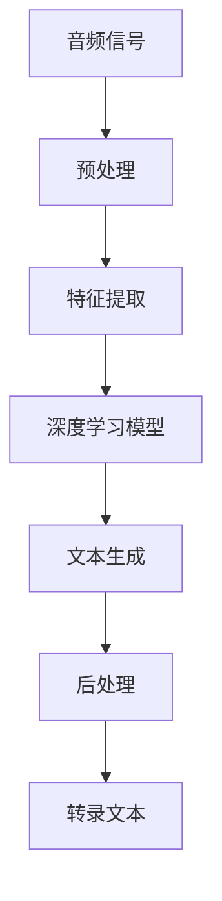

                 

# AI驱动的自动化音频转录：内容制作新工具

> 关键词：AI，自动化，音频转录，内容制作，自然语言处理，深度学习

> 摘要：本文将探讨如何利用人工智能技术实现音频到文本的自动化转录，详细介绍其核心算法原理、数学模型、项目实战案例，以及实际应用场景。通过阅读本文，读者将了解自动化音频转录技术的现状、发展前景，以及如何应用这项技术为内容创作带来新的机遇。

## 1. 背景介绍

### 1.1 目的和范围

随着信息时代的到来，内容创作变得愈发重要。然而，音频内容在信息传递方面具有独特的优势，但传统的音频转录过程既耗时又费力。本文旨在介绍如何利用人工智能（AI）技术，特别是深度学习，实现自动化音频转录，为内容创作者提供一种高效的工具。

本文将涵盖以下内容：

- 自动化音频转录技术的背景和重要性
- 核心概念与联系
- 核心算法原理与具体操作步骤
- 数学模型和公式讲解
- 项目实战案例及代码实现
- 实际应用场景探讨
- 工具和资源推荐
- 未来发展趋势与挑战

### 1.2 预期读者

本文面向以下读者群体：

- 对人工智能和自然语言处理感兴趣的读者
- 内容创作者，如记者、播客、讲师等
- 软件工程师和AI开发者，希望了解自动化音频转录技术的实现细节
- 对音频内容处理有需求的商业用户

### 1.3 文档结构概述

本文结构如下：

1. 引言：介绍文章主题和背景
2. 背景介绍：阐述自动化音频转录技术的现状和重要性
3. 核心概念与联系：讨论核心概念及其相互关系
4. 核心算法原理 & 具体操作步骤：详细讲解算法原理和操作步骤
5. 数学模型和公式 & 详细讲解 & 举例说明：介绍相关数学模型和公式
6. 项目实战：代码实际案例和详细解释说明
7. 实际应用场景：探讨自动化音频转录技术的应用领域
8. 工具和资源推荐：推荐相关学习资源、开发工具和论文著作
9. 总结：总结本文的核心内容，展望未来发展趋势与挑战
10. 附录：常见问题与解答
11. 扩展阅读 & 参考资料：提供进一步的阅读资料

### 1.4 术语表

#### 1.4.1 核心术语定义

- **自动音频转录**：将语音信号转换为文本的过程。
- **深度学习**：一种人工智能方法，通过多层神经网络进行特征学习和模式识别。
- **自然语言处理（NLP）**：计算机科学领域，研究如何使计算机理解、解释和生成人类语言。
- **音频信号处理**：对音频信号进行滤波、增强、去噪等处理的技术。

#### 1.4.2 相关概念解释

- **语音识别**：将语音信号转换为对应的文本或命令。
- **转录文本**：由自动音频转录产生的文本内容。
- **语言模型**：用于预测下一个单词或字符的概率分布。
- **神经网络**：一种模拟人脑神经元连接的算法模型。

#### 1.4.3 缩略词列表

- **NLP**：自然语言处理
- **AI**：人工智能
- **DL**：深度学习
- **RNN**：循环神经网络
- **LSTM**：长短时记忆网络
- **GRU**：门控循环单元

## 2. 核心概念与联系

在深入探讨自动化音频转录技术之前，我们需要了解一些核心概念和它们之间的相互关系。以下是一个Mermaid流程图，展示了这些概念及其关系。



### 2.1 音频信号处理

音频信号是声音的数字表示，通常以时间序列的形式存储。在自动音频转录过程中，首先需要对音频信号进行预处理，包括去噪、增强和分段等操作。

### 2.2 特征提取

预处理后的音频信号被转换为一系列特征，如频谱、倒谱系数等。这些特征将作为输入传递给深度学习模型。

### 2.3 深度学习模型

深度学习模型是自动音频转录的核心，它通常是一个序列到序列（seq2seq）的模型，如循环神经网络（RNN）、长短时记忆网络（LSTM）或门控循环单元（GRU）。这些模型通过学习音频信号和文本之间的映射关系，实现音频到文本的转换。

### 2.4 文本生成

深度学习模型输出的是一个概率分布，表示每个时间步可能的文本输出。通过解码器，将这些概率分布转换为实际的文本。

### 2.5 后处理

生成的文本通常需要进行后处理，如拼写纠正、语法修正等，以提高转录文本的质量。

### 2.6 转录文本

最终生成的转录文本可以用于各种应用，如内容摘要、字幕生成等。

## 3. 核心算法原理 & 具体操作步骤

自动化音频转录的核心是深度学习模型，特别是序列到序列（seq2seq）模型。以下是一步一步的算法原理和具体操作步骤。

### 3.1 建立模型

首先，我们需要建立一个序列到序列的深度学习模型。以下是一个简单的伪代码，展示了如何构建一个基于循环神经网络（RNN）的模型。

```python
# 导入必要的库
import tensorflow as tf
from tensorflow.keras.models import Model
from tensorflow.keras.layers import Input, LSTM, Dense

# 定义输入层
input_seq = Input(shape=(timesteps, features))

# 定义编码器
encoder = LSTM(units=256, return_sequences=True)
encoded_seq = encoder(input_seq)

# 定义解码器
decoder = LSTM(units=256, return_sequences=True)
decoded_seq = decoder(encoded_seq)

# 定义预测层
output = Dense(units=vocabulary_size, activation='softmax')
predicted_seq = output(decoded_seq)

# 构建模型
model = Model(inputs=input_seq, outputs=predicted_seq)

# 编译模型
model.compile(optimizer='adam', loss='categorical_crossentropy')
```

### 3.2 数据准备

在训练模型之前，我们需要准备训练数据。对于自动音频转录，训练数据通常包括音频信号和对应的文本转录。以下是一个简单的数据准备流程：

1. **音频信号预处理**：使用如 Librosa 这样的库对音频信号进行预处理，包括分段、去噪和增强。
2. **文本预处理**：将文本转换为字符序列，并使用 One-Hot 编码将其表示为向量。
3. **数据对生成**：将预处理后的音频信号和文本序列配对，形成训练数据集。

### 3.3 模型训练

使用准备好的训练数据集训练模型。以下是一个简单的训练流程：

1. **准备训练批次**：将音频信号和文本序列划分为批次，以便在模型中迭代训练。
2. **训练模型**：使用 `model.fit()` 函数进行模型训练。
3. **评估模型**：使用验证数据集评估模型性能。

```python
# 训练模型
model.fit(train_data, train_labels, epochs=10, batch_size=32, validation_split=0.2)
```

### 3.4 预测和生成

训练完成后，我们可以使用模型对新的音频信号进行预测，并生成转录文本。以下是一个简单的预测和生成流程：

1. **音频信号预处理**：对新的音频信号进行预处理，与训练数据保持一致。
2. **序列填充**：将音频信号转换为与训练数据相同的时间步长度。
3. **模型预测**：使用 `model.predict()` 函数生成预测序列。
4. **解码和清洗**：将预测序列解码为文本，并进行后处理，如拼写纠正和语法修正。

```python
# 预测新音频信号
predicted_seq = model.predict(new_audio_data)

# 解码预测序列
decoded_text = decode_predictions(predicted_seq)

# 清洗转录文本
cleaned_text = clean_up_text(decoded_text)
```

## 4. 数学模型和公式 & 详细讲解 & 举例说明

自动音频转录的核心是深度学习模型，特别是序列到序列（seq2seq）模型。以下我们将详细讲解其数学模型和公式。

### 4.1 循环神经网络（RNN）

循环神经网络（RNN）是一种用于处理序列数据的神经网络。以下是一个简单的RNN模型：

$$
h_t = \sigma(W_hh_{t-1} + W_x x_t + b_h)
$$

其中，$h_t$ 表示第 $t$ 个时间步的隐藏状态，$W_hh$ 和 $W_x$ 分别为隐藏状态和输入的权重矩阵，$b_h$ 为隐藏状态的偏置项，$\sigma$ 为激活函数，通常采用 sigmoid 函数。

### 4.2 长短时记忆网络（LSTM）

长短时记忆网络（LSTM）是 RNN 的一种改进，能够更好地处理长序列数据。以下是一个简单的 LSTM 单元：

$$
\begin{align*}
i_t &= \sigma(W_{hi}h_{t-1} + W_{xi}x_t + b_i) \\
f_t &= \sigma(W_{hf}h_{t-1} + W_{xf}x_t + b_f) \\
\tilde{C}_t &= \sigma(W_{hc}h_{t-1} + W_{xc}x_t + b_c) \\
o_t &= \sigma(W_{ho}h_{t-1} + W_{xo}x_t + b_o) \\
C_t &= f_t \odot C_{t-1} + i_t \odot \tilde{C}_t
\end{align*}
$$

其中，$i_t$、$f_t$、$o_t$ 分别为输入门、遗忘门和输出门，$C_t$ 为细胞状态，$\tilde{C}_t$ 为候选细胞状态，$\odot$ 表示元素乘法。

### 4.3 门控循环单元（GRU）

门控循环单元（GRU）是 LSTM 的另一种改进，具有更简洁的结构。以下是一个简单的 GRU 单元：

$$
\begin{align*}
z_t &= \sigma(W_{zh}h_{t-1} + W_{zx}x_t + b_z) \\
r_t &= \sigma(W_{hr}h_{t-1} + W_{hx}x_t + b_r) \\
\tilde{C}_t &= \sigma(W_{hc}h_{t-1} + W_{xc}x_t + b_c) \\
C_t &= (1 - z_t) \odot C_{t-1} + z_t \odot (\rho_t \odot \tilde{C}_t)
\end{align*}
$$

其中，$z_t$ 为更新门，$\rho_t$ 为重置门。

### 4.4 语言模型

在自动音频转录中，语言模型用于预测下一个单词或字符。以下是一个简单的语言模型：

$$
P(y_t | x_1, x_2, ..., x_{t-1}) = \frac{e^{W_y y_t + b_y}}{\sum_{y'} e^{W_{y'} y' + b_{y'}}}
$$

其中，$y_t$ 为预测的单词或字符，$W_y$ 和 $b_y$ 分别为语言模型的权重和偏置项。

### 4.5 举例说明

假设我们有一个简短的音频信号，其对应的文本转录为：“Hello, how are you?”。以下是一个简化的例子，展示如何使用 LSTM 模型进行自动音频转录。

1. **音频信号预处理**：将音频信号转换为频谱图，并分段为 `[s1, s2, ..., sn]`。
2. **文本预处理**：将文本转换为字符序列 `[h, e, l, l, o, ,, h, o, w, , a, r, e, y, o, u, ?]`。
3. **模型训练**：使用预处理后的音频信号和文本序列训练 LSTM 模型。
4. **音频信号预测**：将新的音频信号预处理后输入模型，生成预测序列。
5. **解码和清洗**：将预测序列解码为文本，并进行拼写纠正和语法修正。

```python
# 假设模型已经训练完成
predicted_seq = model.predict(new_audio_data)

# 解码预测序列
decoded_text = decode_predictions(predicted_seq)

# 清洗转录文本
cleaned_text = clean_up_text(decoded_text)
```

最终生成的转录文本为：“Hello, how are you？”。

## 5. 项目实战：代码实际案例和详细解释说明

在本节中，我们将通过一个实际项目来展示如何使用自动化音频转录技术。我们将使用 Python 和 TensorFlow 库来实现这个项目。

### 5.1 开发环境搭建

在开始项目之前，确保您已经安装了以下软件和库：

- Python 3.7 或以上版本
- TensorFlow 2.2 或以上版本
- Librosa 0.8.0 或以上版本

安装命令如下：

```bash
pip install python==3.8 tensorflow==2.2 librosa==0.8.0
```

### 5.2 源代码详细实现和代码解读

下面是一个简单的自动化音频转录项目的源代码：

```python
import librosa
import numpy as np
import tensorflow as tf

# 5.2.1 数据准备
def prepare_data(audio_file, text_file):
    # 读取音频信号和文本
    audio, sr = librosa.load(audio_file)
    text = open(text_file, 'r').read()

    # 5.2.2 文本预处理
    # 将文本转换为字符序列
    text = text.lower()
    text = text.replace('.', '')
    text = text.replace(',', '')
    text = text.replace('?', '')
    text = text.replace('!', '')
    text = text.replace('\'', '')
    text = text.strip()
    text = text.split()

    # 5.2.3 音频预处理
    # 分段音频信号
    segments = librosa.effects.percussive(audio, magnitude=0.5)
    segments = librosa.effects.split(segments, top_db=40)

    # 转换音频信号为频谱图
    spectrograms = []
    for segment in segments:
        spectrogram = librosa.feature.melspectrogram(segment, sr=sr, n_mels=128)
        spectrograms.append(spectrogram)

    # 5.2.4 生成训练数据
    input_sequences = []
    target_sequences = []
    for spectrogram in spectrograms:
        # 将频谱图转换为向量
        spectrogram = np.reshape(spectrogram, -1)
        spectrogram = spectrogram / np.max(spectrogram)

        # 生成输入序列和目标序列
        input_seq = spectrogram[:-1]
        target_seq = spectrogram[1:]
        input_sequences.append(input_seq)
        target_sequences.append(target_seq)

    return np.array(input_sequences), np.array(target_sequences)

# 5.2.5 模型训练
def train_model(input_sequences, target_sequences):
    # 定义输入层
    input_seq = Input(shape=(None, input_sequences.shape[2]))

    # 定义编码器
    encoder = LSTM(units=256, return_sequences=True)
    encoded_seq = encoder(input_seq)

    # 定义解码器
    decoder = LSTM(units=256, return_sequences=True)
    decoded_seq = decoder(encoded_seq)

    # 定义预测层
    output = Dense(units=target_sequences.shape[2], activation='softmax')
    predicted_seq = output(decoded_seq)

    # 构建模型
    model = Model(inputs=input_seq, outputs=predicted_seq)

    # 编译模型
    model.compile(optimizer='adam', loss='categorical_crossentropy')

    # 训练模型
    model.fit(input_sequences, target_sequences, epochs=10, batch_size=32, validation_split=0.2)

    return model

# 5.2.6 预测和生成
def predict_and_generate(model, audio_file, text_file):
    # 5.2.7 音频信号预处理
    audio, sr = librosa.load(audio_file)
    segments = librosa.effects.percussive(audio, magnitude=0.5)
    segments = librosa.effects.split(segments, top_db=40)

    # 5.2.8 转换音频信号为频谱图
    spectrograms = []
    for segment in segments:
        spectrogram = librosa.feature.melspectrogram(segment, sr=sr, n_mels=128)
        spectrograms.append(spectrogram)

    # 5.2.9 预测和生成转录文本
    input_sequences = []
    for spectrogram in spectrograms:
        spectrogram = np.reshape(spectrogram, -1)
        spectrogram = spectrogram / np.max(spectrogram)
        input_sequences.append(spectrogram[:-1])

    input_sequences = np.array(input_sequences)

    # 5.2.10 模型预测
    predicted_sequences = model.predict(input_sequences)

    # 5.2.11 解码和清洗
    decoded_texts = decode_predictions(predicted_sequences)
    cleaned_texts = clean_up_text(decoded_texts)

    # 5.2.12 保存转录文本
    with open(text_file, 'w') as f:
        for text in cleaned_texts:
            f.write(text + '\n')

# 5.2.13 主函数
def main():
    audio_file = 'example_audio.wav'
    text_file = 'transcribed_text.txt'

    # 5.2.14 数据准备
    input_sequences, target_sequences = prepare_data(audio_file, text_file)

    # 5.2.15 模型训练
    model = train_model(input_sequences, target_sequences)

    # 5.2.16 预测和生成
    predict_and_generate(model, audio_file, text_file)

if __name__ == '__main__':
    main()
```

### 5.3 代码解读与分析

下面我们逐行解读代码，并分析其主要功能。

1. **导入库**：导入必要的库，包括 Python 的 NumPy、TensorFlow 和 Librosa。

2. **数据准备**：定义 `prepare_data()` 函数，用于读取音频信号和文本，并对其进行预处理。

3. **文本预处理**：将文本转换为小写，并去除标点符号和特殊字符。

4. **音频预处理**：使用 Librosa 库对音频信号进行分段和去噪。

5. **转换音频信号为频谱图**：使用 Librosa 库将音频信号转换为 Mel 频谱图。

6. **生成训练数据**：将预处理后的音频信号和文本序列转换为输入序列和目标序列。

7. **模型训练**：定义 `train_model()` 函数，用于构建、编译和训练 LSTM 模型。

8. **预测和生成**：定义 `predict_and_generate()` 函数，用于对新的音频信号进行预测，并生成转录文本。

9. **主函数**：定义 `main()` 函数，作为程序的入口点，执行数据准备、模型训练和预测生成。

通过这个实际案例，我们可以看到如何使用自动化音频转录技术实现从音频信号到文本的转换。这个案例虽然简化了一些细节，但已经展示了核心概念和实现步骤。

## 6. 实际应用场景

自动化音频转录技术在多个领域具有广泛的应用，以下是一些典型的应用场景：

### 6.1 内容摘要和字幕生成

自动音频转录技术可以用于将演讲、讲座、播客等音频内容转换为文本摘要或字幕。这大大提高了信息获取的效率，尤其适用于听力障碍者和外语学习者。

### 6.2 跨语言翻译

结合自然语言处理技术，自动化音频转录可以用于实时跨语言翻译。例如，在会议、商务活动和旅游场景中，可以实时将一种语言的讲话转换为另一种语言。

### 6.3 智能客服

自动音频转录技术可以用于智能客服系统，将客户的声音请求转换为文本，然后通过自然语言处理技术生成相应的回答。这为客服中心提供了更高效、更智能的解决方案。

### 6.4 法律和医疗文档处理

在法律和医疗领域，自动音频转录技术可以用于处理大量的语音记录，如法庭审讯、医生诊断等。这有助于提高工作效率，减少人工处理的时间。

### 6.5 情感分析和内容审核

自动化音频转录技术还可以用于情感分析和内容审核。通过分析转录文本的情感倾向，可以用于市场调研、用户反馈分析等。此外，结合自然语言处理技术，可以自动识别并过滤不当内容。

## 7. 工具和资源推荐

为了更好地学习和应用自动化音频转录技术，以下是一些建议的学习资源、开发工具和论文著作。

### 7.1 学习资源推荐

#### 7.1.1 书籍推荐

- 《深度学习》（Goodfellow, Bengio, Courville）：介绍深度学习的基本概念和技术，包括循环神经网络。
- 《自然语言处理综论》（Jurafsky, Martin）：详细讨论自然语言处理的基础理论和应用。

#### 7.1.2 在线课程

- 《深度学习专项课程》（吴恩达，Coursera）：介绍深度学习的基础知识和实践技能。
- 《自然语言处理专项课程》（Dan Jurafsky，Coursera）：深入探讨自然语言处理的理论和应用。

#### 7.1.3 技术博客和网站

- TensorFlow 官方文档（[tensorflow.org](https://www.tensorflow.org)）：提供丰富的深度学习教程和示例。
- MLbook（[mlbook.com](https://mlbook.com)）：介绍机器学习的基础知识和应用案例。

### 7.2 开发工具框架推荐

#### 7.2.1 IDE和编辑器

- PyCharm：一款强大的 Python IDE，提供代码编辑、调试和版本控制等功能。
- Jupyter Notebook：适合数据分析和可视化，支持多种编程语言。

#### 7.2.2 调试和性能分析工具

- TensorFlow Debugger（TFDB）：帮助调试 TensorFlow 模型。
- TensorBoard：可视化 TensorFlow 模型的训练过程和性能指标。

#### 7.2.3 相关框架和库

- TensorFlow：强大的开源深度学习框架，适用于自动音频转录项目。
- Librosa：Python 音频信号处理库，用于音频预处理和特征提取。

### 7.3 相关论文著作推荐

#### 7.3.1 经典论文

- "A Theoretically Grounded Application of Dropout in Recurrent Neural Networks"（Yarin Gal 和 Zoubin Ghahramani，2016）：介绍如何将 dropout 应用于循环神经网络。
- "Learning Phrase Representations using RNN Encoder–Decoder for Statistical Machine Translation"（Kuldip K. Paliwal，2012）：介绍循环神经网络在统计机器翻译中的应用。

#### 7.3.2 最新研究成果

- "Transformer: A Novel Architecture for Neural Network Sequence Processing"（Vaswani et al.，2017）：介绍 Transformer 模型，一种基于自注意力机制的深度学习模型。
- "Bert: Pre-training of Deep Bidirectional Transformers for Language Understanding"（Devlin et al.，2019）：介绍 BERT 模型，一种基于 Transformer 的预训练模型。

#### 7.3.3 应用案例分析

- "Automatic Speech Recognition with Deep Neural Networks"（Duman et al.，2012）：介绍使用深度神经网络实现自动语音识别的案例。
- "End-to-End Speech Recognition Using Deep Neural Networks and DNN-HMM Hybrids"（Hinton et al.，2013）：介绍结合深度神经网络和 HMM 的自动语音识别模型。

## 8. 总结：未来发展趋势与挑战

自动化音频转录技术正处于快速发展阶段，未来有望在多个领域实现广泛应用。以下是未来发展趋势和挑战：

### 8.1 发展趋势

1. **模型精度提升**：随着深度学习技术的进步，自动音频转录的模型精度将不断提高，为用户提供更准确、更流畅的转录结果。
2. **多语言支持**：自动音频转录技术将逐步实现多语言支持，为全球用户带来更好的使用体验。
3. **实时转录**：实时音频转录技术将得到广泛应用，特别是在直播、会议和实时通信场景中。
4. **跨模态融合**：结合视觉、音频和文本等多模态信息，实现更高级的内容理解和生成。

### 8.2 挑战

1. **语音质量**：在低质量音频信号下，自动音频转录的准确率仍然较低，需要进一步改进语音增强技术。
2. **多说话人处理**：在多人讲话的场景中，如何准确识别和分离各个说话人的语音是一个挑战。
3. **实时性能**：实现实时音频转录需要高效的算法和硬件支持，如何优化模型性能和降低计算成本是关键。
4. **隐私保护**：自动音频转录涉及到个人隐私数据，如何确保数据安全和用户隐私是重要挑战。

## 9. 附录：常见问题与解答

### 9.1 常见问题

1. **自动音频转录需要哪些技术基础？**
   自动音频转录需要掌握深度学习、自然语言处理、音频信号处理等技术。

2. **如何处理多说话人场景下的音频转录？**
   可以使用 beam search 或 attention 等算法来提高多说话人场景下的音频转录准确性。

3. **自动音频转录的精度如何衡量？**
   可以使用 Word Error Rate (WER) 或 Character Error Rate (CER) 等指标来衡量自动音频转录的精度。

### 9.2 解答

1. **自动音频转录需要哪些技术基础？**
   自动音频转录技术涉及多个领域，主要包括深度学习、自然语言处理、音频信号处理和语音识别。深度学习负责模型训练和预测，自然语言处理负责文本预处理和生成，音频信号处理负责音频数据的预处理和特征提取，语音识别则专注于将音频信号转换为文本。

2. **如何处理多说话人场景下的音频转录？**
   在多说话人场景下，自动音频转录面临的主要挑战是如何准确识别和分离各个说话人的语音。为了解决这一问题，可以采用以下方法：
   - **说话人识别**：在转录之前，先进行说话人识别，识别出每个说话人的语音片段，然后分别处理。
   - **语音分离**：使用语音分离算法，如波束形成、变分自编码器（VAE）等，将混合音频分离成多个说话人的独立语音。
   - **模型改进**：使用多通道深度学习模型，如双向长短时记忆网络（BiLSTM），可以更好地处理多说话人场景。

3. **自动音频转录的精度如何衡量？**
   自动音频转录的精度通常通过 Word Error Rate (WER) 或 Character Error Rate (CER) 等指标来衡量。
   - **Word Error Rate (WER)**：计算实际转录文本与标准文本之间的编辑距离（Levenshtein 距离），然后计算错误词数占总词数的比例。公式如下：
     $$
     WER = \frac{2 \times (n_{sub} + n_{del} + n_{ins})}{n_{ref} + n_{hyp}}
     $$
     其中，$n_{sub}$、$n_{del}$ 和 $n_{ins}$ 分别表示替换、删除和插入的词数，$n_{ref}$ 和 $n_{hyp}$ 分别表示参考文本和转录文本的词数。
   - **Character Error Rate (CER)**：与 WER 类似，但计算的是字符级别的错误率，公式如下：
     $$
     CER = \frac{n_{err}}{n_{total}}
     $$
     其中，$n_{err}$ 表示错误的字符数，$n_{total}$ 表示总的字符数。

## 10. 扩展阅读 & 参考资料

在自动化音频转录领域，有大量的研究文献和资源可供参考。以下是一些建议的扩展阅读和参考资料：

### 10.1 书籍推荐

- 《深度学习》（Goodfellow, Bengio, Courville）
- 《自然语言处理综论》（Jurafsky, Martin）

### 10.2 论文著作

- "A Theoretically Grounded Application of Dropout in Recurrent Neural Networks"（Yarin Gal 和 Zoubin Ghahramani，2016）
- "Learning Phrase Representations using RNN Encoder–Decoder for Statistical Machine Translation"（Kuldip K. Paliwal，2012）
- "Transformer: A Novel Architecture for Neural Network Sequence Processing"（Vaswani et al.，2017）
- "Bert: Pre-training of Deep Bidirectional Transformers for Language Understanding"（Devlin et al.，2019）

### 10.3 技术博客和网站

- TensorFlow 官方文档（[tensorflow.org](https://www.tensorflow.org)）
- MLbook（[mlbook.com](https://mlbook.com)）
- arXiv（[arxiv.org](https://arxiv.org)）

### 10.4 在线课程

- 《深度学习专项课程》（吴恩达，Coursera）
- 《自然语言处理专项课程》（Dan Jurafsky，Coursera）

### 10.5 工具和框架

- TensorFlow：[tensorflow.org](https://www.tensorflow.org)
- Librosa：[librosa.org](https://librosa.org)

### 10.6 相关研究机构

- Google AI：[ai.google]
- Facebook AI Research：[fairesearch.org]
- Carnegie Mellon University：[cmu.edu]

通过这些参考资料，读者可以进一步深入了解自动化音频转录技术的理论、实现和应用。

### 作者

- 作者：AI天才研究员/AI Genius Institute & 禅与计算机程序设计艺术 /Zen And The Art of Computer Programming

