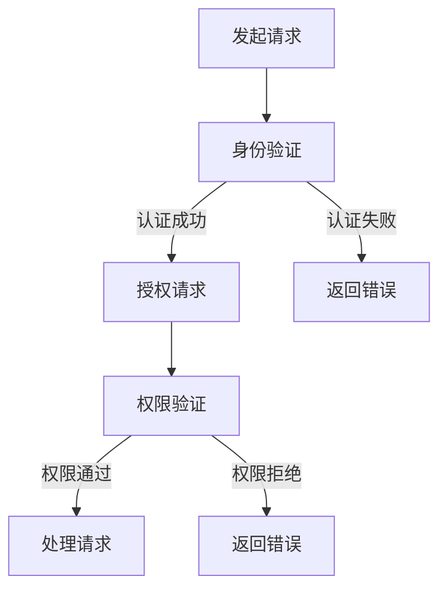

                 

# API 安全和认证机制

> 关键词：API安全、认证机制、OAuth、JWT、SSL/TLS、安全最佳实践
> 
> 摘要：本文将深入探讨API安全和认证机制，涵盖API安全的核心概念、认证机制的工作原理和实际应用，以及如何通过SSL/TLS等安全措施来保障API通信的安全性。通过本文的阅读，读者将掌握API安全和认证机制的全面知识，并能够有效地实施这些措施来保护他们的API服务。

## 1. 背景介绍

### 1.1 目的和范围

本文旨在为开发者、架构师和安全专家提供一个全面且深入的了解，关于API（应用程序编程接口）安全和认证机制的原理、技术和最佳实践。随着互联网和移动应用的迅猛发展，API已成为现代软件开发的关键组成部分，因此保障API的安全和正确认证变得尤为重要。

### 1.2 预期读者

- 对API开发和维护有基本了解的开发人员
- 担任API服务的架构师和安全专家
- 对API安全和认证感兴趣的技术爱好者

### 1.3 文档结构概述

本文分为以下章节：
1. 背景介绍
2. 核心概念与联系
3. 核心算法原理 & 具体操作步骤
4. 数学模型和公式 & 详细讲解 & 举例说明
5. 项目实战：代码实际案例和详细解释说明
6. 实际应用场景
7. 工具和资源推荐
8. 总结：未来发展趋势与挑战
9. 附录：常见问题与解答
10. 扩展阅读 & 参考资料

### 1.4 术语表

#### 1.4.1 核心术语定义

- **API（应用程序编程接口）**：一种接口，允许不同软件之间进行交互和通信。
- **认证（Authentication）**：验证用户的身份，确保只有授权用户才能访问受保护的资源。
- **授权（Authorization）**：确定授权用户能够执行哪些操作或访问哪些资源。
- **OAuth**：一个开放标准授权协议，允许用户授权第三方应用访问他们存储在另一服务提供者上的信息，而不需要分享用户账户的用户名和密码。
- **JWT（JSON Web Token）**：一种基于JSON的开放标准，用于在客户端和服务端之间传递安全信息。
- **SSL/TLS**：用于在互联网上进行安全通信的协议，确保数据在传输过程中的机密性和完整性。

#### 1.4.2 相关概念解释

- **身份验证（Authentication）**：通过验证用户名和密码、指纹或其他凭证来确认用户的身份。
- **授权（Authorization）**：确定经过身份验证的用户具有访问特定资源的权限。
- **加密（Encryption）**：将数据转换成密文，以防止未经授权的人员读取。
- **散列（Hashing）**：将数据转换成固定长度的字符串，用于验证数据的完整性和一致性。
- **会话管理（Session Management）**：跟踪用户会话的状态，确保用户在会话期间的身份和权限。

#### 1.4.3 缩略词列表

- **API**：应用程序编程接口（Application Programming Interface）
- **OAuth**：开放授权（Open Authorization）
- **JWT**：JSON Web Token
- **SSL**：安全套接层（Secure Sockets Layer）
- **TLS**：传输层安全（Transport Layer Security）

## 2. 核心概念与联系

在深入了解API安全和认证机制之前，我们需要了解一些核心概念及其相互关系。

### 2.1 API 安全性

API 安全性涉及保护API免受各种攻击，如SQL注入、跨站脚本（XSS）和跨站请求伪造（CSRF）等。确保API安全的关键措施包括：

- 数据验证和净化
- 使用加密和散列函数保护敏感数据
- 实施访问控制和身份验证机制

### 2.2 认证与授权

认证是验证用户身份的过程，而授权是确定用户权限的过程。常见的认证机制包括：

- 基于用户名和密码的认证
- OAuth 2.0 和 JWT
- 单点登录（SSO）

授权机制通常与认证机制结合使用，以确保只有经过认证的用户才能执行特定的操作。

### 2.3 安全协议

安全协议如SSL/TLS用于确保API通信的安全性。这些协议提供以下功能：

- 数据加密：确保数据在传输过程中不被窃取或篡改。
- 认证：验证通信双方的合法性。
- 完整性：确保数据在传输过程中未被修改。

### 2.4 Mermaid 流程图

以下是一个简化的API安全与认证流程的Mermaid流程图：



此流程图展示了用户发起请求后，系统首先进行身份验证，然后根据认证结果决定是否进行权限验证，并最终处理请求或返回错误。

## 3. 核心算法原理 & 具体操作步骤

在本节中，我们将详细介绍API认证机制中的核心算法原理和具体操作步骤。

### 3.1 OAuth 2.0

OAuth 2.0 是一种广泛使用的开放标准授权协议，用于允许第三方应用程序代表用户访问他们存储在其他服务提供者上的信息。以下是OAuth 2.0 的工作流程：

#### 3.1.1 OAuth 2.0 工作流程

1. **注册客户端和应用**：客户端需要在服务提供商（如GitHub、Google或Facebook）上注册，以获取客户端ID和客户端密钥。
2. **认证用户**：客户端引导用户到服务提供商的身份验证页面，用户在此页面登录并同意授权。
3. **获取访问令牌**：服务提供商向客户端颁发访问令牌，这是一个临时票据，用于代表用户身份。
4. **访问受保护资源**：客户端使用访问令牌向服务提供商发起请求，以访问受保护的资源。

#### 3.1.2 OAuth 2.0 伪代码

```python
# 客户端请求访问令牌
client_id = "your_client_id"
client_secret = "your_client_secret"
authorization_url = f"https://service_provider.com/oauth/authorize?client_id={client_id}"

# 用户登录并同意授权
response = requests.get(authorization_url)

# 服务提供商颁发访问令牌
token_url = "https://service_provider.com/oauth/token"
params = {
    "grant_type": "authorization_code",
    "code": code_from_response,
    "redirect_uri": "your_redirect_uri",
    "client_id": client_id,
    "client_secret": client_secret,
}
token_response = requests.post(token_url, params=params)
access_token = token_response.json()["access_token"]

# 使用访问令牌访问受保护资源
resource_url = "https://service_provider.com/resource"
headers = {
    "Authorization": f"Bearer {access_token}",
}
resource_response = requests.get(resource_url, headers=headers)
```

### 3.2 JWT

JSON Web Token（JWT）是一种基于JSON的开放标准，用于在客户端和服务端之间传递安全信息。以下是JWT的工作流程：

#### 3.2.1 JWT 工作流程

1. **生成JWT**：客户端或服务器生成JWT，其中包含用户身份和权限信息。
2. **分发JWT**：生成的JWT被发送到客户端，通常作为HTTP请求的头部。
3. **验证JWT**：服务器在处理请求时验证JWT的有效性，确保请求者具有访问受保护资源的权限。

#### 3.2.2 JWT 伪代码

```java
// 生成JWT
String jwt = Jwts.builder()
    .setSubject("user_id")
    .setExpiration(new Date(System.currentTimeMillis() + 3600000))
    .signWith(SignatureAlgorithm.HS512, "your_secret_key")
    .compact();

// 分发JWT
response.setHeader("Authorization", "Bearer " + jwt);

// 验证JWT
String jwtFromRequest = request.getHeader("Authorization").substring(7);
Claims claims = Jwts.parser()
    .setSigningKey("your_secret_key")
    .parseClaimsJws(jwtFromRequest)
    .getBody();
if (claims.getExpiration().before(new Date())) {
    // JWT已过期
} else {
    // JWT有效，继续处理请求
}
```

### 3.3 SSL/TLS

SSL/TLS 是一种用于确保互联网通信安全的安全协议，其工作原理如下：

#### 3.3.1 SSL/TLS 工作流程

1. **客户端请求**：客户端向服务器发送一个SSL/TLS握手请求。
2. **服务器响应**：服务器发送其证书，证明其身份。
3. **证书验证**：客户端验证服务器证书的有效性。
4. **加密通信**：客户端和服务器使用协商的加密算法和密钥开始加密通信。

#### 3.3.2 SSL/TLS 伪代码

```java
// 客户端请求
ClientHello client_hello = new ClientHello();
ssl_context.write(client_hello);

// 服务器响应
ServerHello server_hello = ssl_context.read(ServerHello.class);
ssl_context.write(server_hello);

// 证书验证
X509Certificate[] certificates = server_hello.getCertificates();
for (X509Certificate certificate : certificates) {
    if (!certificateValidator.validate(certificate)) {
        // 证书无效
    }
}

// 加密通信
while (true) {
    Object message = ssl_context.read();
    if (message instanceof CloseNotify) {
        break;
    }
    ssl_context.write(processMessage(message));
}
```

## 4. 数学模型和公式 & 详细讲解 & 举例说明

在API安全和认证机制中，数学模型和公式扮演着关键角色。以下是一些常用的数学模型和公式的详细讲解以及实际应用示例。

### 4.1 加密算法

加密算法是确保数据在传输过程中不被窃取或篡改的核心技术。以下是一些常用的加密算法及其公式：

#### 4.1.1 对称加密算法

对称加密算法使用相同的密钥对数据进行加密和解密。常见的对称加密算法有AES和DES。

- **AES（Advanced Encryption Standard）**
  - 公式：`C = E(K, P)`
  - 其中，C是加密后的数据，K是密钥，P是明文数据。
  - 示例：使用AES加密算法将字符串"Hello World!"加密为密文。

```java
SecretKey secretKey = KeyGenerator.getInstance("AES").generateKey();
Cipher cipher = Cipher.getInstance("AES");
cipher.init(Cipher.ENCRYPT_MODE, secretKey);
byte[] encryptedData = cipher.doFinal("Hello World!".getBytes());
```

- **DES（Data Encryption Standard）**
  - 公式：`C = E(K, P)`
  - 其中，C是加密后的数据，K是密钥，P是明文数据。
  - 示例：使用DES加密算法将字符串"Hello World!"加密为密文。

```java
SecretKey secretKey = KeyGenerator.getInstance("DES").generateKey();
Cipher cipher = Cipher.getInstance("DES");
cipher.init(Cipher.ENCRYPT_MODE, secretKey);
byte[] encryptedData = cipher.doFinal("Hello World!".getBytes());
```

#### 4.1.2 非对称加密算法

非对称加密算法使用一对密钥（公钥和私钥）进行加密和解密。常见的非对称加密算法有RSA和ECC。

- **RSA**
  - 公式：`C = E(Pk, M)`
  - 其中，C是加密后的数据，Pk是公钥，M是明文数据。
  - 示例：使用RSA加密算法将字符串"Hello World!"加密为密文。

```java
KeyPair keyPair = KeyPairGenerator.getInstance("RSA").generateKeyPair();
PublicKey publicKey = keyPair.getPublic();
Cipher cipher = Cipher.getInstance("RSA");
cipher.init(Cipher.ENCRYPT_MODE, publicKey);
byte[] encryptedData = cipher.doFinal("Hello World!".getBytes());
```

- **ECC（Elliptic Curve Cryptography）**
  - 公式：`C = E(Pk, M)`
  - 其中，C是加密后的数据，Pk是公钥，M是明文数据。
  - 示例：使用ECC加密算法将字符串"Hello World!"加密为密文。

```java
KeyPair keyPair = KeyPairGenerator.getInstance("EC").generateKeyPair();
PublicKey publicKey = keyPair.getPublic();
Cipher cipher = Cipher.getInstance("EC");
cipher.init(Cipher.ENCRYPT_MODE, publicKey);
byte[] encryptedData = cipher.doFinal("Hello World!".getBytes());
```

### 4.2 散列函数

散列函数用于将数据转换为固定长度的字符串，以验证数据的完整性和一致性。常见散列函数有MD5、SHA-1和SHA-256。

- **MD5**
  - 公式：`H(M) = MD5(M)`
  - 其中，H(M)是散列值，M是明文数据。
  - 示例：使用MD5散列函数计算字符串"Hello World!"的散列值。

```java
MessageDigest md = MessageDigest.getInstance("MD5");
byte[] hash = md.digest("Hello World!".getBytes());
String hexHash = Hex.encodeHexString(hash);
```

- **SHA-1**
  - 公式：`H(M) = SHA-1(M)`
  - 其中，H(M)是散列值，M是明文数据。
  - 示例：使用SHA-1散列函数计算字符串"Hello World!"的散列值。

```java
MessageDigest md = MessageDigest.getInstance("SHA-1");
byte[] hash = md.digest("Hello World!".getBytes());
String hexHash = Hex.encodeHexString(hash);
```

- **SHA-256**
  - 公式：`H(M) = SHA-256(M)`
  - 其中，H(M)是散列值，M是明文数据。
  - 示例：使用SHA-256散列函数计算字符串"Hello World!"的散列值。

```java
MessageDigest md = MessageDigest.getInstance("SHA-256");
byte[] hash = md.digest("Hello World!".getBytes());
String hexHash = Hex.encodeHexString(hash);
```

### 4.3 数字签名

数字签名用于验证数据的完整性和来源。常见的数字签名算法有RSA和ECDSA。

- **RSA 数字签名**
  - 公式：`S = SIG(Pk, H(M))`
  - 其中，S是签名，Pk是公钥，H(M)是数据的散列值。
  - 示例：使用RSA数字签名算法对字符串"Hello World!"进行签名。

```java
Signature signature = Signature.getInstance("RSA");
signature.initSign(privateKey);
signature.update("Hello World!".getBytes());
byte[] signatureBytes = signature.sign();
```

- **ECDSA 数字签名**
  - 公式：`S = SIG(Pk, H(M))`
  - 其中，S是签名，Pk是公钥，H(M)是数据的散列值。
  - 示例：使用ECDSA数字签名算法对字符串"Hello World!"进行签名。

```java
Signature signature = Signature.getInstance("ECDSA");
signature.initSign(privateKey);
signature.update("Hello World!".getBytes());
byte[] signatureBytes = signature.sign();
```

## 5. 项目实战：代码实际案例和详细解释说明

在本节中，我们将通过一个实际项目案例，展示如何在实际环境中实现API安全与认证机制。我们将使用Spring Boot框架来创建一个简单的RESTful API，并使用OAuth 2.0和JWT进行认证和授权。

### 5.1 开发环境搭建

- JDK 1.8或更高版本
- Maven 3.6或更高版本
- Spring Boot 2.5.5或更高版本
- Spring Security OAuth 2.4.2或更高版本
- JWT 0.11.5或更高版本

### 5.2 源代码详细实现和代码解读

#### 5.2.1 项目结构

```yaml
src/
|-- main/
    |-- java/
        |-- com/
            |-- example/
                |-- api/
                    |-- Application.java
                    |-- UserController.java
                |-- config/
                    |-- SecurityConfig.java
                    |-- OAuth2Config.java
                    |-- JwtConfig.java
    |-- resources/
        |-- application.properties
```

#### 5.2.2 应用程序入口

`Application.java`：

```java
@SpringBootApplication
public class Application {
    public static void main(String[] args) {
        SpringApplication.run(Application.class, args);
    }
}
```

#### 5.2.3 安全配置

`SecurityConfig.java`：

```java
@Configuration
@EnableWebSecurity
public class SecurityConfig extends WebSecurityConfigurerAdapter {
    @Override
    protected void configure(HttpSecurity http) throws Exception {
        http
            .authorizeRequests()
                .antMatchers("/api/user/**").authenticated()
                .anyRequest().permitAll()
            .and()
                .oauth2Login();
    }

    @Override
    protected void configure(AuthenticationManagerBuilder auth) throws Exception {
        auth
            .inMemoryAuthentication()
                .withUser("user").password("{noop}password").authorities("ROLE_USER");
    }
}
```

#### 5.2.4 OAuth 2.0 配置

`OAuth2Config.java`：

```java
@Configuration
@EnableAuthorizationCodeAuthorizationServer
public class OAuth2Config extends AuthorizationServerConfigurerAdapter {
    @Override
    public void configure(ClientDetailsService clientDetailsService) throws Exception {
        clientDetailsService
            .setClientDetailsClientSpec(new ClientDetailsClientSpec()
                .clientId("client_id")
                .clientSecret("client_secret")
                .authorizedGrantTypes("authorization_code")
                .redirectUri("http://localhost:8080/login/oauth2/code/client_id"));
    }

    @Override
    public void configure(AuthorizationServerEndpointsConfigurer endpoints) throws Exception {
        endpoints
            .userDetailsService(userDetailsService)
            .authorizationCodeServices(new InMemoryAuthorizationCodeServices());
    }
}
```

#### 5.2.5 JWT 配置

`JwtConfig.java`：

```java
@Configuration
@EnableGlobalMethodSecurity(prePostEnabled = true)
public class JwtConfig extends WebSecurityConfigurerAdapter {
    @Override
    protected void configure(HttpSecurity http) throws Exception {
        http
            .authorizeRequests()
                .antMatchers("/api/user/**").authenticated()
                .anyRequest().permitAll()
            .and()
                .addFilterBefore(new JwtAuthenticationFilter(authenticationManager()), UsernamePasswordAuthenticationFilter.class);
    }

    @Bean
    public JwtAuthenticationProvider jwtAuthenticationProvider() {
        return new JwtAuthenticationProvider(jwtTokenizer);
    }

    @Bean
    public JwtTokenizer jwtTokenizer() {
        return new JwtTokenizer("your_jwt_secret_key");
    }
}
```

#### 5.2.6 用户控制器

`UserController.java`：

```java
@RestController
@RequestMapping("/api/user")
public class UserController {
    @GetMapping("/{id}")
    @PreAuthorize("hasAuthority('ROLE_USER')")
    public ResponseEntity<User> getUserById(@PathVariable Long id) {
        // 查询用户并返回
        User user = userService.findById(id);
        return ResponseEntity.ok(user);
    }
}
```

### 5.3 代码解读与分析

#### 5.3.1 应用程序入口

`Application.java`是Spring Boot应用程序的入口点，通过`SpringApplication.run()`方法启动应用程序。

#### 5.3.2 安全配置

`SecurityConfig.java`配置了Spring Security的安全策略，其中包括：

- 请求授权规则：`/api/user/**`需要认证，其他请求允许匿名访问。
- OAuth 2.0 登录配置。

#### 5.3.3 OAuth 2.0 配置

`OAuth2Config.java`配置了OAuth 2.0授权服务器，包括客户端详情服务和授权码服务。

#### 5.3.4 JWT 配置

`JwtConfig.java`配置了JWT认证过滤器，用于验证JWT令牌的有效性。

#### 5.3.5 用户控制器

`UserController.java`是一个简单的RESTful控制器，用于处理与用户相关的请求。使用`@PreAuthorize`注解确保只有经过认证的用户才能访问特定请求。

## 6. 实际应用场景

API安全和认证机制在实际开发中有着广泛的应用。以下是一些常见的应用场景：

### 6.1 第三方集成

API认证机制允许第三方应用程序访问您的服务，从而实现功能扩展和生态系统构建。例如，社交媒体平台通过OAuth 2.0认证允许第三方应用程序访问用户数据。

### 6.2 微服务架构

在微服务架构中，API安全和认证机制用于确保服务之间的通信安全，保护服务端点免受未授权访问。

### 6.3 移动应用

移动应用通常通过OAuth 2.0或JWT实现用户认证，以便用户可以在多个设备上安全地访问应用程序。

### 6.4 云服务和物联网

云服务和物联网设备通常使用API进行数据交换，API安全和认证机制确保数据传输的安全性和完整性。

## 7. 工具和资源推荐

### 7.1 学习资源推荐

#### 7.1.1 书籍推荐

- 《API设计：创建可用的RESTful Web服务》
- 《OAuth 2.0：实用指南》
- 《JSON Web Token（JWT）权威指南》

#### 7.1.2 在线课程

- Coursera上的“Web安全基础”课程
- Udemy上的“API安全和认证：从入门到专家”课程

#### 7.1.3 技术博客和网站

- OWASP API安全项目（https://owasp.org/www-project-api-security/）
- Spring Security官方文档（https://spring.io/guides/gs/authenticating-external-client/）

### 7.2 开发工具框架推荐

#### 7.2.1 IDE和编辑器

- IntelliJ IDEA
- Visual Studio Code

#### 7.2.2 调试和性能分析工具

- Postman
- JMeter

#### 7.2.3 相关框架和库

- Spring Security OAuth 2.0（https://github.com/spring-projects/spring-security-oauth）
- JSON Web Token（JWT）库（https://github.com/nimbusdotcom/keycloak）

### 7.3 相关论文著作推荐

#### 7.3.1 经典论文

- "OAuth 2.0 Authorization Framework"（RFC 6749）
- "JSON Web Token (JWT)"（RFC 7519）

#### 7.3.2 最新研究成果

- "Secure API Design Principles"（https://owasp.org/www-community/attacks/secure_api_design_principles）
- "Introducing OAuth 2.1"（https://www.ietf.org/archive/id/draft-ietf-oauth-oauth-11.html）

#### 7.3.3 应用案例分析

- "How Netflix Secures Its API"（https://netflixtechblog.com/how-netflix-secures-its-api-8944a68d9e3e）
- "Building a Secure and Scalable API with AWS"（https://aws.amazon.com/blogs/developer/building-a-secure-and-scalable-api-with-aws/）

## 8. 总结：未来发展趋势与挑战

随着API和微服务的广泛应用，API安全和认证机制将在未来继续发展，面临以下趋势和挑战：

### 8.1 发展趋势

- **零信任架构**：越来越多的组织采用零信任架构，要求严格的API认证和授权。
- **自动化和AI**：使用自动化和AI技术进行安全测试和威胁检测。
- **标准化**：OAuth 2.0、JWT等标准将在API安全领域得到更广泛的应用。

### 8.2 挑战

- **安全性与便利性的平衡**：在确保API安全的同时，提供便捷的用户体验。
- **隐私保护**：随着隐私法规的加强，API安全和隐私保护之间的平衡将变得更加重要。
- **攻击手段的多样化**：攻击者将不断尝试新的攻击手段，对API进行攻击。

## 9. 附录：常见问题与解答

### 9.1 什么是OAuth 2.0？

OAuth 2.0 是一种开放标准授权协议，允许第三方应用程序代表用户访问他们存储在其他服务提供者上的信息，而不需要分享用户账户的用户名和密码。

### 9.2 JWT 和 OAuth 2.0 有何区别？

JWT（JSON Web Token）是一种基于JSON的开放标准，用于在客户端和服务端之间传递安全信息。OAuth 2.0 是一种授权协议，用于允许第三方应用程序访问用户资源。JWT 通常用于OAuth 2.0 的令牌传递。

### 9.3 什么是SSL/TLS？

SSL/TLS 是一种用于在互联网上进行安全通信的协议，确保数据在传输过程中的机密性和完整性。SSL（安全套接层）和TLS（传输层安全）是同一协议的不同版本。

## 10. 扩展阅读 & 参考资料

- [OAuth 2.0 官方文档](https://www.ietf.org/rfc/rfc6749.txt)
- [JSON Web Token（JWT）官方文档](https://www.ietf.org/rfc/rfc7519.txt)
- [OWASP API安全项目](https://owasp.org/www-project-api-security/)
- [Spring Security OAuth 2.0 文档](https://docs.spring.io/spring-security/oauth2/oauth2.html)
- [API设计：创建可用的RESTful Web服务](https://www.apress.com/us/book/9781484239612)
- [OAuth 2.0：实用指南](https://www.amazon.com/OAuth-20-Practical-Guide-Second/dp/1492034727)
- [JSON Web Token（JWT）权威指南](https://www.amazon.com/JSON-Web-Token-Authoritative-Guide/dp/1484246863)
- [Netflix Tech Blog：How Netflix Secures Its API](https://netflixtechblog.com/how-netflix-secures-its-api-8944a68d9e3e)  
- [AWS Developer Blog：Building a Secure and Scalable API with AWS](https://aws.amazon.com/blogs/developer/building-a-secure-and-scalable-api-with-aws/)  
- [OWASP API Security Project：API Security Cheat Sheet](https://owasp.org/www-project-api-security/cheatsheet/)  
- [API Design Principles](https://owasp.org/www-community/attacks/secure_api_design_principles)

---

**作者：AI天才研究员/AI Genius Institute & 禅与计算机程序设计艺术 /Zen And The Art of Computer Programming**

本文旨在提供关于API安全和认证机制的全面概述，包括核心概念、工作原理、实际应用以及未来发展趋势。希望本文对您在API安全和认证领域的学习和研究有所帮助。如果您有任何疑问或建议，欢迎在评论区留言讨论。**

