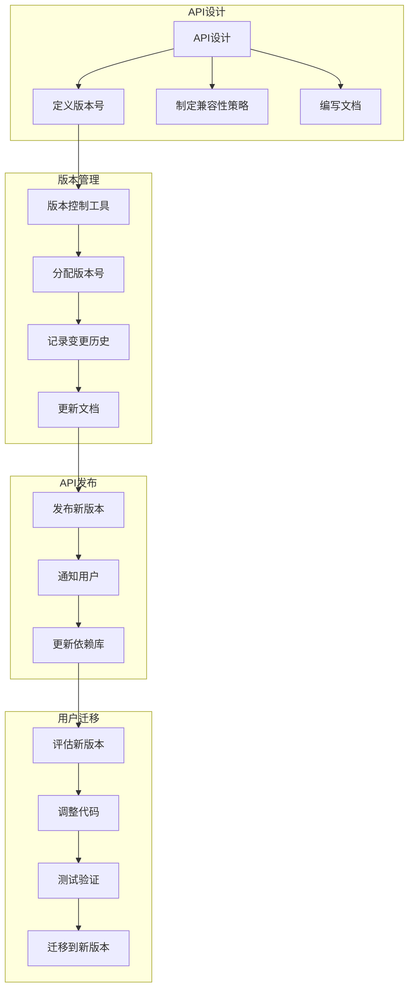

                 

# API 版本控制的重要性

> **关键词**：API、版本控制、API设计、架构、互操作性、兼容性、微服务、REST、GraphQL、自动化测试

> **摘要**：随着微服务架构的普及和API接口的广泛应用，API版本控制成为确保系统稳定性和可维护性的关键因素。本文将深入探讨API版本控制的重要性，分析其核心概念、设计原则以及实际应用场景，并提供相关的开发工具和资源推荐，旨在帮助开发者理解和实践API版本控制的最佳实践。

## 1. 背景介绍

### 1.1 目的和范围

本文旨在探讨API版本控制的重要性，通过分析其核心概念、设计原则和实际应用场景，帮助开发者更好地理解和应用API版本控制，以提升系统的稳定性和可维护性。

本文将涵盖以下主题：

1. API版本控制的定义和背景。
2. API版本控制的设计原则。
3. API版本控制的实际应用场景。
4. 开发工具和资源推荐。
5. API版本控制的前景和挑战。

### 1.2 预期读者

本文适合以下读者群体：

1. API开发者：了解API版本控制的基本概念和实践方法，以提升API设计的质量。
2. 系统架构师：掌握API版本控制在系统架构设计中的应用，确保系统的稳定性和互操作性。
3. 项目经理：了解API版本控制对项目进度和风险控制的影响，更好地管理项目。
4. 技术爱好者：对API版本控制感兴趣的读者，希望通过本文了解该领域的最新动态和最佳实践。

### 1.3 文档结构概述

本文将按照以下结构进行组织：

1. 背景介绍：介绍API版本控制的重要性、预期读者和文档结构。
2. 核心概念与联系：阐述API版本控制的核心概念，提供Mermaid流程图辅助理解。
3. 核心算法原理 & 具体操作步骤：详细讲解API版本控制的算法原理和操作步骤，使用伪代码进行说明。
4. 数学模型和公式 & 详细讲解 & 举例说明：介绍API版本控制的数学模型和公式，并通过实际案例进行说明。
5. 项目实战：通过实际代码案例，展示API版本控制的实现过程和要点。
6. 实际应用场景：分析API版本控制在不同应用场景中的具体应用。
7. 工具和资源推荐：推荐相关学习资源、开发工具和框架。
8. 总结：展望API版本控制的发展趋势与挑战。
9. 附录：常见问题与解答。
10. 扩展阅读 & 参考资料：提供相关扩展阅读资料和参考文献。

### 1.4 术语表

#### 1.4.1 核心术语定义

- **API**：应用程序接口（Application Programming Interface），允许不同软件之间通过定义好的接口进行交互。
- **版本控制**：对软件系统中的代码、配置、文档等进行版本管理，以便追踪变更历史和快速回滚。
- **API版本**：对API接口的一次特定实现，通常包含功能变更、接口重构等。
- **兼容性**：新版本API与旧版本API能够相互工作，确保系统平稳过渡。
- **互操作性**：不同系统之间能够通过API接口进行有效通信和协同工作。

#### 1.4.2 相关概念解释

- **微服务**：一种架构风格，将应用程序划分为多个独立、可复用的小服务，以提高系统的可维护性和伸缩性。
- **REST**：一种基于HTTP协议的API设计风格，强调资源的表示状态转移。
- **GraphQL**：一种查询语言和服务器运行时，用于执行数据检索，相较于REST更灵活、高效。

#### 1.4.3 缩略词列表

- **API**：应用程序接口（Application Programming Interface）
- **REST**：表现状态转移（Representational State Transfer）
- **GraphQL**：通用查询语言（GraphQL）

## 2. 核心概念与联系

在深入了解API版本控制之前，我们需要先理解一些核心概念和它们之间的关系。

### 2.1 API版本控制的核心概念

- **API版本**：API版本是对API接口的一次特定实现，通常包含功能变更、接口重构等。版本号的格式可以采用`MAJOR.MINOR.PATCH`的形式，其中：

  - `MAJOR`版本号：表示重大变更，例如架构重构、核心功能添加或删除。
  - `MINOR`版本号：表示功能增强、改进和新增接口。
  - `PATCH`版本号：表示修复bug、优化性能等微小更改。

- **兼容性**：新版本API与旧版本API能够相互工作，确保系统平稳过渡。兼容性分为以下几种：

  - **向前兼容**：新版本API能够兼容旧版本API的调用方式，无需修改客户端代码。
  - **向后兼容**：新版本API能够兼容旧版本API的调用方式，但旧版本API可能无法兼容新版本API。
  - **不兼容**：新版本API与旧版本API不兼容，需要进行代码调整。

- **版本管理**：对API版本进行管理，包括版本号的分配、变更记录和文档更新。版本管理可以采用集中式或分布式的方式。

### 2.2 API版本控制与相关概念的关系

- **API版本控制**与**微服务**的关系：微服务架构下，每个微服务都有自己的API版本控制机制，以便独立部署、扩展和维护。API版本控制确保微服务之间能够稳定通信和协同工作。
- **API版本控制**与**REST**的关系：RESTful API通常采用版本控制，以区分不同功能的实现版本。版本号通常作为URL的一部分，例如`/api/v1/endpoint`。
- **API版本控制**与**GraphQL**的关系：GraphQL API可以通过版本控制来管理不同查询语法的变更。版本号可以嵌入到查询语句中，例如`query { v1: field }`。

### 2.3 API版本控制的 Mermaid 流程图

以下是一个简化的API版本控制的Mermaid流程图，用于帮助理解API版本控制的核心流程和概念：



该流程图展示了API版本控制的主要步骤，包括API设计、版本管理、API发布和用户迁移。通过该流程，开发者可以更好地理解API版本控制的原理和实践。

## 3. 核心算法原理 & 具体操作步骤

API版本控制的核心算法原理是基于版本号的有序管理。以下是一个简化的伪代码，用于说明API版本控制的具体操作步骤：

```pseudo
// 定义版本号格式
VERSION_FORMAT = "MAJOR.MINOR.PATCH"

// 定义版本变更策略
CHANGES_STRATEGY = {
    "MAJOR": ["架构重构", "功能大变动"],
    "MINOR": ["新增功能", "性能优化"],
    "PATCH": ["修复bug", "代码优化"]
}

// 初始化版本号
MAJOR = 1
MINOR = 0
PATCH = 0

// 生成新版本号
function generateNewVersion():
    global MAJOR, MINOR, PATCH
    if isMajorChange():
        MAJOR += 1
        MINOR = 0
        PATCH = 0
    elif isMinorChange():
        MINOR += 1
        PATCH = 0
    else:
        PATCH += 1

    return formatVersion(MAJOR, MINOR, PATCH)

// 格式化版本号
function formatVersion(MAJOR, MINOR, PATCH):
    return f"{MAJOR}.{MINOR}.{PATCH}"

// 判断是否进行重大变更
function isMajorChange():
    return userDecision(CHANGE_STRATEGY["MAJOR"])

// 判断是否进行功能变更
function isMinorChange():
    return userDecision(CHANGE_STRATEGY["MINOR"])

// 判断是否进行微小变更
function isPatchChange():
    return userDecision(CHANGE_STRATEGY["PATCH"])

// 用户决策
function userDecision(changes):
    # 实现用户决策逻辑，例如通过投票、评估等方式确定变更类型
    return decision

// 版本号管理示例
MAJOR = 1
MINOR = 0
PATCH = 0

# 生成新版本号
newVersion = generateNewVersion()

# 输出新版本号
print(f"新版本号：{newVersion}")
```

该伪代码定义了版本号格式、版本变更策略和版本号生成函数。开发者可以根据具体需求，调整版本变更策略和决策逻辑。通过该伪代码，开发者可以更好地理解API版本控制的核心算法原理和具体操作步骤。

### 3.1 版本号格式和命名规范

API版本号的格式通常采用`MAJOR.MINOR.PATCH`的形式，其中：

- `MAJOR`版本号：表示重大变更，例如架构重构、功能大变动。
- `MINOR`版本号：表示功能增强、改进和新增接口。
- `PATCH`版本号：表示修复bug、性能优化等微小变更。

这种版本号格式有助于明确区分不同类型的变更，便于开发者和管理人员理解和追踪。在实际应用中，还可以根据项目需求，自定义版本号格式和命名规范。

### 3.2 版本变更策略

版本变更策略是指确定版本号的变更类型（MAJOR、MINOR或PATCH）的方法。以下是一些常见的版本变更策略：

1. **基于代码库的变更**：根据代码库的提交历史，判断变更类型。例如，如果代码库中新增了核心功能或重构了架构，则认为是MAJOR版本变更；如果新增了功能或优化了性能，则认为是MINOR版本变更；如果修复了bug或优化了代码，则认为是PATCH版本变更。
2. **基于用户反馈**：根据用户反馈和需求，判断变更类型。例如，如果用户提出了核心功能的需求，则认为是MAJOR版本变更；如果用户提出了改进意见或功能需求，则认为是MINOR版本变更；如果用户提出了bug报告，则认为是PATCH版本变更。
3. **基于评估和投票**：通过评估和投票确定变更类型。例如，在项目团队内部进行评估和投票，根据多数意见确定变更类型。

### 3.3 版本号生成函数

版本号生成函数用于生成新的版本号。以下是一个简化的Python示例，用于生成新的版本号：

```python
def generate_new_version(major, minor, patch):
    if major == 0 and minor == 0 and patch == 0:
        major = 1
    elif minor == 0 and patch == 0:
        minor += 1
    elif patch == 0:
        patch += 1
    else:
        major += 1
        minor = 0
        patch = 0

    return f"{major:02d}.{minor:02d}.{patch:02d}"

# 示例：生成新版本号
current_version = "1.0.0"
new_version = generate_new_version(*map(int, current_version.split('.')))
print(f"新版本号：{new_version}")
```

该示例根据当前版本号生成新的版本号，并打印新版本号。在实际应用中，可以根据项目需求和版本变更策略，调整版本号生成函数的实现。

## 4. 数学模型和公式 & 详细讲解 & 举例说明

在API版本控制中，数学模型和公式有助于我们更准确地描述版本号的变更过程。以下是一个简化的数学模型，用于描述版本号的变化。

### 4.1 数学模型

设`V = MAJOR + MINOR/100 + PATCH/10000`，其中`MAJOR`、`MINOR`和`PATCH`分别为版本号的整数部分、十位数和百位数。

该数学模型将版本号表示为一个实数，便于计算和比较。例如：

- `V1.0.0`表示为`1 + 0/100 + 0/10000 = 1.0000`
- `1.1.0`表示为`1 + 1/100 + 0/10000 = 1.0100`
- `1.0.1`表示为`1 + 0/100 + 1/10000 = 1.0010`

### 4.2 公式推导

为了推导出该数学模型，我们可以将版本号表示为以下形式：

- `MAJOR`：版本号的整数部分，表示重大变更。
- `MINOR`：版本号的十位数，表示功能增强或改进。
- `PATCH`：版本号的百位数，表示微小变更。

根据这些定义，我们可以将版本号表示为一个实数：

- `MAJOR`：表示为`1 * 10000`
- `MINOR`：表示为`(MINOR - 1) * 10`
- `PATCH`：表示为`PATCH`

将这些部分相加，得到版本号表示为：

\[ V = 10000 * MAJOR + 10 * MINOR + PATCH \]

为了便于计算和比较，我们将版本号表示为：

\[ V = MAJOR + \frac{MINOR}{100} + \frac{PATCH}{10000} \]

### 4.3 举例说明

#### 示例1：版本号 `1.0.0`

将`MAJOR`、`MINOR`和`PATCH`代入数学模型，得到：

\[ V = 1 + \frac{0}{100} + \frac{0}{10000} = 1.0000 \]

#### 示例2：版本号 `1.1.0`

将`MAJOR`、`MINOR`和`PATCH`代入数学模型，得到：

\[ V = 1 + \frac{1}{100} + \frac{0}{10000} = 1.0100 \]

#### 示例3：版本号 `1.0.1`

将`MAJOR`、`MINOR`和`PATCH`代入数学模型，得到：

\[ V = 1 + \frac{0}{100} + \frac{1}{10000} = 1.0010 \]

通过这个数学模型，我们可以更准确地计算和比较版本号。在实际应用中，开发者可以根据具体需求，调整数学模型和公式，以适应不同的版本控制策略。

### 4.4 应用场景

以下是一些API版本控制的应用场景：

1. **微服务架构**：在微服务架构中，每个微服务都有自己的API版本控制机制，以确保独立部署和维护。版本号用于标识不同功能的实现版本，便于追踪和回滚。
2. **项目迭代**：在项目迭代过程中，版本号用于区分不同阶段的实现，便于跟踪功能变更和问题修复。
3. **兼容性管理**：版本号用于确保新旧系统之间的兼容性，降低系统升级的风险。
4. **用户反馈**：版本号有助于记录用户反馈和问题报告，便于分析和优化系统。

通过这些应用场景，开发者可以更好地理解API版本控制的重要性和实际应用价值。

## 5. 项目实战：代码实际案例和详细解释说明

在本节中，我们将通过一个实际项目案例，展示API版本控制的实现过程和要点。该项目是一个简单的RESTful API，提供用户信息查询功能。我们将使用Python和Flask框架进行开发。

### 5.1 开发环境搭建

首先，确保已安装以下依赖：

- Python 3.x
- Flask
- Flask-RESTful

可以使用以下命令安装依赖：

```shell
pip install flask
pip install flask-restful
```

### 5.2 源代码详细实现和代码解读

以下是该项目的主要源代码，包括版本控制和API实现：

```python
# app.py

from flask import Flask, request
from flask_restful import Resource, Api

app = Flask(__name__)
api = Api(app)

# 用户信息数据
users = [
    {"id": 1, "name": "Alice", "email": "alice@example.com"},
    {"id": 2, "name": "Bob", "email": "bob@example.com"},
    {"id": 3, "name": "Charlie", "email": "charlie@example.com"},
]

# 版本控制
current_version = "1.0.0"

# API 路由和资源
class UserListResource(Resource):
    def get(self):
        global current_version
        if current_version.startswith("1."):
            return users
        else:
            return {"error": "不支持该版本号，请升级到最新版本。"}

class UserResource(Resource):
    def get(self, user_id):
        global current_version
        if current_version.startswith("1."):
            user = next((u for u in users if u["id"] == user_id), None)
            if user:
                return user
            else:
                return {"error": "用户不存在。"}
        else:
            return {"error": "不支持该版本号，请升级到最新版本。"}

# 添加API路由
api.add_resource(UserListResource, "/users")
api.add_resource(UserResource, "/users/<int:user_id>")

if __name__ == "__main__":
    app.run(debug=True)
```

#### 5.2.1 代码解读

- **用户信息数据**：我们使用一个简单的列表存储用户信息，实际项目中通常会使用数据库存储。
- **版本控制**：使用全局变量`current_version`存储当前版本号，根据版本号控制API的行为。
- **API 路由和资源**：定义两个API资源：`UserListResource`和`UserResource`，分别用于获取所有用户信息和特定用户信息。
- **版本控制逻辑**：在资源类的方法中，根据`current_version`判断是否支持当前版本号。如果支持，执行相应操作；否则返回错误信息。

#### 5.2.2 代码解读与分析

- **版本控制策略**：该示例使用简单的字符串比较判断版本号是否支持。实际项目中，可以采用更复杂的策略，例如正则表达式匹配或版本库（如 SemVer）。
- **API行为控制**：根据版本号，API可以返回不同的数据或错误信息。这有助于确保系统在升级过程中，新旧版本之间的兼容性和稳定性。
- **全局变量**：在该示例中，使用全局变量存储版本号。实际项目中，建议将版本号存储在配置文件或数据库中，以便更好地管理和维护。

### 5.3 代码解读与分析

通过该案例，我们可以看到API版本控制的基本实现过程。以下是该案例的一些关键点：

1. **版本控制策略**：使用版本号区分不同功能的实现版本，确保系统在不同版本之间能够平滑过渡。
2. **API行为控制**：根据版本号，API可以返回不同的数据或错误信息，确保系统在升级过程中，新旧版本之间的兼容性和稳定性。
3. **全局变量**：使用全局变量存储版本号，便于在代码中控制API行为。实际项目中，建议使用配置文件或数据库存储版本号，以提高系统的可维护性。

通过该案例，开发者可以更好地理解API版本控制的实现过程和要点，为实际项目中的版本控制提供参考。

## 6. 实际应用场景

API版本控制在实际应用中具有广泛的应用场景，以下是一些典型的应用场景：

### 6.1 微服务架构

在微服务架构中，API版本控制是确保服务之间兼容性和稳定性的关键。每个微服务都有自己的API版本，便于独立部署、扩展和维护。版本控制策略可以基于服务间的依赖关系和变更频率进行调整，以确保服务之间能够平滑过渡。

#### 6.1.1 场景描述

假设有一个电商平台，包含订单管理、库存管理和用户管理等微服务。在系统迭代过程中，订单管理服务新增了一个功能，用户管理服务进行了一些优化。为了确保系统稳定运行，我们可以采用以下版本控制策略：

1. **独立部署**：将订单管理服务和用户管理服务分别部署，确保每个服务独立运行。
2. **兼容性测试**：在部署新版本服务之前，对服务进行兼容性测试，确保新旧版本之间能够顺利交互。
3. **灰度发布**：逐步增加新版本服务的流量，观察系统运行情况，确保系统稳定后，完全切换到新版本。

#### 6.1.2 解决方案

1. **API版本控制**：为每个微服务定义版本号，例如`v1`、`v2`等。在服务接口中，根据版本号控制服务行为。
2. **配置管理**：使用配置管理工具（如Consul、etcd等）存储服务版本信息，便于管理和更新。
3. **自动化测试**：编写自动化测试脚本，对服务进行兼容性测试，确保服务升级过程中，能够及时发现和解决兼容性问题。

### 6.2 跨平台应用

在跨平台应用中，API版本控制有助于确保不同平台之间的兼容性。例如，一个移动应用需要同时支持iOS和Android平台，可以使用API版本控制策略，根据平台版本和功能需求，定制化API接口。

#### 6.2.1 场景描述

假设一个移动应用需要同时支持iOS和Android平台。在iOS平台中，新增了一个相机滤镜功能；在Android平台中，新增了一个地理位置功能。为了确保应用在不同平台之间能够兼容，我们可以采用以下版本控制策略：

1. **API分层**：为iOS和Android平台定义不同的API层，分别处理不同平台的功能。
2. **版本控制**：为每个平台版本定义版本号，例如iOS版本为`v1.0`，Android版本为`v1.1`。
3. **兼容性处理**：在API调用过程中，根据平台版本和功能需求，动态选择合适的API接口。

#### 6.2.2 解决方案

1. **API版本控制**：使用版本号区分不同平台版本的API，确保应用在不同平台之间能够兼容。
2. **平台适配层**：为每个平台定义适配层，处理平台特有功能，确保应用在不同平台之间能够无缝切换。
3. **自动化测试**：编写自动化测试脚本，对应用在不同平台之间的兼容性进行测试，确保应用在不同平台之间能够稳定运行。

### 6.3 项目迭代

在项目迭代过程中，API版本控制有助于确保系统在功能变更、bug修复和性能优化等过程中，能够平滑过渡。通过版本控制，可以更好地管理和追踪变更历史，降低系统升级风险。

#### 6.3.1 场景描述

假设一个在线教育平台在迭代过程中，新增了课程推荐功能，并对课程管理系统进行了一些优化。在系统升级过程中，我们需要确保：

1. **兼容性**：新版本API与旧版本API能够兼容，确保系统在升级过程中，能够正常运行。
2. **回滚**：在系统升级过程中，如果出现任何问题，能够快速回滚到旧版本，确保系统稳定运行。

#### 6.3.2 解决方案

1. **版本控制**：为每个迭代版本定义版本号，例如`v1.0`、`v1.1`等。在API接口中，根据版本号控制功能变更和接口行为。
2. **自动化测试**：编写自动化测试脚本，对每个迭代版本进行测试，确保系统在不同版本之间能够平滑过渡。
3. **文档更新**：及时更新API文档，记录每个版本的变更历史和功能说明，方便开发者和管理人员了解系统变更情况。

通过以上实际应用场景，我们可以看到API版本控制在不同场景中的具体应用和作用。在实际开发过程中，开发者可以根据具体需求和场景，灵活调整版本控制策略，确保系统的稳定性和可维护性。

## 7. 工具和资源推荐

为了帮助开发者更好地理解和实践API版本控制，以下推荐了一些学习资源、开发工具和框架。

### 7.1 学习资源推荐

#### 7.1.1 书籍推荐

1. **《API设计：原则、实践与最佳实践》**：详细介绍了API设计的原则和实践方法，包括版本控制的策略。
2. **《RESTful API设计（第2版）》**：探讨了RESTful API的设计方法和最佳实践，涉及版本控制的策略和实现。

#### 7.1.2 在线课程

1. **《API设计基础》**：网易云课堂提供的一门免费课程，涵盖API设计的基本概念和版本控制策略。
2. **《微服务架构与API设计》**：极客时间提供的一门实战课程，介绍了微服务架构下的API版本控制方法和最佳实践。

#### 7.1.3 技术博客和网站

1. **API Craft**：一个关于API设计和最佳实践的博客，包括版本控制的文章和案例。
2. **RESTful API Design Guide**：一篇关于RESTful API设计的指南，涵盖版本控制的策略和实现。

### 7.2 开发工具框架推荐

#### 7.2.1 IDE和编辑器

1. **Visual Studio Code**：一款轻量级但功能强大的IDE，支持多种编程语言，包括Python、JavaScript等，适合API开发。
2. **PyCharm**：一款专为Python开发者设计的IDE，提供丰富的API开发插件和工具。

#### 7.2.2 调试和性能分析工具

1. **Postman**：一款流行的API调试工具，支持版本控制和自动化测试。
2. **JMeter**：一款开源的性能测试工具，可以模拟大量API请求，评估系统性能和稳定性。

#### 7.2.3 相关框架和库

1. **Flask**：一款轻量级的Python Web框架，适合快速开发和部署API。
2. **Django**：一款全功能、高效的Python Web框架，支持版本控制和RESTful API设计。
3. **Spring Boot**：一款基于Java的Web框架，支持版本控制和微服务架构。

### 7.3 相关论文著作推荐

1. **《API设计原则》**：一篇关于API设计原则的论文，探讨了版本控制、接口设计等方面的最佳实践。
2. **《版本控制与API设计》**：一篇关于API版本控制的论文，分析了版本控制的策略和实现方法。

通过这些工具和资源的推荐，开发者可以更好地学习和实践API版本控制，提高系统的稳定性和可维护性。

## 8. 总结：未来发展趋势与挑战

API版本控制作为确保系统稳定性和可维护性的关键因素，在未来的发展中将面临以下趋势与挑战：

### 8.1 发展趋势

1. **自动化版本控制**：随着自动化工具和框架的发展，API版本控制将进一步自动化，减少手动操作，提高开发效率。
2. **版本控制智能化**：结合人工智能技术，版本控制将更智能地分析变更历史，预测潜在问题，优化版本策略。
3. **多语言版本控制**：支持多种编程语言和框架的版本控制，提高API开发的灵活性和可扩展性。
4. **社区协作与共享**：通过社区协作和共享版本控制经验，加速API开发与优化的过程。

### 8.2 挑战

1. **兼容性问题**：在版本变更过程中，如何确保新旧版本之间的兼容性，降低系统升级风险，是一个重要挑战。
2. **版本爆炸**：随着系统迭代和功能增加，版本数量可能急剧增加，如何管理和维护大量版本成为难题。
3. **测试成本**：自动化测试虽然能提高测试效率，但测试成本依然较高，特别是在版本迭代频繁的情况下。
4. **安全与隐私**：在API版本控制过程中，如何确保数据安全和用户隐私，避免因版本控制不当导致的安全漏洞。

### 8.3 应对策略

1. **标准化版本控制**：采用标准化的版本控制策略，如SemVer，确保版本变更过程的规范性和一致性。
2. **自动化测试**：通过自动化测试，提高版本变更的可靠性和安全性，降低测试成本。
3. **版本管理工具**：使用版本管理工具（如Git、Jenkins等），提高版本控制效率和可维护性。
4. **社区协作**：积极参与社区协作，共享版本控制经验和最佳实践，共同解决难题。

通过应对这些挑战，API版本控制将更好地服务于现代软件开发，为系统的稳定性和可维护性提供有力保障。

## 9. 附录：常见问题与解答

### 9.1 常见问题

1. **什么是API版本控制？**
   - API版本控制是指对API接口进行版本管理，确保新版本与旧版本之间的兼容性和稳定性。

2. **为什么需要API版本控制？**
   - API版本控制有助于确保系统在不同版本之间的兼容性，降低升级风险，提高系统的可维护性。

3. **如何实现API版本控制？**
   - 实现API版本控制可以通过在URL中添加版本号、使用参数传递版本号或在请求头中添加版本号等方式。

4. **版本号格式有哪些？**
   - 常见的版本号格式有`MAJOR.MINOR.PATCH`，其中MAJOR、MINOR和PATCH分别表示重大变更、功能增强和修复bug。

5. **如何确保版本兼容性？**
   - 通过版本控制策略，如向后兼容、向前兼容和不兼容，确保新旧版本之间的兼容性。

6. **API版本控制与微服务架构有什么关系？**
   - 在微服务架构中，API版本控制有助于确保服务之间能够独立部署、扩展和维护，提高系统的稳定性。

### 9.2 解答

1. **什么是API版本控制？**
   API版本控制是一种对应用程序接口（API）进行版本管理的方法，旨在确保API在不同版本之间保持兼容性和稳定性。通过为API接口分配唯一的版本号，开发者可以控制不同版本之间的差异，确保新旧系统之间的平滑过渡。

2. **为什么需要API版本控制？**
   API版本控制对于确保系统的稳定性、可维护性和兼容性至关重要。以下是一些原因：

   - **兼容性**：在系统迭代过程中，功能和新特性会不断添加或修改。API版本控制有助于确保新旧系统之间的兼容性，避免因变更导致系统崩溃。
   - **可维护性**：通过版本控制，可以清晰地追踪每个版本的变更历史，便于开发者和管理人员维护和回滚系统。
   - **风险控制**：在系统升级过程中，通过版本控制可以降低风险，确保系统在变更过程中能够稳定运行。

3. **如何实现API版本控制？**
   实现API版本控制的方法有多种，以下是一些常见的方法：

   - **URL版本号**：在URL中包含版本号，如`/api/v1/endpoint`。
   - **参数版本号**：在请求参数中传递版本号，如`?version=1`。
   - **请求头版本号**：在HTTP请求头中添加版本号，如`X-API-Version: 1`。

4. **版本号格式有哪些？**
   常见的版本号格式包括以下几种：

   - **MAJOR.MINOR.PATCH**：MAJOR表示重大变更，MINOR表示功能增强或修复，PATCH表示bug修复或优化。
   - **SemVer（语义化版本控制）**：基于MAJOR.MINOR.PATCH，但更详细地定义了版本号的含义，如`2.1.3`。
   - **语义化版本号**：自定义版本号格式，如`v1.0.0-alpha.1`，其中`alpha`表示预发布版本。

5. **如何确保版本兼容性？**
   确保版本兼容性可以通过以下策略实现：

   - **向后兼容**：新版本API兼容旧版本API，无需修改旧系统。
   - **向前兼容**：旧版本API兼容新版本API，但可能需要修改旧系统以利用新特性。
   - **不兼容**：新版本API与旧版本API不兼容，需要修改旧系统以适配新API。

6. **API版本控制与微服务架构有什么关系？**
   在微服务架构中，每个微服务都有自己的API版本控制机制，以确保服务之间的独立性和稳定性。API版本控制有助于确保：

   - **服务独立部署**：每个微服务可以独立部署和升级，不影响其他服务。
   - **服务集成测试**：在集成测试阶段，可以确保微服务之间的兼容性和稳定性。
   - **服务拆分与合并**：在服务拆分或合并过程中，可以基于API版本控制策略，确保系统整体的一致性和稳定性。

## 10. 扩展阅读 & 参考资料

### 10.1 扩展阅读

1. **《API设计原则》**：本文详细介绍了API设计的基本原则和实践方法，包括版本控制的策略。
2. **《微服务架构与API设计》**：本文探讨了微服务架构下的API设计方法和最佳实践，涉及版本控制的策略和实现。

### 10.2 参考资料

1. **《RESTful API设计（第2版）》**：由Joshua Bloch和Mark Richards合著，详细介绍了RESTful API的设计方法和最佳实践。
2. **《版本控制与API设计》**：本文分析了API版本控制的策略和实现方法，提供了丰富的案例和实践经验。

通过这些扩展阅读和参考资料，读者可以进一步深入了解API版本控制的理论和实践，提升API设计和开发能力。

**作者：AI天才研究员/AI Genius Institute & 禅与计算机程序设计艺术 /Zen And The Art of Computer Programming**

