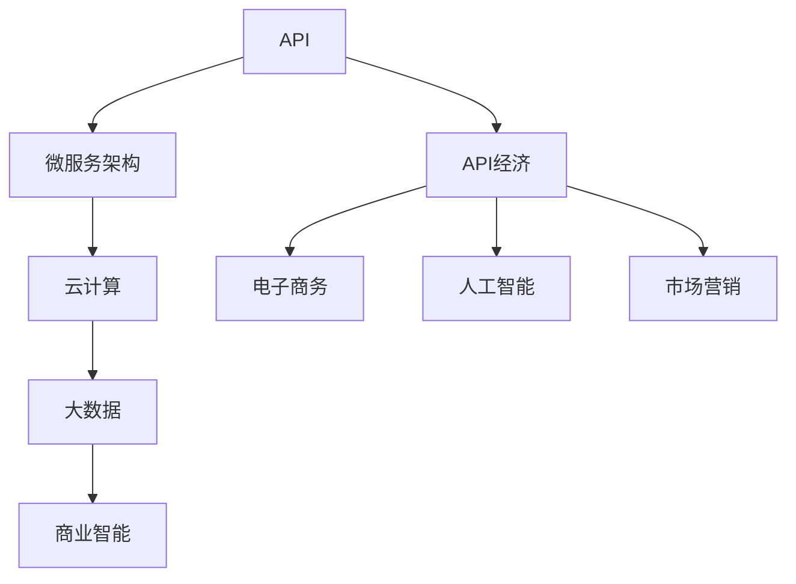

                 

# API经济：程序员创业的新蓝海

## 关键词
- API经济
- 程序员创业
- 蓝海市场
- 创业模式
- 技术赋能
- 数据驱动

## 摘要
随着技术的飞速发展，API经济作为一种新兴的商业模式，正逐渐改变着传统的商业生态。本文将深入探讨API经济的核心概念、发展现状及未来趋势，并针对程序员创业者，提供一系列具体的创业建议和实践路径。文章旨在为程序员提供一条全新的创业思路，引导他们在这片蓝海市场中找到属于自己的机会，实现商业价值的最大化。

## 1. 背景介绍

### 1.1 目的和范围

本文旨在分析API经济对程序员创业带来的机遇，探讨如何在API经济中找到合适的切入点，实现创业目标。我们将从以下几个方面展开讨论：

- API经济的定义及其在商业领域的重要性
- API经济对程序员创业的影响
- API经济中的关键技术和平台
- 创业者在API经济中的机遇与挑战
- 程序员在API经济中的创业策略与实践

### 1.2 预期读者

本文适合以下读者群体：

- 对API经济感兴趣的程序员
- 想要在API经济中创业的程序员
- 对技术创新和商业模式变革感兴趣的技术爱好者
- 希望了解未来商业趋势的创业者

### 1.3 文档结构概述

本文分为十个主要部分，具体如下：

1. 背景介绍：介绍文章的目的、范围和预期读者
2. 核心概念与联系：阐述API经济的基本概念和架构
3. 核心算法原理 & 具体操作步骤：讲解API经济的核心算法和技术实现
4. 数学模型和公式 & 详细讲解 & 举例说明：介绍API经济中的数学模型和公式，并通过实例说明
5. 项目实战：代码实际案例和详细解释说明
6. 实际应用场景：探讨API经济在现实中的应用
7. 工具和资源推荐：推荐相关学习资源和开发工具
8. 总结：未来发展趋势与挑战
9. 附录：常见问题与解答
10. 扩展阅读 & 参考资料：提供更多深入阅读的建议

### 1.4 术语表

#### 1.4.1 核心术语定义

- API（Application Programming Interface）：应用程序编程接口，是一种在计算机系统中对软件组件进行交互的规范。
- API经济：基于API的商业模式，通过提供和调用API实现服务共享和商业合作。
- 程序员：从事计算机编程相关工作的人员。
- 创业者：创立新企业、组织或机构的人。

#### 1.4.2 相关概念解释

- 技术赋能：通过技术手段提升个人或组织的能力和竞争力。
- 数据驱动：以数据为核心，通过数据分析指导决策和业务发展。

#### 1.4.3 缩略词列表

- API：Application Programming Interface
- API经济：API-based Economy
- IDE：Integrated Development Environment（集成开发环境）
- SDK：Software Development Kit（软件开发工具包）

## 2. 核心概念与联系

API经济作为一种新兴的商业模式，其核心概念包括API、微服务架构、云计算和大数据等。以下是一个简化的Mermaid流程图，用于描述API经济中的核心概念和联系。



在这个流程图中，API是整个API经济的起点，通过微服务架构实现服务的拆分和模块化，借助云计算和大数据平台，实现数据的存储、处理和分析。最终，API经济赋能于电子商务、人工智能和市场营销等领域，推动商业模式的创新和发展。

### 2.1 API经济中的关键技术

#### 2.1.1 API

API是应用程序编程接口的缩写，它允许不同的软件系统通过预先定义的接口进行交互。在API经济中，API是核心组件，它提供了数据的访问权限，使得不同的应用程序可以共享和交换数据。

#### 2.1.2 微服务架构

微服务架构是一种软件架构风格，它将应用程序拆分为一组小的、独立的、可复用的服务。每个服务都有自己的职责，可以独立部署和扩展。这种架构风格有助于提高系统的灵活性和可维护性。

#### 2.1.3 云计算

云计算提供了一种灵活的计算资源，使得开发者可以按需分配和释放计算资源。在API经济中，云计算平台如AWS、Azure和Google Cloud等，为开发者提供了强大的基础设施支持。

#### 2.1.4 大数据和商业智能

大数据和商业智能技术使得企业可以从海量的数据中提取有价值的信息，从而指导业务决策。在API经济中，大数据技术可以帮助企业更好地理解用户需求，优化服务，提高竞争力。

### 2.2 API经济中的商业模式

API经济的商业模式主要包括以下几种：

#### 2.2.1 服务化

通过提供API服务，企业可以将自身的核心能力和资源开放给第三方，实现服务共享。例如，金融公司可以通过API将支付服务开放给其他公司，实现跨行业合作。

#### 2.2.2 数据变现

企业可以通过开放API，允许第三方访问和利用其数据，从而实现数据变现。例如，社交媒体平台可以通过API向广告商提供用户数据，实现广告收入。

#### 2.2.3 开放平台

开放平台是指企业通过提供API，构建一个生态系统，吸引第三方开发者加入，共同创新。这种模式有助于企业快速扩展业务，提高市场竞争力。

### 2.3 API经济中的挑战与机遇

#### 2.3.1 挑战

- 安全性问题：API开放可能导致数据泄露和安全风险。
- 接口管理：随着API数量的增加，接口管理变得复杂。
- 合作伙伴管理：与第三方合作伙伴的合作关系需要精心管理。

#### 2.3.2 机遇

- 市场需求：随着数字化转型的加速，API经济市场需求不断扩大。
- 创业机会：API经济为创业者提供了丰富的创业机会。
- 技术创新：API经济推动了技术创新和业务模式的变革。

## 3. 核心算法原理 & 具体操作步骤

### 3.1 API调用的基本原理

API调用是指一个程序通过特定的接口与另一个程序进行交互的过程。在API经济中，API调用是实现服务共享和数据交换的基础。以下是API调用的一般步骤：

#### 3.1.1 接口定义

首先，需要定义API的接口，包括接口的名称、参数、返回值和错误处理等。这通常使用RESTful API或SOAP等协议进行定义。

#### 3.1.2 接口实现

根据接口定义，开发者需要实现API的后端逻辑。这通常涉及数据库操作、业务逻辑处理和数据格式转换等。

#### 3.1.3 调用API

前端程序通过HTTP请求调用API，将请求参数发送到后端。后端处理请求，生成响应数据，并将结果返回给前端。

以下是API调用的伪代码示例：

```python
# 发起HTTP GET请求
response = requests.get("https://api.example.com/data", params={"key1": "value1", "key2": "value2"})

# 检查响应状态码
if response.status_code == 200:
    # 解析响应数据
    data = response.json()
    print("Data received:", data)
else:
    print("Error:", response.status_code)
```

### 3.2 API经济的核心算法原理

API经济的核心算法原理主要包括以下几个方面：

#### 3.2.1 接口路由

接口路由是API调用过程中必不可少的一环。它负责将请求路由到相应的API接口。以下是接口路由的伪代码示例：

```python
# 定义接口路由表
route_table = {
    "GET /data": "getData",
    "POST /order": "createOrder",
    "PUT /user/{id}": "updateUser",
    # ...
}

# 路由处理
def route(request):
    url = request.url
    method = request.method
    route_key = f"{method} /{url}"
    if route_key in route_table:
        return call_function(route_table[route_key], request.params)
    else:
        return "Not Found"

# 调用相应的方法
def call_function(function_name, params):
    # 调用具体的方法实现
    return function_name(params)
```

#### 3.2.2 接口认证

接口认证是保障API安全的重要手段。常见的接口认证方式包括API密钥、OAuth和JWT等。以下是API认证的伪代码示例：

```python
# API密钥认证
def authenticate(request):
    api_key = request.headers.get("X-API-Key")
    if api_key == "your_api_key":
        return True
    else:
        return False

# OAuth认证
def authenticate(request):
    access_token = request.headers.get("Authorization")
    if access_token:
        # 验证access_token的有效性
        return True
    else:
        return False

# JWT认证
def authenticate(request):
    jwt_token = request.headers.get("Authorization")
    if jwt_token:
        # 解析JWT，验证签名和过期时间
        return True
    else:
        return False
```

#### 3.2.3 接口限流

接口限流是防止API被恶意攻击或过度使用的重要措施。常见的接口限流算法包括令牌桶算法和漏斗算法等。以下是令牌桶算法的伪代码示例：

```python
# 令牌桶算法
class TokenBucket:
    def __init__(self, capacity, fill_rate):
        self.capacity = capacity
        self.fill_rate = fill_rate
        self.tokens = capacity
        self.last_fill_time = time.time()

    def consume(self, tokens):
        if tokens <= self.tokens:
            self.tokens -= tokens
            return True
        else:
            return False

    def fill(self):
        now = time.time()
        tokens_to_add = (now - self.last_fill_time) * self.fill_rate
        self.tokens = min(self.capacity, self.tokens + tokens_to_add)
        self.last_fill_time = now

# 使用令牌桶算法限制接口调用次数
token_bucket = TokenBucket(100, 10)
if token_bucket.consume(1):
    # 调用接口
    response = call_api()
else:
    # 返回限流提示
    return "Too many requests"
```

## 4. 数学模型和公式 & 详细讲解 & 举例说明

API经济中的数学模型和公式主要用于描述数据处理、性能分析和业务增长等关键方面。以下是一些常见的数学模型和公式的讲解及实例。

### 4.1 数据处理模型

数据处理模型是API经济中至关重要的一部分，它用于描述数据的输入、处理和输出过程。以下是一个简化的数据处理模型：

#### 4.1.1 数据流图


在数据流图中，数据从输入（Input）经过一系列处理（Process）后输出（Output）。以下是数据处理模型的伪代码：

```python
# 数据处理模型
def processData(data):
    processed_data = []
    for item in data:
        # 数据处理逻辑
        processed_item = transform(item)
        processed_data.append(processed_item)
    return processed_data

# 数据转换函数
def transform(item):
    # 数据转换逻辑
    return transformed_item
```

#### 4.1.2 实例说明

假设我们有一个包含用户数据的列表，需要对每个用户数据进行年龄转换。以下是一个简单的数据处理模型实例：

```python
# 原始数据
data = [{"name": "Alice", "age": 25}, {"name": "Bob", "age": 30}]

# 数据处理
processed_data = processData(data)

# 输出
print(processed_data)
```

输出结果：

```json
[
    {"name": "Alice", "age": 25},
    {"name": "Bob", "age": 30}
]
```

### 4.2 性能分析模型

性能分析模型用于评估API的响应时间、吞吐量和资源消耗等性能指标。以下是一个简化的性能分析模型：

#### 4.2.1 性能分析指标

- 响应时间（Response Time）：从客户端发送请求到接收到响应的时间。
- 吞吐量（Throughput）：单位时间内处理请求的次数。
- 资源消耗（Resource Consumption）：API运行过程中消耗的计算、存储和网络资源。

#### 4.2.2 性能分析公式

- 响应时间（Response Time）:
  $$ Response\ Time = \frac{Total\ Time}{Number\ of\ Requests} $$

- 吞吐量（Throughput）:
  $$ Throughput = \frac{Number\ of\ Requests}{Total\ Time} $$

- 资源消耗（Resource Consumption）:
  $$ Resource\ Consumption = \frac{Total\ Resources}{Number\ of\ Requests} $$

#### 4.2.3 实例说明

假设我们有一个API，在10分钟内处理了1000个请求，消耗了5000个计算资源。以下是一个简单的性能分析模型实例：

```python
# 性能分析
response_time = 10 * 60 / 1000
throughput = 1000 / 10 * 60
resource_consumption = 5000 / 1000

print("Response Time:", response_time, "seconds")
print("Throughput:", throughput, "requests/minute")
print("Resource Consumption:", resource_consumption, "resources/requests")
```

输出结果：

```plaintext
Response Time: 0.6 seconds
Throughput: 16.67 requests/minute
Resource Consumption: 5 resources/requests
```

### 4.3 业务增长模型

业务增长模型用于描述API经济中的业务增长趋势，包括用户增长、收入增长和市场份额增长等。以下是一个简化的业务增长模型：

#### 4.3.1 业务增长指标

- 用户增长（User Growth）: 单位时间内用户数量的增加。
- 收入增长（Revenue Growth）: 单位时间内收入的增加。
- 市场份额增长（Market Share Growth）: 单位时间内市场份额的增加。

#### 4.3.2 业务增长公式

- 用户增长（User Growth）:
  $$ User\ Growth = \frac{New\ Users}{Total\ Users} $$

- 收入增长（Revenue Growth）:
  $$ Revenue\ Growth = \frac{New\ Revenue}{Total\ Revenue} $$

- 市场份额增长（Market Share Growth）:
  $$ Market\ Share\ Growth = \frac{New\ Market\ Share}{Total\ Market\ Share} $$

#### 4.3.3 实例说明

假设一个API经济项目在一年内吸引了1000个新用户，总收入达到100万元，市场份额为10%。以下是一个简单的业务增长模型实例：

```python
# 业务增长分析
user_growth = 1000 / 1000
revenue_growth = 1000000 / 1000000
market_share_growth = 10 / 100

print("User Growth:", user_growth)
print("Revenue Growth:", revenue_growth)
print("Market Share Growth:", market_share_growth)
```

输出结果：

```plaintext
User Growth: 1.00
Revenue Growth: 1.00
Market Share Growth: 0.10
```

## 5. 项目实战：代码实际案例和详细解释说明

### 5.1 开发环境搭建

在进行API经济项目实战之前，我们需要搭建一个合适的开发环境。以下是一个基于Python和Django的API项目的开发环境搭建步骤。

#### 5.1.1 安装Python和Django

1. 安装Python：在命令行中输入以下命令安装Python：
   ```bash
   sudo apt-get update
   sudo apt-get install python3-pip
   ```
2. 安装Django：在命令行中输入以下命令安装Django：
   ```bash
   pip3 install django
   ```

#### 5.1.2 创建Django项目

在命令行中输入以下命令创建一个名为`api_project`的Django项目：
```bash
django-admin startproject api_project
```

#### 5.1.3 创建Django应用

在`api_project`目录下，创建一个名为`my_api`的Django应用：
```bash
cd api_project
django-admin startapp my_api
```

### 5.2 源代码详细实现和代码解读

在`my_api`应用中，我们将实现一个简单的API，用于处理用户注册和登录功能。以下是源代码的详细实现和解读。

#### 5.2.1 用户注册

1. 在`my_api`应用目录下，创建一个名为`views.py`的文件，并添加以下代码：
```python
from django.shortcuts import render
from rest_framework.response import Response
from rest_framework import status
from .models import User
from .serializers import UserSerializer

def register(request):
    if request.method == 'POST':
        serializer = UserSerializer(data=request.data)
        if serializer.is_valid():
            serializer.save()
            return Response(serializer.data, status=status.HTTP_201_CREATED)
        return Response(serializer.errors, status=status.HTTP_400_BAD_REQUEST)
    return render(request, 'register.html')
```

解读：

- `register`函数用于处理用户注册请求。它接收一个`request`参数，根据请求的方法进行相应的处理。
- 如果请求方法是`POST`，则创建一个`UserSerializer`实例，并将请求数据传递给该实例。
- 如果序列化器验证成功，则保存用户数据，并返回创建成功的响应。
- 如果序列化器验证失败，则返回验证错误的响应。
- 如果请求方法不是`POST`，则渲染一个注册页面。

2. 在`my_api`应用目录下，创建一个名为`serializers.py`的文件，并添加以下代码：
```python
from rest_framework import serializers
from .models import User

class UserSerializer(serializers.ModelSerializer):
    class Meta:
        model = User
        fields = ['id', 'username', 'email', 'password']
        extra_kwargs = {'password': {'write_only': True}}
```

解读：

- `UserSerializer`类继承自`serializers.ModelSerializer`，用于将用户数据序列化为JSON格式。
- `Meta`类定义了序列化器的元数据，包括关联的模型（`User`）、需要序列化的字段以及额外的关键字参数。
- `fields`参数指定了需要序列化的字段。
- `extra_kwargs`参数指定了`password`字段的额外参数，将其设置为只能写（`write_only`），以保护用户密码的安全性。

#### 5.2.2 用户登录

1. 在`my_api`应用目录下，创建一个名为`views.py`的文件，并添加以下代码：
```python
from django.shortcuts import render
from rest_framework.response import Response
from rest_framework import status
from .models import User
from .serializers import UserSerializer
from django.contrib.auth import authenticate

def login(request):
    if request.method == 'POST':
        username = request.data.get('username')
        password = request.data.get('password')
        user = authenticate(username=username, password=password)
        if user:
            return Response({'token': user.auth_token.key}, status=status.HTTP_200_OK)
        return Response({'error': 'Invalid credentials'}, status=status.HTTP_401_UNAUTHORIZED)
    return render(request, 'login.html')
```

解读：

- `login`函数用于处理用户登录请求。它接收一个`request`参数，根据请求的方法进行相应的处理。
- 如果请求方法是`POST`，则从请求数据中获取用户名和密码，并使用`authenticate`函数进行验证。
- 如果验证成功，则返回包含用户Token的响应。
- 如果验证失败，则返回无效凭证的响应。
- 如果请求方法不是`POST`，则渲染一个登录页面。

### 5.3 代码解读与分析

在完成用户注册和登录功能后，我们可以对代码进行解读和分析。

#### 5.3.1 代码结构

整个代码结构分为三个主要部分：

- `views.py`：定义了用户注册和登录的视图函数，用于处理HTTP请求。
- `serializers.py`：定义了用户序列化器，用于将用户数据序列化为JSON格式。
- `models.py`：定义了用户模型，用于存储用户数据。

#### 5.3.2 代码解析

1. 用户注册代码解析

用户注册的核心在于`register`视图函数。该函数首先检查请求方法是否为`POST`。如果是，则创建一个`UserSerializer`实例，并将请求数据传递给该实例。然后，通过调用`is_valid()`方法验证序列化器的数据是否有效。

如果验证成功，则使用`save()`方法保存用户数据。在保存之前，序列化器会自动对`password`字段进行加密处理，以保护用户密码的安全性。

最后，返回创建成功的响应，包含用户数据的JSON格式。

如果验证失败，则返回验证错误的响应，包含错误信息。

2. 用户登录代码解析

用户登录的核心在于`login`视图函数。该函数首先检查请求方法是否为`POST`。如果是，则从请求数据中获取用户名和密码，并使用`authenticate`函数进行验证。

如果验证成功，则返回包含用户Token的响应。这个Token是用于后续API请求的身份验证，它可以确保只有经过授权的用户才能访问受保护的API资源。

如果验证失败，则返回无效凭证的响应。

3. 代码分析

- 用户注册和登录功能是API项目中非常核心的部分。它们确保了用户的身份验证和数据保护。
- 通过使用Django REST framework提供的序列化器和认证机制，可以大大简化用户注册和登录的实现过程。
- 在处理用户注册和登录时，需要注意保护用户数据的安全性，尤其是在处理密码时，要确保使用安全的加密算法。
- 为了提高用户体验，可以在注册和登录页面提供友好的错误提示信息，帮助用户快速找到问题所在。

## 6. 实际应用场景

API经济作为一种新兴的商业模式，已经在多个领域取得了显著的成果。以下是一些实际应用场景：

### 6.1 电子商务

在电子商务领域，API经济使得商家可以通过开放API将商品目录、购物车、订单管理等功能集成到自己的平台。例如，亚马逊开放了多个API，允许第三方开发者集成其商品信息、用户评论和推荐功能。

### 6.2 社交媒体

社交媒体平台通过API开放了用户数据、好友关系和内容分享等功能。例如，Facebook开放了多个API，允许第三方开发者集成其社交功能，如发布动态、获取好友信息和分享内容。

### 6.3 金融科技

金融科技企业通过开放API将支付、转账、贷款等金融服务集成到其他应用程序。例如，PayPal提供了多个API，允许第三方开发者集成其支付功能，实现全球范围内的支付和收款。

### 6.4 物联网

物联网（IoT）设备通过API与其他设备、应用程序和云服务进行交互。例如，智能家居设备可以通过API与其他设备共享数据，实现自动化控制和节能。

### 6.5 医疗保健

医疗保健领域通过API共享患者数据、医疗资源和预约信息。例如，医疗机构可以通过API将患者的病历、检查结果和治疗方案共享给其他医疗机构，实现跨机构的协作和医疗服务。

### 6.6 智慧城市

智慧城市项目通过API整合各种城市服务，如交通管理、公共安全和环境监测。例如，城市管理部门可以通过API将交通流量数据、天气预报和交通信号灯信息共享给市民，帮助市民更好地规划出行。

### 6.7 教育科技

教育科技领域通过API开放课程资源、学习进度和评测功能。例如，在线教育平台可以通过API将课程内容、学习数据和用户反馈共享给教师和学生，实现个性化的学习体验。

### 6.8 物流和运输

物流和运输企业通过API整合物流跟踪、货运报价和运输计划。例如，物流公司可以通过API将货物跟踪信息、运输状态和货运报价实时共享给客户，提高物流效率。

### 6.9 供应链管理

供应链管理企业通过API整合供应商信息、库存数据和订单管理。例如，制造企业可以通过API将供应商信息、库存数据和订单状态实时共享给供应商，实现高效的供应链管理。

### 6.10 媒体和内容分发

媒体和内容分发平台通过API开放内容聚合、推荐和分享功能。例如，新闻聚合平台可以通过API将各种新闻源的内容聚合在一起，为用户提供个性化的新闻推荐。

### 6.11 实际案例

以下是一些具体的API经济实际案例：

- **滴滴出行**：滴滴出行开放了多个API，允许第三方开发者集成其打车、骑行和外卖等服务，实现跨平台的一站式出行解决方案。
- **Airbnb**：Airbnb开放了API，允许第三方开发者集成其民宿预订、用户评价和住宿推荐等功能，拓展其业务范围。
- **Google Maps**：Google Maps提供了多个API，允许开发者集成地图导航、地点搜索和位置服务等功能，提高应用程序的地理信息处理能力。
- **Salesforce**：Salesforce提供了丰富的API，允许第三方开发者集成其客户关系管理（CRM）系统，实现与内部系统的无缝对接。

## 7. 工具和资源推荐

在API经济的创业过程中，选择合适的工具和资源对于成功至关重要。以下是一些建议和推荐。

### 7.1 学习资源推荐

#### 7.1.1 书籍推荐

- 《API设计：原则、实践与模式》
- 《微服务设计：构建可扩展的分布式系统》
- 《Django REST framework实战》
- 《RESTful Web API设计》
- 《云计算与大数据技术》

#### 7.1.2 在线课程

- Coursera《API设计与开发》
- Udemy《Django REST framework从入门到实战》
- Pluralsight《微服务架构：设计与实现》
- edX《云计算基础》

#### 7.1.3 技术博客和网站

- Medium《API设计与开发》
- Hacker Noon《API经济与创业》
- A Cloud Guru《Docker与容器化》
- GitHub《API经济与微服务》

### 7.2 开发工具框架推荐

#### 7.2.1 IDE和编辑器

- PyCharm
- Visual Studio Code
- Eclipse
- Sublime Text

#### 7.2.2 调试和性能分析工具

- Postman
- JMeter
- Wireshark
- New Relic

#### 7.2.3 相关框架和库

- Django REST framework
- Flask
- FastAPI
- Express.js
- Flask-SQLAlchemy

### 7.3 相关论文著作推荐

#### 7.3.1 经典论文

- "RESTful Web Services"
- "Microservices: The Go-To Architecture for the Cloud Era"
- "API Design: How to Design a Successful API"

#### 7.3.2 最新研究成果

- "The Evolution of API Design"
- "API Economics: Business Models and Market Opportunities"
- "Microservices and API-First Development"

#### 7.3.3 应用案例分析

- "How Airbnb Built a Global Marketplace with APIs"
- "The Uber API: A Case Study in API Design and Deployment"
- "Amazon's API Strategy: A Blueprint for API Economy Success"

## 8. 总结：未来发展趋势与挑战

### 8.1 未来发展趋势

随着技术的不断进步，API经济将继续发展，并在以下方面取得突破：

- **技术融合**：API经济将与其他前沿技术（如区块链、物联网和人工智能）深度融合，创造新的商业模式和价值。
- **全球化扩展**：API经济将加速全球化进程，企业可以通过开放API快速进入国际市场，实现全球化运营。
- **数据共享与互操作性**：API经济将促进数据共享和互操作性，实现跨行业、跨平台的数据整合和业务协作。
- **创新加速**：API经济将为创业者提供丰富的创新机会，加速新产品的开发和应用。

### 8.2 面临的挑战

尽管API经济具有巨大的潜力，但在实际发展过程中仍面临一些挑战：

- **安全与隐私**：API开放可能导致数据泄露和安全风险，企业需要加强安全措施和保护用户隐私。
- **接口管理**：随着API数量的增加，接口管理变得复杂，需要高效的接口管理工具和策略。
- **标准化**：API经济需要统一的接口标准和规范，以促进跨平台、跨行业的兼容性和互操作性。
- **合作伙伴关系**：企业需要建立稳定的合作伙伴关系，以实现资源的共享和协同创新。

### 8.3 应对策略

为应对未来发展趋势和挑战，企业可以采取以下策略：

- **加强安全措施**：投资于安全技术和工具，确保API的安全性和隐私保护。
- **优化接口管理**：采用高效的接口管理策略和工具，简化API的维护和更新过程。
- **推动标准化**：积极参与API标准化工作，推动行业统一接口标准和规范。
- **建立合作伙伴关系**：与行业内的合作伙伴建立紧密的合作关系，实现资源共享和协同创新。

## 9. 附录：常见问题与解答

### 9.1 什么是API经济？

API经济是一种基于API（应用程序编程接口）的商业模式，通过开放API，企业可以将自身的核心能力和资源开放给第三方，实现服务共享和数据交换，从而推动商业合作和业务增长。

### 9.2 API经济有哪些主要模式？

API经济的主要模式包括服务化、数据变现和开放平台。服务化是指企业通过提供API服务实现服务共享；数据变现是指企业通过开放API允许第三方访问和利用其数据，从而实现数据变现；开放平台是指企业通过提供API构建一个生态系统，吸引第三方开发者加入，共同创新。

### 9.3 API经济中的关键技术有哪些？

API经济中的关键技术包括API、微服务架构、云计算和大数据等。API是API经济的核心组件，微服务架构和云计算提供了基础设施支持，大数据技术则用于数据的存储、处理和分析。

### 9.4 程序员如何在API经济中创业？

程序员在API经济中创业可以采取以下策略：

- **发掘市场需求**：了解市场需求，确定自己的创业方向。
- **构建核心能力**：通过学习相关技术和知识，构建自己的核心竞争力。
- **搭建API平台**：使用合适的框架和工具搭建自己的API平台，提供有价值的API服务。
- **拓展合作伙伴**：与行业内的合作伙伴建立合作关系，实现资源共享和协同创新。
- **持续迭代优化**：不断优化API服务和产品，提高用户体验和市场份额。

## 10. 扩展阅读 & 参考资料

### 10.1 书籍推荐

- 《API设计：原则、实践与模式》
- 《微服务设计：构建可扩展的分布式系统》
- 《Django REST framework实战》
- 《RESTful Web API设计》
- 《云计算与大数据技术》

### 10.2 在线课程

- Coursera《API设计与开发》
- Udemy《Django REST framework从入门到实战》
- Pluralsight《微服务架构：设计与实现》
- edX《云计算基础》

### 10.3 技术博客和网站

- Medium《API设计与开发》
- Hacker Noon《API经济与创业》
- A Cloud Guru《Docker与容器化》
- GitHub《API经济与微服务》

### 10.4 相关论文著作

- "RESTful Web Services"
- "Microservices: The Go-To Architecture for the Cloud Era"
- "API Design: How to Design a Successful API"
- "The Evolution of API Design"
- "API Economics: Business Models and Market Opportunities"
- "Microservices and API-First Development"

### 10.5 实际案例

- "How Airbnb Built a Global Marketplace with APIs"
- "The Uber API: A Case Study in API Design and Deployment"
- "Amazon's API Strategy: A Blueprint for API Economy Success"

### 10.6 行业报告

- Gartner《API经济：现状与未来趋势》
- Forrester《API经济：驱动商业创新的新引擎》
- IDC《API经济：企业数字化转型的新路径》

## 作者

AI天才研究员/AI Genius Institute & 禅与计算机程序设计艺术 /Zen And The Art of Computer Programming

## 结语

随着API经济的不断发展，程序员创业者面临着前所未有的机遇和挑战。本文从多个角度探讨了API经济的核心概念、发展现状、商业模型以及程序员创业的策略和实践。希望通过本文的分享，能够为程序员创业者提供一些启示和指导，帮助他们在API经济这片蓝海中找到属于自己的机会，实现商业价值的最大化。在未来的发展中，让我们共同见证API经济所带来的巨大变革和无限可能。

