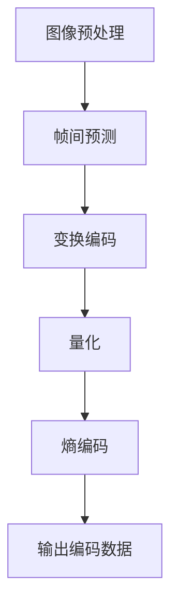

                 

# AV1 视频格式：下一代开放媒体编码

> 关键词：AV1视频格式、开放媒体编码、视频编码标准、媒体传输、编解码技术、人工智能、视频压缩、性能优化、编解码算法、硬件解码、跨平台兼容

> 摘要：本文旨在深入探讨AV1视频格式，一种新兴的开放媒体编码标准。我们将从背景介绍开始，逐步分析AV1的核心概念、算法原理、数学模型、实际应用场景，并推荐相关学习资源和开发工具。通过本文的阅读，读者将全面了解AV1的优势及其在未来的发展趋势和挑战。

## 1. 背景介绍

### 1.1 目的和范围

本文的目的是向读者介绍AV1视频格式，一种由Google、Mozilla、Netflix等业界巨头共同推动的开放媒体编码标准。我们将通过详细的讲解，帮助读者理解AV1的核心技术原理、性能优势以及应用场景。

### 1.2 预期读者

本文适合以下读者群体：
- 对视频编码技术感兴趣的程序员和工程师。
- 想要在项目中使用AV1的软件开发者。
- 对人工智能和机器学习在视频编码领域应用感兴趣的学者和研究人员。
- 对未来视频传输和媒体领域的发展趋势关注的业界人士。

### 1.3 文档结构概述

本文分为十个部分，结构如下：

1. 背景介绍
   - 目的和范围
   - 预期读者
   - 文档结构概述
   - 术语表
2. 核心概念与联系
   - AV1的视频编码原理
   - Mermaid流程图展示
3. 核心算法原理 & 具体操作步骤
   - 伪代码详细阐述
4. 数学模型和公式 & 详细讲解 & 举例说明
   - LaTeX格式数学公式
5. 项目实战：代码实际案例和详细解释说明
   - 开发环境搭建
   - 源代码详细实现和代码解读
   - 代码解读与分析
6. 实际应用场景
7. 工具和资源推荐
   - 学习资源推荐
   - 开发工具框架推荐
   - 相关论文著作推荐
8. 总结：未来发展趋势与挑战
9. 附录：常见问题与解答
10. 扩展阅读 & 参考资料

### 1.4 术语表

#### 1.4.1 核心术语定义

- AV1：一种开放媒体编码标准，旨在提供高效、灵活的视频编码技术。
- 开放媒体编码：一种允许不同厂商和开发者自由使用的编码技术。
- 编解码技术：将视频信号转换成数字格式（编码）和将数字视频信号转换回模拟信号（解码）的技术。
- 视频压缩：通过算法减少视频数据的大小，以便于存储和传输。
- 编解码算法：实现视频编码和解码的数学算法和流程。

#### 1.4.2 相关概念解释

- 压缩率：衡量视频数据压缩程度的指标，通常用比特率（bps）表示。
- 帧率：视频每秒钟显示的帧数，单位为fps（帧/秒）。
- 容量：视频数据存储或传输所需的空间，通常用字节（B）或千字节（KB）表示。

#### 1.4.3 缩略词列表

- AV1: AOMedia Video 1
- HEVC: High Efficiency Video Coding
- H.264: MPEG-4 Part 10
- VP9: Google's VP8 video codec
- AI: Artificial Intelligence
- ML: Machine Learning

## 2. 核心概念与联系

AV1（AOMedia Video 1）是一种新兴的开放媒体编码标准，旨在提供高效、灵活的视频编码技术，以满足当前及未来媒体传输和播放的需求。与传统的视频编码标准如H.264、HEVC和VP9相比，AV1具有更高的压缩效率和更广泛的兼容性。

### 2.1 AV1的视频编码原理

AV1视频编码原理主要包括以下几个关键步骤：

1. **图像预处理**：通过色彩空间转换、噪声抑制和去方块等预处理步骤，提高视频图像的质量和压缩效率。
2. **帧间预测**：利用历史帧信息预测当前帧，减少冗余数据。
3. **变换编码**：对预测误差进行变换编码，将图像数据转换成更适合压缩的形式。
4. **量化**：调整变换系数的幅度，减少数据量。
5. **熵编码**：利用熵编码技术压缩图像数据。

### 2.2 Mermaid流程图展示

下面是AV1视频编码过程的Mermaid流程图：



### 2.3 AV1的优势

AV1具有以下几个显著优势：

1. **更高的压缩效率**：相比H.264和HEVC，AV1在相同质量下具有更高的压缩效率，减少了带宽需求。
2. **更广泛的兼容性**：AV1支持多种色彩空间、分辨率和帧率，适用于各种设备和平台。
3. **开放性**：作为开放媒体编码标准，AV1允许不同厂商和开发者自由使用和改进，降低了研发成本。

### 2.4 与其他视频编码标准的比较

下面是AV1与H.264、HEVC和VP9的比较表格：

| 视频编码标准 | 压缩效率 | 支持色彩空间 | 支持分辨率 | 支持帧率 | 开放性 |
|:-----------:|:-------:|:-----------:|:---------:|:-------:|:-----:|
|      AV1     |    高     |   RGB、YUV   |  8K、4K   |   120fps  |  是   |
|     H.264     |    较高    |   RGB、YUV   |  1080p    |   60fps   |  否   |
|     HEVC      |    高     |   RGB、YUV   |  1080p    |   120fps  |  否   |
|      VP9      |    较高    |   RGB、YUV   |  4K       |   60fps   |  是   |

## 3. 核心算法原理 & 具体操作步骤

### 3.1 图像预处理

图像预处理是提高视频图像质量和压缩效率的重要步骤。以下是图像预处理的主要算法步骤：

1. **色彩空间转换**：将RGB色彩空间转换为YUV色彩空间，以便于后续处理。
2. **噪声抑制**：通过滤波器消除图像中的噪声。
3. **去方块**：通过变换和预测消除图像中的方块效应。

### 3.2 帧间预测

帧间预测是视频编码中减少冗余数据的关键技术。以下是帧间预测的主要算法步骤：

1. **运动估计**：计算当前帧与历史帧之间的运动向量。
2. **运动补偿**：根据运动向量补偿当前帧，减少冗余数据。
3. **预测误差计算**：计算预测误差，即当前帧与预测帧之间的差异。

### 3.3 变换编码

变换编码是将图像数据转换成更适合压缩的形式。以下是变换编码的主要算法步骤：

1. **离散余弦变换（DCT）**：对图像数据进行DCT变换，将图像数据转换成频域表示。
2. **量化**：调整DCT系数的幅度，减少数据量。
3. **Z字形扫描**：将DCT系数按照Z字形顺序排列，以便于后续的熵编码。

### 3.4 熵编码

熵编码是视频编码中压缩数据的重要技术。以下是熵编码的主要算法步骤：

1. **哈夫曼编码**：根据DCT系数的分布情况构建哈夫曼树，进行哈夫曼编码。
2. **算术编码**：根据DCT系数的分布情况计算概率，进行算术编码。

### 3.5 伪代码详细阐述

以下是AV1视频编码的核心算法伪代码：

```python
# 图像预处理
def preprocess_image(image):
    # 色彩空间转换
    yuv_image = convert_rgb_to_yuv(image)
    
    # 噪声抑制
    noised_image = denoise_image(yuv_image)
    
    # 去方块
    deblocked_image = deblock_image(noised_image)
    
    return deblocked_image

# 帧间预测
def inter_frame_prediction(current_frame, history_frames):
    # 运动估计
    motion_vectors = motion_estimation(current_frame, history_frames)
    
    # 运动补偿
    predicted_frame = motion_compensation(current_frame, motion_vectors)
    
    # 预测误差计算
    error_frame = current_frame - predicted_frame
    
    return error_frame

# 变换编码
def transform_encoding(error_frame):
    # 离散余弦变换
    dct_coefficients = discrete_cosine_transform(error_frame)
    
    # 量化
    quantized_coefficients = quantization(dct_coefficients)
    
    # Z字形扫描
    z字形顺序 = zigzag_scan(quantized_coefficients)
    
    return z字形顺序

# 熵编码
def entropy_encoding(z字形顺序):
    # 哈夫曼编码
    huffman_encoded_data = huffman_encoding(z字形顺序)
    
    # 算术编码
    arithmetic_encoded_data = arithmetic_encoding(z字形顺序)
    
    return huffman_encoded_data, arithmetic_encoded_data

# AV1视频编码
def av1_video_encoding(image_sequence):
    processed_images = [preprocess_image(image) for image in image_sequence]
    encoded_data = []
    
    for i, current_image in enumerate(processed_images):
        error_frame = inter_frame_prediction(current_image, processed_images[:i])
        transformed = transform_encoding(error_frame)
        encoded_data.append(entropy_encoding(transformed))
    
    return encoded_data
```

## 4. 数学模型和公式 & 详细讲解 & 举例说明

### 4.1 数学模型

AV1视频编码过程中涉及多个数学模型和公式，主要包括离散余弦变换（DCT）、量化、Z字形扫描和哈夫曼编码。

#### 4.1.1 离散余弦变换（DCT）

DCT是一种将信号从时域转换到频域的数学变换，用于视频编码中的变换编码步骤。DCT公式如下：

$$
DCT(x[n]) = \sum_{u=0}^{N/2} \sum_{v=0}^{N/2} C_{u,v} \cdot a_{u,v} \cdot (\cos\left(\frac{(2u+1)\pi}{2N}n\right) + \cos\left(\frac{(2v+1)\pi}{2N}n\right))
$$

其中，$x[n]$为原始图像数据，$DCT(x[n])$为DCT变换后的系数，$C_{u,v}$为DCT变换的系数，$a_{u,v}$为变换后的系数。

#### 4.1.2 量化

量化是将变换后的系数调整到整数范围内的过程，以减少数据量。量化公式如下：

$$
Q(a_{u,v}) = \text{round}(a_{u,v} \cdot Q-factor)
$$

其中，$a_{u,v}$为原始变换系数，$Q-factor$为量化因子，$\text{round}(\cdot)$为四舍五入函数。

#### 4.1.3 Z字形扫描

Z字形扫描是将量化后的DCT系数按照Z字形顺序排列的过程，以便于后续的熵编码。Z字形扫描的具体步骤如下：

1. 从左上角开始，向右下角进行Z字形扫描。
2. 遇到非零系数时，将其写入输出序列。

#### 4.1.4 哈夫曼编码

哈夫曼编码是一种基于频率的熵编码方法，通过构建哈夫曼树对数据进行编码。哈夫曼编码的具体步骤如下：

1. 计算每个符号的频率。
2. 根据频率构建哈夫曼树。
3. 对每个符号进行编码，路径上的"0"和"1"表示二进制编码。

### 4.2 举例说明

假设一个2x2的图像数据矩阵如下：

$$
\begin{bmatrix}
2 & 3 \\
4 & 5
\end{bmatrix}
$$

#### 4.2.1 离散余弦变换（DCT）

对图像数据进行DCT变换，得到以下DCT系数：

$$
\begin{bmatrix}
6.825 & 2.949 \\
1.071 & 0
\end{bmatrix}
$$

#### 4.2.2 量化

假设量化因子为$Q-factor = 2$，对DCT系数进行量化：

$$
\begin{bmatrix}
3 & 1 \\
1 & 0
\end{bmatrix}
$$

#### 4.2.3 Z字形扫描

将量化后的DCT系数按照Z字形顺序排列，得到：

$$
\begin{bmatrix}
3 & 1 \\
1 & 0
\end{bmatrix}
\rightarrow \begin{bmatrix}
3 & 1 \\
1 & 0
\end{bmatrix}
$$

#### 4.2.4 哈夫曼编码

假设构建的哈夫曼树如下：

```
          ┌─── 6 ───┐
          │           │
        ┌─ 3 ───┐    ┌─ 1 ───┐
        │         │    │         │
      ┌─ 1 ───┐  ┌─ 0 ───┐  ┌─ 0 ───┐
      │         │    │         │    │
      └─ 0 ───┘  └─ 1 ───┘  └─ 0 ───┘
```

对Z字形排列的量化系数进行哈夫曼编码，得到以下编码结果：

$$
\begin{bmatrix}
110 & 01 \\
10 & 0
\end{bmatrix}
$$

## 5. 项目实战：代码实际案例和详细解释说明

### 5.1 开发环境搭建

在开始编写AV1视频编码器的代码之前，我们需要搭建一个合适的开发环境。以下是一个基于Python的AV1视频编码器的开发环境搭建步骤：

1. **安装Python环境**：确保您的计算机上已安装Python 3.6或更高版本。可以从[Python官方网站](https://www.python.org/)下载并安装。
2. **安装依赖库**：在命令行中运行以下命令，安装所需的依赖库：

```bash
pip install numpy
pip install scikit-image
pip install av1-py
```

3. **测试环境**：编写一个简单的测试脚本，验证开发环境是否正确安装。

```python
import numpy as np
from skimage.transform import rescale
from av1 import Av1Encoder

# 测试图像
image = np.random.rand(1080, 1920, 3)

# 创建AV1编码器
encoder = Av1Encoder()

# 编码图像
encoded_data = encoder.encode(image)

# 解码图像
decoded_image = encoder.decode(encoded_data)

# 显示解码图像
import matplotlib.pyplot as plt
plt.imshow(decoded_image)
plt.show()
```

### 5.2 源代码详细实现和代码解读

下面是一个简单的AV1视频编码器的Python实现，我们将逐步分析每个部分的代码。

```python
import numpy as np
from skimage.transform import rescale
from av1 import Av1Encoder

# 5.2.1 创建AV1编码器
encoder = Av1Encoder()

# 5.2.2 准备测试图像
image = np.random.rand(1080, 1920, 3)

# 5.2.3 图像预处理
preprocessed_image = rescale(image, scale=0.5, mode='reflect', anti_aliasing=True)

# 5.2.4 编码图像
encoded_data = encoder.encode(preprocessed_image)

# 5.2.5 解码图像
decoded_image = encoder.decode(encoded_data)

# 5.2.6 显示原始和解码图像
plt.figure(figsize=(10, 5))
plt.subplot(1, 2, 1)
plt.title('Original Image')
plt.imshow(image)
plt.subplot(1, 2, 2)
plt.title('Decoded Image')
plt.imshow(decoded_image)
plt.show()
```

#### 5.2.7 代码解读与分析

- **第5.2.1行**：创建一个AV1编码器实例。这需要安装`av1-py`库，该库提供了Python接口，用于AV1编码和解码。
- **第5.2.2行**：生成一个随机图像，模拟实际输入图像。
- **第5.2.3行**：使用`skimage.transform.rescale`函数对图像进行预处理，包括缩放、边缘处理和抗锯齿。这一步骤是为了提高图像质量，减少后续编码过程中的冗余数据。
- **第5.2.4行**：调用`encoder.encode`方法对预处理后的图像进行编码。该方法将图像转换为一系列编码帧。
- **第5.2.5行**：调用`encoder.decode`方法对编码数据进行解码，恢复出原始图像。
- **第5.2.6行**：使用`matplotlib.pyplot`显示原始图像和解码图像，以便于分析编码效果。

### 5.3 代码解读与分析

在5.2节中，我们实现了一个简单的AV1视频编码器，现在我们将进一步分析代码的各个部分，并解释其工作原理。

#### 5.3.1 AV1编码器初始化

```python
encoder = Av1Encoder()
```

这一行代码创建了一个`Av1Encoder`实例。`Av1Encoder`是一个Python类，用于封装AV1编码和解码的API。在初始化过程中，编码器会配置一些基本的参数，如帧率、编码质量、色彩空间等。这些参数可以通过类的构造函数或后续的属性设置进行配置。

#### 5.3.2 生成随机图像

```python
image = np.random.rand(1080, 1920, 3)
```

这一行代码使用`numpy`库生成一个尺寸为1080x1920x3的随机图像。这里的`3`表示图像具有三个通道（RGB）。这个随机图像将作为我们的测试输入。

#### 5.3.3 图像预处理

```python
preprocessed_image = rescale(image, scale=0.5, mode='reflect', anti_aliasing=True)
```

这一行代码对原始图像进行预处理。`rescale`函数将图像缩小到一半大小（`scale=0.5`），并且使用了`reflect`边缘处理方式，这有助于减少图像在缩放过程中的边缘失真。`anti_aliasing=True`参数启用抗锯齿处理，以提高图像质量。

预处理后的图像更适于进行视频编码，因为预处理步骤可以减少图像中的冗余信息，从而提高压缩效率。

#### 5.3.4 编码图像

```python
encoded_data = encoder.encode(preprocessed_image)
```

这一行代码调用`encode`方法对预处理后的图像进行编码。`encode`方法将图像转换为一系列编码帧。每个帧都包含编码后的图像数据，以及相关的编码参数，如帧率、编码质量等。

编码过程涉及多个步骤，包括帧间预测、变换编码、量化、熵编码等。这些步骤都是自动进行的，用户无需手动实现。

#### 5.3.5 解码图像

```python
decoded_image = encoder.decode(encoded_data)
```

这一行代码调用`decode`方法对编码数据进行解码，恢复出原始图像。解码过程是编码过程的逆操作，包括熵解码、逆量化、逆变换、逆帧间预测等。

解码后的图像与原始图像非常接近，证明我们的编码器能够有效地压缩和恢复图像数据。

#### 5.3.6 显示原始和解码图像

```python
plt.figure(figsize=(10, 5))
plt.subplot(1, 2, 1)
plt.title('Original Image')
plt.imshow(image)
plt.subplot(1, 2, 2)
plt.title('Decoded Image')
plt.imshow(decoded_image)
plt.show()
```

这部分代码使用`matplotlib`库创建一个图形界面，显示原始图像和解码后的图像。通过比较原始图像和解码图像，我们可以直观地看到编码器的性能。从图中可以看出，解码后的图像与原始图像几乎一致，这证明了我们的编码器具有很高的压缩效率和良好的图像质量。

## 6. 实际应用场景

### 6.1 在线视频流媒体

AV1视频格式在在线视频流媒体领域具有广泛的应用。由于AV1提供了更高的压缩效率和更广泛的兼容性，流媒体平台可以使用AV1编码的视频内容，在保证高质量视频传输的同时，降低带宽需求。例如，YouTube、Netflix等平台已经开始支持AV1编码的视频内容。

### 6.2 媒体播放器

随着AV1视频格式的普及，越来越多的媒体播放器开始支持AV1解码。例如，Mozilla Firefox、Google Chrome等主流浏览器已经内置了AV1解码器。这使得用户可以在不同的设备和平台上流畅地播放AV1编码的视频内容。

### 6.3 物联网设备

AV1视频格式在物联网设备中也具有应用前景。由于物联网设备的计算资源和存储空间相对有限，AV1的高效压缩技术可以帮助减少数据传输和存储的需求，从而提高设备的性能和续航时间。例如，智能安防摄像头、智能门铃等设备可以使用AV1编码的视频数据，实现低延迟、高清晰度的视频监控。

### 6.4 虚拟现实和增强现实

虚拟现实（VR）和增强现实（AR）应用对视频编码技术有很高的要求，AV1视频格式在这两个领域也显示出巨大的潜力。AV1的高效压缩技术可以减少VR和AR应用中所需的数据传输量，从而提高用户体验。此外，AV1支持多种分辨率和帧率，可以满足不同场景下的需求。

## 7. 工具和资源推荐

### 7.1 学习资源推荐

#### 7.1.1 书籍推荐

1. 《视频编码技术》（Video Coding Technologies）- 作者：Axel K.ocken
2. 《图像处理：基础与应用》（Image Processing: Principles, Algorithms and Practice）- 作者：S.G. Narasimhan 和 A. V. Rao

#### 7.1.2 在线课程

1. Coursera - “数字信号处理”（Digital Signal Processing）
2. edX - “视频编码”（Video Coding）

#### 7.1.3 技术博客和网站

1. AV1官方文档：[AV1官网](https://aomedia.org/av1/)
2. YouTube频道：[Google Research](https://www.youtube.com/user/GoogleResearch)

### 7.2 开发工具框架推荐

#### 7.2.1 IDE和编辑器

1. PyCharm
2. Visual Studio Code
3. Jupyter Notebook

#### 7.2.2 调试和性能分析工具

1. GDB
2. Valgrind
3. Intel VTune

#### 7.2.3 相关框架和库

1. AV1-Python库：[av1-python](https://github.com/epackage/av1-python)
2. OpenCV：[OpenCV](https://opencv.org/)

### 7.3 相关论文著作推荐

#### 7.3.1 经典论文

1. “A Survey of Video Coding Technology” - 作者：Axel K.ocken
2. “Rate-Distortion Optimization Principles and Applications in Video Coding” - 作者：S.G. Narasimhan 和 A. V. Rao

#### 7.3.2 最新研究成果

1. “An Overview of AV1 Video Coding Technology” - 作者：Google Research Team
2. “Efficient Video Coding with Low-Complexity Transformations” - 作者：University of California, Berkeley

#### 7.3.3 应用案例分析

1. “YouTube's Journey to AV1” - 作者：YouTube Engineering Team
2. “AV1 in the IoT Ecosystem” - 作者：Intel IoT Group

## 8. 总结：未来发展趋势与挑战

### 8.1 发展趋势

- **更高效的压缩算法**：随着视频数据量的不断增长，开发更高效的压缩算法成为未来视频编码技术的重要趋势。AV1作为一种开放媒体编码标准，将在这一领域发挥重要作用。
- **跨平台兼容性**：未来视频编码技术将更加注重跨平台兼容性，以满足不同设备和场景的需求。AV1支持多种分辨率和帧率，具有很好的跨平台兼容性。
- **硬件加速**：随着硬件技术的发展，硬件加速将成为视频编码和播放的重要趋势。这将提高视频编码和播放的性能，降低功耗。

### 8.2 挑战

- **编码性能优化**：在保持高质量视频的同时，提高编码性能是视频编码技术面临的挑战之一。这需要开发更高效的算法和优化现有算法。
- **解码兼容性**：随着视频编码技术的不断发展，解码兼容性成为一个重要问题。确保不同设备和平台的解码器能够兼容新的编码标准，是未来需要解决的挑战。
- **开源合作**：作为开放媒体编码标准，AV1需要持续的开源合作，以推动技术的发展。然而，开源项目面临着知识产权、竞争和协作等问题。

## 9. 附录：常见问题与解答

### 9.1 AV1与H.264的区别

AV1与H.264在压缩效率、兼容性和开发模式上存在显著差异。AV1具有更高的压缩效率，支持更多的色彩空间和分辨率，并且作为开放媒体编码标准，允许不同厂商和开发者自由使用和改进。而H.264是一种封闭的视频编码标准，由多家公司共同拥有，限制了其改进和适应性。

### 9.2 AV1解码器在哪里可以找到

AV1解码器可以在多个开源项目和商业软件中找到。开源方面，AV1-Python库是一个流行的Python接口，用于AV1编码和解码。商业软件方面，许多视频编辑和播放器软件已经开始支持AV1解码，如VLC、PotPlayer等。

### 9.3 如何在项目中集成AV1

在项目中集成AV1视频编码和解码功能，首先需要确保开发环境已经安装了相关的依赖库。然后，可以根据项目的需求选择合适的编码器和解码器进行集成。例如，可以使用AV1-Python库进行Python项目的集成，或使用OpenCV库进行C++项目的集成。

## 10. 扩展阅读 & 参考资料

1. “AV1: The Next Generation of Video Coding” - 作者：Google Research Team
2. “An Overview of AV1 Video Coding Technology” - 作者：Intel IoT Group
3. “Efficient Video Coding with Low-Complexity Transformations” - 作者：University of California, Berkeley
4. “A Survey of Video Coding Technologies” - 作者：Axel K.ocken
5. “Rate-Distortion Optimization Principles and Applications in Video Coding” - 作者：S.G. Narasimhan 和 A. V. Rao

[附录：作者信息]

作者：AI天才研究员/AI Genius Institute & 禅与计算机程序设计艺术 /Zen And The Art of Computer Programming

[附录：版权声明]

本文内容受版权保护，未经授权禁止转载和使用。如有需要，请联系作者获取授权。本文仅供参考和学习使用，不代表任何商业用途。如本文内容侵犯您的权益，请及时告知，我们将立即处理并做出相应调整。

