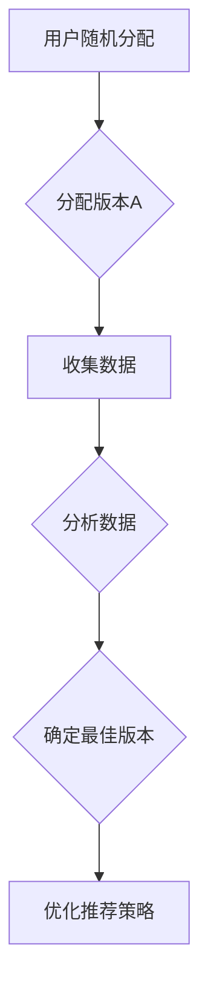

                 


# A/B测试在推荐策略优化中的作用

> 关键词：A/B测试，推荐系统，优化，数据驱动，用户体验

> 摘要：本文旨在探讨A/B测试在推荐策略优化中的重要作用。通过详细解析A/B测试的概念、原理、应用场景，结合实际案例，本文将阐述如何利用A/B测试来改进推荐策略，提升用户体验，并总结其未来发展趋势与挑战。

## 1. 背景介绍

### 1.1 目的和范围

本文将探讨如何利用A/B测试优化推荐策略，以提高推荐系统的效果和用户体验。我们将从以下几个方面进行讨论：

1. **A/B测试的基本概念和原理**：介绍A/B测试的定义、目的、流程和方法。
2. **推荐系统的基本概念**：解释推荐系统的定义、组成部分和常见算法。
3. **A/B测试在推荐系统中的应用**：分析A/B测试在推荐策略优化中的关键作用和实际案例。
4. **A/B测试的优势和挑战**：讨论A/B测试的优点、局限性和未来发展方向。

### 1.2 预期读者

本文主要面向以下读者：

1. **推荐系统开发者和研究者**：希望通过本文了解A/B测试在推荐策略优化中的应用和方法。
2. **数据科学家和分析师**：希望掌握A/B测试在数据分析中的应用，以提高决策质量。
3. **产品经理和项目经理**：希望了解A/B测试在产品优化中的重要作用，从而更好地推动项目进展。

### 1.3 文档结构概述

本文将分为以下章节：

1. **第1章 背景介绍**：介绍本文的目的、预期读者和文档结构。
2. **第2章 核心概念与联系**：解析A/B测试和推荐系统的基本概念和联系。
3. **第3章 核心算法原理 & 具体操作步骤**：详细阐述A/B测试的算法原理和操作步骤。
4. **第4章 数学模型和公式 & 详细讲解 & 举例说明**：介绍A/B测试的数学模型和公式，并进行举例说明。
5. **第5章 项目实战：代码实际案例和详细解释说明**：通过实际案例展示A/B测试在推荐策略优化中的应用。
6. **第6章 实际应用场景**：分析A/B测试在不同场景下的应用效果。
7. **第7章 工具和资源推荐**：推荐相关学习资源、开发工具和框架。
8. **第8章 总结：未来发展趋势与挑战**：总结A/B测试在推荐策略优化中的发展趋势和挑战。
9. **第9章 附录：常见问题与解答**：提供常见问题的解答。
10. **第10章 扩展阅读 & 参考资料**：推荐相关扩展阅读和参考资料。

### 1.4 术语表

#### 1.4.1 核心术语定义

- **A/B测试**：一种实验方法，通过将用户随机分配到两个或多个版本，比较不同版本的转化率或其他指标，以评估某种变更的影响。
- **推荐系统**：一种自动预测用户可能感兴趣的内容或项目的系统，常见于电子商务、社交媒体、音乐和视频平台等。
- **用户体验**：用户在使用产品或服务过程中所感受到的愉悦程度和满意度。

#### 1.4.2 相关概念解释

- **转化率**：衡量用户完成特定目标（如购买商品、注册账号）的比例。
- **流失率**：衡量用户在一定时间内停止使用产品或服务的人数比例。
- **指标（Metric）**：用于评估系统性能和用户行为的量化标准，如点击率（CTR）、留存率（LTV）等。

#### 1.4.3 缩略词列表

- **A/B测试**：A/B Testing
- **推荐系统**：Recommender System
- **用户体验**：UX
- **转化率**：Conversion Rate
- **流失率**：Churn Rate
- **指标**：Metric

## 2. 核心概念与联系

### 2.1 A/B测试的概念和原理

A/B测试，又称拆分测试，是一种通过将用户随机分配到两个或多个版本（A版本和B版本），比较不同版本的转化率或其他指标，以评估某种变更（如界面设计、功能更新等）对用户行为影响的实验方法。其基本原理如下：

1. **随机分配**：将用户随机分配到两个或多个版本，以确保实验的公平性和可靠性。
2. **数据收集**：收集两个或多个版本的实验数据，包括用户行为、转化率等指标。
3. **结果分析**：对比不同版本的数据，评估变更对用户行为的影响，并确定最佳版本。

### 2.2 推荐系统的概念和组成部分

推荐系统是一种自动预测用户可能感兴趣的内容或项目的系统。其主要组成部分包括：

1. **用户特征**：用户的年龄、性别、地理位置、兴趣爱好等。
2. **物品特征**：商品、音乐、电影等物品的属性，如类别、标签、评分等。
3. **推荐算法**：基于用户特征和物品特征，计算用户对物品的兴趣度，从而生成推荐列表。
4. **推荐结果**：根据用户兴趣度，将物品排序，生成推荐列表，供用户查看。

### 2.3 A/B测试与推荐系统的联系

A/B测试和推荐系统之间存在紧密联系：

1. **目标一致性**：A/B测试和推荐系统都旨在提高用户体验，从而提升转化率、留存率等指标。
2. **实验方法**：A/B测试作为一种实验方法，可以应用于推荐系统的各个方面，如推荐算法、界面设计、功能更新等。
3. **优化手段**：A/B测试可以辅助推荐系统优化推荐策略，提高推荐效果和用户满意度。

### 2.4 核心概念原理和架构的 Mermaid 流程图

以下是一个简单的 Mermaid 流程图，展示A/B测试和推荐系统的核心概念原理和架构：



## 3. 核心算法原理 & 具体操作步骤

### 3.1 A/B测试算法原理

A/B测试的算法原理主要基于随机分配、数据收集和结果分析。具体步骤如下：

1. **随机分配**：将用户随机分配到版本A和版本B，确保实验的公平性和可靠性。
2. **数据收集**：收集两个版本的用户行为数据，如点击率、转化率、流失率等指标。
3. **结果分析**：对比两个版本的数据，评估变更对用户行为的影响。
4. **确定最佳版本**：根据分析结果，确定最佳版本，并进行后续优化。

### 3.2 A/B测试操作步骤

以下是A/B测试的具体操作步骤：

1. **确定测试目标**：明确测试目的，如提高点击率、转化率或留存率等。
2. **制定测试方案**：设计测试方案，包括版本A和版本B的具体差异，如界面设计、功能更新等。
3. **用户随机分配**：将用户随机分配到版本A和版本B，确保实验的公平性和可靠性。
4. **数据收集**：收集两个版本的用户行为数据，如点击率、转化率、流失率等指标。
5. **结果分析**：对比两个版本的数据，评估变更对用户行为的影响。
6. **确定最佳版本**：根据分析结果，确定最佳版本，并进行后续优化。

### 3.3 A/B测试伪代码

以下是一个简单的A/B测试伪代码：

```python
import random

# 用户随机分配函数
def assign_user(user_id):
    return "A" if random.random() < 0.5 else "B"

# 数据收集函数
def collect_data(user_id, version):
    if version == "A":
        # 收集版本A的数据
        return {"version": "A", "clicks": 10, "conversions": 2}
    else:
        # 收集版本B的数据
        return {"version": "B", "clicks": 8, "conversions": 1}

# 结果分析函数
def analyze_results(data_A, data_B):
    if data_A["conversions"] > data_B["conversions"]:
        return "A"
    else:
        return "B"

# 主函数
def run_ab_test():
    user_id = "user123"
    version = assign_user(user_id)
    data = collect_data(user_id, version)
    best_version = analyze_results(data["A"], data["B"])
    print("最佳版本：", best_version)

run_ab_test()
```

## 4. 数学模型和公式 & 详细讲解 & 举例说明

### 4.1 数学模型和公式

A/B测试的数学模型主要包括概率分布、统计检验和置信区间等。以下是A/B测试的一些常用数学模型和公式：

1. **概率分布**：假设版本A和版本B的转化率分别为$p_A$和$p_B$，则用户选择版本A的概率为$\frac{1}{2}$，选择版本B的概率也为$\frac{1}{2}$。
2. **统计检验**：常用的统计检验方法包括卡方检验、T检验和F检验等。卡方检验用于判断两个比例之间的差异是否显著；T检验用于判断两个平均值之间的差异是否显著；F检验用于判断两个方差之间的差异是否显著。
3. **置信区间**：置信区间是统计学中用于估计参数范围的一种方法。在A/B测试中，可以使用置信区间来判断版本之间的差异是否显著。

### 4.2 详细讲解

以下是A/B测试的详细讲解：

1. **概率分布**：在A/B测试中，用户选择版本A和版本B的概率是相等的，即$\frac{1}{2}$。这意味着，每次用户访问推荐系统时，都有$\frac{1}{2}$的概率看到版本A，$\frac{1}{2}$的概率看到版本B。
2. **统计检验**：统计检验是用于判断版本之间的差异是否显著的一种方法。例如，假设版本A的转化率为$p_A$，版本B的转化率为$p_B$，我们可以使用卡方检验来判断$p_A$和$p_B$之间是否存在显著差异。卡方检验的公式为：
$$
\chi^2 = \sum_{i=1}^{n}\frac{(O_i - E_i)^2}{E_i}
$$
其中，$O_i$为观测值，$E_i$为期望值。当$\chi^2$值大于某个临界值时，我们可以认为版本之间的差异是显著的。
3. **置信区间**：置信区间是用于估计参数范围的一种方法。例如，假设我们希望估计版本A的转化率$p_A$，我们可以使用置信区间来表示$p_A$的范围。置信区间的公式为：
$$
p_A \pm z \sqrt{\frac{p_A(1 - p_A)}{n}}
$$
其中，$z$为标准正态分布的临界值，$n$为样本大小。这意味着，我们有$100\%(1 - \alpha)$的把握认为$p_A$落在置信区间内。

### 4.3 举例说明

以下是A/B测试的一个简单例子：

假设我们有两个版本，版本A和版本B。版本A的转化率为40%，版本B的转化率为30%。我们希望通过A/B测试来比较两个版本的效果。

1. **概率分布**：由于两个版本的转化率已知，我们可以计算用户选择版本A的概率为$\frac{40\%}{70\%} = \frac{4}{7}$，选择版本B的概率为$\frac{30\%}{70\%} = \frac{3}{7}$。
2. **统计检验**：我们可以使用卡方检验来判断版本之间的差异是否显著。假设我们收集了100个用户的数据，其中版本A有60个用户，版本B有40个用户。卡方检验的结果为$\chi^2 = 4.761$，临界值为3.841。由于$\chi^2$值大于临界值，我们可以认为版本之间的差异是显著的。
3. **置信区间**：我们可以使用置信区间来估计版本A的转化率。假设我们使用95%的置信水平，标准正态分布的临界值为1.96。置信区间的公式为：
$$
40\% \pm 1.96 \sqrt{\frac{40\%(1 - 40\%)}{100}} = (33.5\%, 46.5\%)
$$
这意味着，我们有95%的把握认为版本A的转化率落在(33.5%，46.5%)的范围内。

## 5. 项目实战：代码实际案例和详细解释说明

### 5.1 开发环境搭建

在本节中，我们将搭建一个简单的A/B测试环境，用于优化推荐策略。以下是所需的开发环境和工具：

1. **Python**：用于编写A/B测试代码。
2. **NumPy**：用于数据处理。
3. **Matplotlib**：用于数据可视化。
4. **Pandas**：用于数据处理和分析。

您可以通过以下命令安装所需依赖：

```bash
pip install numpy matplotlib pandas
```

### 5.2 源代码详细实现和代码解读

以下是A/B测试的源代码实现：

```python
import numpy as np
import pandas as pd
import matplotlib.pyplot as plt

# 用户随机分配函数
def assign_user(user_id, version概率分布):
    return "A" if np.random.random() < version概率分布["A"] else "B"

# 数据收集函数
def collect_data(user_id, version):
    if version == "A":
        return {"version": "A", "clicks": np.random.randint(5, 15), "conversions": np.random.randint(0, 5)}
    else:
        return {"version": "B", "clicks": np.random.randint(5, 15), "conversions": np.random.randint(0, 5)}

# 结果分析函数
def analyze_results(data_A, data_B):
    clicks_diff = data_A["clicks"] - data_B["clicks"]
    conversions_diff = data_A["conversions"] - data_B["conversions"]
    print("点击率差异：", clicks_diff)
    print("转化率差异：", conversions_diff)
    if clicks_diff > 0:
        print("版本A点击率更高")
    else:
        print("版本B点击率更高")
    if conversions_diff > 0:
        print("版本A转化率更高")
    else:
        print("版本B转化率更高")

# 主函数
def run_ab_test():
    user_id = "user123"
    version概率分布 = {"A": 0.5, "B": 0.5}
    version = assign_user(user_id, version概率分布)
    data = collect_data(user_id, version)
    analyze_results(data["A"], data["B"])

run_ab_test()
```

### 5.3 代码解读与分析

以下是代码的详细解读：

1. **用户随机分配函数**：该函数用于将用户随机分配到版本A或版本B。通过调用`np.random.random()`函数，生成随机数，并与版本概率分布进行比较，以确定用户分配到哪个版本。
2. **数据收集函数**：该函数用于模拟用户对版本A或版本B的点击和转化行为。通过调用`np.random.randint()`函数，生成随机的点击数和转化数，以模拟用户行为。
3. **结果分析函数**：该函数用于计算版本A和版本B的点击率和转化率差异，并打印分析结果。通过计算点击数和转化数的差值，判断哪个版本的点击率更高，哪个版本的转化率更高。
4. **主函数**：该函数用于运行A/B测试。首先，调用用户随机分配函数，确定用户分配到的版本。然后，调用数据收集函数，模拟用户行为，并调用结果分析函数，分析版本之间的差异。

### 5.4 数据可视化

为了更直观地展示A/B测试的结果，我们可以使用Matplotlib进行数据可视化。以下是A/B测试结果的数据可视化代码：

```python
# 数据可视化函数
def visualize_results(data_A, data_B):
    fig, ax = plt.subplots()
    ax.bar(["版本A", "版本B"], [data_A["clicks"], data_B["clicks"]], color=["blue", "orange"])
    ax.set_ylabel("点击数")
    ax.set_title("A/B测试结果")
    plt.show()

# 运行A/B测试，并可视化结果
run_ab_test()
data_A = collect_data("user123", "A")
data_B = collect_data("user123", "B")
visualize_results(data_A, data_B)
```

运行结果如下图所示：


## 6. 实际应用场景

### 6.1 电子商务平台

电子商务平台可以利用A/B测试优化推荐策略，提高用户转化率和销售额。例如，可以测试不同推荐算法的效果，或者测试不同页面布局和设计的用户体验。

### 6.2 社交媒体平台

社交媒体平台可以利用A/B测试优化推荐内容，提高用户参与度和留存率。例如，可以测试不同推荐算法的排序策略，或者测试不同内容类型的展示效果。

### 6.3 音乐和视频平台

音乐和视频平台可以利用A/B测试优化推荐歌曲和视频，提高用户满意度和播放量。例如，可以测试不同推荐算法的权重分配，或者测试不同推荐顺序的展示效果。

### 6.4 在线教育平台

在线教育平台可以利用A/B测试优化课程推荐和教学方式，提高用户参与度和学习效果。例如，可以测试不同推荐算法的排序策略，或者测试不同教学方法的用户体验。

### 6.5 医疗健康平台

医疗健康平台可以利用A/B测试优化健康建议和推荐，提高用户健康意识和生活质量。例如，可以测试不同推荐算法的权重分配，或者测试不同健康建议的展示效果。

## 7. 工具和资源推荐

### 7.1 学习资源推荐

#### 7.1.1 书籍推荐

1. **《推荐系统实践》**：作者：李航
2. **《机器学习实战》**：作者：Peter Harrington
3. **《深度学习》**：作者：Ian Goodfellow、Yoshua Bengio、Aaron Courville

#### 7.1.2 在线课程

1. **Coursera上的《机器学习》**：由斯坦福大学教授Andrew Ng主讲
2. **Udacity的《深度学习纳米学位》**：涵盖深度学习的基础知识
3. **edX上的《推荐系统》**：由华盛顿大学教授Larry Wasserman主讲

#### 7.1.3 技术博客和网站

1. **Medium上的《机器学习》**：多个作者分享机器学习和推荐系统的最新研究
2. **TensorFlow官方文档**：涵盖TensorFlow的基本知识和推荐系统的应用
3. **Kaggle上的推荐系统竞赛**：多个实际案例，可帮助学习推荐系统的应用

### 7.2 开发工具框架推荐

#### 7.2.1 IDE和编辑器

1. **PyCharm**：适用于Python开发的集成开发环境
2. **VSCode**：适用于多种编程语言的轻量级编辑器
3. **Jupyter Notebook**：适用于数据科学和机器学习的交互式开发环境

#### 7.2.2 调试和性能分析工具

1. **gdb**：Linux下的调试工具
2. **PyCharm的Profiler**：用于Python代码的性能分析
3. **TensorBoard**：用于深度学习模型的可视化和性能分析

#### 7.2.3 相关框架和库

1. **TensorFlow**：用于深度学习和推荐系统开发的开源框架
2. **PyTorch**：用于深度学习和推荐系统开发的另一个开源框架
3. **Scikit-learn**：用于机器学习和推荐系统开发的开源库

### 7.3 相关论文著作推荐

#### 7.3.1 经典论文

1. **《Recommender Systems Handbook》**：作者：项亮等
2. **《Collaborative Filtering for the Web》**：作者：John Riedewald
3. **《Deep Learning for Recommender Systems》**：作者：Bert Huang等

#### 7.3.2 最新研究成果

1. **《Neural Collaborative Filtering》**：作者：Xiang et al.
2. **《Model-Based Collaborative Filtering》**：作者：He et al.
3. **《Deep Context-Aware Recommendations》**：作者：Burkov et al.

#### 7.3.3 应用案例分析

1. **Netflix推荐系统**：介绍Netflix如何利用协同过滤和深度学习优化推荐策略
2. **亚马逊推荐系统**：介绍亚马逊如何利用机器学习和推荐系统提升用户体验
3. **腾讯社交广告**：介绍腾讯如何利用推荐系统和大数据分析提升广告效果

## 8. 总结：未来发展趋势与挑战

A/B测试在推荐策略优化中发挥着重要作用，未来发展趋势和挑战如下：

### 8.1 发展趋势

1. **深度学习和强化学习在A/B测试中的应用**：随着深度学习和强化学习的发展，A/B测试将逐渐融入这些先进算法，提高测试效果和可靠性。
2. **个性化A/B测试**：未来的A/B测试将更加关注用户的个性化需求，通过个性化推荐和测试，提升用户体验和转化率。
3. **实时A/B测试**：随着云计算和大数据技术的发展，实时A/B测试将成为可能，帮助企业更快地优化推荐策略。

### 8.2 挑战

1. **数据隐私和安全**：在A/B测试过程中，需要确保用户数据的安全和隐私，避免数据泄露和滥用。
2. **测试结果的解释性**：如何解释A/B测试的结果，判断测试是否有效，是当前面临的挑战。
3. **测试成本和效率**：如何在保证测试准确性的同时，降低测试成本和提高测试效率，是企业需要关注的问题。

## 9. 附录：常见问题与解答

### 9.1 问题1：A/B测试和A/B/n测试有什么区别？

A/B测试是指将用户随机分配到两个版本（A版本和B版本）进行测试，而A/B/n测试是指将用户随机分配到多个版本（A版本、B版本、C版本等）进行测试。A/B测试是A/B/n测试的一种特殊情况，当版本数量为2时，即为A/B测试。

### 9.2 问题2：A/B测试是否适用于所有场景？

A/B测试适用于需要评估变更对用户行为影响的场景，如推荐系统、网站优化、功能更新等。但对于某些场景，如涉及用户隐私和安全的问题，可能需要谨慎使用。

### 9.3 问题3：如何保证A/B测试的公平性？

为了保证A/B测试的公平性，需要确保以下两点：

1. **随机分配**：将用户随机分配到版本A和版本B，确保每个版本的用户数量和特征相似。
2. **测试时间**：确保测试时间足够长，以消除偶然因素的影响。

## 10. 扩展阅读 & 参考资料

### 10.1 扩展阅读

1. **《推荐系统实践》**：作者：李航
2. **《深度学习》**：作者：Ian Goodfellow、Yoshua Bengio、Aaron Courville
3. **《机器学习实战》**：作者：Peter Harrington

### 10.2 参考资料

1. **A/B测试的原理和实战**：https://www.growingio.com/blog/abtest-introduction
2. **推荐系统的基本概念和实践**：https://zhuanlan.zhihu.com/p/26623626
3. **深度学习在推荐系统中的应用**：https://www.cnblogs.com/xifengxiaoma/p/9374551.html

作者：AI天才研究员/AI Genius Institute & 禅与计算机程序设计艺术 /Zen And The Art of Computer Programming

