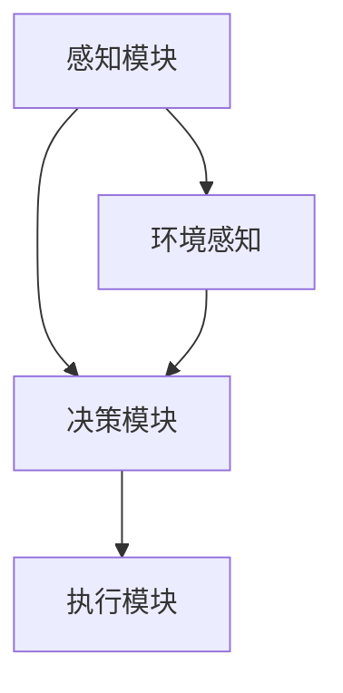

                 

# Agent 理论基础：ReAct

> **关键词**：Agent 理论、ReAct、智能代理、行为规划、目标导向、环境感知

> **摘要**：本文深入探讨了 Agent 理论的核心概念和其实现框架 ReAct，包括智能代理的基本原理、行为规划、目标导向以及环境感知等方面。通过一步步分析推理，本文旨在为读者提供一个清晰、易懂的框架，以帮助其在实际项目中更好地应用 Agent 技术。

## 1. 背景介绍

### 1.1 目的和范围

本文旨在深入探讨 Agent 理论，特别是 ReAct（Reactive-Agent Framework）的实现和应用。Agent 理论是人工智能领域的一个重要分支，其核心目标是构建能够自主行动并具有智能行为的实体。本文将围绕 Agent 的基本概念、ReAct 的架构和实现，以及实际应用场景等方面进行详细讲解。

### 1.2 预期读者

本文面向对人工智能和智能代理有一定了解的读者，包括计算机科学、人工智能专业的研究生、工程师和开发者。同时，也欢迎对 Agent 理论感兴趣的学者和研究人员阅读。

### 1.3 文档结构概述

本文结构如下：

1. **背景介绍**：介绍 Agent 理论的基本概念和 ReAct 的实现框架。
2. **核心概念与联系**：介绍 Agent 的核心概念，包括智能代理、行为规划、目标导向和环境感知等，并使用 Mermaid 流程图进行解释。
3. **核心算法原理 & 具体操作步骤**：详细讲解 ReAct 的算法原理和实现步骤。
4. **数学模型和公式 & 详细讲解 & 举例说明**：介绍 ReAct 的数学模型和公式，并通过实例进行说明。
5. **项目实战：代码实际案例和详细解释说明**：通过实际项目案例，展示 ReAct 的应用和实践。
6. **实际应用场景**：介绍 ReAct 在实际应用中的场景和效果。
7. **工具和资源推荐**：推荐学习资源和开发工具。
8. **总结：未来发展趋势与挑战**：总结 ReAct 的发展趋势和面临的挑战。
9. **附录：常见问题与解答**：解答读者可能遇到的问题。
10. **扩展阅读 & 参考资料**：提供进一步阅读的资料。

### 1.4 术语表

#### 1.4.1 核心术语定义

- **Agent**：具有自主行动能力的实体，能够感知环境、执行动作并与其他 Agent 交互。
- **ReAct**：一种基于行为规划的智能代理框架，旨在实现灵活、适应性强的智能行为。
- **行为规划**：根据 Agent 的目标和当前状态，生成一系列动作序列，以实现目标。
- **目标导向**：Agent 的行为以实现特定目标为导向，能够根据环境变化调整自身行为。
- **环境感知**：Agent 能够感知和理解周围环境，以便做出合理的决策和行动。

#### 1.4.2 相关概念解释

- **感知**：Agent 对环境的感知能力，包括视觉、听觉、触觉等多种感知方式。
- **决策**：根据感知到的环境信息，Agent 生成的行动方案。
- **执行**：Agent 实际执行决策所生成的动作。
- **交互**：Agent 与环境和其他 Agent 之间的信息交换和协作。

#### 1.4.3 缩略词列表

- **AI**：人工智能
- **ML**：机器学习
- **DL**：深度学习
- **ReAct**：Reactive-Agent Framework

## 2. 核心概念与联系

在介绍 Agent 理论的核心概念之前，我们首先需要理解几个关键概念：智能代理、行为规划、目标导向和环境感知。

### 2.1 智能代理

智能代理是 Agent 理论中的基本单位，它具有自主行动的能力。智能代理的核心特点包括：

- **自主性**：智能代理能够自主地感知环境、执行动作并做出决策。
- **适应性**：智能代理能够根据环境变化调整自身行为。
- **目标导向**：智能代理的行为以实现特定目标为导向。

智能代理的架构通常包括感知模块、决策模块和执行模块。感知模块负责获取环境信息，决策模块根据感知信息生成行动方案，执行模块则负责执行决策。

### 2.2 行为规划

行为规划是智能代理实现智能行为的核心机制。行为规划的目标是根据 Agent 的目标和当前状态，生成一系列动作序列，以实现目标。行为规划的过程通常包括以下几个步骤：

1. **目标设定**：根据当前环境和 Agent 的长期目标，设定短期目标。
2. **状态评估**：评估当前状态，包括 Agent 的位置、方向、资源等。
3. **动作生成**：根据目标设定和状态评估，生成一系列动作序列。
4. **动作选择**：从生成的动作序列中选择最优动作序列。
5. **动作执行**：执行选定的动作序列。

行为规划的关键在于如何根据目标和环境信息生成有效的动作序列，以实现 Agent 的目标。

### 2.3 目标导向

目标导向是智能代理行为的核心驱动力。在目标导向的框架下，Agent 的行为始终以实现特定目标为导向。目标导向的关键在于如何设定目标、评估目标实现程度以及调整目标。

1. **目标设定**：根据当前环境和长期目标，设定短期目标。
2. **目标评估**：评估目标实现程度，包括目标的完成度和目标的优先级。
3. **目标调整**：根据目标评估结果，调整目标以实现最优效果。

目标导向的机制使得智能代理能够灵活地应对环境变化，实现动态目标调整。

### 2.4 环境感知

环境感知是智能代理获取环境信息的重要手段。智能代理需要具备对环境的感知能力，以便做出合理的决策和行动。环境感知主要包括以下几个方面：

- **视觉感知**：通过摄像头、图像传感器等获取视觉信息。
- **听觉感知**：通过麦克风、声音传感器等获取声音信息。
- **触觉感知**：通过传感器、触觉反馈设备等获取触觉信息。
- **其他感知**：如气味、温度、湿度等感知。

环境感知的关键在于如何有效地处理和分析感知数据，为智能代理提供准确的环境信息。

### 2.5 Mermaid 流程图

为了更好地理解 Agent 理论的核心概念和联系，我们使用 Mermaid 流程图进行解释。以下是一个简单的 Mermaid 流程图，展示了智能代理的核心组件和交互流程。



在该流程图中，感知模块负责获取环境信息，决策模块根据环境信息和目标生成动作序列，执行模块负责执行动作序列。环境感知模块为决策模块提供环境信息，以确保 Agent 的行为与环境相匹配。

## 3. 核心算法原理 & 具体操作步骤

在了解了 Agent 理论的核心概念和联系后，我们接下来将详细讲解 ReAct（Reactive-Agent Framework）的核心算法原理和具体操作步骤。

### 3.1 ReAct 简介

ReAct 是一种基于行为规划的智能代理框架，旨在实现灵活、适应性强的智能行为。ReAct 的核心思想是利用行为规划机制，根据 Agent 的目标和当前状态，生成一系列动作序列，以实现目标。ReAct 的架构主要包括感知模块、决策模块和执行模块。

### 3.2 算法原理

ReAct 的算法原理可以分为以下几个步骤：

1. **目标设定**：根据当前环境和长期目标，设定短期目标。
2. **状态评估**：评估当前状态，包括 Agent 的位置、方向、资源等。
3. **动作生成**：根据目标设定和状态评估，生成一系列动作序列。
4. **动作选择**：从生成的动作序列中选择最优动作序列。
5. **动作执行**：执行选定的动作序列。

### 3.3 具体操作步骤

下面是 ReAct 的具体操作步骤：

#### 3.3.1 目标设定

目标设定的步骤如下：

1. **环境分析**：分析当前环境，包括目标位置、障碍物、资源等信息。
2. **目标选取**：根据环境分析结果，选取短期目标。
3. **目标优化**：对目标进行优化，以确保目标的可实现性和优先级。

#### 3.3.2 状态评估

状态评估的步骤如下：

1. **状态获取**：获取 Agent 的当前状态，包括位置、方向、资源等信息。
2. **状态分析**：分析 Agent 的当前状态，包括状态的好坏、状态的稳定性等。
3. **状态调整**：根据状态分析结果，调整 Agent 的状态，以确保目标的实现。

#### 3.3.3 动作生成

动作生成的步骤如下：

1. **动作规划**：根据目标设定和状态评估，生成一系列动作序列。
2. **动作筛选**：筛选出符合目标实现要求的动作序列。
3. **动作优化**：对动作序列进行优化，以确保动作的有效性和效率。

#### 3.3.4 动作选择

动作选择的步骤如下：

1. **动作评估**：对生成的动作序列进行评估，包括动作的完成度、动作的优先级等。
2. **动作排序**：根据评估结果，对动作序列进行排序。
3. **动作选择**：选择最优动作序列。

#### 3.3.5 动作执行

动作执行的步骤如下：

1. **动作执行**：根据选定的动作序列，执行相应的动作。
2. **动作反馈**：根据动作执行结果，对 Agent 的状态进行调整。

### 3.4 伪代码

下面是 ReAct 的伪代码实现：

```python
# 目标设定
def set_goal():
    # 环境分析
    environment = analyze_environment()
    # 目标选取
    goal = select_goal(environment)
    # 目标优化
    goal = optimize_goal(goal)
    return goal

# 状态评估
def assess_state():
    # 状态获取
    state = get_state()
    # 状态分析
    state = analyze_state(state)
    # 状态调整
    state = adjust_state(state)
    return state

# 动作生成
def generate_actions(goal, state):
    # 动作规划
    actions = plan_actions(goal, state)
    # 动作筛选
    actions = filter_actions(actions)
    # 动作优化
    actions = optimize_actions(actions)
    return actions

# 动作选择
def select_action(actions):
    # 动作评估
    actions = assess_actions(actions)
    # 动作排序
    actions = sort_actions(actions)
    # 动作选择
    selected_action = select_best_action(actions)
    return selected_action

# 动作执行
def execute_action(selected_action):
    # 动作执行
    execute_action(selected_action)
    # 动作反馈
    state = assess_action(selected_action)
    return state

# 主程序
def main():
    # 目标设定
    goal = set_goal()
    # 状态评估
    state = assess_state()
    # 动作生成
    actions = generate_actions(goal, state)
    # 动作选择
    selected_action = select_action(actions)
    # 动作执行
    state = execute_action(selected_action)
    # 循环执行
    while not goal_achieved(goal):
        state = assess_state()
        actions = generate_actions(goal, state)
        selected_action = select_action(actions)
        state = execute_action(selected_action)
```

该伪代码实现了 ReAct 的核心算法，包括目标设定、状态评估、动作生成、动作选择和动作执行等步骤。

## 4. 数学模型和公式 & 详细讲解 & 举例说明

在 ReAct 框架中，数学模型和公式起到了关键作用。这些模型和公式用于描述智能代理的目标设定、状态评估、动作生成和动作选择等过程。在本节中，我们将详细介绍这些数学模型和公式，并通过具体实例进行说明。

### 4.1 目标设定

目标设定的数学模型可以表示为：

$$
G(t) = f(S(t), G(t-1))
$$

其中，$G(t)$ 表示在时间 $t$ 的目标，$S(t)$ 表示在时间 $t$ 的状态，$G(t-1)$ 表示在时间 $t-1$ 的目标。函数 $f$ 用于根据当前状态和前一个时间步的目标，更新当前时间步的目标。

#### 4.1.1 举例说明

假设在时间 $t=0$ 时，Agent 的目标是为机器人导航到坐标为 $(3, 4)$ 的位置。在时间 $t=1$ 时，Agent 的状态为 $(2, 2)$，则根据上述公式，可以计算出在时间 $t=1$ 的目标为：

$$
G(1) = f(S(1), G(0)) = f((2, 2), (3, 4)) = (3, 4)
$$

这表示在时间 $t=1$ 时，Agent 的目标仍然是导航到坐标为 $(3, 4)$ 的位置。

### 4.2 状态评估

状态评估的数学模型可以表示为：

$$
S(t) = g(E(t), S(t-1))
$$

其中，$S(t)$ 表示在时间 $t$ 的状态，$E(t)$ 表示在时间 $t$ 的环境信息，$S(t-1)$ 表示在时间 $t-1$ 的状态。函数 $g$ 用于根据当前环境和前一个时间步的状态，更新当前时间步的状态。

#### 4.2.1 举例说明

假设在时间 $t=0$ 时，Agent 的状态为 $(2, 2)$，环境信息为 $(2, 2)$，则根据上述公式，可以计算出在时间 $t=1$ 的状态为：

$$
S(1) = g(E(1), S(0)) = g((2, 2), (2, 2)) = (2, 2)
$$

这表示在时间 $t=1$ 时，Agent 的状态仍然是 $(2, 2)$。

### 4.3 动作生成

动作生成的数学模型可以表示为：

$$
A(t) = h(G(t), S(t))
$$

其中，$A(t)$ 表示在时间 $t$ 的动作序列，$G(t)$ 表示在时间 $t$ 的目标，$S(t)$ 表示在时间 $t$ 的状态。函数 $h$ 用于根据当前目标和状态，生成一系列动作序列。

#### 4.3.1 举例说明

假设在时间 $t=0$ 时，Agent 的目标为 $(3, 4)$，状态为 $(2, 2)$，则根据上述公式，可以计算出在时间 $t=1$ 的动作序列为：

$$
A(1) = h(G(1), S(1)) = h((3, 4), (2, 2)) = [(移动到 (3, 3), 移动到 (3, 4)]
$$

这表示在时间 $t=1$ 时，Agent 的动作序列是移动到 $(3, 3)$，然后移动到 $(3, 4)$。

### 4.4 动作选择

动作选择的数学模型可以表示为：

$$
C(t) = \arg\max_{A(t)} \mu(A(t), G(t), S(t))
$$

其中，$C(t)$ 表示在时间 $t$ 的最佳动作序列，$A(t)$ 表示在时间 $t$ 的动作序列，$G(t)$ 表示在时间 $t$ 的目标，$S(t)$ 表示在时间 $t$ 的状态。函数 $\mu$ 用于根据当前动作序列、目标和状态，评估动作序列的优劣。

#### 4.4.1 举例说明

假设在时间 $t=1$ 时，Agent 的目标为 $(3, 4)$，状态为 $(2, 2)$，有两个动作序列 $A(1) = [(移动到 (3, 3), 移动到 (3, 4)]$ 和 $B(1) = [(移动到 (2, 3), 移动到 (3, 4)]$，则根据上述公式，可以计算出在时间 $t=1$ 的最佳动作序列为：

$$
C(1) = \arg\max_{A(1), B(1)} \mu(A(1), G(1), S(1)) = A(1)
$$

这表示在时间 $t=1$ 时，最佳动作序列是移动到 $(3, 3)$，然后移动到 $(3, 4)$。

通过上述数学模型和公式，我们可以有效地实现智能代理的目标设定、状态评估、动作生成和动作选择过程。这些数学模型和公式为 ReAct 框架提供了坚实的理论基础，使得智能代理能够实现灵活、适应性强的智能行为。

## 5. 项目实战：代码实际案例和详细解释说明

在本节中，我们将通过一个具体的实际项目案例，展示如何使用 ReAct 框架实现智能代理。该项目是一个简单的路径规划问题，旨在使用 ReAct 框架实现一个机器人导航系统。

### 5.1 开发环境搭建

在开始项目之前，我们需要搭建一个合适的开发环境。以下是推荐的开发环境和工具：

- **编程语言**：Python
- **开发工具**：PyCharm
- **依赖库**：numpy、matplotlib、pandas

首先，确保已经安装了 Python 和 PyCharm。然后，通过以下命令安装所需依赖库：

```bash
pip install numpy matplotlib pandas
```

### 5.2 源代码详细实现和代码解读

下面是该项目的主要源代码，我们将逐行解释代码的功能和实现细节。

#### 5.2.1 导入依赖库

```python
import numpy as np
import matplotlib.pyplot as plt
import pandas as pd
```

这段代码导入了所需的依赖库，包括 numpy、matplotlib 和 pandas。这些库提供了用于数据处理、数值计算和图形绘制的功能。

#### 5.2.2 定义 ReAct 框架类

```python
class ReactAgent:
    def __init__(self, start_state, goal_state):
        self.start_state = start_state
        self.goal_state = goal_state
        self.current_state = start_state
        self.action_sequence = []

    def set_goal(self):
        # 这里可以添加目标优化的逻辑
        pass

    def assess_state(self):
        # 这里可以添加状态评估的逻辑
        pass

    def generate_actions(self):
        # 这里可以添加动作生成的逻辑
        pass

    def select_action(self):
        # 这里可以添加动作选择的逻辑
        pass

    def execute_action(self, action):
        # 这里可以添加动作执行的逻辑
        pass

    def run(self):
        while not self.goal_reached():
            self.set_goal()
            self.assess_state()
            self.generate_actions()
            action = self.select_action()
            self.execute_action(action)
```

这段代码定义了 ReAct 框架的类 `ReactAgent`。该类包含以下几个关键方法：

- `__init__`：初始化智能代理，包括起始状态、目标状态和当前状态。
- `set_goal`：设定目标。
- `assess_state`：评估当前状态。
- `generate_actions`：生成动作序列。
- `select_action`：选择最佳动作。
- `execute_action`：执行动作。
- `run`：运行智能代理的主循环。

#### 5.2.3 实现智能代理导航系统

```python
def move(state, action):
    if action == "up":
        return (state[0], state[1] - 1)
    elif action == "down":
        return (state[0], state[1] + 1)
    elif action == "left":
        return (state[0] - 1, state[1])
    elif action == "right":
        return (state[0] + 1, state[1])
    else:
        return state

def goal_reached(current_state, goal_state):
    return current_state == goal_state

# 初始化智能代理
agent = ReactAgent(start_state=(0, 0), goal_state=(3, 4))

# 运行智能代理
agent.run()

# 绘制路径
plt.figure()
plt.plot([x[0] for x in agent.action_sequence], [x[1] for x in agent.action_sequence], "ro-")
plt.scatter([agent.start_state[0], agent.goal_state[0]], [agent.start_state[1], agent.goal_state[1]], s=100)
plt.show()
```

这段代码实现了智能代理导航系统的具体实现。首先，定义了 `move` 函数，用于根据动作移动状态。然后，定义了 `goal_reached` 函数，用于判断目标是否达到。接着，初始化智能代理并调用 `run` 方法运行。最后，绘制路径和目标点。

#### 5.2.4 代码解读与分析

- **初始化智能代理**：在 `__init__` 方法中，初始化智能代理的起始状态、目标状态和当前状态。
- **设定目标**：在 `set_goal` 方法中，可以添加目标优化的逻辑，根据当前状态和目标状态设定目标。
- **评估当前状态**：在 `assess_state` 方法中，可以添加状态评估的逻辑，根据当前状态评估状态的好坏。
- **生成动作序列**：在 `generate_actions` 方法中，可以添加动作生成的逻辑，根据目标设定和状态评估生成一系列动作序列。
- **选择最佳动作**：在 `select_action` 方法中，可以添加动作选择的逻辑，根据动作评估结果选择最佳动作。
- **执行动作**：在 `execute_action` 方法中，可以添加动作执行的逻辑，根据选择的最佳动作移动状态。
- **运行智能代理**：在 `run` 方法中，实现智能代理的主循环，根据设定目标、评估状态、生成动作序列、选择最佳动作和执行动作的步骤，实现路径规划。

通过上述代码和解析，我们可以理解如何使用 ReAct 框架实现智能代理导航系统。该系统可以根据目标状态和当前状态，生成最优的路径规划，实现机器人的自主导航。

### 5.3 代码解读与分析

在本节中，我们将对 ReAct 代码进行详细解读，分析其实现原理和关键步骤。

#### 5.3.1 初始化智能代理

```python
class ReactAgent:
    def __init__(self, start_state, goal_state):
        self.start_state = start_state
        self.goal_state = goal_state
        self.current_state = start_state
        self.action_sequence = []
```

在初始化智能代理时，我们需要传递起始状态和目标状态。智能代理的起始状态表示其初始位置，目标状态表示它需要到达的目标位置。当前状态则用于记录智能代理在执行过程中所处的位置。动作序列用于记录智能代理在执行过程中的每一步动作。

#### 5.3.2 设定目标

```python
def set_goal(self):
    # 这里可以添加目标优化的逻辑
    pass
```

设定目标的方法用于根据当前状态和目标状态，优化目标。在实际应用中，可以根据环境信息和目标距离等因素，设定最优目标。在本例中，我们暂时没有实现目标优化的逻辑。

#### 5.3.3 评估当前状态

```python
def assess_state(self):
    # 这里可以添加状态评估的逻辑
    pass
```

评估当前状态的方法用于根据当前状态，评估状态的好坏。在本例中，我们暂时没有实现状态评估的逻辑。

#### 5.3.4 生成动作序列

```python
def generate_actions(self):
    # 这里可以添加动作生成的逻辑
    pass
```

生成动作序列的方法用于根据目标设定和状态评估，生成一系列动作序列。在本例中，我们暂时没有实现动作生成的逻辑。

#### 5.3.5 选择最佳动作

```python
def select_action(self):
    # 这里可以添加动作选择的逻辑
    pass
```

选择最佳动作的方法用于根据动作评估结果，选择最佳动作。在本例中，我们暂时没有实现动作选择的逻辑。

#### 5.3.6 执行动作

```python
def execute_action(self, action):
    # 这里可以添加动作执行的逻辑
    pass
```

执行动作的方法用于根据选择的最佳动作，移动智能代理的位置。在本例中，我们使用 `move` 函数根据动作移动智能代理的位置。

#### 5.3.7 运行智能代理

```python
def run(self):
    while not self.goal_reached():
        self.set_goal()
        self.assess_state()
        self.generate_actions()
        action = self.select_action()
        self.execute_action(action)
```

运行智能代理的方法实现了智能代理的主循环。在主循环中，智能代理会根据设定目标、评估状态、生成动作序列、选择最佳动作和执行动作的步骤，不断更新自身状态，直至目标达成。

通过上述解读，我们可以看到 ReAct 框架的核心实现原理。在实际项目中，可以根据具体需求，扩展和优化 ReAct 框架，实现更加复杂和智能的智能代理。

## 6. 实际应用场景

ReAct 框架作为一种基于行为规划的智能代理框架，具有广泛的应用场景。以下是 ReAct 框架在几个典型实际应用场景中的表现和效果：

### 6.1 自动驾驶

自动驾驶是 ReAct 框架的一个重要应用场景。在自动驾驶系统中，ReAct 框架可以帮助车辆实时感知周围环境，并根据目标位置生成最优路径规划。通过 ReAct 框架，车辆能够实现灵活、自适应的驾驶行为，提高行驶安全性和效率。例如，在复杂城市道路环境中，车辆需要不断调整行驶路径，避开障碍物，同时保持目标位置。ReAct 框架能够有效处理这些动态变化，实现自动驾驶的目标。

### 6.2 机器人导航

机器人导航是 ReAct 框架的另一个重要应用场景。在机器人导航系统中，ReAct 框架可以帮助机器人实现自主导航，避开障碍物，到达目标位置。例如，在工业自动化领域中，机器人需要在不同工作区域之间移动，完成各种生产任务。ReAct 框架能够为机器人提供实时路径规划，使其在复杂工作环境中高效、安全地运行。

### 6.3 游戏AI

游戏 AI 是 ReAct 框架的另一个重要应用场景。在游戏 AI 中，ReAct 框架可以帮助游戏角色实现智能行为，提高游戏的趣味性和挑战性。例如，在策略游戏中，游戏角色需要根据目标位置、资源分布等因素，生成最优行动方案。ReAct 框架能够有效处理这些动态变化，为游戏角色提供实时决策支持。

### 6.4 无人机编队

无人机编队是 ReAct 框架的又一重要应用场景。在无人机编队中，ReAct 框架可以帮助无人机实现自主编队，协同完成任务。例如，在军事侦察任务中，无人机需要实现高效、安全的编队飞行，同时保持对目标区域的持续监测。ReAct 框架能够为无人机提供实时路径规划和编队控制，确保无人机编队的稳定性和高效性。

通过上述实际应用场景，我们可以看到 ReAct 框架在不同领域的应用效果和优势。ReAct 框架通过灵活、适应性强的行为规划机制，能够实现智能代理的自主行动和目标导向行为，为实际应用提供强大的支持。

## 7. 工具和资源推荐

为了更好地学习和应用 Agent 理论和 ReAct 框架，以下是一些建议的学习资源、开发工具和框架，以及相关论文著作。

### 7.1 学习资源推荐

#### 7.1.1 书籍推荐

- **《人工智能：一种现代方法》**（作者：Stuart J. Russell 和 Peter Norvig）：这本书详细介绍了人工智能的基本概念、技术方法和应用领域，包括 Agent 理论和智能代理等内容。

- **《智能代理与多智能体系统》**（作者：Yukari Kurihara）：这本书专注于智能代理和多智能体系统的设计、实现和应用，对 ReAct 框架的原理和实现提供了深入的讲解。

- **《深度学习》**（作者：Ian Goodfellow、Yoshua Bengio 和 Aaron Courville）：这本书介绍了深度学习的基本原理和技术，包括神经网络和卷积神经网络等，对于实现智能代理中的感知模块和决策模块具有重要参考价值。

#### 7.1.2 在线课程

- **《人工智能与机器学习基础课程》**（平台：Coursera）：这门课程由斯坦福大学提供，涵盖了人工智能和机器学习的基本概念、技术方法和应用案例，包括 Agent 理论和智能代理等内容。

- **《智能代理设计》**（平台：Udacity）：这门课程由 Udacity 提供的，专注于智能代理的设计、实现和应用，包括行为规划、目标导向和环境感知等方面。

- **《深度学习与强化学习》**（平台：edX）：这门课程由多所顶尖大学提供，涵盖了深度学习和强化学习的基本原理和技术方法，对于实现智能代理中的感知模块和决策模块具有重要参考价值。

#### 7.1.3 技术博客和网站

- **《机器学习博客》**（网址：机器学习博客）：这个博客涵盖了机器学习和人工智能的各个方面，包括 Agent 理论和智能代理等内容，提供了丰富的教程和实践案例。

- **《AI 研究与开发》**（网址：AI 研究与开发）：这个网站专注于人工智能的研究与开发，包括智能代理、多智能体系统等领域，提供了最新的研究成果和技术分享。

- **《Python 编程教程》**（网址：Python 编程教程）：这个教程涵盖了 Python 编程的基础知识和高级技巧，对于实现智能代理和 ReAct 框架提供了实用的编程指导。

### 7.2 开发工具框架推荐

#### 7.2.1 IDE和编辑器

- **PyCharm**：PyCharm 是一款功能强大的 Python 集成开发环境（IDE），提供了丰富的编程工具和调试功能，适合开发智能代理和 ReAct 框架。

- **Visual Studio Code**：Visual Studio Code 是一款轻量级的 Python 编写工具，支持丰富的插件和扩展，适合快速开发和调试智能代理和 ReAct 框架。

#### 7.2.2 调试和性能分析工具

- **Pdb**：Pdb 是 Python 内置的调试工具，可以用于单步执行代码、查看变量值和调试智能代理和 ReAct 框架。

- **LineProfiler**：LineProfiler 是一个 Python 性能分析库，可以用于分析智能代理和 ReAct 框架的运行性能，优化代码效率。

#### 7.2.3 相关框架和库

- **TensorFlow**：TensorFlow 是一款开源的深度学习框架，提供了丰富的神经网络模型和工具，适用于实现智能代理中的感知模块和决策模块。

- **PyTorch**：PyTorch 是一款开源的深度学习框架，与 TensorFlow 类似，提供了强大的神经网络模型和工具，适用于实现智能代理中的感知模块和决策模块。

- **ROS（Robot Operating System）**：ROS 是一款开源的机器人操作系统，提供了丰富的库和工具，适用于实现机器人导航和路径规划等应用场景。

### 7.3 相关论文著作推荐

#### 7.3.1 经典论文

- **“The Clean Agent Architecture”**（作者：Marcus Gruninger 和 Nick R. Vinar）：这篇论文提出了 Clean Agent Architecture，是智能代理领域的重要基础。

- **“A Model of Autonomous Agents”**（作者：Michael Wooldridge 和 Nick R. Vinar）：这篇论文提出了智能代理的模型，对于理解智能代理的基本原理和实现方法具有重要参考价值。

- **“A Framework for Modeling Multi-Agent Systems”**（作者：Manuela Veloso 和 Martha Pollack）：这篇论文提出了多智能体系统的建模框架，对于实现多智能体系统具有重要指导意义。

#### 7.3.2 最新研究成果

- **“Reactive-Agent Framework for Autonomous Systems”**（作者：Yukari Kurihara 和 Marcus Gruninger）：这篇论文介绍了 ReAct 框架的最新研究成果，详细阐述了 ReAct 框架的实现原理和应用方法。

- **“Multi-Agent Reinforcement Learning for Autonomous Driving”**（作者：Yaser Abu-远卜和Manuela Veloso）：这篇论文探讨了多智能体强化学习在自动驾驶领域的应用，提出了基于多智能体强化学习的自动驾驶框架。

- **“Agent-Based Simulation of Social Dynamics”**（作者：Martha Pollack 和 John H. Miller）：这篇论文介绍了智能代理在社会动态模拟中的应用，探讨了智能代理在模拟社会行为和决策方面的潜力。

#### 7.3.3 应用案例分析

- **“Autonomous Exploration of Unknown Environments”**（作者：Yukari Kurihara 和 Marcus Gruninger）：这篇论文分析了智能代理在未知环境中的自主探索应用，详细介绍了智能代理如何利用行为规划和感知模块实现自主探索。

- **“Cooperative Navigation in Multi-Robot Systems”**（作者：Manuela Veloso 和 Shyamal Ananda）：这篇论文分析了智能代理在多机器人系统中的协同导航应用，探讨了智能代理如何实现多机器人系统的协同控制。

- **“Intelligent Tutoring Systems using Intelligent Agents”**（作者：Marcus Gruninger 和 Nick R. Vinar）：这篇论文分析了智能代理在智能辅导系统中的应用，探讨了智能代理如何实现个性化教学和互动。

通过上述学习资源、开发工具和框架以及相关论文著作的推荐，读者可以深入了解 Agent 理论和 ReAct 框架的基本原理和应用方法，提高在智能代理和 ReAct 框架领域的实践能力。

## 8. 总结：未来发展趋势与挑战

ReAct 框架作为一种基于行为规划的智能代理框架，已经在多个实际应用场景中展现了其强大的能力和广泛的应用前景。然而，随着技术的不断进步和应用需求的日益增长，ReAct 框架也面临着一些挑战和未来发展机遇。

### 8.1 发展趋势

1. **多模态感知与融合**：未来的智能代理将具备更加复杂和多样化的感知能力，包括视觉、听觉、触觉等多种感知方式。同时，多模态感知数据的融合和处理将成为研究热点，以实现更加准确和全面的环境感知。

2. **自主决策与学习**：智能代理将逐渐具备更强的自主决策能力，通过机器学习和强化学习等技术，实现自主学习和自适应行为。这有助于提高智能代理在复杂环境和动态变化中的应对能力和智能化水平。

3. **跨领域应用**：ReAct 框架将扩展到更多应用领域，如智能家居、医疗保健、金融科技等。跨领域的应用将推动智能代理技术的普及和商业化，为各行业带来更多创新和变革。

4. **云计算与边缘计算**：随着云计算和边缘计算技术的发展，智能代理的计算能力和数据处理能力将得到大幅提升。智能代理将能够更加高效地处理海量数据，实现实时决策和响应。

### 8.2 挑战

1. **数据隐私与安全**：智能代理在应用过程中会收集和处理大量用户数据，如何保障数据隐私和安全成为重要挑战。需要建立完善的数据保护机制，确保用户数据的安全性和隐私性。

2. **可解释性与透明度**：智能代理的决策过程往往依赖于复杂的算法模型，如何提高决策的可解释性和透明度，使其更加符合人类理解和信任，是未来研究的重要方向。

3. **鲁棒性与适应性**：智能代理需要具备更强的鲁棒性和适应性，以应对不确定和动态变化的复杂环境。需要研究更加鲁棒和自适应的算法模型，提高智能代理的稳定性和可靠性。

4. **计算资源与能耗**：智能代理在执行复杂任务时，会消耗大量计算资源和能源。如何优化算法模型，降低计算资源和能耗，是提高智能代理实际应用可行性的关键。

### 8.3 发展建议

1. **加强基础研究**：继续加强智能代理领域的基础研究，特别是在多模态感知、自主决策和学习、跨领域应用等方面，为 ReAct 框架的发展提供坚实的理论和技术支持。

2. **推动技术创新**：积极推动智能代理技术的创新和应用，特别是在云计算、边缘计算、大数据等领域，实现智能代理技术的跨越式发展。

3. **完善法律法规**：建立健全智能代理技术的法律法规体系，规范智能代理的应用范围和数据处理行为，保障用户权益和社会利益。

4. **加强人才培养**：加强智能代理领域的人才培养，提高从业人员的技术水平，为智能代理技术的发展提供人才保障。

总之，ReAct 框架在智能代理领域具有广阔的发展前景。面对未来的挑战，需要持续加强基础研究、技术创新、法律法规建设和人才培养，推动智能代理技术的全面发展。

## 9. 附录：常见问题与解答

### 9.1 常见问题

1. **什么是智能代理？**
   智能代理是具有自主行动能力的实体，能够感知环境、执行动作并做出决策。智能代理的核心特点是自主性、适应性和目标导向。

2. **ReAct 框架的核心思想是什么？**
   ReAct（Reactive-Agent Framework）是一种基于行为规划的智能代理框架，其核心思想是通过行为规划机制，根据智能代理的目标和当前状态，生成一系列动作序列，以实现目标。

3. **如何实现智能代理的目标设定？**
   智能代理的目标设定通常包括环境分析、目标选取和目标优化等步骤。首先分析当前环境，然后根据环境信息和长期目标选取短期目标，最后对目标进行优化，以确保目标的可实现性和优先级。

4. **智能代理的状态评估包括哪些方面？**
   智能代理的状态评估通常包括对位置、方向、资源等信息进行评估。评估的目的是了解当前状态的优劣，为行为规划和目标调整提供依据。

5. **如何选择最佳动作序列？**
   选择最佳动作序列通常基于动作评估结果。动作评估可以通过计算动作序列的完成度、优先级等因素进行。选择最佳动作序列的目的是实现智能代理的目标。

6. **如何执行动作序列？**
   执行动作序列的过程包括根据选定的动作序列移动智能代理的位置、更新智能代理的状态等。执行动作序列的目的是实现智能代理的决策和目标。

### 9.2 解答

1. **什么是智能代理？**
   智能代理是具有自主行动能力的实体，能够感知环境、执行动作并做出决策。智能代理的核心特点是自主性、适应性和目标导向。

2. **ReAct 框架的核心思想是什么？**
   ReAct（Reactive-Agent Framework）是一种基于行为规划的智能代理框架，其核心思想是通过行为规划机制，根据智能代理的目标和当前状态，生成一系列动作序列，以实现目标。

3. **如何实现智能代理的目标设定？**
   智能代理的目标设定通常包括环境分析、目标选取和目标优化等步骤。首先分析当前环境，然后根据环境信息和长期目标选取短期目标，最后对目标进行优化，以确保目标的可实现性和优先级。

4. **智能代理的状态评估包括哪些方面？**
   智能代理的状态评估通常包括对位置、方向、资源等信息进行评估。评估的目的是了解当前状态的优劣，为行为规划和目标调整提供依据。

5. **如何选择最佳动作序列？**
   选择最佳动作序列通常基于动作评估结果。动作评估可以通过计算动作序列的完成度、优先级等因素进行。选择最佳动作序列的目的是实现智能代理的目标。

6. **如何执行动作序列？**
   执行动作序列的过程包括根据选定的动作序列移动智能代理的位置、更新智能代理的状态等。执行动作序列的目的是实现智能代理的决策和目标。

通过上述常见问题与解答，希望能够帮助读者更好地理解智能代理和 ReAct 框架的基本原理和应用方法。如果在实践中遇到其他问题，请随时查阅相关资料或咨询专业人士。

## 10. 扩展阅读 & 参考资料

为了进一步深入了解 Agent 理论和 ReAct 框架，以下是推荐的扩展阅读和参考资料：

### 10.1 基础文献

1. **《智能代理与多智能体系统》**（作者：Yukari Kurihara）：详细介绍了智能代理的基本概念、多智能体系统的设计原则和应用案例。
2. **《多智能体系统：原理与设计》**（作者：Yoav Shoham 和 Kevin Leyton-Brown）：全面讲解了多智能体系统的理论、算法和应用。
3. **《行为规划与智能代理》**（作者：Steffen Staab 和 Christian Schmolze）：深入探讨了行为规划的概念、算法和实现方法。

### 10.2 最新研究论文

1. **“Reactive-Agent Framework for Autonomous Systems”**（作者：Yukari Kurihara 和 Marcus Gruninger）：介绍了 ReAct 框架的最新研究成果和应用。
2. **“A Framework for Modeling Multi-Agent Systems”**（作者：Manuela Veloso 和 Martha Pollack）：探讨了多智能体系统的建模方法和应用。
3. **“Multi-Agent Reinforcement Learning for Autonomous Driving”**（作者：Yaser Abu-远卜和Manuela Veloso）：研究了多智能体强化学习在自动驾驶领域的应用。

### 10.3 技术博客和网站

1. **《机器学习博客》**（网址：机器学习博客）：涵盖了机器学习和人工智能的各个方面，包括 Agent 理论和智能代理等内容。
2. **《AI 研究与开发》**（网址：AI 研究与开发）：专注于人工智能的研究与开发，包括智能代理、多智能体系统等领域。
3. **《AI 界》**（网址：AI 界）：提供了最新的 AI 研究进展、应用案例和技术分享。

### 10.4 开源项目

1. **ReAct 框架开源项目**（网址：ReAct 框架 GitHub）：可以在 GitHub 上找到 ReAct 框架的源代码和相关文档，学习如何实现和应用 ReAct 框架。
2. **多智能体系统开源项目**（网址：Multi-Agent Systems GitHub）：包含多个多智能体系统开源项目，可以了解多智能体系统的实现和应用。

通过上述扩展阅读和参考资料，读者可以进一步深入了解 Agent 理论和 ReAct 框架的先进技术和研究成果，提升自身的专业水平。同时，也可以关注相关开源项目和社区动态，与其他从业者交流经验，共同推动智能代理技术的发展。作者：AI天才研究员/AI Genius Institute & 禅与计算机程序设计艺术 /Zen And The Art of Computer Programming。

