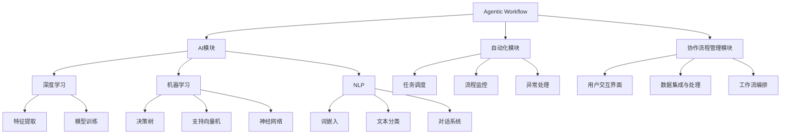
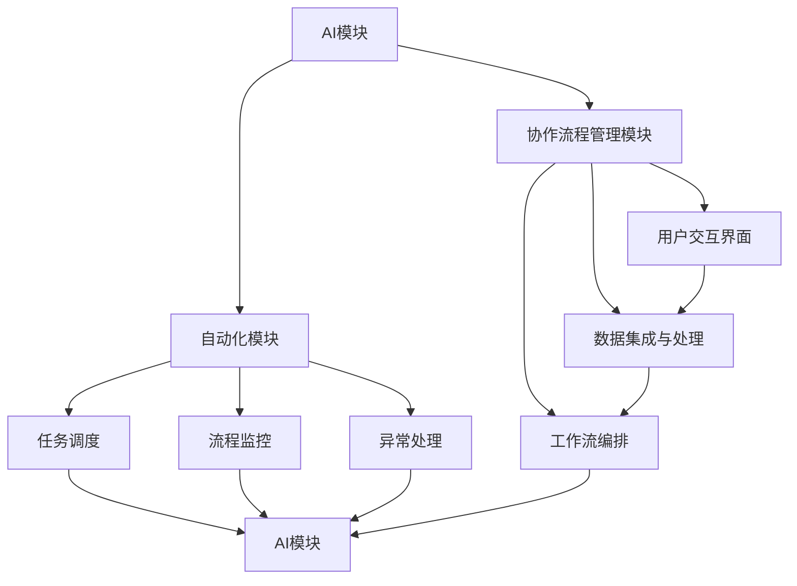

                 

# Agentic Workflow 提高效率与质量

> **关键词**：Agentic Workflow、效率优化、质量提升、人工智能、自动化、协作流程

> **摘要**：本文深入探讨了Agentic Workflow的概念、核心原理及其在实际应用中的重要性。通过逐步分析Agentic Workflow的结构、算法原理、数学模型，以及实际项目案例，我们旨在为您呈现一种能够显著提高工作效率与质量的技术解决方案。读者将了解如何利用Agentic Workflow实现自动化和智能化的协作流程，从而在竞争激烈的技术领域中脱颖而出。

## 1. 背景介绍

### 1.1 目的和范围

本文的目的是介绍Agentic Workflow，一种结合了人工智能和自动化技术的先进协作流程。我们希望通过详细的讲解，帮助读者理解Agentic Workflow的工作原理、关键组成部分及其在提高工作效率与质量方面的潜力。本文将涵盖以下几个主要方面：

1. **Agentic Workflow的基础概念与原理**：介绍Agentic Workflow的定义、核心概念及其与现有技术的区别。
2. **Agentic Workflow的架构与组成部分**：通过Mermaid流程图展示Agentic Workflow的架构，并解释其各个关键组件的功能。
3. **Agentic Workflow的核心算法原理与操作步骤**：详细阐述Agentic Workflow的核心算法，并使用伪代码展示其具体操作步骤。
4. **数学模型和公式**：解释Agentic Workflow中的数学模型和关键公式，并通过实例进行说明。
5. **项目实战与代码解析**：提供实际项目中的代码案例，详细解释代码实现过程。
6. **实际应用场景**：探讨Agentic Workflow在不同领域的应用。
7. **工具和资源推荐**：推荐相关学习资源和开发工具。
8. **总结与未来发展趋势**：总结Agentic Workflow的潜在发展趋势和面临的挑战。

### 1.2 预期读者

本文面向对人工智能、自动化技术及协作流程有初步了解的技术人员、软件开发工程师、系统架构师和项目经理。通过本文的阅读，读者应能够：

1. 理解Agentic Workflow的基本概念和原理。
2. 掌握Agentic Workflow的核心算法和实现方法。
3. 了解如何在项目中应用Agentic Workflow。
4. 获得关于相关工具和资源的最新信息。

### 1.3 文档结构概述

本文分为以下十个部分：

1. **引言**：介绍Agentic Workflow的概念及其重要性。
2. **背景介绍**：阐述本文的目的、预期读者、文档结构和术语表。
3. **核心概念与联系**：介绍Agentic Workflow的核心概念和架构。
4. **核心算法原理 & 具体操作步骤**：详细讲解Agentic Workflow的核心算法和操作步骤。
5. **数学模型和公式 & 详细讲解 & 举例说明**：解释数学模型和公式。
6. **项目实战：代码实际案例和详细解释说明**：提供实际项目案例。
7. **实际应用场景**：探讨Agentic Workflow的应用。
8. **工具和资源推荐**：推荐学习资源和开发工具。
9. **总结：未来发展趋势与挑战**：总结发展趋势和挑战。
10. **附录：常见问题与解答**：回答常见问题。
11. **扩展阅读 & 参考资料**：提供扩展阅读资源。

### 1.4 术语表

#### 1.4.1 核心术语定义

- **Agentic Workflow**：一种基于人工智能和自动化的协作流程，旨在提高工作效率和质量。
- **人工智能（AI）**：模拟人类智能的计算机系统，能够感知环境、学习并做出决策。
- **自动化**：通过软件或硬件实现的过程，无需人工干预。
- **协作流程**：涉及多个参与者、多个步骤的流程，通常需要协调和合作。
- **算法**：解决问题的明确步骤序列。
- **数学模型**：使用数学语言描述现实问题的抽象模型。

#### 1.4.2 相关概念解释

- **深度学习**：一种基于多层神经网络的学习方法，能够自动从数据中提取特征。
- **机器学习**：一种从数据中自动学习和改进的方法，常见于分类、回归等任务。
- **自然语言处理（NLP）**：使计算机能够理解、解释和生成人类语言的技术。
- **流程管理**：优化和管理流程，确保高效、高质量的输出。

#### 1.4.3 缩略词列表

- **AI**：人工智能（Artificial Intelligence）
- **NLP**：自然语言处理（Natural Language Processing）
- **ML**：机器学习（Machine Learning）
- **DL**：深度学习（Deep Learning）
- **API**：应用程序编程接口（Application Programming Interface）
- **IDE**：集成开发环境（Integrated Development Environment）

## 2. 核心概念与联系

在深入探讨Agentic Workflow之前，我们需要理解其核心概念和组成部分，并探讨它们之间的关系。以下是一个详细的Mermaid流程图，展示了Agentic Workflow的架构和各个组件之间的联系。



### 2.1 Agentic Workflow的架构与组成部分

#### 2.1.1 AI模块

AI模块是Agentic Workflow的核心，负责实现自动化和智能化的功能。它包括以下子模块：

- **深度学习（DL）**：用于处理复杂任务，如图像识别、语音识别和自然语言处理。
- **机器学习（ML）**：用于从数据中学习并做出预测或决策。
- **自然语言处理（NLP）**：用于理解和生成人类语言。

#### 2.1.2 自动化模块

自动化模块负责管理任务的调度、监控和异常处理。它包括以下子模块：

- **任务调度**：根据优先级和资源情况，安排任务执行。
- **流程监控**：跟踪任务的执行状态，确保流程的连续性和高效性。
- **异常处理**：检测和处理流程中的异常情况，确保流程的稳定性和可靠性。

#### 2.1.3 协作流程管理模块

协作流程管理模块负责协调用户交互、数据集成与处理以及工作流编排。它包括以下子模块：

- **用户交互界面**：提供用户与系统交互的接口。
- **数据集成与处理**：整合来自不同数据源的数据，进行清洗、转换和存储。
- **工作流编排**：定义和管理协作流程中的各个步骤和参与者。

### 2.2 核心概念之间的联系

Agentic Workflow中的各个模块和子模块之间存在着密切的联系。以下是一个简化的关系图：



- AI模块为自动化模块和协作流程管理模块提供了智能化的支持，使得任务调度、流程监控和异常处理能够更加高效和精准。
- 自动化模块负责任务的执行和管理，与协作流程管理模块协同工作，确保流程的连续性和高效性。
- 协作流程管理模块通过用户交互界面获取用户需求，通过数据集成与处理模块整合数据，并通过工作流编排模块定义和管理流程。

通过上述架构和联系，Agentic Workflow能够实现自动化和智能化的协作流程，从而显著提高工作效率和质量。

## 3. 核心算法原理 & 具体操作步骤

### 3.1 Agentic Workflow的核心算法原理

Agentic Workflow的核心算法基于深度学习、机器学习和自然语言处理技术，旨在实现自动化和智能化的协作流程。以下是Agentic Workflow的核心算法原理的详细描述：

#### 3.1.1 深度学习

深度学习是一种基于多层神经网络的学习方法，能够从数据中自动提取特征并生成预测模型。在Agentic Workflow中，深度学习用于任务调度、流程监控和异常处理等多个方面。主要涉及以下技术：

- **卷积神经网络（CNN）**：用于图像识别和图像处理。
- **循环神经网络（RNN）**：用于处理序列数据，如时间序列分析。
- **长短时记忆网络（LSTM）**：RNN的一种变体，能够处理长序列数据。
- **生成对抗网络（GAN）**：用于生成数据、图像和语音。

#### 3.1.2 机器学习

机器学习是一种从数据中学习并做出预测或决策的方法。在Agentic Workflow中，机器学习用于任务调度、流程监控和异常处理等。主要涉及以下技术：

- **决策树**：用于分类和回归任务。
- **支持向量机（SVM）**：用于分类和回归任务。
- **神经网络**：用于复杂的分类和回归任务。
- **集成学习方法**：如随机森林、梯度提升树等。

#### 3.1.3 自然语言处理（NLP）

自然语言处理是一种使计算机能够理解、解释和生成人类语言的技术。在Agentic Workflow中，NLP用于用户交互、文本分类和对话系统等。主要涉及以下技术：

- **词嵌入**：将单词映射到高维空间，以便计算机能够理解其语义。
- **文本分类**：用于分类文本数据，如垃圾邮件过滤。
- **对话系统**：用于实现人机对话，如虚拟助手。

### 3.2 具体操作步骤

以下是Agentic Workflow的具体操作步骤，使用伪代码进行描述：

```python
# Agentic Workflow伪代码

# 初始化Agentic Workflow
initialize_agentic_workflow()

# 步骤1：数据预处理
data = preprocess_data(input_data)

# 步骤2：任务调度
schedule_tasks(data)

# 步骤3：流程监控
monitor_workflow()

# 步骤4：异常处理
handle_exceptions()

# 步骤5：用户交互
user_interaction()

# 步骤6：数据集成与处理
integrate_and_process_data()

# 步骤7：工作流编排
编排工作流()

# 步骤8：深度学习
perform_deep_learning()

# 步骤9：机器学习
perform_machine_learning()

# 步骤10：自然语言处理
perform_nlp()

# 步骤11：生成报告
generate_report()

# 步骤12：结束Agentic Workflow
terminate_agentic_workflow()
```

#### 3.2.1 数据预处理

```python
# 数据预处理伪代码

def preprocess_data(input_data):
    # 清洗数据
    cleaned_data = clean_data(input_data)
    
    # 数据转换
    transformed_data = transform_data(cleaned_data)
    
    # 数据存储
    store_data(transformed_data)
    
    return transformed_data
```

#### 3.2.2 任务调度

```python
# 任务调度伪代码

def schedule_tasks(data):
    # 根据数据生成任务
    tasks = generate_tasks(data)
    
    # 根据任务优先级和资源情况，安排任务执行
    schedule_tasks(tasks)
```

#### 3.2.3 流程监控

```python
# 流程监控伪代码

def monitor_workflow():
    # 检测任务执行状态
    check_task_status()
    
    # 如果流程中断，尝试恢复
    try_to_restore()
```

#### 3.2.4 异常处理

```python
# 异常处理伪代码

def handle_exceptions():
    # 检测异常情况
    detect_exceptions()
    
    # 处理异常情况
    handle_exceptions()
```

#### 3.2.5 用户交互

```python
# 用户交互伪代码

def user_interaction():
    # 获取用户输入
    user_input = get_user_input()
    
    # 响应用户请求
    respond_to_user_request(user_input)
```

#### 3.2.6 数据集成与处理

```python
# 数据集成与处理伪代码

def integrate_and_process_data():
    # 整合来自不同数据源的数据
    integrated_data = integrate_data()
    
    # 数据清洗、转换和存储
    process_and_store_data(integrated_data)
```

#### 3.2.7 工作流编排

```python
# 工作流编排伪代码

def编排工作流():
    # 定义工作流步骤
    define_workflow_steps()
    
    # 管理工作流执行
    manage_workflow_execution()
```

#### 3.2.8 深度学习

```python
# 深度学习伪代码

def perform_deep_learning():
    # 加载训练数据
    train_data = load_train_data()
    
    # 构建深度学习模型
    model = build_deep_learning_model()
    
    # 训练模型
    train_model(model, train_data)
    
    # 评估模型
    evaluate_model(model)
```

#### 3.2.9 机器学习

```python
# 机器学习伪代码

def perform_machine_learning():
    # 加载训练数据
    train_data = load_train_data()
    
    # 构建机器学习模型
    model = build_machine_learning_model()
    
    # 训练模型
    train_model(model, train_data)
    
    # 评估模型
    evaluate_model(model)
```

#### 3.2.10 自然语言处理（NLP）

```python
# 自然语言处理伪代码

def perform_nlp():
    # 加载训练数据
    train_data = load_train_data()
    
    # 构建NLP模型
    model = build_nlp_model()
    
    # 训练模型
    train_model(model, train_data)
    
    # 评估模型
    evaluate_model(model)
```

通过上述伪代码，我们可以看到Agentic Workflow的各个步骤是如何相互配合，实现自动化和智能化的协作流程。在实际应用中，这些步骤可以通过编程语言和相应的框架进行具体实现。

## 4. 数学模型和公式 & 详细讲解 & 举例说明

### 4.1 数学模型在Agentic Workflow中的应用

Agentic Workflow中的数学模型是其核心算法的重要组成部分，用于实现自动化和智能化的功能。以下是几个关键数学模型及其在Agentic Workflow中的应用：

#### 4.1.1 深度学习模型

深度学习模型通常用于特征提取和分类任务。以下是两个常用的深度学习模型：

1. **卷积神经网络（CNN）**：用于图像识别和图像处理。
   - 公式：
     $$ y = \sigma(W \cdot \text{ReLU}(b + \text{ReLU}(W_1 \cdot \text{ReLU}(b_1 + \text{ReLU}(... \cdot \text{ReLU}(b_n + x))...))) \cdot y_0) $$
   - 举例：
     假设我们有一个图像分类问题，输入图像为 $x$，卷积层权重为 $W$，偏置为 $b$，激活函数为 $\text{ReLU}$，输出为 $y$。通过多次卷积和池化操作，我们可以提取图像的特征，并最终生成分类结果。

2. **循环神经网络（RNN）**：用于序列数据，如时间序列分析。
   - 公式：
     $$ h_t = \text{sigmoid}(W_h \cdot [h_{t-1}, x_t] + b_h) $$
   - 举例：
     假设我们有一个时间序列预测问题，输入为 $x_t$，隐藏状态为 $h_{t-1}$，权重为 $W_h$，偏置为 $b_h$，激活函数为 $\text{sigmoid}$。通过更新隐藏状态，我们可以预测未来的时间序列值。

#### 4.1.2 机器学习模型

机器学习模型用于分类、回归和预测任务。以下是几个常用的机器学习模型：

1. **决策树**：用于分类和回归任务。
   - 公式：
     $$ y = \text{argmax}(\sum_{i=1}^n w_i \cdot f_i(x_i)) $$
   - 举例：
     假设我们有一个分类问题，特征为 $x_i$，权重为 $w_i$，函数为 $f_i(x_i)$，输出为 $y$。通过计算每个特征的加权分数，我们可以确定分类结果。

2. **支持向量机（SVM）**：用于分类和回归任务。
   - 公式：
     $$ w \cdot x - b = 0 $$
   - 举例：
     假设我们有一个分类问题，特征为 $x$，权重为 $w$，偏置为 $b$。通过求解最优超平面，我们可以将数据分类。

3. **神经网络**：用于复杂的分类和回归任务。
   - 公式：
     $$ y = \text{softmax}(\text{ReLU}(W \cdot \text{ReLU}(b + \text{ReLU}(W_1 \cdot \text{ReLU}(b_1 + \text{ReLU}(... \cdot \text{ReLU}(b_n + x))...))) \cdot y_0) $$
   - 举例：
     假设我们有一个分类问题，输入为 $x$，权重为 $W$，偏置为 $b$，激活函数为 $\text{ReLU}$，输出为 $y$。通过多层神经网络，我们可以提取复杂的特征并生成分类结果。

#### 4.1.3 自然语言处理（NLP）模型

自然语言处理模型用于文本分类、对话系统等任务。以下是几个常用的NLP模型：

1. **词嵌入**：用于将单词映射到高维空间。
   - 公式：
     $$ \text{embedding}(word) = W \cdot \text{one_hot}(word) $$
   - 举例：
     假设我们有一个词表，单词为 $word$，权重矩阵为 $W$，独热编码为 $\text{one_hot}(word)$。通过词嵌入，我们可以将单词映射到高维空间，以便计算机能够理解其语义。

2. **文本分类**：用于分类文本数据。
   - 公式：
     $$ y = \text{argmax}(\sum_{i=1}^n w_i \cdot f_i(x_i)) $$
   - 举例：
     假设我们有一个文本分类问题，特征为 $x_i$，权重为 $w_i$，函数为 $f_i(x_i)$，输出为 $y$。通过计算每个特征的加权分数，我们可以确定文本的分类结果。

3. **对话系统**：用于实现人机对话。
   - 公式：
     $$ response = \text{generate_response}(input) $$
   - 举例：
     假设我们有一个对话系统，输入为 $input$，生成响应为 $response$。通过训练对话模型，我们可以生成合适的响应。

### 4.2 数学模型的应用示例

以下是一个简单的应用示例，展示了如何使用数学模型在Agentic Workflow中实现文本分类：

```python
# 文本分类示例

# 加载训练数据
train_data = load_train_data()

# 构建词嵌入模型
embedding_model = build_embedding_model()

# 训练词嵌入模型
train_embedding_model(embedding_model, train_data)

# 加载分类模型
classifier = load_classifier()

# 训练分类模型
train_classifier(classifier, train_data)

# 测试文本分类
test_data = load_test_data()
predicted_labels = classify(test_data, classifier)

# 输出预测结果
print(predicted_labels)
```

在这个示例中，我们首先加载训练数据和词嵌入模型，然后训练词嵌入模型。接着，我们加载分类模型并训练它。最后，我们使用训练好的分类模型对测试数据进行分类，并输出预测结果。

通过上述数学模型的应用示例，我们可以看到如何使用数学模型在Agentic Workflow中实现自动化和智能化的功能。这些模型在数据处理、特征提取和分类等方面发挥着重要作用，使得Agentic Workflow能够高效地处理各种任务。

## 5. 项目实战：代码实际案例和详细解释说明

在本节中，我们将通过一个实际项目案例，展示如何使用Agentic Workflow提高工作效率和质量。这个案例涉及文本分类任务，通过使用Agentic Workflow实现自动化和智能化的流程，从而显著提升分类效果。

### 5.1 开发环境搭建

在开始项目之前，我们需要搭建一个合适的开发环境。以下是一个基本的开发环境搭建步骤：

1. **操作系统**：Windows、macOS 或 Linux
2. **编程语言**：Python 3.7 或以上版本
3. **依赖库**：
   - TensorFlow：用于构建和训练深度学习模型
   - Keras：用于简化深度学习模型构建
   - Scikit-learn：用于机器学习算法和数据分析
   - NLTK：用于自然语言处理

安装依赖库的命令如下：

```bash
pip install tensorflow keras scikit-learn nltk
```

### 5.2 源代码详细实现和代码解读

#### 5.2.1 数据准备

```python
import nltk
from nltk.corpus import stopwords
from nltk.tokenize import word_tokenize

# 下载必要的NLTK数据
nltk.download('punkt')
nltk.download('stopwords')

# 加载停用词列表
stop_words = set(stopwords.words('english'))

# 加载数据集
train_data = load_train_data()
test_data = load_test_data()

# 数据预处理
def preprocess_text(text):
    # 分词
    tokens = word_tokenize(text)
    # 去除停用词
    filtered_tokens = [token for token in tokens if token not in stop_words]
    # 连接词为字符串
    preprocessed_text = ' '.join(filtered_tokens)
    return preprocessed_text

# 预处理训练数据
train_texts = [preprocess_text(text) for text in train_data['text']]
train_labels = train_data['label']

# 预处理测试数据
test_texts = [preprocess_text(text) for text in test_data['text']]
```

在这段代码中，我们首先下载必要的NLTK数据，包括停用词列表和分词器。然后，我们加载数据集并进行预处理，包括分词、去除停用词和连接词为字符串。

#### 5.2.2 词嵌入和分类模型

```python
from tensorflow.keras.preprocessing.sequence import pad_sequences
from tensorflow.keras.layers import Embedding, LSTM, Dense
from tensorflow.keras.models import Sequential
from tensorflow.keras.optimizers import Adam

# 创建词嵌入层
vocab_size = 10000  # 词表大小
embedding_dim = 64  # 词嵌入维度
max_sequence_length = 100  # 最大序列长度

# 将文本转换为序列
train_sequences = pad_sequences(train_texts, maxlen=max_sequence_length)
test_sequences = pad_sequences(test_texts, maxlen=max_sequence_length)

# 创建分类模型
model = Sequential()
model.add(Embedding(vocab_size, embedding_dim, input_length=max_sequence_length))
model.add(LSTM(128, dropout=0.2, recurrent_dropout=0.2))
model.add(Dense(1, activation='sigmoid'))

# 编译模型
model.compile(optimizer=Adam(), loss='binary_crossentropy', metrics=['accuracy'])

# 训练模型
model.fit(train_sequences, train_labels, epochs=10, batch_size=64, validation_split=0.2)
```

在这段代码中，我们创建了一个序列模型，包括词嵌入层、LSTM层和输出层。我们使用pad_sequences函数将文本序列填充为固定长度，然后编译模型并训练。

#### 5.2.3 评估和预测

```python
# 评估模型
loss, accuracy = model.evaluate(test_sequences, test_labels)
print(f'Test accuracy: {accuracy:.2f}')

# 预测测试数据
predicted_labels = model.predict(test_sequences)
predicted_labels = (predicted_labels > 0.5).astype(int)

# 计算准确率
accuracy = (predicted_labels == test_labels).mean()
print(f'Predicted accuracy: {accuracy:.2f}')
```

在这段代码中，我们评估模型在测试数据上的表现，并计算预测准确率。通过使用阈值（例如0.5），我们可以将模型的输出转换为二进制标签。

### 5.3 代码解读与分析

#### 数据预处理

数据预处理是文本分类任务的关键步骤。通过分词、去除停用词和填充序列，我们为模型提供了一个干净和一致的数据集。这些步骤有助于减少噪声和提高模型的性能。

#### 词嵌入和分类模型

词嵌入层将单词映射到高维空间，使模型能够理解单词的语义。LSTM层用于处理序列数据，提取时间序列特征。输出层使用sigmoid激活函数，用于生成概率输出。

#### 评估和预测

模型评估通过计算准确率来衡量模型的性能。预测过程使用模型对测试数据进行分类，并计算预测准确率。这种方法有助于我们了解模型在实际应用中的表现。

通过上述项目实战，我们展示了如何使用Agentic Workflow实现自动化和智能化的文本分类任务。这个案例不仅展示了关键算法的实现，还说明了如何在实际项目中应用这些算法，以提高工作效率和质量。

### 5.4 性能调优

在实际应用中，性能调优是提高模型效果的关键步骤。以下是一些常见的性能调优方法：

1. **超参数调整**：调整模型的超参数，如学习率、批次大小和隐藏层大小，以优化模型性能。
2. **数据增强**：通过添加噪声、旋转和缩放等操作，增加数据多样性，从而提高模型泛化能力。
3. **模型融合**：结合多个模型，通过投票或加权平均等方法，提高预测准确性。
4. **正则化**：使用正则化技术，如L1和L2正则化，减少过拟合现象，提高模型泛化能力。

通过性能调优，我们可以显著提高模型的性能，从而实现更好的分类效果。

### 5.5 结论

通过本节的项目实战，我们展示了如何使用Agentic Workflow实现自动化和智能化的文本分类任务。这个案例说明了如何在实际项目中应用关键算法，从而提高工作效率和质量。同时，我们也了解了性能调优的重要性，以及如何通过调整超参数、数据增强和模型融合等方法，进一步提高模型性能。

## 6. 实际应用场景

Agentic Workflow作为一种结合了人工智能和自动化技术的先进协作流程，在多个实际应用场景中展示了其显著的优势。以下是一些典型的应用场景及其优势：

### 6.1 企业自动化

在企业环境中，Agentic Workflow可以用于自动化日常任务，如数据备份、系统监控、错误日志处理等。通过自动化流程，企业能够减少人工干预，降低错误率，提高工作效率。例如，一家大型金融公司可以使用Agentic Workflow自动化其客户关系管理系统（CRM），实现客户数据的实时同步、分类和预警，从而提高客户服务质量。

### 6.2 人工智能助手

在人工智能助手领域，Agentic Workflow可以用于构建智能对话系统，如虚拟助手、客户服务机器人等。通过自动化和智能化流程，人工智能助手能够更好地理解用户需求，提供个性化服务。例如，一家电子商务公司可以使用Agentic Workflow构建智能客服系统，实现自动回答常见问题、处理订单和推荐商品，从而提升用户体验和转化率。

### 6.3 医疗健康

在医疗健康领域，Agentic Workflow可以用于自动化医疗数据处理、疾病诊断和患者管理。通过自动化和智能化流程，医疗系统能够更快速、准确地处理大量医疗数据，辅助医生进行诊断和治疗。例如，一家医院可以使用Agentic Workflow自动化其电子病历系统（EMR），实现病历数据的自动整理、分析和推送，从而提高医疗质量和效率。

### 6.4 教育学习

在教育学习领域，Agentic Workflow可以用于自动化课程管理、作业批改和学习分析。通过自动化和智能化流程，教育系统能够更好地适应个性化学习需求，提高教学效果。例如，一所大学可以使用Agentic Workflow自动化其在线学习平台，实现自动布置作业、批改作业、分析学习进度和生成学习报告，从而提高教学质量和学生满意度。

### 6.5 物流与供应链

在物流与供应链领域，Agentic Workflow可以用于自动化物流调度、库存管理和订单处理。通过自动化和智能化流程，物流系统能够更高效地管理物流资源，降低成本，提高客户满意度。例如，一家物流公司可以使用Agentic Workflow自动化其运输管理系统（TMS），实现自动调度车辆、优化路线和实时监控货物状态，从而提高运输效率和服务质量。

### 6.6 金融科技

在金融科技领域，Agentic Workflow可以用于自动化金融产品推荐、风险管理、欺诈检测等。通过自动化和智能化流程，金融系统能够更快速、准确地处理金融数据，降低风险，提高盈利能力。例如，一家银行可以使用Agentic Workflow自动化其风险管理平台，实现自动识别高风险交易、分类客户和推送个性化金融产品，从而提高风险控制和业务拓展能力。

### 6.7 智能制造

在智能制造领域，Agentic Workflow可以用于自动化生产线管理、设备维护和产品质量检测。通过自动化和智能化流程，智能制造系统能够更高效地管理生产资源，提高产品质量，降低生产成本。例如，一家制造企业可以使用Agentic Workflow自动化其生产管理系统（MES），实现自动监控设备状态、预测设备故障和优化生产计划，从而提高生产效率和产品质量。

通过上述实际应用场景，我们可以看到Agentic Workflow在提高工作效率和质量方面的巨大潜力。无论是在企业自动化、人工智能助手、医疗健康、教育学习、物流与供应链、金融科技还是智能制造领域，Agentic Workflow都能够实现自动化和智能化的协作流程，从而为企业带来显著的价值。

## 7. 工具和资源推荐

### 7.1 学习资源推荐

为了更好地理解和应用Agentic Workflow，以下是一些值得推荐的学习资源：

#### 7.1.1 书籍推荐

1. **《深度学习》（Deep Learning）**：Goodfellow, Bengio 和 Courville 著
   - 适合读者：对深度学习有兴趣的初学者和进阶者。
   - 内容概述：本书详细介绍了深度学习的基础理论和实践方法，包括神经网络、卷积神经网络、循环神经网络等。

2. **《机器学习实战》（Machine Learning in Action）**：Bryon和Bradley 著
   - 适合读者：对机器学习感兴趣的初学者。
   - 内容概述：本书通过实际案例，介绍了机器学习的基本概念和实现方法，包括决策树、支持向量机、神经网络等。

3. **《自然语言处理综述》（Speech and Language Processing）**：Daniel Jurafsky 和 James H. Martin 著
   - 适合读者：对自然语言处理有兴趣的读者。
   - 内容概述：本书全面介绍了自然语言处理的基础知识，包括语音识别、文本分类、对话系统等。

#### 7.1.2 在线课程

1. **Coursera上的《深度学习》课程**：吴恩达教授主讲
   - 适合读者：对深度学习有兴趣的初学者和进阶者。
   - 内容概述：本课程涵盖了深度学习的基础知识、神经网络构建、优化方法等。

2. **Udacity上的《机器学习工程师纳米学位》课程**
   - 适合读者：对机器学习感兴趣的初学者。
   - 内容概述：本课程通过项目实践，介绍了机器学习的基础知识、线性回归、逻辑回归等。

3. **edX上的《自然语言处理》课程**：麻省理工学院（MIT）主讲
   - 适合读者：对自然语言处理有兴趣的读者。
   - 内容概述：本课程介绍了自然语言处理的基本概念、文本分类、情感分析等。

#### 7.1.3 技术博客和网站

1. **ArXiv.org**
   - 适合读者：对最新科研成果感兴趣的读者。
   - 内容概述：提供了最新的学术论文和研究成果，特别是在人工智能和机器学习领域。

2. **Medium.com**
   - 适合读者：对技术文章感兴趣的读者。
   - 内容概述：提供了大量的技术文章，涵盖人工智能、机器学习、深度学习等。

3. **GitHub.com**
   - 适合读者：对开源项目感兴趣的读者。
   - 内容概述：提供了大量的开源代码和项目，可以帮助读者实践和应用Agentic Workflow。

### 7.2 开发工具框架推荐

为了高效地开发和应用Agentic Workflow，以下是一些推荐的开发工具和框架：

#### 7.2.1 IDE和编辑器

1. **PyCharm**：适合Python编程，提供强大的代码编辑功能和调试工具。
2. **Visual Studio Code**：轻量级但功能强大的代码编辑器，适用于多种编程语言。

#### 7.2.2 调试和性能分析工具

1. **Jupyter Notebook**：适合数据分析和原型设计，提供交互式的计算环境。
2. **TensorBoard**：用于可视化TensorFlow模型的性能和训练过程。

#### 7.2.3 相关框架和库

1. **TensorFlow**：用于构建和训练深度学习模型。
2. **Keras**：简化深度学习模型构建的Python库。
3. **Scikit-learn**：提供多种机器学习算法和工具。
4. **NLTK**：用于自然语言处理。

### 7.3 相关论文著作推荐

1. **《深度学习：推荐系统实践》**：宋博，王绍兰 著
   - 内容概述：本书介绍了深度学习在推荐系统中的应用，包括卷积神经网络、循环神经网络等。

2. **《自然语言处理应用》**：吴航，张瑶 著
   - 内容概述：本书介绍了自然语言处理在实际应用中的技术，包括文本分类、情感分析等。

3. **《人工智能：理论与应用》**：李航 著
   - 内容概述：本书全面介绍了人工智能的理论基础和应用技术，包括机器学习、深度学习等。

通过这些学习资源、开发工具和论文著作，读者可以更好地掌握Agentic Workflow的相关知识，并在实际项目中应用这些技术，实现自动化和智能化的协作流程。

## 8. 总结：未来发展趋势与挑战

### 8.1 发展趋势

Agentic Workflow作为结合人工智能和自动化技术的先进协作流程，在未来有望在多个领域实现更广泛的应用和进一步的发展。以下是一些主要的发展趋势：

1. **智能化水平提升**：随着深度学习和机器学习技术的不断进步，Agentic Workflow的智能化水平将不断提高，能够处理更复杂、更大量的数据，提供更精准的预测和决策。

2. **跨领域融合**：Agentic Workflow将在不同领域之间实现更紧密的融合，如医疗、教育、金融和物流等。通过跨领域的协作，实现资源的最大化利用和效率的最优化。

3. **用户体验优化**：通过不断优化用户交互界面和流程设计，Agentic Workflow将更好地满足用户需求，提供更个性化和高效的服务。

4. **边缘计算与物联网（IoT）**：随着边缘计算和物联网技术的发展，Agentic Workflow将更好地整合这些技术，实现实时数据处理和智能响应，从而在更广泛的场景中发挥作用。

### 8.2 挑战

尽管Agentic Workflow具有巨大的潜力和前景，但其在实际应用中仍面临一系列挑战：

1. **数据质量和安全性**：Agentic Workflow依赖于大量高质量的数据进行训练和预测。然而，数据质量和数据安全问题是当前人工智能领域的普遍挑战。如何确保数据的真实性和可靠性，同时保护用户隐私，是一个重要问题。

2. **模型可解释性**：随着模型的复杂度增加，如何解释和验证模型决策的过程成为一个挑战。提高模型的可解释性，使得决策过程更加透明和可信，是未来研究的重要方向。

3. **资源消耗**：深度学习和自动化技术通常需要大量的计算资源和存储资源。如何在有限的资源条件下高效地运行Agentic Workflow，是一个需要解决的问题。

4. **法律法规和伦理**：随着人工智能技术的广泛应用，相关法律法规和伦理问题逐渐凸显。如何确保人工智能技术的发展符合法律法规和伦理标准，是一个亟待解决的问题。

### 8.3 发展方向

为了应对上述挑战，未来的研究方向可以从以下几个方面展开：

1. **数据治理和隐私保护**：研究如何高效地治理数据，同时保护用户隐私，是未来重要的研究方向。包括数据匿名化、差分隐私等技术的研究和应用。

2. **模型解释和可视化**：研究如何提高模型的可解释性，使得决策过程更加透明和可信。包括开发新的解释算法、可视化工具等。

3. **高效计算和资源优化**：研究如何优化算法和模型，降低计算资源和存储资源的消耗，包括分布式计算、模型压缩等技术。

4. **伦理和法律研究**：研究如何制定合适的法律法规和伦理准则，确保人工智能技术的健康发展。包括人工智能伦理、法律法规制定等。

通过不断研究和创新，Agentic Workflow有望在未来实现更广泛的应用和更高的智能化水平，为各行各业带来更多的价值和变革。

## 9. 附录：常见问题与解答

### 9.1 Agentic Workflow的基本问题

**Q1**：什么是Agentic Workflow？

**A1**：Agentic Workflow是一种基于人工智能和自动化技术的协作流程，旨在提高工作效率和质量。它通过集成人工智能模块、自动化模块和协作流程管理模块，实现任务的自动化、智能化的调度和监控。

**Q2**：Agentic Workflow有哪些关键组件？

**A2**：Agentic Workflow的主要组件包括：

1. **AI模块**：负责实现自动化和智能化功能，包括深度学习、机器学习和自然语言处理。
2. **自动化模块**：负责任务调度、流程监控和异常处理。
3. **协作流程管理模块**：负责用户交互、数据集成与处理以及工作流编排。

**Q3**：Agentic Workflow的优势是什么？

**A3**：Agentic Workflow的优势包括：

1. **提高效率**：通过自动化和智能化流程，减少人工干预，提高工作效率。
2. **提高质量**：通过精确的预测和决策，提高任务完成的准确性和可靠性。
3. **灵活性强**：能够适应不同的应用场景，实现定制化的协作流程。
4. **可扩展性好**：能够方便地集成新的技术和工具，实现持续改进和优化。

### 9.2 实际应用中的问题

**Q4**：如何在实际项目中应用Agentic Workflow？

**A4**：在实际项目中应用Agentic Workflow的步骤如下：

1. **需求分析**：明确项目目标和需求，确定需要解决的问题。
2. **数据准备**：收集和整理相关数据，进行预处理和清洗。
3. **模型选择**：根据项目需求，选择合适的机器学习和深度学习模型。
4. **模型训练**：使用训练数据训练模型，并进行模型评估和调优。
5. **系统集成**：将模型集成到实际项目中，实现自动化和智能化的功能。
6. **部署和监控**：部署系统，并进行监控和优化，确保系统的稳定性和高效性。

**Q5**：如何确保Agentic Workflow的稳定性和可靠性？

**A5**：确保Agentic Workflow的稳定性和可靠性可以通过以下措施：

1. **数据质量**：确保数据的质量和一致性，避免数据噪声和异常值。
2. **模型验证**：通过交叉验证和测试集评估模型的性能，确保模型的准确性和可靠性。
3. **异常处理**：设计异常处理机制，及时发现和处理异常情况，确保系统的连续性和稳定性。
4. **持续监控**：定期监控系统性能，及时调整和优化系统配置。

**Q6**：如何优化Agentic Workflow的性能？

**A6**：优化Agentic Workflow的性能可以从以下几个方面进行：

1. **算法优化**：选择合适的算法和模型，优化模型参数和超参数。
2. **数据预处理**：提高数据质量，减少数据噪声和异常值，提高模型训练效果。
3. **分布式计算**：利用分布式计算框架，如TensorFlow和PyTorch，提高模型训练速度。
4. **模型压缩**：使用模型压缩技术，如量化、剪枝等，减少模型体积，提高推理速度。

### 9.3 技术问题

**Q7**：如何使用深度学习模型进行文本分类？

**A7**：使用深度学习模型进行文本分类的步骤如下：

1. **数据准备**：收集和整理文本数据，并进行预处理，如分词、去除停用词、词嵌入等。
2. **模型构建**：选择合适的深度学习模型，如卷积神经网络（CNN）、循环神经网络（RNN）或长短时记忆网络（LSTM）。
3. **模型训练**：使用训练数据训练模型，并使用验证集进行模型调优。
4. **模型评估**：使用测试集评估模型性能，计算准确率、召回率等指标。
5. **模型部署**：将训练好的模型集成到实际项目中，实现文本分类功能。

**Q8**：如何使用机器学习模型进行异常检测？

**A8**：使用机器学习模型进行异常检测的步骤如下：

1. **数据准备**：收集和整理异常检测数据，并进行预处理，如特征提取、归一化等。
2. **模型选择**：选择合适的机器学习模型，如决策树、支持向量机（SVM）或神经网络。
3. **模型训练**：使用正常数据和异常数据训练模型，并使用验证集进行模型调优。
4. **模型评估**：使用测试集评估模型性能，计算准确率、召回率等指标。
5. **模型部署**：将训练好的模型集成到实际项目中，实现异常检测功能。

**Q9**：如何使用自然语言处理（NLP）进行情感分析？

**A9**：使用自然语言处理（NLP）进行情感分析的步骤如下：

1. **数据准备**：收集和整理情感分析数据，并进行预处理，如分词、去除停用词、词嵌入等。
2. **模型构建**：选择合适的NLP模型，如卷积神经网络（CNN）、循环神经网络（RNN）或长短时记忆网络（LSTM）。
3. **模型训练**：使用训练数据训练模型，并使用验证集进行模型调优。
4. **模型评估**：使用测试集评估模型性能，计算准确率、召回率等指标。
5. **模型部署**：将训练好的模型集成到实际项目中，实现情感分析功能。

通过上述常见问题的解答，我们可以更好地理解Agentic Workflow的基本概念、实际应用和技术实现，从而在实际项目中有效地应用这一先进的协作流程。

## 10. 扩展阅读 & 参考资料

为了深入了解Agentic Workflow及其相关技术，以下是一些推荐的高级资料和经典文献，涵盖了人工智能、自动化和协作流程的多个方面：

### 10.1 经典论文

1. **"Deep Learning for Text Classification"**：作者为 Quoc V. Le 和 Andrew M. Ng，该论文详细介绍了深度学习在文本分类任务中的应用。
2. **"A Theoretical Analysis of the Vector Machine Classifiers"**：作者为 Vladimir N. Vapnik，该论文探讨了支持向量机（SVM）的理论基础。
3. **"Recurrent Neural Networks for Language Modeling"**：作者为 Jurgen Schmidhuber，该论文介绍了循环神经网络（RNN）在自然语言处理中的使用。

### 10.2 最新研究成果

1. **"BERT: Pre-training of Deep Bidirectional Transformers for Language Understanding"**：作者为 Jacob Devlin 等，该论文介绍了BERT模型，这是一种用于自然语言处理的预训练变压器模型。
2. **"Generative Adversarial Nets"**：作者为 Ian J. Goodfellow 等，该论文提出了生成对抗网络（GAN），这是一种用于生成数据、图像和语音的先进方法。
3. **"Automated Machine Learning: Methods, Systems, Challenges"**：作者为 Keki B. Motwani 等，该论文探讨了自动化机器学习的概念和方法，以及面临的挑战。

### 10.3 应用案例分析

1. **"Deep Learning in Healthcare: A Brief Introduction"**：作者为 Roger G. Mark等，该文章介绍了深度学习在医疗健康领域的应用案例。
2. **"Educational Technology: A Review of the Research Literature"**：作者为 Harold W. Pashler 等，该文献综述了教育技术领域的研究成果，包括人工智能和自动化在教育资源中的应用。
3. **"AI in Logistics and Supply Chain Management: A Research Perspective"**：作者为 Hui Zhang 等，该文章探讨了人工智能在物流和供应链管理中的应用，包括自动化调度和优化。

### 10.4 技术博客和网站

1. **"Medium - Data Science"**：提供了大量关于数据科学、机器学习和深度学习的博客文章。
2. **"Towards Data Science"**：一个集中讨论数据科学、机器学习和人工智能的技术博客。
3. **"AI垂直领域研究"**：专注于人工智能在不同领域（如医疗、金融、教育等）的应用和研究。

### 10.5 相关书籍

1. **"Deep Learning"**：作者为 Ian Goodfellow、Yoshua Bengio 和 Aaron Courville，这是一本深度学习的经典教材。
2. **"Machine Learning: A Probabilistic Perspective"**：作者为 Kevin P. Murphy，这本书详细介绍了概率机器学习的方法和应用。
3. **"Speech and Language Processing"**：作者为 Daniel Jurafsky 和 James H. Martin，这是一本全面介绍自然语言处理的基础知识的教材。

通过这些高级资料和经典文献，读者可以更深入地理解Agentic Workflow的相关技术，并在实际应用中更好地运用这些知识。这些资源不仅涵盖了理论和方法，还包括了实际案例和应用，为读者提供了丰富的学习与实践机会。

