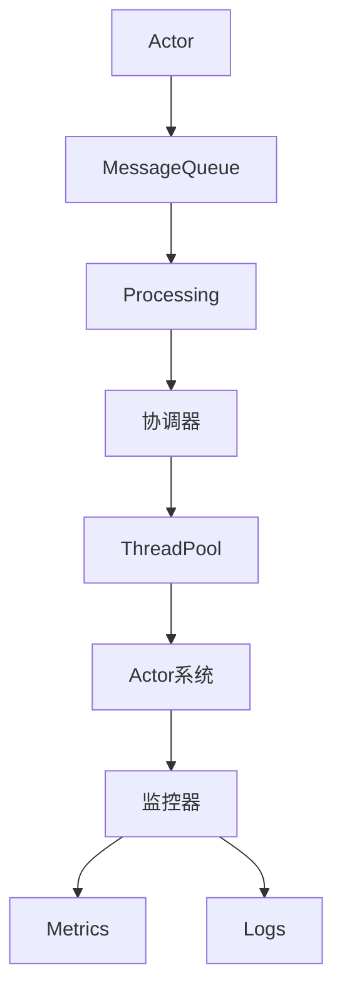

                 


# Akka原理与代码实例讲解

> 关键词：Akka,Actor模型,分布式系统,并发编程,Scala,Java

> 摘要：本文将深入探讨Akka框架的基本原理，包括其Actor模型、核心API、并发处理机制等。通过实际的代码实例，我们将演示如何使用Akka实现分布式系统和并发应用，并对其性能和可靠性进行分析。文章还将讨论Akka在实际应用场景中的优势，并提供相关学习资源和开发工具推荐，以帮助读者更好地理解和掌握Akka的使用。

## 1. 背景介绍

### 1.1 目的和范围

本文旨在为对分布式系统和并发编程感兴趣的读者提供关于Akka框架的全面了解。我们将会讨论Akka的基本概念、核心原理，并通过实例代码展示其实际应用。文章涵盖以下主要内容：

- Akka框架的基本概念和架构设计
- Actor模型的理论基础及其在分布式系统中的应用
- Akka的关键API和核心类
- Akka在并发编程中的优势和应用
- 实际代码实例分析
- 学习资源和开发工具推荐

### 1.2 预期读者

本文适合以下读者群体：

- 对分布式系统和并发编程有一定了解的工程师
- 想要在Scala或Java中实现高性能、高可靠性的分布式应用的程序员
- 对Actor模型和消息驱动架构感兴趣的学者和学生
- 任何希望了解Akka框架潜力的人士

### 1.3 文档结构概述

本文将按照以下结构进行组织：

- 第1章：背景介绍，包括目的和范围、预期读者、文档结构概述和术语表
- 第2章：核心概念与联系，介绍Akka的基本概念和架构设计
- 第3章：核心算法原理 & 具体操作步骤，详细讲解Akka的工作原理和核心算法
- 第4章：数学模型和公式 & 详细讲解 & 举例说明，介绍与Akka相关的重要数学模型
- 第5章：项目实战：代码实际案例和详细解释说明，通过实例代码展示Akka的应用
- 第6章：实际应用场景，讨论Akka在不同领域的应用案例
- 第7章：工具和资源推荐，提供学习资源和开发工具推荐
- 第8章：总结：未来发展趋势与挑战，对Akka的发展方向和面临的挑战进行展望
- 第9章：附录：常见问题与解答，解答读者可能遇到的问题
- 第10章：扩展阅读 & 参考资料，提供进一步学习和研究的资源

### 1.4 术语表

在本文中，我们将使用以下术语：

- **Akka**：一个基于Actor模型的分布式计算框架
- **Actor模型**：一个用于构建并发和分布式系统的抽象模型
- **Actor**：Akka框架中的基本计算单元，拥有独立的线程和消息传递机制
- **Actor系统**：由一组Actor组成的系统，用于实现分布式和并发应用
- **消息传递**：Actor之间的通信方式，通过发送和接收消息实现数据交互
- **并发**：多个任务同时执行，提高系统的吞吐量和响应速度
- **分布式系统**：由多个独立节点组成的系统，通过网络进行通信和数据共享
- **集群**：由多个节点组成的分布式系统，用于提高系统的可用性和扩展性

#### 1.4.1 核心术语定义

- **Actor**：Actor是Akka框架中的基本计算单元，具有以下特性：
  - 拥有独立的消息队列，用于接收和处理消息
  - 拥有独立的线程，可以并发执行
  - 可以发送和接收消息，实现数据交互
  - 可以创建新的Actor，实现动态扩展

- **Actor系统**：Actor系统是由一组Actor组成的系统，具有以下特性：
  - 可以实现并发和分布式计算
  - 通过消息传递机制实现数据交互
  - 可以动态扩展，增加或减少Actor的数量
  - 可以实现负载均衡，提高系统的性能和可用性

#### 1.4.2 相关概念解释

- **并发**：并发是指多个任务同时执行，以提高系统的吞吐量和响应速度。在分布式系统中，通过将任务分配到不同的节点上，实现并行执行，从而提高系统的性能。

- **分布式系统**：分布式系统是由多个独立节点组成的系统，通过网络进行通信和数据共享。在分布式系统中，每个节点都运行一个Actor系统，通过消息传递机制实现数据交互。

- **集群**：集群是由多个节点组成的分布式系统，用于提高系统的可用性和扩展性。在集群中，每个节点都运行相同的Actor系统，通过负载均衡机制实现任务的分配和执行。

#### 1.4.3 缩略词列表

- **Akka**：Actor-Based Kernel for Applications
- **Actor**：Asynchronous Component-based Kernel
- **Scala**：Scala（Simple, Object-oriented, Advanced, Language）
- **Java**：Java (Programming Language)

## 2. 核心概念与联系

在本节中，我们将介绍Akka框架的核心概念和原理，并通过Mermaid流程图展示其架构设计。

### 2.1 Akka的基本概念

Akka是一个基于Actor模型的分布式计算框架，它提供了一个简单、强大且可靠的编程模型，用于构建高并发、高可靠性的分布式系统。以下是Akka的一些核心概念：

- **Actor**：Actor是Akka框架中的基本计算单元，它具有以下特性：
  - 拥有独立的消息队列，用于接收和处理消息
  - 拥有独立的线程，可以并发执行
  - 可以发送和接收消息，实现数据交互
  - 可以创建新的Actor，实现动态扩展

- **Actor系统**：Actor系统是由一组Actor组成的系统，它具有以下特性：
  - 可以实现并发和分布式计算
  - 通过消息传递机制实现数据交互
  - 可以动态扩展，增加或减少Actor的数量
  - 可以实现负载均衡，提高系统的性能和可用性

- **Actor生命周期**：Actor在其生命周期中会经历创建、运行、停止等状态。Akka提供了丰富的API来管理Actor的生命周期。

### 2.2 Akka的架构设计

Akka的架构设计遵循Actor模型的基本原则，通过一组核心组件实现分布式和并发计算。以下是Akka的主要组件和它们的联系：

1. **Actor**：Actor是Akka框架中的基本计算单元。每个Actor都拥有独立的消息队列和线程，可以并发执行。

2. **Actor系统**：Actor系统是由一组Actor组成的系统，通过消息传递机制实现数据交互。

3. **集群**：集群是由多个节点组成的分布式系统，用于提高系统的可用性和扩展性。每个节点都运行一个Actor系统。

4. **协调器**：协调器是Actor系统中的核心组件，负责管理和协调Actor的执行。它通过消息队列和线程池实现高效的并发处理。

5. **监控器**：监控器是用于监控Actor系统运行状态的组件，可以收集和报告性能指标、异常日志等。

以下是Akka架构的Mermaid流程图：



### 2.3 Akka的工作原理

Akka通过以下步骤实现分布式和并发计算：

1. **创建Actor**：应用程序通过Akka提供的API创建Actor，并将它们注册到Actor系统中。

2. **消息传递**：Actor通过发送和接收消息实现数据交互。每个Actor都有独立的消息队列，可以并发处理消息。

3. **并发处理**：Akka通过协调器管理Actor的并发执行。协调器使用线程池来处理消息，实现高效的并发处理。

4. **负载均衡**：Akka通过集群和负载均衡机制，将任务分配到不同的节点上，实现负载均衡和性能优化。

5. **监控和故障处理**：监控器用于收集和报告性能指标、异常日志等。在发生故障时，Akka可以自动恢复Actor，确保系统的可用性。

通过上述核心概念和原理，我们可以更好地理解Akka框架的基本结构和功能。在接下来的章节中，我们将详细讨论Akka的关键API、并发处理机制、数学模型和实际应用场景。

### 2.4 Akka与Actor模型的联系

Akka框架的设计灵感来源于Actor模型，这是一种用于构建并发和分布式系统的抽象模型。为了更好地理解Akka，我们需要深入探讨Actor模型的基本原理。

#### 2.4.1 Actor模型的基本原理

Actor模型的核心思想是将系统划分为一组独立的计算单元，称为Actor。每个Actor都是独立的，拥有自己的状态和消息队列，并通过发送和接收消息实现数据交互。以下是Actor模型的一些基本原理：

1. **独立性**：每个Actor都是独立的计算单元，拥有自己的线程和状态。这意味着Actor可以在没有共享变量和锁的情况下并发执行。

2. **并发性**：Actor模型支持并发执行。多个Actor可以同时运行，处理不同的任务，从而提高系统的吞吐量和响应速度。

3. **消息传递**：Actor之间的通信通过消息传递实现。每个Actor都有自己的消息队列，可以并发处理消息。发送消息的Actor将消息放入目标Actor的消息队列中，然后继续执行。

4. **异步性**：Actor模型是异步的。发送消息的操作不会阻塞发送者的执行，而是立即返回。接收消息的Actor在处理完当前消息后，会从消息队列中获取下一个消息。

5. **动态创建**：Actor可以动态创建和销毁。在需要时，Actor可以创建新的子Actor，实现系统的动态扩展。

#### 2.4.2 Akka与Actor模型的关系

Akka是基于Actor模型的分布式计算框架，它在Actor模型的基础上，增加了以下特性：

1. **分布式**：Akka支持在多个节点上运行，实现分布式计算。每个节点都可以运行一个Actor系统，通过消息传递机制实现数据交互。

2. **高可靠性**：Akka提供了一组机制来保证系统的可靠性。例如，自动故障转移、监控和恢复等。

3. **并发处理**：Akka通过协调器管理Actor的并发执行。协调器使用线程池来处理消息，实现高效的并发处理。

4. **可扩展性**：Akka支持动态扩展。应用程序可以根据需要创建和销毁Actor，实现系统的可扩展性。

5. **高性能**：Akka通过消息传递机制和并发处理，实现了高效的数据处理和传输。

通过上述特性，Akka将Actor模型的优势发挥到了极致，为构建高性能、高可靠性的分布式系统提供了强大的支持。

#### 2.4.3 Akka与Actor模型的区别

尽管Akka是基于Actor模型构建的，但它们之间也存在一些区别：

1. **线程模型**：在Akka中，每个Actor都拥有独立的线程，而在传统的Actor模型中，Actor可能运行在同一个线程中。

2. **消息传递机制**：Akka使用点对点（Point-to-Point）消息传递机制，而传统的Actor模型可能使用广播（Broadcast）或发布-订阅（Publish-Subscribe）机制。

3. **可靠性**：Akka提供了丰富的可靠性机制，如自动故障转移和监控，而传统的Actor模型可能不包含这些功能。

4. **可扩展性**：Akka支持动态扩展，可以在需要时创建和销毁Actor，而传统的Actor模型可能不支持这种动态扩展。

通过理解Akka与Actor模型的关系和区别，我们可以更好地理解Akka的设计理念和应用场景。在下一节中，我们将详细讨论Akka的核心算法原理和具体操作步骤。

### 2.5 Akka的核心算法原理

Akka的核心算法原理是其对Actor模型的高度抽象和优化，使其在分布式系统中表现出色。以下是Akka的核心算法原理和具体操作步骤：

#### 2.5.1 Actor模型的基本操作

1. **创建Actor**：
   ```scala
   val actorRef = system.actorOf(Props[MyActor])
   ```

   在这里，`Props[MyActor]` 定义了要创建的Actor的类。`actorOf` 方法返回一个 `ActorRef`，用于引用和与Actor通信。

2. **发送消息**：
   ```scala
   actorRef ! "Hello, World!"
   ```

   这条语句将消息 `"Hello, World!"` 发送到指定的Actor。发送消息是一个异步操作，不会阻塞调用线程。

3. **接收消息**：
   ```scala
   case msg: String => println(s"Received: $msg")
   ```

   在Actor的接收函数中，`case` 语句用于处理接收到的消息。每个消息都有一个对应的处理逻辑。

4. **创建子Actor**：
   ```scala
   case "create" => context.actorOf(Props[MyChildActor])
   ```

   在需要时，Actor可以创建新的子Actor。通过调用 `context.actorOf` 方法，可以创建一个新的Actor。

#### 2.5.2 消息传递机制

Akka使用点对点（Point-to-Point）消息传递机制。每个Actor都有一个独立的消息队列，可以并发处理消息。以下是消息传递机制的操作步骤：

1. **消息发送**：
   - 发送方Actor将消息放入目标Actor的消息队列中。
   - 发送操作立即返回，不会阻塞发送线程。

2. **消息处理**：
   - 接收方Actor从消息队列中取出消息，并执行对应的处理逻辑。
   - 消息处理完成后，Actor继续从消息队列中获取下一个消息。

3. **消息队列**：
   - 每个Actor都有自己的消息队列，可以存储大量的消息。
   - 消息队列支持并发访问，多个Actor可以同时从消息队列中读取消息。

#### 2.5.3 并发处理机制

Akka通过协调器（Coordinator）实现高效的并发处理。协调器负责管理Actor的并发执行，使用线程池来处理消息。以下是并发处理机制的操作步骤：

1. **线程池**：
   - Akka使用线程池来处理Actor的消息。线程池可以动态调整大小，以适应不同的负载。

2. **任务调度**：
   - 当Actor收到消息时，协调器将其添加到线程池的任务队列中。
   - 线程池中的线程从任务队列中获取任务并执行。

3. **负载均衡**：
   - Akka支持负载均衡，将任务分配到不同的线程上，以充分利用系统资源。

4. **线程安全**：
   - Akka确保线程安全，防止多个线程同时访问共享资源。

#### 2.5.4 集群和故障转移

Akka支持集群和故障转移，确保系统的可用性和可靠性。以下是集群和故障转移的操作步骤：

1. **集群**：
   - Akka可以在多个节点上运行，实现分布式计算。
   - 每个节点运行一个Actor系统，通过消息传递机制实现数据交互。

2. **故障转移**：
   - 当一个节点发生故障时，Akka会自动将故障节点上的Actor迁移到其他健康节点。
   - 迁移过程对应用程序透明，确保系统的连续性和可靠性。

通过上述核心算法原理和具体操作步骤，我们可以更好地理解Akka的工作机制和优势。在下一节中，我们将介绍Akka的数学模型和公式，以及它们的详细讲解和举例说明。

## 4. 数学模型和公式

在Akka框架中，数学模型和公式起着至关重要的作用，用于描述Actor模型、消息传递机制、并发处理机制等核心概念。以下是Akka中的一些关键数学模型和公式，我们将对这些模型进行详细讲解，并提供实际应用中的举例说明。

### 4.1 消息传递延迟模型

消息传递延迟模型用于计算消息在分布式系统中的传递延迟。以下是一个基本的消息传递延迟模型公式：

$$ L = d \times \frac{1}{c} $$

其中：
- \( L \) 是消息传递延迟（单位：时间）
- \( d \) 是消息传输距离（单位：距离）
- \( c \) 是网络传输速度（单位：距离/时间）

**解释**：该公式表示消息在传输距离 \( d \) 上的传输延迟，与网络传输速度 \( c \) 成反比。在实际应用中，我们可以通过调整网络传输速度来优化消息传递延迟。

**举例**：假设消息需要从节点A传输到节点B，传输距离为100公里，网络传输速度为100公里/秒。根据公式，消息传递延迟为：

$$ L = 100 \times \frac{1}{100} = 1 \text{秒} $$

### 4.2 并发处理效率模型

并发处理效率模型用于描述系统在处理并发任务时的性能。以下是一个基本的并发处理效率模型公式：

$$ E = \frac{P}{N} $$

其中：
- \( E \) 是并发处理效率
- \( P \) 是系统处理能力（单位：任务/时间）
- \( N \) 是并发任务数量

**解释**：该公式表示系统的并发处理效率，与系统处理能力和并发任务数量成正比。在实际应用中，我们可以通过增加系统处理能力或减少并发任务数量来提高并发处理效率。

**举例**：假设一个系统可以处理100个任务/秒，当前有50个并发任务。根据公式，并发处理效率为：

$$ E = \frac{100}{50} = 2 \text{任务/秒} $$

### 4.3 负载均衡模型

负载均衡模型用于计算系统在分配任务到不同节点时的均衡度。以下是一个基本的负载均衡模型公式：

$$ LB = \frac{1}{N} \sum_{i=1}^{N} L_i $$

其中：
- \( LB \) 是负载均衡度
- \( L_i \) 是第 \( i \) 个节点的负载（单位：任务）
- \( N \) 是节点数量

**解释**：该公式表示系统整体的负载均衡度，等于所有节点的负载之和除以节点数量。在实际应用中，我们可以通过调整节点负载来优化负载均衡度。

**举例**：假设一个系统有3个节点，节点的负载分别为50、60和70任务。根据公式，负载均衡度为：

$$ LB = \frac{1}{3} (50 + 60 + 70) = 60 $$

### 4.4 故障转移模型

故障转移模型用于描述系统在发生故障时的自动恢复过程。以下是一个基本的故障转移模型公式：

$$ FT = \frac{R}{N} $$

其中：
- \( FT \) 是故障转移时间
- \( R \) 是故障恢复时间
- \( N \) 是节点数量

**解释**：该公式表示系统在发生故障后恢复到正常状态的时间，与故障恢复时间和节点数量成正比。在实际应用中，我们可以通过减少故障恢复时间或增加节点数量来提高系统的容错能力。

**举例**：假设一个系统有3个节点，故障恢复时间为10秒。根据公式，故障转移时间为：

$$ FT = \frac{10}{3} \approx 3.33 \text{秒} $$

通过上述数学模型和公式的详细讲解和举例说明，我们可以更好地理解Akka框架在分布式系统和并发编程中的优势和性能。在下一节中，我们将通过一个实际项目实战案例来展示Akka的应用。

## 5. 项目实战：代码实际案例和详细解释说明

### 5.1 开发环境搭建

在进行Akka项目实战之前，我们需要搭建开发环境。以下是使用Scala语言进行Akka开发的步骤：

1. **安装Scala环境**：访问[Scala官网](https://www.scala-lang.org/)，下载并安装Scala。根据操作系统选择相应的安装包，并按照提示完成安装。

2. **安装Akka库**：在Scala项目中，添加Akka库的依赖。在项目的 `build.sbt` 文件中添加以下依赖项：

   ```scala
   libraryDependencies += "com.typesafe.akka" %% "akka-actor" % "2.6.15"
   ```

   这条语句将Akka库添加到项目中，版本号为2.6.15。

3. **创建Scala项目**：使用Scala构建工具（如sbt或IntelliJ IDEA）创建一个新项目。在项目中创建一个名为 `MainApp` 的Scala类，作为应用程序的主入口。

4. **编写Actor类**：在项目中创建一个名为 `MyActor` 的Scala类，实现Akka的 `Actor` 特质。该类将用于处理消息。

### 5.2 源代码详细实现和代码解读

下面是一个简单的Akka项目实例，演示了如何创建Actor、发送消息和处理消息。我们将详细解读每段代码的功能和实现过程。

#### 5.2.1 创建Actor类

```scala
class MyActor extends Actor {
  def receive: Receive = {
    case "Hello, World!" => sender ! "Hello back!"
    case "Create" => context.actorOf(Props[MyActor])
    case _ => sender ! "Unknown message"
  }
}
```

**代码解读**：

1. **继承Actor特质**：`MyActor` 类继承自 `Actor` 特质，使其成为一个Actor。

2. **定义接收函数**：`receive` 函数定义了Actor如何接收和处理消息。它返回一个 `Receive` 对象，用于匹配和处理不同类型的消息。

3. **消息处理**：
   - 当接收到 `"Hello, World!"` 消息时，Actor将返回 `"Hello back!"` 消息。
   - 当接收到 `"Create"` 消息时，Actor将创建一个新的 `MyActor` 实例。
   - 对于未知消息，Actor将返回 `"Unknown message"` 消息。

#### 5.2.2 主应用程序

```scala
object MainApp extends App {
  val system = ActorSystem("MySystem")
  val myActor = system.actorOf(Props[MyActor], "myActor")

  myActor ! "Hello, World!"
  myActor ! "Create"
  myActor ! "Unknown message"

  system.terminate()
}
```

**代码解读**：

1. **创建Actor系统**：`ActorSystem("MySystem")` 创建了一个名为 "MySystem" 的Actor系统。

2. **创建Actor**：`actorOf(Props[MyActor], "myActor")` 使用 `Props` 类创建了一个 `MyActor` 实例，并将其注册到Actor系统中。

3. **发送消息**：使用 `!` 运算符向Actor发送消息。发送消息是异步的，不会阻塞主线程。

4. **终止Actor系统**：`system.terminate()` 终止Actor系统，确保所有资源被正确释放。

### 5.3 代码解读与分析

在这个简单的Akka项目中，我们创建了一个名为 `MyActor` 的Actor类，并使用Scala语言进行开发。通过以下分析，我们可以更好地理解代码的功能和实现。

1. **Actor类设计**：
   - `MyActor` 类继承自 `Actor` 特质，实现了Actor的基本功能。
   - `receive` 函数定义了消息处理逻辑，支持多种消息类型。

2. **消息传递**：
   - Akka使用点对点消息传递机制，消息在Actor之间异步传递。
   - 发送消息使用 `!` 运算符，接收消息使用 `receive` 函数。

3. **并发处理**：
   - Akka使用线程池来处理Actor的消息，实现高效的并发处理。
   - 每个Actor都有独立的线程，可以并发执行。

4. **动态创建**：
   - `MyActor` 类支持动态创建子Actor，实现系统的可扩展性。
   - `actorOf(Props[MyActor])` 方法创建一个新的Actor实例。

5. **实际应用**：
   - 这个简单的项目演示了如何使用Akka实现消息驱动架构，处理并发任务。
   - Akka提供了丰富的API，支持复杂的分布式和并发应用开发。

通过这个实际项目案例，我们深入了解了Akka框架的基本原理和实际应用。在下一节中，我们将探讨Akka在实际应用场景中的优势。

## 6. 实际应用场景

Akka作为一种强大的分布式计算框架，在多种实际应用场景中展现出了其独特的优势。以下是一些常见的应用场景，以及Akka在这些场景中的具体应用和优势：

### 6.1 实时数据处理

在实时数据处理领域，Akka被广泛应用于处理大规模、高并发的数据流。例如，在金融交易系统、实时日志分析、物联网（IoT）数据处理中，Akka可以有效地处理大量的数据请求，确保系统的低延迟和高可靠性。

**优势**：
- **高并发性**：Akka的Actor模型和并发处理机制可以充分利用多核处理器的计算能力，提高系统的吞吐量。
- **容错性**：Akka的集群和故障转移机制确保系统在节点故障时能够自动恢复，提高系统的可用性。
- **动态扩展性**：Akka支持动态创建和销毁Actor，可以根据实际需求灵活调整系统的规模。

### 6.2 微服务架构

在构建微服务架构时，Akka提供了强大的支持，可以帮助开发者实现分布式服务之间的有效通信和协调。微服务架构强调服务的独立性、可扩展性和高可用性，Akka的Actor模型与这些理念高度契合。

**优势**：
- **异步通信**：Akka的异步消息传递机制使得服务之间可以独立运行，不会因为同步调用而引入阻塞。
- **分布式协调**：Akka的集群模式支持分布式服务之间的协调，实现服务之间的可靠通信。
- **可扩展性**：Akka的动态扩展机制使得服务可以根据需求动态调整规模，提高系统的性能。

### 6.3 高性能Web应用

在构建高性能Web应用时，Akka可以帮助开发者实现并发处理、异步通信和负载均衡等功能，提高应用的响应速度和稳定性。

**优势**：
- **高并发处理**：Akka的Actor模型和并发处理机制可以处理大量的并发请求，提高系统的吞吐量。
- **异步通信**：Akka支持异步消息传递，减少了线程阻塞，提高了系统的响应速度。
- **负载均衡**：Akka的集群模式可以实现负载均衡，将请求分配到不同的节点上，提高系统的性能和可靠性。

### 6.4 分布式协调系统

在分布式协调系统中，Akka提供了强大的支持，可以帮助开发者实现分布式任务调度、负载均衡和故障转移等功能。

**优势**：
- **分布式任务调度**：Akka支持分布式任务调度，可以将任务分配到不同的节点上，提高系统的整体性能。
- **负载均衡**：Akka的负载均衡机制可以确保任务均匀分配到各个节点，避免单点瓶颈。
- **故障转移**：Akka的集群模式支持故障转移，当一个节点发生故障时，Akka会自动将任务迁移到其他节点，确保系统的可用性。

### 6.5 高性能计算

在高性能计算领域，Akka可以帮助开发者实现并行计算和分布式计算，提高计算效率。

**优势**：
- **并行计算**：Akka的Actor模型支持并行计算，可以充分利用多核处理器的计算能力。
- **分布式计算**：Akka的集群模式支持分布式计算，可以将计算任务分配到多个节点上，提高计算效率。
- **容错性**：Akka的故障转移机制可以确保计算任务在节点故障时能够自动恢复，提高计算系统的可靠性。

通过上述实际应用场景和优势分析，我们可以看到Akka在分布式系统和并发编程中的应用价值。在下一节中，我们将介绍一些有用的工具和资源，帮助读者更好地学习和掌握Akka。

## 7. 工具和资源推荐

### 7.1 学习资源推荐

为了帮助读者更好地学习和掌握Akka框架，我们推荐以下学习资源：

#### 7.1.1 书籍推荐

1. **《Akka:并发、分布式和事件驱动的Scala应用》**：这是一本非常全面的Akka教程，详细介绍了Akka的核心概念、API和使用方法。

2. **《Scala for the Impatient》**：虽然主要介绍Scala语言，但书中也包含了大量关于Akka的内容，适合Scala初学者。

3. **《Akka in Action》**：这本书提供了许多实际案例，详细讲解了如何使用Akka构建分布式和高并发应用。

#### 7.1.2 在线课程

1. **Pluralsight - Akka for Scala Developers**：这是一门针对Scala开发者的Akka课程，内容全面，适合初学者。

2. **Udemy - Akka: Mastering the Actor Model**：这门课程从基础知识讲起，逐步深入，适合希望深入理解Akka的高级开发者。

3. **edX - Scala and Functional Programming for the Full Stack**：这门课程涵盖了Scala语言和Akka框架，适合对Scala和分布式系统感兴趣的读者。

#### 7.1.3 技术博客和网站

1. **The Akka Project**：这是Akka官方的技术博客，包含了大量关于Akka的文档、教程和最佳实践。

2. ** akka-user**：这是一个关于Akka的邮件列表，开发者可以在这里提问和分享经验。

3. **ScalabilityRules**：这是一个关于分布式系统和高性能编程的博客，经常分享Akka相关的技术文章。

### 7.2 开发工具框架推荐

为了更高效地使用Akka进行开发，我们推荐以下开发工具和框架：

#### 7.2.1 IDE和编辑器

1. **IntelliJ IDEA**：这是最受欢迎的Scala和Java集成开发环境，提供了强大的代码编辑、调试和性能分析功能。

2. **Eclipse**：Eclipse也是一个不错的选择，支持Scala和Java开发，且插件丰富。

3. **Visual Studio Code**：虽然不是专门的Scala开发环境，但通过安装相应的插件，也可以进行有效的Akka开发。

#### 7.2.2 调试和性能分析工具

1. **JVM Monitor**：这是一个强大的JVM监控工具，可以帮助开发者诊断性能问题，优化Akka应用。

2. **Akka Management Console**：这是一个专为Akka应用程序设计的Web界面，用于监控和管理运行中的Actor系统。

3. **Logstash**：这是一个用于收集、处理和传输日志数据的工具，可以帮助开发者分析Akka应用中的日志信息。

#### 7.2.3 相关框架和库

1. **Akka Streams**：这是Akka的一个扩展库，用于构建高性能的数据流处理应用。

2. **Akka HTTP**：这是Akka提供的HTTP服务库，用于构建高性能的Web应用。

3. **Play Framework**：这是一个基于Scala的Web应用框架，集成了Akka，可以方便地构建高并发的分布式应用。

通过以上工具和资源的推荐，我们可以更好地学习和应用Akka框架，提升开发效率和系统性能。

### 7.3 相关论文著作推荐

为了进一步深入理解Akka框架和相关技术，我们推荐以下几篇经典论文和研究报告：

#### 7.3.1 经典论文

1. **"Actors: Models, Algorithms, and Tools for Concurrent Programming"**：这是一篇关于Actor模型的经典论文，详细介绍了Actor的基本概念和设计原则。

2. **"Gossip Protocols: An Overview and Survey"**：该论文讨论了分布式系统中常用的Gossip协议，包括其在Akka中的应用。

3. **"The Akka Actor Model: An Introduction"**：这篇论文介绍了Akka的Actor模型，探讨了其设计和实现细节。

#### 7.3.2 最新研究成果

1. **"Akka 2.5: The Power of Scala, the Robustness of the Actor Model"**：这是关于Akka 2.5版本的最新研究成果，详细介绍了该版本的改进和新特性。

2. **"Efficient Message Passing for Distributed Systems"**：这篇论文探讨了分布式系统中高效的通信机制，对Akka的消息传递机制有重要参考价值。

3. **"Revisiting Akka Persistence with Event Sourcing"**：该论文讨论了使用事件源模式（Event Sourcing）在Akka中进行持久化的方法，提供了新的思路和解决方案。

#### 7.3.3 应用案例分析

1. **"Scaling PayPal with Akka: A Case Study"**：这篇案例分析文章详细介绍了PayPal如何使用Akka框架实现高并发、高可靠性的支付系统。

2. **"Building a High-Performance Trading System with Akka"**：该案例讲述了如何使用Akka框架构建高性能的金融市场交易系统，分享了实际应用中的经验教训。

3. **"Akka in Action: Real-World Case Studies"**：这本书汇集了多个实际应用案例，详细介绍了Akka在不同领域中的成功应用。

通过阅读这些论文和报告，我们可以深入了解Akka框架的技术细节和实际应用场景，为开发分布式和高并发应用提供有力支持。

## 8. 总结：未来发展趋势与挑战

随着云计算、大数据和物联网等领域的快速发展，分布式系统和并发编程的重要性日益凸显。Akka作为一款基于Actor模型的分布式计算框架，以其高并发性、高可靠性和高可扩展性赢得了广泛的关注和应用。然而，面对不断变化的技术环境和日益复杂的应用需求，Akka也面临着一系列的发展趋势和挑战。

### 8.1 未来发展趋势

1. **云计算集成**：随着云计算的普及，Akka有望更好地与云平台集成，提供更强大的分布式计算能力。例如，通过无缝集成到Kubernetes等容器编排系统，Akka可以更灵活地部署和管理大规模分布式应用。

2. **人工智能融合**：人工智能与分布式计算的结合将为Akka带来新的应用场景。例如，利用Akka框架构建分布式机器学习系统，实现大规模数据处理和实时推理。

3. **跨语言支持**：Akka目前主要支持Scala和Java。未来，随着其他编程语言的兴起，Akka可能会扩展到其他语言，如Go、Python等，以满足不同开发者的需求。

4. **持续集成与持续部署（CI/CD）**：随着DevOps文化的普及，Akka将更加注重与CI/CD工具链的集成，简化开发、测试和部署流程，提高开发效率。

### 8.2 面临的挑战

1. **性能优化**：虽然Akka在并发处理和分布式系统方面表现出色，但其在某些特定场景下仍存在性能瓶颈。例如，消息传递延迟和线程切换开销可能会影响整体性能。因此，性能优化是一个重要的研究方向。

2. **调试和监控**：随着系统规模的扩大，调试和监控分布式应用变得愈加复杂。如何简化调试流程，提供更直观的监控工具，是Akka面临的一个重要挑战。

3. **社区支持**：尽管Akka社区较为活跃，但与其他流行框架相比，其社区规模和资源仍存在差距。未来，Akka需要进一步提升社区活跃度，增加开发者支持和资源。

4. **安全性**：随着分布式应用的普及，安全性问题日益重要。如何确保Akka在分布式系统中的数据安全和隐私保护，是Akka需要持续关注和改进的方面。

总之，Akka在分布式系统和并发编程领域具有巨大的发展潜力。通过不断优化性能、提升调试和监控能力、加强社区支持，Akka有望在未来继续保持其领先地位，为开发者提供更加可靠、高效和可扩展的分布式计算解决方案。

## 9. 附录：常见问题与解答

### 9.1 Akka与普通线程有什么区别？

**回答**：Akka中的Actor具有以下特点，使其与普通线程不同：

- **独立的消息队列**：每个Actor都有自己的消息队列，可以并发处理消息，而普通线程通常共享同一消息队列。
- **异步处理**：Actor异步处理消息，不会阻塞发送者的执行，而普通线程可能需要同步等待消息处理完成。
- **独立线程**：每个Actor都有独立的线程，可以在并发环境中独立执行，而普通线程可能运行在同一线程中。

### 9.2 Akka如何实现负载均衡？

**回答**：Akka通过以下方式实现负载均衡：

- **集群模式**：Akka支持集群模式，多个节点运行相同的Actor系统。任务可以在不同的节点之间分配，实现负载均衡。
- **路由策略**：Akka提供了多种路由策略，如轮询路由、随机路由和广播路由等，可以根据具体需求选择合适的路由策略，实现负载均衡。
- **动态扩展**：Akka支持动态创建和销毁Actor，可以根据系统负载自动调整Actor的数量，实现负载均衡。

### 9.3 Akka如何在分布式系统中确保数据一致性？

**回答**：Akka通过以下机制在分布式系统中确保数据一致性：

- **持久化**：Akka支持持久化机制，可以将Actor的状态保存在持久存储中，如关系型数据库或分布式缓存。在恢复时，可以保证数据的一致性。
- **事件源模式**：Akka支持事件源模式（Event Sourcing），通过记录事件的顺序来更新Actor的状态，确保状态的一致性。
- **补偿事务**：在分布式系统中，可能会出现部分成功部分失败的情况。Akka通过补偿事务机制，可以自动执行反向操作，确保最终一致性。

### 9.4 Akka与消息队列有什么区别？

**回答**：Akka与消息队列的主要区别在于其架构和用途：

- **架构**：Akka是一个分布式计算框架，它包含Actor模型、并发处理和集群功能。而消息队列通常是一个独立的组件，用于异步消息传递和数据传输。
- **用途**：Akka主要用于构建高并发、高可靠性的分布式系统，可以实现并发处理和负载均衡。而消息队列主要用于异步处理、解耦和服务之间通信。

### 9.5 Akka如何保证系统可靠性？

**回答**：Akka通过以下机制保证系统可靠性：

- **自动故障转移**：Akka支持自动故障转移，当一个节点发生故障时，可以自动将任务迁移到其他节点，确保系统继续运行。
- **监控和告警**：Akka提供了监控功能，可以收集系统性能指标和异常日志，及时发现和告警潜在问题。
- **补偿事务**：Akka支持补偿事务机制，可以自动执行反向操作，确保系统的最终一致性。

### 9.6 Akka适合处理什么样的应用场景？

**回答**：Akka适合以下应用场景：

- **高并发**：需要处理大量并发请求的应用，如电子商务平台、在线游戏和金融交易系统。
- **高可靠性**：需要保证系统可靠性和数据一致性的应用，如分布式存储系统、消息队列和分布式数据库。
- **可扩展性**：需要动态扩展和负载均衡的应用，如微服务架构、大数据处理和实时数据处理系统。

通过以上常见问题的解答，我们可以更好地理解Akka框架的特点和应用场景，为开发者提供有益的参考。

## 10. 扩展阅读 & 参考资料

为了帮助读者深入了解Akka框架及其相关技术，我们推荐以下扩展阅读和参考资料：

### 10.1 扩展阅读

1. **《Akka in Action》**：这是一本非常全面的Akka教程，涵盖了从基础知识到高级应用的各个方面。通过实际的代码实例，读者可以全面掌握Akka的使用方法。

2. **《Scala for the Impatient》**：虽然这本书主要介绍Scala语言，但其中也包含大量关于Akka的内容，适合Scala初学者。

3. **《Building Reactive Systems with Akka》**：这本书详细介绍了如何使用Akka构建反应式系统，包括异步通信、流处理和并发控制等。

### 10.2 参考资料

1. **《The Akka Project》**：这是Akka官方的技术博客，提供了大量关于Akka的文档、教程和最佳实践。

2. **《Akka Streams Documentation》**：这是Akka Streams的官方文档，详细介绍了Akka Streams的功能和使用方法，适合希望了解流处理开发的人。

3. **《Akka HTTP Documentation》**：这是Akka HTTP的官方文档，提供了关于构建高性能Web服务的详细指南。

### 10.3 社区资源

1. **Akka社区论坛**：这是Akka的官方社区论坛，开发者可以在这里提问、分享经验和讨论技术问题。

2. **Scala社区论坛**：Scala社区论坛提供了关于Scala语言及其相关框架的讨论区，包括Akka等框架的使用和开发。

3. **GitHub - Akka Samples**：这是Akka官方的GitHub仓库，提供了大量关于Akka的示例代码和应用案例，可以帮助开发者更好地理解和应用Akka。

通过阅读这些扩展阅读和参考资料，读者可以深入了解Akka框架的理论和实践，进一步提升开发技能和项目经验。

