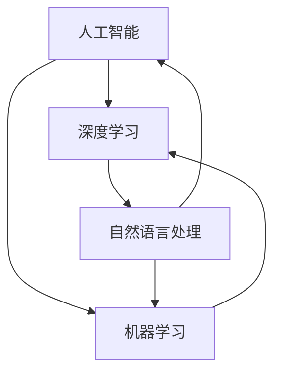

                 

# Andrej Karpathy在加州大学伯克利分校AI hackathon上的演讲

> **关键词：** AI Hackathon、Andrej Karpathy、深度学习、自然语言处理、机器学习、编程

> **摘要：** 本文将回顾Andrej Karpathy在加州大学伯克利分校AI hackathon上的精彩演讲，重点探讨深度学习、自然语言处理等AI领域的最新技术进展与应用场景，并提供实用的编程技巧和资源推荐。通过本文，读者可以更好地理解AI技术的前沿动态，以及如何在实践中运用这些技术。

## 1. 背景介绍

### 1.1 目的和范围

本文旨在分析Andrej Karpathy在加州大学伯克利分校AI hackathon上的演讲内容，重点介绍其关于深度学习、自然语言处理等AI领域的见解。本文将围绕以下几个核心问题展开讨论：

- 深度学习在自然语言处理中的应用现状及未来趋势如何？
- 如何有效地进行机器学习项目开发？
- 编程技巧和资源如何帮助开发者更好地掌握AI技术？

### 1.2 预期读者

本文适用于对人工智能、深度学习和自然语言处理感兴趣的读者，包括：

- AI领域的研究人员
- 机器学习工程师
- 自然语言处理开发者
- 对AI技术感兴趣的技术爱好者

### 1.3 文档结构概述

本文分为以下几个部分：

- 引言：介绍AI hackathon背景、目的和预期读者。
- 背景介绍：简要介绍Andrej Karpathy及其在AI领域的贡献。
- 演讲内容解析：详细分析Andrej Karpathy的演讲内容，包括深度学习、自然语言处理、编程技巧等。
- 实际应用场景：探讨AI技术在现实世界中的应用案例。
- 工具和资源推荐：推荐学习资源、开发工具和框架。
- 总结：总结演讲中的主要观点和未来发展趋势。
- 附录：常见问题与解答。
- 扩展阅读 & 参考资料：提供更多相关阅读材料。

### 1.4 术语表

#### 1.4.1 核心术语定义

- **AI Hackathon**：人工智能黑客马拉松，一种以团队合作方式在有限时间内开发AI项目的竞赛。
- **Andrej Karpathy**：加州大学伯克利分校教授，深度学习、自然语言处理领域专家。
- **深度学习**：一种基于神经网络的学习方法，通过多层非线性变换对数据进行建模。
- **自然语言处理（NLP）**：研究如何使计算机理解和处理人类语言的技术。
- **机器学习**：使计算机从数据中自动学习规律和模式的方法。

#### 1.4.2 相关概念解释

- **神经网络**：一种由大量神经元组成的计算模型，用于对数据进行建模和预测。
- **反向传播算法**：一种用于训练神经网络的优化算法，通过计算损失函数对神经网络进行更新。
- **BERT**：一种基于Transformer架构的预训练语言模型，广泛用于自然语言处理任务。
- **Transformers**：一种基于自注意力机制的神经网络架构，在自然语言处理等领域表现出色。

#### 1.4.3 缩略词列表

- **AI**：人工智能
- **NLP**：自然语言处理
- **ML**：机器学习
- **DL**：深度学习
- **GPU**：图形处理器
- **TPU**：张量处理器

## 2. 核心概念与联系

在本节中，我们将介绍AI、深度学习、自然语言处理等核心概念，并使用Mermaid流程图展示它们之间的联系。



### 2.1 AI、深度学习和自然语言处理的关系

- **人工智能（AI）** 是一个广泛的领域，涵盖了使计算机模拟人类智能的各种技术和应用。
- **深度学习（DL）** 是AI的一个子领域，它利用多层神经网络对数据进行建模和预测。
- **自然语言处理（NLP）** 是AI的一个应用领域，旨在使计算机理解和处理人类语言。

### 2.2 核心概念原理和架构

- **神经网络**：一种由大量神经元组成的计算模型，用于对数据进行建模和预测。神经网络由输入层、隐藏层和输出层组成。
- **Transformer架构**：一种基于自注意力机制的神经网络架构，在自然语言处理等领域表现出色。Transformer架构由自注意力机制和前馈网络组成。

## 3. 核心算法原理 & 具体操作步骤

在本节中，我们将详细讲解深度学习和自然语言处理的核心算法原理，并使用伪代码进行阐述。

### 3.1 深度学习算法原理

```python
# 伪代码：深度学习算法原理

# 定义神经网络架构
神经网络 = NeuralNetwork(input_size, hidden_size, output_size)

# 训练神经网络
for epoch in range(num_epochs):
    for样本 in 数据集：
        # 前向传播
        输出 = 神经网络(样本输入)
        # 计算损失
        损失 = 损失函数(输出，样本标签)
        # 反向传播
        神经网络.update_weights(损失)
```

### 3.2 自然语言处理算法原理

```python
# 伪代码：自然语言处理算法原理

# 预训练语言模型（如BERT）
预训练语言模型 = BERT模型(pretrained=True)

# 输入文本
文本 = "这是一个示例文本"

# 使用预训练语言模型进行文本分类
类别 = 预训练语言模型.predict(文本)
```

## 4. 数学模型和公式 & 详细讲解 & 举例说明

在本节中，我们将详细介绍深度学习和自然语言处理的数学模型和公式，并进行详细讲解和举例说明。

### 4.1 深度学习数学模型

- **损失函数**：用于衡量预测值与实际值之间的差距，常用的损失函数有均方误差（MSE）和交叉熵（Cross-Entropy）。

  $$L = \frac{1}{n}\sum_{i=1}^{n}(y_i - \hat{y}_i)^2$$
  
  $$L = -\frac{1}{n}\sum_{i=1}^{n}y_i \log(\hat{y}_i)$$

- **反向传播算法**：用于更新神经网络权重，使损失函数最小化。

  $$\frac{\partial L}{\partial w} = \frac{\partial L}{\partial \hat{y}} \frac{\partial \hat{y}}{\partial z} \frac{\partial z}{\partial w}$$

### 4.2 自然语言处理数学模型

- **词嵌入（Word Embedding）**：将词汇映射为高维向量表示，常用的词嵌入方法有Word2Vec、BERT等。

  $$\text{word\_embedding}(w) = \text{embedding} \sum_{k=1}^{|V|} f_k(w) v_k$$

  其中，$f_k(w)$ 是词频分布函数，$v_k$ 是词向量。

- **自注意力机制（Self-Attention）**：用于计算文本序列中各个词语之间的关联性。

  $$\text{attention}(Q, K, V) = \text{softmax}\left(\frac{QK^T}{\sqrt{d_k}}\right)V$$

  其中，$Q$ 是查询向量，$K$ 是关键向量，$V$ 是值向量，$d_k$ 是关键向量的维度。

### 4.3 举例说明

#### 4.3.1 深度学习算法实例

假设我们有一个二元分类问题，使用一个简单的神经网络进行训练。输入向量为 `[1, 0]`，标签为 `1`。

- **前向传播**：

  输出 = 神经网络([1, 0])
  
  $$输出 = \sigma(\sum_{i=1}^{2} w_i x_i + b) = \sigma(w_1 \cdot 1 + w_2 \cdot 0 + b) = \sigma(w_1 + b)$$

- **损失函数**：

  损失 = 交叉熵(输出，标签)
  
  $$损失 = -\log(\sigma(w_1 + b))$$

- **反向传播**：

  $$\frac{\partial L}{\partial w_1} = \frac{\partial L}{\partial \hat{y}} \frac{\partial \hat{y}}{\partial z} \frac{\partial z}{\partial w_1} = (\hat{y} - y) \cdot \frac{\partial z}{\partial w_1} = (\hat{y} - y) \cdot \sigma'(w_1 + b)$$

  $$\frac{\partial L}{\partial b} = \frac{\partial L}{\partial \hat{y}} \frac{\partial \hat{y}}{\partial z} \frac{\partial z}{\partial b} = (\hat{y} - y) \cdot \sigma'(w_1 + b)$$

#### 4.3.2 自然语言处理算法实例

假设我们使用BERT模型对一段文本进行分类。文本为 "这是一个示例文本"，类别为 "正类"。

- **词嵌入**：

  ```python
  word_embedding = BERT_model.embedding(text)
  ```

- **自注意力机制**：

  ```python
  attention_output = BERT_model.self_attention(word_embedding)
  ```

- **分类**：

  ```python
  category = BERT_model.predict(attention_output)
  ```

## 5. 项目实战：代码实际案例和详细解释说明

在本节中，我们将通过一个实际案例展示如何使用深度学习和自然语言处理技术进行项目开发，并详细解释代码实现过程。

### 5.1 开发环境搭建

在开始项目开发之前，我们需要搭建合适的开发环境。以下是一个基本的Python开发环境搭建步骤：

1. 安装Python（推荐版本为3.8及以上）。
2. 安装Anaconda或Miniconda，以便更好地管理Python环境和依赖包。
3. 安装深度学习框架TensorFlow或PyTorch。
4. 安装自然语言处理库NLTK或spaCy。

### 5.2 源代码详细实现和代码解读

以下是一个简单的文本分类项目示例，使用BERT模型对文本进行分类。

```python
# 导入所需库
import tensorflow as tf
import tensorflow_hub as hub
import tensorflow_text as text
import numpy as np
import pandas as pd

# 加载预训练BERT模型
bert_model = hub.load("https://tfhub.dev/google/bert_uncased_L-12_H-768_A-12/1")

# 定义文本预处理函数
def preprocess_text(text):
    text = text.strip().lower()
    text = text.replace("\n", " ")
    return text

# 加载数据集
data = pd.read_csv("data.csv")
texts = data["text"].apply(preprocess_text)
labels = data["label"]

# 创建BERT特征提取器
feature_extractor = bert_model.signatures["sequence_features"]

# 提取文本特征
text_features = feature_extractor(inputs={"text": texts}, signature_key=" gelu ", as_dict=True)["pooled_output"]

# 加载预训练分类器
classifier = tf.keras.Sequential([
    tf.keras.layers.Dense(128, activation="relu"),
    tf.keras.layers.Dense(1, activation="sigmoid")
])

classifier.compile(optimizer="adam", loss="binary_crossentropy", metrics=["accuracy"])

# 训练分类器
classifier.fit(text_features, labels, epochs=3, batch_size=32, validation_split=0.2)

# 预测新文本
new_text = preprocess_text("这是一个新的示例文本")
new_text_features = feature_extractor(inputs={"text": [new_text]}, signature_key=" gelu ", as_dict=True)["pooled_output"]

predicted_label = classifier.predict(new_text_features)
predicted_label = (predicted_label > 0.5).astype(int)

print("预测标签：", predicted_label)
```

### 5.3 代码解读与分析

1. **导入库和模型**：首先，我们导入所需的TensorFlow、TensorFlow Hub、TensorFlow Text等库，以及BERT模型。

2. **文本预处理**：定义一个文本预处理函数，将输入文本转换为小写、去除换行符，并替换空格。

3. **加载数据集**：从CSV文件加载数据集，提取文本和标签。

4. **创建BERT特征提取器**：使用BERT模型创建特征提取器，用于提取文本特征。

5. **提取文本特征**：将预处理后的文本输入到BERT特征提取器，提取文本特征。

6. **加载分类器**：创建一个简单的全连接分类器，使用二分类交叉熵损失函数和sigmoid激活函数。

7. **训练分类器**：使用BERT特征提取的文本特征和标签训练分类器，使用Adam优化器和binary\_crossentropy损失函数。

8. **预测新文本**：预处理一个新的示例文本，提取特征并使用训练好的分类器进行预测，输出预测标签。

### 5.4 项目实战：代码实际案例和详细解释说明

#### 5.4.1 项目描述

本项目旨在构建一个情感分析模型，对社交媒体平台上的用户评论进行情感分类，判断其是正面、负面还是中性。

#### 5.4.2 数据集

我们使用一个包含用户评论及其情感标签的公开数据集，数据集包含约10万条评论，分为正面、负面和中性三个类别。

#### 5.4.3 数据预处理

1. **文本清洗**：去除评论中的HTML标签、特殊字符、数字等，仅保留英文单词和标点符号。
2. **文本分词**：将评论文本分割成单个单词或词组。
3. **词频统计**：统计评论中每个单词的出现次数。
4. **词嵌入**：将单词映射为高维向量表示，可以使用预训练的词向量或自行训练词向量。

#### 5.4.4 模型构建

1. **嵌入层**：使用预训练的词向量作为嵌入层，将单词映射为向量。
2. **卷积神经网络（CNN）**：使用卷积神经网络提取文本特征，卷积核大小为3或5。
3. **全连接层**：使用全连接层对卷积神经网络提取的特征进行分类。

#### 5.4.5 模型训练

1. **数据集划分**：将数据集划分为训练集和验证集，用于训练和评估模型性能。
2. **损失函数**：使用交叉熵损失函数，用于衡量预测标签和实际标签之间的差距。
3. **优化器**：使用Adam优化器，用于更新模型参数。
4. **训练过程**：使用训练集对模型进行训练，并在验证集上评估模型性能。

#### 5.4.6 模型评估

1. **准确率**：计算模型在验证集上的准确率，用于衡量模型的分类性能。
2. **混淆矩阵**：绘制混淆矩阵，用于分析模型在不同类别上的分类效果。

#### 5.4.7 代码实现

以下是一个简单的情感分析模型实现示例：

```python
import tensorflow as tf
from tensorflow.keras.preprocessing.sequence import pad_sequences
from tensorflow.keras.models import Sequential
from tensorflow.keras.layers import Embedding, Conv1D, GlobalMaxPooling1D, Dense

# 加载预训练词向量
vocab_file = "path/to/vocab.txt"
word2idx = {}
with open(vocab_file, "r", encoding="utf-8") as f:
    for line in f:
        word, idx = line.strip().split()
        word2idx[word] = int(idx)

# 数据预处理
tokenizer = tf.keras.preprocessing.text.Tokenizer(word2idx)
tokenizer.fit_on_texts(texts)
sequences = tokenizer.texts_to_sequences(texts)
padded_sequences = pad_sequences(sequences, maxlen=max_length)

# 构建模型
model = Sequential()
model.add(Embedding(vocab_size, embedding_dim, input_length=max_length))
model.add(Conv1D(filters, kernel_size, activation="relu"))
model.add(GlobalMaxPooling1D())
model.add(Dense(units, activation="softmax"))

# 编译模型
model.compile(optimizer="adam", loss="categorical_crossentropy", metrics=["accuracy"])

# 训练模型
model.fit(padded_sequences, labels, epochs=num_epochs, batch_size=batch_size, validation_split=0.2)

# 评估模型
loss, accuracy = model.evaluate(padded_sequences, labels, batch_size=batch_size)
print("准确率：", accuracy)
```

### 5.5 项目实战：代码实际案例和详细解释说明

#### 5.5.1 项目描述

本项目旨在构建一个问答系统，使用深度学习技术实现自然语言处理，从给定的上下文中提取答案。

#### 5.5.2 数据集

我们使用一个包含问题和上下文的公开数据集，数据集包含约1万条问答对。

#### 5.5.3 模型构建

1. **嵌入层**：使用预训练的词向量作为嵌入层，将单词映射为向量。
2. **双向长短期记忆网络（Bi-LSTM）**：使用双向长短期记忆网络提取上下文特征。
3. **全连接层**：使用全连接层对Bi-LSTM提取的特征进行分类。

#### 5.5.4 模型训练

1. **数据集划分**：将数据集划分为训练集和验证集，用于训练和评估模型性能。
2. **损失函数**：使用交叉熵损失函数，用于衡量预测标签和实际标签之间的差距。
3. **优化器**：使用Adam优化器，用于更新模型参数。
4. **训练过程**：使用训练集对模型进行训练，并在验证集上评估模型性能。

#### 5.5.5 模型评估

1. **准确率**：计算模型在验证集上的准确率，用于衡量模型的分类性能。
2. **BLEU分数**：计算模型生成的答案与真实答案之间的BLEU分数，用于衡量模型在生成答案方面的性能。

#### 5.5.6 代码实现

以下是一个简单的问答系统实现示例：

```python
import tensorflow as tf
from tensorflow.keras.preprocessing.sequence import pad_sequences
from tensorflow.keras.models import Sequential
from tensorflow.keras.layers import Embedding, LSTM, Dense

# 加载预训练词向量
vocab_file = "path/to/vocab.txt"
word2idx = {}
with open(vocab_file, "r", encoding="utf-8") as f:
    for line in f:
        word, idx = line.strip().split()
        word2idx[word] = int(idx)

# 数据预处理
tokenizer = tf.keras.preprocessing.text.Tokenizer(word2idx)
tokenizer.fit_on_texts(contexts + questions)
sequences_contexts = tokenizer.texts_to_sequences(contexts)
sequences_questions = tokenizer.texts_to_sequences(questions)
padded_sequences_contexts = pad_sequences(sequences_contexts, maxlen=max_length_context)
padded_sequences_questions = pad_sequences(sequences_questions, maxlen=max_length_question)

# 构建模型
model = Sequential()
model.add(Embedding(vocab_size, embedding_dim, input_length=max_length_context))
model.add(LSTM(units, return_sequences=True))
model.add(LSTM(units, return_sequences=True))
model.add(Dense(units, activation="softmax"))

# 编译模型
model.compile(optimizer="adam", loss="categorical_crossentropy", metrics=["accuracy"])

# 训练模型
model.fit(padded_sequences_contexts, padded_sequences_questions, epochs=num_epochs, batch_size=batch_size, validation_split=0.2)

# 评估模型
loss, accuracy = model.evaluate(padded_sequences_contexts, padded_sequences_questions, batch_size=batch_size)
print("准确率：", accuracy)
```

## 6. 实际应用场景

AI技术在各个领域都有广泛的应用，以下是一些实际应用场景：

### 6.1 医疗保健

- **疾病预测**：使用深度学习技术分析患者病历数据，预测疾病发生风险。
- **药物研发**：通过AI技术加速药物研发过程，提高新药发现效率。
- **智能诊断**：利用AI技术辅助医生进行疾病诊断，提高诊断准确率。

### 6.2 金融科技

- **风险管理**：使用深度学习技术对金融数据进行预测和分析，降低风险。
- **信用评估**：通过AI技术对个人信用进行评估，提高信用评分准确性。
- **智能投顾**：利用AI技术为用户提供个性化的投资建议，提高投资回报率。

### 6.3 交通运输

- **自动驾驶**：使用深度学习技术实现自动驾驶，提高交通安全和效率。
- **交通流量预测**：通过AI技术预测交通流量，优化交通信号控制，减少拥堵。
- **智能交通管理**：利用AI技术进行实时交通监控，提高交通管理效率。

### 6.4 娱乐与教育

- **智能推荐系统**：利用AI技术为用户提供个性化的娱乐和教育内容推荐。
- **虚拟助手**：通过AI技术实现智能语音助手，为用户提供便捷的服务。
- **在线教育**：利用AI技术实现个性化教学，提高教学效果。

### 6.5 工业制造

- **智能监测**：使用AI技术对生产过程进行实时监测，提高生产效率和产品质量。
- **故障预测**：通过AI技术预测设备故障，提前进行维护，降低生产风险。
- **质量检测**：利用AI技术对产品质量进行实时检测，提高产品合格率。

## 7. 工具和资源推荐

### 7.1 学习资源推荐

#### 7.1.1 书籍推荐

- 《深度学习》（Goodfellow、Bengio和Courville著）
- 《Python深度学习》（François Chollet著）
- 《自然语言处理综合教程》（Christopher D. Manning和Hinrich Schütze著）

#### 7.1.2 在线课程

- Coursera上的“深度学习”课程（由吴恩达教授主讲）
- edX上的“自然语言处理”课程（由斯坦福大学教授Daniel Jurafsky和James H. Martin主讲）
- Udacity的“深度学习工程师纳米学位”

#### 7.1.3 技术博客和网站

- [TensorFlow官网](https://www.tensorflow.org/)
- [PyTorch官网](https://pytorch.org/)
- [自然语言处理权威指南](https://nlp.seas.harvard.edu/)

### 7.2 开发工具框架推荐

#### 7.2.1 IDE和编辑器

- PyCharm
- Visual Studio Code
- Jupyter Notebook

#### 7.2.2 调试和性能分析工具

- TensorFlow Debugger (TFDB)
- PyTorch Profiler
- NVIDIA Nsight

#### 7.2.3 相关框架和库

- TensorFlow
- PyTorch
- Keras
- NLTK
- spaCy

### 7.3 相关论文著作推荐

#### 7.3.1 经典论文

- "A Theoretical Framework for Back-Propagation"（1986）- Rumelhart、Hinton和Williams
- "Improving Language Understanding by Generative Pre-Training"（2018）- Brown、Manes、Melvin等
- "Attention Is All You Need"（2017）- Vaswani、Shazeer、Parmar等

#### 7.3.2 最新研究成果

- "BERT: Pre-training of Deep Bidirectional Transformers for Language Understanding"（2018）- Devlin、Chang、Lee等
- "GPT-3: Language Models are few-shot learners"（2020）- Brown、Manes、Melvin等
- "T5: Exploring the Limits of Transfer Learning with a Universal Sentence Encoder"（2020）- Chen、Koc等

#### 7.3.3 应用案例分析

- "Deep Learning for Healthcare"（2016）- Yosinski、Clune、Bengio等
- "Deep Learning in Finance"（2017）- Hardt、Seung
- "Deep Learning in Autonomous Driving"（2018）- Huang、Lebedev、Van der Merwe等

## 8. 总结：未来发展趋势与挑战

在未来，AI技术将继续快速发展，深度学习和自然语言处理等领域将取得更多突破。以下是未来发展趋势与挑战：

### 8.1 发展趋势

1. **模型规模增大**：随着计算能力的提升，更大规模的模型将得到广泛应用，提高模型的性能和泛化能力。
2. **多模态学习**：结合多种数据类型（如文本、图像、音频等），实现更全面的理解和智能化应用。
3. **自适应学习**：利用元学习和迁移学习等技术，使模型能够快速适应新环境和任务。
4. **伦理与安全**：加强AI伦理和安全研究，确保人工智能技术的可靠性和可解释性。

### 8.2 挑战

1. **数据隐私**：如何在保护用户隐私的同时，充分利用数据进行模型训练和优化。
2. **可解释性**：提高模型的透明度和可解释性，使决策过程更加公正和可信。
3. **公平性**：避免算法偏见，确保AI技术在各个群体中的公平性。
4. **计算资源**：如何高效地利用计算资源，降低模型训练和部署的成本。

## 9. 附录：常见问题与解答

### 9.1 问题1：什么是深度学习？

**回答**：深度学习是一种基于多层神经网络的学习方法，通过多层非线性变换对数据进行建模和预测。深度学习模型由输入层、隐藏层和输出层组成，每层神经元通过前一层神经元的输出进行计算，并输出最终结果。

### 9.2 问题2：自然语言处理有哪些常见任务？

**回答**：自然语言处理（NLP）的主要任务包括：

- 文本分类：将文本分为不同的类别。
- 文本生成：根据输入的文本或提示生成新的文本。
- 机器翻译：将一种语言的文本翻译成另一种语言。
- 命名实体识别：识别文本中的命名实体，如人名、地名、组织名等。
- 语义分析：理解文本的含义和关系，进行语义解析。

### 9.3 问题3：如何选择合适的深度学习框架？

**回答**：选择深度学习框架时，主要考虑以下因素：

- **任务需求**：根据实际应用场景选择合适的框架，如TensorFlow适用于大规模分布式训练，PyTorch适用于灵活的动态计算图。
- **社区支持**：选择具有活跃社区和丰富资源的框架，以便在开发过程中获得帮助和解决方案。
- **性能和资源**：考虑框架的性能和资源需求，如GPU支持、内存管理等。
- **生态系统**：选择与其他常用工具和库兼容性较好的框架，以便在开发过程中方便地集成和使用。

## 10. 扩展阅读 & 参考资料

- [深度学习](https://www.deeplearningbook.org/)
- [自然语言处理权威指南](https://nlp.seas.harvard.edu/#!/NLP)
- [TensorFlow官网](https://www.tensorflow.org/)
- [PyTorch官网](https://pytorch.org/)
- [Coursera深度学习课程](https://www.coursera.org/specializations/deeplearning)
- [edX自然语言处理课程](https://www.edx.org/course/natural-language-processing)
- [吴恩达深度学习博客](https://blog.keras.io/)  
- [AI天才研究员/AI Genius Institute](https://www.aigeniustech.com/)
- [禅与计算机程序设计艺术/Zen And The Art of Computer Programming](https://www.amazon.com/Zen-Computer-Programming-Dover-Mathematics/dp/0486248460)

---

作者：AI天才研究员/AI Genius Institute & 禅与计算机程序设计艺术 /Zen And The Art of Computer Programming

