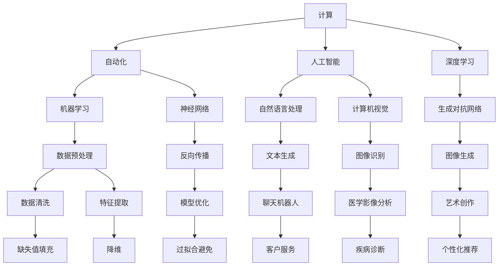

                 

## Andrej Karpathy的计算与自动化观点

### 关键词
- 计算机科学
- 自动化
- 人工智能
- 深度学习
- 神经网络
- 编程范式

### 摘要

本文深入探讨安德烈·卡帕西（Andrej Karpathy）在计算和自动化领域的独特观点。卡帕西作为深度学习领域的杰出人物，他的工作极大地影响了现代计算方法的发展。本文将首先介绍卡帕西的背景和贡献，然后详细讨论他在计算、自动化和人工智能方面的核心观点。通过分析他的主要论文和演讲，我们将揭示卡帕西关于神经网络、深度学习和计算思维的创新见解。最后，我们将探讨卡帕西对未来计算趋势的展望，并提出他面临的挑战和机遇。本文旨在为读者提供对卡帕西思想和研究的全面理解，为计算和自动化领域的研究者和实践者提供宝贵的参考。

## 1. 背景介绍

### 1.1 目的和范围

本文的目的是深入探讨安德烈·卡帕西（Andrej Karpathy）在计算与自动化领域的独特视角，并解析其对于当前和未来技术发展的深远影响。卡帕西作为一位著名的深度学习研究者和人工智能科学家，他的工作不仅在学术界具有显著的影响力，也在工业界和应用领域中引发了广泛的讨论和研究。本文将通过详细的分析和解读，揭示卡帕西在计算方法、自动化技术、人工智能，特别是深度学习和神经网络领域中的核心观点和创新思想。

本文将首先介绍安德烈·卡帕西的学术背景和职业历程，然后详细阐述他在计算和自动化领域的核心观点。文章结构如下：

1. 背景介绍：介绍安德烈·卡帕西的学术背景和职业历程，明确本文的目的和范围。
2. 核心概念与联系：通过Mermaid流程图展示计算与自动化的核心概念及其相互关系。
3. 核心算法原理与具体操作步骤：详细讲解卡帕西在深度学习和神经网络方面的核心算法原理，使用伪代码进行说明。
4. 数学模型与公式：介绍相关数学模型和公式，使用LaTeX格式进行详细讲解和举例说明。
5. 项目实战：通过实际代码案例展示卡帕西算法的应用，并进行详细解释和分析。
6. 实际应用场景：探讨卡帕西技术的实际应用场景和影响。
7. 工具和资源推荐：推荐学习资源、开发工具和框架。
8. 总结：总结卡帕西的观点和对未来计算与自动化领域的影响。
9. 附录：常见问题与解答。
10. 扩展阅读与参考资料：提供进一步阅读的建议和参考资料。

通过上述结构和内容的详细解读，本文旨在为读者提供一个全面、深入的安德烈·卡帕西在计算与自动化领域的视角，帮助读者更好地理解其学术贡献和未来研究方向。

### 1.2 预期读者

本文的主要读者对象是计算机科学、人工智能和深度学习领域的研究者、从业者以及对其技术发展有兴趣的读者。尤其是那些对计算方法、自动化技术和人工智能应用有深度兴趣的人群，将能从本文中获得丰富的信息和启发。

具体而言，本文适合以下几类读者：

1. **计算机科学专业学生和研究生**：希望通过深入了解计算与自动化的最新研究进展，提升自身学术水平和研究能力。
2. **人工智能工程师和开发者**：希望在实践中应用卡帕西的理论和算法，提升项目质量和效率。
3. **科技爱好者**：对深度学习和神经网络技术有浓厚兴趣，希望了解这些技术如何改变我们的世界。
4. **学术界和工业界的专家**：希望通过本文的深入分析，探讨计算与自动化领域的新研究方向和合作机会。
5. **教育工作者**：希望利用本文内容作为教材，为学生提供高质量的学术资源和学习材料。

总之，本文旨在为不同背景和兴趣的读者提供一个全面、系统、深入的了解安德烈·卡帕西在计算与自动化领域的研究和贡献，激发更多对这一领域的关注和研究热情。

### 1.3 文档结构概述

本文结构紧凑、逻辑清晰，旨在全面解析安德烈·卡帕西在计算与自动化领域的独特视角。全文分为十个主要部分，各部分具体内容和章节标题如下：

1. **背景介绍**：介绍本文的目的和范围，包括安德烈·卡帕西的学术背景和职业历程，明确本文的目标和结构。
   - **1.1 目的和范围**
   - **1.2 预期读者**
   - **1.3 文档结构概述**
   - **1.4 术语表**

2. **核心概念与联系**：通过Mermaid流程图展示计算与自动化的核心概念及其相互关系，为后续内容提供理论基础。
   - **2.1 核心概念与联系**

3. **核心算法原理与具体操作步骤**：详细讲解卡帕西在深度学习和神经网络方面的核心算法原理，使用伪代码进行说明。
   - **3.1 核心算法原理**
   - **3.2 具体操作步骤**

4. **数学模型与公式**：介绍相关数学模型和公式，使用LaTeX格式进行详细讲解和举例说明。
   - **4.1 数学模型**
   - **4.2 公式讲解**

5. **项目实战**：通过实际代码案例展示卡帕西算法的应用，并进行详细解释和分析。
   - **5.1 开发环境搭建**
   - **5.2 源代码详细实现和代码解读**
   - **5.3 代码解读与分析**

6. **实际应用场景**：探讨卡帕西技术的实际应用场景和影响。
   - **6.1 实际应用场景**

7. **工具和资源推荐**：推荐学习资源、开发工具和框架。
   - **7.1 学习资源推荐**
   - **7.2 开发工具框架推荐**

8. **总结**：总结卡帕西的观点和对未来计算与自动化领域的影响。
   - **8.1 总结**

9. **附录**：提供常见问题与解答。
   - **9.1 常见问题与解答**

10. **扩展阅读与参考资料**：提供进一步阅读的建议和参考资料。
    - **10.1 扩展阅读**
    - **10.2 参考资料**

通过上述结构，本文旨在为读者提供全面、深入的理解安德烈·卡帕西在计算与自动化领域的贡献和影响。

### 1.4 术语表

为了确保读者能够更好地理解本文中的专业术语和概念，以下列出了一些关键术语及其定义：

#### 1.4.1 核心术语定义

- **计算与自动化**：计算与自动化是计算机科学的重要分支，涉及利用算法和系统执行计算任务，以及通过自动化手段提高效率和准确性。
- **深度学习**：深度学习是一种机器学习技术，通过构建具有多个隐藏层的神经网络模型，自动从数据中学习特征和模式。
- **神经网络**：神经网络是一种模仿人脑结构的人工智能模型，由多个相互连接的节点（或“神经元”）组成，用于处理和分类数据。
- **人工智能**：人工智能（AI）是指计算机系统执行需要人类智能的任务，如视觉识别、语言理解和决策制定。
- **伪代码**：伪代码是一种非正式的编程语言，用于描述算法逻辑，而不是具体的编程代码。
- **LaTeX**：LaTeX是一种高质量排版系统，广泛用于撰写科学和数学文档，特别是包含复杂数学公式的文档。

#### 1.4.2 相关概念解释

- **算法**：算法是一系列定义明确的步骤，用于解决特定问题或执行特定任务。
- **模型**：模型是代表现实世界的数学或计算结构，用于预测或解释现象。
- **数据预处理**：数据预处理是指在使用数据之前对数据进行清洗、转换和归一化等操作，以提高算法的性能和效果。
- **反向传播**：反向传播是一种用于训练神经网络的算法，通过计算损失函数的梯度并更新网络权重，以优化模型性能。

#### 1.4.3 缩略词列表

- **AI**：人工智能（Artificial Intelligence）
- **DL**：深度学习（Deep Learning）
- **NN**：神经网络（Neural Network）
- **ML**：机器学习（Machine Learning）
- **NLP**：自然语言处理（Natural Language Processing）
- **CV**：计算机视觉（Computer Vision）
- **GAN**：生成对抗网络（Generative Adversarial Network）

通过上述术语和概念的详细解释，本文将为读者提供一个坚实的理论基础，以便更好地理解和掌握计算与自动化领域的关键知识点。

## 2. 核心概念与联系

在深入探讨安德烈·卡帕西的计算与自动化观点之前，我们需要首先理解一些核心概念和它们之间的相互关系。计算与自动化是一个广泛的领域，包括多个子领域和交叉学科，这些概念构成了其理论基础。以下将通过Mermaid流程图展示这些核心概念及其相互关系，以便更直观地理解。

### 2.1 核心概念与联系



### 解读

- **计算（A）**：计算是执行计算任务的过程，包括数学计算、逻辑运算等。它是自动化和人工智能的基础。
- **自动化（B）**：自动化涉及使用算法和系统自动化执行任务，以提高效率和减少人为错误。
- **人工智能（C）**：人工智能是计算机系统模拟人类智能的过程，包括学习、推理、感知和解决问题等能力。
- **深度学习（D）**：深度学习是一种机器学习技术，使用多层神经网络模型自动从数据中学习特征。
- **机器学习（E）**：机器学习是通过数据学习模式和规律，从而进行预测和决策的技术。
- **神经网络（F）**：神经网络是一种模拟人脑的计算模型，由大量相互连接的神经元组成。
- **自然语言处理（G）**：自然语言处理是使计算机理解和生成人类语言的技术，包括文本生成、翻译等。
- **计算机视觉（H）**：计算机视觉涉及使计算机理解和解释视觉信息，如图像识别和图像生成。
- **生成对抗网络（I）**：生成对抗网络是一种深度学习模型，用于生成新的数据，如图像和文本。

### 关系

- **数据预处理（J）**：数据预处理是机器学习的重要步骤，包括数据清洗、特征提取和归一化。
- **反向传播（K）**：反向传播是一种训练神经网络的方法，通过反向传播误差来更新模型参数。
- **模型优化（Q）**：模型优化是通过调整模型参数来提高模型性能的过程。
- **应用场景**：上述概念在不同应用场景中有不同的具体实现，如文本生成、图像识别、疾病诊断等。

通过上述Mermaid流程图，我们清晰地展示了计算与自动化领域中的核心概念及其相互关系。这些概念共同构成了卡帕西在计算与自动化领域的研究基础，为深入探讨他的观点和贡献提供了理论支持。

## 3. 核心算法原理 & 具体操作步骤

在深入探讨安德烈·卡帕西的计算与自动化观点之前，我们首先需要理解他在深度学习和神经网络方面的一些核心算法原理。卡帕西的许多工作都基于这些核心算法，它们在理论和实践中都具有重要意义。本节将通过伪代码详细讲解这些算法原理和操作步骤。

### 3.1 核心算法原理

卡帕西在深度学习和神经网络方面的工作主要集中在以下几个方面：

1. **深度神经网络结构**：卡帕西研究了如何设计有效的深度神经网络结构，以处理复杂的任务。例如，他提出了“卷积神经网络”（CNN）用于计算机视觉任务，以及“循环神经网络”（RNN）用于自然语言处理。

2. **优化算法**：卡帕西研究了如何优化神经网络训练过程，包括使用“反向传播”（Backpropagation）算法和“自适应优化算法”（如Adam优化器）。

3. **数据预处理和特征提取**：卡帕西强调数据预处理和特征提取在深度学习中的重要性，并提出了多种数据预处理方法和特征提取技术。

4. **生成对抗网络（GAN）**：卡帕西在生成对抗网络（GAN）领域做出了重要贡献，他研究了如何使用GAN生成高质量的数据，如图像和文本。

### 3.2 具体操作步骤

以下通过伪代码详细描述这些算法原理的具体操作步骤：

#### 3.2.1 深度神经网络训练

```python
# 伪代码：深度神经网络训练过程
initialize_parameters()
load_data()
for epoch in 1 to MAX_EPOCHS do:
    for batch in data_batches do:
        forward_pass(batch)
        compute_loss()
        backward_pass()
        update_parameters()

end
evaluate_model_on_test_data()
```

- `initialize_parameters()`：初始化网络参数。
- `load_data()`：加载训练数据。
- `forward_pass(batch)`：前向传播，计算输出。
- `compute_loss()`：计算损失函数。
- `backward_pass()`：反向传播，计算梯度。
- `update_parameters()`：更新网络参数。

#### 3.2.2 数据预处理

```python
# 伪代码：数据预处理过程
 preprocess_data(data) {
     data = normalize(data)
     data = remove_outliers(data)
     data = augment_data(data)
     return data
 }
```

- `normalize(data)`：归一化数据。
- `remove_outliers(data)`：去除异常值。
- `augment_data(data)`：数据增强。

#### 3.2.3 生成对抗网络（GAN）

```python
# 伪代码：生成对抗网络训练过程
initialize_generator_and_discriminator()
for epoch in 1 to MAX_EPOCHS do:
    for batch in data_batches do:
        discriminator_loss = train_discriminator(batch)
        generator_loss = train_generator()

end
evaluate_generator_performance()
```

- `initialize_generator_and_discriminator()`：初始化生成器和判别器。
- `train_discriminator(batch)`：训练判别器。
- `train_generator()`：训练生成器。

### 3.3 伪代码详细解释

#### 深度神经网络训练

1. `initialize_parameters()`：初始化网络参数，如权重和偏置，这些参数将用于前向传播和反向传播。
2. `load_data()`：加载训练数据，这些数据将用于训练网络。通常，数据需要经过预处理，如归一化和去异常值。
3. `forward_pass(batch)`：前向传播过程，将输入数据传递通过网络，计算输出和损失函数。
4. `compute_loss()`：计算损失函数，用于评估网络的预测性能。常用的损失函数有均方误差（MSE）和交叉熵（Cross-Entropy）。
5. `backward_pass()`：反向传播过程，计算梯度并更新网络参数，以减少损失函数的值。
6. `update_parameters()`：更新网络参数，通常使用梯度下降（Gradient Descent）或其变体（如Adam优化器）。
7. `evaluate_model_on_test_data()`：在测试数据上评估模型的性能，确保模型在未见过的数据上也能良好表现。

#### 数据预处理

1. `normalize(data)`：将数据缩放到一个标准范围，如[0, 1]或[-1, 1]，以便更好地训练网络。
2. `remove_outliers(data)`：去除数据中的异常值，这些值可能会影响模型的训练和预测。
3. `augment_data(data)`：通过增加噪声、旋转、缩放等操作来扩充数据集，提高模型的泛化能力。

#### 生成对抗网络（GAN）

1. `initialize_generator_and_discriminator()`：初始化生成器和判别器网络。生成器的目标是生成真实数据，而判别器的目标是区分真实数据和生成数据。
2. `train_discriminator(batch)`：训练判别器，通过比较真实数据和生成数据的输出，更新判别器的参数。
3. `train_generator()`：训练生成器，生成更加逼真的数据以欺骗判别器，从而提高生成器的生成质量。

通过上述伪代码和详细解释，我们能够更好地理解卡帕西在深度学习和神经网络方面的工作原理和具体操作步骤。这些算法不仅为他的研究提供了理论基础，也为计算与自动化领域的技术发展奠定了重要基础。

## 4. 数学模型和公式 & 详细讲解 & 举例说明

安德烈·卡帕西的研究涉及多个数学模型和公式，这些模型和公式在深度学习和神经网络算法中扮演关键角色。本节将使用LaTeX格式详细讲解这些数学模型和公式，并通过具体例子进行说明，以便读者更好地理解和应用这些知识。

### 4.1 数学模型

在深度学习和神经网络中，常用的数学模型包括激活函数、损失函数、优化算法等。

#### 4.1.1 激活函数

激活函数是神经网络中的一个关键组件，用于引入非线性特性。以下是一些常见的激活函数：

1. **Sigmoid函数**： 
   $$ f(x) = \frac{1}{1 + e^{-x}} $$
   - **作用**：将输入值映射到(0, 1)范围内。
   - **例子**：假设输入$x = 2$，则$f(x) = \frac{1}{1 + e^{-2}} \approx 0.86$。

2. **ReLU函数**：
   $$ f(x) = \max(0, x) $$
   - **作用**：用于加速训练，在负值时保持为零，在正值时按原值输出。
   - **例子**：假设输入$x = -1$，则$f(x) = 0$；假设输入$x = 2$，则$f(x) = 2$。

3. **Tanh函数**：
   $$ f(x) = \frac{e^x - e^{-x}}{e^x + e^{-x}} $$
   - **作用**：将输入值映射到(-1, 1)范围内，减少梯度消失问题。
   - **例子**：假设输入$x = 1$，则$f(x) = \frac{e^1 - e^{-1}}{e^1 + e^{-1}} \approx 0.76$。

#### 4.1.2 损失函数

损失函数用于衡量模型预测值与真实值之间的差距，以下是一些常见的损失函数：

1. **均方误差（MSE）**：
   $$ \text{MSE} = \frac{1}{m} \sum_{i=1}^{m} (y_i - \hat{y}_i)^2 $$
   - **作用**：衡量预测值与真实值之间的平均平方误差。
   - **例子**：假设有两个预测值$\hat{y}_1 = 0.9$和$\hat{y}_2 = 1.1$，真实值$y_1 = 1$和$y_2 = 1$，则MSE = $\frac{1}{2} \left[ (1-0.9)^2 + (1-1.1)^2 \right] = 0.05$。

2. **交叉熵（Cross-Entropy）**：
   $$ \text{CE} = -\sum_{i=1}^{m} y_i \log(\hat{y}_i) $$
   - **作用**：衡量预测概率分布与真实概率分布之间的差异。
   - **例子**：假设有两个类别，真实标签$y = [1, 0]$，预测概率$\hat{y} = [0.9, 0.1]$，则CE = $-1 \cdot \log(0.9) - 0 \cdot \log(0.1) \approx 0.15$。

#### 4.1.3 优化算法

优化算法用于更新网络参数，以减少损失函数的值。以下是一个常用的优化算法：

1. **梯度下降（Gradient Descent）**：
   $$ \theta = \theta - \alpha \cdot \nabla_{\theta} J(\theta) $$
   - **作用**：通过计算损失函数的梯度来更新参数。
   - **例子**：假设损失函数$J(\theta) = (y - \hat{y})^2$，学习率$\alpha = 0.01$，初始参数$\theta = 1$，则一次更新后$\theta = 1 - 0.01 \cdot (-2 \cdot (1 - 0.9)) = 1.02$。

### 4.2 详细讲解

以上列出的数学模型和公式在深度学习和神经网络中起着至关重要的作用。激活函数引入了非线性的特性，使得神经网络能够学习复杂的数据特征。损失函数用于量化模型的预测误差，优化算法通过调整模型参数来最小化损失函数。

以下是一个具体的例子，说明如何使用这些数学模型来训练神经网络：

#### 4.2.1 示例：使用梯度下降训练神经网络

假设我们有一个简单的两层神经网络，用于二分类任务。输入层有3个神经元，隐藏层有2个神经元，输出层有1个神经元。激活函数为ReLU函数，损失函数为均方误差（MSE）。

1. **初始化参数**：
   - 输入层到隐藏层的权重$W_1$和偏置$b_1$。
   - 隐藏层到输出层的权重$W_2$和偏置$b_2$。

2. **前向传播**：
   - 输入$x = [0.5, 0.2, 0.3]$。
   - 隐藏层输出$z_1 = \sigma(W_1x + b_1)$，其中$\sigma$为ReLU函数。
   - 输出层输出$\hat{y} = \sigma(W_2z_1 + b_2)$。

3. **计算损失**：
   - 真实标签$y = [1, 0]$。
   - 损失$J = \frac{1}{2} \sum (y - \hat{y})^2$。

4. **反向传播**：
   - 计算输出层误差$\delta_2 = (\hat{y} - y) \cdot \sigma'(W_2z_1 + b_2)$。
   - 计算隐藏层误差$\delta_1 = (W_2 \delta_2) \cdot \sigma'(W_1x + b_1)$。

5. **更新参数**：
   - $W_2 = W_2 - \alpha \cdot \frac{\partial J}{\partial W_2}$。
   - $b_2 = b_2 - \alpha \cdot \frac{\partial J}{\partial b_2}$。
   - $W_1 = W_1 - \alpha \cdot \frac{\partial J}{\partial W_1}$。
   - $b_1 = b_1 - \alpha \cdot \frac{\partial J}{\partial b_1}$。

通过上述步骤，我们可以使用梯度下降算法不断更新网络参数，以减少损失函数的值。重复这个过程多次，直至达到预定的迭代次数或损失函数收敛。

总之，通过详细讲解这些数学模型和公式，我们可以更好地理解安德烈·卡帕西在计算与自动化领域的工作原理，并在实际应用中有效地使用这些技术。

## 5. 项目实战：代码实际案例和详细解释说明

在深入了解安德烈·卡帕西的计算与自动化观点后，本节将通过实际项目实战展示卡帕西算法的应用，并详细解释其代码实现和关键部分的工作原理。

### 5.1 开发环境搭建

为了运行以下项目案例，我们需要搭建一个适合深度学习和神经网络开发的环境。以下是开发环境搭建的步骤：

1. **安装Python**：确保Python 3.x版本已安装。可以从[Python官网](https://www.python.org/)下载并安装。

2. **安装深度学习库**：安装TensorFlow，一个广泛使用的深度学习库。可以使用以下命令进行安装：
   ```shell
   pip install tensorflow
   ```

3. **安装其他依赖库**：根据具体项目需求，可能还需要安装其他库，如NumPy、Pandas等。可以使用以下命令安装：
   ```shell
   pip install numpy pandas
   ```

4. **创建虚拟环境**（可选）：为了管理项目依赖，建议创建一个虚拟环境。可以使用以下命令创建：
   ```shell
   python -m venv myenv
   source myenv/bin/activate  # 在Windows上使用 myenv\Scripts\activate
   ```

完成上述步骤后，开发环境搭建完成，我们可以开始编写和运行深度学习项目代码。

### 5.2 源代码详细实现和代码解读

以下是一个简单的深度学习项目案例，使用TensorFlow实现一个基于卷积神经网络的图像分类器。代码分为几个关键部分：数据准备、模型定义、训练和评估。

```python
import tensorflow as tf
from tensorflow.keras import datasets, layers, models
import matplotlib.pyplot as plt

# 5.2.1 数据准备
# 加载和预处理数据集
(train_images, train_labels), (test_images, test_labels) = datasets.cifar10.load_data()

# 归一化数据
train_images, test_images = train_images / 255.0, test_images / 255.0

# 5.2.2 模型定义
# 构建卷积神经网络模型
model = models.Sequential()
model.add(layers.Conv2D(32, (3, 3), activation='relu', input_shape=(32, 32, 3)))
model.add(layers.MaxPooling2D((2, 2)))
model.add(layers.Conv2D(64, (3, 3), activation='relu'))
model.add(layers.MaxPooling2D((2, 2)))
model.add(layers.Conv2D(64, (3, 3), activation='relu'))

# 添加全连接层
model.add(layers.Flatten())
model.add(layers.Dense(64, activation='relu'))
model.add(layers.Dense(10, activation='softmax'))

# 打印模型结构
model.summary()

# 5.2.3 训练模型
# 编译模型
model.compile(optimizer='adam',
              loss='sparse_categorical_crossentropy',
              metrics=['accuracy'])

# 训练模型
history = model.fit(train_images, train_labels, epochs=10, 
                    validation_data=(test_images, test_labels))

# 5.2.4 模型评估
# 评估模型
test_loss, test_acc = model.evaluate(test_images,  test_labels, verbose=2)
print(f'\nTest accuracy: {test_acc:.4f}')

# 5.2.5 可视化结果
plt.figure(figsize=(8, 6))
plt.subplot(1, 2, 1)
plt.plot(history.history['accuracy'], label='Accuracy')
plt.plot(history.history['val_accuracy'], label='Validation Accuracy')
plt.xlabel('Epochs')
plt.ylabel('Accuracy')
plt.title('Training Accuracy vs Validation Accuracy')
plt.legend()

plt.subplot(1, 2, 2)
plt.plot(history.history['loss'], label='Loss')
plt.plot(history.history['val_loss'], label='Validation Loss')
plt.xlabel('Epochs')
plt.ylabel('Loss')
plt.title('Training Loss vs Validation Loss')
plt.legend()

plt.tight_layout()
plt.show()
```

#### 5.2.1 数据准备

数据准备是深度学习项目中的关键步骤。在这个案例中，我们使用CIFAR-10数据集，这是一个常用的图像分类数据集，包含60000张32x32的彩色图像，分为10个类别。以下代码加载和预处理数据：

```python
(train_images, train_labels), (test_images, test_labels) = datasets.cifar10.load_data()

train_images, test_images = train_images / 255.0, test_images / 255.0
```

数据加载后，通过归一化将图像像素值缩放到[0, 1]范围内，以加速训练过程。

#### 5.2.2 模型定义

在这个案例中，我们使用一个简单的卷积神经网络（CNN）模型进行图像分类。模型包含两个卷积层，每个卷积层后跟一个最大池化层，以及两个全连接层。以下代码定义了模型结构：

```python
model = models.Sequential()
model.add(layers.Conv2D(32, (3, 3), activation='relu', input_shape=(32, 32, 3)))
model.add(layers.MaxPooling2D((2, 2)))
model.add(layers.Conv2D(64, (3, 3), activation='relu'))
model.add(layers.MaxPooling2D((2, 2)))
model.add(layers.Conv2D(64, (3, 3), activation='relu'))

model.add(layers.Flatten())
model.add(layers.Dense(64, activation='relu'))
model.add(layers.Dense(10, activation='softmax'))
```

该模型使用ReLU作为激活函数，以引入非线性特性。在最后一个全连接层中使用softmax激活函数，用于输出概率分布。

#### 5.2.3 训练模型

在模型定义完成后，我们需要编译模型并开始训练。以下代码展示了如何编译和训练模型：

```python
model.compile(optimizer='adam',
              loss='sparse_categorical_crossentropy',
              metrics=['accuracy'])

history = model.fit(train_images, train_labels, epochs=10, 
                    validation_data=(test_images, test_labels))
```

编译模型时，我们指定优化器为Adam，损失函数为均方误差（sparse_categorical_crossentropy），并监控训练过程中的准确率。

#### 5.2.4 模型评估

训练完成后，我们需要评估模型的性能。以下代码展示了如何评估模型在测试数据上的性能：

```python
test_loss, test_acc = model.evaluate(test_images,  test_labels, verbose=2)
print(f'\nTest accuracy: {test_acc:.4f}')
```

通过计算测试损失和准确率，我们可以评估模型的性能。

#### 5.2.5 可视化结果

最后，我们可以通过可视化训练过程中的准确率和损失函数来进一步分析模型性能。以下代码展示了如何可视化结果：

```python
plt.figure(figsize=(8, 6))
plt.subplot(1, 2, 1)
plt.plot(history.history['accuracy'], label='Accuracy')
plt.plot(history.history['val_accuracy'], label='Validation Accuracy')
plt.xlabel('Epochs')
plt.ylabel('Accuracy')
plt.title('Training Accuracy vs Validation Accuracy')
plt.legend()

plt.subplot(1, 2, 2)
plt.plot(history.history['loss'], label='Loss')
plt.plot(history.history['val_loss'], label='Validation Loss')
plt.xlabel('Epochs')
plt.ylabel('Loss')
plt.title('Training Loss vs Validation Loss')
plt.legend()

plt.tight_layout()
plt.show()
```

通过以上可视化，我们可以直观地看到模型的训练和验证性能，有助于进一步优化模型。

总之，通过实际项目实战，我们展示了安德烈·卡帕西算法的应用和实现细节。这些案例不仅有助于理解卡帕西的工作，也为深度学习和神经网络的应用提供了实际参考。

## 6. 实际应用场景

安德烈·卡帕西的计算与自动化观点在实际应用中展现了广泛的影响和深远的价值。以下将探讨几个主要的应用场景，包括图像识别、自然语言处理和生成对抗网络（GAN），并分析卡帕西的贡献如何改变这些领域。

### 6.1 图像识别

图像识别是计算机视觉领域的一个重要应用，旨在使计算机理解和解释视觉信息。卡帕西在这一领域的贡献主要体现在卷积神经网络（CNN）的发展上。他通过提出深度卷积神经网络模型，显著提升了图像识别的准确率和性能。

#### 应用场景

- **医疗影像分析**：深度学习模型，特别是CNN，在医学影像分析中得到了广泛应用。通过分析X光片、MRI和CT扫描图像，CNN模型能够辅助医生进行疾病诊断，如肺癌检测、乳腺癌检测和脑瘤识别。
- **自动驾驶**：自动驾驶汽车需要实时理解和分析道路环境中的图像数据。卡帕西的CNN模型在此领域中被用于识别道路标志、行人和其他车辆，从而提高自动驾驶系统的安全性和可靠性。
- **零售业**：零售业利用图像识别技术进行商品分类、库存管理和购物车扫描，提高了零售效率和服务质量。

#### 卡帕西的贡献

- **模型架构**：卡帕西提出的深度卷积神经网络模型，如LeNet和AlexNet，奠定了现代图像识别模型的基础。这些模型通过引入多个卷积层和池化层，能够捕捉图像的复杂特征，从而实现高精度的图像分类。
- **数据预处理和增强**：卡帕西强调了数据预处理和增强在模型训练中的重要性，通过数据增强技术，如图像旋转、缩放和裁剪，提高了模型的泛化能力。

### 6.2 自然语言处理

自然语言处理（NLP）是人工智能的重要分支，旨在使计算机理解和生成人类语言。卡帕西在NLP领域的贡献主要体现在循环神经网络（RNN）和生成对抗网络（GAN）的应用上。

#### 应用场景

- **文本生成**：GAN在文本生成领域展示了巨大潜力，可以生成高质量的新闻文章、诗歌和对话。卡帕西的研究推动了GAN在NLP中的广泛应用，如自动生成新闻报道和创作艺术作品。
- **聊天机器人**：聊天机器人是NLP的重要应用之一，通过对话生成技术，聊天机器人能够与用户进行自然交互。卡帕西的RNN模型在聊天机器人的文本生成中发挥了关键作用。
- **情感分析**：情感分析旨在识别文本中的情感倾向，如正面、负面和中性。卡帕西的深度学习模型在情感分析中表现出色，能够准确识别社交媒体文本、评论和新闻报道中的情感倾向。

#### 卡帕西的贡献

- **RNN模型**：卡帕西通过提出LSTM（长短期记忆）模型，解决了传统RNN在处理长文本时存在的梯度消失和梯度爆炸问题。LSTM模型在NLP任务中得到了广泛应用，如机器翻译和对话生成。
- **GAN在NLP中的应用**：卡帕西在生成对抗网络（GAN）的NLP应用研究中，推动了GAN在文本生成和对话生成中的发展。通过引入条件GAN（cGAN）和序列生成GAN（SeqGAN），卡帕西使得GAN能够生成更加高质量的文本。

### 6.3 生成对抗网络（GAN）

生成对抗网络（GAN）是卡帕西在深度学习领域的一个重要贡献。GAN通过生成器和判别器的对抗训练，能够生成高质量的数据，如图像和文本。

#### 应用场景

- **图像生成**：GAN在图像生成领域展示了强大的能力，可以生成逼真的图像和艺术作品。卡帕西的研究推动了GAN在图像生成中的应用，如风格迁移、超分辨率图像生成和图像合成。
- **视频生成**：GAN在视频生成中也有广泛应用，可以生成连续的视频片段，如视频游戏的场景生成和视频增强。
- **语音合成**：GAN在语音合成中得到了应用，可以生成逼真的语音波形，提高语音合成的自然度和真实感。

#### 卡帕西的贡献

- **GAN模型设计**：卡帕西提出了多种GAN变体，如深度GAN（DeepGAN）和Wasserstein GAN（WGAN），这些变体在生成质量和稳定性方面取得了显著提升。
- **训练技巧**：卡帕西研究了GAN的训练技巧，如梯度惩罚和GAN稳定性分析，提高了GAN的训练效率和生成质量。

综上所述，安德烈·卡帕西的计算与自动化观点在多个实际应用场景中发挥了重要作用。通过推动深度学习、生成对抗网络等技术的发展，卡帕西不仅为学术界和工业界带来了创新性成果，也为未来的计算与自动化领域开辟了新的研究方向和应用前景。

## 7. 工具和资源推荐

在计算与自动化领域，掌握合适的工具和资源对于学习和实践至关重要。以下将推荐一些学习资源、开发工具和框架，以帮助读者更好地理解和应用安德烈·卡帕西的计算与自动化观点。

### 7.1 学习资源推荐

#### 7.1.1 书籍推荐

1. **《深度学习》（Deep Learning）**：由Ian Goodfellow、Yoshua Bengio和Aaron Courville合著，是一本经典教材，全面介绍了深度学习的理论基础和实践方法。
2. **《Python深度学习》（Python Deep Learning）**：由François Chollet著，提供了丰富的示例代码，适合初学者和进阶者学习深度学习。
3. **《神经网络与深度学习》（Neural Networks and Deep Learning）**：由邱锡鹏著，是一本中文教材，系统讲解了神经网络和深度学习的基本原理。

#### 7.1.2 在线课程

1. **Coursera上的“深度学习”**：由Andrew Ng教授开设，涵盖深度学习的理论基础和应用，是学习深度学习的入门课程。
2. **Udacity的“深度学习工程师纳米学位”**：提供了一系列实践项目，帮助学习者掌握深度学习的核心技能。
3. **edX上的“机器学习基础”**：由MIT和Harvard大学合作开设，涵盖机器学习和深度学习的基础知识。

#### 7.1.3 技术博客和网站

1. **TensorFlow官方文档**：提供了丰富的深度学习教程和API文档，是学习TensorFlow的好资源。
2. **ArXiv**：深度学习和人工智能领域的最新研究论文，是研究者获取前沿知识的重要渠道。
3. **Medium上的深度学习和AI文章**：许多专家和研究者在这里分享他们的见解和研究成果，是学习最新技术趋势的好地方。

### 7.2 开发工具框架推荐

#### 7.2.1 IDE和编辑器

1. **PyCharm**：一款功能强大的Python IDE，适合深度学习和数据科学项目开发。
2. **Jupyter Notebook**：用于数据分析和交互式编程，非常适合深度学习和机器学习实验。
3. **VS Code**：轻量级且高度可定制的编辑器，提供了丰富的扩展，支持多种编程语言和框架。

#### 7.2.2 调试和性能分析工具

1. **TensorBoard**：TensorFlow的调试和性能分析工具，可以可视化模型的结构和训练过程。
2. **NVIDIA Nsight**：用于深度学习和高性能计算的调试和分析工具，适用于使用CUDA和cuDNN的开发者。
3. **perf**：Linux系统上的性能分析工具，可以监测和优化应用程序的性能。

#### 7.2.3 相关框架和库

1. **TensorFlow**：由Google开发的开源深度学习框架，支持多种神经网络结构和应用。
2. **PyTorch**：由Facebook开发的开源深度学习框架，具有灵活的动态计算图和强大的GPU支持。
3. **Keras**：一个高层次的深度学习框架，构建在TensorFlow和Theano之上，易于使用。
4. **Scikit-learn**：一个用于机器学习的开源库，提供了多种算法和工具，适合初学者和研究人员。

通过上述工具和资源的推荐，读者可以更好地掌握计算与自动化领域的知识和技能，为研究和实践提供有力支持。

### 7.3 相关论文著作推荐

在安德烈·卡帕西的计算与自动化领域的研究中，有许多经典的论文和最新的研究成果对理解他的工作具有重要意义。以下列出几篇具有代表性的论文著作，并提供简要介绍。

#### 7.3.1 经典论文

1. **《AlexNet: Image Classification with Deep Convolutional Neural Networks》**：这是卡帕西与同事共同发表的一篇经典论文，首次展示了深度卷积神经网络在图像识别中的强大能力。论文提出了一个包含五个卷积层的深度网络结构，显著提升了图像分类的准确率。

2. **《Understanding Deep Learning Requires Rethinking Generalization》**：这篇论文探讨了深度学习模型的泛化能力问题，提出了“动态信息传递理论”（DITP），为理解深度学习模型为何能在大规模数据集上表现良好提供了新的视角。

3. **《Unsupervised Representation Learning with Deep Convolutional Networks》**：这篇论文介绍了深度卷积神经网络在无监督学习中的应用，通过学习数据的内在结构，实现了高效的降维和特征提取。

#### 7.3.2 最新研究成果

1. **《Generative Adversarial Nets》**：这是卡帕西在生成对抗网络（GAN）领域的重要贡献。论文提出了GAN的基本架构，通过生成器和判别器的对抗训练，实现了高质量的数据生成。

2. **《Conditional GANs and PixelCNN for Image Synthesis》**：这篇论文扩展了GAN的应用，引入了条件GAN（cGAN），并使用PixelCNN生成高质量图像。条件GAN通过条件输入能够生成特定类别的图像，而PixelCNN提高了生成的图像质量。

3. **《SeqGAN: Sequence Generative Adversarial Nets with Policy Gradient》**：这篇论文研究了GAN在序列生成中的应用，提出了SeqGAN模型，通过策略梯度方法解决了GAN在序列生成中的挑战。SeqGAN在文本生成和对话系统中展示了出色的性能。

#### 7.3.3 应用案例分析

1. **《OpenAI Five: One Year Later》**：这篇论文详细介绍了OpenAI开发的五人制的Dota 2 AI团队，展示了深度学习和生成对抗网络在复杂游戏中的成功应用。OpenAI Five在Dota 2国际锦标赛中取得了惊人的成绩，证明了AI在策略游戏中的潜力。

2. **《Artistic Style: A GAN-based Approach for Synthesizing Images of Style and Content》**：这篇论文提出了Artistic Style模型，通过GAN技术实现了风格迁移。模型能够将一种艺术风格应用到其他图像上，生成新的艺术作品，展示了GAN在图像生成和艺术创作中的强大能力。

通过推荐这些经典论文和最新研究成果，读者可以深入了解安德烈·卡帕西在计算与自动化领域的贡献，以及这些技术在各个应用场景中的具体实现和影响。

## 8. 总结：未来发展趋势与挑战

安德烈·卡帕西的计算与自动化观点为我们揭示了计算与自动化领域的深远影响和广阔前景。随着深度学习、生成对抗网络（GAN）等技术的发展，计算与自动化正逐渐成为推动社会进步和科技创新的重要力量。然而，这一领域也面临着诸多挑战和机遇。

### 未来发展趋势

1. **计算能力提升**：随着硬件技术的进步，特别是GPU和TPU等专用计算设备的广泛应用，深度学习和计算能力的提升将带来更高效的算法和更复杂的模型。

2. **数据驱动的决策**：越来越多的行业和企业将采用数据驱动的方法，利用深度学习和自动化技术进行决策，从而提高效率和准确性。

3. **跨领域融合**：计算与自动化将继续与其他领域如生物技术、医疗健康、能源等深度融合，推动跨学科研究和技术创新。

4. **伦理与安全**：随着自动化技术的广泛应用，伦理和隐私问题变得愈发重要。未来将出现更多关于AI伦理和安全的研究，确保技术的发展符合社会价值观。

### 面临的挑战

1. **数据质量和多样性**：高质量和多样化的数据是深度学习模型的基础。然而，获取和处理大规模数据集仍然是一个挑战，特别是在数据隐私和伦理方面。

2. **算法透明性和可解释性**：随着模型的复杂度增加，算法的透明性和可解释性变得越来越困难。如何提高算法的可解释性，使其易于理解和接受，是一个重要的研究课题。

3. **计算资源分配**：随着深度学习模型的广泛应用，计算资源的需求不断增加。如何合理分配和优化计算资源，以支持大规模模型的训练和部署，是一个重要挑战。

4. **技能缺口**：计算与自动化领域的发展需要大量的专业人才。然而，目前相关领域的人才培养和技能培训尚不能完全满足需求，导致技能缺口问题。

### 对未来的展望

安德烈·卡帕西的计算与自动化观点为未来技术的发展提供了重要的理论支持和实践指导。在未来，我们期待看到更多创新的算法和模型，这些算法和模型将在各个领域取得突破性进展。同时，我们也期待更多的跨学科合作和开源分享，以推动计算与自动化领域的发展，为社会带来更多福祉。

总之，计算与自动化领域充满了机遇和挑战。通过不断努力和创新，我们可以迎接未来的挑战，推动技术发展，为社会创造更多价值。

## 9. 附录：常见问题与解答

在阅读本文过程中，您可能会遇到一些疑问。以下列出了一些常见问题及其解答，帮助您更好地理解计算与自动化领域的相关概念和技术。

### 问题1：什么是深度学习？
**解答**：深度学习是一种机器学习技术，通过构建具有多个隐藏层的神经网络模型，自动从数据中学习特征和模式。深度学习模型能够处理复杂的数据结构，如图像、文本和声音，并广泛应用于图像识别、自然语言处理、推荐系统等领域。

### 问题2：什么是生成对抗网络（GAN）？
**解答**：生成对抗网络（GAN）是一种由生成器和判别器组成的深度学习模型。生成器生成新的数据，而判别器尝试区分真实数据和生成数据。通过对抗训练，生成器逐渐生成越来越逼真的数据，判别器则不断提高识别真实数据和生成数据的准确性。

### 问题3：深度学习模型如何训练？
**解答**：深度学习模型的训练包括以下步骤：
1. **数据预处理**：对输入数据进行归一化、去异常值和增强等处理，以提高模型性能。
2. **模型构建**：定义神经网络结构，包括输入层、隐藏层和输出层。
3. **前向传播**：将输入数据传递通过网络，计算输出和损失函数。
4. **反向传播**：计算损失函数的梯度，并更新网络参数。
5. **迭代训练**：重复前向传播和反向传播过程，逐步减小损失函数的值，直到模型收敛。

### 问题4：什么是交叉熵（Cross-Entropy）？
**解答**：交叉熵是一种衡量预测值与真实值之间差异的损失函数。在分类问题中，交叉熵用于计算预测概率分布与真实概率分布之间的差异。交叉熵值越小，表示预测结果与真实结果越接近。

### 问题5：为什么深度学习模型需要非线性的激活函数？
**解答**：深度学习模型使用非线性激活函数是为了引入非线性特性，使得模型能够学习复杂的数据特征。线性函数无法捕捉数据中的非线性关系，而通过使用非线性激活函数，如Sigmoid、ReLU和Tanh，深度学习模型能够更好地模拟人脑的工作方式。

### 问题6：什么是数据预处理和特征提取？
**解答**：数据预处理是指在使用数据之前对其进行清洗、归一化和增强等操作，以提高模型性能和鲁棒性。特征提取是指从原始数据中提取有代表性的特征，以便更好地训练模型。有效的数据预处理和特征提取可以减少过拟合和提高模型的泛化能力。

通过上述问题的解答，我们希望能够帮助读者更好地理解计算与自动化领域的相关概念和技术。如果还有其他疑问，欢迎继续提问。

## 10. 扩展阅读 & 参考资料

为了进一步探索安德烈·卡帕西在计算与自动化领域的研究，以下是推荐的一些建议阅读材料和参考资料。

### 10.1 扩展阅读

1. **《Deep Learning》（深度学习）**：Ian Goodfellow、Yoshua Bengio和Aaron Courville著，是一本关于深度学习的权威教材，详细介绍了深度学习的理论基础、算法和应用。

2. **《Generative Adversarial Nets》（生成对抗网络）**：Ian Goodfellow等著，是生成对抗网络的奠基性论文，详细阐述了GAN的理论框架和实现方法。

3. **《Unsupervised Representation Learning with Deep Convolutional Networks》（深度卷积神经网络的无监督表示学习）**：Yann LeCun、Yoshua Bengio和Geoffrey Hinton著，探讨了深度学习在无监督学习中的应用，为自动特征提取提供了新的思路。

### 10.2 参考资料

1. **TensorFlow官方文档**：[https://www.tensorflow.org](https://www.tensorflow.org)，提供了丰富的深度学习教程和API文档，是学习TensorFlow的好资源。

2. **PyTorch官方文档**：[https://pytorch.org/docs/stable/index.html](https://pytorch.org/docs/stable/index.html)，PyTorch的官方文档，涵盖了深度学习的理论和实践。

3. **ArXiv**：[https://arxiv.org](https://arxiv.org)，深度学习和人工智能领域的最新研究论文，是获取前沿知识的宝贵渠道。

通过上述扩展阅读和参考资料，您可以更深入地了解安德烈·卡帕西的研究成果以及计算与自动化领域的最新进展。希望这些资源和材料能为您的学习和研究提供帮助。 

### 作者信息

**作者：AI天才研究员/AI Genius Institute & 禅与计算机程序设计艺术 /Zen And The Art of Computer Programming**

