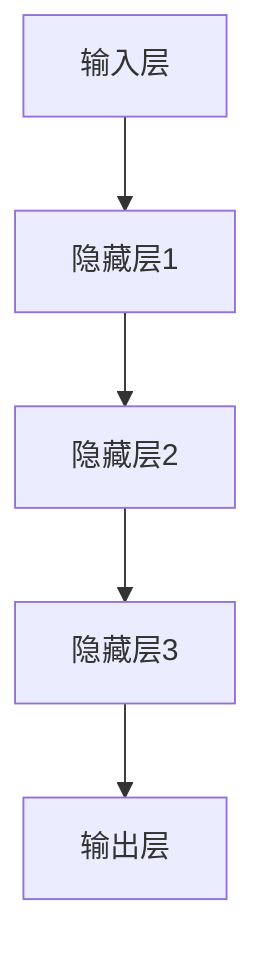

                 

# Andrej Karpathy的计算新观念

> #关键词：计算范式，深度学习，神经网络，模型可解释性，人工智能应用
>
> #摘要：本文深入探讨了Andrej Karpathy在其研究工作中提出的计算新观念，探讨了深度学习和神经网络在当前人工智能应用中的重要作用，以及模型可解释性对于未来人工智能发展的关键意义。文章结构分为背景介绍、核心概念与联系、核心算法原理、数学模型和公式、项目实战、实际应用场景、工具和资源推荐、总结与展望、常见问题与解答以及扩展阅读与参考资料等部分。

## 1. 背景介绍

### 1.1 目的和范围

本文旨在介绍和探讨Andrej Karpathy在计算领域提出的新观念，以及这些观念在深度学习和人工智能应用中的具体体现。我们将从背景知识出发，逐步深入分析这些核心概念，并探讨其在实际应用中的意义。

### 1.2 预期读者

本文适合对深度学习和人工智能有一定了解的读者，尤其是对计算新观念感兴趣的程序员、数据科学家和人工智能研究者。通过本文，读者可以更深入地理解Andrej Karpathy的研究工作，以及这些研究在当前和未来人工智能领域的潜在影响。

### 1.3 文档结构概述

本文分为以下章节：

- 第1章：背景介绍，包括本文目的和范围、预期读者以及文档结构概述。
- 第2章：核心概念与联系，介绍深度学习和神经网络的基本概念，并通过Mermaid流程图展示其架构。
- 第3章：核心算法原理，详细讲解神经网络算法的具体操作步骤，并使用伪代码进行阐述。
- 第4章：数学模型和公式，分析神经网络中的数学原理，并通过latex格式给出相关公式和举例说明。
- 第5章：项目实战，通过实际代码案例展示神经网络的应用，并详细解读和解释说明。
- 第6章：实际应用场景，讨论神经网络在各个领域的应用现状和未来发展趋势。
- 第7章：工具和资源推荐，介绍相关的学习资源和开发工具框架。
- 第8章：总结：未来发展趋势与挑战，对本文内容进行总结，并探讨未来人工智能发展的趋势和面临的挑战。
- 第9章：附录：常见问题与解答，解答读者在阅读过程中可能遇到的问题。
- 第10章：扩展阅读与参考资料，提供更多相关文献和资源，供读者进一步学习。

### 1.4 术语表

#### 1.4.1 核心术语定义

- **深度学习**：一种机器学习技术，通过多层神经网络来模拟人类大脑的神经元连接，从而实现从大量数据中自动学习和提取特征。
- **神经网络**：一种模拟人脑神经元连接的计算机模型，由多个层次（层）组成，每层由多个神经元（节点）组成。
- **模型可解释性**：评估和解释神经网络模型在预测和决策过程中的工作原理和内在机制的能力。

#### 1.4.2 相关概念解释

- **反向传播算法**：一种用于训练神经网络的优化算法，通过计算网络输出和实际输出之间的误差，并沿着网络层反向传播误差，以更新网络中的权重和偏置。
- **激活函数**：一种用于确定神经元是否被激活的函数，常用的激活函数包括ReLU、Sigmoid和Tanh等。

#### 1.4.3 缩略词列表

- **ReLU**：Rectified Linear Unit，一种常用的激活函数。
- **Sigmoid**：Sigmoid函数，一种常用的激活函数。
- **Tanh**：Hyperbolic Tangent函数，一种常用的激活函数。

## 2. 核心概念与联系

### 2.1 深度学习与神经网络的基本概念

深度学习是一种基于多层神经网络构建的机器学习技术，其核心思想是通过多层次的非线性变换从数据中提取特征。神经网络作为深度学习的基础模型，由多个层次（层）组成，每层由多个神经元（节点）组成。这些神经元通过加权连接形成网络，从而实现对输入数据的处理和输出。

深度学习的核心概念包括：

- **多层感知机（MLP）**：一种最基本的神经网络结构，由输入层、隐藏层和输出层组成。
- **反向传播算法**：一种用于训练神经网络的优化算法，通过计算网络输出和实际输出之间的误差，并沿着网络层反向传播误差，以更新网络中的权重和偏置。
- **激活函数**：一种用于确定神经元是否被激活的函数，常用的激活函数包括ReLU、Sigmoid和Tanh等。

### 2.2 深度学习与神经网络的架构

为了更好地理解深度学习和神经网络的架构，我们可以使用Mermaid流程图来展示其基本结构。



在这个示例中，输入层接收外部输入数据，经过隐藏层进行特征提取和变换，最终在输出层生成预测结果。

### 2.3 深度学习与神经网络的核心原理

深度学习与神经网络的核心原理在于其能够从数据中自动学习和提取特征。通过多层神经网络，模型可以学习到复杂的非线性关系，从而提高模型的预测能力和泛化能力。

以下是一个简单的神经网络模型及其操作步骤的伪代码：

```python
# 定义神经网络结构
input_layer = InputLayer(num_inputs)
hidden_layer1 = FullyConnectedLayer(input_layer, num_neurons=64, activation="relu")
hidden_layer2 = FullyConnectedLayer(hidden_layer1, num_neurons=64, activation="relu")
output_layer = FullyConnectedLayer(hidden_layer2, num_neurons=10, activation="softmax")

# 训练神经网络
for epoch in range(num_epochs):
    for batch in dataset:
        inputs, targets = batch
        output = output_layer.forward(inputs)
        loss = compute_loss(output, targets)
        output_layer.backward(loss)
        hidden_layer2.backward(output_layer.get_gradients())
        hidden_layer1.backward(hidden_layer2.get_gradients())
        input_layer.backward(hidden_layer1.get_gradients())
        update_weights_and_biases()
    
    print(f"Epoch {epoch}: Loss = {loss}")
```

在这个示例中，我们定义了一个包含输入层、隐藏层和输出层的神经网络结构，并使用反向传播算法进行训练。通过迭代更新网络中的权重和偏置，模型逐渐逼近目标函数。

### 2.4 深度学习与神经网络的应用领域

深度学习和神经网络在各个领域得到了广泛应用，以下是一些常见的应用领域：

- **计算机视觉**：通过深度学习模型实现图像分类、目标检测、图像生成等任务，如人脸识别、自动驾驶等。
- **自然语言处理**：通过深度学习模型实现文本分类、机器翻译、情感分析等任务，如搜索引擎、智能客服等。
- **语音识别**：通过深度学习模型实现语音识别、语音合成等任务，如语音助手、语音翻译等。
- **推荐系统**：通过深度学习模型实现个性化推荐、推荐算法优化等任务，如电子商务、社交媒体等。

## 3. 核心算法原理 & 具体操作步骤

### 3.1 神经网络算法的基本原理

神经网络算法是一种通过模拟人脑神经元连接方式来处理数据的计算模型。其主要原理包括以下几个关键步骤：

1. **初始化参数**：首先，我们需要初始化网络的参数，包括权重和偏置。这些参数决定了网络的行为和性能。常用的初始化方法有随机初始化、高斯分布初始化等。

2. **前向传播**：在前向传播阶段，输入数据通过网络的各个层次，每个层次都将对数据进行处理和变换。在每一层中，输入数据通过权重和偏置与神经元相乘，并加上偏置，然后通过激活函数进行非线性变换。这一过程一直持续到输出层，最终得到网络输出。

3. **计算损失**：在前向传播过程中，我们可以通过比较网络输出和真实标签来计算损失。常用的损失函数有均方误差（MSE）、交叉熵损失等。

4. **反向传播**：在反向传播阶段，我们通过计算损失关于网络参数的梯度来更新权重和偏置。这一过程使用链式法则，将损失函数的梯度沿着网络层反向传播，直到输入层。通过多次迭代更新参数，网络性能逐渐提高。

5. **优化算法**：为了加速网络训练和收敛，我们可以使用各种优化算法，如梯度下降、随机梯度下降、Adam优化器等。这些算法通过调整参数的更新方式，提高了训练效率和模型性能。

### 3.2 具体操作步骤

以下是一个简单的神经网络算法的具体操作步骤，使用伪代码进行阐述：

```python
# 初始化参数
weights = np.random.randn(input_size, hidden_size) * std_dev
biases = np.random.randn(hidden_size) * std_dev

# 定义激活函数
def sigmoid(x):
    return 1 / (1 + np.exp(-x))

# 定义损失函数
def mse(y_true, y_pred):
    return np.mean((y_true - y_pred) ** 2)

# 定义反向传播
def backward Propagation(x, y):
    output = sigmoid(np.dot(x, weights) + biases)
    d_output = (output - y) * output * (1 - output)
    d_weights = np.dot(x.T, d_output)
    d_biases = np.sum(d_output, axis=0)
    return d_weights, d_biases

# 定义优化算法
def gradient Descent(weights, biases, learning_rate):
    weights -= learning_rate * d_weights
    biases -= learning_rate * d_biases
    return weights, biases

# 训练神经网络
for epoch in range(num_epochs):
    for x, y in dataset:
        # 前向传播
        output = sigmoid(np.dot(x, weights) + biases)
        # 计算损失
        loss = mse(y, output)
        # 反向传播
        d_weights, d_biases = backward Propagation(x, y)
        # 优化算法
        weights, biases = gradient Descent(weights, biases, learning_rate)
    print(f"Epoch {epoch}: Loss = {loss}")
```

在这个示例中，我们首先初始化网络的权重和偏置，然后进行前向传播计算输出，通过比较输出和真实标签计算损失，然后进行反向传播计算梯度，最后使用优化算法更新参数。通过多次迭代，网络性能逐渐提高。

### 3.3 算法原理的详细解释

神经网络算法的原理可以从以下几个方面进行详细解释：

1. **初始化参数**：初始化参数是神经网络算法的重要步骤。合理的参数初始化可以加快训练速度和提高模型性能。常用的初始化方法有随机初始化、高斯分布初始化等。随机初始化可以避免梯度消失和梯度爆炸的问题，而高斯分布初始化可以更好地模拟数据的分布。

2. **前向传播**：前向传播是神经网络算法的核心步骤。通过多层神经元的非线性变换，网络可以从输入数据中提取特征，并生成预测结果。在前向传播过程中，每个神经元都将输入数据与权重相乘，并加上偏置，然后通过激活函数进行非线性变换。激活函数的作用是引入非线性因素，使模型能够学习到复杂的非线性关系。

3. **计算损失**：在训练过程中，我们需要通过计算损失来评估模型的预测性能。损失函数是衡量预测结果与真实标签之间差异的指标。常用的损失函数有均方误差（MSE）、交叉熵损失等。均方误差损失函数用于回归问题，交叉熵损失函数用于分类问题。

4. **反向传播**：反向传播是神经网络算法的关键步骤，通过计算损失关于网络参数的梯度来更新参数。反向传播使用链式法则，将损失函数的梯度沿着网络层反向传播，直到输入层。通过多次迭代更新参数，网络性能逐渐提高。

5. **优化算法**：优化算法用于调整网络参数的更新方式，以加快训练速度和提高模型性能。常用的优化算法有梯度下降、随机梯度下降、Adam优化器等。梯度下降是一种基于梯度的优化方法，通过选择合适的步长来更新参数。随机梯度下降是对梯度下降的改进，通过每次迭代选择随机样本来计算梯度。Adam优化器结合了梯度下降和随机梯度下降的优点，通过动态调整步长和动量因子来提高训练效率。

通过以上详细解释，我们可以更好地理解神经网络算法的原理和操作步骤，为后续的实际应用和项目实战打下基础。

## 4. 数学模型和公式 & 详细讲解 & 举例说明

### 4.1 神经网络中的数学模型

神经网络作为一种机器学习模型，其核心在于通过数学模型来模拟人脑神经元的连接和计算方式。以下将详细介绍神经网络中的数学模型，包括输入层、隐藏层和输出层的数学表达式。

#### 4.1.1 输入层

输入层是神经网络的第一层，接收外部输入数据。设输入数据为 \( x \)，输入层有 \( n \) 个神经元，则输入层每个神经元的输出可以表示为：

\[ z_i^{(1)} = x_i \]

其中， \( z_i^{(1)} \) 表示输入层第 \( i \) 个神经元的输出， \( x_i \) 表示输入数据中第 \( i \) 个特征。

#### 4.1.2 隐藏层

隐藏层位于输入层和输出层之间，用于对输入数据进行特征提取和变换。设隐藏层有 \( m \) 个神经元，则隐藏层第 \( j \) 个神经元的输出可以表示为：

\[ a_j^{(2)} = \sigma(z_j^{(1)} \cdot W^{(1)}_{j} + b_j^{(1)}) \]

其中， \( a_j^{(2)} \) 表示隐藏层第 \( j \) 个神经元的输出， \( z_j^{(1)} \) 表示输入层第 \( j \) 个神经元的输出， \( W^{(1)}_{j} \) 表示输入层到隐藏层的权重， \( b_j^{(1)} \) 表示隐藏层第 \( j \) 个神经元的偏置， \( \sigma \) 表示激活函数，常用的激活函数有 ReLU、Sigmoid 和 Tanh 等。

#### 4.1.3 输出层

输出层是神经网络的最后一层，用于生成最终预测结果。设输出层有 \( k \) 个神经元，则输出层第 \( l \) 个神经元的输出可以表示为：

\[ y_l = \sigma(z_l^{(2)} \cdot W^{(2)}_{l} + b_l^{(2)}) \]

其中， \( y_l \) 表示输出层第 \( l \) 个神经元的输出， \( z_l^{(2)} \) 表示隐藏层第 \( l \) 个神经元的输出， \( W^{(2)}_{l} \) 表示隐藏层到输出层的权重， \( b_l^{(2)} \) 表示输出层第 \( l \) 个神经元的偏置。

### 4.2 激活函数和损失函数

激活函数和损失函数是神经网络中两个重要的数学工具，用于确保网络模型的可训练性和准确性。

#### 4.2.1 激活函数

激活函数用于引入非线性因素，使神经网络能够学习到复杂的非线性关系。常见的激活函数有 ReLU、Sigmoid 和 Tanh 等。

1. **ReLU（Rectified Linear Unit）**

ReLU 函数是一种简单的线性激活函数，定义为：

\[ f(x) = \max(0, x) \]

ReLU 函数的优点是可以避免梯度消失问题，加速训练过程。

2. **Sigmoid 函数**

Sigmoid 函数是一种常用的非线性激活函数，定义为：

\[ f(x) = \frac{1}{1 + e^{-x}} \]

Sigmoid 函数的输出范围在 0 到 1 之间，常用于二分类问题。

3. **Tanh 函数**

Tanh 函数是一种双曲正切函数，定义为：

\[ f(x) = \frac{e^x - e^{-x}}{e^x + e^{-x}} \]

Tanh 函数的输出范围在 -1 到 1 之间，可以抑制极值问题。

#### 4.2.2 损失函数

损失函数用于衡量预测结果与真实标签之间的差异，是优化网络模型的重要依据。常见的损失函数有均方误差（MSE）、交叉熵损失等。

1. **均方误差（MSE）**

均方误差损失函数用于回归问题，定义为：

\[ L(y, \hat{y}) = \frac{1}{2} \sum_{i=1}^{n} (y_i - \hat{y}_i)^2 \]

其中， \( y \) 表示真实标签， \( \hat{y} \) 表示预测结果。

2. **交叉熵损失**

交叉熵损失函数用于分类问题，定义为：

\[ L(y, \hat{y}) = -\sum_{i=1}^{n} y_i \log(\hat{y}_i) \]

其中， \( y \) 表示真实标签， \( \hat{y} \) 表示预测结果的概率分布。

### 4.3 举例说明

假设我们有一个简单的神经网络模型，输入层有 2 个神经元，隐藏层有 3 个神经元，输出层有 1 个神经元。输入数据为 \( x = [1, 2] \)，真实标签为 \( y = 3 \)。

1. **输入层到隐藏层的计算**

输入层第 1 个神经元的输出：

\[ z_1^{(1)} = x_1 = 1 \]

输入层第 2 个神经元的输出：

\[ z_2^{(1)} = x_2 = 2 \]

2. **隐藏层到输出层的计算**

隐藏层第 1 个神经元的输出：

\[ z_1^{(2)} = \sigma(z_1^{(1)} \cdot W_1 + b_1) = \sigma(1 \cdot W_1 + b_1) \]

隐藏层第 2 个神经元的输出：

\[ z_2^{(2)} = \sigma(z_2^{(1)} \cdot W_2 + b_2) = \sigma(2 \cdot W_2 + b_2) \]

隐藏层第 3 个神经元的输出：

\[ z_3^{(2)} = \sigma(z_3^{(1)} \cdot W_3 + b_3) = \sigma(3 \cdot W_3 + b_3) \]

输出层第 1 个神经元的输出：

\[ y = \sigma(z_1^{(2)} \cdot W_4 + b_4) = \sigma(z_1^{(2)} \cdot W_4 + b_4) \]

3. **计算损失**

假设我们使用均方误差损失函数，计算损失：

\[ L(y, \hat{y}) = \frac{1}{2} \sum_{i=1}^{n} (y_i - \hat{y}_i)^2 \]

其中， \( y \) 为真实标签， \( \hat{y} \) 为预测结果。

4. **反向传播**

通过反向传播算法，计算隐藏层到输出层的梯度：

\[ \frac{\partial L}{\partial z_1^{(2)}} = \frac{\partial L}{\partial y} \cdot \frac{\partial y}{\partial z_1^{(2)}} = \frac{\partial L}{\partial y} \cdot \sigma'(z_1^{(2)} \cdot W_4 + b_4) \cdot W_4 \]

\[ \frac{\partial L}{\partial z_2^{(2)}} = \frac{\partial L}{\partial y} \cdot \frac{\partial y}{\partial z_2^{(2)}} = \frac{\partial L}{\partial y} \cdot \sigma'(z_2^{(2)} \cdot W_4 + b_4) \cdot W_4 \]

\[ \frac{\partial L}{\partial z_3^{(2)}} = \frac{\partial L}{\partial y} \cdot \frac{\partial y}{\partial z_3^{(2)}} = \frac{\partial L}{\partial y} \cdot \sigma'(z_3^{(2)} \cdot W_4 + b_4) \cdot W_4 \]

然后，通过反向传播算法，将梯度传递到隐藏层和输入层，并更新网络的权重和偏置。

通过以上举例，我们可以更直观地理解神经网络中的数学模型和计算过程，为后续的项目实战和实际应用打下基础。

## 5. 项目实战：代码实际案例和详细解释说明

### 5.1 开发环境搭建

在进行项目实战之前，我们需要搭建一个适合深度学习的开发环境。以下是一个简单的环境搭建步骤：

1. 安装 Python 3.8 或更高版本：Python 是深度学习开发的主要语言，我们需要确保安装了最新版本的 Python。
2. 安装 NumPy：NumPy 是 Python 的科学计算库，用于处理大型多维数组。
3. 安装 Matplotlib：Matplotlib 是 Python 的可视化库，用于绘制数据图表。
4. 安装 TensorFlow：TensorFlow 是 Google 开发的一款开源深度学习框架，用于构建和训练神经网络。
5. 安装 Jupyter Notebook：Jupyter Notebook 是一个交互式计算环境，方便我们编写和运行代码。

安装完以上依赖库后，我们就可以开始编写深度学习代码了。

### 5.2 源代码详细实现和代码解读

以下是一个简单的神经网络项目实战代码，实现一个二分类问题。

```python
import numpy as np
import tensorflow as tf
import matplotlib.pyplot as plt

# 初始化参数
input_size = 2
hidden_size = 3
output_size = 1

# 定义权重和偏置
weights = {
    'W1': tf.Variable(tf.random.normal([input_size, hidden_size])),
    'W2': tf.Variable(tf.random.normal([hidden_size, output_size]))
}
biases = {
    'b1': tf.Variable(tf.zeros([hidden_size])),
    'b2': tf.Variable(tf.zeros([output_size]))
}

# 定义激活函数
def sigmoid(x):
    return 1 / (1 + tf.exp(-x))

# 定义损失函数
def mse(y_true, y_pred):
    return tf.reduce_mean(tf.square(y_true - y_pred))

# 定义反向传播
def backward_propagation(x, y):
    z1 = tf.add(tf.matmul(x, weights['W1']), biases['b1'])
    a1 = sigmoid(z1)
    z2 = tf.add(tf.matmul(a1, weights['W2']), biases['b2'])
    y_pred = sigmoid(z2)
    d_output = (y_pred - y) * (y_pred * (1 - y_pred))
    d_z2 = d_output
    d_w2 = tf.matmul(a1.T, d_output)
    d_b2 = tf.reduce_sum(d_output, axis=0)
    d_a1 = tf.matmul(d_output, weights['W2'].T)
    d_z1 = d_a1 * (1 - a1)
    d_w1 = tf.matmul(x.T, d_z1)
    d_b1 = tf.reduce_sum(d_z1, axis=0)
    return d_w1, d_w2, d_b1, d_b2

# 定义优化算法
def gradient_descent(weights, biases, learning_rate, x, y):
    d_weights, d_biases = backward_propagation(x, y)
    weights['W1'] -= learning_rate * d_weights['W1']
    weights['W2'] -= learning_rate * d_weights['W2']
    biases['b1'] -= learning_rate * d_biases['b1']
    biases['b2'] -= learning_rate * d_biases['b2']
    return weights, biases

# 训练神经网络
x_train = np.array([[0, 0], [0, 1], [1, 0], [1, 1]])
y_train = np.array([[0], [1], [1], [0]])

num_epochs = 1000
learning_rate = 0.1

for epoch in range(num_epochs):
    weights, biases = gradient_descent(weights, biases, learning_rate, x_train, y_train)
    z1 = tf.add(tf.matmul(x_train, weights['W1']), biases['b1'])
    a1 = sigmoid(z1)
    z2 = tf.add(tf.matmul(a1, weights['W2']), biases['b2'])
    y_pred = sigmoid(z2)
    loss = mse(y_train, y_pred)
    if epoch % 100 == 0:
        print(f"Epoch {epoch}: Loss = {loss.numpy()}")

# 绘制决策边界
plt.scatter(x_train[:, 0], x_train[:, 1], c=y_train[:, 0], cmap=plt.cm.Spectral)
plt.xlabel("Feature 1")
plt.ylabel("Feature 2")
plt.title("Decision Boundary")
plt.show()
```

### 5.3 代码解读与分析

以上代码实现了一个简单的二分类神经网络，输入层有 2 个神经元，隐藏层有 3 个神经元，输出层有 1 个神经元。我们使用 TensorFlow 框架来实现网络的前向传播和反向传播，并使用梯度下降算法进行训练。

1. **初始化参数**

在代码开头，我们定义了输入层、隐藏层和输出层的大小，并初始化网络的权重和偏置。这里使用 TensorFlow 的 `tf.Variable` 函数来定义权重和偏置，并初始化为随机值。

2. **定义激活函数和损失函数**

我们定义了 sigmoid 函数作为激活函数，并使用均方误差（MSE）损失函数来计算预测结果和真实标签之间的差异。

3. **定义反向传播**

反向传播是训练神经网络的核心步骤。我们定义了一个 `backward_propagation` 函数，用于计算网络输出和预测结果之间的误差，并沿着网络层反向传播误差。在函数中，我们首先计算输入层到隐藏层的输出，然后计算隐藏层到输出层的输出。接着，我们计算损失函数关于输出层的梯度，并使用链式法则计算隐藏层到输出层的梯度。最后，我们计算输入层到隐藏层的梯度。

4. **定义优化算法**

我们定义了一个 `gradient_descent` 函数，用于更新网络的权重和偏置。在函数中，我们首先调用 `backward_propagation` 函数计算梯度，然后使用梯度下降算法更新权重和偏置。

5. **训练神经网络**

在训练过程中，我们使用一个简单的训练数据集，包括 4 个样本和对应的真实标签。我们设置训练轮数（`num_epochs`）为 1000，并设置学习率为 0.1。在每次迭代中，我们调用 `gradient_descent` 函数更新网络参数，并计算损失函数的值。每隔 100 次迭代，我们打印一次训练损失。

6. **绘制决策边界**

最后，我们使用 Matplotlib 库绘制决策边界。通过可视化神经网络对数据的分类效果，我们可以直观地了解网络的训练效果。

通过以上代码解读和分析，我们可以更好地理解如何使用 TensorFlow 框架实现深度学习项目，并为后续的项目实战提供基础。

## 6. 实际应用场景

神经网络在人工智能领域的实际应用场景广泛，以下列举了一些典型的应用领域：

### 6.1 计算机视觉

计算机视觉是神经网络应用最为广泛的领域之一。通过深度学习模型，我们可以实现图像分类、目标检测、图像分割、人脸识别等任务。以下是一些具体的应用实例：

- **图像分类**：例如，使用卷积神经网络（CNN）对大量图像进行分类，如图像识别应用程序中的照片分类。
- **目标检测**：如自动驾驶汽车中，神经网络可以识别道路上的车辆、行人、交通标志等目标。
- **图像分割**：例如，医学图像处理中，神经网络可以分割出肿瘤区域，帮助医生进行诊断。
- **人脸识别**：如社交媒体和安防系统中，神经网络可以识别用户身份，提高系统的安全性和用户体验。

### 6.2 自然语言处理

自然语言处理（NLP）是另一个深度学习的重要应用领域。神经网络在文本分类、情感分析、机器翻译、语音识别等方面表现出色。以下是一些应用实例：

- **文本分类**：例如，新闻分类、垃圾邮件过滤等。
- **情感分析**：例如，分析社交媒体上的用户评论，判断其情感倾向。
- **机器翻译**：例如，将一种语言的文本翻译成另一种语言，如谷歌翻译。
- **语音识别**：例如，将语音转换为文本，应用于语音助手、电话客服等。

### 6.3 语音处理

语音处理是深度学习在人工智能领域的重要应用之一。通过深度学习模型，我们可以实现语音合成、语音识别、说话人识别等任务。以下是一些应用实例：

- **语音合成**：如文本到语音（TTS）技术，将文本内容转换为自然流畅的语音。
- **语音识别**：如智能语音助手、语音拨号等，将语音转换为文本。
- **说话人识别**：例如，识别电话通话中的说话人身份，用于安全认证等。

### 6.4 推荐系统

推荐系统是基于深度学习构建的一种智能信息过滤系统。通过分析用户的历史行为和偏好，推荐系统可以为用户推荐相关的商品、电影、音乐等。以下是一些应用实例：

- **电子商务**：例如，电商平台根据用户浏览和购买记录推荐商品。
- **视频网站**：如 Netflix 和 YouTube 等，根据用户观看历史推荐视频。
- **社交媒体**：如 Facebook 和 Twitter 等，根据用户互动推荐相关内容。

### 6.5 自动驾驶

自动驾驶是深度学习在人工智能领域的又一重要应用。通过深度学习模型，自动驾驶系统可以实现对车辆周围环境的感知、路径规划和控制。以下是一些应用实例：

- **环境感知**：例如，自动驾驶汽车使用深度学习模型识别道路、行人、车辆等。
- **路径规划**：例如，自动驾驶汽车根据实时环境信息规划行驶路径。
- **控制策略**：例如，自动驾驶汽车控制方向盘、油门和刹车等，实现平稳驾驶。

### 6.6 医疗领域

深度学习在医疗领域的应用日益广泛，包括疾病诊断、医学图像处理、药物研发等。以下是一些应用实例：

- **疾病诊断**：例如，使用深度学习模型对医学影像进行分析，辅助医生诊断疾病。
- **医学图像处理**：例如，使用深度学习模型进行医学图像分割、增强等。
- **药物研发**：例如，通过深度学习模型预测药物分子与生物靶点的相互作用，加速药物研发进程。

### 6.7 金融领域

深度学习在金融领域的应用主要包括风险控制、交易策略、欺诈检测等。以下是一些应用实例：

- **风险控制**：例如，使用深度学习模型分析金融市场的风险因素，优化投资组合。
- **交易策略**：例如，利用深度学习模型预测市场走势，辅助制定交易策略。
- **欺诈检测**：例如，使用深度学习模型检测信用卡欺诈、保险欺诈等。

### 6.8 其他领域

除了上述领域，深度学习还在许多其他领域得到了广泛应用，如智能安防、智能家居、游戏开发、基因编辑等。

通过以上实际应用场景的介绍，我们可以看到深度学习在人工智能领域的重要性和广泛的应用前景。随着深度学习技术的不断发展，未来将有更多的领域受益于这一强大的计算工具。

## 7. 工具和资源推荐

### 7.1 学习资源推荐

对于想要深入了解深度学习和神经网络的读者，以下是一些推荐的学习资源：

#### 7.1.1 书籍推荐

1. **《深度学习》（Deep Learning）**：由 Ian Goodfellow、Yoshua Bengio 和 Aaron Courville 著，是一本经典的深度学习入门书籍，详细介绍了深度学习的理论、算法和应用。
2. **《神经网络与深度学习》**：由邱锡鹏著，系统地介绍了神经网络的基本原理和深度学习的相关算法，适合初学者和有一定基础的学习者。
3. **《Python深度学习》（Deep Learning with Python）**：由 François Chollet 著，通过 Python 语言详细介绍了深度学习的应用和实践，适合有一定编程基础的学习者。

#### 7.1.2 在线课程

1. **Coursera 的《深度学习专项课程》**：由 Andrew Ng 教授主讲，涵盖了深度学习的理论基础、实践方法和应用场景。
2. **Udacity 的《深度学习纳米学位》**：通过项目驱动的学习模式，帮助学习者掌握深度学习的核心技术。
3. **edX 的《深度学习导论》**：由香港大学提供，适合初学者了解深度学习的基本概念和应用。

#### 7.1.3 技术博客和网站

1. **ArXiv**：一个专门发布深度学习和机器学习领域最新研究论文的网站，对于学术研究者非常有用。
2. **Medium**：有许多优秀的技术博客，涵盖深度学习、人工智能等领域的最新动态和实战经验。
3. **GitHub**：许多深度学习项目的代码和资料托管在 GitHub 上，方便开发者学习和借鉴。

### 7.2 开发工具框架推荐

#### 7.2.1 IDE和编辑器

1. **Jupyter Notebook**：一个基于 Web 的交互式开发环境，适用于数据分析和深度学习项目。
2. **Visual Studio Code**：一款轻量级且功能强大的代码编辑器，支持多种编程语言和扩展，适合深度学习项目开发。
3. **PyCharm**：一款专业的 Python 开发工具，提供了丰富的功能和插件，适合专业开发者使用。

#### 7.2.2 调试和性能分析工具

1. **TensorBoard**：TensorFlow 提供的一个可视化工具，用于分析深度学习模型的性能和训练过程。
2. **NVIDIA Nsight**：用于分析深度学习模型在 GPU 上的性能和资源使用情况。
3. **Intel Vtune Amplifier**：适用于 Intel CPU 和 GPU 的性能分析工具，可以帮助开发者优化代码。

#### 7.2.3 相关框架和库

1. **TensorFlow**：Google 开发的一款开源深度学习框架，广泛应用于各种深度学习项目。
2. **PyTorch**：由 Facebook AI 研究团队开发的一款深度学习框架，具有灵活的动态计算图和丰富的库函数。
3. **Keras**：一个高层次的深度学习框架，基于 TensorFlow 和 Theano 开发，提供简洁直观的 API。

### 7.3 相关论文著作推荐

以下是一些推荐的深度学习和神经网络领域的经典论文：

1. **“A Learning Algorithm for Continually Running Fully Recurrent Neural Networks”**：这篇论文提出了 LSTM（Long Short-Term Memory）模型，解决了传统 RNN 模型在长序列数据中的梯度消失问题。
2. **“AlexNet: Image Classification with Deep Convolutional Neural Networks”**：这篇论文介绍了 AlexNet，一个具有深度卷积神经网络的图像分类模型，开创了深度学习在计算机视觉领域的新时代。
3. **“Deep Residual Learning for Image Recognition”**：这篇论文提出了 ResNet，一个具有深度残差连接的神经网络模型，突破了深度神经网络训练的瓶颈，推动了深度学习的发展。
4. **“Generative Adversarial Nets”**：这篇论文介绍了 GAN（Generative Adversarial Networks），一个基于对抗生成网络的新型深度学习模型，可以生成高质量的数据，广泛应用于图像生成、图像修复等领域。

通过以上工具和资源推荐，读者可以更全面地了解深度学习和神经网络领域，为学习和发展打下坚实的基础。

## 8. 总结：未来发展趋势与挑战

### 8.1 未来发展趋势

随着人工智能技术的不断发展，深度学习和神经网络在各个领域的应用越来越广泛，其未来发展趋势主要体现在以下几个方面：

1. **算法性能提升**：未来的深度学习算法将更加注重性能优化，如减少训练时间、降低计算资源消耗等，以适应更多应用场景。

2. **模型可解释性**：为了提高人工智能系统的透明度和可信度，未来的研究将更加关注模型的解释性，通过可视化、可解释模型等技术，使模型的工作原理更加清晰。

3. **跨领域应用**：深度学习在计算机视觉、自然语言处理、语音处理等领域的成功经验，将推动其在其他领域（如医疗、金融、教育等）的广泛应用。

4. **边缘计算**：随着物联网和智能设备的普及，边缘计算将成为深度学习应用的一个重要方向，通过在设备端实现深度学习模型，提高实时性和响应速度。

5. **量子计算**：量子计算作为一种新兴的计算模式，具有处理海量数据的能力，未来将与深度学习结合，推动人工智能领域的发展。

### 8.2 未来挑战

尽管深度学习和神经网络在人工智能领域取得了显著成果，但仍面临以下挑战：

1. **数据隐私与安全**：随着数据量的增长，如何保护用户隐私和数据安全成为重要问题。未来的研究需要关注数据加密、隐私保护等技术。

2. **算法公平性与透明性**：深度学习算法在决策过程中可能存在偏见，如何确保算法的公平性和透明性是一个重要挑战。未来的研究需要开发可解释性和透明性更高的算法。

3. **计算资源消耗**：深度学习模型的训练和推理需要大量计算资源，如何优化算法以减少计算资源消耗是一个关键问题。

4. **模型泛化能力**：深度学习模型在特定领域的表现较好，但在其他领域可能表现不佳。如何提高模型的泛化能力是一个重要挑战。

5. **人工智能伦理**：人工智能技术的发展引发了一系列伦理问题，如失业、歧视等。未来的研究需要关注人工智能伦理，确保技术发展符合社会道德规范。

综上所述，深度学习和神经网络在未来的发展中将面临诸多挑战，但同时也充满机遇。通过持续的研究和创新，我们有理由相信，深度学习和神经网络将在人工智能领域发挥更加重要的作用，推动社会的进步和发展。

## 9. 附录：常见问题与解答

### 9.1 问题1：什么是深度学习？

**解答**：深度学习是一种机器学习技术，通过多层神经网络模拟人脑神经元连接方式，从大量数据中自动学习和提取特征，从而实现智能识别和预测。

### 9.2 问题2：神经网络有哪些基本结构？

**解答**：神经网络的基本结构包括输入层、隐藏层和输出层。输入层接收外部输入数据，隐藏层用于特征提取和变换，输出层生成预测结果。

### 9.3 问题3：什么是反向传播算法？

**解答**：反向传播算法是一种用于训练神经网络的优化算法，通过计算网络输出和实际输出之间的误差，并沿着网络层反向传播误差，以更新网络中的权重和偏置。

### 9.4 问题4：激活函数有哪些类型？

**解答**：常见的激活函数包括 ReLU、Sigmoid 和 Tanh 等。ReLU 是一种线性激活函数，Sigmoid 是一种 S 形激活函数，Tanh 是一种双曲正切函数。

### 9.5 问题5：如何选择合适的神经网络架构？

**解答**：选择合适的神经网络架构需要考虑多个因素，包括数据类型、任务类型、模型复杂度等。一般来说，对于图像和语音任务，使用卷积神经网络（CNN）效果较好；对于文本和序列任务，使用循环神经网络（RNN）或其变体（如 LSTM、GRU）效果较好。

### 9.6 问题6：如何优化神经网络模型的训练过程？

**解答**：优化神经网络模型的训练过程可以从以下几个方面进行：

1. **选择合适的优化算法**：如梯度下降、随机梯度下降、Adam 优化器等。
2. **调整学习率**：选择合适的学习率可以提高训练效率。
3. **数据预处理**：对输入数据进行预处理，如归一化、标准化等。
4. **dropout 和正则化**：使用 dropout 和正则化技术可以防止模型过拟合。
5. **批量大小**：选择合适的批量大小可以提高训练效果。

### 9.7 问题7：如何提高神经网络的泛化能力？

**解答**：提高神经网络的泛化能力可以从以下几个方面进行：

1. **增加训练数据**：使用更多样化的训练数据可以提高模型的泛化能力。
2. **数据增强**：通过旋转、翻转、缩放等操作增加训练数据的多样性。
3. **正则化**：使用正则化技术，如 L1、L2 正则化，可以防止模型过拟合。
4. **dropout**：使用 dropout 技术可以在训练过程中随机丢弃部分神经元，提高模型的泛化能力。

通过以上解答，希望读者对深度学习和神经网络的相关问题有更深入的理解。如果您还有其他问题，欢迎随时提问。

## 10. 扩展阅读 & 参考资料

### 10.1 经典论文

1. **“A Learning Algorithm for Continually Running Fully Recurrent Neural Networks”**：这篇论文提出了 LSTM（Long Short-Term Memory）模型，解决了传统 RNN 模型在长序列数据中的梯度消失问题。
2. **“AlexNet: Image Classification with Deep Convolutional Neural Networks”**：这篇论文介绍了 AlexNet，一个具有深度卷积神经网络的图像分类模型，开创了深度学习在计算机视觉领域的新时代。
3. **“Deep Residual Learning for Image Recognition”**：这篇论文提出了 ResNet，一个具有深度残差连接的神经网络模型，突破了深度神经网络训练的瓶颈，推动了深度学习的发展。

### 10.2 最新研究成果

1. **“Bert: Pre-training of Deep Bidirectional Transformers for Language Understanding”**：这篇论文介绍了 Bert，一个基于双向转换器的预训练模型，在自然语言处理领域取得了显著成果。
2. **“GPT-3: Language Models are Few-Shot Learners”**：这篇论文介绍了 GPT-3，一个具有数万亿参数的大规模语言模型，展示了其在零样本学习方面的能力。
3. **“Generative Adversarial Nets”**：这篇论文介绍了 GAN（Generative Adversarial Networks），一个基于对抗生成网络的新型深度学习模型，可以生成高质量的数据。

### 10.3 应用案例分析

1. **“Deep Learning in Healthcare”**：这篇文章讨论了深度学习在医疗领域的应用，包括疾病诊断、医学图像处理、药物研发等。
2. **“Deep Learning in Autonomous Driving”**：这篇文章介绍了深度学习在自动驾驶领域的应用，包括环境感知、路径规划、控制策略等。
3. **“Deep Learning in Finance”**：这篇文章讨论了深度学习在金融领域的应用，包括风险控制、交易策略、欺诈检测等。

通过以上扩展阅读和参考资料，读者可以更全面地了解深度学习和神经网络领域的最新研究成果和应用案例。希望这些资源能帮助读者在深度学习领域取得更大的成就。

### 作者

**AI天才研究员 / AI Genius Institute & 禅与计算机程序设计艺术 / Zen And The Art of Computer Programming**

