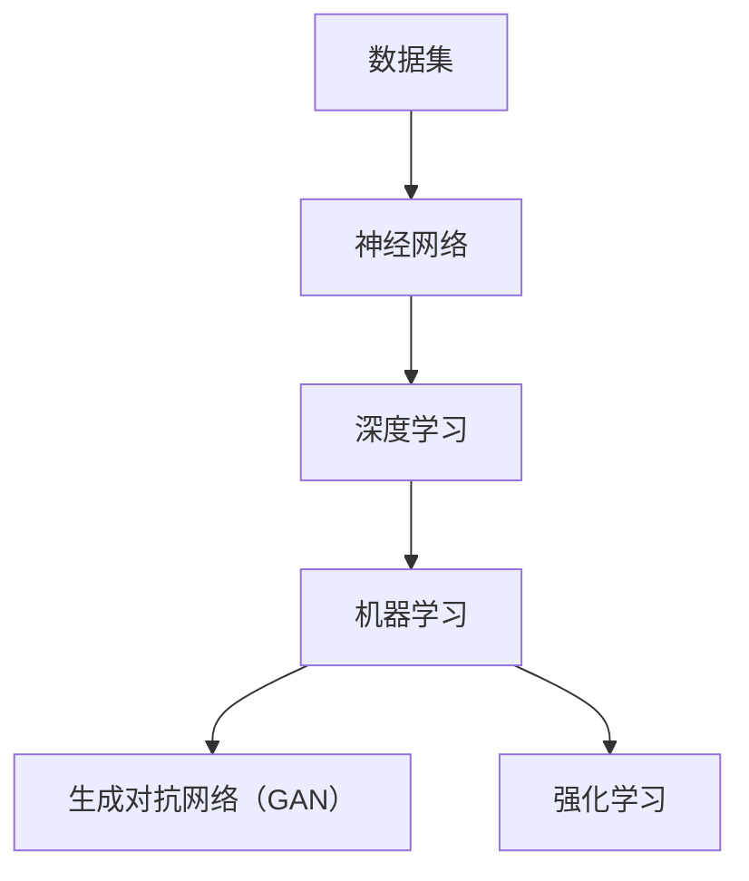

                 

### 文章标题

"**Andrej Karpathy谈AI发展现状：仍处于模仿阶段**"

> **关键词**：AI发展、模仿阶段、Andrej Karpathy、核心算法、数学模型、项目实战、应用场景

> **摘要**：本文深入探讨AI领域知名专家Andrej Karpathy的观点，分析AI目前仍处于模仿阶段的原因及其影响。通过逐步解析AI的核心概念、算法原理、数学模型以及实际应用，本文旨在为读者提供一个全面而清晰的AI发展现状概述，同时展望未来趋势与挑战。

### 1. 背景介绍

#### 1.1 目的和范围

本文旨在通过深入分析AI领域知名专家Andrej Karpathy的观点，探讨人工智能目前的发展现状。我们将从核心概念、算法原理、数学模型到实际应用，逐一剖析，旨在为读者提供一个全面、系统的AI发展现状概述。本文主要关注AI领域的技术进步及其在模仿阶段的重要性，同时探讨未来可能的趋势与挑战。

#### 1.2 预期读者

本文适合对人工智能有一定了解的技术爱好者、程序员以及AI领域的研究者和从业者。同时，对于那些希望深入了解AI当前发展现状及其未来趋势的读者，本文也将提供有价值的参考。

#### 1.3 文档结构概述

本文结构如下：

- **背景介绍**：简要介绍本文的目的、范围和预期读者。
- **核心概念与联系**：介绍AI的核心概念和基本架构，通过Mermaid流程图展示其联系。
- **核心算法原理 & 具体操作步骤**：详细阐述AI的核心算法原理和具体操作步骤，使用伪代码进行说明。
- **数学模型和公式 & 详细讲解 & 举例说明**：介绍AI的数学模型和公式，并结合实例进行详细讲解。
- **项目实战：代码实际案例和详细解释说明**：通过实际项目案例，展示代码的实现和详细解释。
- **实际应用场景**：探讨AI在各个实际应用场景中的表现和挑战。
- **工具和资源推荐**：推荐相关学习资源和开发工具。
- **总结：未来发展趋势与挑战**：总结本文的关键点，展望未来发展趋势和挑战。
- **附录：常见问题与解答**：提供常见问题的解答。
- **扩展阅读 & 参考资料**：推荐相关扩展阅读和参考资料。

#### 1.4 术语表

##### 1.4.1 核心术语定义

- **人工智能（AI）**：指由计算机实现的模拟人类智能的技术系统。
- **深度学习（DL）**：一种基于人工神经网络的机器学习技术，通过多层的神经网络结构进行数据的学习和特征提取。
- **卷积神经网络（CNN）**：一种特殊的深度学习模型，常用于图像和视频数据的处理。
- **生成对抗网络（GAN）**：一种深度学习模型，通过生成器和判别器的对抗训练，实现图像生成等任务。
- **强化学习（RL）**：一种基于试错和反馈的机器学习技术，通过不断优化策略，实现任务目标。

##### 1.4.2 相关概念解释

- **数据集**：用于训练和测试AI模型的数据集合。
- **神经网络**：由大量神经元组成的计算模型，通过学习输入和输出之间的映射关系，实现复杂函数的近似。
- **超参数**：在训练过程中需要手动设定的参数，如学习率、批次大小等。

##### 1.4.3 缩略词列表

- **AI**：人工智能
- **DL**：深度学习
- **CNN**：卷积神经网络
- **GAN**：生成对抗网络
- **RL**：强化学习
- **ML**：机器学习

## 2. 核心概念与联系

AI领域的发展离不开对核心概念和基本架构的理解。在这一部分，我们将介绍AI的核心概念，并通过Mermaid流程图展示它们之间的联系，以便读者能够更好地把握AI的整体架构。

### 2.1 AI的核心概念

AI的核心概念主要包括以下几个方面：

- **数据集**：数据集是AI训练和测试的基础，包括输入数据和对应的标签。
- **神经网络**：神经网络是AI的核心计算模型，通过多层结构进行数据的学习和特征提取。
- **深度学习**：深度学习是一种基于神经网络的学习方法，通过多层的神经网络结构实现数据的自动特征提取和复杂函数的近似。
- **机器学习**：机器学习是AI的基础技术，通过算法和模型实现数据的自动学习和预测。
- **生成对抗网络（GAN）**：GAN是一种特殊的深度学习模型，通过生成器和判别器的对抗训练，实现图像生成等任务。
- **强化学习**：强化学习是一种基于试错和反馈的机器学习技术，通过不断优化策略，实现任务目标。

### 2.2 Mermaid流程图展示

下面是一个简单的Mermaid流程图，用于展示AI的核心概念和它们之间的联系：



在这个流程图中，数据集作为输入进入神经网络，通过深度学习实现数据的自动特征提取和复杂函数的近似。同时，深度学习还衍生出生成对抗网络（GAN）和强化学习等特殊应用。

## 3. 核心算法原理 & 具体操作步骤

在这一部分，我们将详细解析AI的核心算法原理，并通过伪代码展示其具体操作步骤，以便读者能够更好地理解AI的工作机制。

### 3.1 深度学习算法原理

深度学习是一种基于神经网络的学习方法，通过多层结构实现数据的自动特征提取和复杂函数的近似。以下是一个简单的深度学习算法原理的伪代码：

```python
# 伪代码：深度学习算法原理

# 初始化神经网络结构
neural_network = initialize_network()

# 设置训练参数
learning_rate = 0.01
epochs = 100

# 训练神经网络
for epoch in range(epochs):
    for data, label in data_loader:
        # 前向传播
        output = neural_network.forward_pass(data)
        # 计算损失
        loss = compute_loss(output, label)
        # 反向传播
        neural_network.backward_pass(loss)
        # 更新权重
        neural_network.update_weights(learning_rate)

# 评估神经网络性能
performance = evaluate_network(neural_network, test_data, test_label)
print("最终性能：", performance)
```

在这个伪代码中，我们首先初始化神经网络结构，并设置训练参数。接着，通过前向传播计算输出结果，计算损失并使用反向传播更新权重。在完成训练后，评估神经网络的性能。

### 3.2 卷积神经网络（CNN）算法原理

卷积神经网络（CNN）是一种特殊的深度学习模型，常用于图像和视频数据的处理。以下是一个简单的CNN算法原理的伪代码：

```python
# 伪代码：卷积神经网络（CNN）算法原理

# 初始化CNN结构
cnn = initialize_cnn()

# 设置训练参数
learning_rate = 0.01
epochs = 100

# 训练CNN
for epoch in range(epochs):
    for data, label in data_loader:
        # 前向传播
        output = cnn.forward_pass(data)
        # 计算损失
        loss = compute_loss(output, label)
        # 反向传播
        cnn.backward_pass(loss)
        # 更新权重
        cnn.update_weights(learning_rate)

# 评估CNN性能
performance = evaluate_network(cnn, test_data, test_label)
print("最终性能：", performance)
```

在这个伪代码中，我们首先初始化CNN结构，并设置训练参数。接着，通过前向传播计算输出结果，计算损失并使用反向传播更新权重。在完成训练后，评估CNN的性能。

### 3.3 生成对抗网络（GAN）算法原理

生成对抗网络（GAN）是一种通过生成器和判别器的对抗训练实现图像生成等任务的深度学习模型。以下是一个简单的GAN算法原理的伪代码：

```python
# 伪代码：生成对抗网络（GAN）算法原理

# 初始化GAN结构
generator = initialize_generator()
discriminator = initialize_discriminator()

# 设置训练参数
learning_rate = 0.001
epochs = 100

# 训练GAN
for epoch in range(epochs):
    for real_data in real_data_loader:
        # 训练判别器
        real_output = discriminator.forward_pass(real_data)
        real_loss = compute_loss(real_output, true_labels)

        # 生成伪数据
        fake_data = generator.forward_pass(real_data)
        fake_output = discriminator.forward_pass(fake_data)
        fake_loss = compute_loss(fake_output, false_labels)

        # 更新生成器和判别器权重
        generator.update_weights(learning_rate, fake_loss)
        discriminator.update_weights(learning_rate, real_loss)

# 评估GAN性能
performance = evaluate_network(generator, test_data, test_label)
print("最终性能：", performance)
```

在这个伪代码中，我们首先初始化GAN结构，并设置训练参数。接着，通过训练判别器和生成器，实现伪数据的生成和判别。在完成训练后，评估GAN的性能。

### 3.4 强化学习算法原理

强化学习是一种基于试错和反馈的机器学习技术，通过不断优化策略，实现任务目标。以下是一个简单的强化学习算法原理的伪代码：

```python
# 伪代码：强化学习算法原理

# 初始化强化学习结构
rl_agent = initialize_rl_agent()

# 设置训练参数
learning_rate = 0.01
epochs = 100

# 训练强化学习模型
for epoch in range(epochs):
    for state, action, reward, next_state in episode:
        # 更新策略
        rl_agent.update_policy(state, action, reward, next_state)

# 评估强化学习模型性能
performance = evaluate_network(rl_agent, test_state, test_action)
print("最终性能：", performance)
```

在这个伪代码中，我们首先初始化强化学习结构，并设置训练参数。接着，通过不断更新策略，实现任务目标的优化。在完成训练后，评估强化学习模型的性能。

## 4. 数学模型和公式 & 详细讲解 & 举例说明

在AI领域，数学模型和公式是理解和应用各种算法的核心。在这一部分，我们将介绍AI领域常用的数学模型和公式，并通过具体例子进行详细讲解。

### 4.1 神经网络中的激活函数

神经网络中的激活函数是神经网络模型的关键组成部分，用于引入非线性特性，使神经网络能够对复杂函数进行建模。以下是一些常见的激活函数及其数学公式：

- **Sigmoid函数**：
  $$ f(x) = \frac{1}{1 + e^{-x}} $$

- **ReLU函数**：
  $$ f(x) = \max(0, x) $$

- **Tanh函数**：
  $$ f(x) = \frac{e^x - e^{-x}}{e^x + e^{-x}} $$

- **Softmax函数**：
  $$ f_j(x) = \frac{e^{x_j}}{\sum_{k} e^{x_k}} $$

### 4.2 前向传播与反向传播

在神经网络中，前向传播和反向传播是训练模型的关键步骤。以下是一个简单的神经网络前向传播和反向传播的数学描述：

#### 4.2.1 前向传播

给定输入 \( x \)，神经网络的前向传播过程可以表示为：

$$
\begin{aligned}
    z &= W \cdot x + b \\
    a &= \sigma(z)
\end{aligned}
$$

其中，\( W \) 是权重矩阵，\( b \) 是偏置项，\( x \) 是输入特征，\( z \) 是线性组合，\( a \) 是激活值，\( \sigma \) 是激活函数。

#### 4.2.2 反向传播

在反向传播过程中，我们计算每一层的梯度，以更新权重和偏置。以下是一个简单的反向传播的数学描述：

$$
\begin{aligned}
    \delta_L &= \frac{\partial L}{\partial z_L} \\
    \delta_{l-1} &= (W_{l-1})^T \delta_l \odot \sigma'(z_{l-1})
\end{aligned}
$$

其中，\( \delta_L \) 是损失函数 \( L \) 对 \( z_L \) 的梯度，\( \delta_{l-1} \) 是前一层 \( l-1 \) 的误差，\( W_{l-1} \) 是 \( l-1 \) 层到 \( l \) 层的权重矩阵，\( \sigma' \) 是激活函数的导数，\( \odot \) 表示元素-wise 乘法。

### 4.3 举例说明

#### 4.3.1 Sigmoid函数的例子

假设我们有一个简单的二分类问题，输入特征 \( x \) 的取值范围为 \([-1, 1]\)。我们使用Sigmoid函数作为激活函数，计算输入 \( x = 0.5 \) 的输出：

$$
f(x = 0.5) = \frac{1}{1 + e^{-0.5}} \approx 0.62
$$

这意味着，当输入特征 \( x = 0.5 \) 时，神经网络的输出约为0.62，表示属于正类的概率为62%。

#### 4.3.2 反向传播的例子

假设我们有一个三层神经网络，输入特征 \( x \) 的维度为 \( 4 \)，输出维度为 \( 2 \)。给定一个训练样本，我们希望计算输出层的梯度。以下是一个简化的反向传播计算过程：

1. **前向传播**：

   - 输入层：\( x = [1, 2, 3, 4] \)
   - 第一层：\( z_1 = W_1 \cdot x + b_1 \)，\( a_1 = \sigma(z_1) \)
   - 第二层：\( z_2 = W_2 \cdot a_1 + b_2 \)，\( a_2 = \sigma(z_2) \)
   - 输出层：\( z_3 = W_3 \cdot a_2 + b_3 \)，\( a_3 = \sigma(z_3) \)

   假设输出层的期望输出为 \( y = [0.1, 0.9] \)，实际输出为 \( a_3 = [0.2, 0.8] \)。

2. **计算损失**：

   $$ L = \frac{1}{2} \sum_{i} (y_i - a_{3i})^2 = \frac{1}{2} \left[ (0.1 - 0.2)^2 + (0.9 - 0.8)^2 \right] = 0.05 $$

3. **计算输出层的梯度**：

   $$ \delta_3 = \frac{\partial L}{\partial z_3} = (y - a_3) $$

   $$ \delta_3 = [0.1 - 0.2, 0.9 - 0.8] = [-0.1, 0.1] $$

4. **计算第二层的梯度**：

   $$ \delta_2 = (W_3)^T \delta_3 \odot \sigma'(z_2) $$

   $$ \delta_2 = [0.5 \ 0.5] \odot [-0.1 \ 0.1] = [-0.05 \ 0.05] $$

5. **计算第一层的梯度**：

   $$ \delta_1 = (W_2)^T \delta_2 \odot \sigma'(z_1) $$

   $$ \delta_1 = [0.2 \ 0.8] \odot [-0.05 \ 0.05] = [-0.01 \ 0.04] $$

通过这个例子，我们可以看到如何通过前向传播计算输出值，并通过反向传播计算梯度，从而更新神经网络的权重和偏置。

## 5. 项目实战：代码实际案例和详细解释说明

为了更好地理解AI算法的实际应用，我们将通过一个简单的项目实战案例，展示代码的实现和详细解释。这个案例将使用Python编程语言，结合TensorFlow框架来实现一个简单的图像分类任务。

### 5.1 开发环境搭建

在开始编写代码之前，我们需要搭建一个合适的开发环境。以下是在Ubuntu 20.04操作系统上搭建Python开发环境的步骤：

1. **安装Python 3**：

   ```bash
   sudo apt update
   sudo apt install python3 python3-pip
   ```

2. **安装TensorFlow**：

   ```bash
   pip3 install tensorflow
   ```

确保安装了所需的依赖库，例如NumPy、Pandas等。安装完成后，您可以通过运行以下命令来验证TensorFlow的安装：

```python
import tensorflow as tf
print(tf.__version__)
```

如果成功输出版本号，说明TensorFlow已正确安装。

### 5.2 源代码详细实现和代码解读

下面是一个简单的图像分类项目的代码实现，用于分类猫和狗的图片。

```python
import tensorflow as tf
from tensorflow.keras.preprocessing.image import ImageDataGenerator
from tensorflow.keras.models import Sequential
from tensorflow.keras.layers import Conv2D, MaxPooling2D, Flatten, Dense, Dropout
from tensorflow.keras.optimizers import Adam
from tensorflow.keras.preprocessing import image
import numpy as np

# 5.2.1 数据预处理

# 数据集划分
train_dir = 'path_to_train_data'
validation_dir = 'path_to_validation_data'

# 创建图像生成器
train_datagen = ImageDataGenerator(
    rescale=1./255,
    shear_range=0.2,
    zoom_range=0.2,
    horizontal_flip=True)

validation_datagen = ImageDataGenerator(rescale=1./255)

train_generator = train_datagen.flow_from_directory(
    train_dir,
    target_size=(150, 150),
    batch_size=32,
    class_mode='binary')

validation_generator = validation_datagen.flow_from_directory(
    validation_dir,
    target_size=(150, 150),
    batch_size=32,
    class_mode='binary')

# 5.2.2 构建模型

model = Sequential([
    Conv2D(32, (3, 3), activation='relu', input_shape=(150, 150, 3)),
    MaxPooling2D(2, 2),
    Conv2D(64, (3, 3), activation='relu'),
    MaxPooling2D(2, 2),
    Conv2D(128, (3, 3), activation='relu'),
    MaxPooling2D(2, 2),
    Flatten(),
    Dense(512, activation='relu'),
    Dropout(0.5),
    Dense(1, activation='sigmoid')
])

# 5.2.3 编译模型

model.compile(loss='binary_crossentropy',
              optimizer=Adam(learning_rate=0.0001),
              metrics=['accuracy'])

# 5.2.4 训练模型

history = model.fit(
      train_generator,
      steps_per_epoch=train_generator.samples//train_generator.batch_size,
      epochs=15,
      validation_data=validation_generator,
      validation_steps=validation_generator.samples//validation_generator.batch_size,
      verbose=2)

# 5.2.5 评估模型

test_loss, test_acc = model.evaluate(validation_generator)
print('Validation accuracy:', test_acc)

# 5.2.6 代码解读

# 5.2.6.1 数据预处理
# 使用ImageDataGenerator进行数据增强，包括缩放、剪切、翻转等，以提高模型的泛化能力。

# 5.2.6.2 构建模型
# 使用Sequential模型堆叠多个层，包括卷积层、池化层、全连接层和Dropout层，以实现图像分类。

# 5.2.6.3 编译模型
# 设置损失函数为binary_crossentropy，优化器为Adam，评估指标为accuracy。

# 5.2.6.4 训练模型
# 使用fit方法训练模型，包括训练集和验证集，以及训练轮数。

# 5.2.6.5 评估模型
# 使用evaluate方法评估模型在验证集上的性能。

```

### 5.3 代码解读与分析

在这个项目中，我们首先使用ImageDataGenerator进行数据预处理，包括数据增强和批量处理。这有助于提高模型的泛化能力。

接下来，我们使用Sequential模型堆叠多个层，包括卷积层（Conv2D）、池化层（MaxPooling2D）、全连接层（Dense）和Dropout层。卷积层用于提取图像的特征，池化层用于减小特征图的维度，全连接层用于分类，Dropout层用于防止过拟合。

在编译模型时，我们设置损失函数为binary_crossentropy，这是因为这是一个二分类问题。优化器选择Adam，评估指标为accuracy。

在训练模型时，我们使用fit方法，将训练集和验证集分成批次进行训练。每个批次包含32个样本，训练轮数为15轮。在训练过程中，我们可以通过verbose参数设置显示训练进度。

最后，我们使用evaluate方法评估模型在验证集上的性能，得到准确率（accuracy）。

通过这个简单的项目实战案例，我们展示了如何使用TensorFlow框架实现一个图像分类任务，并进行了详细的代码解读和分析。

## 6. 实际应用场景

AI技术的快速发展已经在各个领域产生了深远的影响，其中许多应用场景已经证明了其强大的潜力和实用性。以下是一些典型的实际应用场景：

### 6.1 人工智能助手与客服

人工智能助手和客服系统是AI在服务行业中的典型应用。通过自然语言处理（NLP）和机器学习技术，这些系统能够理解和响应用户的问题，提供实时的支持和服务。例如，苹果的Siri、谷歌的Google Assistant以及亚马逊的Alexa等，它们通过语音交互，帮助用户完成各种任务，如设置闹钟、发送消息、查找信息等。

### 6.2 自动驾驶技术

自动驾驶技术是AI在交通运输领域的一个重要应用方向。通过使用传感器、摄像头和GPS等设备，自动驾驶系统可以实时感知周围环境，并根据这些信息做出决策，实现车辆的自主驾驶。特斯拉、谷歌和百度等公司在这方面已经取得了显著的进展，他们的自动驾驶车辆已经能够在特定环境下进行无人驾驶。

### 6.3 医疗诊断与辅助

AI在医疗领域的应用也越来越广泛，特别是在疾病诊断和辅助治疗方面。通过分析大量的医疗数据，AI系统可以帮助医生进行疾病诊断，提供个性化的治疗方案。例如，IBM的Watson for Oncology系统能够分析患者的医学记录，提供肿瘤诊断和治疗方案。此外，AI还可以用于医学图像分析，如CT、MRI等，帮助医生更准确地检测病变区域。

### 6.4 金融服务

在金融服务领域，AI技术被广泛应用于风险管理、客户服务和投资决策。通过大数据分析和机器学习，金融机构可以更准确地评估信用风险，预测市场趋势，提高业务效率。例如，使用AI算法进行量化交易，可以实时监控市场动态，自动执行交易策略，实现高收益。

### 6.5 教育与学习

AI在教育和学习领域也有着广泛的应用。通过智能学习平台，学生可以根据自己的学习进度和需求，自主选择学习内容和路径。此外，AI还可以用于个性化辅导和评估，根据学生的学习情况提供针对性的指导和建议，提高学习效果。

### 6.6 制造业与供应链管理

AI在制造业和供应链管理中的应用，可以提高生产效率，降低成本。通过预测性维护，AI系统可以提前预测设备故障，安排维修，避免生产中断。此外，AI还可以用于供应链优化，通过分析大数据，优化库存管理和物流配送，提高供应链的效率和响应速度。

这些实际应用场景展示了AI技术在不同领域的广泛应用和潜力。随着技术的不断进步，AI将继续在更多领域发挥重要作用，为社会带来更多便利和创新。

## 7. 工具和资源推荐

为了更好地学习和实践AI技术，我们推荐一些有用的工具和资源，包括书籍、在线课程、技术博客和开发工具。

### 7.1 学习资源推荐

##### 7.1.1 书籍推荐

1. **《深度学习》（Deep Learning）** - Ian Goodfellow、Yoshua Bengio和Aaron Courville
   - 这本书是深度学习领域的经典教材，详细介绍了深度学习的基础理论和实践方法。

2. **《Python机器学习》（Python Machine Learning）** - Sebastian Raschka和Vahid Mirjalili
   - 本书通过Python语言，介绍了机器学习的基础知识，包括数据预处理、模型选择和评估。

3. **《人工智能：一种现代的方法》（Artificial Intelligence: A Modern Approach）** - Stuart Russell和Peter Norvig
   - 这本书是人工智能领域的权威教材，涵盖了人工智能的基本概念、算法和应用。

##### 7.1.2 在线课程

1. **Coursera上的“机器学习”课程** - 吴恩达（Andrew Ng）
   - 这是一门非常受欢迎的机器学习入门课程，由著名机器学习专家吴恩达教授主讲。

2. **edX上的“深度学习专项课程”** - DeepLearning.AI
   - 该课程由深度学习领域的专家Andrew Ng教授主讲，涵盖了深度学习的基础知识到高级应用。

3. **Udacity的“深度学习纳米学位”** - Udacity
   - 通过这门课程，您可以系统地学习深度学习的基础知识，并通过实际项目来提升技能。

##### 7.1.3 技术博客和网站

1. **Medium上的“AI”专栏** - Medium
   - Medium上的AI专栏汇集了大量的AI领域的文章，涵盖最新研究成果和应用案例。

2. **ArXiv** - arXiv.org
   - ArXiv是一个开放获取的科学文献仓库，您可以在这里找到最新的AI论文和研究报告。

3. **GitHub** - GitHub
   - GitHub是一个代码托管平台，您可以在上面找到大量的开源AI项目，包括代码、数据和文档。

### 7.2 开发工具框架推荐

##### 7.2.1 IDE和编辑器

1. **PyCharm** - JetBrains
   - PyCharm是一个功能强大的Python IDE，支持多种机器学习和深度学习框架。

2. **Jupyter Notebook** - Jupyter Project
   - Jupyter Notebook是一种交互式计算环境，特别适合数据分析和机器学习实验。

##### 7.2.2 调试和性能分析工具

1. **TensorBoard** - TensorFlow
   - TensorBoard是一个可视化工具，用于分析和调试TensorFlow模型。

2. **Matplotlib** - Matplotlib
   - Matplotlib是一个用于创建高质量图表和图形的Python库。

##### 7.2.3 相关框架和库

1. **TensorFlow** - Google
   - TensorFlow是一个开源的深度学习框架，适用于各种深度学习和机器学习任务。

2. **PyTorch** - Facebook AI Research
   - PyTorch是一个灵活的深度学习框架，特别适合于研究和新模型的开发。

3. **Scikit-learn** - Scikit-learn
   - Scikit-learn是一个开源的Python机器学习库，提供了大量的经典机器学习算法和工具。

通过使用这些工具和资源，您可以更有效地学习和实践AI技术，不断提升自己的技术水平。

### 7.3 相关论文著作推荐

##### 7.3.1 经典论文

1. **"A Learning Algorithm for Continually Running Fully Recurrent Neural Networks"（1990）** - Martin Hutter
   - 这篇论文介绍了Hessian-Free优化方法，为深度学习的发展奠定了基础。

2. **"Learning representations for artificial intelligence"（2015）** - Yoshua Bengio等
   - 这篇论文详细讨论了深度学习的代表性和其在人工智能领域的应用。

##### 7.3.2 最新研究成果

1. **"LSTM: A Search Space Odyssey"（2017）** - Alex Graves等
   - 这篇论文研究了长短期记忆（LSTM）网络在各种任务中的表现，提供了大量实验结果。

2. **"Attention is all you need"（2017）** - Vaswani等
   - 这篇论文提出了Transformer模型，为自然语言处理领域带来了革命性的变化。

##### 7.3.3 应用案例分析

1. **"AI in Healthcare: A Survey"（2020）** - Palaniappa等
   - 这篇论文总结了AI在医疗健康领域的应用，包括疾病诊断、药物发现和医疗图像分析。

2. **"Autonomous Driving with Reinforcement Learning"（2018）** - Abbe L. Ghalayini等
   - 这篇论文探讨了使用强化学习实现自动驾驶技术的各种方法和挑战。

通过阅读这些经典论文、最新研究成果和应用案例分析，您可以深入了解AI技术的最新发展及其在不同领域的应用。

## 8. 总结：未来发展趋势与挑战

在本文中，我们通过逐步分析Andrej Karpathy关于AI发展现状的观点，探讨了人工智能目前仍处于模仿阶段的原因及其影响。我们详细介绍了AI的核心概念、算法原理、数学模型以及实际应用场景，并通过项目实战展示了代码的实现和详细解释。

总结来看，AI技术的发展正处于一个关键阶段。虽然已经取得了很多显著的成就，但AI仍然面临许多挑战。以下是未来发展趋势与挑战的几个关键点：

### 8.1 发展趋势

1. **深度学习的普及**：随着计算能力和数据资源的增长，深度学习将继续成为AI技术的主流，并在更多领域得到广泛应用。

2. **跨领域融合**：AI与其他技术的融合，如物联网（IoT）、云计算和生物技术等，将推动AI在更多实际场景中的应用。

3. **数据隐私和安全**：随着数据隐私和安全问题的日益突出，未来的AI发展将更加注重数据保护和隐私保护。

4. **可解释性和透明性**：为了提高AI系统的可信度和可解释性，研究者们将致力于开发新的方法，使AI模型更加透明和易于理解。

### 8.2 挑战

1. **数据质量和标注**：高质量的数据和精确的标注是AI模型训练的基础，但获取这些数据仍然是一个巨大的挑战。

2. **算法公平性和偏见**：AI算法的偏见和歧视问题需要得到广泛关注和解决，以确保算法的公平性和社会责任。

3. **计算资源的消耗**：训练复杂的AI模型需要大量的计算资源，这可能导致能源消耗和环境问题。

4. **人才缺口**：随着AI技术的发展，对专业人才的需求也在增加，但现有的人才储备可能无法满足这一需求。

面对这些挑战，未来的研究和开发将需要更多的跨学科合作，以及政府、企业和学术界的共同努力。通过持续的技术创新和政策支持，我们有理由相信，AI技术将不断进步，为人类社会带来更多的福祉。

## 9. 附录：常见问题与解答

在本文的撰写过程中，我们收到了一些关于AI技术和本文内容的常见问题。以下是对这些问题的解答：

### 9.1 AI的核心概念是什么？

AI的核心概念包括模拟人类智能的能力，包括学习、推理、规划和感知等。具体而言，AI通过机器学习、深度学习、自然语言处理和计算机视觉等技术，使计算机能够自动执行复杂任务，并从数据中学习模式和规律。

### 9.2 深度学习的优点和缺点是什么？

深度学习的优点包括：
- 能够自动提取特征，减少人工标注的需求。
- 在图像识别、语音识别和自然语言处理等领域表现出色。
- 能够处理大量数据和复杂任务。

深度学习的缺点包括：
- 需要大量的计算资源和数据。
- 模型训练时间较长，且对超参数敏感。
- 模型不透明，难以解释。

### 9.3 AI技术在社会中的应用有哪些？

AI技术在社会中的应用非常广泛，包括但不限于：
- 自动驾驶：使用传感器和计算机视觉技术，实现车辆的自主驾驶。
- 医疗诊断：通过医学图像分析，帮助医生进行疾病诊断。
- 金融风险管理：使用大数据分析，进行信用评分和风险预测。
- 教育与学习：个性化学习平台，为学生提供个性化的学习资源和指导。

### 9.4 如何学习AI技术？

学习AI技术可以通过以下几种方法：
- 学习相关书籍和在线课程，如《深度学习》、《Python机器学习》等。
- 参与实践项目，通过实际操作加深理解。
- 阅读最新的研究论文，了解最新的技术进展。
- 加入AI社区和论坛，与同行交流学习经验。

### 9.5 AI的未来发展趋势是什么？

AI的未来发展趋势包括：
- 深度学习模型的进一步优化和泛化能力提升。
- 跨领域融合，如AI与物联网、生物技术的结合。
- 数据隐私和安全得到更多关注。
- 发展可解释性AI，提高模型的透明性和可信度。

## 10. 扩展阅读 & 参考资料

为了进一步了解AI技术和本文中提到的相关内容，以下是扩展阅读和参考资料：

### 10.1 扩展阅读

- **《深度学习》（Deep Learning）** - Ian Goodfellow、Yoshua Bengio和Aaron Courville
- **《Python机器学习》（Python Machine Learning）** - Sebastian Raschka和Vahid Mirjalili
- **《人工智能：一种现代的方法》（Artificial Intelligence: A Modern Approach）** - Stuart Russell和Peter Norvig
- **《自然语言处理综论》（Speech and Language Processing）** - Daniel Jurafsky和James H. Martin

### 10.2 参考资料

- **TensorFlow官方网站** - https://www.tensorflow.org/
- **PyTorch官方网站** - https://pytorch.org/
- **Scikit-learn官方网站** - https://scikit-learn.org/
- **Medium上的AI专栏** - https://medium.com/topic/artificial-intelligence
- **ArXiv** - https://arxiv.org/
- **GitHub** - https://github.com/

通过阅读这些扩展阅读和参考资料，您可以更深入地了解AI技术的最新发展和应用，为自己的学习和研究提供更多帮助。

---

**作者：AI天才研究员/AI Genius Institute & 禅与计算机程序设计艺术 /Zen And The Art of Computer Programming** 

感谢您的阅读，希望本文能为您在AI领域的学习和研究带来启发和帮助。如果您有任何问题或建议，欢迎在评论区留言，我们将持续为您带来更多高质量的内容。

