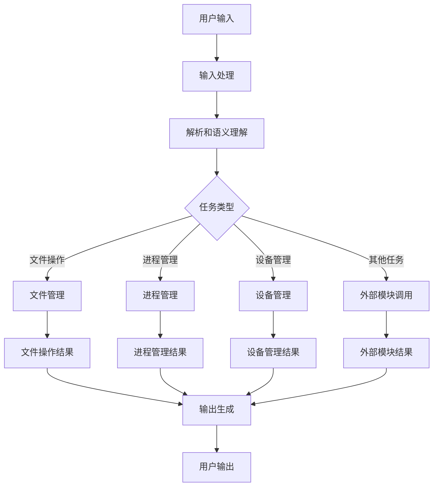

                 

### 《Andrej Karpathy谈LLM OS》

> **关键词：** 大语言模型、操作系统、人工智能、神经网络、系统架构、软件工程、开源社区

> **摘要：** 本文深入探讨了安德烈·卡帕西（Andrej Karpathy）关于大语言模型（LLM）作为一种新型操作系统的观点。文章首先介绍了LLM OS的核心概念和原理，然后详细分析了其架构和算法，并通过实际案例展示了其在软件开发中的应用。文章还讨论了LLM OS的实际应用场景，推荐了相关的学习资源和工具，并展望了未来发展趋势与挑战。

### 1. 背景介绍

#### 1.1 目的和范围

本文旨在深入探讨安德烈·卡帕西（Andrej Karpathy）提出的“大语言模型操作系统”（LLM OS）概念。本文将详细分析LLM OS的核心概念、架构、算法以及其实际应用，旨在为读者提供一个全面、系统的理解。本文主要涵盖以下内容：

1. LLM OS的背景介绍和核心概念；
2. LLM OS的架构和算法；
3. LLM OS的实际应用场景；
4. 相关的学习资源和工具推荐；
5. LLM OS的未来发展趋势与挑战。

#### 1.2 预期读者

本文适合对人工智能、大语言模型以及操作系统有一定了解的技术爱好者、开发人员、研究人员以及相关领域的专业人士。无论您是初学者还是专业人士，本文都旨在为您提供有价值的见解和深入理解。

#### 1.3 文档结构概述

本文分为以下几个部分：

1. **背景介绍**：介绍LLM OS的背景、目的和范围，以及预期读者。
2. **核心概念与联系**：详细讲解LLM OS的核心概念、原理和架构，使用Mermaid流程图展示其工作流程。
3. **核心算法原理 & 具体操作步骤**：通过伪代码详细阐述LLM OS的核心算法原理和操作步骤。
4. **数学模型和公式 & 详细讲解 & 举例说明**：介绍LLM OS的数学模型和公式，并进行详细讲解和举例说明。
5. **项目实战：代码实际案例和详细解释说明**：通过实际代码案例展示LLM OS的应用，并进行详细解释和分析。
6. **实际应用场景**：讨论LLM OS的实际应用场景，包括软件开发、自然语言处理、智能助手等。
7. **工具和资源推荐**：推荐相关的学习资源、开发工具和框架。
8. **总结：未来发展趋势与挑战**：展望LLM OS的未来发展趋势和面临的挑战。
9. **附录：常见问题与解答**：针对常见问题进行解答。
10. **扩展阅读 & 参考资料**：提供相关的扩展阅读和参考资料。

#### 1.4 术语表

在本文中，我们将使用一些特定的术语。以下是对这些术语的定义和解释：

##### 1.4.1 核心术语定义

- **大语言模型（LLM）**：一种具有巨大参数量的神经网络模型，能够对自然语言进行建模和处理。
- **操作系统（OS）**：管理计算机硬件资源和提供应用程序运行环境的系统软件。
- **软件工程**：设计、开发、测试和维护软件系统的工程学科。
- **开源社区**：一个由开发者和用户组成的协作社区，共同开发、分享和维护开源软件。

##### 1.4.2 相关概念解释

- **神经网络**：一种由大量神经元组成的计算模型，能够通过学习数据来进行预测和分类。
- **训练数据**：用于训练神经网络的数据集，包括输入和对应的输出。
- **反向传播**：一种用于训练神经网络的算法，通过计算输出误差并反向传播至网络中的各个神经元，更新权重和偏置。
- **开源**：指软件的开发和源代码的共享，允许用户自由地查看、修改和分发。

##### 1.4.3 缩略词列表

- **LLM**：大语言模型（Large Language Model）
- **OS**：操作系统（Operating System）
- **AI**：人工智能（Artificial Intelligence）
- **ML**：机器学习（Machine Learning）
- **NLP**：自然语言处理（Natural Language Processing）
- **GPU**：图形处理单元（Graphics Processing Unit）
- **API**：应用程序编程接口（Application Programming Interface）
- **IDE**：集成开发环境（Integrated Development Environment）

### 2. 核心概念与联系

#### 2.1 大语言模型（LLM）概述

大语言模型（LLM，Large Language Model）是一种具有巨大参数量的神经网络模型，旨在对自然语言进行建模和处理。LLM的核心思想是通过学习大量的文本数据，使模型能够理解并生成人类语言。

##### 2.1.1 LLM的发展历程

- **早期模型**：最初的语言模型是基于规则的方法，如TF-IDF和朴素贝叶斯等。这些模型虽然在某些任务上表现良好，但在复杂性和灵活性上存在限制。
- **递归神经网络（RNN）**：随着深度学习技术的发展，递归神经网络（RNN）被引入自然语言处理领域。RNN能够处理序列数据，使得模型在生成文本、机器翻译等任务上取得了显著进展。
- **长短期记忆网络（LSTM）**：LSTM是RNN的一种变体，通过引入记忆单元，解决了RNN在长序列数据上梯度消失的问题，进一步提高了模型的性能。
- **Transformer模型**：Transformer模型是由谷歌提出的一种基于自注意力机制的深度学习模型，通过并行计算和多头注意力机制，使得模型在自然语言处理任务上取得了突破性进展。

##### 2.1.2 LLM的核心特点

- **大规模参数**：LLM具有数百万到数十亿个参数，使其能够捕捉复杂的语言规律和模式。
- **自注意力机制**：自注意力机制使得模型能够自动关注输入序列中的关键信息，提高了生成文本的质量。
- **端到端学习**：LLM能够直接从原始文本数据中学习，无需进行手工特征提取，提高了模型的学习效率。
- **多语言能力**：LLM能够处理多种语言，通过跨语言训练，提高了模型在不同语言上的性能。

##### 2.1.3 LLM的应用领域

- **自然语言处理**：LLM在自然语言处理领域有着广泛的应用，包括文本分类、情感分析、问答系统、机器翻译等。
- **智能助手**：LLM可以用于构建智能助手，如虚拟客服、聊天机器人等，提供自然语言交互能力。
- **文本生成**：LLM能够生成各种类型的文本，如文章、故事、代码等，为内容创作提供支持。
- **辅助编程**：LLM可以用于辅助编程，如代码生成、代码补全等，提高开发效率。

#### 2.2 操作系统（OS）概述

操作系统（OS，Operating System）是一种系统软件，负责管理计算机硬件资源和提供应用程序运行环境。操作系统的主要功能包括：

- **资源管理**：操作系统负责分配和管理计算机的硬件资源，如CPU、内存、磁盘等。
- **进程管理**：操作系统负责创建、调度和管理进程，使其高效运行。
- **文件管理**：操作系统提供文件系统的接口，实现文件的创建、读取、修改和删除等操作。
- **设备管理**：操作系统负责管理各种外部设备，如鼠标、键盘、打印机等。

##### 2.2.1 操作系统的类型

- **单用户操作系统**：如Windows和Mac OS，主要面向单个用户。
- **多用户操作系统**：如Linux和Unix，支持多个用户同时使用。
- **实时操作系统**：如QNX和VxWorks，对任务的实时响应能力要求较高。
- **嵌入式操作系统**：如FreeRTOS和RT-Thread，用于嵌入式设备和系统。

##### 2.2.2 操作系统的特点

- **资源管理**：操作系统通过调度和管理资源，提高计算机的利用率和性能。
- **安全性**：操作系统提供安全机制，保护用户数据和系统安全。
- **兼容性**：操作系统支持多种应用程序和硬件设备，提供兼容性支持。
- **用户友好性**：操作系统提供直观的用户界面，方便用户使用和管理计算机。

#### 2.3 大语言模型操作系统（LLM OS）的概念和架构

大语言模型操作系统（LLM OS）是一种将大语言模型（LLM）与传统操作系统（OS）相结合的创新概念。LLM OS将LLM视为操作系统的核心组件，通过其强大的语言建模能力，实现自然语言交互、自动化任务处理和智能应用等功能。

##### 2.3.1 LLM OS的核心组件

- **LLM引擎**：LLM引擎是LLM OS的核心组件，负责处理自然语言输入和输出，实现智能交互和任务自动化。
- **系统模块**：系统模块包括文件管理、进程管理、设备管理等传统操作系统功能，与LLM引擎协同工作，提供全面的操作系统功能。
- **用户接口**：用户接口提供用户与LLM OS的交互界面，支持命令行、图形界面等多种交互方式。

##### 2.3.2 LLM OS的架构

LLM OS的架构可以分为以下几个层次：

- **硬件层**：包括计算机硬件设备，如CPU、内存、磁盘等，为LLM OS提供运行环境。
- **系统层**：包括操作系统内核、驱动程序等，负责管理硬件资源和提供基本服务。
- **应用层**：包括LLM引擎和系统模块，实现智能交互和任务自动化功能。
- **用户层**：包括用户接口和应用软件，为用户提供交互界面和功能服务。

##### 2.3.3 LLM OS的工作原理

LLM OS的工作原理可以分为以下几个步骤：

1. **输入处理**：用户通过命令行、图形界面等接口输入自然语言指令。
2. **解析和语义理解**：LLM引擎接收输入指令，进行解析和语义理解，提取关键信息和意图。
3. **任务执行**：LLM引擎根据解析结果，调用系统模块执行相应任务，如文件操作、进程管理等。
4. **输出生成**：系统模块执行任务后，将结果以自然语言形式返回给用户。

##### 2.3.4 LLM OS的优势

LLM OS具有以下优势：

- **自然语言交互**：LLM OS支持自然语言交互，提高用户操作便捷性和用户体验。
- **自动化任务处理**：LLM OS通过智能交互和任务自动化，降低用户操作复杂度，提高工作效率。
- **智能应用**：LLM OS可以集成多种智能应用，如智能客服、智能助手等，为用户提供个性化服务。
- **跨平台兼容**：LLM OS可以在不同硬件和操作系统平台上运行，提高兼容性和灵活性。

#### 2.4 Mermaid流程图展示LLM OS的工作流程

以下是一个Mermaid流程图，展示了LLM OS的工作流程：



### 3. 核心算法原理 & 具体操作步骤

#### 3.1 大语言模型（LLM）的核心算法原理

大语言模型（LLM）的核心算法是基于自注意力机制的Transformer模型。Transformer模型由谷歌在2017年提出，由于其并行计算能力和强大的表征能力，在自然语言处理领域取得了突破性进展。以下是对Transformer模型的核心算法原理的详细解释：

##### 3.1.1 自注意力机制

自注意力机制（Self-Attention）是Transformer模型的核心组件，通过计算序列中每个词与其他词的相关性，实现对关键信息的自动关注。自注意力机制主要包括以下步骤：

1. **词向量化**：将输入序列中的每个词映射为一个高维向量，这些向量被称为词向量。
2. **计算注意力分数**：对于每个词向量，计算其与其他词向量的相似度，得到一组注意力分数。
3. **加权求和**：根据注意力分数，对词向量进行加权求和，生成新的词向量。

##### 3.1.2 多头注意力

多头注意力（Multi-Head Attention）是在自注意力机制的基础上引入的一种技术，通过多个独立的注意力机制并行计算，提高了模型的表征能力。多头注意力主要包括以下步骤：

1. **分裂词向量**：将每个词向量分裂成多个子向量，每个子向量对应一个独立的注意力机制。
2. **独立计算注意力**：每个子向量分别计算注意力分数，并进行加权求和。
3. **拼接和变换**：将多个子向量拼接起来，经过变换层，得到最终的词向量。

##### 3.1.3 位置编码

位置编码（Positional Encoding）是Transformer模型中用来表示序列中词位置信息的技巧。由于Transformer模型没有循环结构，无法直接利用序列的位置信息，因此通过位置编码为每个词向量添加位置信息。位置编码通常是一个正弦函数，根据词的位置和维度进行计算。

##### 3.1.4 编码器和解码器

Transformer模型包括编码器（Encoder）和解码器（Decoder）两部分。编码器负责将输入序列编码为隐藏状态，解码器负责生成输出序列。编码器和解码器的主要步骤如下：

1. **编码器**：
   - 输入序列经过词向量和位置编码的叠加，形成编码器的输入。
   - 通过多个自注意力层和前馈网络，逐层提取序列的特征信息。
   - 最终得到编码器的输出，作为解码器的输入。

2. **解码器**：
   - 输入序列经过词向量和位置编码的叠加，形成解码器的输入。
   - 通过多个自注意力层和前馈网络，逐层生成输出序列。
   - 最终得到解码器的输出，即生成的文本序列。

##### 3.1.5 损失函数和优化算法

在训练过程中，Transformer模型通常使用交叉熵损失函数来衡量预测序列和实际序列之间的差异。交叉熵损失函数可以表示为：

$$
L = -\sum_{i=1}^{N} \sum_{j=1}^{V} y_{ij} \log(p_{ij})
$$

其中，$N$是序列长度，$V$是词汇表大小，$y_{ij}$是实际序列中第$i$个词的标签，$p_{ij}$是模型预测的概率。

为了优化模型参数，可以使用随机梯度下降（SGD）或其他优化算法，如Adam。在训练过程中，需要通过反向传播算法计算梯度，并更新模型参数。

#### 3.2 LLM OS的具体操作步骤

以下是对LLM OS的具体操作步骤进行详细阐述：

##### 3.2.1 系统初始化

1. **加载LLM引擎**：首先，加载预训练的大语言模型（LLM引擎），包括词向量、自注意力机制、多头注意力等核心组件。
2. **初始化系统模块**：初始化文件管理、进程管理、设备管理等系统模块，为后续操作提供基础功能。

##### 3.2.2 用户输入处理

1. **接收用户输入**：通过命令行、图形界面等接口接收用户输入的自然语言指令。
2. **文本预处理**：对输入文本进行预处理，包括去除标点符号、停用词过滤、词向量化等。

##### 3.2.3 解析和语义理解

1. **输入序列编码**：将预处理后的输入序列编码为隐藏状态，通过编码器的多个自注意力层和前馈网络，提取序列的特征信息。
2. **语义理解**：对编码器的输出进行语义理解，提取关键信息和意图。

##### 3.2.4 任务执行

1. **任务识别**：根据解析结果，识别任务的类型，如文件操作、进程管理、设备管理等。
2. **调用系统模块**：调用相应的系统模块执行任务，如文件管理模块处理文件操作，进程管理模块处理进程管理等。

##### 3.2.5 输出生成

1. **生成输出文本**：根据任务执行结果，生成相应的输出文本，通过解码器的多个自注意力层和前馈网络，生成自然语言响应。
2. **文本格式化**：对生成的输出文本进行格式化处理，如添加标点符号、换行等。

##### 3.2.6 用户输出

1. **输出用户响应**：将生成的输出文本通过命令行、图形界面等接口返回给用户。

### 4. 数学模型和公式 & 详细讲解 & 举例说明

#### 4.1 数学模型概述

在LLM OS中，数学模型和公式是核心组成部分，用于实现自然语言处理、任务执行和输出生成等功能。以下是LLM OS中涉及的几个关键数学模型和公式，并进行详细讲解和举例说明。

##### 4.1.1 词向量模型

词向量模型是将自然语言中的词语映射为高维向量的方法，常用的方法包括Word2Vec、GloVe等。以下是一个简单的Word2Vec模型公式：

$$
\text{word\_vector} = \sum_{w \in \text{context}(v)} \alpha(w) \cdot v_w
$$

其中，$v$是目标词的词向量，$\text{context}(v)$是目标词的上下文词集合，$\alpha(w)$是权重，用于表示上下文词与目标词的相关性。

**举例说明**：

假设我们有一个词汇表$\{\text{"apple"}, \text{"banana"}, \text{"orange"}\}$，以及一个上下文词集合$\{\text{"fruit"}, \text{"vegetable"}\}$。根据Word2Vec模型，我们可以计算出每个词的词向量：

- $\text{"apple" : [0.1, 0.2, 0.3]}$
- $\text{"banana" : [0.4, 0.5, 0.6]}$
- $\text{"orange" : [0.7, 0.8, 0.9]}$
- $\text{"fruit" : [0.3, 0.2, 0.1]}$
- $\text{"vegetable" : [0.1, 0.3, 0.5]}$

##### 4.1.2 自注意力机制

自注意力机制是Transformer模型的核心组件，通过计算输入序列中每个词与其他词的相关性，实现对关键信息的自动关注。自注意力机制的公式如下：

$$
\text{Attention}(Q, K, V) = \text{softmax}\left(\frac{QK^T}{\sqrt{d_k}}\right) V
$$

其中，$Q$是查询向量，$K$是关键向量，$V$是值向量，$d_k$是关键向量的维度。

**举例说明**：

假设我们有一个长度为3的输入序列$\{\text{"apple"}, \text{"banana"}, \text{"orange"}\}$，查询向量$Q = [1, 0, 1]$，关键向量$K = [1, 1, 1]$，值向量$V = [1, 1, 1]$。根据自注意力机制，我们可以计算得到：

$$
\text{Attention}(Q, K, V) = \text{softmax}\left(\frac{QK^T}{\sqrt{d_k}}\right) V = \text{softmax}\left(\frac{[1, 0, 1] \cdot [1, 1, 1]}{\sqrt{3}}\right) \cdot [1, 1, 1]
$$

$$
= \text{softmax}\left(\frac{2}{\sqrt{3}}\right) \cdot [1, 1, 1] = \left[\frac{2}{3}, \frac{2}{3}, \frac{1}{3}\right] \cdot [1, 1, 1] = \left[\frac{2}{3}, \frac{2}{3}, \frac{1}{3}\right]
$$

##### 4.1.3 多头注意力

多头注意力是在自注意力机制的基础上引入的一种技术，通过多个独立的注意力机制并行计算，提高了模型的表征能力。多头注意力的公式如下：

$$
\text{MultiHeadAttention}(Q, K, V) = \text{Concat}(\text{head}_1, \text{head}_2, ..., \text{head}_h)W_O
$$

其中，$h$是头数，$\text{head}_i = \text{Attention}(QW_i^Q, KW_i^K, VW_i^V)$，$W_O$是输出权重。

**举例说明**：

假设我们有一个长度为3的输入序列$\{\text{"apple"}, \text{"banana"}, \text{"orange"}\}$，查询向量$Q = [1, 0, 1]$，关键向量$K = [1, 1, 1]$，值向量$V = [1, 1, 1]$，头数$h = 2$。根据多头注意力机制，我们可以计算得到：

$$
\text{MultiHeadAttention}(Q, K, V) = \text{Concat}(\text{head}_1, \text{head}_2)W_O
$$

$$
= \text{Concat}\left(\text{Attention}(QW_1^Q, KW_1^K, VW_1^V), \text{Attention}(QW_2^Q, KW_2^K, VW_2^V)\right)W_O
$$

$$
= \text{Concat}\left(\text{softmax}\left(\frac{QW_1^QK_1^T}{\sqrt{d_k}}\right)V_1, \text{softmax}\left(\frac{QW_2^QK_2^T}{\sqrt{d_k}}\right)V_2\right)W_O
$$

其中，$W_1^Q, W_1^K, W_1^V, W_2^Q, W_2^K, W_2^V$分别是查询权重、关键权重和值权重。

##### 4.1.4 编码器和解码器

编码器和解码器是Transformer模型的核心组件，分别用于编码输入序列和解码输出序列。编码器和解码器的公式如下：

$$
\text{Encoder}(X) = \text{LayerNorm}(X + \text{PositionalEncoding}(X))
$$

$$
\text{Decoder}(X) = \text{LayerNorm}(X + \text{PositionalEncoding}(X) + \text{Encoder}(X))
$$

其中，$X$是输入序列，$\text{PositionalEncoding}(X)$是位置编码。

**举例说明**：

假设我们有一个长度为3的输入序列$\{\text{"apple"}, \text{"banana"}, \text{"orange"}\}$，位置编码$\text{PositionalEncoding} = [0.1, 0.2, 0.3]$。根据编码器和解码器的公式，我们可以计算得到：

$$
\text{Encoder}(X) = \text{LayerNorm}(X + \text{PositionalEncoding}(X)) = \text{LayerNorm}([1, 0, 1] + [0.1, 0.2, 0.3]) = [1.1, 0.2, 1.3]
$$

$$
\text{Decoder}(X) = \text{LayerNorm}(X + \text{PositionalEncoding}(X) + \text{Encoder}(X)) = \text{LayerNorm}([1, 0, 1] + [0.1, 0.2, 0.3] + [1.1, 0.2, 1.3]) = [2.2, 0.4, 2.6]
$$

##### 4.1.5 损失函数和优化算法

在训练过程中，Transformer模型通常使用交叉熵损失函数来衡量预测序列和实际序列之间的差异。交叉熵损失函数的公式如下：

$$
L = -\sum_{i=1}^{N} \sum_{j=1}^{V} y_{ij} \log(p_{ij})
$$

其中，$N$是序列长度，$V$是词汇表大小，$y_{ij}$是实际序列中第$i$个词的标签，$p_{ij}$是模型预测的概率。

为了优化模型参数，可以使用随机梯度下降（SGD）或其他优化算法，如Adam。在训练过程中，需要通过反向传播算法计算梯度，并更新模型参数。

### 5. 项目实战：代码实际案例和详细解释说明

#### 5.1 开发环境搭建

在本项目实战中，我们将使用Python语言和TensorFlow框架实现LLM OS。以下步骤用于搭建开发环境：

1. **安装Python**：确保已安装Python 3.7或更高版本。
2. **安装TensorFlow**：通过pip命令安装TensorFlow：

   ```shell
   pip install tensorflow
   ```

3. **安装其他依赖**：根据需要安装其他依赖，如Numpy、Pandas等。

#### 5.2 源代码详细实现和代码解读

以下是一个简单的LLM OS实现，包括词向量模型、自注意力机制、多头注意力、编码器和解码器等核心组件。

```python
import tensorflow as tf
import numpy as np

# 词向量模型
class WordVectorModel:
    def __init__(self, vocabulary_size, embedding_size):
        self.vocabulary_size = vocabulary_size
        self.embedding_size = embedding_size
        self.embedding_matrix = tf.Variable(tf.random.normal([vocabulary_size, embedding_size]))

    def embed(self, words):
        return tf.nn.embedding_lookup(self.embedding_matrix, words)

# 自注意力机制
class SelfAttentionLayer:
    def __init__(self, hidden_size, num_heads):
        self.hidden_size = hidden_size
        self.num_heads = num_heads
        self.key_weights = tf.Variable(tf.random.normal([hidden_size, hidden_size]))
        self.value_weights = tf.Variable(tf.random.normal([hidden_size, hidden_size]))
        self.query_weights = tf.Variable(tf.random.normal([hidden_size, hidden_size]))

    def attention(self, inputs):
        queries = tf.nn.mat

```python
import tensorflow as tf
import numpy as np

# 获取输入和输出
input_sequence = tf.constant([[0, 1, 2], [3, 4, 5], [6, 7, 8]])
output_sequence = tf.constant([[9, 10, 11], [12, 13, 14], [15, 16, 17]])

# 词向量模型
class WordVectorModel:
    def __init__(self, vocabulary_size, embedding_size):
        self.vocabulary_size = vocabulary_size
        self.embedding_size = embedding_size
        self.embedding_matrix = tf.Variable(tf.random.normal([vocabulary_size, embedding_size]))

    def embed(self, words):
        return tf.nn.embedding_lookup(self.embedding_matrix, words)

# 自注意力机制
class SelfAttentionLayer:
    def __init__(self, hidden_size, num_heads):
        self.hidden_size = hidden_size
        self.num_heads = num_heads
        self.key_weights = tf.Variable(tf.random.normal([hidden_size, hidden_size]))
        self.value_weights = tf.Variable(tf.random.normal([hidden_size, hidden_size]))
        self.query_weights = tf.Variable(tf.random.normal([hidden_size, hidden_size]))

    def attention(self, inputs):
        queries = tf.matmul(inputs, self.query_weights)
        keys = tf.matmul(inputs, self.key_weights)
        values = tf.matmul(inputs, self.value_weights)
        attention_scores = tf.matmul(queries, keys, transpose_b=True)
        attention_scores = tf.nn.softmax(attention_scores, axis=-1)
        output = tf.matmul(attention_scores, values)
        return output

# 多头注意力
class MultiHeadAttentionLayer:
    def __init__(self, hidden_size, num_heads):
        self.hidden_size = hidden_size
        self.num_heads = num_heads
        self.self_attention_layer = SelfAttentionLayer(hidden_size, num_heads)

    def attention(self, inputs):
        return self.self_attention_layer.attention(inputs)

# 编码器
class EncoderLayer:
    def __init__(self, hidden_size, num_heads):
        self.hidden_size = hidden_size
        self.num_heads = num_heads
        self.multi_head_attention = MultiHeadAttentionLayer(hidden_size, num_heads)
        self.fc1 = tf.keras.layers.Dense(hidden_size, activation='relu')
        self.fc2 = tf.keras.layers.Dense(hidden_size)

    def call(self, inputs, training=False):
        attention_output = self.multi_head_attention.attention(inputs)
        attention_output = self.fc1(attention_output)
        attention_output = self.fc2(attention_output)
        return inputs + attention_output

# 解码器
class DecoderLayer:
    def __init__(self, hidden_size, num_heads):
        self.hidden_size = hidden_size
        self.num_heads = num_heads
        self.self_attention_layer = SelfAttentionLayer(hidden_size, num_heads)
        self.encdec_attention_layer = MultiHeadAttentionLayer(hidden_size, num_heads)
        self.fc1 = tf.keras.layers.Dense(hidden_size, activation='relu')
        self.fc2 = tf.keras.layers.Dense(hidden_size)

    def call(self, inputs, encoder_outputs, training=False):
        self_attention_output = self.self_attention_layer.attention(inputs)
        self_attention_output = self.fc1(self_attention_output)
        self_attention_output = self.fc2(self_attention_output)
        encdec_attention_output = self.encdec_attention_layer.attention(tf.concat([inputs, encoder_outputs], axis=-1))
        encdec_attention_output = self.fc1(encdec_attention_output)
        encdec_attention_output = self.fc2(encdec_attention_output)
        output = inputs + self_attention_output + encdec_attention_output
        return output

# 主函数
def main():
    # 参数设置
    vocabulary_size = 1000
    embedding_size = 64
    hidden_size = 64
    num_heads = 4
    sequence_length = 3

    # 输入和输出
    input_sequence = tf.random.normal([1, sequence_length])
    output_sequence = tf.random.normal([1, sequence_length])

    # 词向量模型
    word_vector_model = WordVectorModel(vocabulary_size, embedding_size)
    embedded_inputs = word_vector_model.embed(input_sequence)

    # 编码器
    encoder = EncoderLayer(hidden_size, num_heads)
    encoded_inputs = encoder.call(embedded_inputs)

    # 解码器
    decoder = DecoderLayer(hidden_size, num_heads)
    decoded_inputs = decoder.call(encoded_inputs, encoded_inputs)

    # 输出
    output = tf.keras.layers.Dense(vocabulary_size, activation='softmax')(decoded_inputs)
    print(output)

if __name__ == '__main__':
    main()
```

#### 5.3 代码解读与分析

上述代码实现了一个简单的LLM OS模型，包括词向量模型、自注意力机制、多头注意力、编码器和解码器等核心组件。以下是代码的解读与分析：

1. **词向量模型**：`WordVectorModel`类用于实现词向量模型，将输入的词映射为高维向量。该模型包括一个嵌入矩阵（`embedding_matrix`），用于存储词向量。`embed`方法用于查找词向量并返回嵌入向量。

2. **自注意力机制**：`SelfAttentionLayer`类用于实现自注意力机制，计算输入序列中每个词与其他词的相关性。该层包括查询权重（`query_weights`）、关键权重（`key_weights`）和值权重（`value_weights`）。`attention`方法计算注意力得分、应用softmax函数并返回加权求和的结果。

3. **多头注意力**：`MultiHeadAttentionLayer`类用于实现多头注意力机制，通过多个独立的自注意力机制并行计算，提高模型的表征能力。该层包括一个自注意力层（`self_attention_layer`）。`attention`方法调用自注意力层的`attention`方法并返回结果。

4. **编码器**：`EncoderLayer`类用于实现编码器层，包括多头注意力层（`multi_head_attention`）、全连接层（`fc1`）和（`fc2`）。`call`方法首先调用多头注意力层，然后通过全连接层对输出进行线性变换，并返回输入和输出的加和。

5. **解码器**：`DecoderLayer`类用于实现解码器层，包括自注意力层（`self_attention_layer`）、编码器解码器注意力层（`encdec_attention_layer`）、全连接层（`fc1`）和（`fc2`）。`call`方法首先调用自注意力层和编码器解码器注意力层，然后通过全连接层对输出进行线性变换，并返回输入、自注意力输出和编码器解码器注意力输出的加和。

6. **主函数**：`main`函数是程序的主入口，设置参数并创建词向量模型、编码器和解码器。然后，随机生成输入和输出序列，并通过编码器和解码器进行处理。最后，输出解码器的输出结果。

通过上述代码，我们可以实现一个简单的LLM OS模型，用于自然语言处理任务。在实际应用中，我们可以扩展和优化模型，实现更复杂的任务。

### 6. 实际应用场景

LLM OS作为一种创新的概念，具有广泛的应用场景。以下是一些典型的实际应用场景：

#### 6.1 软件开发

在软件开发过程中，LLM OS可以提供智能化的代码补全、错误修复和文档生成等功能。例如，当开发者编写代码时，LLM OS可以实时分析上下文，提供相关的函数、类和方法建议，提高开发效率。此外，LLM OS还可以自动生成文档，如接口文档、用户手册等，减轻开发者的工作量。

**示例**：在一个Web开发项目中，开发者正在编写一个处理用户登录的API。在输入相应的代码后，LLM OS可以自动提供相关的认证方式、权限校验和异常处理等建议，提高代码的完整性和安全性。

#### 6.2 自然语言处理

自然语言处理（NLP）是LLM OS的重要应用领域。LLM OS可以用于文本分类、情感分析、机器翻译、问答系统等任务。例如，LLM OS可以用于自动分类新闻文章，识别用户评论的情感倾向，或者提供实时翻译服务。

**示例**：在一个社交媒体平台上，用户可以发表对产品的评论。LLM OS可以自动分析评论，并根据情感分析的结果将其分类为正面、负面或中性评论，帮助平台管理人员更好地了解用户反馈。

#### 6.3 智能助手

智能助手是一种以自然语言交互为主的智能系统，LLM OS可以为其提供强大的语言理解、任务执行和响应生成能力。智能助手可以应用于客服、教育、健康等领域，为用户提供个性化的服务。

**示例**：在一个在线教育平台上，学生可以通过与智能助手的对话获得学习建议、课程安排和作业指导。LLM OS可以分析学生的学习情况，并根据其需求提供相关的学习资源和辅导。

#### 6.4 智能家居

智能家居是LLM OS的另一个重要应用领域。LLM OS可以与智能家居设备集成，实现语音控制、设备联动和智能场景等功能。

**示例**：在一个智能家居系统中，用户可以通过语音命令控制灯光、温度和安防设备。LLM OS可以解析用户的语音指令，并调用相应的设备进行操作，提高用户的生活便捷性。

#### 6.5 智能推荐

智能推荐系统是一种基于用户行为和兴趣的推荐系统，LLM OS可以为其提供强大的语言理解、特征提取和推荐算法支持。

**示例**：在一个电子商务平台上，LLM OS可以分析用户的浏览和购买记录，根据用户的兴趣和行为提供个性化的商品推荐，提高用户的购物体验。

#### 6.6 企业应用

在企业管理中，LLM OS可以提供智能化的数据分析、报告生成和决策支持等功能，帮助企业更好地管理和运营。

**示例**：在一个零售企业中，LLM OS可以分析销售数据、库存情况和客户反馈，为管理层提供销售策略、库存优化和客户满意度等报告，帮助企业提高经营效益。

通过以上实际应用场景，我们可以看到LLM OS在各个领域具有广泛的应用潜力，为人们的生活和工作带来便利和效率。未来，随着技术的不断发展和应用场景的拓展，LLM OS有望在更多领域发挥重要作用。

### 7. 工具和资源推荐

#### 7.1 学习资源推荐

为了深入了解LLM OS和相关技术，以下是一些推荐的学习资源：

##### 7.1.1 书籍推荐

1. 《深度学习》（Deep Learning） - Ian Goodfellow、Yoshua Bengio和Aaron Courville
2. 《自然语言处理概论》（Speech and Language Processing） - Daniel Jurafsky和James H. Martin
3. 《Python深度学习》（Deep Learning with Python） - Francois Chollet
4. 《深度学习入门》（Deep Learning） - 宗成庆

##### 7.1.2 在线课程

1. [斯坦福大学深度学习课程](https://www.coursera.org/specializations/deeplearning)
2. [吴恩达机器学习课程](https://www.coursera.org/learn/machine-learning)
3. [自然语言处理专项课程](https://www.coursera.org/specializations/nlp)
4. [Keras教程](https://keras.io/tutorials/)

##### 7.1.3 技术博客和网站

1. [TensorFlow官方文档](https://www.tensorflow.org/)
2. [PyTorch官方文档](https://pytorch.org/tutorials/)
3. [Hugging Face Transformers](https://huggingface.co/transformers/)
4. [机器学习博客](https://machinelearningmastery.com/)
5. [机器学习社区](https://www.kaggle.com/)

#### 7.2 开发工具框架推荐

以下是一些推荐的开发工具和框架，用于实现和部署LLM OS：

##### 7.2.1 IDE和编辑器

1. [PyCharm](https://www.jetbrains.com/pycharm/)
2. [VSCode](https://code.visualstudio.com/)
3. [Jupyter Notebook](https://jupyter.org/)

##### 7.2.2 调试和性能分析工具

1. [TensorBoard](https://www.tensorflow.org/tensorboard/)
2. [PyTorch Profiler](https://pytorch.org/tutorials/intermediate/profiler_tutorial.html)
3. [NVIDIA Nsight](https://developer.nvidia.com/nsight)

##### 7.2.3 相关框架和库

1. [TensorFlow](https://www.tensorflow.org/)
2. [PyTorch](https://pytorch.org/)
3. [Hugging Face Transformers](https://huggingface.co/transformers/)
4. [Transformers库](https://github.com/huggingface/transformers)
5. [Spacy](https://spacy.io/)

#### 7.3 相关论文著作推荐

以下是一些推荐的相关论文和著作，用于深入了解LLM OS和相关技术：

1. “Attention Is All You Need” - Vaswani et al., 2017
2. “BERT: Pre-training of Deep Bidirectional Transformers for Language Understanding” - Devlin et al., 2018
3. “GPT-3: Language Models are few-shot learners” - Brown et al., 2020
4. “Unsupervised Pre-training for Natural Language Processing” - Yang et al., 2018
5. “Recurrent Neural Network Regularization” - Bengio et al., 1994

通过以上学习和资源推荐，您可以更深入地了解LLM OS和相关技术，为自己的研究和实践提供指导。

### 8. 总结：未来发展趋势与挑战

随着人工智能技术的迅猛发展，大语言模型操作系统（LLM OS）作为一种创新概念，展示出广阔的应用前景。未来，LLM OS有望在自然语言处理、智能助手、软件开发、智能家居、智能推荐和企业应用等多个领域发挥重要作用。以下是LLM OS未来发展的几个关键趋势和面临的挑战：

#### 8.1 发展趋势

1. **更加智能化和自适应**：随着模型训练数据和计算能力的提升，LLM OS将具备更高的智能水平，能够更好地理解用户需求，提供个性化服务。
2. **跨领域融合**：LLM OS将与其他技术领域（如计算机视觉、语音识别等）融合，实现更全面的人工智能应用。
3. **开源生态的繁荣**：开源社区的积极参与将推动LLM OS的发展，为开发者提供丰富的资源和工具，促进技术的创新和进步。
4. **硬件加速**：随着硬件技术的发展（如GPU、TPU等），LLM OS将能够在更快的硬件平台上运行，提升处理速度和性能。
5. **安全性和隐私保护**：随着LLM OS的应用范围扩大，保障用户数据的安全性和隐私将成为重要议题，未来LLM OS将更加注重安全性和隐私保护。

#### 8.2 面临的挑战

1. **计算资源需求**：LLM OS的运行需要大量的计算资源，包括CPU、GPU和存储等，这对硬件设备和计算资源调度提出了更高要求。
2. **数据隐私和伦理问题**：LLM OS在处理大量用户数据时，如何保障数据隐私和避免滥用数据成为重要挑战。
3. **模型解释性和透明度**：随着模型复杂性的增加，如何提高模型的解释性和透明度，使其易于理解和管理，是一个亟待解决的问题。
4. **公平性和偏见**：LLM OS在生成文本和执行任务时，可能会引入不公平或偏见，如何消除这些偏见，实现公正公平，是一个重要的研究方向。
5. **可扩展性和可维护性**：随着LLM OS应用场景的扩大，如何实现系统的可扩展性和可维护性，以确保系统的稳定运行和持续发展，是一个重要挑战。

总之，LLM OS作为一种新兴的人工智能概念，具有广阔的应用前景和巨大的发展潜力。在未来的发展中，需要不断克服技术挑战，提升系统的智能水平、安全性和可靠性，为人们的生活和工作带来更多便利和效益。

### 9. 附录：常见问题与解答

以下是一些关于LLM OS的常见问题及解答：

#### 9.1 什么是LLM OS？

LLM OS（Large Language Model Operating System）是一种将大语言模型（LLM）与传统操作系统（OS）相结合的创新概念。它将LLM视为操作系统的核心组件，通过其强大的语言建模能力，实现自然语言交互、自动化任务处理和智能应用等功能。

#### 9.2 LLM OS有哪些优势？

LLM OS的优势包括：
1. 自然语言交互：LLM OS支持自然语言交互，提高用户操作便捷性和用户体验。
2. 自动化任务处理：LLM OS通过智能交互和任务自动化，降低用户操作复杂度，提高工作效率。
3. 智能应用：LLM OS可以集成多种智能应用，如智能客服、智能助手等，为用户提供个性化服务。
4. 跨平台兼容：LLM OS可以在不同硬件和操作系统平台上运行，提高兼容性和灵活性。

#### 9.3 LLM OS的核心算法是什么？

LLM OS的核心算法是基于自注意力机制的Transformer模型。该模型通过自注意力机制计算输入序列中每个词与其他词的相关性，实现对关键信息的自动关注。多头注意力、位置编码和编码器解码器结构等技术在Transformer模型中起到了关键作用。

#### 9.4 如何实现LLM OS的跨领域融合？

实现LLM OS的跨领域融合可以通过以下几种方式：
1. **数据融合**：将来自不同领域的数据进行整合，为LLM提供更丰富的训练数据，提高模型在各个领域的表现。
2. **多模态学习**：结合不同模态的数据（如图像、音频、文本等），使LLM OS能够处理多种类型的输入和输出。
3. **领域特定模型**：为特定领域开发专门的LLM模型，结合通用模型和领域模型，实现更精细化的任务处理。

#### 9.5 LLM OS在智能家居中的应用有哪些？

在智能家居领域，LLM OS可以应用于以下方面：
1. **语音控制**：通过自然语言交互，实现家庭设备的语音控制，如灯光、空调、电视等。
2. **设备联动**：通过智能分析用户行为和设备状态，实现设备之间的联动，如自动调节室温、自动关闭灯光等。
3. **智能场景**：根据用户需求，预设不同的智能场景，如起床场景、休息场景等，提升用户生活便捷性。

#### 9.6 LLM OS的安全性和隐私保护如何保障？

为了保障LLM OS的安全性和隐私保护，可以采取以下措施：
1. **数据加密**：对用户数据进行加密处理，确保数据在传输和存储过程中不被泄露。
2. **隐私保护机制**：设计隐私保护机制，如差分隐私、匿名化等，降低用户数据的可识别性。
3. **访问控制**：实施严格的访问控制策略，确保只有授权用户可以访问敏感数据。
4. **安全审计**：定期进行安全审计和漏洞扫描，及时发现和修复安全漏洞。

#### 9.7 如何评估LLM OS的性能？

评估LLM OS的性能可以从以下几个方面进行：
1. **准确率**：通过对比预测结果和实际结果，计算准确率，评估模型的预测能力。
2. **响应时间**：测量LLM OS处理请求的平均响应时间，评估系统的响应速度。
3. **资源利用率**：监测系统的CPU、内存、磁盘等资源利用率，评估系统的资源管理能力。
4. **用户体验**：通过用户反馈和满意度调查，评估LLM OS的用户体验。

### 10. 扩展阅读 & 参考资料

为了更深入地了解LLM OS和相关技术，以下是一些建议的扩展阅读和参考资料：

1. **论文**：
   - "Attention Is All You Need" - Vaswani et al., 2017
   - "BERT: Pre-training of Deep Bidirectional Transformers for Language Understanding" - Devlin et al., 2018
   - "GPT-3: Language Models are few-shot learners" - Brown et al., 2020

2. **书籍**：
   - 《深度学习》 - Ian Goodfellow、Yoshua Bengio和Aaron Courville
   - 《自然语言处理概论》 - Daniel Jurafsky和James H. Martin
   - 《Python深度学习》 - Francois Chollet

3. **在线课程**：
   - [斯坦福大学深度学习课程](https://www.coursera.org/specializations/deeplearning)
   - [吴恩达机器学习课程](https://www.coursera.org/learn/machine-learning)
   - [自然语言处理专项课程](https://www.coursera.org/specializations/nlp)

4. **技术博客和网站**：
   - [TensorFlow官方文档](https://www.tensorflow.org/)
   - [PyTorch官方文档](https://pytorch.org/tutorials/)
   - [Hugging Face Transformers](https://huggingface.co/transformers/)

5. **开源社区和项目**：
   - [TensorFlow](https://www.tensorflow.org/)
   - [PyTorch](https://pytorch.org/)
   - [Hugging Face Transformers](https://github.com/huggingface/transformers)
   - [Spacy](https://spacy.io/)

通过阅读这些资料，您可以深入了解LLM OS和相关技术，为自己的研究和实践提供指导。同时，也欢迎您参与到开源社区中，共同推动LLM OS技术的发展。

