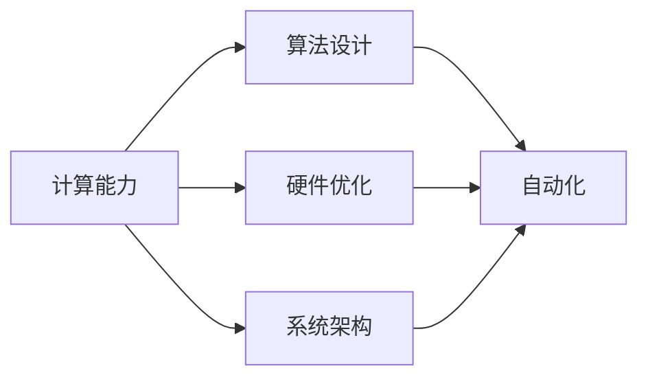
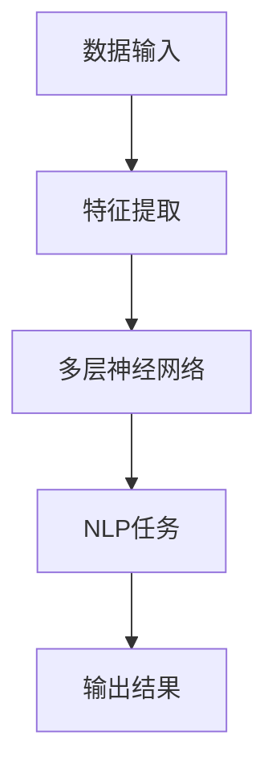
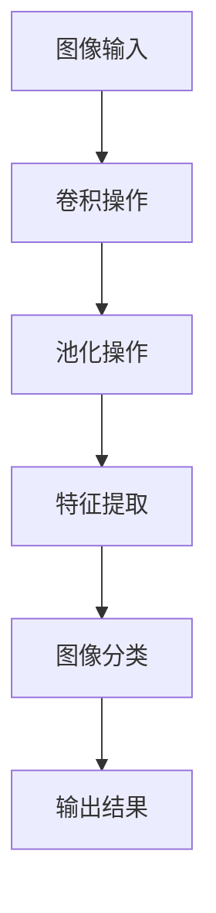
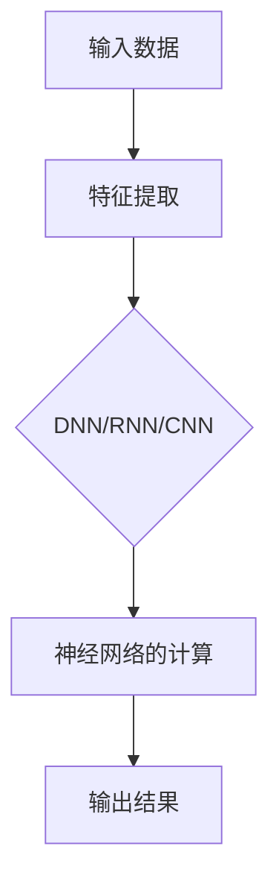

                 

### 1. 背景介绍

#### 1.1 目的和范围

本文旨在深入探讨计算与自动化领域，通过剖析安德烈·卡帕西（Andrej Karpathy）的研究成果，为广大读者提供关于计算与自动化技术的全面视角。安德烈·卡帕西是一位在人工智能和深度学习领域享有盛誉的研究者，其研究涉及计算机视觉、自然语言处理等多个方向。本文将重点关注卡帕西在计算与自动化方面的核心观点和研究成果，旨在帮助读者理解这一领域的最新进展和应用前景。

文章的范围将涵盖以下几个方面：

1. **核心概念与联系**：介绍计算与自动化领域的基本概念，包括其原理和架构，并使用Mermaid流程图进行直观展示。
2. **核心算法原理 & 具体操作步骤**：详细讲解卡帕西在计算与自动化方面的核心算法原理，并使用伪代码阐述其具体操作步骤。
3. **数学模型和公式 & 详细讲解 & 举例说明**：解析卡帕西研究中的数学模型和公式，结合实际案例进行详细讲解。
4. **项目实战：代码实际案例和详细解释说明**：通过实际代码案例，展示计算与自动化的应用过程，并进行深入解读。
5. **实际应用场景**：探讨计算与自动化技术在各个领域的应用，包括工业、医疗、交通等。
6. **工具和资源推荐**：推荐学习资源、开发工具框架和相关论文著作，为读者提供学习与实践的指导。
7. **总结：未来发展趋势与挑战**：总结计算与自动化领域的未来发展趋势和面临的挑战。

#### 1.2 预期读者

本文预期读者为对计算与自动化领域感兴趣的科研人员、工程师和技术爱好者。读者需要对计算机科学和数学有基本的了解，特别是对人工智能和深度学习有一定认识。通过本文的阅读，读者将能够：

1. 掌握计算与自动化领域的基本概念和原理。
2. 理解卡帕西在计算与自动化方面的研究成果和贡献。
3. 学习计算与自动化技术的实际应用案例。
4. 了解该领域的未来发展趋势和挑战。

#### 1.3 文档结构概述

本文结构如下：

1. **背景介绍**：介绍文章的目的和范围，预期读者，文档结构概述。
2. **核心概念与联系**：通过Mermaid流程图直观展示计算与自动化的基本概念和架构。
3. **核心算法原理 & 具体操作步骤**：详细讲解卡帕西在计算与自动化方面的核心算法原理，并使用伪代码阐述其操作步骤。
4. **数学模型和公式 & 详细讲解 & 举例说明**：解析卡帕西研究中的数学模型和公式，结合实际案例进行讲解。
5. **项目实战：代码实际案例和详细解释说明**：展示计算与自动化的实际应用案例，并进行深入解读。
6. **实际应用场景**：探讨计算与自动化技术在各个领域的应用。
7. **工具和资源推荐**：推荐学习资源、开发工具框架和相关论文著作。
8. **总结：未来发展趋势与挑战**：总结计算与自动化领域的未来发展趋势和挑战。
9. **附录：常见问题与解答**：解答读者可能遇到的问题。
10. **扩展阅读 & 参考资料**：提供进一步阅读的资源。

#### 1.4 术语表

为了确保文章内容的清晰和准确，本文定义了一些核心术语，并对相关概念进行解释。

##### 1.4.1 核心术语定义

- **计算与自动化**：计算与自动化是指利用计算机技术实现自动执行任务的过程，包括算法设计、硬件优化和系统架构等多个方面。
- **深度学习**：深度学习是一种基于人工神经网络的机器学习技术，通过多层神经网络的训练，实现对复杂数据的自动特征提取和模式识别。
- **自然语言处理（NLP）**：自然语言处理是指使计算机能够理解、处理和生成自然语言（如英语、中文等）的技术。
- **计算机视觉**：计算机视觉是指使计算机能够像人类一样感知和理解视觉信息的技术。
- **算法**：算法是一系列用于解决问题的步骤和规则，可以应用于计算机程序中。
- **神经网络**：神经网络是一种模拟人脑神经元连接结构的计算模型，用于数据分析和决策。

##### 1.4.2 相关概念解释

- **计算能力**：计算能力是指计算机在单位时间内处理数据的能力，通常用算力（FLOPS）来衡量。
- **自动化**：自动化是指通过程序或算法实现任务的自动执行，减少人工干预。
- **深度神经网络（DNN）**：深度神经网络是一种包含多层神经元的神经网络，能够处理高维数据。
- **卷积神经网络（CNN）**：卷积神经网络是一种专门用于图像识别的神经网络，通过卷积操作提取图像特征。
- **循环神经网络（RNN）**：循环神经网络是一种能够处理序列数据的神经网络，通过记忆状态实现序列信息传递。

##### 1.4.3 缩略词列表

- **NLP**：自然语言处理（Natural Language Processing）
- **CNN**：卷积神经网络（Convolutional Neural Network）
- **RNN**：循环神经网络（Recurrent Neural Network）
- **DNN**：深度神经网络（Deep Neural Network）
- **GPU**：图形处理器（Graphics Processing Unit）
- **FLOPS**：浮点运算次数（Floating-point Operations Per Second）

### 2. 核心概念与联系

在计算与自动化领域，核心概念与联系是理解和应用这些技术的基础。本节将详细阐述这些概念，并通过Mermaid流程图直观展示其架构。

#### 2.1 计算能力与自动化

计算能力是计算与自动化的基础，它决定了计算机处理数据的速度和效率。自动化则是在计算能力的基础上，通过算法和程序实现任务的自动执行。计算能力通常用算力（FLOPS）来衡量，而自动化则涉及算法设计、硬件优化和系统架构等多个方面。

##### Mermaid流程图

#### 2.2 深度学习与自然语言处理

深度学习是计算与自动化领域的关键技术，尤其是在自然语言处理（NLP）领域。深度学习通过多层神经网络实现数据的自动特征提取和模式识别，为NLP提供了强大的工具。

##### Mermaid流程图

#### 2.3 计算机视觉与图像识别

计算机视觉是计算与自动化领域的重要组成部分，它使计算机能够像人类一样感知和理解视觉信息。计算机视觉的核心是图像识别，通过卷积神经网络（CNN）等技术，实现对图像的自动分类和识别。

##### Mermaid流程图

#### 2.4 算法原理与架构

算法是计算与自动化的核心，其原理和架构直接影响系统的性能和效率。常见的算法包括深度神经网络（DNN）、循环神经网络（RNN）和卷积神经网络（CNN）等。

##### Mermaid流程图

通过以上核心概念与联系的介绍和Mermaid流程图的展示，读者可以更好地理解计算与自动化的基本原理和应用。在下一节中，我们将进一步探讨核心算法原理和具体操作步骤。

