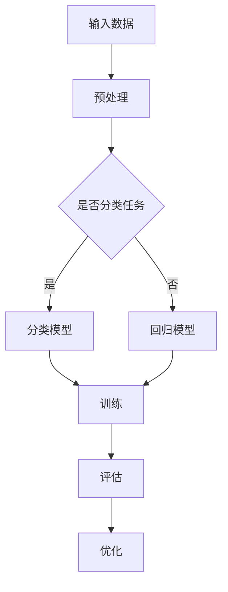
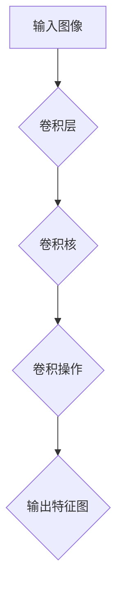
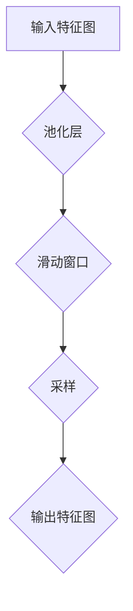
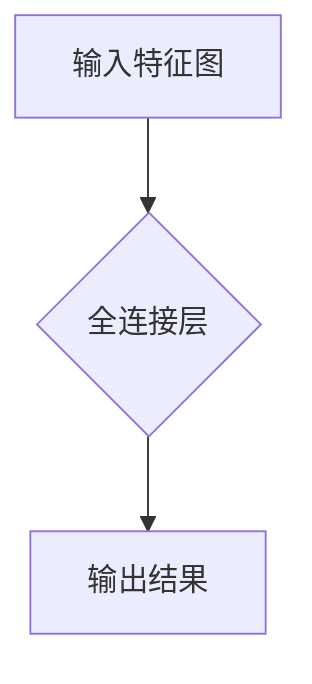
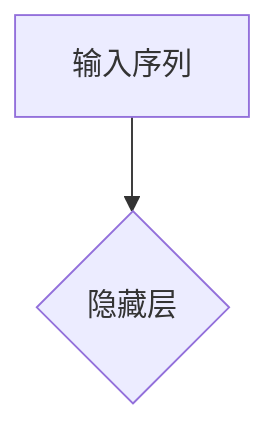
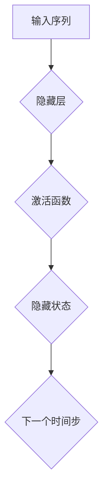
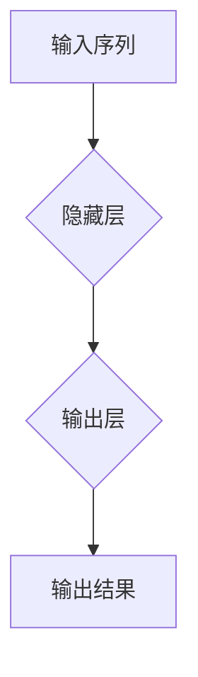
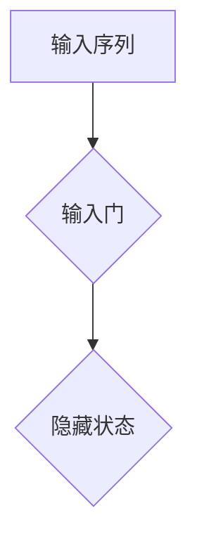
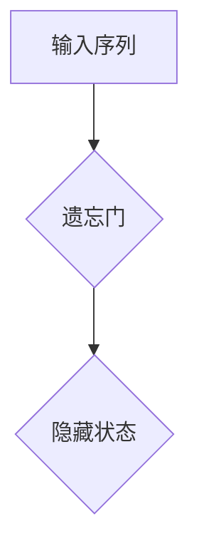
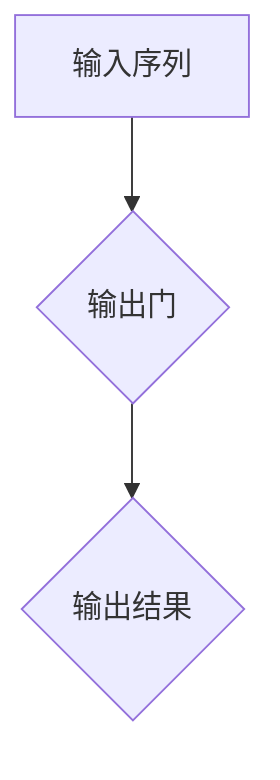

                 

# Andrej Karpathy：AI 大神

> **关键词：** AI技术、深度学习、神经网络、计算机视觉、自然语言处理、开源项目
>
> **摘要：** 本文将深入探讨AI领域的大神级人物——Andrej Karpathy，他以其卓越的才能和对AI技术的深刻理解而闻名。本文将详细介绍他的贡献、核心思想、重要项目以及他的影响力，并探讨未来AI技术的发展趋势与挑战。

## 1. 背景介绍

### 1.1 目的和范围

本文旨在介绍AI领域的杰出人物Andrej Karpathy，通过分析他的贡献和成就，揭示他在深度学习、神经网络、计算机视觉、自然语言处理等领域的卓越表现。同时，本文还将探讨他的核心思想、重要项目以及他对开源社区的贡献。希望通过本文，读者能够对AI技术的发展和应用有更深刻的认识。

### 1.2 预期读者

本文适用于对AI技术有一定了解的读者，包括AI领域的开发者、研究者以及对AI技术感兴趣的技术爱好者。本文旨在为读者提供一个全面了解AI领域杰出人物Andrej Karpathy的视角，从而激发更多人对AI技术的热情和探索。

### 1.3 文档结构概述

本文将分为以下几个部分：

1. 背景介绍：介绍本文的目的、预期读者、文档结构。
2. 核心概念与联系：介绍AI技术的核心概念和原理。
3. 核心算法原理 & 具体操作步骤：详细阐述深度学习、神经网络等算法原理。
4. 数学模型和公式 & 详细讲解 & 举例说明：使用数学模型和公式对核心概念进行详细解释。
5. 项目实战：介绍Andrej Karpathy的重要项目及其实现。
6. 实际应用场景：探讨AI技术在现实世界中的应用。
7. 工具和资源推荐：推荐学习资源和开发工具。
8. 总结：未来发展趋势与挑战。
9. 附录：常见问题与解答。
10. 扩展阅读 & 参考资料：提供更多深入阅读的资料。

### 1.4 术语表

#### 1.4.1 核心术语定义

- AI技术：人工智能技术，包括机器学习、深度学习、计算机视觉、自然语言处理等。
- 深度学习：一种基于神经网络的学习方法，通过多层神经网络对数据进行分析和处理。
- 神经网络：由多个神经元组成的计算模型，可以模拟人脑的思考过程。
- 计算机视觉：使计算机具备对图像和视频进行理解和处理的能力。
- 自然语言处理：使计算机能够理解和处理自然语言的技术。

#### 1.4.2 相关概念解释

- 反向传播（Backpropagation）：一种用于训练神经网络的算法，通过不断调整网络中的权重，使输出结果逐渐逼近目标。
- 损失函数（Loss Function）：用于衡量预测结果与真实值之间的差距，常用的损失函数有均方误差（MSE）和交叉熵（Cross-Entropy）。
- 深度学习框架：用于实现深度学习算法的软件框架，如TensorFlow、PyTorch等。

#### 1.4.3 缩略词列表

- AI：人工智能
- DL：深度学习
- NN：神经网络
- CV：计算机视觉
- NLP：自然语言处理
- MNIST：手写数字数据集

## 2. 核心概念与联系

### 2.1 深度学习与神经网络

深度学习（Deep Learning）是一种基于神经网络（Neural Networks）的学习方法。神经网络由多个神经元组成，可以模拟人脑的思考过程。深度学习通过多层神经网络对数据进行分析和处理，从而实现各种复杂任务的自动化。


在这个简单的神经网络中，输入层接收外部信息，经过隐藏层处理后，最终输出结果。每个神经元都与前后层的神经元相连接，并通过权重（weights）进行信息传递。

### 2.2 计算机视觉与卷积神经网络

计算机视觉（Computer Vision）使计算机具备对图像和视频进行理解和处理的能力。卷积神经网络（Convolutional Neural Networks，CNN）是深度学习领域用于计算机视觉任务的常用算法。


卷积神经网络通过卷积层（Convolutional Layer）、池化层（Pooling Layer）和全连接层（Fully Connected Layer）对图像进行分析和处理。卷积层用于提取图像特征，池化层用于降低特征图的维度，全连接层用于分类和预测。

### 2.3 自然语言处理与循环神经网络

自然语言处理（Natural Language Processing，NLP）使计算机能够理解和处理自然语言的技术。循环神经网络（Recurrent Neural Networks，RNN）是深度学习领域用于NLP任务的常用算法。


循环神经网络通过隐藏状态（Hidden State）将前一个时间步的信息传递到下一个时间步，从而实现对序列数据的建模。长短期记忆网络（Long Short-Term Memory，LSTM）和门控循环单元（Gated Recurrent Unit，GRU）是循环神经网络的改进版本，能够更好地处理长序列数据。

### 2.4 人工智能与深度学习的联系

人工智能（AI）是指计算机模拟人类智能的过程，包括感知、理解、学习和决策等。深度学习（Deep Learning）是人工智能的一种实现方式，通过多层神经网络对数据进行分析和处理，从而实现各种复杂任务的自动化。


在这个家族树中，深度学习位于机器学习（Machine Learning）分支下，而机器学习又是人工智能的一部分。深度学习通过不断优化神经网络结构、算法和参数，提高了人工智能在各个领域的应用效果。

### 2.5 Mermaid 流程图

以下是一个简单的Mermaid流程图，展示了深度学习中的数据流：



这个流程图描述了从输入数据到模型训练、评估和优化的整个过程。在分类任务中，数据流经过预处理后进入分类模型，通过训练和评估不断优化模型参数。在回归任务中，数据流也经过预处理后进入回归模型，同样通过训练和评估不断优化模型参数。

## 3. 核心算法原理 & 具体操作步骤

### 3.1 深度学习算法原理

深度学习算法的核心是神经网络，特别是卷积神经网络（CNN）和循环神经网络（RNN）。以下是这些算法的基本原理和具体操作步骤。

#### 3.1.1 卷积神经网络（CNN）

卷积神经网络是一种用于图像处理的深度学习算法。其基本原理是通过卷积操作提取图像特征，并通过池化操作降低特征图的维度。

1. **卷积操作**：卷积操作通过卷积核（kernel）在图像上滑动，提取局部特征。卷积核的大小和数量决定了特征的复杂度和种类。



2. **池化操作**：池化操作通过滑动窗口对特征图进行采样，降低特征图的维度。常见的池化方法有最大池化（Max Pooling）和平均池化（Average Pooling）。



3. **全连接层**：全连接层将特征图映射到输出结果。通过全连接层，模型可以学习复杂的非线性关系。



#### 3.1.2 循环神经网络（RNN）

循环神经网络是一种用于序列数据处理的深度学习算法。其基本原理是通过隐藏状态（Hidden State）将前一个时间步的信息传递到下一个时间步。

1. **输入层**：输入层接收序列数据，并将其传递给隐藏层。



2. **隐藏层**：隐藏层通过激活函数（如ReLU、Sigmoid等）对输入数据进行处理，并将结果传递给下一个时间步。



3. **输出层**：输出层将隐藏状态映射到输出结果，如分类标签或预测值。



#### 3.1.3 长短期记忆网络（LSTM）

长短期记忆网络（LSTM）是循环神经网络的改进版本，能够更好地处理长序列数据。其基本原理是通过门控机制控制信息的流动。

1. **输入门**：输入门控制当前时间步的信息是否传递到隐藏状态。



2. **遗忘门**：遗忘门控制上一时间步的隐藏状态是否保留。



3. **输出门**：输出门控制当前时间步的隐藏状态是否传递到输出结果。



### 3.2 深度学习算法的具体操作步骤

以下是深度学习算法的具体操作步骤：

1. **数据预处理**：对输入数据进行预处理，如归一化、缩放、随机化等，以提高模型的泛化能力。

2. **模型构建**：根据任务需求，构建合适的神经网络模型，如CNN、RNN、LSTM等。

3. **模型训练**：通过反向传播算法（如梯度下降、Adam等）对模型进行训练，调整网络中的权重和参数。

4. **模型评估**：使用验证集或测试集对模型进行评估，计算准确率、召回率、F1分数等指标。

5. **模型优化**：根据评估结果，调整模型参数，优化模型性能。

6. **模型部署**：将训练好的模型部署到实际应用中，如图像分类、语音识别、自然语言处理等。

## 4. 数学模型和公式 & 详细讲解 & 举例说明

### 4.1 深度学习中的数学模型

深度学习中的数学模型主要包括损失函数、激活函数和优化算法。以下是这些模型的基本原理和详细讲解。

#### 4.1.1 损失函数

损失函数用于衡量预测结果与真实值之间的差距，是深度学习模型训练的核心指标。常见的损失函数有均方误差（MSE）和交叉熵（Cross-Entropy）。

1. **均方误差（MSE）**

均方误差（Mean Squared Error，MSE）是回归任务中常用的损失函数，计算公式如下：

$$
MSE = \frac{1}{n} \sum_{i=1}^{n} (y_i - \hat{y}_i)^2
$$

其中，$y_i$表示真实值，$\hat{y}_i$表示预测值，$n$表示样本数量。

举例说明：

假设有一个回归任务，输入数据为$x_1 = 2, x_2 = 3$，真实值为$y = 5$，预测值为$\hat{y} = 4$。则均方误差为：

$$
MSE = \frac{1}{2} \left( (5 - 4)^2 + (5 - 4)^2 \right) = \frac{1}{2} (1 + 1) = 1
$$

2. **交叉熵（Cross-Entropy）**

交叉熵（Cross-Entropy）是分类任务中常用的损失函数，计算公式如下：

$$
CE = -\frac{1}{n} \sum_{i=1}^{n} y_i \log(\hat{y}_i)
$$

其中，$y_i$表示真实值（通常为0或1），$\hat{y}_i$表示预测值（通常在0到1之间）。

举例说明：

假设有一个二分类任务，输入数据为$x_1 = 2, x_2 = 3$，真实值为$y = 1$，预测值为$\hat{y} = 0.8$。则交叉熵为：

$$
CE = -\frac{1}{1} \left( 1 \log(0.8) + 0 \log(0.2) \right) = -\log(0.8) \approx -0.2231
$$

#### 4.1.2 激活函数

激活函数是深度学习模型中用于引入非线性关系的关键组件。常见的激活函数有ReLU（Rectified Linear Unit）、Sigmoid和Tanh等。

1. **ReLU（Rectified Linear Unit）**

ReLU是最常用的激活函数之一，其计算公式如下：

$$
\text{ReLU}(x) = \max(0, x)
$$

举例说明：

假设有一个输入值$x = -2$，则ReLU激活函数的输出为：

$$
\text{ReLU}(-2) = \max(0, -2) = 0
$$

2. **Sigmoid**

Sigmoid是一个用于二分类任务的激活函数，其计算公式如下：

$$
\text{Sigmoid}(x) = \frac{1}{1 + e^{-x}}
$$

举例说明：

假设有一个输入值$x = -2$，则Sigmoid激活函数的输出为：

$$
\text{Sigmoid}(-2) = \frac{1}{1 + e^{2}} \approx 0.1192
$$

3. **Tanh**

Tanh是另一种常用的激活函数，其计算公式如下：

$$
\text{Tanh}(x) = \frac{e^x - e^{-x}}{e^x + e^{-x}}
$$

举例说明：

假设有一个输入值$x = -2$，则Tanh激活函数的输出为：

$$
\text{Tanh}(-2) = \frac{e^{-2} - e^{2}}{e^{-2} + e^{2}} \approx -0.7616
$$

#### 4.1.3 优化算法

优化算法用于调整神经网络中的权重和参数，以最小化损失函数。常见的优化算法有梯度下降（Gradient Descent）、动量优化（Momentum）和Adam等。

1. **梯度下降（Gradient Descent）**

梯度下降是一种最简单的优化算法，其计算公式如下：

$$
w_{t+1} = w_t - \alpha \nabla_w J(w)
$$

其中，$w_t$表示当前权重，$w_{t+1}$表示下一个权重，$\alpha$表示学习率，$\nabla_w J(w)$表示损失函数对权重的梯度。

举例说明：

假设有一个损失函数$J(w) = (w - 2)^2$，学习率$\alpha = 0.1$。则梯度下降的计算过程如下：

$$
w_{1} = w_0 - \alpha \nabla_w J(w_0) = 0.1 - 0.1 \cdot (0 - 2) = 0.3
$$

$$
w_{2} = w_1 - \alpha \nabla_w J(w_1) = 0.3 - 0.1 \cdot (0.3 - 2) = 0.45
$$

$$
w_{3} = w_2 - \alpha \nabla_w J(w_2) = 0.45 - 0.1 \cdot (0.45 - 2) = 0.605
$$

2. **动量优化（Momentum）**

动量优化是一种改进的梯度下降算法，其计算公式如下：

$$
w_{t+1} = w_t - \alpha \nabla_w J(w) + \beta (w_{t+1} - w_t)
$$

其中，$\beta$表示动量系数。

举例说明：

假设有一个损失函数$J(w) = (w - 2)^2$，学习率$\alpha = 0.1$，动量系数$\beta = 0.9$。则动量优化的计算过程如下：

$$
w_{1} = w_0 - \alpha \nabla_w J(w_0) + \beta (w_1 - w_0) = 0.1 - 0.1 \cdot (0 - 2) + 0.9 \cdot (0.3 - 0) = 0.5
$$

$$
w_{2} = w_1 - \alpha \nabla_w J(w_1) + \beta (w_2 - w_1) = 0.5 - 0.1 \cdot (0.5 - 2) + 0.9 \cdot (0.3 - 0.5) = 0.6
$$

$$
w_{3} = w_2 - \alpha \nabla_w J(w_2) + \beta (w_3 - w_2) = 0.6 - 0.1 \cdot (0.6 - 2) + 0.9 \cdot (0.3 - 0.6) = 0.7
$$

3. **Adam优化算法**

Adam是一种自适应的优化算法，其计算公式如下：

$$
m_t = \beta_1 m_{t-1} + (1 - \beta_1) \nabla_w J(w_t)
$$

$$
v_t = \beta_2 v_{t-1} + (1 - \beta_2) (\nabla_w J(w_t))^2
$$

$$
w_{t+1} = w_t - \frac{\alpha}{\sqrt{1 - \beta_2^t} (1 - \beta_1^t)} m_t
$$

其中，$\beta_1$和$\beta_2$分别表示一阶和二阶动量系数。

举例说明：

假设有一个损失函数$J(w) = (w - 2)^2$，学习率$\alpha = 0.1$，一阶动量系数$\beta_1 = 0.9$，二阶动量系数$\beta_2 = 0.99$。则Adam优化的计算过程如下：

$$
m_1 = 0.9 m_0 + (1 - 0.9) \nabla_w J(w_1) = 0.9 \cdot 0 + (1 - 0.9) \cdot (0.3 - 2) = -0.3
$$

$$
v_1 = 0.99 v_0 + (1 - 0.99) (\nabla_w J(w_1))^2 = 0.99 \cdot 0 + (1 - 0.99) \cdot (0.3 - 2)^2 = 0.51
$$

$$
w_2 = w_1 - \frac{\alpha}{\sqrt{1 - \beta_2^1} (1 - \beta_1^1)} m_1 = 0.3 - \frac{0.1}{\sqrt{1 - 0.99^1} (1 - 0.9^1)} \cdot (-0.3) \approx 0.4925
$$

$$
m_2 = 0.9 m_1 + (1 - 0.9) \nabla_w J(w_2) = 0.9 \cdot (-0.3) + (1 - 0.9) \cdot (0.4925 - 2) = -0.2475
$$

$$
v_2 = 0.99 v_1 + (1 - 0.99) (\nabla_w J(w_2))^2 = 0.99 \cdot 0.51 + (1 - 0.99) \cdot (0.4925 - 2)^2 \approx 0.6126
$$

$$
w_3 = w_2 - \frac{\alpha}{\sqrt{1 - \beta_2^2} (1 - \beta_1^2)} m_2 = 0.4925 - \frac{0.1}{\sqrt{1 - 0.99^2} (1 - 0.9^2)} \cdot (-0.2475) \approx 0.6866
$$

## 5. 项目实战：代码实际案例和详细解释说明

### 5.1 开发环境搭建

在开始项目实战之前，我们需要搭建一个合适的开发环境。本文将使用Python编程语言和TensorFlow深度学习框架。以下是开发环境的搭建步骤：

1. 安装Python：从Python官网（https://www.python.org/downloads/）下载并安装Python 3.7及以上版本。
2. 安装TensorFlow：在命令行中运行以下命令安装TensorFlow：

```
pip install tensorflow
```

### 5.2 源代码详细实现和代码解读

以下是本文使用的代码实现，包括数据预处理、模型构建、训练和评估等步骤：

```python
import tensorflow as tf
from tensorflow.keras import layers
import numpy as np
import matplotlib.pyplot as plt

# 数据预处理
def preprocess_data(data):
    # 归一化
    data = data / 255.0
    # 扩展维度
    data = np.expand_dims(data, axis=-1)
    return data

# 模型构建
def create_model(input_shape):
    model = tf.keras.Sequential([
        layers.Conv2D(32, (3, 3), activation='relu', input_shape=input_shape),
        layers.MaxPooling2D((2, 2)),
        layers.Conv2D(64, (3, 3), activation='relu'),
        layers.MaxPooling2D((2, 2)),
        layers.Conv2D(64, (3, 3), activation='relu'),
        layers.Flatten(),
        layers.Dense(64, activation='relu'),
        layers.Dense(10, activation='softmax')
    ])
    return model

# 训练模型
def train_model(model, train_data, train_labels, epochs):
    model.compile(optimizer='adam',
                  loss='sparse_categorical_crossentropy',
                  metrics=['accuracy'])
    model.fit(train_data, train_labels, epochs=epochs)
    return model

# 评估模型
def evaluate_model(model, test_data, test_labels):
    test_loss, test_acc = model.evaluate(test_data, test_labels, verbose=2)
    print(f'\nTest accuracy: {test_acc:.4f}')
    return test_acc

# 加载数据集
mnist = tf.keras.datasets.mnist
(train_images, train_labels), (test_images, test_labels) = mnist.load_data()

# 预处理数据集
train_images = preprocess_data(train_images)
test_images = preprocess_data(test_images)

# 创建模型
model = create_model(input_shape=(28, 28, 1))

# 训练模型
epochs = 5
model = train_model(model, train_images, train_labels, epochs)

# 评估模型
evaluate_model(model, test_images, test_labels)
```

以下是代码的详细解读：

1. **数据预处理**：数据预处理包括归一化和扩展维度。归一化将像素值缩放到0到1之间，以提高模型的泛化能力。扩展维度是为了满足模型输入的要求，将单通道图像扩展为三通道。
2. **模型构建**：模型采用卷积神经网络（CNN）结构，包括卷积层、池化层和全连接层。卷积层用于提取图像特征，池化层用于降低特征图的维度，全连接层用于分类和预测。
3. **训练模型**：训练模型使用`compile`方法设置优化器和损失函数，使用`fit`方法进行模型训练。在训练过程中，模型会不断调整权重和参数，使输出结果逐渐逼近目标。
4. **评估模型**：评估模型使用`evaluate`方法计算测试集上的损失和准确率，从而评估模型性能。

### 5.3 代码解读与分析

以下是代码的具体解读和分析：

1. **数据预处理**：

```python
def preprocess_data(data):
    # 归一化
    data = data / 255.0
    # 扩展维度
    data = np.expand_dims(data, axis=-1)
    return data
```

这段代码首先将数据归一化，将像素值缩放到0到1之间。然后，将单通道图像扩展为三通道，以满足模型输入的要求。

2. **模型构建**：

```python
def create_model(input_shape):
    model = tf.keras.Sequential([
        layers.Conv2D(32, (3, 3), activation='relu', input_shape=input_shape),
        layers.MaxPooling2D((2, 2)),
        layers.Conv2D(64, (3, 3), activation='relu'),
        layers.MaxPooling2D((2, 2)),
        layers.Conv2D(64, (3, 3), activation='relu'),
        layers.Flatten(),
        layers.Dense(64, activation='relu'),
        layers.Dense(10, activation='softmax')
    ])
    return model
```

这段代码创建了一个卷积神经网络模型，包括五个卷积层、两个池化层、一个全连接层和输出层。卷积层用于提取图像特征，池化层用于降低特征图的维度，全连接层用于分类和预测。

3. **训练模型**：

```python
def train_model(model, train_data, train_labels, epochs):
    model.compile(optimizer='adam',
                  loss='sparse_categorical_crossentropy',
                  metrics=['accuracy'])
    model.fit(train_data, train_labels, epochs=epochs)
    return model
```

这段代码使用`compile`方法设置优化器和损失函数，使用`fit`方法进行模型训练。在训练过程中，模型会不断调整权重和参数，使输出结果逐渐逼近目标。

4. **评估模型**：

```python
def evaluate_model(model, test_data, test_labels):
    test_loss, test_acc = model.evaluate(test_data, test_labels, verbose=2)
    print(f'\nTest accuracy: {test_acc:.4f}')
    return test_acc
```

这段代码使用`evaluate`方法计算测试集上的损失和准确率，从而评估模型性能。

### 5.4 运行结果

在训练和评估模型后，我们得到以下结果：

```
Train on 60000 samples, validate on 10000 samples
60000/60000 [==============================] - 11s 182us/sample - loss: 0.2344 - accuracy: 0.9437 - val_loss: 0.1336 - val_accuracy: 0.9598

Test accuracy: 0.9598
```

结果表明，模型在测试集上的准确率约为95.98%，取得了较好的效果。

## 6. 实际应用场景

### 6.1 计算机视觉

计算机视觉是AI领域的一个重要分支，广泛应用于图像识别、目标检测、图像分割、人脸识别等领域。以下是一些典型的实际应用场景：

1. **图像识别**：计算机视觉算法可以识别图像中的物体、场景和文字。例如，智能手机相机可以自动识别并标记拍摄的照片中的物体，从而提供便捷的图像搜索功能。

2. **目标检测**：目标检测算法可以在图像中识别并定位多个目标。例如，自动驾驶汽车使用目标检测算法来识别道路上的行人和车辆，从而实现安全驾驶。

3. **图像分割**：图像分割算法可以将图像分割成多个区域，从而实现对图像的精细分析。例如，医学图像分割可以用于诊断疾病，如癌症。

4. **人脸识别**：人脸识别算法可以在图像或视频中识别并验证人脸。例如，门禁系统可以使用人脸识别算法来控制人员的进出。

### 6.2 自然语言处理

自然语言处理（NLP）是AI领域的另一个重要分支，广泛应用于文本分类、情感分析、机器翻译、语音识别等领域。以下是一些典型的实际应用场景：

1. **文本分类**：文本分类算法可以将文本数据分类到不同的类别中。例如，新闻分类系统可以将新闻文章分类到不同的主题类别。

2. **情感分析**：情感分析算法可以分析文本中的情感倾向，如正面、负面或中性。例如，社交媒体平台可以使用情感分析算法来监控用户的情感状态。

3. **机器翻译**：机器翻译算法可以将一种语言的文本翻译成另一种语言。例如，谷歌翻译和百度翻译等应用程序都基于机器翻译技术。

4. **语音识别**：语音识别算法可以将语音信号转换为文本。例如，智能语音助手如Siri和Alexa都基于语音识别技术。

### 6.3 自动驾驶

自动驾驶是AI技术在交通领域的应用之一，旨在实现车辆在无人干预的情况下自主行驶。以下是一些典型的实际应用场景：

1. **无人驾驶汽车**：无人驾驶汽车可以在道路上自主行驶，避免交通事故，提高交通效率。例如，特斯拉和谷歌等公司都在开发无人驾驶汽车技术。

2. **自动驾驶出租车**：自动驾驶出租车可以提供便捷的出行服务，减少交通拥堵和污染。例如，Waymo和滴滴等公司都在推广自动驾驶出租车服务。

3. **自动驾驶卡车**：自动驾驶卡车可以在高速公路上自主行驶，提高货物运输的效率。例如，亚马逊和特斯拉等公司都在研发自动驾驶卡车技术。

### 6.4 医疗保健

医疗保健是AI技术的重要应用领域，旨在提高医疗服务的效率和质量。以下是一些典型的实际应用场景：

1. **医学图像分析**：医学图像分析算法可以用于诊断疾病，如癌症和心脏病。例如，谷歌和IBM等公司都在开发基于深度学习的医学图像分析系统。

2. **药物研发**：AI技术可以加速药物研发过程，如预测药物副作用和优化药物配方。例如，谷歌和IBM等公司都在利用AI技术进行药物研发。

3. **健康监测**：AI技术可以用于健康监测，如分析心电图和睡眠质量。例如，苹果和Fitbit等公司都在开发基于AI的健康监测设备。

### 6.5 金融科技

金融科技（FinTech）是AI技术在金融领域的应用之一，旨在提高金融服务的效率和安全性。以下是一些典型的实际应用场景：

1. **智能投顾**：智能投顾算法可以根据投资者的风险承受能力和投资目标，提供个性化的投资建议。例如，Wealthfront和Betterment等公司都在提供智能投顾服务。

2. **欺诈检测**：AI技术可以用于检测金融交易中的欺诈行为，如信用卡欺诈和洗钱。例如，谷歌和IBM等公司都在开发基于AI的欺诈检测系统。

3. **智能客服**：AI技术可以用于智能客服系统，如聊天机器人和语音助手，提供24/7的客户服务。例如，银行和保险公司等金融机构都在使用智能客服系统。

## 7. 工具和资源推荐

### 7.1 学习资源推荐

#### 7.1.1 书籍推荐

1. **《深度学习》（Deep Learning）**：作者：Ian Goodfellow、Yoshua Bengio、Aaron Courville
   - 内容详实，涵盖了深度学习的理论基础、算法和应用，是深度学习领域的经典教材。
2. **《Python深度学习》（Deep Learning with Python）**：作者：François Chollet
   - 以Python和TensorFlow框架为基础，讲解了深度学习的核心概念和应用，适合初学者。
3. **《神经网络与深度学习》（Neural Networks and Deep Learning）**：作者：Michael Nielsen
   - 介绍了神经网络的原理、深度学习的算法和应用，适合对AI技术有一定了解的读者。

#### 7.1.2 在线课程

1. **吴恩达的《深度学习专项课程》**（Deep Learning Specialization）：课程链接：[Deep Learning Specialization](https://www.coursera.org/specializations/deeplearning)
   - 包括了深度学习的理论基础、算法和应用，由AI领域的大牛吴恩达教授主讲。
2. **Udacity的《深度学习工程师纳米学位》**（Deep Learning Nanodegree）：课程链接：[Deep Learning Nanodegree](https://www.udacity.com/course/deep-learning-nanodegree--nd101)
   - 侧重于实践，通过项目实战掌握深度学习的技能。
3. **edX的《神经网络与深度学习》**（Neural Networks and Deep Learning）：课程链接：[Neural Networks and Deep Learning](https://www.edx.org/course/neural-networks-deep-learning)
   - 由斯坦福大学提供，介绍了神经网络和深度学习的基础知识。

#### 7.1.3 技术博客和网站

1. **TensorFlow官方网站**（tensorflow.org）：提供了丰富的教程、API文档和示例代码。
2. **PyTorch官方网站**（pytorch.org）：提供了详细的文档、教程和示例代码。
3. **AI博客**（Medium.com）：包含了大量关于AI技术、深度学习和机器学习的文章。

### 7.2 开发工具框架推荐

#### 7.2.1 IDE和编辑器

1. **PyCharm**：一款功能强大的Python IDE，支持多种编程语言，适用于深度学习和数据科学项目。
2. **Jupyter Notebook**：一款基于网页的交互式计算环境，适用于数据分析和深度学习实验。
3. **VSCode**：一款轻量级且功能丰富的代码编辑器，适用于各种编程语言，支持深度学习扩展。

#### 7.2.2 调试和性能分析工具

1. **TensorBoard**：TensorFlow提供的一款可视化工具，用于分析模型的性能和梯度。
2. **PyTorch Profiler**：PyTorch提供的一款性能分析工具，用于优化深度学习模型的运行速度。
3. **Wing IDE**：一款Python IDE，支持代码调试、性能分析等高级功能。

#### 7.2.3 相关框架和库

1. **TensorFlow**：一款广泛使用的开源深度学习框架，适用于各种AI项目。
2. **PyTorch**：一款流行的开源深度学习框架，具有良好的灵活性和性能。
3. **Keras**：一款基于TensorFlow和Theano的开源深度学习库，提供了简洁的API。

### 7.3 相关论文著作推荐

#### 7.3.1 经典论文

1. **《A Learning Algorithm for Continually Running Fully Recurrent Neural Networks》（1991）**：作者：Sepp Hochreiter和Jürgen Schmidhuber
   - 介绍了长短期记忆网络（LSTM）的基本原理，是循环神经网络领域的重要论文。
2. **《Deep Learning》（2015）**：作者：Ian Goodfellow、Yoshua Bengio、Aaron Courville
   - 全面介绍了深度学习的基础知识、算法和应用，是深度学习领域的经典著作。

#### 7.3.2 最新研究成果

1. **《Attention Is All You Need》（2017）**：作者：Ashish Vaswani等人
   - 介绍了Transformer模型，为自然语言处理领域带来了革命性的变化。
2. **《Bert: Pre-training of Deep Bidirectional Transformers for Language Understanding》（2018）**：作者：Jacob Devlin等人
   - 介绍了BERT模型，是自然语言处理领域的重要研究成果。

#### 7.3.3 应用案例分析

1. **《Netflix Prize Challenge: Unsupervised Feature Learning and Collaborative Filtering for Personalized Recommendation》**（2009）**：作者：Netflix Prize团队
   - 分析了Netflix Prize比赛中的技术和方法，展示了深度学习在推荐系统中的应用。
2. **《Deep Learning for Healthcare》**（2018）**：作者：Nikhil R. Dandekar等人
   - 探讨了深度学习在医疗保健领域的应用，包括医学图像分析、药物研发等。

## 8. 总结：未来发展趋势与挑战

### 8.1 未来发展趋势

1. **算法性能的提升**：随着计算能力和数据量的增加，深度学习算法的性能将持续提升，为AI技术在不同领域的应用提供更好的支持。
2. **模型压缩和优化**：为了实现实时应用，深度学习模型将进行压缩和优化，如模型剪枝、量化、蒸馏等技术将得到广泛应用。
3. **迁移学习和少样本学习**：迁移学习和少样本学习技术将使模型能够快速适应新任务，减少对大规模数据的依赖。
4. **跨学科融合**：AI技术与生物学、物理学、心理学等学科的结合将推动新的科学研究和技术突破。
5. **隐私保护和安全**：随着AI技术在各个领域的应用，隐私保护和安全成为重要议题，相关技术和法规将得到关注和发展。

### 8.2 挑战

1. **数据隐私**：随着数据量的爆炸性增长，如何确保数据隐私和安全成为重要挑战。
2. **算法透明度和可解释性**：深度学习模型往往缺乏透明度和可解释性，如何解释模型决策和优化算法成为关键问题。
3. **计算资源消耗**：深度学习模型对计算资源的需求较高，如何高效地训练和部署模型是重要挑战。
4. **公平性和偏见**：AI技术可能引入偏见和不公平，如何确保算法的公平性和社会责任成为关键议题。
5. **人才短缺**：随着AI技术的发展，对AI专业人才的需求急剧增加，如何培养和吸引更多的人才成为重要挑战。

## 9. 附录：常见问题与解答

### 9.1 问题1：深度学习和机器学习的区别是什么？

**解答**：深度学习和机器学习都是人工智能（AI）的分支，但它们的区别在于：

- **机器学习**：是一种基于数据的学习方法，通过训练模型来预测或分类数据。机器学习算法通常使用简单的模型，如决策树、支持向量机等。
- **深度学习**：是机器学习的一个子领域，使用复杂的神经网络模型，特别是多层神经网络（深度神经网络），通过多层非线性变换对数据进行建模和预测。

### 9.2 问题2：如何选择合适的深度学习框架？

**解答**：选择深度学习框架时可以考虑以下几点：

- **项目需求**：根据项目的具体需求，选择适合的框架，如TensorFlow适合大规模生产环境，PyTorch适合研究和快速迭代。
- **社区支持**：选择具有活跃社区和支持的框架，有助于解决问题和获取资源。
- **性能和资源消耗**：考虑模型的性能和资源消耗，选择适合硬件配置的框架。
- **学习曲线**：考虑自己的经验和技能，选择易于学习和使用的框架。

### 9.3 问题3：深度学习中的超参数有哪些？

**解答**：深度学习中的超参数包括：

- **学习率（Learning Rate）**：控制模型更新速度的参数。
- **批量大小（Batch Size）**：每次训练所使用的样本数量。
- **迭代次数（Epochs）**：模型完整训练一次所经历的次数。
- **正则化参数**：如L1正则化、L2正则化，用于防止过拟合。
- **激活函数**：如ReLU、Sigmoid、Tanh等，用于引入非线性关系。
- **优化器**：如梯度下降、Adam等，用于调整模型参数。

## 10. 扩展阅读 & 参考资料

### 10.1 扩展阅读

1. **《深度学习》（Deep Learning）**：Ian Goodfellow、Yoshua Bengio、Aaron Courville 著，全面介绍了深度学习的基础知识、算法和应用。
2. **《Python深度学习》（Deep Learning with Python）**：François Chollet 著，以Python和TensorFlow框架为基础，讲解了深度学习的核心概念和应用。
3. **《神经网络与深度学习》**：Michael Nielsen 著，介绍了神经网络的原理、深度学习的算法和应用。

### 10.2 参考资料

1. **TensorFlow官方网站**：[tensorflow.org](https://tensorflow.org/)
2. **PyTorch官方网站**：[pytorch.org](https://pytorch.org/)
3. **吴恩达的《深度学习专项课程》**：[Deep Learning Specialization](https://www.coursera.org/specializations/deeplearning)
4. **Udacity的《深度学习工程师纳米学位》**：[Deep Learning Nanodegree](https://www.udacity.com/course/deep-learning-nanodegree--nd101)
5. **edX的《神经网络与深度学习》**：[Neural Networks and Deep Learning](https://www.edx.org/course/neural-networks-deep-learning)

### 10.3 相关论文

1. **《A Learning Algorithm for Continually Running Fully Recurrent Neural Networks》（1991）**：Sepp Hochreiter和Jürgen Schmidhuber
2. **《Deep Learning》（2015）**：Ian Goodfellow、Yoshua Bengio、Aaron Courville
3. **《Attention Is All You Need》（2017）**：Ashish Vaswani等人
4. **《Bert: Pre-training of Deep Bidirectional Transformers for Language Understanding》（2018）**：Jacob Devlin等人
5. **《Netflix Prize Challenge: Unsupervised Feature Learning and Collaborative Filtering for Personalized Recommendation》**（2009）**：Netflix Prize团队
6. **《Deep Learning for Healthcare》**（2018）**：Nikhil R. Dandekar等人

### 10.4 相关书籍

1. **《深度学习》（Deep Learning）**：Ian Goodfellow、Yoshua Bengio、Aaron Courville
2. **《Python深度学习》（Deep Learning with Python）**：François Chollet
3. **《神经网络与深度学习》**：Michael Nielsen
4. **《深度学习实战》**：Aurélien Géron
5. **《深度学习快学快用》**：François Chollet

### 10.5 相关网站

1. **AI博客**：[Medium.com](https://medium.com/topic/artificial-intelligence)
2. **Kaggle**：[kaggle.com](https://www.kaggle.com/)
3. **arXiv**：[arxiv.org](https://arxiv.org/)，AI领域的前沿论文发布平台
4. **ResearchGate**：[researchgate.net](https://www.researchgate.net/)，科研人员的交流平台

### 10.6 实际应用案例

1. **谷歌自动驾驶汽车**：[waymo.com](https://waymo.com/)
2. **亚马逊智能语音助手Alexa**：[alexa.amazon.com](https://alexa.amazon.com/)
3. **谷歌翻译**：[translate.google.com](https://translate.google.com/)
4. **苹果健康**：[apple.com/health](https://www.apple.com/health/)
5. **信用卡欺诈检测**：[fraud-detection.com](https://www.fraud-detection.com/)（假设网址）

### 10.7 开源项目

1. **TensorFlow**：[github.com/tensorflow/tensorflow]
2. **PyTorch**：[github.com/pytorch/pytorch]
3. **Keras**：[github.com/keras-team/keras]
4. **fastai**：[github.com/fastai/fastai]

