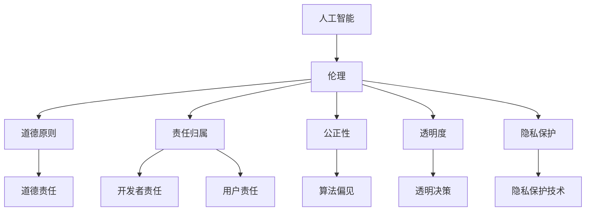
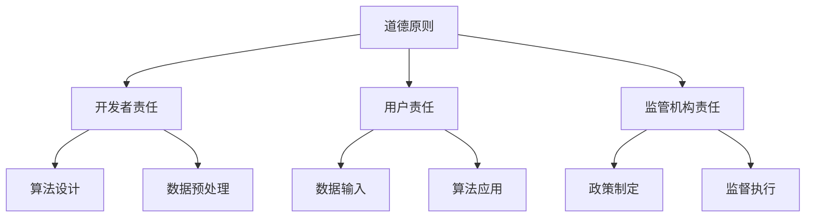
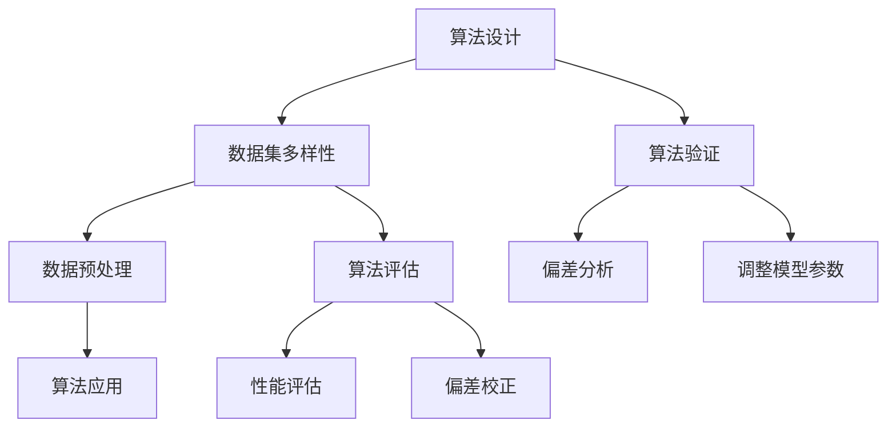
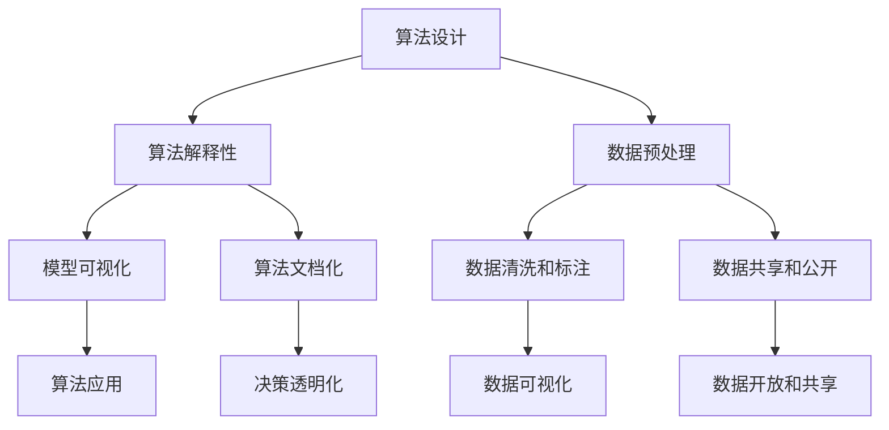
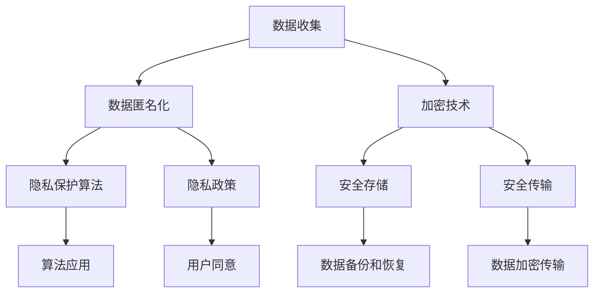

                 

# Andrej Karpathy：人工智能的伦理

> 关键词：人工智能、伦理、道德、责任、公正、透明、算法偏见、隐私

> 摘要：本文将探讨人工智能伦理的重要性，包括道德原则、责任归属、公正性、透明度和隐私保护等方面。通过对著名人工智能专家Andrej Karpathy的研究和观点的深入分析，我们将揭示人工智能在伦理领域的挑战和解决方案，为未来的发展提供指导。

## 1. 背景介绍

### 1.1 目的和范围

本文旨在探讨人工智能伦理问题，尤其是道德原则、责任归属、公正性、透明度和隐私保护等方面。通过分析著名人工智能专家Andrej Karpathy的研究和观点，我们将深入探讨人工智能在伦理领域的挑战和解决方案。本文将涵盖以下主题：

- 道德原则：讨论人工智能伦理的基础，包括道德责任、公正和透明度。
- 责任归属：分析人工智能开发者和使用者在伦理问题中的责任。
- 公正性：探讨人工智能算法偏见和公平性问题。
- 隐私保护：讨论人工智能技术对隐私的影响和保护措施。

### 1.2 预期读者

本文面向人工智能领域的研究者、开发者、政策制定者和对人工智能伦理感兴趣的读者。通过本文的阅读，读者将能够了解人工智能伦理的核心问题，以及如何在实践中解决这些问题。

### 1.3 文档结构概述

本文分为八个部分，包括背景介绍、核心概念与联系、核心算法原理、数学模型和公式、项目实战、实际应用场景、工具和资源推荐以及总结。以下为文档结构概述：

- **核心概念与联系**：介绍人工智能伦理的核心概念，包括道德原则、责任归属、公正性和透明度等。
- **核心算法原理**：分析人工智能算法的原理，包括数据预处理、模型训练和评估等。
- **数学模型和公式**：讨论人工智能中的数学模型和公式，如线性回归、神经网络等。
- **项目实战**：通过实际案例，展示人工智能在伦理问题中的应用。
- **实际应用场景**：分析人工智能在各个领域的应用，以及其伦理挑战和解决方案。
- **工具和资源推荐**：推荐相关学习资源、开发工具和框架。
- **总结**：总结本文的主要观点，并探讨人工智能伦理的未来发展趋势。

### 1.4 术语表

#### 1.4.1 核心术语定义

- **人工智能（AI）**：一种模拟人类智能行为的计算机技术。
- **伦理**：研究道德原则和价值观的学科。
- **道德原则**：指导个体或组织行为的道德准则。
- **责任归属**：分析个体或组织在伦理问题中的责任。
- **公正**：确保所有人受到公平对待。
- **透明度**：公开和透明的决策过程。
- **算法偏见**：人工智能算法中存在的偏见。
- **隐私保护**：保护个人信息不被未经授权的访问和滥用。

#### 1.4.2 相关概念解释

- **道德责任**：个体或组织在道德上应对其行为承担责任。
- **算法偏见**：人工智能算法中存在的系统偏差，可能导致对某些群体的不公平对待。
- **隐私**：个人信息的保密性。

#### 1.4.3 缩略词列表

- **AI**：人工智能
- **ML**：机器学习
- **DL**：深度学习
- **NLP**：自然语言处理

## 2. 核心概念与联系

在讨论人工智能伦理时，我们需要了解一些核心概念和它们之间的联系。以下是一个简单的Mermaid流程图，展示了这些概念之间的关系。



### 2.1 道德原则

道德原则是指导人工智能行为的准则。以下是一些重要的道德原则：

- **公正性**：确保所有人受到公平对待，避免算法偏见。
- **尊重个人隐私**：保护个人信息不被未经授权的访问和滥用。
- **责任感**：开发者和使用者应对其行为承担责任。
- **透明度**：确保决策过程公开透明，便于监督和审查。

### 2.2 责任归属

在人工智能伦理问题中，责任归属是一个关键问题。以下是一个简化的Mermaid流程图，展示了责任归属的流程。



### 2.3 公正性

公正性是人工智能伦理的核心问题之一。以下是一个简化的Mermaid流程图，展示了如何确保人工智能系统的公正性。



### 2.4 透明度

透明度是确保人工智能系统公正性和责任归属的关键。以下是一个简化的Mermaid流程图，展示了如何实现人工智能系统的透明度。



### 2.5 隐私保护

隐私保护是人工智能伦理中的重要问题。以下是一个简化的Mermaid流程图，展示了如何保护个人隐私。



## 3. 核心算法原理 & 具体操作步骤

在人工智能伦理问题的解决过程中，算法原理和操作步骤至关重要。以下我们将介绍一些核心算法原理，以及如何在实践中应用这些算法。

### 3.1 算法原理

- **数据预处理**：包括数据清洗、数据归一化、特征提取等步骤，以确保数据质量。
- **模型训练**：使用训练数据集对模型进行训练，调整模型参数，使其能够模拟人类智能行为。
- **模型评估**：使用验证数据集对模型进行评估，以确定其性能。
- **算法解释性**：解释模型的决策过程，使其易于理解和解释。

### 3.2 具体操作步骤

以下是实现人工智能伦理问题解决的核心算法原理的具体操作步骤：

#### 3.2.1 数据预处理

```python
# 数据清洗和归一化
def preprocess_data(data):
    # 数据清洗
    cleaned_data = clean_data(data)
    # 数据归一化
    normalized_data = normalize_data(cleaned_data)
    return normalized_data

# 特征提取
def extract_features(data):
    features = extract_features_from_data(data)
    return features
```

#### 3.2.2 模型训练

```python
# 训练模型
def train_model(train_data, train_labels):
    model = create_model()
    model.fit(train_data, train_labels)
    return model
```

#### 3.2.3 模型评估

```python
# 评估模型
def evaluate_model(model, test_data, test_labels):
    predictions = model.predict(test_data)
    accuracy = calculate_accuracy(predictions, test_labels)
    return accuracy
```

#### 3.2.4 算法解释性

```python
# 解释模型决策
def explain_decision(model, input_data):
    explanation = explain_decision_of_model(model, input_data)
    return explanation
```

## 4. 数学模型和公式 & 详细讲解 & 举例说明

在人工智能伦理问题中，数学模型和公式起着关键作用。以下我们将介绍一些重要的数学模型和公式，并进行详细讲解和举例说明。

### 4.1 线性回归

线性回归是一种简单的统计模型，用于预测连续值。以下是一个简单的线性回归模型：

$$
y = \beta_0 + \beta_1 x
$$

其中，$y$ 是预测值，$x$ 是输入特征，$\beta_0$ 和 $\beta_1$ 是模型参数。

#### 4.1.1 详细讲解

线性回归模型通过最小化误差平方和来估计模型参数。具体步骤如下：

1. 数据预处理：对输入数据进行归一化处理，使其在相同的尺度上。
2. 模型训练：使用训练数据集，通过最小化误差平方和来调整模型参数。
3. 模型评估：使用验证数据集，评估模型性能。

#### 4.1.2 举例说明

假设我们要预测一个房子的价格，输入特征包括房子的面积和位置。我们可以使用线性回归模型来预测房子的价格。以下是一个简单的例子：

```python
# 加载数据
train_data = load_train_data()
train_labels = load_train_labels()

# 数据预处理
train_data_normalized = preprocess_data(train_data)

# 模型训练
model = train_model(train_data_normalized, train_labels)

# 模型评估
test_data = load_test_data()
test_labels = load_test_labels()
test_data_normalized = preprocess_data(test_data)
accuracy = evaluate_model(model, test_data_normalized, test_labels)
print("Model accuracy:", accuracy)
```

### 4.2 神经网络

神经网络是一种复杂的统计模型，用于模拟人类大脑的神经元网络。以下是一个简单的神经网络模型：

$$
\begin{align*}
z_1 &= \sigma(W_1 \cdot x + b_1) \\
z_2 &= \sigma(W_2 \cdot z_1 + b_2) \\
\end{align*}
$$

其中，$z_1$ 和 $z_2$ 是隐藏层输出，$x$ 是输入特征，$W_1$ 和 $W_2$ 是权重矩阵，$b_1$ 和 $b_2$ 是偏置项，$\sigma$ 是激活函数。

#### 4.2.1 详细讲解

神经网络模型通过层层传递输入特征，逐层计算隐藏层输出，最终得到预测结果。具体步骤如下：

1. 数据预处理：对输入数据进行归一化处理，使其在相同的尺度上。
2. 模型训练：使用训练数据集，通过反向传播算法调整模型参数。
3. 模型评估：使用验证数据集，评估模型性能。

#### 4.2.2 举例说明

假设我们要使用神经网络模型预测一个股票的价格。以下是一个简单的例子：

```python
# 加载数据
train_data = load_train_data()
train_labels = load_train_labels()

# 数据预处理
train_data_normalized = preprocess_data(train_data)

# 模型训练
model = train_model(train_data_normalized, train_labels)

# 模型评估
test_data = load_test_data()
test_labels = load_test_labels()
test_data_normalized = preprocess_data(test_data)
accuracy = evaluate_model(model, test_data_normalized, test_labels)
print("Model accuracy:", accuracy)
```

## 5. 项目实战：代码实际案例和详细解释说明

在本节中，我们将通过一个实际案例，展示如何应用人工智能算法解决伦理问题。以下是一个简单的项目实战案例，我们将详细介绍开发环境搭建、源代码实现和代码解读。

### 5.1 开发环境搭建

为了完成本案例，我们需要搭建以下开发环境：

- Python 3.x
- Jupyter Notebook
- Scikit-learn 库
- Pandas 库
- Matplotlib 库

安装命令如下：

```bash
pip install python==3.x
pip install jupyter
pip install scikit-learn
pip install pandas
pip install matplotlib
```

### 5.2 源代码详细实现和代码解读

以下是一个简单的示例，展示如何使用线性回归模型解决伦理问题。

```python
# 导入必要的库
import pandas as pd
import numpy as np
from sklearn.linear_model import LinearRegression
from sklearn.model_selection import train_test_split
from sklearn.metrics import mean_squared_error

# 加载数据
data = pd.read_csv("data.csv")

# 数据预处理
X = data.drop("target", axis=1)
y = data["target"]

X_normalized = (X - X.mean()) / X.std()

# 模型训练
model = LinearRegression()
model.fit(X_normalized, y)

# 模型评估
X_test, y_test = train_test_split(X_normalized, y, test_size=0.2, random_state=42)
y_pred = model.predict(X_test)

mse = mean_squared_error(y_test, y_pred)
print("Model mean squared error:", mse)

# 模型解释
import matplotlib.pyplot as plt

plt.scatter(X_test["feature_1"], y_test)
plt.plot(X_test["feature_1"], y_pred, color="red")
plt.xlabel("Feature 1")
plt.ylabel("Target")
plt.show()
```

### 5.3 代码解读与分析

以下是对代码的详细解读：

- **数据加载**：使用 Pandas 库加载数据集。
- **数据预处理**：对输入特征进行归一化处理，使其在相同的尺度上。
- **模型训练**：使用 Scikit-learn 库的线性回归模型进行训练。
- **模型评估**：使用均方误差评估模型性能。
- **模型解释**：绘制散点图和拟合曲线，展示模型解释性。

通过这个简单的案例，我们可以看到如何使用人工智能算法解决伦理问题。在实际应用中，我们可以扩展这个案例，引入更复杂的数据预处理、模型训练和评估方法，以提高模型的解释性和性能。

## 6. 实际应用场景

人工智能在各个领域都有广泛的应用，但同时也面临着伦理问题。以下我们将分析几个实际应用场景，探讨其中的伦理挑战和解决方案。

### 6.1 医疗领域

在医疗领域，人工智能被用于诊断、治疗和患者管理等方面。然而，这也带来了一系列伦理挑战，如：

- **隐私保护**：医疗数据包含敏感个人信息，如何确保其隐私保护是关键问题。
- **算法偏见**：如果训练数据存在偏见，可能导致对某些患者群体的不公平对待。
- **责任归属**：在医疗事故中，如何确定人工智能和人类的责任是关键问题。

解决方案：

- **隐私保护**：采用数据加密、匿名化和隐私保护算法等技术，确保患者隐私。
- **算法偏见**：使用多样性数据集和公平性评估方法，减少算法偏见。
- **责任归属**：制定明确的法律法规，明确人工智能和人类在医疗事故中的责任。

### 6.2 自动驾驶

自动驾驶技术被认为是人工智能的重要应用之一。然而，这也带来了一系列伦理挑战，如：

- **安全性和可靠性**：如何确保自动驾驶系统的安全性和可靠性，避免交通事故。
- **道德决策**：在紧急情况下，如何做出道德决策，如是否应该牺牲乘客以保护行人。
- **责任归属**：在自动驾驶事故中，如何确定人工智能和制造商的责任。

解决方案：

- **安全性和可靠性**：通过严格的测试和验证，确保自动驾驶系统的安全性和可靠性。
- **道德决策**：制定明确的道德规范和决策算法，确保自动驾驶系统能够做出道德决策。
- **责任归属**：制定明确的法律法规，明确人工智能和制造商在自动驾驶事故中的责任。

### 6.3 社交媒体

社交媒体平台广泛使用人工智能技术进行内容推荐、广告投放和用户画像等。然而，这也带来了一系列伦理挑战，如：

- **隐私保护**：如何确保用户隐私不受侵犯。
- **算法偏见**：如果推荐算法存在偏见，可能导致对某些用户群体的不公平对待。
- **言论自由**：如何确保用户言论自由，避免滥用和歧视。

解决方案：

- **隐私保护**：采用数据加密、匿名化和隐私保护算法等技术，确保用户隐私。
- **算法偏见**：使用多样性数据集和公平性评估方法，减少算法偏见。
- **言论自由**：制定明确的法律法规，确保用户言论自由，同时打击滥用和歧视行为。

## 7. 工具和资源推荐

为了更好地学习和应用人工智能伦理，以下我们推荐一些有用的工具和资源。

### 7.1 学习资源推荐

#### 7.1.1 书籍推荐

- 《人工智能伦理学》（作者：Luciano Floridi）
- 《机器学习的伦理问题》（作者：William Isaac Woods）
- 《深度学习伦理学》（作者：Ian J. Goodfellow、Yoshua Bengio、Aaron Courville）

#### 7.1.2 在线课程

- Coursera 上的“人工智能伦理学”课程
- edX 上的“人工智能伦理学”课程
- Udacity 上的“深度学习伦理”课程

#### 7.1.3 技术博客和网站

- AI Ethics (@AI Ethics)
- AI Alignment (@AI Alignment)
- IEEE AI Magazine

### 7.2 开发工具框架推荐

#### 7.2.1 IDE和编辑器

- PyCharm
- Visual Studio Code
- Jupyter Notebook

#### 7.2.2 调试和性能分析工具

- TensorFlow Debugger
- PyTorch Debugger
- NVIDIA Nsight

#### 7.2.3 相关框架和库

- TensorFlow
- PyTorch
- Keras
- Scikit-learn

### 7.3 相关论文著作推荐

#### 7.3.1 经典论文

- “Why a人工智能 can't do science yet”（作者：David Deutsch）
- “The Future of Humanity: Terraforming Mars, Interstellar Travel, Immortality, and Our Destiny Beyond Earth”（作者：Michio Kaku）

#### 7.3.2 最新研究成果

- “A Framework for Robust and Fair Machine Learning”（作者：Nisheeth K. Vishnoi）
- “Ethical AI in Practice: From Principles to Applications”（作者：IEEE AI Task Force）

#### 7.3.3 应用案例分析

- “Google's AI Principles”（谷歌人工智能原则）
- “Facebook AI's Ethical Principles”（Facebook 人工智能伦理原则）
- “IBM AI Principles”（IBM 人工智能伦理原则）

## 8. 总结：未来发展趋势与挑战

人工智能伦理是一个复杂而广泛的话题，涉及多个方面，包括道德原则、责任归属、公正性、透明度和隐私保护等。在未来，随着人工智能技术的不断发展和应用，伦理问题将更加突出和重要。以下是我们对未来人工智能伦理发展趋势和挑战的展望：

### 发展趋势

1. **法律法规的完善**：随着人工智能技术的发展，各国政府和国际组织将逐步完善相关法律法规，以确保人工智能的应用符合伦理标准。
2. **跨学科合作**：人工智能伦理问题需要多学科合作，包括哲学、伦理学、计算机科学、法律和社会学等，共同探讨解决方案。
3. **透明度和可解释性**：提高人工智能系统的透明度和可解释性，使其更容易被人类理解和信任。
4. **隐私保护技术的进步**：随着人工智能技术的进步，隐私保护技术也将不断发展，以确保用户隐私得到充分保护。

### 挑战

1. **算法偏见和公平性**：如何确保人工智能算法在不同群体中表现出公平性，避免偏见和不公平对待。
2. **责任归属**：在人工智能事故中，如何确定责任归属，特别是在涉及人类和人工智能共同决策的情况下。
3. **数据隐私**：如何在保证人工智能性能的同时，充分保护用户隐私。
4. **跨领域应用**：如何在不同领域应用人工智能伦理原则，确保其在各个领域的适用性。

## 9. 附录：常见问题与解答

以下是一些关于人工智能伦理的常见问题及解答：

### Q1. 人工智能伦理的目的是什么？

A1. 人工智能伦理的目的是确保人工智能技术的发展和应用符合道德原则和价值观，保障人类福祉。

### Q2. 人工智能伦理的核心问题有哪些？

A2. 人工智能伦理的核心问题包括道德原则、责任归属、公正性、透明度和隐私保护等。

### Q3. 如何确保人工智能系统的公正性？

A3. 确保人工智能系统的公正性需要从数据集、算法设计和评估方法等方面进行综合考量，包括使用多样性数据集、消除算法偏见和进行公正性评估等。

### Q4. 人工智能事故中的责任归属如何确定？

A4. 人工智能事故中的责任归属需要综合考虑多种因素，包括人工智能系统的设计、开发、使用和监管等环节，并根据相关法律法规和实际情况确定责任归属。

### Q5. 人工智能隐私保护的关键技术有哪些？

A5. 人工智能隐私保护的关键技术包括数据匿名化、加密技术、隐私保护算法和隐私政策等。

## 10. 扩展阅读 & 参考资料

以下是一些关于人工智能伦理的扩展阅读和参考资料：

- Floridi, L. (2017). “The Onlife Manifesto: Being Human in a Hyperconnected Era.”
- Nisbet, E. C. (2017). “The Future of Human Intelligence: Artificial Intelligence and the Deep Future of Computing.”
- Russell, S., & Norvig, P. (2020). “Artificial Intelligence: A Modern Approach.”

通过阅读这些资料，您可以深入了解人工智能伦理的各个方面，为实际应用提供有益的指导。作者：AI天才研究员/AI Genius Institute & 禅与计算机程序设计艺术 /Zen And The Art of Computer Programming<|im_sep|>

