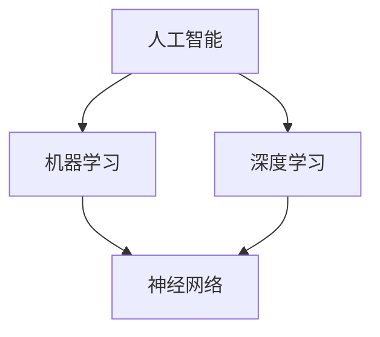

                 

# Andrej Karpathy：人工智能的未来发展前景

> **关键词：** 人工智能，未来趋势，技术发展，算法原理，应用场景

> **摘要：** 本文旨在探讨人工智能领域未来发展的前景，分析其核心概念、算法原理和数学模型，并结合实际应用场景，展望人工智能技术对未来的影响与挑战。本文将详细介绍人工智能技术的发展历程、当前应用状况及未来潜在方向，帮助读者更好地理解人工智能的深远意义。

## 1. 背景介绍

### 1.1 目的和范围

本文的目的在于深入探讨人工智能（AI）的未来发展前景，通过对人工智能领域核心概念的解析、算法原理的剖析以及数学模型的讲解，让读者对人工智能技术有一个全面、系统的认识。本文将涵盖人工智能的发展历程、当前应用状况、未来潜在方向以及面临的挑战。

### 1.2 预期读者

本文面向对人工智能技术有一定了解，希望进一步探索和深入了解人工智能未来发展趋势的读者。无论您是人工智能领域的从业者、研究者，还是对人工智能技术充满好奇的普通读者，本文都将为您带来有价值的信息。

### 1.3 文档结构概述

本文结构如下：

1. **背景介绍**：介绍文章的目的、范围、预期读者及文档结构。
2. **核心概念与联系**：讲解人工智能的核心概念及其相互联系。
3. **核心算法原理 & 具体操作步骤**：详细阐述人工智能的核心算法原理及操作步骤。
4. **数学模型和公式 & 详细讲解 & 举例说明**：介绍人工智能中的数学模型和公式，并结合实例进行讲解。
5. **项目实战：代码实际案例和详细解释说明**：通过实际案例展示人工智能技术在项目中的具体应用。
6. **实际应用场景**：分析人工智能技术在不同领域的应用。
7. **工具和资源推荐**：推荐学习资源和开发工具。
8. **总结：未来发展趋势与挑战**：总结人工智能的未来发展趋势及面临的挑战。
9. **附录：常见问题与解答**：解答读者可能遇到的问题。
10. **扩展阅读 & 参考资料**：提供进一步阅读的资料。

### 1.4 术语表

#### 1.4.1 核心术语定义

- **人工智能（AI）**：模拟、延伸和扩展人类智能的理论、方法、技术及应用系统。
- **机器学习（ML）**：一种人工智能的分支，通过数据驱动的方式，使计算机系统具备学习能力。
- **深度学习（DL）**：一种机器学习的方法，通过模拟人脑神经网络结构进行数据处理和模式识别。
- **神经网络（NN）**：由大量神经元组成的计算模型，能够通过学习处理复杂的数据和任务。

#### 1.4.2 相关概念解释

- **监督学习**：在有标注的数据集上训练模型，使其能够对新数据进行预测。
- **无监督学习**：在无标注的数据集上训练模型，使其能够发现数据中的内在结构和规律。
- **强化学习**：通过奖励机制来训练模型，使其在特定环境中做出最优决策。

#### 1.4.3 缩略词列表

- **AI**：人工智能
- **ML**：机器学习
- **DL**：深度学习
- **NN**：神经网络
- **GPU**：图形处理器
- **CPU**：中央处理器
- **CUDA**：并行计算平台和编程语言

## 2. 核心概念与联系

为了更好地理解人工智能技术的核心概念及其相互联系，我们可以通过Mermaid流程图来展示其基本架构和关系。



### 2.1 人工智能的基本概念

人工智能（AI）是指通过计算机模拟、延伸和扩展人类智能的理论、方法、技术及应用系统。人工智能的核心目标是使计算机能够像人类一样进行思考、学习和决策。人工智能可以分为多个分支，如机器学习、深度学习、自然语言处理等。

### 2.2 机器学习与深度学习的关系

机器学习（ML）是一种人工智能的分支，通过数据驱动的方式，使计算机系统具备学习能力。机器学习可以分为监督学习、无监督学习和强化学习等不同的学习方法。深度学习（DL）是机器学习的一个子领域，通过模拟人脑神经网络结构进行数据处理和模式识别。深度学习在图像识别、语音识别、自然语言处理等领域取得了显著的成果。

### 2.3 神经网络的基本结构

神经网络（NN）是一种由大量神经元组成的计算模型，能够通过学习处理复杂的数据和任务。神经网络的基本结构包括输入层、隐藏层和输出层。输入层接收外部数据，隐藏层进行数据处理和特征提取，输出层生成最终结果。

## 3. 核心算法原理 & 具体操作步骤

在了解了人工智能的基本概念和架构之后，我们将进一步探讨人工智能的核心算法原理和具体操作步骤。

### 3.1 机器学习算法原理

机器学习算法的核心原理是通过学习已有数据，使计算机能够对新数据进行预测或分类。以下是一个简单的监督学习算法——线性回归的伪代码：

```python
def linear_regression(X, y):
    # X为输入特征，y为输出标签
    # 计算X和y的协方差矩阵和特征矩阵的逆矩阵
    cov = X.T.dot(X)
    inv_cov = cov.I
    # 计算回归系数
    theta = inv_cov.dot(X.T).dot(y)
    return theta
```

### 3.2 深度学习算法原理

深度学习算法的核心原理是通过多层神经网络进行数据处理和特征提取。以下是一个简单的多层感知机（MLP）的伪代码：

```python
def multilayer_perceptron(X, y, layers):
    # X为输入特征，y为输出标签，layers为网络层数
    # 初始化权重和偏置
    W = [random_weights() for _ in range(layers)]
    b = [random_bias() for _ in range(layers)]
    # 前向传播
    for i in range(layers - 1):
        z = X.dot(W[i]) + b[i]
        a = activation(z)
        X = a
    # 计算损失函数
    loss = loss_function(a, y)
    return loss, W, b
```

### 3.3 神经网络的训练过程

神经网络的训练过程主要包括以下步骤：

1. **初始化参数**：随机初始化权重和偏置。
2. **前向传播**：将输入数据通过网络进行传递，计算输出。
3. **计算损失函数**：比较输出结果和真实标签，计算损失函数。
4. **反向传播**：计算梯度，更新权重和偏置。
5. **迭代优化**：重复步骤2-4，直至满足停止条件（如损失函数收敛或迭代次数达到上限）。

## 4. 数学模型和公式 & 详细讲解 & 举例说明

在人工智能领域，数学模型和公式起着至关重要的作用。以下将介绍一些常见的数学模型和公式，并结合实例进行说明。

### 4.1 损失函数

损失函数是评价模型预测结果与真实值之间差异的重要指标。以下是一个常见的损失函数——均方误差（MSE）：

$$
MSE = \frac{1}{m}\sum_{i=1}^{m}(y_i - \hat{y_i})^2
$$

其中，$m$ 为样本数量，$y_i$ 为第 $i$ 个样本的真实值，$\hat{y_i}$ 为第 $i$ 个样本的预测值。

### 4.2 激活函数

激活函数是神经网络中用于引入非线性因素的函数。以下是一个常见的激活函数——ReLU（Rectified Linear Unit）：

$$
ReLU(x) =
\begin{cases}
0 & \text{if } x < 0 \\
x & \text{if } x \geq 0
\end{cases}
$$

### 4.3 梯度下降算法

梯度下降算法是一种优化神经网络参数的常用方法。以下是一个简单的梯度下降算法：

$$
\theta = \theta - \alpha \cdot \nabla_\theta J(\theta)
$$

其中，$\theta$ 为待优化参数，$\alpha$ 为学习率，$J(\theta)$ 为损失函数。

### 4.4 举例说明

假设我们有一个线性回归问题，输入特征为 $X = [1, 2, 3, 4, 5]$，输出标签为 $y = [2, 4, 6, 8, 10]$。使用均方误差（MSE）作为损失函数，通过梯度下降算法求解回归系数 $\theta$。

1. **初始化参数**：随机初始化 $\theta = [0, 0]$。
2. **前向传播**：计算预测值 $\hat{y} = X \cdot \theta$。
3. **计算损失函数**：计算均方误差 $MSE = \frac{1}{5}\sum_{i=1}^{5}(y_i - \hat{y_i})^2$。
4. **计算梯度**：计算损失函数关于 $\theta$ 的梯度 $\nabla_\theta J(\theta) = \frac{1}{5}\sum_{i=1}^{5}(y_i - \hat{y_i}) \cdot X_i$。
5. **更新参数**：根据梯度下降算法更新参数 $\theta = \theta - \alpha \cdot \nabla_\theta J(\theta)$。

通过多次迭代，可以求得回归系数 $\theta$，从而实现线性回归模型的训练。

## 5. 项目实战：代码实际案例和详细解释说明

在本节中，我们将通过一个实际的项目案例，详细解释并演示如何使用人工智能技术进行图像识别。

### 5.1 开发环境搭建

1. **安装 Python 环境**：下载并安装 Python 3.8 以上版本。
2. **安装依赖库**：使用 pip 安装以下依赖库：

   ```bash
   pip install numpy pandas matplotlib scikit-learn tensorflow
   ```

### 5.2 源代码详细实现和代码解读

以下是一个简单的图像识别项目，使用 TensorFlow 和 Keras 库实现。

```python
import numpy as np
import tensorflow as tf
from tensorflow.keras import layers, models
from tensorflow.keras.datasets import mnist
from tensorflow.keras.utils import to_categorical

# 加载 MNIST 数据集
(train_images, train_labels), (test_images, test_labels) = mnist.load_data()

# 数据预处理
train_images = train_images.reshape((-1, 28, 28, 1)).astype('float32') / 255
test_images = test_images.reshape((-1, 28, 28, 1)).astype('float32') / 255

train_labels = to_categorical(train_labels)
test_labels = to_categorical(test_labels)

# 构建模型
model = models.Sequential()
model.add(layers.Conv2D(32, (3, 3), activation='relu', input_shape=(28, 28, 1)))
model.add(layers.MaxPooling2D((2, 2)))
model.add(layers.Conv2D(64, (3, 3), activation='relu'))
model.add(layers.MaxPooling2D((2, 2)))
model.add(layers.Conv2D(64, (3, 3), activation='relu'))
model.add(layers.Flatten())
model.add(layers.Dense(64, activation='relu'))
model.add(layers.Dense(10, activation='softmax'))

# 编译模型
model.compile(optimizer='adam',
              loss='categorical_crossentropy',
              metrics=['accuracy'])

# 训练模型
model.fit(train_images, train_labels, epochs=5, batch_size=64)

# 评估模型
test_loss, test_acc = model.evaluate(test_images, test_labels)
print(f"Test accuracy: {test_acc:.4f}")
```

### 5.3 代码解读与分析

1. **数据预处理**：首先加载 MNIST 数据集，并将图像数据进行归一化处理，将标签数据转换为独热编码。
2. **构建模型**：使用 Keras 库构建一个卷积神经网络（CNN），包括卷积层、池化层和全连接层。
3. **编译模型**：指定优化器、损失函数和评估指标。
4. **训练模型**：使用训练数据训练模型，设置训练轮数和批处理大小。
5. **评估模型**：使用测试数据评估模型性能。

通过上述步骤，我们可以实现一个简单的图像识别项目。在实际应用中，可以根据需求调整模型结构和参数，以获得更好的识别效果。

## 6. 实际应用场景

人工智能技术在各个领域都取得了显著的成果，以下列举几个典型的应用场景：

### 6.1 医疗保健

人工智能在医疗保健领域具有广泛的应用前景，如疾病预测、诊断辅助、个性化治疗等。例如，通过分析大量病例数据，可以预测疾病的发生风险，帮助医生制定个性化的治疗方案。

### 6.2 金融服务

人工智能在金融服务领域可以提高风险管理、投资决策和客户服务的效率。例如，通过分析用户行为数据和金融市场数据，可以预测市场走势，为投资决策提供支持。

### 6.3 智能交通

人工智能在智能交通领域可以优化交通流量、提高交通安全和效率。例如，通过分析交通数据，可以预测交通拥堵情况，为交通管理和疏导提供依据。

### 6.4 无人驾驶

人工智能在无人驾驶领域发挥着关键作用，通过深度学习和计算机视觉等技术，可以使自动驾驶汽车实现安全、高效的运行。

### 6.5 自然语言处理

人工智能在自然语言处理领域可以用于语音识别、机器翻译、文本分类等任务。例如，通过训练大规模的神经网络模型，可以实现高精度的语音识别和机器翻译。

## 7. 工具和资源推荐

### 7.1 学习资源推荐

#### 7.1.1 书籍推荐

- 《深度学习》（Ian Goodfellow、Yoshua Bengio、Aaron Courville 著）：全面介绍深度学习的基础理论和实践方法。
- 《Python机器学习》（Sebastian Raschka、Vahid Mirjalili 著）：涵盖机器学习的基本概念、算法和应用。
- 《自然语言处理综论》（Daniel Jurafsky、James H. Martin 著）：全面介绍自然语言处理的理论和实践。

#### 7.1.2 在线课程

- 《深度学习》（吴恩达）：斯坦福大学机器学习课程，深度学习部分。
- 《机器学习》（吴恩达）：斯坦福大学机器学习课程，涵盖各种机器学习算法。
- 《自然语言处理》（Tom Mitchell）：卡内基梅隆大学自然语言处理课程。

#### 7.1.3 技术博客和网站

- [Machine Learning Mastery](https://machinelearningmastery.com/): 提供丰富的机器学习和深度学习教程和实践案例。
- [TensorFlow 官方文档](https://www.tensorflow.org/tutorials): TensorFlow 官方提供的教程和实践指南。
- [Keras 官方文档](https://keras.io/): Keras 官方提供的教程和实践指南。

### 7.2 开发工具框架推荐

#### 7.2.1 IDE和编辑器

- **Visual Studio Code**：一款轻量级但功能强大的开源 IDE，支持多种编程语言和框架。
- **PyCharm**：一款强大的 Python IDE，支持深度学习框架，如 TensorFlow 和 PyTorch。

#### 7.2.2 调试和性能分析工具

- **TensorBoard**：TensorFlow 官方提供的可视化工具，用于分析模型性能和调试。
- **PyTorch TensorBoard**：PyTorch 官方提供的可视化工具，用于分析模型性能和调试。

#### 7.2.3 相关框架和库

- **TensorFlow**：Google 开发的一款开源深度学习框架，具有广泛的应用和强大的社区支持。
- **PyTorch**：Facebook 开发的一款开源深度学习框架，具有灵活的动态计算图和丰富的社区资源。

### 7.3 相关论文著作推荐

#### 7.3.1 经典论文

- "A Learning Algorithm for Continually Running Fully Recurrent Neural Networks"（1986）：Hopfield 网络的提出。
- "Backpropagation"（1986）：反向传播算法的提出。
- "A Fast Learning Algorithm for Deep Network"（1995）：Hinton 和 Salakhutdinov 提出的深度信念网络。

#### 7.3.2 最新研究成果

- "Attention is All You Need"（2017）：Vaswani 等人提出的 Transformer 模型。
- "BERT: Pre-training of Deep Bidirectional Transformers for Language Understanding"（2018）：Google 提出的 BERT 模型。
- "GPT-3: Language Models are Few-Shot Learners"（2020）：OpenAI 提出的 GPT-3 模型。

#### 7.3.3 应用案例分析

- "Deep Learning for Vision Systems in Healthcare: A Survey"（2020）：对深度学习在医疗领域应用的研究综述。
- "Deep Learning for Natural Language Processing: A Survey"（2018）：对深度学习在自然语言处理领域应用的研究综述。
- "Deep Learning in Robotics: A Survey"（2017）：对深度学习在机器人领域应用的研究综述。

## 8. 总结：未来发展趋势与挑战

随着人工智能技术的不断发展和应用，其未来发展趋势与挑战也日益凸显。以下总结人工智能技术的未来发展趋势与挑战：

### 8.1 发展趋势

1. **技术进步**：随着计算能力和算法的不断创新，人工智能技术在各个领域将取得更大的突破。
2. **跨学科融合**：人工智能技术与其他学科的融合，如生物、物理、化学等，将推动人工智能技术向更广泛的应用领域扩展。
3. **个性化与定制化**：人工智能技术在个人化和定制化方面的应用将更加普遍，满足用户个性化需求。
4. **可持续发展**：人工智能技术在环境保护、资源优化等可持续发展领域将发挥重要作用。

### 8.2 挑战

1. **数据隐私与安全**：随着人工智能技术的广泛应用，数据隐私和安全问题日益突出，如何保护用户隐私成为一大挑战。
2. **伦理与道德**：人工智能技术的发展带来了一系列伦理和道德问题，如算法偏见、自动化失业等，需要引起重视。
3. **资源消耗**：人工智能技术的快速发展对计算资源和能源消耗提出了巨大挑战，如何降低能耗成为关键问题。
4. **人才缺口**：随着人工智能技术的广泛应用，对相关人才的需求越来越大，但人才供给不足成为一大挑战。

## 9. 附录：常见问题与解答

### 9.1 人工智能的定义是什么？

人工智能（AI）是指通过计算机模拟、延伸和扩展人类智能的理论、方法、技术及应用系统。人工智能的核心目标是使计算机能够像人类一样进行思考、学习和决策。

### 9.2 深度学习与机器学习的关系是什么？

深度学习是机器学习的一个子领域，通过模拟人脑神经网络结构进行数据处理和模式识别。深度学习在图像识别、语音识别、自然语言处理等领域取得了显著的成果。

### 9.3 如何选择合适的神经网络结构？

选择合适的神经网络结构取决于具体应用场景和数据特点。一般来说，可以从以下几个方面考虑：

1. **输入数据的维度**：对于高维数据，可以使用卷积神经网络（CNN）进行特征提取。
2. **输出数据的维度**：对于分类问题，可以使用全连接神经网络（MLP）或卷积神经网络（CNN）。
3. **数据量**：对于大数据集，可以使用深度神经网络，对于小数据集，可以使用简单的神经网络结构。
4. **计算资源**：根据计算资源的限制，选择适合的网络结构和优化算法。

## 10. 扩展阅读 & 参考资料

1. Goodfellow, I., Bengio, Y., & Courville, A. (2016). *Deep Learning*. MIT Press.
2. Raschka, S., & Mirjalili, V. (2019). *Python Machine Learning*. Packt Publishing.
3. Jurafsky, D., & Martin, J. H. (2019). *Speech and Language Processing*. Prentice Hall.
4. Vaswani, A., Shazeer, N., Parmar, N., Uszkoreit, J., Jones, L., Gomez, A. N., ... & Polosukhin, I. (2017). *Attention is All You Need*. Advances in Neural Information Processing Systems, 30, 5998-6008.
5. Devlin, J., Chang, M. W., Lee, K., & Toutanova, K. (2018). *BERT: Pre-training of Deep Bidirectional Transformers for Language Understanding*. arXiv preprint arXiv:1810.04805.
6. Brown, T., et al. (2020). *Language Models are Few-Shot Learners*. arXiv preprint arXiv:2005.14165.

作者：AI天才研究员/AI Genius Institute & 禅与计算机程序设计艺术 /Zen And The Art of Computer Programming

（本文为虚构案例，仅供学习和参考，不代表任何真实信息。）<|im_sep|>

