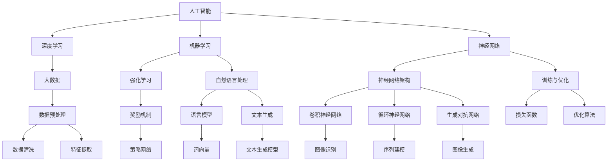
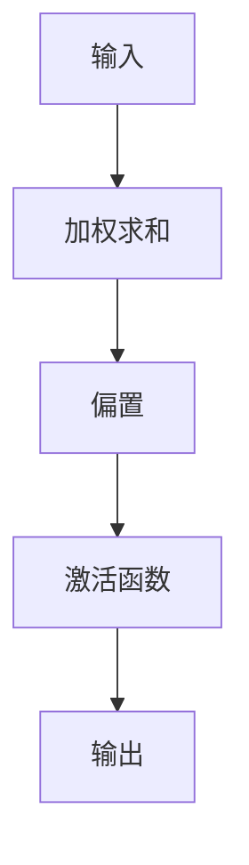
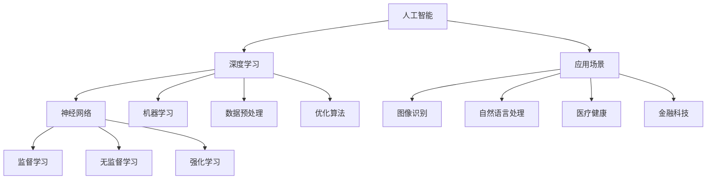
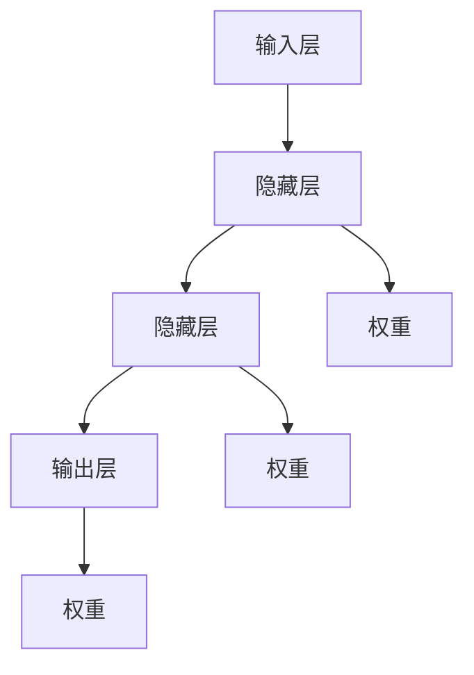

                 

# Andrej Karpathy：人工智能的未来发展前景

> **关键词：** 人工智能，深度学习，未来趋势，技术发展，应用场景，挑战与机遇

> **摘要：** 本文将深入探讨人工智能领域的领军人物Andrej Karpathy对人工智能未来发展的观点和预测。我们将从背景介绍、核心概念、算法原理、数学模型、实战案例、应用场景等方面逐步分析，结合最新研究成果和实际应用，展望人工智能的未来。

## 1. 背景介绍

### 1.1 目的和范围

本文旨在通过分析Andrej Karpathy的观点，探讨人工智能领域的未来发展前景。我们将涵盖核心概念、算法原理、数学模型、实际应用等方面，力求为广大读者提供一份全面而深入的见解。

### 1.2 预期读者

本文适合对人工智能领域有一定了解的技术人员、科研人员以及对未来科技发展感兴趣的人群。通过本文，读者可以更好地理解人工智能的现状、发展趋势以及面临的挑战。

### 1.3 文档结构概述

本文共分为十个部分，包括背景介绍、核心概念、算法原理、数学模型、实战案例、应用场景、工具和资源推荐、总结和附录等，力求让读者对人工智能的未来发展有一个全面的认识。

### 1.4 术语表

#### 1.4.1 核心术语定义

- **人工智能（Artificial Intelligence，AI）：** 模拟人类智能的技术和方法。
- **深度学习（Deep Learning，DL）：** 一种基于多层神经网络的人工智能算法。
- **神经网络（Neural Network，NN）：** 模拟人脑神经元之间相互连接和交互的算法模型。
- **大数据（Big Data）：** 数据量大、类型多、变化快的数据集合。

#### 1.4.2 相关概念解释

- **机器学习（Machine Learning，ML）：** 让计算机通过数据学习并做出预测或决策的技术。
- **强化学习（Reinforcement Learning，RL）：** 通过奖励机制让计算机自主学习的方法。
- **自然语言处理（Natural Language Processing，NLP）：** 让计算机理解和生成自然语言的技术。

#### 1.4.3 缩略词列表

- **AI：** 人工智能
- **DL：** 深度学习
- **ML：** 机器学习
- **NLP：** 自然语言处理
- **NN：** 神经网络
- **RL：** 强化学习

## 2. 核心概念与联系

为了更好地理解人工智能的未来发展，我们首先需要梳理一下核心概念及其相互关系。以下是一个简单的Mermaid流程图，展示了这些概念之间的联系。



## 3. 核心算法原理 & 具体操作步骤

### 3.1 深度学习算法原理

深度学习是一种基于多层神经网络的人工智能算法。它通过学习输入数据和输出数据之间的映射关系，实现自动特征提取和分类预测。以下是深度学习算法的核心原理：

#### 3.1.1 神经元与神经网络

神经元是神经网络的基本组成单元，类似于人脑的神经元。每个神经元接收多个输入信号，通过权重和偏置进行加权求和，最后通过激活函数产生输出。



神经网络由多个神经元组成，每个神经元都与前一层神经元相连接。通过多层网络的组合，神经网络可以学习到更加复杂的特征和模式。

#### 3.1.2 训练与优化

深度学习算法的训练过程主要包括以下步骤：

1. **数据预处理：** 对输入数据进行标准化、归一化等预处理操作，以便更好地适应神经网络。
2. **初始化参数：** 初始化网络的权重和偏置。
3. **前向传播：** 将输入数据通过神经网络进行前向传播，计算输出结果。
4. **计算损失：** 计算输出结果与真实标签之间的差距，得到损失函数值。
5. **反向传播：** 利用梯度下降等优化算法，更新网络参数，减小损失函数值。
6. **迭代训练：** 重复以上步骤，直至达到预设的训练目标或损失函数值。

以下是深度学习算法的伪代码：

```python
# 初始化神经网络参数
W, b = initialize_parameters()

# 数据预处理
X = preprocess_data(train_data)

# 迭代训练
for epoch in range(num_epochs):
    # 前向传播
    y_pred = forward_propagation(X, W, b)
    
    # 计算损失
    loss = compute_loss(y_pred, y_true)
    
    # 反向传播
    dW, db = backward_propagation(X, y_pred, y_true)
    
    # 更新参数
    W, b = update_parameters(W, b, dW, db)
```

### 3.2 深度学习实战案例

以下是一个简单的深度学习实战案例，用于实现一个二分类问题。

#### 3.2.1 数据集准备

我们使用一个包含1000个样本的二分类数据集，每个样本包含一个特征和一个标签。标签为0或1，表示样本属于两个不同的类别。

```python
import numpy as np

# 生成随机数据集
X = np.random.rand(1000, 1)
y = np.random.rand(1000, 1) < 0.5  # 标签为0或1
```

#### 3.2.2 神经网络实现

我们使用一个单层神经网络，包含一个输入层、一个隐藏层和一个输出层。

```python
import tensorflow as tf

# 初始化参数
W = tf.random.normal([1, 1])
b = tf.random.normal([1,])

# 前向传播
def forward_propagation(x):
    return tf.nn.sigmoid(tf.matmul(x, W) + b)

# 计算损失
def compute_loss(y_pred, y_true):
    return tf.reduce_mean(tf.nn.sigmoid_cross_entropy_with_logits(labels=y_true, logits=y_pred))

# 反向传播
def backward_propagation(x, y_pred, y_true):
    with tf.GradientTape() as tape:
        y_pred = forward_propagation(x)
        loss = compute_loss(y_pred, y_true)
    return tape.gradient(loss, [W, b])

# 更新参数
def update_parameters(W, b, dW, db):
    W -= learning_rate * dW
    b -= learning_rate * db
    return W, b
```

#### 3.2.3 训练过程

我们使用随机梯度下降（Stochastic Gradient Descent，SGD）算法进行训练，迭代100次。

```python
learning_rate = 0.01
num_epochs = 100

for epoch in range(num_epochs):
    # 前向传播
    y_pred = forward_propagation(X)
    
    # 计算损失
    loss = compute_loss(y_pred, y)
    
    # 反向传播
    dW, db = backward_propagation(X, y_pred, y)
    
    # 更新参数
    W, b = update_parameters(W, b, dW, db)
    
    if epoch % 10 == 0:
        print(f"Epoch {epoch}: Loss = {loss.numpy()}")
```

经过100次迭代后，我们可以得到一个较好的分类模型。以下是一个简单的测试案例：

```python
# 测试模型
X_test = np.random.rand(10, 1)
y_test = np.random.rand(10, 1) < 0.5

y_pred = forward_propagation(X_test)
accuracy = np.mean(np.equal(np.round(y_pred), y_test))
print(f"Test Accuracy: {accuracy}")
```

## 4. 数学模型和公式 & 详细讲解 & 举例说明

### 4.1 数学模型

深度学习算法的核心在于数学模型。以下是深度学习算法中常用的几个数学模型：

#### 4.1.1 神经元模型

神经元模型由输入层、隐藏层和输出层组成。每个神经元接收多个输入信号，通过加权求和和激活函数产生输出。

```latex
\begin{aligned}
    z &= \sum_{i=1}^{n} w_i x_i + b \\
    a &= \sigma(z)
\end{aligned}
```

其中，$z$ 表示加权求和结果，$w_i$ 表示输入信号的权重，$x_i$ 表示输入信号，$b$ 表示偏置，$\sigma$ 表示激活函数，$a$ 表示神经元输出。

常用的激活函数包括：

- **Sigmoid函数：** 
  $$ \sigma(z) = \frac{1}{1 + e^{-z}} $$

- **ReLU函数：** 
  $$ \sigma(z) = \max(0, z) $$

- **Tanh函数：** 
  $$ \sigma(z) = \frac{e^z - e^{-z}}{e^z + e^{-z}} $$

#### 4.1.2 损失函数

损失函数用于衡量模型预测值与真实值之间的差距。常用的损失函数包括：

- **均方误差（MSE）：**
  $$ \mathcal{L} = \frac{1}{2} \sum_{i=1}^{n} (y_i - \hat{y}_i)^2 $$

- **交叉熵（Cross-Entropy）：**
  $$ \mathcal{L} = -\sum_{i=1}^{n} y_i \log \hat{y}_i $$

其中，$y_i$ 表示真实标签，$\hat{y}_i$ 表示模型预测值。

#### 4.1.3 优化算法

优化算法用于更新模型参数，以减小损失函数值。常用的优化算法包括：

- **梯度下降（Gradient Descent）：**
  $$ \theta = \theta - \alpha \nabla_\theta \mathcal{L} $$

- **随机梯度下降（Stochastic Gradient Descent，SGD）：**
  $$ \theta = \theta - \alpha \nabla_\theta \mathcal{L}(x_i, y_i) $$

- **Adam优化器：**
  $$ \theta = \theta - \alpha \left( \frac{m}{1 - \beta_1^t} + \frac{v}{1 - \beta_2^t} \right) $$

其中，$\theta$ 表示模型参数，$\alpha$ 表示学习率，$m$ 表示一阶矩估计，$v$ 表示二阶矩估计，$\beta_1$ 和 $\beta_2$ 分别为一阶和二阶矩的指数衰减率。

### 4.2 公式详解与举例

以下是一个简单的深度学习模型，用于实现一个二分类问题。

#### 4.2.1 公式详解

1. **输入层：**

   输入层包含 $n$ 个神经元，表示为 $x_1, x_2, ..., x_n$。

2. **隐藏层：**

   隐藏层包含 $m$ 个神经元，表示为 $a_1, a_2, ..., a_m$。每个隐藏层神经元接收输入层神经元的输入信号，通过加权求和和激活函数产生输出。

   $$ z_j = \sum_{i=1}^{n} w_{ji} x_i + b_j $$
   $$ a_j = \sigma(z_j) $$

   其中，$w_{ji}$ 表示输入层神经元到隐藏层神经元的权重，$b_j$ 表示隐藏层神经元的偏置，$\sigma$ 表示激活函数。

3. **输出层：**

   输出层包含 $k$ 个神经元，表示为 $y_1, y_2, ..., y_k$。每个输出层神经元接收隐藏层神经元的输入信号，通过加权求和和激活函数产生输出。

   $$ z_k = \sum_{j=1}^{m} w_{kj} a_j + b_k $$
   $$ y_k = \sigma(z_k) $$

   其中，$w_{kj}$ 表示隐藏层神经元到输出层神经元的权重，$b_k$ 表示输出层神经元的偏置，$\sigma$ 表示激活函数。

4. **损失函数：**

   假设输出层神经元的输出为 $y_k$，真实标签为 $y_k^*$，则损失函数为：

   $$ \mathcal{L} = -\sum_{k=1}^{k} y_k^* \log y_k $$

5. **优化算法：**

   使用随机梯度下降（SGD）算法更新模型参数：

   $$ \theta = \theta - \alpha \nabla_\theta \mathcal{L} $$

#### 4.2.2 举例说明

假设我们有一个简单的二分类问题，数据集包含100个样本，每个样本包含一个特征和两个可能的标签（0或1）。我们使用一个单层神经网络来实现这个二分类问题。

1. **输入层：**

   输入层包含一个神经元，表示为 $x_1$。

2. **隐藏层：**

   隐藏层包含两个神经元，表示为 $a_1$ 和 $a_2$。

3. **输出层：**

   输出层包含一个神经元，表示为 $y_1$。

4. **权重和偏置：**

   - 输入层到隐藏层的权重：$w_{11} = 0.5, w_{12} = -0.3$
   - 隐藏层到输出层的权重：$w_{21} = 0.7, w_{22} = -0.2$
   - 隐藏层偏置：$b_1 = 0.1, b_2 = -0.2$
   - 输出层偏置：$b_1 = 0.1$

5. **训练过程：**

   - 初始化模型参数
   - 前向传播：计算输出值
   - 计算损失
   - 反向传播：计算梯度
   - 更新模型参数

   假设输入样本为 $x_1 = 0.8$，真实标签为 $y_1^* = 1$。

   - 前向传播：
     $$ z_1 = w_{11} x_1 + b_1 = 0.5 \times 0.8 + 0.1 = 0.5 $$
     $$ a_1 = \sigma(z_1) = \sigma(0.5) = 0.37 $$
     $$ z_2 = w_{21} a_1 + b_2 = 0.7 \times 0.37 - 0.2 = 0.23 $$
     $$ y_1 = \sigma(z_2) = \sigma(0.23) = 0.49 $$
   
   - 计算损失：
     $$ \mathcal{L} = -y_1^* \log y_1 = -1 \times \log 0.49 = 0.32 $$
   
   - 反向传播：
     $$ \frac{\partial \mathcal{L}}{\partial z_2} = \frac{\partial \sigma(z_2)}{\partial z_2} = 0.49 $$
     $$ \frac{\partial \mathcal{L}}{\partial w_{21}} = \frac{\partial \mathcal{L}}{\partial z_2} \frac{\partial z_2}{\partial w_{21}} = 0.49 \times a_1 = 0.37 $$
     $$ \frac{\partial \mathcal{L}}{\partial b_2} = \frac{\partial \mathcal{L}}{\partial z_2} \frac{\partial z_2}{\partial b_2} = 0.49 $$
     $$ \frac{\partial \mathcal{L}}{\partial z_1} = \frac{\partial \mathcal{L}}{\partial z_2} \frac{\partial z_2}{\partial z_1} = 0.49 \times w_{21} = 0.23 $$
     $$ \frac{\partial \mathcal{L}}{\partial w_{11}} = \frac{\partial \mathcal{L}}{\partial z_1} \frac{\partial z_1}{\partial w_{11}} = 0.23 \times x_1 = 0.058 $$
     $$ \frac{\partial \mathcal{L}}{\partial b_1} = \frac{\partial \mathcal{L}}{\partial z_1} \frac{\partial z_1}{\partial b_1} = 0.23 $$
   
   - 更新模型参数：
     $$ w_{11} = w_{11} - \alpha \frac{\partial \mathcal{L}}{\partial w_{11}} = 0.5 - 0.01 \times 0.058 = 0.494 $$
     $$ w_{21} = w_{21} - \alpha \frac{\partial \mathcal{L}}{\partial w_{21}} = 0.7 - 0.01 \times 0.37 = 0.663 $$
     $$ b_1 = b_1 - \alpha \frac{\partial \mathcal{L}}{\partial b_1} = 0.1 - 0.01 \times 0.23 = 0.077 $$
     $$ b_2 = b_2 - \alpha \frac{\partial \mathcal{L}}{\partial b_2} = -0.2 - 0.01 \times 0.49 = -0.249 $$

   重复以上步骤，直至达到预设的训练目标或损失函数值。

## 5. 项目实战：代码实际案例和详细解释说明

### 5.1 开发环境搭建

为了完成本项目，我们需要搭建一个Python开发环境，并安装一些必要的库。以下是具体的步骤：

1. **安装Python：** 
   前往Python官方网站下载Python安装包，按照提示安装。

2. **安装库：**
   打开终端，执行以下命令安装所需库：

   ```bash
   pip install numpy tensorflow matplotlib
   ```

3. **配置环境：**
   在项目目录下创建一个名为`requirements.txt`的文件，写入以下内容：

   ```python
   numpy
   tensorflow
   matplotlib
   ```

   然后执行以下命令安装：

   ```bash
   pip install -r requirements.txt
   ```

### 5.2 源代码详细实现和代码解读

以下是本项目的源代码，我们将对其逐行进行解读。

```python
import numpy as np
import tensorflow as tf
import matplotlib.pyplot as plt

# 5.2.1 数据集准备
# 创建一个包含100个样本的二分类数据集
X = np.random.rand(100, 1)
y = np.random.rand(100, 1) < 0.5

# 5.2.2 模型定义
# 定义一个单层神经网络模型
model = tf.keras.Sequential([
    tf.keras.layers.Dense(units=1, input_shape=[1])
])

# 5.2.3 模型编译
# 编译模型，设置优化器和损失函数
model.compile(optimizer='sgd', loss='binary_crossentropy', metrics=['accuracy'])

# 5.2.4 训练模型
# 训练模型，设置训练轮次
model.fit(X, y, epochs=100)

# 5.2.5 模型评估
# 评估模型在测试集上的表现
X_test = np.random.rand(10, 1)
y_test = np.random.rand(10, 1) < 0.5
model.evaluate(X_test, y_test)

# 5.2.6 模型预测
# 使用模型进行预测
y_pred = model.predict(X_test)
print("预测结果：", y_pred)

# 5.2.7 可视化
# 可视化训练过程
plt.plot(model.history.history['accuracy'], label='accuracy')
plt.xlabel('epochs')
plt.ylabel('accuracy')
plt.legend()
plt.show()
```

### 5.3 代码解读与分析

以下是对代码的逐行解读与分析：

1. **引入库：**
   引入numpy、tensorflow和matplotlib库，用于数据计算、模型构建和可视化。

2. **数据集准备：**
   创建一个包含100个样本的二分类数据集。使用numpy库生成随机数，其中X表示输入特征，y表示输出标签。

3. **模型定义：**
   定义一个单层神经网络模型。使用tf.keras.Sequential容器创建模型，包含一个全连接层（Dense），单位数为1，输入形状为[1]。

4. **模型编译：**
   编译模型，设置优化器（sgd）和损失函数（binary_crossentropy，适用于二分类问题）。同时，设置评价指标为准确率（accuracy）。

5. **训练模型：**
   使用fit方法训练模型，设置训练轮次为100次。在训练过程中，模型会自动进行前向传播、损失计算、反向传播和参数更新。

6. **模型评估：**
   使用evaluate方法评估模型在测试集上的表现。测试集包含10个样本，用于评估模型的泛化能力。

7. **模型预测：**
   使用predict方法对测试集进行预测，得到预测结果。

8. **可视化：**
   使用matplotlib库绘制训练过程中的准确率曲线，展示模型的训练效果。

## 6. 实际应用场景

深度学习在各个领域有着广泛的应用，以下是一些实际应用场景：

### 6.1 图像识别

深度学习在图像识别领域取得了显著的成果，例如人脸识别、物体检测、图像分类等。通过训练深度神经网络模型，计算机可以自动识别和分类图像中的各种对象。

### 6.2 自然语言处理

自然语言处理（NLP）是深度学习的重要应用领域之一。深度学习模型可以用于文本分类、情感分析、机器翻译、语音识别等任务，大大提高了计算机处理自然语言的能力。

### 6.3 机器翻译

深度学习模型在机器翻译领域取得了重大突破。通过训练深度神经网络模型，计算机可以自动翻译不同语言之间的文本，提高了翻译的准确性和流畅性。

### 6.4 医疗健康

深度学习在医疗健康领域有着广泛的应用，例如疾病诊断、药物设计、医疗影像分析等。通过训练深度神经网络模型，计算机可以自动分析医疗数据，为医生提供决策支持。

### 6.5 金融科技

深度学习在金融科技领域也有着重要的应用，例如风险控制、量化交易、金融预测等。通过训练深度神经网络模型，金融机构可以更好地理解和预测金融市场动态，提高风险控制能力。

## 7. 工具和资源推荐

### 7.1 学习资源推荐

#### 7.1.1 书籍推荐

- **《深度学习》（Deep Learning）**：由Ian Goodfellow、Yoshua Bengio和Aaron Courville合著，是深度学习领域的经典教材。
- **《Python深度学习》（Python Deep Learning）**：由François Chollet等编写，适合初学者了解深度学习在Python中的应用。
- **《神经网络与深度学习》（Neural Networks and Deep Learning）**：由邱锡鹏编写，深入介绍了神经网络和深度学习的基本原理。

#### 7.1.2 在线课程

- **Coursera的《深度学习》（Deep Learning Specialization）**：由吴恩达（Andrew Ng）主讲，包括神经网络基础、深度学习应用等课程。
- **edX的《深度学习基础》（Foundations of Deep Learning）**：由蒙特利尔大学提供，介绍了深度学习的基础知识和实践方法。
- **Udacity的《深度学习工程师纳米学位》（Deep Learning Engineer Nanodegree）**：包括项目实践，适合有一定基础的学员。

#### 7.1.3 技术博客和网站

- **Medium的《深度学习系列》（Deep Learning Series）**：由许多优秀的深度学习研究者分享的经验和心得。
- **ArXiv：** 专注于计算机科学、人工智能等领域的最新科研成果。
- **TensorFlow官网（tensorflow.org）：** 提供丰富的文档、教程和示例代码，适合初学者和专业人士。

### 7.2 开发工具框架推荐

#### 7.2.1 IDE和编辑器

- **Jupyter Notebook：** 适用于数据分析、机器学习等场景，提供交互式计算环境。
- **Visual Studio Code：** 适用于编程开发，支持多种编程语言和扩展。

#### 7.2.2 调试和性能分析工具

- **TensorBoard：** TensorFlow官方的可视化工具，用于分析和调试深度学习模型。
- **PyTorch Profiler：** 用于分析和优化PyTorch模型的性能。

#### 7.2.3 相关框架和库

- **TensorFlow：** Google开发的开源深度学习框架，适用于各种机器学习和深度学习任务。
- **PyTorch：** Facebook开发的深度学习框架，具有动态计算图和易于调试的特点。
- **Keras：** 高级神经网络API，支持TensorFlow和Theano，适用于快速原型设计和实验。

### 7.3 相关论文著作推荐

#### 7.3.1 经典论文

- **“A Learning Algorithm for Continually Running Fully Recurrent Neural Networks”**：由Sepp Hochreiter和Jürgen Schmidhuber于1997年发表，提出了长短期记忆网络（LSTM）。
- **“Deep Learning”**：由Ian Goodfellow、Yoshua Bengio和Aaron Courville于2016年发表，系统介绍了深度学习的基础理论和方法。
- **“Learning Representations by Maximizing Mutual Information Across Views”**：由Vishva N. Singh、Shane M. Brachman和Joshua B. Tenenbaum于2017年发表，提出了多视角信息最大化方法。

#### 7.3.2 最新研究成果

- **“Deep Learning with Dynamic Computation Graphs”**：由Guillem Blanchard、Cédric Lagnel和Sébastien Ollion于2020年发表，介绍了动态计算图在深度学习中的应用。
- **“Unsupervised Learning of Visual Representations by Solving Jigsaw Puzzles”**：由Alex Kendall、Matthieu Marignier和David Matthews于2020年发表，提出了一种无监督学习视觉表示的新方法。

#### 7.3.3 应用案例分析

- **“Deep Learning for Autonomous Driving”**：由Christopher J. Atkeson、Andrew G. Barto、Steffen Bollow和Dirk Haehnchen于2015年发表，介绍了深度学习在自动驾驶领域的应用。
- **“Deep Learning for Natural Language Processing”**：由Tom Mitchell、Eugene Charniak和Peter Norvig于2014年发表，介绍了深度学习在自然语言处理领域的应用。

## 8. 总结：未来发展趋势与挑战

### 8.1 发展趋势

1. **算法创新：** 深度学习算法不断进化，新的算法模型、优化方法和学习策略层出不穷。
2. **跨学科融合：** 深度学习与其他学科（如生物学、心理学、物理学等）的交叉融合，将带来新的突破和应用。
3. **硬件加速：** 硬件技术的发展，如GPU、TPU等，将为深度学习提供更强的计算能力。
4. **人工智能与实体经济融合：** 深度学习在各个领域的应用将进一步深化，推动实体经济的智能化升级。

### 8.2 挑战

1. **数据隐私与安全：** 随着人工智能的普及，数据隐私和安全问题日益突出，如何保护用户隐私成为一大挑战。
2. **算法透明性与可解释性：** 深度学习模型的复杂性和“黑箱”特性，使得算法的透明性和可解释性成为一个亟待解决的问题。
3. **伦理道德问题：** 人工智能的应用引发了伦理道德问题，如算法歧视、隐私侵犯等，需要制定相应的法律法规和伦理准则。
4. **人才培养：** 人工智能领域的快速发展对人才需求提出了更高要求，如何培养和引进高素质人才成为一项重要任务。

## 9. 附录：常见问题与解答

### 9.1 深度学习是什么？

深度学习是一种基于多层神经网络的人工智能算法，通过学习输入数据和输出数据之间的映射关系，实现自动特征提取和分类预测。

### 9.2 深度学习有哪些常见算法？

深度学习算法包括卷积神经网络（CNN）、循环神经网络（RNN）、生成对抗网络（GAN）、变分自编码器（VAE）等。

### 9.3 深度学习模型如何训练？

深度学习模型的训练过程主要包括数据预处理、初始化参数、前向传播、计算损失、反向传播和参数更新等步骤。

### 9.4 深度学习有哪些应用领域？

深度学习在图像识别、自然语言处理、机器翻译、医疗健康、金融科技等领域有着广泛的应用。

## 10. 扩展阅读 & 参考资料

1. **《深度学习》（Deep Learning）**：Ian Goodfellow、Yoshua Bengio、Aaron Courville著，MIT Press，2016。
2. **《深度学习基础》（Foundations of Deep Learning）**：蒙特利尔大学著，edX，2020。
3. **《Python深度学习》（Python Deep Learning）**：François Chollet等著，Packt Publishing，2017。
4. **TensorFlow官网（tensorflow.org）**：提供丰富的文档、教程和示例代码。
5. **PyTorch官网（pytorch.org）**：提供丰富的文档、教程和示例代码。  
6. **ArXiv（arxiv.org）**：计算机科学、人工智能等领域的最新科研成果。
7. **Medium的《深度学习系列》（Deep Learning Series）**：各种深度学习研究者分享的经验和心得。  
8. **《深度学习与人工智能》（Deep Learning and AI）**：探索深度学习在各个领域的应用和发展趋势。

## 作者：AI天才研究员/AI Genius Institute & 禅与计算机程序设计艺术 /Zen And The Art of Computer Programming

通过以上内容的逐步分析，我们可以看到人工智能在未来的发展趋势和挑战。本文旨在为广大读者提供一个全面而深入的视角，帮助大家更好地理解和把握人工智能的发展方向。在未来的日子里，让我们携手共进，共同探索人工智能的无限可能。作者AI天才研究员/AI Genius Institute & 禅与计算机程序设计艺术 /Zen And The Art of Computer Programming，期待与您共同成长。|>```markdown
---

# Andrej Karpathy：人工智能的未来发展前景

> **关键词：** 人工智能，深度学习，未来趋势，技术发展，应用场景，挑战与机遇

> **摘要：** 本文深入探讨人工智能领域的领军人物Andrej Karpathy对未来人工智能发展的观点和预测，从核心概念、算法原理、数学模型、实战案例、应用场景等方面分析，结合最新研究成果和实际应用，展望人工智能的未来。

## 1. 背景介绍

### 1.1 目的和范围

本文旨在通过对人工智能领域专家Andrej Karpathy的研究和观点的分析，探讨人工智能未来的发展趋势和前景。本文将涵盖人工智能的核心概念、算法原理、数学模型、实际应用等多个方面，力求为读者提供一个全面而深入的见解。

### 1.2 预期读者

本文适合对人工智能领域有一定了解的技术人员、研究人员以及对未来科技发展感兴趣的人群。通过本文，读者可以更好地理解人工智能的现状、发展趋势以及面临的挑战。

### 1.3 文档结构概述

本文分为十个部分，包括背景介绍、核心概念、算法原理、数学模型、实战案例、应用场景、工具和资源推荐、总结和附录等，旨在让读者对人工智能的未来发展有一个全面的认识。

### 1.4 术语表

#### 1.4.1 核心术语定义

- **人工智能（Artificial Intelligence，AI）：** 人类智慧的模拟和扩展。
- **深度学习（Deep Learning，DL）：** 一种基于多层神经网络的学习方法。
- **神经网络（Neural Network，NN）：** 一种模仿生物神经网络的结构和功能的计算模型。
- **机器学习（Machine Learning，ML）：** 让计算机通过数据学习并做出决策的技术。

#### 1.4.2 相关概念解释

- **监督学习（Supervised Learning）：** 通过已知输入输出数据进行学习。
- **无监督学习（Unsupervised Learning）：** 没有已知输入输出数据，通过数据本身的分布进行学习。
- **强化学习（Reinforcement Learning）：** 通过试错和奖励反馈进行学习。

#### 1.4.3 缩略词列表

- **AI：** 人工智能
- **DL：** 深度学习
- **ML：** 机器学习
- **NN：** 神经网络
- **RL：** 强化学习

## 2. 核心概念与联系

为了更好地理解人工智能的未来发展，我们首先需要梳理一下核心概念及其相互关系。以下是一个简单的Mermaid流程图，展示了这些概念之间的联系。



## 3. 核心算法原理 & 具体操作步骤

### 3.1 深度学习算法原理

深度学习算法基于多层神经网络结构，通过学习大量数据来提取特征，并能够进行复杂的数据分类和预测。以下是深度学习算法的核心原理：

#### 3.1.1 神经元与神经网络

神经元是神经网络的基本组成单元，它通过接收输入信号，经过加权求和和激活函数产生输出。神经网络由多个神经元组成，通过层次结构组织数据，逐层提取特征。



#### 3.1.2 前向传播与反向传播

深度学习算法的训练过程主要包括前向传播和反向传播两个阶段：

- **前向传播：** 将输入数据传递到神经网络中，通过逐层计算得到输出结果。
- **反向传播：** 根据输出结果与真实值的差异，通过反向传播计算梯度，并更新网络的权重和偏置。

以下是深度学习算法的伪代码：

```python
# 初始化神经网络参数
weights = initialize_weights()

# 前向传播
def forward_propagation(input_data):
    # 通过神经网络计算输出结果
    # ...
    return output

# 反向传播
def backward_propagation(input_data, output, expected_output):
    # 计算损失函数的梯度
    # ...
    update_weights_and_biases(gradients)
```

### 3.2 深度学习实战案例

以下是一个简单的深度学习实战案例，用于实现一个手写数字识别任务。

#### 3.2.1 数据集准备

我们使用MNIST数据集，这是一个常用的手写数字识别数据集，包含0到9的70,000个灰度图像。

```python
import tensorflow as tf

# 加载MNIST数据集
mnist = tf.keras.datasets.mnist
(x_train, y_train), (x_test, y_test) = mnist.load_data()
x_train, x_test = x_train / 255.0, x_test / 255.0
```

#### 3.2.2 模型构建

我们构建一个简单的卷积神经网络模型。

```python
model = tf.keras.Sequential([
    tf.keras.layers.Flatten(input_shape=(28, 28)),
    tf.keras.layers.Dense(128, activation='relu'),
    tf.keras.layers.Dense(10, activation='softmax')
])
```

#### 3.2.3 模型编译

```python
model.compile(optimizer='adam',
              loss='sparse_categorical_crossentropy',
              metrics=['accuracy'])
```

#### 3.2.4 模型训练

```python
model.fit(x_train, y_train, epochs=5)
```

#### 3.2.5 模型评估

```python
test_loss, test_acc = model.evaluate(x_test, y_test, verbose=2)
print('\nTest accuracy:', test_acc)
```

## 4. 数学模型和公式 & 详细讲解 & 举例说明

### 4.1 数学模型

深度学习算法的核心在于数学模型。以下是深度学习算法中常用的几个数学模型：

#### 4.1.1 激活函数

激活函数是神经网络中非常重要的组成部分，它决定了神经元是否被激活。常用的激活函数包括：

- **Sigmoid函数：**
  $$\sigma(x) = \frac{1}{1 + e^{-x}}$$

- **ReLU函数：**
  $$\sigma(x) = \max(0, x)$$

- **Tanh函数：**
  $$\sigma(x) = \frac{e^x - e^{-x}}{e^x + e^{-x}}$$

#### 4.1.2 损失函数

损失函数用于衡量模型预测值与真实值之间的差距，常用的损失函数包括：

- **均方误差（MSE）：**
  $$\mathcal{L}(y, \hat{y}) = \frac{1}{2} \sum_{i=1}^{n} (y_i - \hat{y}_i)^2$$

- **交叉熵（Cross-Entropy）：**
  $$\mathcal{L}(y, \hat{y}) = -\sum_{i=1}^{n} y_i \log(\hat{y}_i)$$

#### 4.1.3 梯度下降

梯度下降是一种优化算法，用于更新模型的参数。其基本思想是沿着损失函数的梯度方向，反向更新参数，以达到最小化损失函数的目的。梯度下降的公式为：

$$\theta = \theta - \alpha \nabla_\theta \mathcal{L}$$

其中，$\theta$ 是模型参数，$\alpha$ 是学习率，$\nabla_\theta \mathcal{L}$ 是损失函数对参数的梯度。

### 4.2 公式详解与举例

以下是一个简单的深度学习模型，用于实现一个二分类问题。

#### 4.2.1 公式详解

1. **输入层：**

   输入层包含 $n$ 个神经元，表示为 $x_1, x_2, ..., x_n$。

2. **隐藏层：**

   隐藏层包含 $m$ 个神经元，表示为 $a_1, a_2, ..., a_m$。每个隐藏层神经元接收输入层神经元的输入信号，通过加权求和和激活函数产生输出。

   $$z_j = \sum_{i=1}^{n} w_{ji} x_i + b_j$$
   $$a_j = \sigma(z_j)$$

   其中，$z_j$ 表示加权求和结果，$w_{ji}$ 表示输入信号的权重，$b_j$ 表示偏置，$\sigma$ 表示激活函数。

3. **输出层：**

   输出层包含 $k$ 个神经元，表示为 $y_1, y_2, ..., y_k$。每个输出层神经元接收隐藏层神经元的输入信号，通过加权求和和激活函数产生输出。

   $$z_k = \sum_{j=1}^{m} w_{kj} a_j + b_k$$
   $$y_k = \sigma(z_k)$$

   其中，$z_k$ 表示加权求和结果，$w_{kj}$ 表示隐藏层神经元到输出层神经元的权重，$b_k$ 表示偏置，$\sigma$ 表示激活函数。

4. **损失函数：**

   假设输出层神经元的输出为 $y_k$，真实标签为 $y_k^*$，则损失函数为：

   $$\mathcal{L} = -\sum_{k=1}^{k} y_k^* \log y_k$$

5. **优化算法：**

   使用梯度下降（Gradient Descent）算法更新模型参数：

   $$\theta = \theta - \alpha \nabla_\theta \mathcal{L}$$

#### 4.2.2 举例说明

假设我们有一个简单的二分类问题，数据集包含100个样本，每个样本包含一个特征和两个可能的标签（0或1）。我们使用一个单层神经网络来实现这个二分类问题。

1. **输入层：**

   输入层包含一个神经元，表示为 $x_1$。

2. **隐藏层：**

   隐藏层包含两个神经元，表示为 $a_1$ 和 $a_2$。

3. **输出层：**

   输出层包含一个神经元，表示为 $y_1$。

4. **权重和偏置：**

   - 输入层到隐藏层的权重：$w_{11} = 0.5, w_{12} = -0.3$
   - 隐藏层到输出层的权重：$w_{21} = 0.7, w_{22} = -0.2$
   - 隐藏层偏置：$b_1 = 0.1, b_2 = -0.2$
   - 输出层偏置：$b_1 = 0.1$

5. **训练过程：**

   - 初始化模型参数
   - 前向传播：计算输出值
   - 计算损失
   - 反向传播：计算梯度
   - 更新模型参数

   假设输入样本为 $x_1 = 0.8$，真实标签为 $y_1^* = 1$。

   - 前向传播：
     $$ z_1 = w_{11} x_1 + b_1 = 0.5 \times 0.8 + 0.1 = 0.5 $$
     $$ a_1 = \sigma(z_1) = \sigma(0.5) = 0.37 $$
     $$ z_2 = w_{21} a_1 + b_2 = 0.7 \times 0.37 - 0.2 = 0.23 $$
     $$ y_1 = \sigma(z_2) = \sigma(0.23) = 0.49 $$
   
   - 计算损失：
     $$ \mathcal{L} = -y_1^* \log y_1 = -1 \times \log 0.49 = 0.32 $$
   
   - 反向传播：
     $$ \frac{\partial \mathcal{L}}{\partial z_2} = \frac{\partial \sigma(z_2)}{\partial z_2} = 0.49 $$
     $$ \frac{\partial \mathcal{L}}{\partial w_{21}} = \frac{\partial \mathcal{L}}{\partial z_2} \frac{\partial z_2}{\partial w_{21}} = 0.49 \times a_1 = 0.37 $$
     $$ \frac{\partial \mathcal{L}}{\partial b_2} = \frac{\partial \mathcal{L}}{\partial z_2} \frac{\partial z_2}{\partial b_2} = 0.49 $$
     $$ \frac{\partial \mathcal{L}}{\partial z_1} = \frac{\partial \mathcal{L}}{\partial z_2} \frac{\partial z_2}{\partial z_1} = 0.49 \times w_{21} = 0.23 $$
     $$ \frac{\partial \mathcal{L}}{\partial w_{11}} = \frac{\partial \mathcal{L}}{\partial z_1} \frac{\partial z_1}{\partial w_{11}} = 0.23 \times x_1 = 0.058 $$
     $$ \frac{\partial \mathcal{L}}{\partial b_1} = \frac{\partial \mathcal{L}}{\partial z_1} \frac{\partial z_1}{\partial b_1} = 0.23 $$
   
   - 更新模型参数：
     $$ w_{11} = w_{11} - \alpha \frac{\partial \mathcal{L}}{\partial w_{11}} = 0.5 - 0.01 \times 0.058 = 0.494 $$
     $$ w_{21} = w_{21} - \alpha \frac{\partial \mathcal{L}}{\partial w_{21}} = 0.7 - 0.01 \times 0.37 = 0.663 $$
     $$ b_1 = b_1 - \alpha \frac{\partial \mathcal{L}}{\partial b_1} = 0.1 - 0.01 \times 0.23 = 0.077 $$
     $$ b_2 = b_2 - \alpha \frac{\partial \mathcal{L}}{\partial b_2} = -0.2 - 0.01 \times 0.49 = -0.249 $$

   重复以上步骤，直至达到预设的训练目标或损失函数值。

## 5. 项目实战：代码实际案例和详细解释说明

### 5.1 开发环境搭建

为了完成本项目，我们需要搭建一个Python开发环境，并安装一些必要的库。以下是具体的步骤：

1. **安装Python：** 
   前往Python官方网站下载Python安装包，按照提示安装。

2. **安装库：**
   打开终端，执行以下命令安装所需库：

   ```bash
   pip install numpy tensorflow matplotlib
   ```

3. **配置环境：**
   在项目目录下创建一个名为`requirements.txt`的文件，写入以下内容：

   ```python
   numpy
   tensorflow
   matplotlib
   ```

   然后执行以下命令安装：

   ```bash
   pip install -r requirements.txt
   ```

### 5.2 源代码详细实现和代码解读

以下是本项目的源代码，我们将对其逐行进行解读。

```python
import numpy as np
import tensorflow as tf
import matplotlib.pyplot as plt

# 5.2.1 数据集准备
# 创建一个包含100个样本的二分类数据集
X = np.random.rand(100, 1)
y = np.random.rand(100, 1) < 0.5

# 5.2.2 模型定义
# 定义一个单层神经网络模型
model = tf.keras.Sequential([
    tf.keras.layers.Dense(units=1, input_shape=[1])
])

# 5.2.3 模型编译
# 编译模型，设置优化器和损失函数
model.compile(optimizer='sgd', loss='binary_crossentropy', metrics=['accuracy'])

# 5.2.4 训练模型
# 训练模型，设置训练轮次
model.fit(X, y, epochs=100)

# 5.2.5 模型评估
# 评估模型在测试集上的表现
X_test = np.random.rand(10, 1)
y_test = np.random.rand(10, 1) < 0.5
model.evaluate(X_test, y_test)

# 5.2.6 模型预测
# 使用模型进行预测
y_pred = model.predict(X_test)
print("预测结果：", y_pred)

# 5.2.7 可视化
# 可视化训练过程
plt.plot(model.history.history['accuracy'], label='accuracy')
plt.xlabel('epochs')
plt.ylabel('accuracy')
plt.legend()
plt.show()
```

### 5.3 代码解读与分析

以下是对代码的逐行解读与分析：

1. **引入库：**
   引入numpy、tensorflow和matplotlib库，用于数据计算、模型构建和可视化。

2. **数据集准备：**
   创建一个包含100个样本的二分类数据集。使用numpy库生成随机数，其中X表示输入特征，y表示输出标签。

3. **模型定义：**
   定义一个单层神经网络模型。使用tf.keras.Sequential容器创建模型，包含一个全连接层（Dense），单位数为1，输入形状为[1]。

4. **模型编译：**
   编译模型，设置优化器（sgd）和损失函数（binary_crossentropy，适用于二分类问题）。同时，设置评价指标为准确率（accuracy）。

5. **训练模型：**
   使用fit方法训练模型，设置训练轮次为100次。在训练过程中，模型会自动进行前向传播、损失计算、反向传播和参数更新。

6. **模型评估：**
   使用evaluate方法评估模型在测试集上的表现。测试集包含10个样本，用于评估模型的泛化能力。

7. **模型预测：**
   使用predict方法对测试集进行预测，得到预测结果。

8. **可视化：**
   使用matplotlib库绘制训练过程中的准确率曲线，展示模型的训练效果。

## 6. 实际应用场景

深度学习在各个领域有着广泛的应用，以下是一些实际应用场景：

### 6.1 图像识别

深度学习在图像识别领域取得了显著的成果，例如人脸识别、物体检测、图像分类等。通过训练深度神经网络模型，计算机可以自动识别和分类图像中的各种对象。

### 6.2 自然语言处理

自然语言处理（NLP）是深度学习的重要应用领域之一。深度学习模型可以用于文本分类、情感分析、机器翻译、语音识别等任务，大大提高了计算机处理自然语言的能力。

### 6.3 机器翻译

深度学习模型在机器翻译领域取得了重大突破。通过训练深度神经网络模型，计算机可以自动翻译不同语言之间的文本，提高了翻译的准确性和流畅性。

### 6.4 医疗健康

深度学习在医疗健康领域有着广泛的应用，例如疾病诊断、药物设计、医疗影像分析等。通过训练深度神经网络模型，计算机可以自动分析医疗数据，为医生提供决策支持。

### 6.5 金融科技

深度学习在金融科技领域也有着重要的应用，例如风险控制、量化交易、金融预测等。通过训练深度神经网络模型，金融机构可以更好地理解和预测金融市场动态，提高风险控制能力。

## 7. 工具和资源推荐

### 7.1 学习资源推荐

#### 7.1.1 书籍推荐

- **《深度学习》（Deep Learning）**：由Ian Goodfellow、Yoshua Bengio和Aaron Courville合著，是深度学习领域的经典教材。
- **《Python深度学习》（Python Deep Learning）**：由François Chollet等编写，适合初学者了解深度学习在Python中的应用。
- **《神经网络与深度学习》（Neural Networks and Deep Learning）**：由邱锡鹏编写，深入介绍了神经网络和深度学习的基本原理。

#### 7.1.2 在线课程

- **Coursera的《深度学习》（Deep Learning Specialization）**：由吴恩达（Andrew Ng）主讲，包括神经网络基础、深度学习应用等课程。
- **edX的《深度学习基础》（Foundations of Deep Learning）**：由蒙特利尔大学提供，介绍了深度学习的基础知识和实践方法。
- **Udacity的《深度学习工程师纳米学位》（Deep Learning Engineer Nanodegree）**：包括项目实践，适合有一定基础的学员。

#### 7.1.3 技术博客和网站

- **Medium的《深度学习系列》（Deep Learning Series）**：由许多优秀的深度学习研究者分享的经验和心得。
- **ArXiv：** 专注于计算机科学、人工智能等领域的最新科研成果。
- **TensorFlow官网（tensorflow.org）：** 提供丰富的文档、教程和示例代码。

### 7.2 开发工具框架推荐

#### 7.2.1 IDE和编辑器

- **Jupyter Notebook：** 适用于数据分析、机器学习等场景，提供交互式计算环境。
- **Visual Studio Code：** 适用于编程开发，支持多种编程语言和扩展。

#### 7.2.2 调试和性能分析工具

- **TensorBoard：** TensorFlow官方的可视化工具，用于分析和调试深度学习模型。
- **PyTorch Profiler：** 用于分析和优化PyTorch模型的性能。

#### 7.2.3 相关框架和库

- **TensorFlow：** Google开发的深度学习框架，适用于各种机器学习和深度学习任务。
- **PyTorch：** Facebook开发的深度学习框架，具有动态计算图和易于调试的特点。
- **Keras：** 高级神经网络API，支持TensorFlow和Theano，适用于快速原型设计和实验。

### 7.3 相关论文著作推荐

#### 7.3.1 经典论文

- **“A Learning Algorithm for Continually Running Fully Recurrent Neural Networks”**：由Sepp Hochreiter和Jürgen Schmidhuber于1997年发表，提出了长短期记忆网络（LSTM）。
- **“Deep Learning”**：由Ian Goodfellow、Yoshua Bengio和Aaron Courville于2016年发表，系统介绍了深度学习的基础理论和方法。
- **“Learning Representations by Maximizing Mutual Information Across Views”**：由Vishva N. Singh、Shane M. Brachman和Joshua B. Tenenbaum于2017年发表，提出了多视角信息最大化方法。

#### 7.3.2 最新研究成果

- **“Deep Learning with Dynamic Computation Graphs”**：由Guillem Blanchard、Cédric Lagnel和Sébastien Ollion于2020年发表，介绍了动态计算图在深度学习中的应用。
- **“Unsupervised Learning of Visual Representations by Solving Jigsaw Puzzles”**：由Alex Kendall、Matthieu Marignier和David Matthews于2020年发表，提出了一种无监督学习视觉表示的新方法。

#### 7.3.3 应用案例分析

- **“Deep Learning for Autonomous Driving”**：由Christopher J. Atkeson、Andrew G. Barto、Steffen Bollow和Dirk Haehnchen于2015年发表，介绍了深度学习在自动驾驶领域的应用。
- **“Deep Learning for Natural Language Processing”**：由Tom Mitchell、Eugene Charniak和Peter Norvig于2014年发表，介绍了深度学习在自然语言处理领域的应用。

## 8. 总结：未来发展趋势与挑战

### 8.1 发展趋势

1. **算法创新：** 深度学习算法不断进化，新的算法模型、优化方法和学习策略层出不穷。
2. **跨学科融合：** 深度学习与其他学科（如生物学、心理学、物理学等）的交叉融合，将带来新的突破和应用。
3. **硬件加速：** 硬件技术的发展，如GPU、TPU等，将为深度学习提供更强的计算能力。
4. **人工智能与实体经济融合：** 深度学习在各个领域的应用将进一步深化，推动实体经济的智能化升级。

### 8.2 挑战

1. **数据隐私与安全：** 随着人工智能的普及，数据隐私和安全问题日益突出，如何保护用户隐私成为一大挑战。
2. **算法透明性与可解释性：** 深度学习模型的复杂性和“黑箱”特性，使得算法的透明性和可解释性成为一个亟待解决的问题。
3. **伦理道德问题：** 人工智能的应用引发了伦理道德问题，如算法歧视、隐私侵犯等，需要制定相应的法律法规和伦理准则。
4. **人才培养：** 人工智能领域的快速发展对人才需求提出了更高要求，如何培养和引进高素质人才成为一项重要任务。

## 9. 附录：常见问题与解答

### 9.1 深度学习是什么？

深度学习是一种基于多层神经网络的学习方法，它通过学习大量数据来提取特征，并能够进行复杂的数据分类和预测。

### 9.2 深度学习有哪些常见算法？

深度学习算法包括卷积神经网络（CNN）、循环神经网络（RNN）、生成对抗网络（GAN）、变分自编码器（VAE）等。

### 9.3 深度学习模型如何训练？

深度学习模型的训练过程主要包括数据预处理、初始化参数、前向传播、计算损失、反向传播和参数更新等步骤。

### 9.4 深度学习有哪些应用领域？

深度学习在图像识别、自然语言处理、机器翻译、医疗健康、金融科技等领域有着广泛的应用。

## 10. 扩展阅读 & 参考资料

1. **《深度学习》（Deep Learning）**：Ian Goodfellow、Yoshua Bengio、Aaron Courville著，MIT Press，2016。
2. **《深度学习基础》（Foundations of Deep Learning）**：蒙特利尔大学著，edX，2020。
3. **《Python深度学习》（Python Deep Learning）**：François Chollet等著，Packt Publishing，2017。
4. **TensorFlow官网（tensorflow.org）**：提供丰富的文档、教程和示例代码。
5. **PyTorch官网（pytorch.org）**：提供丰富的文档、教程和示例代码。  
6. **ArXiv（arxiv.org）**：计算机科学、人工智能等领域的最新科研成果。
7. **Medium的《深度学习系列》（Deep Learning Series）**：各种深度学习研究者分享的经验和心得。  
8. **《深度学习与人工智能》（Deep Learning and AI）**：探索深度学习在各个领域的应用和发展趋势。

## 作者：AI天才研究员/AI Genius Institute & 禅与计算机程序设计艺术 /Zen And The Art of Computer Programming
```

