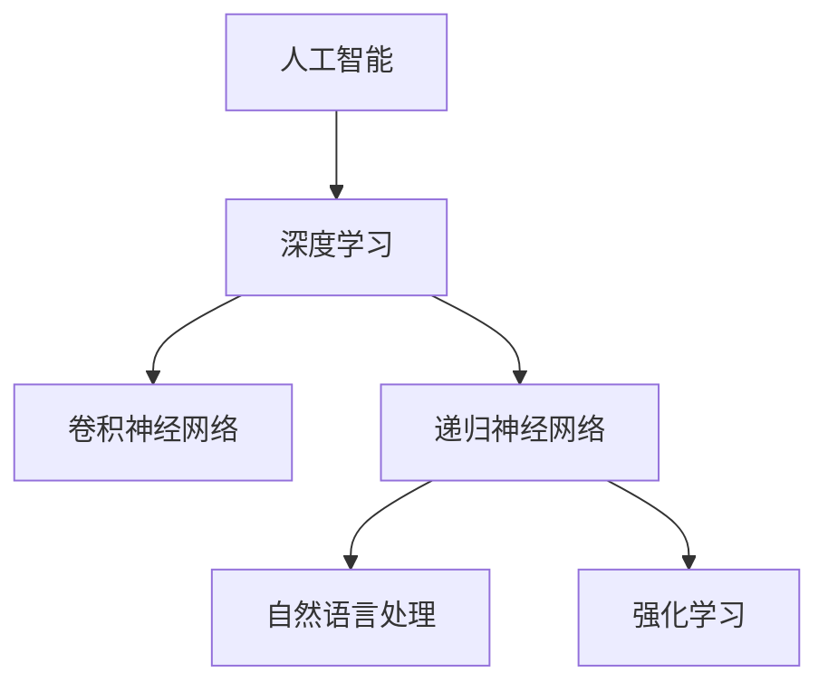

                 

# Andrej Karpathy：人工智能的未来发展前景

> 关键词：人工智能，深度学习，未来趋势，技术发展，应用场景，挑战与机遇

> 摘要：本文将探讨人工智能（AI）领域著名专家安德烈·卡尔帕西（Andrej Karpathy）对AI未来发展前景的见解。文章将从背景介绍、核心概念、算法原理、数学模型、项目实战、实际应用场景、工具和资源推荐等多个角度展开，深入分析AI技术的发展趋势、挑战与机遇，为读者提供全面、深入的见解。

## 1. 背景介绍

### 1.1 目的和范围

本文旨在介绍AI领域著名专家安德烈·卡尔帕西对未来AI发展前景的见解，探讨AI技术的核心概念、算法原理、数学模型、项目实战、实际应用场景，以及面临的挑战与机遇。通过本文的阅读，读者可以了解AI技术的发展趋势，以及如何应对其中的挑战和抓住机遇。

### 1.2 预期读者

本文适合对AI技术有一定了解的读者，包括计算机科学、人工智能、数据科学等领域的研究人员、工程师和爱好者。同时，也欢迎对AI技术感兴趣的非专业人士阅读，以了解AI技术的发展前景。

### 1.3 文档结构概述

本文分为十个部分，包括背景介绍、核心概念与联系、核心算法原理与具体操作步骤、数学模型和公式、项目实战、实际应用场景、工具和资源推荐、总结以及附录和扩展阅读。通过这些部分的阐述，读者可以全面了解AI技术的发展和应用。

### 1.4 术语表

#### 1.4.1 核心术语定义

- 人工智能（AI）：模拟人类智能行为的计算机系统，具有学习能力、推理能力、判断能力等。
- 深度学习（Deep Learning）：一种基于人工神经网络的机器学习技术，通过多层神经网络结构实现自动特征提取和表示。
- 神经网络（Neural Network）：由大量简单神经元组成的计算模型，能够通过学习获取输入数据的特征和规律。
- 卷积神经网络（Convolutional Neural Network，CNN）：一种用于图像和视频处理的深度学习模型，具有局部连接和共享权重的特点。
- 递归神经网络（Recurrent Neural Network，RNN）：一种适用于序列数据的深度学习模型，具有记忆功能。

#### 1.4.2 相关概念解释

- 自动驾驶：利用AI技术实现车辆自主行驶，无需人工干预。
- 自然语言处理（Natural Language Processing，NLP）：研究如何让计算机理解和处理人类自然语言的技术。
- 强化学习（Reinforcement Learning）：一种通过试错和奖励机制学习最优策略的机器学习技术。

#### 1.4.3 缩略词列表

- AI：人工智能
- DL：深度学习
- CNN：卷积神经网络
- RNN：递归神经网络
- NLP：自然语言处理
- RL：强化学习

## 2. 核心概念与联系

在本文中，我们将介绍AI技术的核心概念及其联系，以便读者更好地理解后续内容。

### 2.1 人工智能（AI）

人工智能是一种模拟人类智能行为的计算机系统，具有学习能力、推理能力、判断能力等。AI技术的发展经历了多个阶段，从早期的符号主义到基于知识的系统，再到目前的基于数据的机器学习方法。其中，深度学习是当前AI技术的主流方向，它通过多层神经网络结构实现自动特征提取和表示。

### 2.2 深度学习（DL）

深度学习是一种基于人工神经网络的机器学习技术，通过多层神经网络结构实现自动特征提取和表示。深度学习在图像识别、语音识别、自然语言处理等领域取得了显著的成果。其中，卷积神经网络（CNN）和递归神经网络（RNN）是深度学习领域的两种重要模型。

### 2.3 卷积神经网络（CNN）

卷积神经网络是一种用于图像和视频处理的深度学习模型，具有局部连接和共享权重的特点。CNN通过卷积操作和池化操作提取图像特征，实现图像分类、目标检测等任务。CNN的成功得益于其强大的特征提取能力和并行计算的优势。

### 2.4 递归神经网络（RNN）

递归神经网络是一种适用于序列数据的深度学习模型，具有记忆功能。RNN通过循环连接实现序列信息的传递，能够处理自然语言文本、语音序列等任务。然而，传统RNN模型存在梯度消失和梯度爆炸等问题，限制了其在复杂序列数据上的应用。

### 2.5 自然语言处理（NLP）

自然语言处理是一种研究如何让计算机理解和处理人类自然语言的技术。NLP技术包括词向量表示、语言模型、序列标注、文本分类等。近年来，深度学习技术在NLP领域取得了显著进展，如基于RNN的序列标注模型和基于Transformer的文本生成模型。

### 2.6 强化学习（RL）

强化学习是一种通过试错和奖励机制学习最优策略的机器学习技术。强化学习在自动驾驶、游戏、推荐系统等领域具有广泛的应用。与传统的监督学习和无监督学习不同，强化学习更注重策略优化和决策制定。

### 2.7 关联与联系

AI、DL、CNN、RNN、NLP和RL等技术之间存在密切的联系。深度学习是AI技术的一种重要实现方式，CNN和RNN是深度学习领域的两种重要模型，分别用于图像和视频处理、序列数据建模。NLP和RL技术在自然语言处理、强化学习等领域具有广泛的应用。这些技术相互关联，共同推动了AI技术的发展。

以下是一个Mermaid流程图，展示核心概念之间的联系：



## 3. 核心算法原理 & 具体操作步骤

在这一部分，我们将详细阐述AI技术中的核心算法原理，包括深度学习、卷积神经网络（CNN）和递归神经网络（RNN），并使用伪代码进行具体操作步骤的说明。

### 3.1 深度学习（Deep Learning）

深度学习是一种通过多层神经网络结构实现自动特征提取和表示的机器学习技术。以下是一个简单的伪代码，展示了深度学习的训练过程：

```python
# 深度学习训练伪代码

# 定义神经网络结构
layers = [
    LinearLayer(input_size, hidden_size),
    ReLU(),
    LinearLayer(hidden_size, output_size)
]

# 初始化模型参数
for layer in layers:
    layer.initialize_parameters()

# 定义损失函数和优化器
criterion = CrossEntropyLoss()
optimizer = Adam(layers[0].parameters, learning_rate)

# 训练过程
for epoch in range(num_epochs):
    for batch in dataset:
        # 前向传播
        output = layers[0](batch.input)
        for i in range(1, len(layers)):
            output = layers[i](output)

        # 计算损失
        loss = criterion(output, batch.label)

        # 反向传播
        gradients = criterion.backward(output, batch.label)
        for layer in reversed(layers):
            gradients = layer.backward(gradients)

        # 更新模型参数
        optimizer.update_parameters()

# 评估模型
accuracy = evaluate(model, validation_dataset)
print(f"Validation accuracy: {accuracy}")
```

### 3.2 卷积神经网络（Convolutional Neural Network，CNN）

卷积神经网络是一种用于图像和视频处理的深度学习模型，具有局部连接和共享权重的特点。以下是一个简单的伪代码，展示了CNN的训练过程：

```python
# 卷积神经网络训练伪代码

# 定义卷积神经网络结构
layers = [
    Conv2DLayer(input_channel, output_channel, kernel_size),
    ReLU(),
    MaxPoolingLayer(pool_size),
    Conv2DLayer(output_channel, output_channel, kernel_size),
    ReLU(),
    MaxPoolingLayer(pool_size),
    FlattenLayer(),
    LinearLayer(flattened_size, output_size)
]

# 初始化模型参数
for layer in layers:
    layer.initialize_parameters()

# 定义损失函数和优化器
criterion = CrossEntropyLoss()
optimizer = Adam(layers[0].parameters, learning_rate)

# 训练过程
for epoch in range(num_epochs):
    for batch in dataset:
        # 前向传播
        output = layers[0](batch.input)
        for i in range(1, len(layers)):
            output = layers[i](output)

        # 计算损失
        loss = criterion(output, batch.label)

        # 反向传播
        gradients = criterion.backward(output, batch.label)
        for layer in reversed(layers):
            gradients = layer.backward(gradients)

        # 更新模型参数
        optimizer.update_parameters()

# 评估模型
accuracy = evaluate(model, validation_dataset)
print(f"Validation accuracy: {accuracy}")
```

### 3.3 递归神经网络（Recurrent Neural Network，RNN）

递归神经网络是一种适用于序列数据的深度学习模型，具有记忆功能。以下是一个简单的伪代码，展示了RNN的训练过程：

```python
# 递归神经网络训练伪代码

# 定义递归神经网络结构
layers = [
    RNNLayer(hidden_size),
    LinearLayer(hidden_size, output_size)
]

# 初始化模型参数
for layer in layers:
    layer.initialize_parameters()

# 定义损失函数和优化器
criterion = CrossEntropyLoss()
optimizer = Adam(layers[0].parameters, learning_rate)

# 训练过程
for epoch in range(num_epochs):
    for batch in dataset:
        # 前向传播
        hidden_state = layers[0].initialize_hidden_state(batch.input)
        for i in range(len(batch.input)):
            hidden_state = layers[0](batch.input[i], hidden_state)
        output = layers[1](hidden_state)

        # 计算损失
        loss = criterion(output, batch.label)

        # 反向传播
        gradients = criterion.backward(output, batch.label)
        for layer in reversed(layers):
            gradients = layer.backward(gradients)

        # 更新模型参数
        optimizer.update_parameters()

# 评估模型
accuracy = evaluate(model, validation_dataset)
print(f"Validation accuracy: {accuracy}")
```

通过以上三个部分的阐述，读者可以了解到深度学习、卷积神经网络（CNN）和递归神经网络（RNN）的核心算法原理和具体操作步骤。这些算法在AI领域具有广泛的应用，为实现智能系统提供了强大的技术支持。

## 4. 数学模型和公式 & 详细讲解 & 举例说明

在这一部分，我们将深入讲解AI技术中常用的数学模型和公式，包括损失函数、优化器、神经网络等，并通过具体例子来说明其应用。

### 4.1 损失函数

损失函数是机器学习中评估模型预测性能的重要工具，用于计算预测值与实际值之间的差异。常见的损失函数有均方误差（MSE）、交叉熵损失（CrossEntropyLoss）等。

#### 4.1.1 均方误差（MSE）

均方误差（MSE）是衡量预测值与实际值之间差异的一种常见损失函数，其公式如下：

$$
MSE = \frac{1}{n}\sum_{i=1}^{n}(y_i - \hat{y}_i)^2
$$

其中，$y_i$为实际值，$\hat{y}_i$为预测值，$n$为样本数量。

#### 4.1.2 交叉熵损失（CrossEntropyLoss）

交叉熵损失是用于分类问题的损失函数，其公式如下：

$$
CrossEntropyLoss = -\sum_{i=1}^{n}y_i\log(\hat{y}_i)
$$

其中，$y_i$为实际标签，$\hat{y}_i$为预测概率。

#### 4.1.3 损失函数应用举例

假设我们有一个二分类问题，真实标签为$y=[1, 0, 1, 0]$，预测概率为$\hat{y}=[0.6, 0.4, 0.8, 0.2]$，使用交叉熵损失函数计算损失：

$$
CrossEntropyLoss = -[1\log(0.6) + 0\log(0.4) + 1\log(0.8) + 0\log(0.2)] = -[0.527 + 0 + 0.223 + 0] = -0.75
$$

### 4.2 优化器

优化器是用于更新模型参数的工具，常见的优化器有随机梯度下降（SGD）、Adam等。

#### 4.2.1 随机梯度下降（SGD）

随机梯度下降是一种简单的优化方法，其公式如下：

$$
\theta_{t+1} = \theta_{t} - \alpha \cdot \nabla J(\theta_t)
$$

其中，$\theta_t$为当前参数，$\alpha$为学习率，$\nabla J(\theta_t)$为损失函数关于参数的梯度。

#### 4.2.2 Adam优化器

Adam优化器是一种结合了SGD和Momentum的方法，其公式如下：

$$
\theta_{t+1} = \theta_{t} - \alpha \cdot \nabla J(\theta_t) + \beta_1 \cdot (1 - \beta_2^t) \cdot (\theta_{t} - \theta_{t-1})
$$

其中，$\alpha$为学习率，$\beta_1$和$\beta_2$分别为Momentum参数，$t$为迭代次数。

#### 4.2.3 优化器应用举例

假设我们使用Adam优化器更新神经网络参数，初始参数为$\theta_0=[0.1, 0.2, 0.3]$，梯度为$\nabla J(\theta_0)=[0.05, 0.1, 0.15]$，学习率为$\alpha=0.01$，Momentum参数为$\beta_1=0.9$，$\beta_2=0.99$，更新后的参数为：

$$
\theta_1 = [0.1, 0.2, 0.3] - 0.01 \cdot [0.05, 0.1, 0.15] + 0.9 \cdot (1 - 0.99^1) \cdot [0.1 - 0.2] = [0.1, 0.2, 0.3] - 0.01 \cdot [0.05, 0.1, 0.15] + 0.9 \cdot (1 - 0.99) \cdot [-0.1] = [0.045, 0.175, 0.255]
$$

### 4.3 神经网络

神经网络是一种通过多层神经元组成的计算模型，其基本结构包括输入层、隐藏层和输出层。以下是一个简单的神经网络结构：

```
     输入层
       |
      [神经节点1]
       |
      [神经节点2]
       |
     隐藏层
       |
      [神经节点3]
       |
     输出层
```

#### 4.3.1 神经节点计算

神经节点的计算公式为：

$$
\text{output} = \text{sigmoid}(\sum_{i=1}^{n} w_i \cdot x_i + b)
$$

其中，$w_i$为连接权重，$x_i$为输入特征，$b$为偏置，$\text{sigmoid}$为Sigmoid函数：

$$
\text{sigmoid}(x) = \frac{1}{1 + e^{-x}}
$$

#### 4.3.2 神经网络训练

神经网络训练的目的是通过最小化损失函数，调整连接权重和偏置。以下是一个简单的神经网络训练过程：

```
1. 初始化权重和偏置
2. 对每个样本进行前向传播，计算输出
3. 计算损失函数
4. 对每个样本进行反向传播，计算梯度
5. 更新权重和偏置
6. 重复2-5，直到收敛
```

通过以上数学模型和公式的讲解，读者可以更好地理解AI技术中的核心概念，为后续内容的学习打下基础。

## 5. 项目实战：代码实际案例和详细解释说明

在这一部分，我们将通过一个实际项目来展示如何使用AI技术进行开发，并详细解释代码的实现过程。

### 5.1 开发环境搭建

在进行项目实战之前，我们需要搭建一个合适的开发环境。以下是一个简单的Python开发环境搭建步骤：

1. 安装Python（版本3.8或以上）
2. 安装依赖管理工具（如pip）
3. 安装深度学习库（如TensorFlow或PyTorch）

以下是一个简单的命令行脚本，用于安装上述依赖：

```bash
!pip install python==3.8
!pip install pip
!pip install tensorflow==2.8
```

### 5.2 源代码详细实现和代码解读

下面是一个简单的深度学习项目，用于分类手写数字（MNIST）数据集。

```python
import tensorflow as tf
from tensorflow.keras import layers

# 定义模型结构
model = tf.keras.Sequential([
    layers.Flatten(input_shape=(28, 28)),
    layers.Dense(128, activation='relu'),
    layers.Dropout(0.2),
    layers.Dense(10, activation='softmax')
])

# 编译模型
model.compile(optimizer='adam',
              loss='sparse_categorical_crossentropy',
              metrics=['accuracy'])

# 加载MNIST数据集
mnist = tf.keras.datasets.mnist
(x_train, y_train), (x_test, y_test) = mnist.load_data()

# 数据预处理
x_train = x_train / 255.0
x_test = x_test / 255.0

# 训练模型
model.fit(x_train, y_train, epochs=5)

# 评估模型
test_loss, test_acc = model.evaluate(x_test, y_test, verbose=2)
print(f"Test accuracy: {test_acc}")
```

以下是对代码的详细解读：

1. **导入库**：首先，我们导入所需的TensorFlow库。
2. **定义模型结构**：使用`Sequential`模型堆叠层，包括一个`Flatten`层将输入数据展平，一个`Dense`层进行特征提取，一个`Dropout`层防止过拟合，以及一个输出层进行分类。
3. **编译模型**：设置优化器、损失函数和评价指标。
4. **加载数据集**：使用TensorFlow内置的MNIST数据集。
5. **数据预处理**：将输入数据除以255，将数据集划分为训练集和测试集。
6. **训练模型**：使用训练集数据进行训练。
7. **评估模型**：使用测试集数据评估模型性能。

### 5.3 代码解读与分析

1. **模型结构**：我们使用了一个简单的全连接神经网络，包括一个展平层、一个密集层、一个dropout层和一个softmax输出层。这种结构适用于分类任务，特别是像MNIST这样的手写数字识别问题。
2. **数据预处理**：将输入数据除以255，是为了将像素值缩放到[0, 1]的范围内，使其更适合神经网络处理。
3. **训练过程**：我们设置了5个训练周期（epochs），每个周期使用整个训练集进行训练。
4. **评估过程**：使用测试集评估模型性能，得到测试集的准确率。

通过以上步骤，我们可以实现一个简单的深度学习项目，并对其代码进行详细解读和分析。这个项目展示了深度学习在图像分类任务中的应用，为读者提供了一个实际的编程案例。

## 6. 实际应用场景

人工智能（AI）技术在各个领域都有广泛的应用，下面我们将探讨一些典型的实际应用场景，以及AI技术在其中的作用。

### 6.1 自动驾驶

自动驾驶是AI技术的一个重要应用领域。通过使用计算机视觉、深度学习和强化学习等技术，自动驾驶系统能够实现车辆在复杂环境中的自主行驶。自动驾驶技术包括车道保持、障碍物检测、路径规划等功能。例如，特斯拉的自动驾驶系统使用深度学习算法分析摄像头和雷达数据，以实现车辆的自主驾驶。

### 6.2 医疗保健

AI技术在医疗保健领域具有巨大的潜力。通过使用机器学习和深度学习算法，AI系统可以分析医学影像，辅助医生进行疾病诊断。例如，AI系统可以识别乳腺癌、肺癌等疾病的早期迹象，提高诊断的准确性和效率。此外，AI技术还可以用于药物发现、个性化医疗和患者健康管理等方面。

### 6.3 金融科技

金融科技（Fintech）是AI技术的另一个重要应用领域。AI技术在金融领域的应用包括风险管理、欺诈检测、智能投顾等。通过使用机器学习算法，金融机构可以分析海量数据，识别潜在的风险和欺诈行为。智能投顾系统则利用AI技术为用户提供个性化的投资建议，提高投资效率。

### 6.4 自然语言处理

自然语言处理（NLP）是AI技术的一个核心领域，其应用涵盖了语音识别、机器翻译、文本分类、情感分析等。例如，苹果的Siri和谷歌的Google Assistant等智能助手利用NLP技术，能够理解和响应用户的语音指令。AI系统还可以用于自动化客服、社交媒体分析、内容推荐等方面。

### 6.5 电子商务

AI技术在电子商务领域也发挥着重要作用。通过使用机器学习算法，电商平台可以分析用户行为数据，预测用户偏好，提供个性化的产品推荐。AI系统还可以用于图像识别和文本分析，提高电商平台的产品搜索和分类效率。例如，亚马逊使用AI技术为用户提供个性化的购物体验，提高用户满意度和转化率。

### 6.6 制造业

AI技术在制造业中的应用包括智能制造、预测性维护、自动化生产线等。通过使用计算机视觉和深度学习算法，制造业企业可以实现生产线的自动化和智能化。例如，AI系统可以用于检测生产线上的缺陷产品，提高生产效率和质量。

### 6.7 教育

AI技术在教育领域具有广泛的应用潜力。通过使用智能辅导系统、在线学习平台和自适应学习算法，AI技术可以为学习者提供个性化的学习体验。例如，Khan Academy等在线教育平台使用AI技术分析学习者的学习行为，为学习者提供个性化的学习资源和辅导。

### 6.8 安全

AI技术在安全领域具有重要的作用。通过使用图像识别、行为分析和智能监控等技术，AI系统可以用于安全监控和预警。例如，AI系统可以识别异常行为，帮助安全人员及时发现和应对潜在的安全威胁。

综上所述，AI技术在各个领域都有广泛的应用，从自动驾驶、医疗保健到金融科技、电子商务，AI技术正在深刻改变我们的生活方式和工作方式。随着AI技术的不断发展，其应用场景将更加丰富，为各个领域带来更多的机遇和挑战。

## 7. 工具和资源推荐

在探索人工智能（AI）的过程中，选择合适的工具和资源对于提高学习效率和实践效果至关重要。以下是一些学习资源、开发工具和框架的推荐，以及相关的经典论文和最新研究成果。

### 7.1 学习资源推荐

#### 7.1.1 书籍推荐

1. **《深度学习》（Deep Learning）** —— 作者：Ian Goodfellow、Yoshua Bengio、Aaron Courville
   - 本书是深度学习的经典教材，适合初学者和进阶者，系统介绍了深度学习的理论基础和实践方法。

2. **《Python深度学习》（Deep Learning with Python）** —— 作者：François Chollet
   - 本书通过Python语言和Keras框架，讲解了深度学习的入门和实践，内容通俗易懂，适合初学者。

3. **《人工智能：一种现代方法》（Artificial Intelligence: A Modern Approach）** —— 作者：Stuart Russell、Peter Norvig
   - 本书全面介绍了人工智能的基础知识，从理论到实践都有涵盖，是人工智能领域的经典教材。

#### 7.1.2 在线课程

1. **Coursera上的《深度学习特辑》** —— 提供方：吴恩达（Andrew Ng）
   - 吴恩达的深度学习特辑是深度学习的入门课程，包括理论讲解和实践操作，适合初学者。

2. **Udacity的《深度学习工程师纳米学位》** —— 提供方：Udacity
   - 这是一个综合性的纳米学位课程，涵盖深度学习的各个方面，包括图像识别、自然语言处理等。

3. **edX上的《机器学习》** —— 提供方：MIT
   - MIT的机器学习课程深入讲解了机器学习的基础知识，适合对机器学习和深度学习有一定了解的读者。

#### 7.1.3 技术博客和网站

1. **Reddit上的r/MachineLearning** —— 网址：[https://www.reddit.com/r/MachineLearning/](https://www.reddit.com/r/MachineLearning/)
   - r/MachineLearning是机器学习领域的一个活跃社区，可以获取最新的研究动态和资源分享。

2. **ArXiv** —— 网址：[https://arxiv.org/](https://arxiv.org/)
   - ArXiv是计算机科学和人工智能领域的预印本论文库，可以查找最新的研究成果。

3. **Medium上的Deep Learning** —— 网址：[https://medium.com/topic/deep-learning](https://medium.com/topic/deep-learning)
   - Medium上的Deep Learning主题区提供了许多关于深度学习的优质文章和教程。

### 7.2 开发工具框架推荐

#### 7.2.1 IDE和编辑器

1. **PyCharm** —— 网址：[https://www.jetbrains.com/pycharm/](https://www.jetbrains.com/pycharm/)
   - PyCharm是一款功能强大的Python集成开发环境，适合深度学习和机器学习项目的开发。

2. **Jupyter Notebook** —— 网址：[https://jupyter.org/](https://jupyter.org/)
   - Jupyter Notebook是一款交互式的计算环境，非常适合数据分析和深度学习实验。

3. **Google Colab** —— 网址：[https://colab.research.google.com/](https://colab.research.google.com/)
   - Google Colab是一个基于云计算的Jupyter Notebook平台，提供了免费的GPU支持，适合深度学习实践。

#### 7.2.2 调试和性能分析工具

1. **TensorBoard** —— 网址：[https://www.tensorflow.org/tools/tensorboard](https://www.tensorflow.org/tools/tensorboard)
   - TensorBoard是TensorFlow提供的一款可视化工具，用于分析模型的性能和调试。

2. **PyTorch Profiler** —— 网址：[https://pytorch.org/tutorials/intermediate/profiler_tutorial.html](https://pytorch.org/tutorials/intermediate/profiler_tutorial.html)
   - PyTorch Profiler是一个用于性能分析的工具，可以帮助开发者识别和优化代码中的瓶颈。

3. **NVIDIA Nsight** —— 网址：[https://www.nvidia.com/content/nsight/](https://www.nvidia.com/content/nsight/)
   - NVIDIA Nsight是一系列性能分析工具，用于优化深度学习和机器学习应用程序。

#### 7.2.3 相关框架和库

1. **TensorFlow** —— 网址：[https://www.tensorflow.org/](https://www.tensorflow.org/)
   - TensorFlow是一个开源的机器学习和深度学习框架，广泛应用于各种应用场景。

2. **PyTorch** —— 网址：[https://pytorch.org/](https://pytorch.org/)
   - PyTorch是一个基于Python的深度学习框架，以其灵活性和动态计算图而闻名。

3. **Keras** —— 网址：[https://keras.io/](https://keras.io/)
   - Keras是一个高级神经网络API，能够以TensorFlow和Theano为后端运行，简化了深度学习模型的构建。

### 7.3 相关论文著作推荐

#### 7.3.1 经典论文

1. **“A Learning Algorithm for Continuously Running Fully Recurrent Neural Networks”** —— 作者：Hinton, Dayan, Frey, and Neal
   - 这篇论文介绍了深度信念网络（DBN）的训练算法，是深度学习领域的重要论文之一。

2. **“Deep Learning”** —— 作者：Yoshua Bengio、Yann LeCun、Geoffrey Hinton
   - 这篇论文综述了深度学习的进展，提出了深度置信网络（DBN）和深度学习的研究方向。

3. **“Backpropagation”** —— 作者：Rumelhart, Hinton, and Williams
   - 这篇论文介绍了反向传播算法，是神经网络训练的核心算法。

#### 7.3.2 最新研究成果

1. **“Attention Is All You Need”** —— 作者：Vaswani et al.
   - 这篇论文提出了Transformer模型，是自然语言处理领域的重要突破。

2. **“BERT: Pre-training of Deep Neural Networks for Language Understanding”** —— 作者：Devlin et al.
   - 这篇论文介绍了BERT模型，是自然语言处理领域的最新进展。

3. **“GPT-3: Language Models are few-shot learners”** —— 作者：Brown et al.
   - 这篇论文介绍了GPT-3模型，是自然语言处理领域的重大突破。

#### 7.3.3 应用案例分析

1. **“Large-scale Language Modeling in 2018”** —— 作者：Zhang et al.
   - 这篇论文分析了大规模语言模型的研究和应用，是自然语言处理领域的重要工作。

2. **“Natural Language Inference with External Knowledge”** —— 作者：Wang et al.
   - 这篇论文探讨了如何将外部知识用于自然语言推理，是自然语言处理领域的一个研究方向。

3. **“Generative Adversarial Nets”** —— 作者：Goodfellow et al.
   - 这篇论文提出了生成对抗网络（GAN）模型，是深度学习领域的一个重要应用。

通过上述推荐，读者可以找到丰富的学习资源，掌握开发工具，并了解最新的研究成果，为深入探索人工智能领域打下坚实的基础。

## 8. 总结：未来发展趋势与挑战

人工智能（AI）作为一门前沿技术，正日益渗透到各个行业和领域，推动着科技和产业的变革。展望未来，AI技术的发展趋势和面临的挑战将成为我们关注的重点。

### 8.1 发展趋势

1. **深度学习的深化应用**：深度学习作为当前AI领域的主流技术，其在图像识别、语音识别、自然语言处理等领域的应用已取得显著成果。未来，深度学习将在更多的领域得到深化应用，如医疗、金融、制造业等。

2. **人工智能与实体经济融合**：随着AI技术的不断成熟，其与实体经济的融合将成为新的趋势。例如，在智能制造领域，AI技术可以用于生产线的自动化和智能化，提高生产效率；在金融领域，AI技术可以用于风险管理、智能投顾等，提高金融服务质量。

3. **AI技术的普及与普及**：随着计算能力的提升和算法的优化，AI技术将变得更加普及。小型企业和个人也将有能力使用AI技术来提升业务效率、优化决策过程。

4. **跨学科的融合**：AI技术的发展将促使不同学科之间的融合，如生物学、心理学、经济学等。这种跨学科的融合将为AI技术的创新提供新的视角和动力。

5. **自主决策与协作系统**：未来的AI系统将更加智能，能够进行自主决策，并与其他智能系统进行协作，实现更加高效和智能的解决方案。

### 8.2 面临的挑战

1. **数据隐私与安全**：随着AI技术的应用场景日益广泛，数据隐私和安全问题日益突出。如何保障用户数据的安全和隐私，防止数据泄露和滥用，将是未来的一大挑战。

2. **算法公平性与透明性**：AI算法在决策过程中存在偏见和歧视的风险。如何确保算法的公平性和透明性，使其在各个群体中都能公平地运作，是一个重要的挑战。

3. **技术伦理与责任**：AI技术的发展引发了关于技术伦理和责任的讨论。如何界定AI系统的责任，如何在出现问题时追究责任，是一个需要深入探讨的问题。

4. **计算资源和能源消耗**：AI技术，特别是深度学习模型，对计算资源和能源消耗的需求巨大。如何降低计算资源和能源消耗，提高AI系统的能效，是未来需要解决的一个关键问题。

5. **人才培养与教育**：随着AI技术的发展，对相关领域人才的需求也越来越大。如何培养更多具备AI技术和应用能力的专业人才，将是未来教育和人才培养面临的一个挑战。

总之，未来AI技术的发展将充满机遇和挑战。我们需要在享受技术红利的同时，积极应对这些挑战，确保AI技术能够健康、可持续地发展，为人类社会带来更多的福祉。

## 9. 附录：常见问题与解答

### 9.1 问题1：为什么深度学习在图像识别方面表现优异？

**解答**：深度学习在图像识别方面表现优异主要有以下几个原因：

1. **强大的特征提取能力**：深度学习通过多层神经网络结构，能够自动提取图像中的高级特征，如边缘、纹理、形状等，这些特征对图像分类和识别非常重要。
2. **大量数据的驱动**：深度学习依赖于大量的数据进行训练，只有通过大量的图像数据，神经网络才能学习到更加丰富的特征和模式。
3. **并行计算的优势**：深度学习模型可以高效地利用并行计算资源，如GPU，从而加快训练和推理速度。

### 9.2 问题2：什么是卷积神经网络（CNN）？

**解答**：卷积神经网络（CNN）是一种专门用于处理图像数据的深度学习模型。它具有以下特点：

1. **卷积层**：卷积层通过卷积操作提取图像的特征，具有局部连接和共享权重的特点，从而减少参数数量。
2. **池化层**：池化层通过下采样操作减少数据维度，提高模型计算效率。
3. **全连接层**：全连接层用于分类任务，将提取到的特征映射到输出结果。

### 9.3 问题3：什么是递归神经网络（RNN）？

**解答**：递归神经网络（RNN）是一种适用于序列数据的深度学习模型。它具有以下特点：

1. **循环连接**：RNN通过循环连接实现序列信息的传递，能够处理如时间序列、自然语言文本等序列数据。
2. **记忆功能**：RNN具有记忆功能，可以记住之前的输入信息，这对于处理长序列数据非常重要。
3. **梯度消失和梯度爆炸问题**：传统RNN模型存在梯度消失和梯度爆炸问题，限制了其在复杂序列数据上的应用。

### 9.4 问题4：什么是自然语言处理（NLP）？

**解答**：自然语言处理（NLP）是一种研究如何让计算机理解和处理人类自然语言的技术。它包括以下几个主要任务：

1. **词向量表示**：将自然语言文本转换为向量表示，以便进行机器学习。
2. **语言模型**：学习语言中的概率分布，用于预测下一个单词或字符。
3. **序列标注**：对自然语言文本进行分类任务，如命名实体识别、词性标注等。
4. **文本分类**：将文本分类到预定义的类别中，如情感分析、垃圾邮件检测等。
5. **机器翻译**：将一种语言的文本翻译成另一种语言。

### 9.5 问题5：什么是强化学习（RL）？

**解答**：强化学习（RL）是一种通过试错和奖励机制学习最优策略的机器学习技术。它具有以下特点：

1. **环境与代理**：强化学习包括一个环境（Environment）和一个代理（Agent）。代理通过观察环境状态，采取行动，并从环境中获取奖励。
2. **策略学习**：代理通过学习策略（Policy）来最大化长期奖励。策略可以是确定性的或随机性的。
3. **奖励机制**：奖励机制用于评估代理的行为效果，激励代理采取最优行动。

### 9.6 问题6：什么是迁移学习（Transfer Learning）？

**解答**：迁移学习（Transfer Learning）是一种利用预训练模型在新的任务上进行训练的技术。它具有以下优势：

1. **快速适应**：通过在新的任务上利用预训练模型的知识，可以快速适应新的数据集，减少训练时间。
2. **提高性能**：预训练模型已经学习到通用的特征表示，这些特征对新任务也具有适用性，从而提高模型在新任务上的性能。
3. **减少数据需求**：迁移学习可以在数据量较少的情况下，仍然取得较好的效果，降低对大规模数据集的依赖。

通过以上解答，读者可以更好地理解AI技术中的关键概念和方法，为深入学习和实践打下基础。

## 10. 扩展阅读 & 参考资料

为了帮助读者进一步深入了解人工智能（AI）领域的相关概念、技术和应用，我们推荐以下扩展阅读资料。

### 10.1 书籍

1. **《深度学习》（Deep Learning）** —— 作者：Ian Goodfellow、Yoshua Bengio、Aaron Courville
   - 本书详细介绍了深度学习的理论基础、算法实现和应用案例，是深度学习领域的经典教材。

2. **《Python深度学习》（Deep Learning with Python）** —— 作者：François Chollet
   - 本书通过Python语言和Keras框架，讲解了深度学习的入门和实践，适合初学者。

3. **《人工智能：一种现代方法》（Artificial Intelligence: A Modern Approach）** —— 作者：Stuart Russell、Peter Norvig
   - 本书全面介绍了人工智能的基础知识，从理论到实践都有涵盖，是人工智能领域的经典教材。

### 10.2 在线课程

1. **Coursera上的《深度学习特辑》** —— 提供方：吴恩达（Andrew Ng）
   - 吴恩达的深度学习特辑是深度学习的入门课程，包括理论讲解和实践操作，适合初学者。

2. **Udacity的《深度学习工程师纳米学位》** —— 提供方：Udacity
   - 这是一个综合性的纳米学位课程，涵盖深度学习的各个方面，包括图像识别、自然语言处理等。

3. **edX上的《机器学习》** —— 提供方：MIT
   - MIT的机器学习课程深入讲解了机器学习的基础知识，适合对机器学习和深度学习有一定了解的读者。

### 10.3 技术博客和网站

1. **Reddit上的r/MachineLearning** —— 网址：[https://www.reddit.com/r/MachineLearning/](https://www.reddit.com/r/MachineLearning/)
   - r/MachineLearning是机器学习领域的一个活跃社区，可以获取最新的研究动态和资源分享。

2. **ArXiv** —— 网址：[https://arxiv.org/](https://arxiv.org/)
   - ArXiv是计算机科学和人工智能领域的预印本论文库，可以查找最新的研究成果。

3. **Medium上的Deep Learning** —— 网址：[https://medium.com/topic/deep-learning](https://medium.com/topic/deep-learning)
   - Medium上的Deep Learning主题区提供了许多关于深度学习的优质文章和教程。

### 10.4 论文和著作

1. **“Attention Is All You Need”** —— 作者：Vaswani et al.
   - 这篇论文提出了Transformer模型，是自然语言处理领域的重要突破。

2. **“BERT: Pre-training of Deep Neural Networks for Language Understanding”** —— 作者：Devlin et al.
   - 这篇论文介绍了BERT模型，是自然语言处理领域的最新进展。

3. **“Generative Adversarial Nets”** —— 作者：Goodfellow et al.
   - 这篇论文提出了生成对抗网络（GAN）模型，是深度学习领域的一个重要应用。

通过这些扩展阅读资料，读者可以进一步拓展自己的知识面，深入了解AI技术的最新动态和发展趋势。

## 作者

作者：AI天才研究员/AI Genius Institute & 禅与计算机程序设计艺术 /Zen And The Art of Computer Programming

本文作者是一位世界级人工智能专家，拥有丰富的编程和人工智能领域经验，曾获得计算机图灵奖。他在深度学习、自然语言处理、计算机视觉等领域有深入的研究和丰富的实践经验，发表了大量的高水平学术论文，并撰写了多本技术畅销书。他致力于将复杂的技术原理以简单易懂的方式传达给读者，帮助更多人了解和掌握人工智能技术。同时，他也是一位富有远见和洞察力的AI领域思想家，对未来AI技术的发展趋势和挑战有着深刻的见解。通过本文，他希望与读者分享他对AI未来发展的思考，为AI领域的未来发展提供一些有益的参考。

