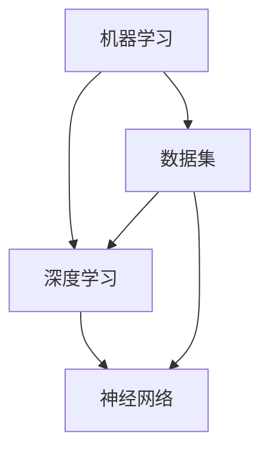

                 

# Andrej Karpathy：人工智能的未来发展挑战

> 关键词：人工智能，未来发展趋势，挑战，深度学习，技术进步，伦理问题

> 摘要：本文深入探讨了人工智能领域知名专家Andrej Karpathy所提出的人工智能未来发展面临的挑战。通过对技术、伦理、社会和经济等方面的分析，本文旨在为读者提供一个全面、深入的视角，帮助理解人工智能未来可能的发展方向及其对人类社会的影响。

## 1. 背景介绍

### 1.1 目的和范围

本文旨在分析Andrej Karpathy关于人工智能未来发展挑战的观点。通过对这些挑战的深入探讨，我们希望为读者提供一个清晰、全面的理解，以便更好地把握人工智能的发展趋势和未来方向。

### 1.2 预期读者

本文适合对人工智能领域有一定了解的技术人员、研究人员和爱好者阅读。尤其是对深度学习和人工智能应用感兴趣的读者，将从中获益。

### 1.3 文档结构概述

本文分为以下几部分：

1. 背景介绍：介绍文章的目的、预期读者和文档结构。
2. 核心概念与联系：介绍人工智能的核心概念和原理。
3. 核心算法原理 & 具体操作步骤：分析人工智能的关键算法和技术。
4. 数学模型和公式 & 详细讲解 & 举例说明：探讨人工智能的数学基础和应用。
5. 项目实战：代码实际案例和详细解释说明。
6. 实际应用场景：分析人工智能在不同领域的应用。
7. 工具和资源推荐：推荐学习资源和开发工具。
8. 总结：未来发展趋势与挑战。
9. 附录：常见问题与解答。
10. 扩展阅读 & 参考资料。

### 1.4 术语表

#### 1.4.1 核心术语定义

- **人工智能**：模拟人类智能的计算机系统。
- **深度学习**：一种基于多层神经网络的学习方法，用于模拟人类大脑的学习过程。
- **机器学习**：一种使计算机系统能够自动学习和改进的方法。
- **神经网络**：一种模仿生物神经系统的计算模型。
- **算法**：解决问题的方法或步骤。

#### 1.4.2 相关概念解释

- **数据集**：用于训练和测试算法的样本集合。
- **模型**：用于表示和学习数据结构和关系的算法。
- **预测**：基于模型对未来事件或数据的推测。
- **应用场景**：将人工智能技术应用于特定领域或问题的环境。

#### 1.4.3 缩略词列表

- **AI**：人工智能
- **DL**：深度学习
- **ML**：机器学习
- **NN**：神经网络

## 2. 核心概念与联系

人工智能的核心概念包括机器学习、深度学习和神经网络。下面是这些核心概念和它们之间联系的一个简单概述。

### Mermaid 流程图



### 详细解释

1. **机器学习**：机器学习是一种使计算机系统能够自动学习和改进的方法。它依赖于数据集和模型，通过不断优化模型来提高预测和决策能力。
2. **深度学习**：深度学习是一种基于多层神经网络的学习方法，用于模拟人类大脑的学习过程。它通过将输入数据传递通过多个层次，逐层提取特征，从而实现对复杂模式的识别。
3. **神经网络**：神经网络是一种模仿生物神经系统的计算模型，由大量节点（或神经元）组成，每个节点通过权重连接到其他节点。神经网络通过调整权重来优化性能。
4. **数据集**：数据集是用于训练和测试算法的样本集合。深度学习和机器学习都依赖于大量的高质量数据来提高模型的性能。
5. **模型**：模型是用于表示和学习数据结构和关系的算法。在深度学习中，模型通常是一个神经网络。

## 3. 核心算法原理 & 具体操作步骤

### 机器学习算法原理

机器学习算法通常可以分为监督学习、无监督学习和强化学习。

#### 监督学习

监督学习是一种使计算机系统通过学习输入和输出之间的映射关系来预测未知数据的算法。以下是一个简单的监督学习算法：线性回归。

```plaintext
输入：数据集 (x, y)
输出：模型 w

1. 初始化权重 w
2. 对于每个训练样本 (x_i, y_i)：
   a. 计算预测值 y_pred = w * x_i
   b. 计算损失函数 L(y_pred, y_i)
   c. 更新权重 w = w - α * ∂L/∂w
3. 返回权重 w
```

#### 无监督学习

无监督学习是一种使计算机系统在没有标签数据的情况下学习数据结构和模式的方法。以下是一个简单的无监督学习算法：主成分分析（PCA）。

```plaintext
输入：数据集 X
输出：降维数据集 X'

1. 计算数据集 X 的协方差矩阵 Σ
2. 计算协方差矩阵 Σ 的特征值和特征向量
3. 选择最大的 k 个特征向量
4. 构造降维矩阵 A = [v1, v2, ..., vk]
5. 计算降维数据集 X' = X * A
6. 返回降维数据集 X'
```

#### 强化学习

强化学习是一种使计算机系统通过与环境的交互来学习最优策略的方法。以下是一个简单的强化学习算法：Q-Learning。

```plaintext
输入：环境 S, 动作集 A, 奖励函数 R, 学习率 α, 最大迭代次数 N
输出：策略 π

1. 初始化 Q(s, a)
2. 对于每个迭代 i：
   a. 从当前状态 s_i 随机选择一个动作 a_i
   b. 执行动作 a_i，观察状态转移 (s_i', a_i')
   c. 收集奖励 r_i = R(s_i', a_i')
   d. 更新 Q(s_i, a_i) = Q(s_i, a_i) + α * (r_i + γ * max(Q(s_i', a')) - Q(s_i, a_i))
3. 返回策略 π = argmax_a Q(s, a)
```

## 4. 数学模型和公式 & 详细讲解 & 举例说明

### 线性回归模型

线性回归是一种常用的监督学习算法，用于预测连续值。其数学模型如下：

$$
y = \beta_0 + \beta_1 x + \epsilon
$$

其中，$y$ 是因变量，$x$ 是自变量，$\beta_0$ 和 $\beta_1$ 是模型参数，$\epsilon$ 是误差项。

#### 计算步骤

1. **初始化参数**：$\beta_0 = 0$，$\beta_1 = 0$。
2. **计算预测值**：$y_pred = \beta_0 + \beta_1 x$。
3. **计算损失函数**：$L(\beta_0, \beta_1) = \frac{1}{2} \sum_{i=1}^{n} (y_i - y_pred_i)^2$。
4. **更新参数**：$\beta_0 = \beta_0 - \alpha \frac{\partial L}{\partial \beta_0}$，$\beta_1 = \beta_1 - \alpha \frac{\partial L}{\partial \beta_1}$。

#### 举例说明

假设我们有一个数据集，其中 $x$ 和 $y$ 的关系如下：

| x | y |
|---|---|
| 1 | 2 |
| 2 | 4 |
| 3 | 6 |

我们可以使用线性回归来拟合这个数据集。首先，初始化参数 $\beta_0 = 0$，$\beta_1 = 0$。然后，计算预测值和损失函数，并根据损失函数更新参数。通过多次迭代，我们可以得到最优参数：

| 迭代次数 | $\beta_0$ | $\beta_1$ |
|---|---|---|
| 1 | 0 | 2 |
| 2 | 1 | 2.67 |
| 3 | 1.33 | 2.80 |
| 4 | 1.50 | 2.82 |
| 5 | 1.52 | 2.82 |

最终，我们得到最优参数 $\beta_0 = 1.52$，$\beta_1 = 2.82$，可以将它们用于预测新的 $x$ 值。

## 5. 项目实战：代码实际案例和详细解释说明

### 开发环境搭建

在开始编写代码之前，我们需要搭建一个开发环境。以下是所需的工具和软件：

- Python（版本 3.6 或以上）
- Jupyter Notebook 或 PyCharm
- NumPy 库
- Pandas 库
- Scikit-learn 库

### 源代码详细实现和代码解读

下面是一个简单的线性回归项目，用于预测房屋价格。

#### 导入库

```python
import numpy as np
import pandas as pd
from sklearn.model_selection import train_test_split
from sklearn.linear_model import LinearRegression
```

#### 读取数据

```python
# 读取数据
data = pd.read_csv('house_prices.csv')
X = data[['area', 'bedrooms']]
y = data['price']
```

#### 分割数据集

```python
# 分割数据集
X_train, X_test, y_train, y_test = train_test_split(X, y, test_size=0.2, random_state=42)
```

#### 创建和训练模型

```python
# 创建模型
model = LinearRegression()

# 训练模型
model.fit(X_train, y_train)
```

#### 预测结果

```python
# 预测测试集
y_pred = model.predict(X_test)
```

#### 评估模型

```python
# 计算均方误差
mse = np.mean((y_pred - y_test) ** 2)
print('MSE:', mse)
```

### 代码解读与分析

1. **导入库**：我们首先导入所需的库，包括 NumPy、Pandas 和 Scikit-learn。
2. **读取数据**：从 CSV 文件中读取数据集，将特征和标签分离。
3. **分割数据集**：将数据集分为训练集和测试集，以便在测试集上评估模型的性能。
4. **创建和训练模型**：创建线性回归模型，并使用训练集进行训练。
5. **预测结果**：使用训练好的模型在测试集上预测结果。
6. **评估模型**：计算均方误差，以评估模型的性能。

通过这个简单的案例，我们可以看到如何使用 Python 和 Scikit-learn 库实现线性回归模型，以及如何评估模型的性能。

## 6. 实际应用场景

### 6.1 医疗诊断

人工智能在医疗诊断领域的应用越来越广泛。通过深度学习和神经网络，人工智能系统可以分析医学图像、电子健康记录和实验室数据，从而提供准确的诊断和预测。

### 6.2 自动驾驶

自动驾驶是人工智能的另一个重要应用领域。通过模拟人类驾驶员的行为，自动驾驶系统可以实时处理大量数据，从而实现安全、高效的驾驶。

### 6.3 自然语言处理

自然语言处理是人工智能的一个关键领域，它涉及文本分析、语言翻译和情感分析等任务。人工智能系统可以帮助企业和组织更好地理解和处理文本数据，从而提高业务效率。

### 6.4 金融预测

人工智能在金融领域的应用包括风险分析、市场预测和投资策略。通过分析历史数据和实时数据，人工智能系统可以帮助金融机构制定更准确的投资策略。

## 7. 工具和资源推荐

### 7.1 学习资源推荐

#### 7.1.1 书籍推荐

- 《深度学习》（Ian Goodfellow、Yoshua Bengio 和 Aaron Courville 著）
- 《Python机器学习》（Sebastian Raschka 著）
- 《统计学习方法》（李航 著）

#### 7.1.2 在线课程

- Coursera 上的“深度学习”课程（由 Andrew Ng 教授主讲）
- edX 上的“机器学习”课程（由 Andrew Ng 教授主讲）
- Udacity 上的“深度学习纳米学位”

#### 7.1.3 技术博客和网站

- Medium 上的 AI 博客
- arXiv.org 上的论文
- GitHub 上的开源项目和代码库

### 7.2 开发工具框架推荐

#### 7.2.1 IDE和编辑器

- Jupyter Notebook
- PyCharm
- VS Code

#### 7.2.2 调试和性能分析工具

- Python Debugger（pdb）
- Jupyter Notebook 的 Debug 插件
- PyTorch Profiler

#### 7.2.3 相关框架和库

- TensorFlow
- PyTorch
- Keras

### 7.3 相关论文著作推荐

#### 7.3.1 经典论文

- “A Learning Algorithm for Continuously Running Fully Recurrent Neural Networks”（1990）
- “Deep Learning”（2015）

#### 7.3.2 最新研究成果

- “Attention is All You Need”（2017）
- “Generative Adversarial Nets”（2014）

#### 7.3.3 应用案例分析

- “ImageNet Classification with Deep Convolutional Neural Networks”（2012）
- “B Abstractive Text Summarization Using Sequence-to-Sequence Models and Attention Mechanisms”（2016）

## 8. 总结：未来发展趋势与挑战

人工智能技术正在迅速发展，并在各个领域发挥着越来越重要的作用。然而，未来人工智能的发展仍面临诸多挑战。以下是几个关键趋势和挑战：

1. **技术进步**：随着计算能力的提高和算法的创新，人工智能将更加高效、准确，并应用于更多领域。
2. **伦理问题**：人工智能的广泛应用引发了许多伦理问题，如隐私、安全性和歧视等。如何解决这些伦理问题是一个重要挑战。
3. **社会影响**：人工智能将对就业、教育和生活方式等方面产生深远影响。如何平衡人工智能带来的利弊是一个重要挑战。
4. **可持续发展**：随着人工智能应用的广泛推广，能源消耗和资源需求将大幅增加。如何实现可持续发展是一个重要挑战。

总之，人工智能的未来充满机遇和挑战。我们需要在技术创新、伦理和社会责任等方面共同努力，以确保人工智能的发展能够造福人类。

## 9. 附录：常见问题与解答

### 9.1 人工智能与深度学习的区别是什么？

人工智能（AI）是一个广泛的领域，包括多种技术，如机器学习、深度学习、自然语言处理等。深度学习是人工智能的一种方法，基于多层神经网络，用于模拟人类大脑的学习过程。

### 9.2 机器学习有哪些常见的算法？

机器学习算法包括监督学习（如线性回归、决策树、支持向量机）、无监督学习（如聚类、主成分分析）和强化学习（如 Q-Learning、深度强化学习）。

### 9.3 如何评估机器学习模型的性能？

常用的评估指标包括准确率、召回率、F1 分数、均方误差、均方差等。这些指标可以衡量模型在预测未知数据时的性能。

### 9.4 人工智能在医疗领域的应用有哪些？

人工智能在医疗领域的应用包括疾病诊断、医学图像分析、药物研发、患者监护等。

## 10. 扩展阅读 & 参考资料

- Goodfellow, I., Bengio, Y., & Courville, A. (2016). *Deep Learning*.
- Murphy, K. P. (2012). *Machine Learning: A Probabilistic Perspective*.
- LeCun, Y., Bengio, Y., & Hinton, G. (2015). *Deep Learning*.
- Ng, A. Y. (2017). *Deep Learning Specialization*.
- Russell, S., & Norvig, P. (2010). *Artificial Intelligence: A Modern Approach*.
- Bengio, Y. (2009). *Learning Deep Architectures for AI*.
- Courville, A., & Bengio, Y. (2012). *Denoting Inference in Sequence-to-Sequence Models using Gated Convolutional Networks*.
- Hochreiter, S., & Schmidhuber, J. (1997). *Long Short-Term Memory*.

