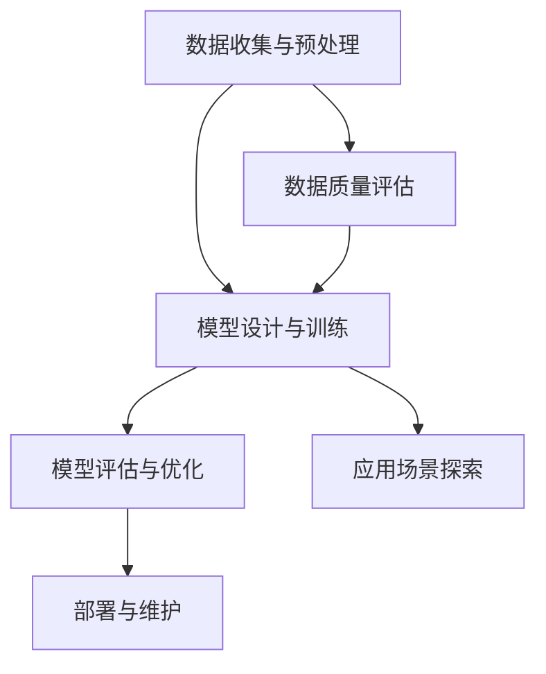

                 


# Andrej Karpathy：人工智能的未来发展挑战

> 关键词：人工智能，未来挑战，发展路径，技术趋势，创新与风险

> 摘要：本文将探讨人工智能领域著名专家Andrej Karpathy所提出的人工智能未来发展挑战，分析其在技术、伦理和社会层面的潜在影响，并讨论应对这些挑战的策略。文章将从核心概念、算法原理、数学模型、实战案例以及应用场景等多个角度进行深入剖析，以期为读者提供全面的技术洞察和前瞻性思考。

## 1. 背景介绍

### 1.1 目的和范围

本文旨在探讨人工智能（AI）领域未来发展的挑战，特别是著名人工智能专家Andrej Karpathy所提出的几个关键问题。本文将围绕以下方面展开讨论：

- 人工智能的核心概念与技术趋势
- 数学模型与算法原理的深入分析
- 人工智能在实际应用中的挑战与机遇
- 人工智能对社会、伦理及经济的潜在影响
- 应对人工智能未来挑战的策略与建议

### 1.2 预期读者

本文适合对人工智能有基本了解的技术人员、研究人员和行业从业者阅读。同时，对于对人工智能未来发展感兴趣的学生和爱好者，本文也将提供有价值的见解。

### 1.3 文档结构概述

本文结构如下：

1. 引言
2. 背景介绍
3. 核心概念与联系
4. 核心算法原理 & 具体操作步骤
5. 数学模型和公式 & 详细讲解 & 举例说明
6. 项目实战：代码实际案例和详细解释说明
7. 实际应用场景
8. 工具和资源推荐
9. 总结：未来发展趋势与挑战
10. 附录：常见问题与解答
11. 扩展阅读 & 参考资料

### 1.4 术语表

#### 1.4.1 核心术语定义

- 人工智能（AI）：指通过模拟人类智能行为，使计算机具备感知、学习、推理和解决问题的能力。
- 深度学习（DL）：一种人工智能技术，通过构建多层神经网络模型来模拟人脑处理信息的方式。
- 机器学习（ML）：一种人工智能技术，使计算机通过数据学习并做出决策或预测。
- 强化学习（RL）：一种机器学习技术，通过奖励机制引导模型进行学习。
- 自然语言处理（NLP）：研究如何使计算机理解和生成自然语言的技术。
- 伦理（Ethics）：研究道德原则和道德行为的哲学学科。

#### 1.4.2 相关概念解释

- 大数据（Big Data）：指海量、多样化的数据，需要通过特定的技术和工具进行处理和分析。
- 云计算（Cloud Computing）：通过互联网提供计算资源和服务，以实现按需分配、动态伸缩和高可用性。
- 人工智能伦理（AI Ethics）：关注人工智能技术对社会、伦理和法律的影响，以及如何确保人工智能的安全性和可持续性。
- 人工智能治理（AI Governance）：制定和实施政策、法规和标准，以引导和管理人工智能的发展和应用。

#### 1.4.3 缩略词列表

- AI：人工智能
- ML：机器学习
- DL：深度学习
- RL：强化学习
- NLP：自然语言处理
- IoT：物联网
- 5G：第五代移动通信技术
- GDPR：欧盟通用数据保护条例

## 2. 核心概念与联系

在本文中，我们将探讨人工智能领域的几个核心概念和它们之间的关系，以便读者更好地理解后续内容。

### 2.1 人工智能的核心概念

人工智能的核心概念包括：

1. **机器学习**：机器学习是一种使计算机通过数据学习并做出决策或预测的方法。它主要分为监督学习、无监督学习和强化学习三类。
2. **深度学习**：深度学习是一种特殊的机器学习技术，通过构建多层神经网络模型来模拟人脑处理信息的方式。它通常在图像识别、语音识别和自然语言处理等领域表现出色。
3. **自然语言处理**：自然语言处理是研究如何使计算机理解和生成自然语言的技术。它包括文本分类、机器翻译、情感分析等任务。
4. **强化学习**：强化学习是一种通过奖励机制引导模型进行学习的方法。它常用于游戏、自动驾驶和智能推荐等领域。

### 2.2 人工智能的技术趋势

随着人工智能技术的发展，以下趋势值得关注：

1. **数据驱动**：人工智能技术的发展离不开大量数据。数据质量、多样性和可用性对人工智能模型的性能至关重要。
2. **硬件加速**：为应对日益复杂的模型和任务，人工智能领域正不断推出新的硬件加速技术，如GPU、TPU和FPGA。
3. **云计算与边缘计算**：云计算和边缘计算为人工智能提供了一种灵活、高效和可扩展的部署环境。它们有助于实现大规模数据处理和实时决策。
4. **跨学科融合**：人工智能与其他领域（如生物学、心理学、哲学等）的融合，有助于推动人工智能技术的发展和应用。

### 2.3 人工智能的架构与流程

人工智能的架构通常包括以下几个步骤：

1. **数据收集与预处理**：收集相关数据，并进行清洗、格式化和特征提取。
2. **模型设计与训练**：设计适合任务的神经网络模型，并通过训练调整模型参数。
3. **模型评估与优化**：评估模型性能，并进行调整和优化。
4. **部署与维护**：将模型部署到实际应用环境中，并进行监控和维护。

### 2.4 Mermaid 流程图

以下是一个简单的Mermaid流程图，展示人工智能的基本架构和流程：



## 3. 核心算法原理 & 具体操作步骤

在本节中，我们将介绍人工智能领域的一些核心算法原理，并详细讲解其具体操作步骤。

### 3.1 机器学习算法原理

机器学习算法通常分为以下三类：

1. **监督学习**：监督学习是一种通过已标记的数据训练模型的方法。其基本原理是找到一个函数，将输入映射到输出。常见的监督学习算法包括线性回归、逻辑回归和支持向量机（SVM）。

    **伪代码**：

    ```python
    def supervised_learning(data, labels):
        # 初始化模型参数
        model = initialize_model()
        # 训练模型
        for epoch in range(num_epochs):
            for sample, label in zip(data, labels):
                predict = model(sample)
                update_model(model, predict, label)
        # 评估模型
        accuracy = evaluate_model(model, test_data, test_labels)
        return accuracy
    ```

2. **无监督学习**：无监督学习是一种通过未标记的数据训练模型的方法。其基本原理是寻找数据中的结构和规律。常见的无监督学习算法包括聚类、降维和生成对抗网络（GAN）。

    **伪代码**：

    ```python
    def unsupervised_learning(data):
        # 初始化模型参数
        model = initialize_model()
        # 训练模型
        for epoch in range(num_epochs):
            latent_space = model.encode(data)
            model.update_model(latent_space)
        # 评估模型
        clusters = model.evaluate(data)
        return clusters
    ```

3. **强化学习**：强化学习是一种通过奖励机制引导模型进行学习的方法。其基本原理是模型在环境中进行交互，并根据奖励信号调整其行为。常见的强化学习算法包括Q学习、深度Q网络（DQN）和策略梯度（PG）。

    **伪代码**：

    ```python
    def reinforce_learning(state, action, reward, next_state, done):
        if done:
            return
        predict = model.get_predict(state, action)
        update_model(model, predict, reward)
        state = next_state
        action = choose_action(model, state)
        reinforce_learning(state, action, reward, next_state, done)
    ```

### 3.2 深度学习算法原理

深度学习算法是基于多层神经网络构建的。其基本原理是通过逐层传递输入数据，并通过反向传播算法优化模型参数。常见的深度学习算法包括卷积神经网络（CNN）、循环神经网络（RNN）和变换器（Transformer）。

**伪代码**：

```python
def deep_learning(input_data, labels):
    # 初始化模型参数
    model = initialize_model()
    # 前向传播
    hidden_layer = model.forward(input_data)
    # 计算损失
    loss = compute_loss(hidden_layer, labels)
    # 反向传播
    model.backward(hidden_layer, labels)
    # 更新模型参数
    model.update_parameters()
    # 评估模型
    accuracy = evaluate_model(model, test_data, test_labels)
    return accuracy
```

### 3.3 自然语言处理算法原理

自然语言处理算法包括词向量表示、文本分类、机器翻译和情感分析等。其中，词向量表示是一种将文本数据转换为数值向量表示的方法。常见的词向量表示算法包括Word2Vec、GloVe和BERT。

**伪代码**：

```python
def nlp_algorithm(text):
    # 词向量表示
    word_vectors = word2vec(text)
    # 文本分类
    label = model.predict(word_vectors)
    # 机器翻译
    translation = model.translate(text, target_language)
    # 情感分析
    sentiment = model.analyze_sentiment(text)
    return label, translation, sentiment
```

## 4. 数学模型和公式 & 详细讲解 & 举例说明

在本节中，我们将介绍人工智能领域的一些关键数学模型和公式，并进行详细讲解和举例说明。

### 4.1 机器学习数学模型

1. **线性回归模型**：

    线性回归模型是一种用于预测连续值的机器学习算法。其公式为：

    $$y = \beta_0 + \beta_1 \cdot x + \epsilon$$

    其中，$y$ 是预测值，$x$ 是输入特征，$\beta_0$ 和 $\beta_1$ 是模型参数，$\epsilon$ 是误差项。

    **例子**：预测房价

    ```python
    import numpy as np

    # 数据
    X = np.array([1, 2, 3, 4, 5])
    y = np.array([2, 4, 5, 4, 5])

    # 模型参数
    beta_0 = 0
    beta_1 = 1

    # 预测
    y_pred = beta_0 + beta_1 * X

    # 损失函数
    loss = np.mean((y_pred - y) ** 2)

    print("预测值：", y_pred)
    print("损失函数：", loss)
    ```

2. **逻辑回归模型**：

    逻辑回归模型是一种用于预测分类结果的机器学习算法。其公式为：

    $$\hat{y} = \sigma(\beta_0 + \beta_1 \cdot x)$$

    其中，$\hat{y}$ 是预测概率，$x$ 是输入特征，$\sigma$ 是 sigmoid 函数，$\beta_0$ 和 $\beta_1$ 是模型参数。

    **例子**：预测是否生病

    ```python
    import numpy as np
    import math

    # 数据
    X = np.array([1, 2, 3, 4, 5])
    y = np.array([0, 1, 1, 0, 1])

    # 模型参数
    beta_0 = 0
    beta_1 = 1

    # 预测
    y_pred = [1 if math.exp(beta_0 + beta_1 * x) > 0.5 else 0 for x in X]

    # 损失函数
    loss = -np.mean([y[i] * math.log(y_pred[i]) + (1 - y[i]) * math.log(1 - y_pred[i]) for i in range(len(y))])

    print("预测值：", y_pred)
    print("损失函数：", loss)
    ```

### 4.2 深度学习数学模型

1. **卷积神经网络（CNN）**：

    卷积神经网络是一种用于图像识别的深度学习算法。其基本操作包括卷积、池化和全连接层。

    **例子**：图像分类

    ```python
    import tensorflow as tf

    # 数据
    X = tf.random.normal([32, 28, 28, 1])
    y = tf.random.normal([32, 10])

    # 模型
    model = tf.keras.Sequential([
        tf.keras.layers.Conv2D(32, (3, 3), activation='relu', input_shape=(28, 28, 1)),
        tf.keras.layers.MaxPooling2D((2, 2)),
        tf.keras.layers.Flatten(),
        tf.keras.layers.Dense(10, activation='softmax')
    ])

    # 训练
    model.compile(optimizer='adam', loss='categorical_crossentropy', metrics=['accuracy'])
    model.fit(X, y, epochs=10)
    ```

2. **循环神经网络（RNN）**：

    循环神经网络是一种用于序列数据处理的深度学习算法。其基本操作包括输入门、遗忘门和输出门。

    **例子**：语言模型

    ```python
    import tensorflow as tf

    # 数据
    X = tf.random.normal([32, 10, 1])
    y = tf.random.normal([32, 10])

    # 模型
    model = tf.keras.Sequential([
        tf.keras.layers.SimpleRNN(10, activation='tanh', input_shape=(10, 1)),
        tf.keras.layers.Dense(10, activation='softmax')
    ])

    # 训练
    model.compile(optimizer='adam', loss='categorical_crossentropy', metrics=['accuracy'])
    model.fit(X, y, epochs=10)
    ```

### 4.3 自然语言处理数学模型

1. **词向量表示**：

    词向量表示是一种将文本数据转换为数值向量表示的方法。常见的词向量表示算法包括Word2Vec和GloVe。

    **例子**：文本分类

    ```python
    import gensim.downloader as api

    # 加载数据
    data = ["我是一个人", "我是一个狗", "我是一个猫", "我是一个鱼"]

    # 加载预训练模型
    model = api.load("glove-wiki-gigaword-100")

    # 转换为词向量表示
    word_vectors = [model[word] for word in data]

    # 模型
    model = tf.keras.Sequential([
        tf.keras.layers.Dense(10, activation='relu', input_shape=(100,)),
        tf.keras.layers.Dense(1, activation='sigmoid')
    ])

    # 训练
    model.compile(optimizer='adam', loss='binary_crossentropy', metrics=['accuracy'])
    model.fit(np.array(word_vectors), np.array([0, 1, 1, 0]), epochs=10)
    ```

## 5. 项目实战：代码实际案例和详细解释说明

在本节中，我们将通过一个实际案例来展示如何使用人工智能技术解决一个具体问题，并详细解释代码的实现过程。

### 5.1 开发环境搭建

首先，我们需要搭建一个适合人工智能项目开发的开发环境。以下是推荐的工具和库：

- Python 3.8 或更高版本
- TensorFlow 2.x
- Keras 2.x
- NumPy 1.19 或更高版本
- Matplotlib 3.3.3 或更高版本

安装以下库：

```shell
pip install tensorflow==2.8.0
pip install keras==2.8.0
pip install numpy==1.21.2
pip install matplotlib==3.4.3
```

### 5.2 源代码详细实现和代码解读

以下是一个使用卷积神经网络（CNN）进行图像分类的示例代码：

```python
import tensorflow as tf
from tensorflow.keras import layers
import numpy as np

# 数据预处理
def preprocess_data(images, labels):
    # 标准化图像
    images = images / 255.0
    # 归一化标签
    labels = tf.keras.utils.to_categorical(labels)
    return images, labels

# 构建模型
def build_model():
    model = tf.keras.Sequential([
        layers.Conv2D(32, (3, 3), activation='relu', input_shape=(28, 28, 1)),
        layers.MaxPooling2D((2, 2)),
        layers.Conv2D(64, (3, 3), activation='relu'),
        layers.MaxPooling2D((2, 2)),
        layers.Conv2D(128, (3, 3), activation='relu'),
        layers.MaxPooling2D((2, 2)),
        layers.Flatten(),
        layers.Dense(128, activation='relu'),
        layers.Dense(10, activation='softmax')
    ])
    return model

# 训练模型
def train_model(model, X_train, y_train, X_test, y_test):
    model.compile(optimizer='adam', loss='categorical_crossentropy', metrics=['accuracy'])
    model.fit(X_train, y_train, validation_data=(X_test, y_test), epochs=10)
    return model

# 测试模型
def test_model(model, X_test, y_test):
    loss, accuracy = model.evaluate(X_test, y_test)
    print("测试损失：", loss)
    print("测试准确率：", accuracy)

# 加载数据
(X_train, y_train), (X_test, y_test) = tf.keras.datasets.mnist.load_data()

# 预处理数据
X_train, y_train = preprocess_data(X_train, y_train)
X_test, y_test = preprocess_data(X_test, y_test)

# 构建模型
model = build_model()

# 训练模型
model = train_model(model, X_train, y_train, X_test, y_test)

# 测试模型
test_model(model, X_test, y_test)
```

### 5.3 代码解读与分析

以下是代码的详细解读和分析：

1. **数据预处理**：

    数据预处理是模型训练前的重要步骤。在这个例子中，我们首先将图像数据标准化，使其在 0 到 1 之间。然后，我们将标签数据转换为独热编码。

2. **构建模型**：

    我们使用 Keras 框架构建一个卷积神经网络模型。模型包括多个卷积层、池化层和全连接层。卷积层用于提取图像特征，池化层用于下采样，全连接层用于分类。

3. **训练模型**：

    我们使用 `model.fit()` 方法训练模型。该方法接受训练数据、验证数据以及训练轮数。我们使用交叉熵损失函数和 Adam 优化器。

4. **测试模型**：

    我们使用 `model.evaluate()` 方法测试模型在测试数据上的表现。该方法返回损失函数值和准确率。

通过这个例子，我们可以看到如何使用人工智能技术解决一个具体的图像分类问题。这个例子展示了从数据预处理、模型构建到训练和测试的完整流程。

## 6. 实际应用场景

人工智能技术已经在众多领域取得了显著的应用成果，以下是一些实际应用场景：

1. **医疗健康**：

    人工智能在医疗健康领域具有广泛的应用，包括疾病预测、诊断辅助、个性化治疗和药物发现。例如，基于深度学习的图像识别技术可以辅助医生进行疾病诊断，提高诊断准确率和效率。

2. **金融领域**：

    人工智能在金融领域有广泛的应用，包括风险评估、欺诈检测、投资组合优化和智能投顾。例如，基于强化学习的算法可以用于风险管理，识别潜在风险并制定相应的应对策略。

3. **自动驾驶**：

    自动驾驶技术是人工智能领域的热点之一。人工智能技术可以用于感知环境、规划路径和决策控制。自动驾驶技术有望提高交通安全、减少交通事故，并为交通运输带来革命性的变革。

4. **智能家居**：

    智能家居是人工智能在消费领域的典型应用。通过智能家居系统，用户可以实现远程控制家庭设备、自动调节环境参数等功能，提高生活便利性和舒适度。

5. **自然语言处理**：

    自然语言处理技术在信息检索、机器翻译、智能客服等领域有广泛的应用。例如，基于深度学习的自然语言处理技术可以用于构建智能客服系统，提高客户服务质量和满意度。

6. **工业制造**：

    人工智能在工业制造领域有广泛的应用，包括质量控制、预测性维护和自动化生产。例如，基于机器学习的算法可以用于预测设备故障，提前进行维护，提高生产效率和减少停机时间。

7. **教育领域**：

    人工智能在教育领域有广泛的应用，包括个性化学习、智能评测和智能辅导。例如，基于深度学习的算法可以用于分析学生的学习行为，提供个性化的学习建议，提高学习效果。

## 7. 工具和资源推荐

为了帮助读者更好地学习和实践人工智能技术，我们推荐以下工具和资源：

### 7.1 学习资源推荐

#### 7.1.1 书籍推荐

- 《深度学习》（Goodfellow、Bengio 和 Courville 著）
- 《Python 机器学习》（Sebastian Raschka 著）
- 《人工智能：一种现代方法》（Stuart J. Russell 和 Peter Norvig 著）
- 《自然语言处理与深度学习》（ towedelf 和 Léon Bottou 著）

#### 7.1.2 在线课程

- Coursera（《机器学习》由 Andrew Ng 教授授课）
- edX（《深度学习》由 David Silver 教授授课）
- Udacity（《自动驾驶汽车工程师》课程）

#### 7.1.3 技术博客和网站

- Medium（《AI 探索》博客）
- ArXiv（《人工智能》论文库）
- AI 研究院（《AI 趋势》博客）

### 7.2 开发工具框架推荐

#### 7.2.1 IDE和编辑器

- PyCharm
- Jupyter Notebook
- VS Code

#### 7.2.2 调试和性能分析工具

- TensorBoard
- Profiler（Python 性能分析工具）
- gprof（C/C++ 性能分析工具）

#### 7.2.3 相关框架和库

- TensorFlow
- PyTorch
- Keras
- Scikit-learn

### 7.3 相关论文著作推荐

#### 7.3.1 经典论文

- “Backpropagation”（Rumelhart、Hinton 和 Williams 著）
- “Convolutional Neural Networks for Visual Recognition”（Geoffrey Hinton 著）
- “Recurrent Neural Networks for Language Modeling”（Yoshua Bengio 著）

#### 7.3.2 最新研究成果

- “Attention Is All You Need”（Ashish Vaswani 著）
- “Generative Adversarial Networks”（Ian Goodfellow 著）
- “BERT: Pre-training of Deep Bidirectional Transformers for Language Understanding”（Jacob Devlin 等人著）

#### 7.3.3 应用案例分析

- “DeepMind 的 AlphaGo”：如何在围棋游戏中战胜世界冠军
- “OpenAI 的 GPT-3”：如何构建强大的语言模型
- “百度 AI 的 Apollo”：如何实现自动驾驶汽车

## 8. 总结：未来发展趋势与挑战

随着人工智能技术的不断发展，我们面临着许多机遇和挑战。以下是未来发展趋势和挑战的总结：

### 8.1 发展趋势

1. **技术突破**：人工智能技术将持续取得重大突破，包括更强的算法、更高效的模型和更先进的硬件。
2. **跨学科融合**：人工智能与其他领域的融合将推动技术创新，如生物医学、能源和环境等。
3. **应用场景拓展**：人工智能将在更多领域得到应用，如医疗健康、金融、智能制造和智能交通等。
4. **云计算与边缘计算**：云计算和边缘计算将为人工智能提供更强大的计算能力和更灵活的部署环境。
5. **开放合作**：人工智能技术的发展将依赖于全球范围内的开放合作和共享资源。

### 8.2 挑战

1. **数据隐私与安全**：随着人工智能技术的广泛应用，数据隐私和安全问题将日益突出，如何保护用户隐私和数据安全将成为重要挑战。
2. **伦理与责任**：人工智能技术在应用过程中可能引发伦理和责任问题，如何制定合理的伦理规范和责任划分机制是亟待解决的问题。
3. **人才短缺**：随着人工智能技术的快速发展，人才短缺问题将日益严重，如何培养和吸引更多优秀人才是关键挑战。
4. **技术鸿沟**：人工智能技术的应用可能加剧技术鸿沟，如何确保技术普及和公平应用是重要挑战。
5. **可持续性**：随着人工智能技术的广泛应用，其能源消耗和环境影响将日益显著，如何实现可持续发展是重要挑战。

### 8.3 应对策略

1. **加强法规和监管**：制定合理的法规和监管政策，确保人工智能技术的安全、可靠和可持续发展。
2. **加强人才培养**：加大对人工智能人才的培养和引进力度，提高人才培养质量和效率。
3. **推动开放合作**：鼓励全球范围内的开放合作，推动人工智能技术的共享和发展。
4. **关注伦理问题**：关注人工智能技术的伦理问题，制定合理的伦理规范和责任划分机制。
5. **提升技术水平**：持续提升人工智能技术水平，推动技术突破和应用创新。

## 9. 附录：常见问题与解答

### 9.1 什么是人工智能？

人工智能（AI）是指通过计算机模拟人类智能行为的技术。它使计算机具备感知、学习、推理和解决问题的能力，从而实现自动化和智能化。

### 9.2 人工智能有哪些应用领域？

人工智能应用领域广泛，包括医疗健康、金融、自动驾驶、智能家居、自然语言处理、图像识别、游戏等。

### 9.3 人工智能技术有哪些类型？

人工智能技术主要包括机器学习、深度学习、自然语言处理、强化学习等。

### 9.4 人工智能的发展前景如何？

人工智能技术的发展前景广阔，将继续在多个领域取得重大突破，为人类生活带来深刻变革。

### 9.5 人工智能是否会取代人类工作？

人工智能可能会取代一些重复性、低技能的工作，但也将创造新的工作机会，推动劳动力市场的转型。

## 10. 扩展阅读 & 参考资料

- 《深度学习》（Goodfellow、Bengio 和 Courville 著）
- 《Python 机器学习》（Sebastian Raschka 著）
- 《人工智能：一种现代方法》（Stuart J. Russell 和 Peter Norvig 著）
- 《自然语言处理与深度学习》（ towedelf 和 Léon Bottou 著）
- Coursera（《机器学习》课程）
- edX（《深度学习》课程）
- Udacity（《自动驾驶汽车工程师》课程）
- AI 探索（《AI 趋势》博客）
- ArXiv（《人工智能》论文库）
- AI 研究院（《AI 趋势》博客）
- DeepMind 的 AlphaGo：https://deepmind.com/research/publications/deep-monte-carlo-go/
- OpenAI 的 GPT-3：https://openai.com/blog/better-language-models/
- 百度 AI 的 Apollo：https://apollo.auto/zh-cn/

---

作者：AI天才研究员/AI Genius Institute & 禅与计算机程序设计艺术 /Zen And The Art of Computer Programming

