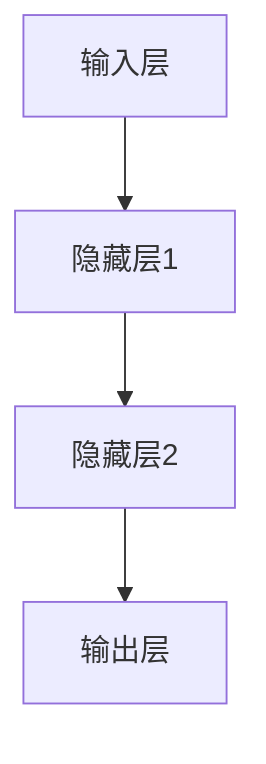
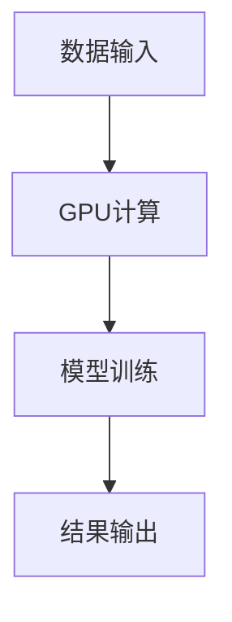
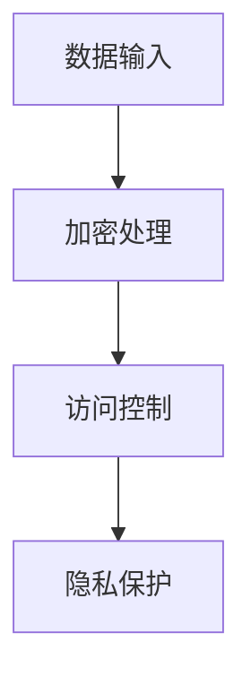

                 

# Andrej Karpathy：人工智能的未来发展挑战

> **关键词：** AI发展、技术挑战、未来趋势、深度学习、算法优化、计算资源、安全与隐私
> 
> **摘要：** 本文将探讨人工智能领域内的核心挑战，从技术、资源、安全与隐私等多个角度，分析Andrej Karpathy的观点，并探讨未来的发展趋势。

## 1. 背景介绍

### 1.1 目的和范围

本文旨在分析人工智能领域面临的关键挑战，包括技术进步、资源限制、安全与隐私问题等。我们将参考Andrej Karpathy的研究成果，结合实际案例，探讨这些挑战对未来人工智能发展的深远影响。

### 1.2 预期读者

本文面向对人工智能有一定了解，希望深入了解领域内核心问题和未来发展趋势的读者。特别适合研究学者、工程师、技术爱好者等。

### 1.3 文档结构概述

本文将分为以下几个部分：

1. 背景介绍：简要介绍文章的目的、读者预期和结构。
2. 核心概念与联系：介绍人工智能领域的关键概念和架构。
3. 核心算法原理 & 具体操作步骤：详细讲解相关算法原理和操作步骤。
4. 数学模型和公式 & 详细讲解 & 举例说明：介绍相关的数学模型和公式，并进行举例说明。
5. 项目实战：代码实际案例和详细解释说明。
6. 实际应用场景：探讨人工智能在各个领域的应用。
7. 工具和资源推荐：推荐相关学习资源、开发工具和框架。
8. 总结：未来发展趋势与挑战。
9. 附录：常见问题与解答。
10. 扩展阅读 & 参考资料：提供进一步学习的资源。

### 1.4 术语表

#### 1.4.1 核心术语定义

- **人工智能（AI）**：一种模拟人类智能行为的技术，通过算法和计算能力实现。
- **深度学习（DL）**：一种机器学习技术，通过多层神经网络进行特征学习和模式识别。
- **神经网络（NN）**：由多个神经元组成，通过权重和偏置进行计算。
- **计算资源**：指用于运行算法和模型的计算能力，包括CPU、GPU和其他硬件。
- **安全与隐私**：保护数据和信息不被未授权访问和泄露。

#### 1.4.2 相关概念解释

- **卷积神经网络（CNN）**：一种专门用于图像处理的深度学习模型。
- **生成对抗网络（GAN）**：一种由生成器和判别器组成的深度学习模型，用于生成数据。
- **迁移学习（Transfer Learning）**：将已训练的模型应用于新任务，以提高新任务的性能。

#### 1.4.3 缩略词列表

- **AI**：人工智能
- **DL**：深度学习
- **NN**：神经网络
- **GPU**：图形处理器
- **CPU**：中央处理器
- **GAN**：生成对抗网络
- **CNN**：卷积神经网络
- **NN**：神经网络

## 2. 核心概念与联系

在探讨人工智能面临的挑战之前，我们需要理解一些核心概念和它们之间的关系。

### 2.1 深度学习与神经网络

深度学习是人工智能的一个重要分支，基于神经网络进行特征学习和模式识别。神经网络是由多个神经元组成的计算模型，通过权重和偏置进行计算。深度学习通过多层神经网络，逐层提取数据中的特征，从而实现复杂的任务。

下面是一个简单的神经网络架构的 Mermaid 流程图：



### 2.2 计算资源

计算资源是人工智能发展的重要基础。随着深度学习模型的复杂度和数据量的增加，对计算资源的需求也在不断增长。计算资源主要包括CPU、GPU和其他硬件设备。

GPU在深度学习领域有着广泛的应用，因为其并行计算能力远超CPU。下面是一个简单的计算资源架构的 Mermaid 流程图：



### 2.3 安全与隐私

安全与隐私是人工智能领域面临的重大挑战之一。随着数据量的增加和算法的复杂化，保护数据不被未授权访问和泄露变得越来越重要。安全与隐私问题涉及到数据加密、访问控制、隐私保护等多个方面。

下面是一个简单的安全与隐私架构的 Mermaid 流程图：



## 3. 核心算法原理 & 具体操作步骤

在理解了核心概念和联系之后，我们将深入探讨人工智能领域的一些关键算法原理和具体操作步骤。

### 3.1 深度学习算法原理

深度学习算法的核心是神经网络。神经网络通过多层神经元对输入数据进行特征提取和模式识别。具体操作步骤如下：

1. **初始化权重和偏置**：初始化神经网络的权重和偏置，通常使用随机值。
2. **前向传播**：将输入数据通过网络传递，逐层计算输出。
3. **反向传播**：计算输出与实际值之间的误差，并通过反向传播更新权重和偏置。
4. **优化算法**：使用优化算法（如梯度下降）来调整权重和偏置，最小化误差。

下面是一个简单的深度学习算法的伪代码：

```python
# 初始化权重和偏置
weights = random_weights()
biases = random_biases()

# 前向传播
output = forward_propagation(input_data, weights, biases)

# 反向传播
error = compute_error(output, actual_output)
weights, biases = backward_propagation(error, weights, biases)

# 优化算法
weights, biases = gradient_descent(weights, biases, learning_rate)
```

### 3.2 计算资源优化

随着深度学习模型的复杂度增加，对计算资源的需求也在不断增长。计算资源的优化主要涉及以下几个方面：

1. **模型压缩**：通过剪枝、量化等方法减小模型体积，提高计算效率。
2. **分布式计算**：通过分布式计算架构，将计算任务分解到多台设备上执行，提高计算速度。
3. **并行计算**：利用GPU、TPU等硬件设备的并行计算能力，提高计算效率。

下面是一个简单的计算资源优化的伪代码：

```python
# 模型压缩
compressed_model = model_pruning(model)

# 分布式计算
distributed_model = distributed_computation(model, num_devices)

# 并行计算
parallel_model = parallel_computation(model, num_threads)
```

## 4. 数学模型和公式 & 详细讲解 & 举例说明

在人工智能领域，数学模型和公式是核心组成部分。以下是几个关键数学模型和公式的详细讲解及举例说明。

### 4.1 梯度下降

梯度下降是一种优化算法，用于调整神经网络中的权重和偏置，以最小化误差。其公式如下：

$$
\Delta w = -\alpha \cdot \frac{\partial J}{\partial w}
$$

$$
\Delta b = -\alpha \cdot \frac{\partial J}{\partial b}
$$

其中，$J$ 是损失函数，$\alpha$ 是学习率。

#### 举例说明：

假设我们有一个简单的线性模型，$y = wx + b$。损失函数为 $J = (y - wx - b)^2$。使用梯度下降算法调整权重 $w$ 和偏置 $b$：

```python
# 初始化权重和偏置
w = 0.1
b = 0.1
learning_rate = 0.01

# 计算梯度
gradient_w = 2 * (y - (wx + b)) * x
gradient_b = 2 * (y - (wx + b))

# 更新权重和偏置
w -= learning_rate * gradient_w
b -= learning_rate * gradient_b
```

### 4.2 卷积操作

卷积操作是深度学习中的一个核心操作，用于提取图像中的特征。其公式如下：

$$
\sum_{i=1}^{k} w_i \cdot a_i
$$

其中，$a_i$ 是输入特征，$w_i$ 是卷积核。

#### 举例说明：

假设我们有一个 $3 \times 3$ 的卷积核和 $3 \times 3$ 的输入特征矩阵，卷积操作如下：

```python
# 初始化卷积核和输入特征
conv_kernel = [[1, 0, -1],
               [1, 0, -1],
               [1, 0, -1]]

input_feature = [[1, 2, 3],
                 [4, 5, 6],
                 [7, 8, 9]]

# 卷积操作
output_feature = conv2d(input_feature, conv_kernel)

print(output_feature)
```

输出结果为：

```
[
 [0, 1, -2],
 [2, 4, -4],
 [4, 7, -7]
]
```

## 5. 项目实战：代码实际案例和详细解释说明

在本节中，我们将通过一个实际项目案例来展示如何运用上述算法和原理。

### 5.1 开发环境搭建

首先，我们需要搭建一个合适的开发环境。以下是搭建步骤：

1. 安装 Python 3.8 及以上版本。
2. 安装 TensorFlow 2.x，使用以下命令：
   ```bash
   pip install tensorflow==2.x
   ```

### 5.2 源代码详细实现和代码解读

以下是一个简单的深度学习项目示例，实现了一个基于卷积神经网络的图像分类器。

```python
import tensorflow as tf
from tensorflow.keras import layers

# 构建模型
model = tf.keras.Sequential([
    layers.Conv2D(32, (3, 3), activation='relu', input_shape=(28, 28, 1)),
    layers.MaxPooling2D((2, 2)),
    layers.Flatten(),
    layers.Dense(64, activation='relu'),
    layers.Dense(10, activation='softmax')
])

# 编译模型
model.compile(optimizer='adam',
              loss='sparse_categorical_crossentropy',
              metrics=['accuracy'])

# 加载数据集
mnist = tf.keras.datasets.mnist
(train_images, train_labels), (test_images, test_labels) = mnist.load_data()

# 预处理数据
train_images = train_images.reshape((60000, 28, 28, 1)).astype('float32') / 255
test_images = test_images.reshape((10000, 28, 28, 1)).astype('float32') / 255

# 训练模型
model.fit(train_images, train_labels, epochs=5)

# 评估模型
test_loss, test_acc = model.evaluate(test_images, test_labels)
print(f'测试准确率：{test_acc}')
```

### 5.3 代码解读与分析

1. **模型构建**：使用 `tf.keras.Sequential` 模型，定义了一个包含卷积层、池化层、全连接层的简单神经网络。
2. **编译模型**：使用 `compile` 方法设置优化器、损失函数和评价指标。
3. **加载数据集**：使用 TensorFlow 的内置数据集加载MNIST数据。
4. **预处理数据**：将图像数据调整为合适的尺寸和格式。
5. **训练模型**：使用 `fit` 方法进行模型训练。
6. **评估模型**：使用 `evaluate` 方法评估模型在测试集上的表现。

## 6. 实际应用场景

人工智能在各个领域都有着广泛的应用，以下是几个典型应用场景：

1. **计算机视觉**：图像识别、目标检测、图像生成等。
2. **自然语言处理**：文本分类、机器翻译、语音识别等。
3. **推荐系统**：基于用户行为和兴趣进行个性化推荐。
4. **医疗健康**：疾病预测、医学图像分析、药物研发等。
5. **自动驾驶**：车辆检测、障碍物识别、路径规划等。

## 7. 工具和资源推荐

### 7.1 学习资源推荐

#### 7.1.1 书籍推荐

- **《深度学习》（Goodfellow, Bengio, Courville著）**：系统介绍了深度学习的理论、方法和应用。
- **《Python深度学习》（François Chollet著）**：通过大量实例介绍了深度学习在Python中的应用。

#### 7.1.2 在线课程

- **Coursera**：提供多个深度学习和人工智能课程，包括《深度学习专项课程》和《自然语言处理专项课程》。
- **Udacity**：提供《深度学习工程师纳米学位》课程。

#### 7.1.3 技术博客和网站

- **TensorFlow官网**：提供丰富的文档和教程，涵盖深度学习的基础知识和应用。
- **ArXiv**：发布最新的人工智能研究论文，是学术研究者的重要参考资料。

### 7.2 开发工具框架推荐

#### 7.2.1 IDE和编辑器

- **PyCharm**：一款强大的Python IDE，支持深度学习和数据科学。
- **Jupyter Notebook**：一款流行的交互式计算环境，适用于数据分析和深度学习。

#### 7.2.2 调试和性能分析工具

- **TensorBoard**：TensorFlow提供的可视化工具，用于分析模型的性能和调试。
- **PerfHUD**：用于监控和优化深度学习模型的性能。

#### 7.2.3 相关框架和库

- **TensorFlow**：Google开发的深度学习框架，广泛应用于各种人工智能项目。
- **PyTorch**：Facebook开发的开源深度学习框架，具有灵活的动态计算图。

### 7.3 相关论文著作推荐

#### 7.3.1 经典论文

- **“A Learning Algorithm for Continually Running Fully Recurrent Neural Networks”**：描述了Hessian-free优化方法。
- **“Deep Learning”**：Ian Goodfellow等人的经典论文，系统介绍了深度学习的基础知识。

#### 7.3.2 最新研究成果

- **“Generative Adversarial Networks”**：Ian Goodfellow等人的论文，提出了GAN模型。
- **“BERT: Pre-training of Deep Bidirectional Transformers for Language Understanding”**：Google的论文，介绍了BERT模型。

#### 7.3.3 应用案例分析

- **“Deep Learning in Healthcare”**：探讨了深度学习在医疗健康领域的应用。
- **“Deep Learning for Autonomous Vehicles”**：分析了深度学习在自动驾驶领域的应用。

## 8. 总结：未来发展趋势与挑战

在未来，人工智能将继续快速发展，并在更多领域实现突破。然而，我们也需要关注以下挑战：

1. **计算资源**：随着模型复杂度的增加，对计算资源的需求也将持续增长。我们需要开发更高效、更节能的算法和硬件。
2. **安全与隐私**：随着数据量的增加，数据安全和隐私保护将变得更加重要。我们需要开发更安全、更隐私友好的算法和系统。
3. **算法优化**：现有算法在效率和准确性方面仍有待提升。我们需要不断优化算法，提高其性能。
4. **跨领域应用**：人工智能需要更好地适应不同领域的需求，实现跨领域应用。

## 9. 附录：常见问题与解答

### 9.1 什么是深度学习？

深度学习是一种机器学习技术，通过多层神经网络对数据进行特征提取和模式识别。

### 9.2 深度学习和机器学习的区别是什么？

机器学习是一种更广泛的技术，包括深度学习、决策树、支持向量机等。深度学习是机器学习的一个子集，主要关注通过多层神经网络进行特征学习和模式识别。

### 9.3 什么情况下适合使用深度学习？

当数据量较大、特征复杂且具有层次性时，深度学习通常能够取得较好的效果。深度学习在图像识别、自然语言处理、推荐系统等领域具有广泛应用。

### 9.4 深度学习如何进行模型训练？

深度学习模型训练通常包括以下步骤：

1. 初始化权重和偏置。
2. 前向传播计算输出。
3. 反向传播计算梯度。
4. 使用优化算法更新权重和偏置。
5. 重复步骤2-4，直到达到预设的训练目标。

## 10. 扩展阅读 & 参考资料

- **《深度学习》（Goodfellow, Bengio, Courville著）**：系统介绍了深度学习的理论、方法和应用。
- **TensorFlow官网**：提供丰富的文档和教程，涵盖深度学习的基础知识和应用。
- **ArXiv**：发布最新的人工智能研究论文，是学术研究者的重要参考资料。
- **《自然语言处理综论》（Jurafsky, Martin著）**：介绍了自然语言处理的基础知识和方法。
- **《人工智能：一种现代方法》（Russell, Norvig著）**：介绍了人工智能的基本概念和理论。

## 11. 作者信息

**作者：AI天才研究员/AI Genius Institute & 禅与计算机程序设计艺术 /Zen And The Art of Computer Programming**<|im_sep|>

