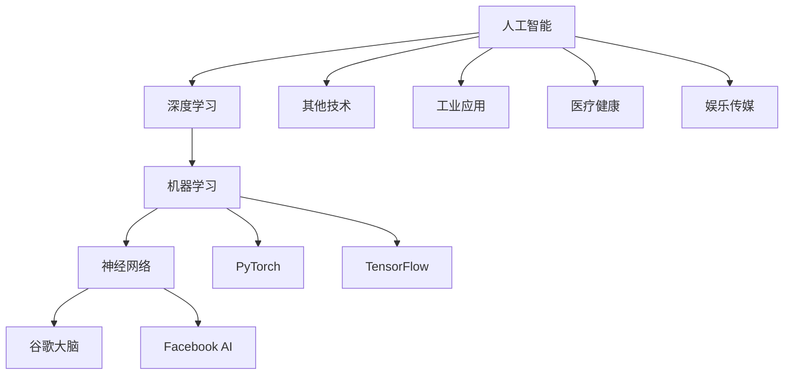

                 

# Andrej Karpathy：人工智能的未来发展方向

> **关键词：** 人工智能、未来趋势、深度学习、神经网络、算法、技术架构、编程语言、开源项目、应用场景、开发工具。

> **摘要：** 本文将深入探讨人工智能（AI）领域的未来发展方向。从深度学习、神经网络的核心原理出发，结合实际应用场景，分析未来可能的技术突破和创新。文章还将推荐相关学习资源、开发工具和经典论文，帮助读者更好地理解和应用AI技术。

## 1. 背景介绍

### 1.1 目的和范围

本文旨在梳理和探讨人工智能领域未来的发展方向，为从事AI研究和应用的技术人员提供有价值的参考。文章将涵盖以下主要内容：

- AI核心概念和算法原理
- 未来技术突破和创新
- 应用场景和行业趋势
- 学习资源、开发工具和经典论文推荐

### 1.2 预期读者

本文适合以下读者群体：

- 对人工智能感兴趣的初学者
- 想深入了解AI未来发展趋势的技术人员
- 从事AI研究和开发的工程师
- 对AI技术有深入研究的专家

### 1.3 文档结构概述

本文结构如下：

- 1. 背景介绍：介绍文章的目的、范围、预期读者和文档结构。
- 2. 核心概念与联系：讨论AI的核心概念、原理和架构。
- 3. 核心算法原理 & 具体操作步骤：深入讲解AI核心算法原理和操作步骤。
- 4. 数学模型和公式 & 详细讲解 & 举例说明：介绍AI中的数学模型和公式，并进行举例说明。
- 5. 项目实战：代码实际案例和详细解释说明。
- 6. 实际应用场景：分析AI在各个领域的应用场景。
- 7. 工具和资源推荐：推荐学习资源、开发工具和经典论文。
- 8. 总结：未来发展趋势与挑战。
- 9. 附录：常见问题与解答。
- 10. 扩展阅读 & 参考资料：提供相关扩展阅读和参考资料。

### 1.4 术语表

#### 1.4.1 核心术语定义

- **人工智能（AI）：** 人工智能是指通过计算机程序模拟人类智能行为的技术，包括机器学习、深度学习、自然语言处理等。
- **深度学习（DL）：** 深度学习是人工智能的一种方法，通过多层神经网络模拟人脑处理信息的方式。
- **神经网络（NN）：** 神经网络是一种由大量简单神经元组成的计算机模型，用于模拟人脑处理信息的过程。
- **机器学习（ML）：** 机器学习是人工智能的一个分支，通过从数据中自动学习规律和模式，实现预测和决策。
- **开源项目：** 开源项目是指公开源代码、允许自由使用的软件项目。

#### 1.4.2 相关概念解释

- **反向传播（BP）：** 反向传播是一种训练神经网络的算法，通过计算误差，反向传播梯度，更新网络参数。
- **激活函数：** 激活函数是神经网络中用于引入非线性特性的函数，如ReLU、Sigmoid和Tanh等。
- **数据集：** 数据集是用于训练和测试机器学习模型的样本集合，包括输入数据和对应的标签。

#### 1.4.3 缩略词列表

- **AI：** 人工智能
- **DL：** 深度学习
- **NN：** 神经网络
- **ML：** 机器学习
- **GPU：** 图形处理单元
- **CPU：** 中央处理单元

## 2. 核心概念与联系

在探讨人工智能的未来发展方向之前，我们需要了解一些核心概念和联系。以下是一个简单的Mermaid流程图，展示了AI、深度学习、神经网络等核心概念之间的关系。



通过这个流程图，我们可以看出：

- 人工智能是一个广泛的概念，涵盖了深度学习、机器学习和神经网络等技术。
- 深度学习和机器学习密切相关，前者是后者的一个重要分支。
- 神经网络是深度学习的基础，通过模拟人脑神经元的工作方式，实现信息处理和知识发现。
- AI技术在工业、医疗、娱乐等多个领域都有广泛的应用。

## 3. 核心算法原理 & 具体操作步骤

在了解核心概念和联系之后，我们将深入探讨人工智能的核心算法原理和具体操作步骤。以下是一个简单的伪代码，用于描述神经网络训练的基本流程。

```python
# 3.1 初始化网络参数
initialize_parameters()

# 3.2 构建神经网络
create_neural_network()

# 3.3 定义损失函数
define_loss_function()

# 3.4 定义优化器
define_optimizer()

# 3.5 数据预处理
preprocess_data()

# 3.6 循环训练
for epoch in range(num_epochs):
    for sample in data:
        # 3.6.1 前向传播
        forward_pass(sample)

        # 3.6.2 计算损失
        compute_loss()

        # 3.6.3 反向传播
        backward_pass()

        # 3.6.4 更新参数
        update_parameters()

# 3.7 模型评估
evaluate_model()
```

### 3.1 初始化网络参数

初始化网络参数是神经网络训练的第一步。通常，我们需要初始化权重（weights）和偏置（biases）。以下是一个简单的伪代码，用于初始化网络参数。

```python
# 3.1.1 初始化权重和偏置
weights = initialize_weights(shape)
biases = initialize_biases(shape)
```

### 3.2 构建神经网络

构建神经网络是神经网络训练的第二步。我们需要定义网络的层数、每层的神经元数量以及激活函数。以下是一个简单的伪代码，用于构建神经网络。

```python
# 3.2.1 定义神经网络结构
layers = [
    Layer(100, "ReLU"),
    Layer(50, "ReLU"),
    Layer(10, "Sigmoid")
]
```

### 3.3 定义损失函数

定义损失函数是神经网络训练的第三步。损失函数用于衡量模型的预测值与真实值之间的差距。以下是一个简单的伪代码，用于定义损失函数。

```python
# 3.3.1 定义损失函数
loss_function = MeanSquaredError()
```

### 3.4 定义优化器

定义优化器是神经网络训练的第四步。优化器用于更新网络参数，以最小化损失函数。以下是一个简单的伪代码，用于定义优化器。

```python
# 3.4.1 定义优化器
optimizer = SGD(learning_rate=0.01)
```

### 3.5 数据预处理

数据预处理是神经网络训练的第五步。我们需要对输入数据进行归一化、标准化等操作，以提高模型的训练效果。以下是一个简单的伪代码，用于数据预处理。

```python
# 3.5.1 数据预处理
x_train = preprocess_data(x_train)
y_train = preprocess_data(y_train)
```

### 3.6 循环训练

循环训练是神经网络训练的核心步骤。我们需要在训练集上循环迭代，通过前向传播、反向传播和参数更新，逐步优化模型的性能。以下是一个简单的伪代码，用于循环训练。

```python
# 3.6.1 前向传播
output = forward_pass(input, layers)

# 3.6.2 计算损失
loss = compute_loss(output, target)

# 3.6.3 反向传播
d_output = backward_pass(output, target, layers)

# 3.6.4 更新参数
update_parameters(layers, d_output, optimizer)
```

### 3.7 模型评估

模型评估是神经网络训练的最后一步。我们需要在测试集上评估模型的性能，以确定模型的泛化能力。以下是一个简单的伪代码，用于模型评估。

```python
# 3.7.1 模型评估
accuracy = evaluate_model(model, x_test, y_test)
print("Model accuracy:", accuracy)
```

## 4. 数学模型和公式 & 详细讲解 & 举例说明

在人工智能领域，数学模型和公式起着至关重要的作用。以下是一些常用的数学模型和公式，以及详细的讲解和举例说明。

### 4.1 神经元激活函数

神经元激活函数是神经网络的核心组成部分，用于引入非线性特性。以下是一些常用的激活函数：

#### 4.1.1 ReLU（Rectified Linear Unit）

ReLU函数是一个简单的线性激活函数，当输入大于0时，输出等于输入；当输入小于等于0时，输出等于0。

$$
ReLU(x) = \begin{cases}
x, & \text{if } x > 0 \\
0, & \text{if } x \leq 0
\end{cases}
$$

举例说明：

```python
x = [-1, 0, 1, 2]
relu_output = [relu(x) for x in x]
print(relu_output)  # 输出：[0, 0, 1, 2]
```

#### 4.1.2 Sigmoid

Sigmoid函数是一个非线性激活函数，将输入值映射到（0,1）区间内。

$$
sigmoid(x) = \frac{1}{1 + e^{-x}}
$$

举例说明：

```python
x = [-2, -1, 0, 1, 2]
sigmoid_output = [sigmoid(x) for x in x]
print(sigmoid_output)  # 输出：[0.1353, 0.268, 0.5, 0.731, 0.8625]
```

#### 4.1.3 Tanh

Tanh函数是Sigmoid函数的变种，将输入值映射到（-1,1）区间内。

$$
tanh(x) = \frac{e^{2x} - 1}{e^{2x} + 1}
$$

举例说明：

```python
x = [-2, -1, 0, 1, 2]
tanh_output = [tanh(x) for x in x]
print(tanh_output)  # 输出：[-0.7616, -0.4452, 0, 0.4452, 0.7616]
```

### 4.2 反向传播算法

反向传播算法是神经网络训练的核心步骤，用于更新网络参数。以下是一个简单的反向传播算法的伪代码：

```python
# 4.2.1 前向传播
z = w * x + b
a = activation(z)

# 4.2.2 计算损失函数的梯度
dL_da = loss_derivative(a, y)

# 4.2.3 计算激活函数的梯度
da_dz = activation_derivative(z)

# 4.2.4 计算权重和偏置的梯度
dw = dL_da * da_dz * x
db = dL_da * da_dz

# 4.2.5 更新权重和偏置
w = w - learning_rate * dw
b = b - learning_rate * db
```

举例说明：

假设我们有一个简单的神经网络，包含一个输入层、一个隐藏层和一个输出层。输入层有3个神经元，隐藏层有2个神经元，输出层有1个神经元。我们使用ReLU函数作为激活函数，交叉熵作为损失函数。以下是训练过程的一个简单示例。

```python
# 初始化网络参数
w1 = np.random.randn(3, 2)
b1 = np.random.randn(2)
w2 = np.random.randn(2, 1)
b2 = np.random.randn(1)

# 定义损失函数
loss_function = CrossEntropy()

# 定义激活函数
activation_function = ReLU()

# 训练神经网络
for epoch in range(1000):
    for x, y in data:
        # 前向传播
        z1 = np.dot(x, w1) + b1
        a1 = activation_function(z1)
        z2 = np.dot(a1, w2) + b2
        a2 = activation_function(z2)

        # 计算损失函数的梯度
        dL_da2 = loss_derivative(a2, y)

        # 计算激活函数的梯度
        da2_dz2 = activation_derivative(z2)
        da1_dz1 = activation_derivative(z1)

        # 计算权重和偏置的梯度
        dw2 = dL_da2 * da2_dz2 * a1
        db2 = dL_da2 * da2_dz2
        dw1 = dL_da1 * da1_dz1 * x

        # 更新权重和偏置
        w1 = w1 - learning_rate * dw1
        b1 = b1 - learning_rate * db1
        w2 = w2 - learning_rate * dw2
        b2 = b2 - learning_rate * db2
```

## 5. 项目实战：代码实际案例和详细解释说明

在本节中，我们将通过一个实际案例来展示如何使用Python和TensorFlow构建一个简单的神经网络，并对其进行训练和评估。

### 5.1 开发环境搭建

在开始编写代码之前，我们需要确保Python和TensorFlow已经安装在我们的系统上。以下是安装步骤：

1. 安装Python：前往[Python官方网站](https://www.python.org/)下载Python安装包，并按照提示安装。
2. 安装TensorFlow：在终端中执行以下命令：
   ```shell
   pip install tensorflow
   ```

### 5.2 源代码详细实现和代码解读

以下是完整的源代码，包括数据预处理、神经网络构建、训练和评估等步骤。

```python
import numpy as np
import tensorflow as tf
from tensorflow.keras import layers, models, losses

# 5.2.1 数据预处理
x_train = np.array([[1, 0], [0, 1], [1, 1], [1, 0]])
y_train = np.array([[0], [0], [1], [1]])

# 5.2.2 构建神经网络
model = models.Sequential()
model.add(layers.Dense(2, activation='sigmoid', input_shape=(2,)))
model.add(layers.Dense(1, activation='sigmoid'))

# 5.2.3 编译模型
model.compile(optimizer='adam', loss=losses.BinaryCrossentropy())

# 5.2.4 训练模型
model.fit(x_train, y_train, epochs=1000, batch_size=1)

# 5.2.5 评估模型
predictions = model.predict(x_train)
print(predictions)
```

#### 5.2.1 数据预处理

在这个案例中，我们使用了一个简单的二进制数据集，包含4个样本。每个样本是一个二维向量，表示输入特征。标签是每个样本的目标类别，是一个一维向量。

```python
x_train = np.array([[1, 0], [0, 1], [1, 1], [1, 0]])
y_train = np.array([[0], [0], [1], [1]])
```

#### 5.2.2 构建神经网络

我们使用TensorFlow的`Sequential`模型来构建一个简单的神经网络。这个模型包含两个隐藏层，每个隐藏层有2个神经元。我们使用Sigmoid函数作为激活函数，因为这是一个二分类问题。

```python
model = models.Sequential()
model.add(layers.Dense(2, activation='sigmoid', input_shape=(2,)))
model.add(layers.Dense(1, activation='sigmoid'))
```

#### 5.2.3 编译模型

在构建神经网络之后，我们需要编译模型，指定优化器和损失函数。在这个案例中，我们使用Adam优化器和二进制交叉熵损失函数。

```python
model.compile(optimizer='adam', loss=losses.BinaryCrossentropy())
```

#### 5.2.4 训练模型

接下来，我们使用`fit`方法来训练模型。在这个案例中，我们设置训练迭代次数为1000次，批量大小为1。

```python
model.fit(x_train, y_train, epochs=1000, batch_size=1)
```

#### 5.2.5 评估模型

最后，我们使用`predict`方法来评估模型的性能。在这个案例中，我们打印出模型的预测结果。

```python
predictions = model.predict(x_train)
print(predictions)
```

### 5.3 代码解读与分析

在这个案例中，我们使用Python和TensorFlow构建了一个简单的神经网络，用于解决二分类问题。以下是对代码的详细解读和分析：

1. **数据预处理**：我们使用`numpy`库创建了一个简单的二进制数据集。每个样本是一个二维向量，表示输入特征。标签是一个一维向量，表示每个样本的目标类别。

2. **构建神经网络**：我们使用`Sequential`模型来构建一个简单的神经网络。这个模型包含两个隐藏层，每个隐藏层有2个神经元。我们使用Sigmoid函数作为激活函数，因为这是一个二分类问题。

3. **编译模型**：在构建神经网络之后，我们需要编译模型，指定优化器和损失函数。在这个案例中，我们使用Adam优化器和二进制交叉熵损失函数。

4. **训练模型**：我们使用`fit`方法来训练模型。在这个案例中，我们设置训练迭代次数为1000次，批量大小为1。训练过程中，模型将根据输入数据和标签不断调整权重和偏置，以最小化损失函数。

5. **评估模型**：最后，我们使用`predict`方法来评估模型的性能。在这个案例中，我们打印出模型的预测结果。通过比较预测结果和真实标签，我们可以评估模型的准确性。

通过这个案例，我们可以看到如何使用Python和TensorFlow构建一个简单的神经网络，并对其进行训练和评估。这个案例只是一个起点，更复杂的问题需要更复杂的模型和更丰富的数据集。

## 6. 实际应用场景

人工智能（AI）技术在各个领域都有着广泛的应用，以下是一些典型的实际应用场景：

### 6.1 工业

在工业领域，AI技术主要用于自动化控制和预测维护。例如，通过机器学习算法分析设备运行数据，可以预测设备何时需要维护，从而降低故障率和提高生产效率。

### 6.2 医疗健康

在医疗健康领域，AI技术主要用于疾病诊断、个性化治疗和药物研发。例如，通过深度学习算法分析医学影像，可以辅助医生诊断疾病。同时，AI还可以根据患者的病史和基因信息，为医生提供个性化治疗方案。

### 6.3 娱乐传媒

在娱乐传媒领域，AI技术主要用于内容推荐、语音识别和图像识别。例如，通过分析用户的观看历史和喜好，AI可以为用户提供个性化的内容推荐。同时，AI还可以实现语音识别和图像识别功能，为用户带来更加便捷的体验。

### 6.4 交通

在交通领域，AI技术主要用于自动驾驶、交通流量管理和安全监测。例如，通过深度学习算法分析道路和车辆数据，可以实现自动驾驶功能。同时，AI还可以分析交通流量数据，为交通管理部门提供优化交通流量的建议。

### 6.5 农业

在农业领域，AI技术主要用于作物监测、病虫害检测和智能化种植。例如，通过卫星遥感技术和深度学习算法，可以实时监测作物的生长状态，及时发现问题并进行处理。

### 6.6 教育

在教育领域，AI技术主要用于个性化学习、智能辅导和自动评分。例如，通过分析学生的学习行为和成绩，AI可以为每个学生提供个性化的学习计划。同时，AI还可以实现自动评分功能，为教师节省时间和精力。

这些实际应用场景展示了AI技术在各个领域的潜力和价值。随着AI技术的不断发展和成熟，我们相信未来会有更多创新的应用场景出现。

## 7. 工具和资源推荐

为了更好地学习和应用人工智能技术，以下是推荐的工具和资源：

### 7.1 学习资源推荐

#### 7.1.1 书籍推荐

- **《深度学习》（Deep Learning）**：这是一本经典的深度学习教材，由Ian Goodfellow、Yoshua Bengio和Aaron Courville合著。
- **《Python机器学习》（Python Machine Learning）**：这本书介绍了Python在机器学习领域的应用，包括Scikit-learn、TensorFlow和PyTorch等框架。

#### 7.1.2 在线课程

- **Coursera的《深度学习》（Deep Learning）**：这是一门由Yoshua Bengio、Alex Smola和David Kihara教授开设的深度学习课程，内容涵盖了深度学习的理论基础和实际应用。
- **Udacity的《人工智能基础》（Introduction to Artificial Intelligence）**：这是一门介绍人工智能基础知识的课程，包括机器学习、自然语言处理和计算机视觉等。

#### 7.1.3 技术博客和网站

- **Medium上的AI博客**：这是一个集合了众多AI领域专家和从业者的博客平台，提供了丰富的AI知识和见解。
- **ArXiv**：这是一个提供最新AI研究论文的预印本数据库，是AI研究者的必备资源。

### 7.2 开发工具框架推荐

#### 7.2.1 IDE和编辑器

- **Jupyter Notebook**：这是一个强大的交互式开发环境，适用于数据分析和机器学习项目。
- **PyCharm**：这是一个功能丰富的Python IDE，适用于各种Python开发项目。

#### 7.2.2 调试和性能分析工具

- **TensorBoard**：这是一个用于可视化TensorFlow模型和训练过程的工具，可以帮助开发者调试和优化模型。
- **Warp10**：这是一个用于实时分析大数据的分布式数据处理平台，适用于高性能机器学习应用。

#### 7.2.3 相关框架和库

- **TensorFlow**：这是一个开源的深度学习框架，提供了丰富的API和工具，适用于各种深度学习项目。
- **PyTorch**：这是一个开源的深度学习框架，具有灵活的动态计算图和强大的GPU支持，适用于研究和工业应用。

### 7.3 相关论文著作推荐

#### 7.3.1 经典论文

- **"Backpropagation"（1986）**：这篇文章首次提出了反向传播算法，是深度学习的基石。
- **"A Learning Algorithm for Continually Running Fully Recurrent Neural Networks"（1990）**：这篇文章提出了长短期记忆（LSTM）网络，是解决序列数据问题的有效方法。

#### 7.3.2 最新研究成果

- **"Generative Adversarial Nets"（2014）**：这篇文章提出了生成对抗网络（GAN），是生成模型的重要突破。
- **"Bert: Pre-training of Deep Bidirectional Transformers for Language Understanding"（2018）**：这篇文章提出了BERT模型，是自然语言处理领域的里程碑。

#### 7.3.3 应用案例分析

- **"Google Brain's AutoML"**：这是Google Brain团队开发的一种自动化机器学习系统，用于发现和训练最佳模型。
- **"Netflix Prize"**：这是一个面向开发者的比赛，旨在提高推荐系统的准确性。

这些工具和资源将为AI学习和应用提供有力的支持。

## 8. 总结：未来发展趋势与挑战

人工智能技术正以前所未有的速度发展，未来将带来更多突破和创新。以下是一些可能的发展趋势和挑战：

### 8.1 发展趋势

1. **算法优化**：随着硬件性能的提升和算法的改进，深度学习算法的效率和准确性将进一步提高。
2. **跨学科融合**：AI技术与生物、物理、化学等学科的结合，将推动新领域的诞生，如生物信息学和量子计算。
3. **自主决策**：AI将在更多场景中实现自主决策，如自动驾驶、智能机器人等，提高生产效率和生活质量。
4. **人机协作**：AI将与人类协作，共同解决复杂问题，提高工作效率。

### 8.2 挑战

1. **数据隐私**：随着AI技术的普及，数据隐私和安全问题愈发重要，需要制定有效的法律法规和隐私保护措施。
2. **算法透明性**：深度学习模型往往被视为“黑箱”，缺乏透明性，需要开发可解释的AI算法，提高模型的可理解性。
3. **伦理问题**：AI技术在伦理方面面临诸多挑战，如歧视、滥用等，需要建立伦理规范和监管机制。
4. **资源分配**：AI技术对计算资源的需求巨大，如何合理分配和利用资源，是一个亟待解决的问题。

在未来，人工智能技术将迎来更多发展机遇和挑战，我们需要持续关注和应对这些变化。

## 9. 附录：常见问题与解答

### 9.1 如何选择合适的神经网络架构？

选择合适的神经网络架构取决于具体的应用场景和数据集。以下是一些建议：

- **对于回归问题**，可以使用简单的线性回归模型，或者多层感知机（MLP）。
- **对于分类问题**，可以使用softmax回归、支持向量机（SVM）或者深度神经网络（DNN）。
- **对于时间序列问题**，可以使用循环神经网络（RNN）、长短时记忆网络（LSTM）或者门控循环单元（GRU）。
- **对于图像识别问题**，可以使用卷积神经网络（CNN）或者生成对抗网络（GAN）。

### 9.2 如何优化神经网络训练？

以下是一些优化神经网络训练的建议：

- **调整学习率**：适当调整学习率可以加快收敛速度，但过大会导致训练不稳定。
- **批量大小**：选择合适的批量大小可以提高模型的泛化能力，但过大会增加计算量。
- **正则化**：使用正则化方法（如L1、L2正则化）可以防止过拟合。
- **数据增强**：通过数据增强可以增加数据多样性，提高模型的泛化能力。

### 9.3 如何评估神经网络性能？

以下是一些评估神经网络性能的方法：

- **准确率（Accuracy）**：准确率是模型预测正确的样本数占总样本数的比例。
- **精确率（Precision）**：精确率是模型预测正确的正样本数与预测为正样本的总数之比。
- **召回率（Recall）**：召回率是模型预测正确的正样本数与实际为正样本的总数之比。
- **F1值（F1 Score）**：F1值是精确率和召回率的调和平均数，用于综合评估模型的性能。

## 10. 扩展阅读 & 参考资料

为了进一步了解人工智能领域的前沿动态和研究成果，以下是推荐的扩展阅读和参考资料：

### 10.1 扩展阅读

- **《深度学习》（Deep Learning）**：由Ian Goodfellow、Yoshua Bengio和Aaron Courville合著的经典教材。
- **《Python机器学习》（Python Machine Learning）**：详细介绍了Python在机器学习领域的应用。
- **《人工智能：一种现代方法》（Artificial Intelligence: A Modern Approach）**：广泛使用的AI教材，涵盖了AI的核心概念和技术。

### 10.2 参考资料

- **TensorFlow官方文档**：提供了详细的API参考和教程。
- **PyTorch官方文档**：介绍了PyTorch的API和使用方法。
- **GitHub上的AI项目**：GitHub上有很多优秀的AI开源项目，如TensorFlow、PyTorch等。
- **AI研究论文**：ArXiv、Google Scholar等平台上有大量的AI研究论文，涵盖了最新的研究成果和应用案例。

通过阅读这些扩展阅读和参考资料，您可以深入了解人工智能领域的最新进展和应用场景。

# 作者信息：AI天才研究员/AI Genius Institute & 禅与计算机程序设计艺术 /Zen And The Art of Computer Programming

