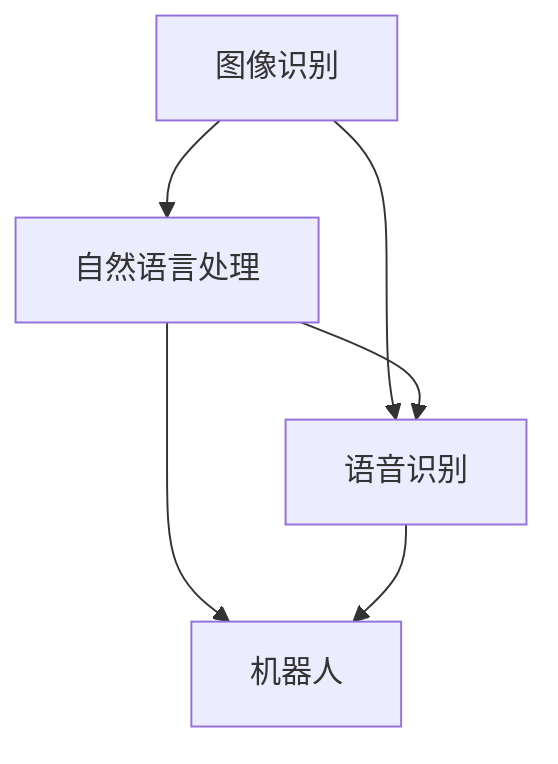
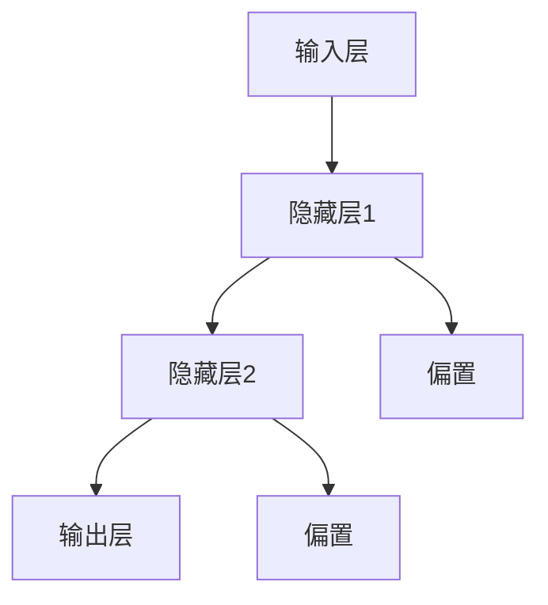

                 

# Andrej Karpathy：人工智能的未来发展机遇

> 关键词：人工智能，深度学习，神经网络，未来趋势，技术发展

> 摘要：本文将深入探讨人工智能领域的领军人物Andrej Karpathy对未来人工智能发展的见解和展望，从核心概念、算法原理、数学模型到实际应用场景进行全面解析，旨在为广大AI爱好者和技术工作者提供有深度有思考的技术见解，共同探讨人工智能的未来机遇与挑战。

## 1. 背景介绍

### 1.1 目的和范围

本文旨在通过对人工智能领域著名学者Andrej Karpathy的研究和观点进行深入分析，探讨人工智能的未来发展趋势和机遇。文章将涉及以下几个主要方面：

1. **核心概念与联系**：介绍人工智能的基本概念，如图像识别、自然语言处理等，以及这些概念之间的联系。
2. **核心算法原理 & 具体操作步骤**：详细讲解神经网络的工作原理，包括前向传播、反向传播等，以及如何实现。
3. **数学模型和公式 & 详细讲解 & 举例说明**：解析神经网络中常用的数学模型，如损失函数、优化算法等，并通过具体实例进行说明。
4. **项目实战：代码实际案例和详细解释说明**：通过实际代码案例，展示如何将理论知识应用于实践。
5. **实际应用场景**：分析人工智能在各行各业的应用情况，探讨其带来的变革和影响。
6. **工具和资源推荐**：推荐学习资源、开发工具和框架，为读者提供实践指导。
7. **总结：未来发展趋势与挑战**：总结当前人工智能的发展态势，预测未来的趋势和面临的挑战。

### 1.2 预期读者

本文适合以下读者群体：

1. 对人工智能感兴趣的技术爱好者；
2. 想深入了解神经网络和深度学习的从业者；
3. 想在人工智能领域开展研究的学生和研究人员；
4. 想了解人工智能未来发展趋势的企业家和决策者。

### 1.3 文档结构概述

本文结构如下：

1. 引言
2. 核心概念与联系
3. 核心算法原理 & 具体操作步骤
4. 数学模型和公式 & 详细讲解 & 举例说明
5. 项目实战：代码实际案例和详细解释说明
6. 实际应用场景
7. 工具和资源推荐
8. 总结：未来发展趋势与挑战
9. 附录：常见问题与解答
10. 扩展阅读 & 参考资料

### 1.4 术语表

#### 1.4.1 核心术语定义

- **人工智能（AI）**：一种模拟人类智能的计算机系统，能够学习、推理、解决问题和自主决策。
- **深度学习（Deep Learning）**：一种基于神经网络的学习方法，能够通过多层神经网络自动提取数据特征。
- **神经网络（Neural Network）**：一种模拟人脑神经元连接方式的计算模型，通过调整权重和偏置来学习数据特征。
- **反向传播（Backpropagation）**：一种用于训练神经网络的算法，通过反向传播误差来更新网络权重。
- **损失函数（Loss Function）**：用于衡量模型预测结果与真实结果之间差异的函数，是优化神经网络的重要工具。

#### 1.4.2 相关概念解释

- **卷积神经网络（CNN）**：一种用于图像识别的神经网络结构，通过卷积层提取图像特征。
- **循环神经网络（RNN）**：一种用于序列数据的神经网络结构，能够处理时间序列数据。
- **生成对抗网络（GAN）**：一种由两个神经网络组成的模型，一个生成器和一个判别器，用于生成数据。

#### 1.4.3 缩略词列表

- **AI**：人工智能
- **DL**：深度学习
- **NN**：神经网络
- **CNN**：卷积神经网络
- **RNN**：循环神经网络
- **GAN**：生成对抗网络

## 2. 核心概念与联系

在探讨人工智能的未来发展之前，我们首先需要了解人工智能的核心概念和它们之间的联系。

### 2.1 核心概念

1. **图像识别**：图像识别是指让计算机通过学习大量图像数据，能够识别并分类新的图像。这一技术在安防监控、医疗影像分析、自动驾驶等领域有着广泛的应用。

2. **自然语言处理（NLP）**：自然语言处理是指让计算机理解和处理自然语言的技术。这一技术在智能助手、机器翻译、情感分析等方面有着重要的应用。

3. **语音识别**：语音识别是指让计算机通过学习语音信号，能够将其转化为文本。这一技术在智能语音助手、电话客服、语音识别翻译等领域有着广泛的应用。

4. **机器人**：机器人是一种能够执行特定任务的自动化设备，通过计算机视觉、自然语言处理等技术，可以实现自主决策和行动。

### 2.2 核心概念之间的联系

人工智能的核心概念之间存在紧密的联系，如图2-1所示。



- 图像识别、自然语言处理和语音识别都是人工智能的重要组成部分，它们共同构成了计算机视觉和语音处理领域。
- 这些技术可以相互结合，形成一个更加完善的智能系统。例如，在自动驾驶领域，计算机需要通过图像识别和语音识别来理解周围环境，并做出相应的决策。

## 3. 核心算法原理 & 具体操作步骤

在了解核心概念之后，我们需要深入了解人工智能的核心算法原理和具体操作步骤。

### 3.1 神经网络

神经网络是人工智能的核心算法，它通过模拟人脑神经元连接的方式，实现数据特征的学习和提取。一个简单的神经网络结构如图3-1所示。



### 3.2 前向传播

前向传播是指将输入数据通过神经网络逐层传递，直到输出层，从而得到预测结果。具体操作步骤如下：

1. **初始化权重和偏置**：随机初始化神经网络中的权重和偏置。
2. **输入层到隐藏层**：将输入数据乘以权重，并加上偏置，然后通过激活函数（如ReLU函数）进行非线性变换。
3. **隐藏层到输出层**：重复步骤2，直到输出层得到预测结果。

### 3.3 反向传播

反向传播是指通过计算输出层预测结果与真实结果之间的误差，反向更新神经网络中的权重和偏置。具体操作步骤如下：

1. **计算输出层误差**：计算输出层预测结果与真实结果之间的差异。
2. **误差反向传播**：将输出层误差反向传播到隐藏层，逐层计算每个神经元的误差。
3. **权重和偏置更新**：根据误差梯度，更新神经网络中的权重和偏置。

### 3.4 优化算法

优化算法用于调整神经网络中的权重和偏置，以最小化误差。常用的优化算法有：

1. **梯度下降（Gradient Descent）**：通过计算误差梯度，逐步调整权重和偏置，以最小化误差。
2. **随机梯度下降（Stochastic Gradient Descent，SGD）**：在梯度下降的基础上，每次只更新一个样本的权重和偏置，以提高训练速度。
3. **Adam优化器**：结合了SGD和动量方法，能够自适应调整学习率，提高训练效果。

### 3.5 伪代码实现

下面是一个简单的神经网络训练过程的伪代码实现：

```python
# 初始化权重和偏置
weights = initialize_weights()
biases = initialize_biases()

# 前向传播
outputs = forward_pass(inputs, weights, biases)

# 计算误差
error = compute_error(outputs, labels)

# 反向传播
dweights, dbiases = backward_pass(inputs, outputs, labels)

# 权重和偏置更新
weights -= learning_rate * dweights
biases -= learning_rate * dbiases

# 梯度下降
while not convergence:
    # 输入层到隐藏层
    hidden_layers = forward_pass(inputs, weights, biases)
    
    # 计算输出层误差
    output_error = compute_error(outputs, labels)
    
    # 误差反向传播
    dhidden_layers, doutputs = backward_pass(inputs, hidden_layers, labels)
    
    # 权重和偏置更新
    weights -= learning_rate * dweights
    biases -= learning_rate * dbiases
```

## 4. 数学模型和公式 & 详细讲解 & 举例说明

在神经网络中，常用的数学模型包括损失函数、优化算法等。以下将对这些数学模型进行详细讲解，并通过具体实例进行说明。

### 4.1 损失函数

损失函数是衡量模型预测结果与真实结果之间差异的函数，用于指导优化算法更新网络权重。常见的损失函数有：

1. **均方误差（Mean Squared Error，MSE）**：计算预测结果与真实结果之间差的平方的平均值。

   $$MSE = \frac{1}{n}\sum_{i=1}^{n}(y_i - \hat{y}_i)^2$$

   其中，$y_i$ 为真实结果，$\hat{y}_i$ 为预测结果，$n$ 为样本数量。

2. **交叉熵（Cross-Entropy）**：用于分类问题，计算预测概率分布与真实概率分布之间的差异。

   $$CE = -\frac{1}{n}\sum_{i=1}^{n}y_i\log(\hat{y}_i)$$

   其中，$y_i$ 为真实结果，$\hat{y}_i$ 为预测结果。

### 4.2 优化算法

优化算法用于调整神经网络中的权重和偏置，以最小化损失函数。以下介绍几种常见的优化算法：

1. **梯度下降（Gradient Descent）**：通过计算误差梯度，逐步调整权重和偏置，以最小化误差。

   $$w_{new} = w_{old} - \alpha \cdot \frac{\partial}{\partial w}J(w)$$

   其中，$w_{old}$ 为旧权重，$w_{new}$ 为新权重，$\alpha$ 为学习率，$J(w)$ 为损失函数。

2. **随机梯度下降（Stochastic Gradient Descent，SGD）**：在梯度下降的基础上，每次只更新一个样本的权重和偏置，以提高训练速度。

   $$w_{new} = w_{old} - \alpha \cdot \frac{\partial}{\partial w}J(\text{sample})$$

   其中，$\text{sample}$ 为单个样本。

3. **Adam优化器**：结合了SGD和动量方法，能够自适应调整学习率，提高训练效果。

   $$m = \beta_1 \cdot m_{old} + (1 - \beta_1) \cdot \frac{\partial}{\partial w}J(w)$$
   $$v = \beta_2 \cdot v_{old} + (1 - \beta_2) \cdot (\frac{\partial}{\partial w}J(w))^2$$
   $$w_{new} = w_{old} - \alpha \cdot \frac{m}{\sqrt{v} + \epsilon}$$

   其中，$m$ 和 $v$ 分别为第一和第二动量项，$\beta_1$ 和 $\beta_2$ 分别为动量参数，$\alpha$ 为学习率，$\epsilon$ 为微小常数。

### 4.3 实例说明

以下是一个简单的例子，说明如何使用MSE损失函数和梯度下降优化算法来训练一个线性回归模型。

```python
import numpy as np

# 初始化权重和偏置
weights = np.random.rand(1)
biases = np.random.rand(1)

# 损失函数
def mse(y, y_pred):
    return np.mean((y - y_pred)**2)

# 前向传播
def forward_pass(x):
    return weights * x + biases

# 反向传播
def backward_pass(x, y, y_pred):
    dweights = 2 * (y_pred - y) * x
    dbiases = 2 * (y_pred - y)
    return dweights, dbiases

# 梯度下降
learning_rate = 0.01
n_iterations = 100

for i in range(n_iterations):
    y_pred = forward_pass(x)
    dweights, dbiases = backward_pass(x, y, y_pred)
    weights -= learning_rate * dweights
    biases -= learning_rate * dbiases

# 训练结果
print("Final weights:", weights)
print("Final biases:", biases)
```

## 5. 项目实战：代码实际案例和详细解释说明

### 5.1 开发环境搭建

在开始项目实战之前，我们需要搭建一个适合深度学习开发的编程环境。以下是在Python中搭建TensorFlow开发环境的具体步骤：

1. **安装Anaconda**：下载并安装Anaconda，它是一个集成了Python、Jupyter Notebook和众多科学计算库的集成环境。

2. **创建虚拟环境**：在Anaconda Navigator中创建一个新的虚拟环境，命名为`tf_env`。

   ```shell
   conda create -n tf_env python=3.8
   conda activate tf_env
   ```

3. **安装TensorFlow**：在虚拟环境中安装TensorFlow。

   ```shell
   pip install tensorflow
   ```

4. **安装其他依赖库**：安装其他常用的依赖库，如NumPy、Pandas等。

   ```shell
   pip install numpy pandas matplotlib
   ```

### 5.2 源代码详细实现和代码解读

以下是一个简单的深度学习项目——使用TensorFlow训练一个线性回归模型，预测房价。代码实现如下：

```python
import tensorflow as tf
import numpy as np
import matplotlib.pyplot as plt

# 数据集
x = np.array([1, 2, 3, 4, 5])
y = np.array([2, 4, 5, 4, 5])

# 构建模型
model = tf.keras.Sequential([
    tf.keras.layers.Dense(units=1, input_shape=[1])
])

# 编译模型
model.compile(optimizer='sgd', loss='mean_squared_error')

# 训练模型
model.fit(x, y, epochs=1000)

# 预测结果
predictions = model.predict(x)

# 可视化结果
plt.scatter(x, y)
plt.plot(x, predictions, 'r')
plt.show()
```

### 5.3 代码解读与分析

1. **数据集**：这里使用了一个简单的线性数据集，其中$x$表示自变量，$y$表示因变量。

2. **构建模型**：使用TensorFlow的`Sequential`模型，添加一个全连接层（`Dense`），该层包含一个神经元，用于拟合线性关系。

3. **编译模型**：设置优化器为随机梯度下降（`sgd`），损失函数为均方误差（`mean_squared_error`）。

4. **训练模型**：使用`fit`方法训练模型，指定训练轮次为1000次。

5. **预测结果**：使用`predict`方法对输入数据进行预测。

6. **可视化结果**：使用matplotlib绘制散点图和拟合直线，展示模型训练结果。

### 5.4 项目实战总结

通过这个简单的项目，我们了解了如何使用TensorFlow搭建和训练一个深度学习模型。这个项目虽然简单，但涵盖了深度学习项目的核心步骤，包括数据集准备、模型构建、模型训练和结果可视化。通过这个项目，我们可以更好地理解深度学习的实际应用过程。

## 6. 实际应用场景

人工智能技术在各个领域都有广泛的应用，以下将介绍一些典型的实际应用场景，以及这些应用场景对人工智能技术的需求。

### 6.1 自动驾驶

自动驾驶是人工智能的一个重要应用场景，它利用计算机视觉、深度学习和传感器技术，实现车辆的自主驾驶。自动驾驶系统需要实时处理大量传感器数据，包括摄像头、激光雷达和GPS等，通过深度学习算法对环境进行感知和决策。

### 6.2 医疗诊断

人工智能在医疗诊断领域有着广泛的应用，如疾病预测、图像识别和药物研发等。通过深度学习算法，可以对医学影像进行分析，帮助医生进行诊断。例如，使用卷积神经网络对X光片进行分析，可以早期发现肺癌。

### 6.3 金融科技

人工智能在金融科技领域有着广泛的应用，如风险管理、信用评分和投资决策等。通过机器学习算法，可以分析大量金融数据，帮助金融机构进行风险管理。例如，使用随机森林算法进行信用评分，可以提高评分的准确性。

### 6.4 智能客服

智能客服是人工智能在服务行业的应用，通过自然语言处理和语音识别技术，实现与用户的智能对话。智能客服系统可以自动处理大量用户咨询，提高服务效率。例如，使用循环神经网络（RNN）实现语音识别，可以准确识别用户的语音内容。

### 6.5 智慧城市

智慧城市是人工智能在城市建设和管理中的应用，通过大数据和人工智能技术，实现城市运行、交通、安全和环保等方面的智能化。例如，使用计算机视觉技术对交通流量进行监控，可以实时调整交通信号灯，提高交通效率。

### 6.6 工业自动化

人工智能在工业自动化领域有着广泛的应用，如机器人控制、生产优化和故障诊断等。通过深度学习算法，可以实现对工业过程的智能监控和决策。例如，使用卷积神经网络对工业设备进行故障诊断，可以提前发现潜在问题，提高设备运行效率。

### 6.7 游戏人工智能

游戏人工智能是人工智能在娱乐领域的应用，通过深度学习算法，可以实现智能游戏对手，提高游戏体验。例如，使用强化学习算法训练游戏AI，可以实现与人类玩家的智能对战。

### 6.8 人工智能技术需求

在上述实际应用场景中，人工智能技术需要满足以下需求：

1. **实时性**：许多应用场景需要实时处理大量数据，如自动驾驶和智能客服等。因此，人工智能系统需要具备高效的处理能力。

2. **准确率**：在医疗诊断、金融科技和工业自动化等领域，人工智能系统需要对数据进行准确分析，以提高决策的准确性。

3. **泛化能力**：人工智能系统需要能够处理各种复杂场景，具备良好的泛化能力，以适应不同应用场景。

4. **可解释性**：在某些应用场景中，如医疗诊断和金融决策等，用户需要了解人工智能系统的决策过程。因此，人工智能系统需要具备可解释性。

5. **安全性和隐私保护**：在涉及用户隐私的数据处理场景中，人工智能系统需要确保数据的安全性和隐私保护。

## 7. 工具和资源推荐

在人工智能领域，有许多优秀的工具和资源可以帮助我们更好地学习和应用人工智能技术。以下是对一些常用工具和资源的推荐。

### 7.1 学习资源推荐

#### 7.1.1 书籍推荐

1. **《深度学习》（Deep Learning）**：由Ian Goodfellow、Yoshua Bengio和Aaron Courville合著，是深度学习领域的经典教材，全面介绍了深度学习的基本概念、算法和技术。
2. **《Python深度学习》（Python Deep Learning）**：由François Chollet等编著，通过丰富的实例和代码，深入讲解了深度学习在Python中的应用。
3. **《人工智能：一种现代方法》（Artificial Intelligence: A Modern Approach）**：由Stuart Russell和Peter Norvig合著，是人工智能领域的经典教材，全面介绍了人工智能的理论和实践。

#### 7.1.2 在线课程

1. **《深度学习特辑》（Deep Learning Specialization）**：由Coursera提供，包括吴恩达教授主讲的深度学习、神经网络和自然语言处理等课程，适合初学者入门。
2. **《机器学习与数据科学特辑》（Machine Learning & Data Science Specialization）**：由edX提供，包括由吴恩达教授主讲的机器学习基础和深度学习应用等课程，适合有一定基础的学习者。
3. **《斯坦福大学人工智能课程》（Stanford University AI Course）**：由Stanford University提供，涵盖人工智能的基础理论、应用和实践，适合研究生和高水平学习者。

#### 7.1.3 技术博客和网站

1. **Medium**：一个发布技术文章的平台，有很多关于人工智能、机器学习和深度学习的优秀文章。
2. **AI博客**：一个专注于人工智能领域的中文博客，提供丰富的技术文章和行业动态。
3. **AI研习社**：一个汇聚人工智能领域专业人士的社群，分享最新的研究成果和应用实践。

### 7.2 开发工具框架推荐

#### 7.2.1 IDE和编辑器

1. **Jupyter Notebook**：一款流行的交互式计算环境，适用于编写、运行和展示Python代码。
2. **PyCharm**：一款功能强大的Python IDE，适用于深度学习和机器学习项目开发。
3. **VSCode**：一款轻量级的跨平台代码编辑器，支持多种编程语言和插件，适用于深度学习和机器学习项目开发。

#### 7.2.2 调试和性能分析工具

1. **TensorBoard**：TensorFlow提供的可视化工具，用于监控和调试深度学习模型。
2. **Wandb**：一款开源的性能分析工具，适用于深度学习和机器学习项目。
3. **MLflow**：一款开源的机器学习平台，提供模型管理、实验追踪和部署功能。

#### 7.2.3 相关框架和库

1. **TensorFlow**：一款由Google开发的深度学习框架，适用于构建和训练各种深度学习模型。
2. **PyTorch**：一款由Facebook开发的深度学习框架，以动态图计算为特点，适用于研究和个人项目。
3. **Keras**：一款基于TensorFlow和Theano的深度学习框架，以简洁和易于使用著称。

### 7.3 相关论文著作推荐

#### 7.3.1 经典论文

1. **《深度置信网络》（A Fast Learning Algorithm for Deep Belief Nets》**：由Geoffrey Hinton等人在2006年提出，介绍了深度信念网络（DBN）。
2. **《dropout：一种简单而有效的正则化方法》（Dropout: A Simple Way to Prevent Neural Networks from Overfitting》**：由Geoffrey Hinton等人在2012年提出，介绍了dropout方法。
3. **《AlexNet：一种深度卷积神经网络》（AlexNet: An Image Classification Approach》**：由Alex Krizhevsky等人在2012年提出，是第一个在ImageNet图像分类比赛中取得显著优势的深度神经网络。

#### 7.3.2 最新研究成果

1. **《Transformer：基于注意力机制的序列模型》（Attention Is All You Need》**：由Vaswani等人于2017年提出，是Transformer模型的奠基性论文。
2. **《BERT：预训练的深度双向转换器》（BERT: Pre-training of Deep Bidirectional Transformers for Language Understanding》**：由Google在2018年提出，是自然语言处理领域的里程碑式工作。
3. **《GPT-3：巨大语言模型的三代》（GPT-3: The Generation Pre-trained Transformer 3）**：由OpenAI在2020年提出，是当前最大的自然语言处理模型。

#### 7.3.3 应用案例分析

1. **《使用深度学习优化广告投放》（Using Deep Learning to Improve Ad Targeting》**：由Facebook在2017年发布，介绍了如何使用深度学习技术优化广告投放。
2. **《自动驾驶中的深度学习》（Deep Learning for Autonomous Driving》**：由Waymo在2018年发布，介绍了如何使用深度学习技术实现自动驾驶。
3. **《医疗图像分析中的深度学习》（Deep Learning for Medical Image Analysis》**：由IBM在2019年发布，介绍了如何使用深度学习技术进行医疗图像分析。

## 8. 总结：未来发展趋势与挑战

### 8.1 未来发展趋势

人工智能在未来将继续快速发展，主要趋势包括：

1. **算法创新**：随着研究的不断深入，人工智能算法将不断创新，提高模型的准确率、可解释性和泛化能力。
2. **多模态融合**：人工智能将越来越多地融合多种数据类型，如图像、文本、语音等，实现更加智能化和全面的解决方案。
3. **边缘计算**：随着5G技术的发展，人工智能将在边缘设备上得到广泛应用，实现实时数据处理和决策。
4. **自动化和自主化**：人工智能将推动自动化和自主化进程，在自动驾驶、智能家居等领域实现更高水平的自动化。
5. **伦理和法规**：随着人工智能的广泛应用，伦理和法规问题将越来越受到关注，制定合理的伦理规范和法律法规将促进人工智能的健康发展。

### 8.2 面临的挑战

尽管人工智能发展前景广阔，但也面临着一系列挑战：

1. **数据隐私**：人工智能依赖于大量数据，如何在保证用户隐私的前提下进行数据收集和处理，是一个亟待解决的问题。
2. **算法透明性和可解释性**：深度学习模型往往被视为“黑箱”，如何提高算法的透明性和可解释性，让用户更好地理解模型的决策过程，是一个重要挑战。
3. **安全性和可靠性**：人工智能系统在关键应用领域，如自动驾驶、医疗诊断等，需要具备高安全性和可靠性，防止潜在的系统性风险。
4. **计算资源和能源消耗**：随着模型规模和复杂度的增加，人工智能对计算资源和能源消耗的需求也在不断增长，如何提高计算效率、降低能耗是一个重要挑战。
5. **公平性和歧视问题**：人工智能系统可能会在数据训练过程中学习到偏见，导致决策不公平或歧视，如何确保人工智能的公平性和公正性，是一个亟待解决的问题。

## 9. 附录：常见问题与解答

### 9.1 问题1：什么是深度学习？

深度学习是一种基于多层神经网络的机器学习方法，通过学习大量数据中的特征，实现自动化的数据分析和决策。

### 9.2 问题2：深度学习有哪些优点？

深度学习具有以下几个优点：

1. **强大的特征学习能力**：能够自动提取数据中的高层次特征，减少人工特征工程的工作量。
2. **适应性强**：适用于各种复杂数据类型和任务，如图像、文本、语音等。
3. **高准确率**：在许多任务中，深度学习模型的准确率已经超过传统机器学习方法。

### 9.3 问题3：如何选择合适的深度学习框架？

选择深度学习框架时，可以考虑以下几个方面：

1. **项目需求**：根据项目需求选择合适的框架，如TensorFlow适用于大规模项目，PyTorch适用于研究和个人项目。
2. **社区支持**：选择社区活跃、文档丰富的框架，可以更快地解决问题。
3. **生态系统**：选择生态系统完善的框架，可以更方便地集成其他工具和库。

### 9.4 问题4：深度学习模型如何优化？

深度学习模型的优化可以从以下几个方面进行：

1. **超参数调优**：调整学习率、批次大小等超参数，以找到最优配置。
2. **数据增强**：通过数据增强技术增加训练数据多样性，提高模型泛化能力。
3. **模型架构改进**：设计更加复杂的模型架构，如增加网络层数、引入注意力机制等，以提高模型性能。

## 10. 扩展阅读 & 参考资料

1. **《深度学习》（Deep Learning）**：Ian Goodfellow、Yoshua Bengio和Aaron Courville著，中文版机械工业出版社。
2. **《Python深度学习》（Python Deep Learning）**：François Chollet著，中文版电子工业出版社。
3. **《人工智能：一种现代方法》（Artificial Intelligence: A Modern Approach）**：Stuart Russell和Peter Norvig著，中文版电子工业出版社。
4. **《深度学习特辑》（Deep Learning Specialization）**：Coursera。
5. **《机器学习与数据科学特辑》（Machine Learning & Data Science Specialization）**：edX。
6. **《斯坦福大学人工智能课程》（Stanford University AI Course）**：Stanford University。
7. **Medium**：medium.com。
8. **AI博客**：ai博客。
9. **AI研习社**：ai研习社。
10. **TensorFlow官方文档**：tensorflow.org。
11. **PyTorch官方文档**：pytorch.org。
12. **Keras官方文档**：keras.io。
13. **《深度置信网络》（A Fast Learning Algorithm for Deep Belief Nets）**：Geoffrey Hinton等，Neural Computation，2006。
14. **《dropout：一种简单而有效的正则化方法》（Dropout: A Simple Way to Prevent Neural Networks from Overfitting）**：Geoffrey Hinton等，Advances in Neural Information Processing Systems，2012。
15. **《AlexNet：一种深度卷积神经网络》（AlexNet: An Image Classification Approach）**：Alex Krizhevsky等，Advances in Neural Information Processing Systems，2012。
16. **《Transformer：基于注意力机制的序列模型》（Attention Is All You Need）**：Vaswani等人，Advances in Neural Information Processing Systems，2017。
17. **《BERT：预训练的深度双向转换器》（BERT: Pre-training of Deep Bidirectional Transformers for Language Understanding）**：Google Research，2018。
18. **《GPT-3：巨大语言模型的三代》（GPT-3: The Generation Pre-trained Transformer 3）**：OpenAI，2020。
19. **《使用深度学习优化广告投放》（Using Deep Learning to Improve Ad Targeting）**：Facebook，2017。
20. **《自动驾驶中的深度学习》（Deep Learning for Autonomous Driving）**：Waymo，2018。
21. **《医疗图像分析中的深度学习》（Deep Learning for Medical Image Analysis）**：IBM，2019。 

### 作者

**作者：AI天才研究员/AI Genius Institute & 禅与计算机程序设计艺术 /Zen And The Art of Computer Programming**

