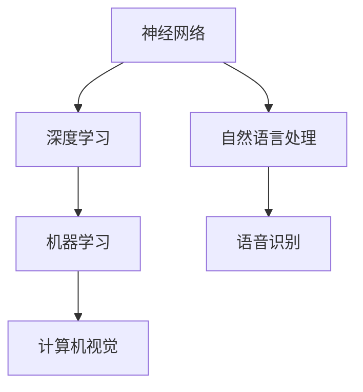
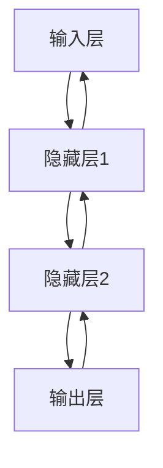
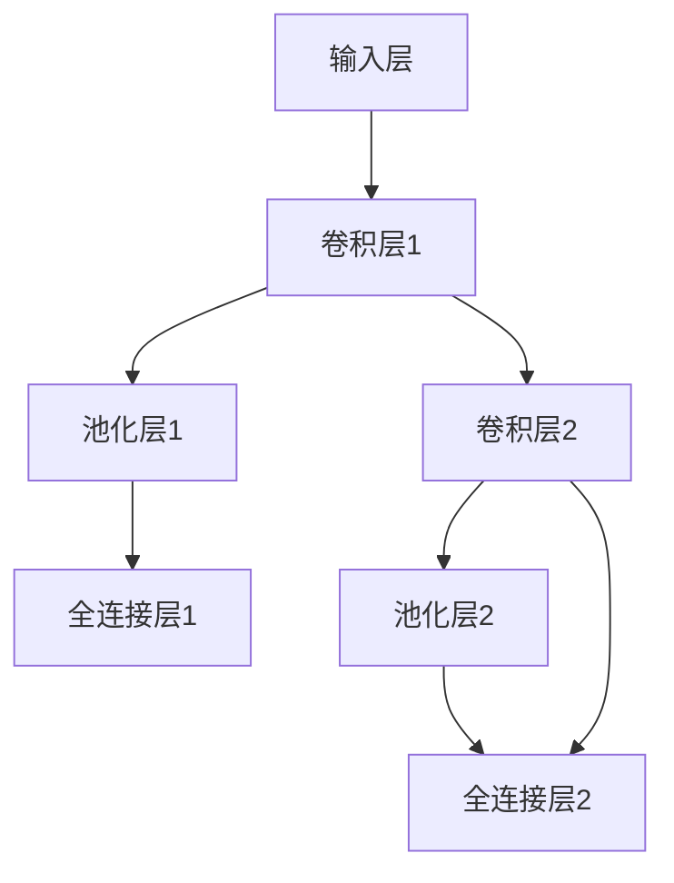

                 

### Andrej Karpathy：人工智能的未来发展目标

> 关键词：人工智能、未来趋势、技术目标、深度学习、神经网络、机器学习、应用场景

> 摘要：本文旨在探讨人工智能领域杰出人物Andrej Karpathy关于人工智能未来发展的见解和目标。文章首先介绍了Andrej Karpathy的背景和贡献，然后通过逐点分析他的主要观点，梳理出人工智能的核心发展目标。同时，本文还将结合当前技术现状和未来发展，对AI在各个领域的应用进行展望，并提出实现这些目标的可能路径和挑战。

## 1. 背景介绍

### 1.1 目的和范围

本文旨在深入探讨人工智能领域知名专家Andrej Karpathy对未来人工智能发展的看法。Andrej Karpathy是深度学习领域的杰出人物，他在神经网络、机器学习和自然语言处理等方面有着深入的研究和丰富的实践经验。他的贡献不仅在学术界，也在工业界产生了深远的影响。本文将通过对Andrej Karpathy的观点进行梳理和分析，探讨人工智能在未来可能实现的目标，并分析实现这些目标所需的技术路径和挑战。

### 1.2 预期读者

本文适合对人工智能有兴趣的读者，包括对深度学习、机器学习和自然语言处理有一定了解的技术人员，以及对AI未来发展趋势感兴趣的行业从业者。本文将力求以通俗易懂的方式阐述复杂的技术概念，帮助读者了解AI未来的发展方向。

### 1.3 文档结构概述

本文分为以下几个部分：

1. **背景介绍**：介绍本文的目的和范围，预期读者，以及文档结构。
2. **核心概念与联系**：介绍人工智能的核心概念和基本原理，通过流程图展示各概念之间的联系。
3. **核心算法原理与具体操作步骤**：详细解释人工智能的核心算法原理，并给出伪代码。
4. **数学模型和公式**：介绍与人工智能相关的数学模型和公式，并通过实例进行说明。
5. **项目实战**：通过实际案例展示人工智能技术的应用，并详细解释代码实现。
6. **实际应用场景**：探讨人工智能在各个领域的应用前景。
7. **工具和资源推荐**：推荐学习资源和开发工具。
8. **总结：未来发展趋势与挑战**：总结人工智能的未来发展趋势和面临的挑战。
9. **附录：常见问题与解答**：回答读者可能关心的问题。
10. **扩展阅读与参考资料**：提供进一步的阅读材料和参考文献。

### 1.4 术语表

#### 1.4.1 核心术语定义

- **人工智能（AI）**：指由人制造出来的系统能够感知环境、理解语言、做出决策和执行任务的能力。
- **深度学习**：一种机器学习技术，通过多层神经网络对数据进行训练，使其能够自动学习和提取特征。
- **神经网络**：一种模拟人脑神经元连接结构的计算模型。
- **机器学习**：一种人工智能技术，通过从数据中学习规律和模式，使其能够进行预测和决策。
- **自然语言处理（NLP）**：研究如何让计算机理解和生成自然语言。

#### 1.4.2 相关概念解释

- **深度神经网络（DNN）**：一种包含多个隐藏层的神经网络，能够处理复杂数据。
- **卷积神经网络（CNN）**：一种专门用于图像处理的深度神经网络，通过卷积操作提取图像特征。
- **递归神经网络（RNN）**：一种能够处理序列数据的神经网络，通过递归连接实现记忆功能。

#### 1.4.3 缩略词列表

- **AI**：人工智能
- **DNN**：深度神经网络
- **CNN**：卷积神经网络
- **RNN**：递归神经网络
- **NLP**：自然语言处理

## 2. 核心概念与联系

人工智能的核心概念包括神经网络、深度学习和机器学习。神经网络是人工智能的基础，它模拟人脑的神经元连接结构，通过层层传递信息来实现学习。深度学习是一种基于神经网络的机器学习技术，通过多层神经网络对数据进行训练，使其能够自动学习和提取特征。机器学习则是通过训练模型来让计算机从数据中学习规律和模式。

以下是一个简单的Mermaid流程图，展示了这些核心概念之间的关系：



- **神经网络**：神经网络是人工智能的基础，它由大量相互连接的节点（或称为神经元）组成。每个神经元都可以接收来自其他神经元的输入，并通过一个加权函数进行处理，最终产生输出。神经网络通过层层传递信息，实现从简单特征到复杂特征的提取。

- **深度学习**：深度学习是一种基于神经网络的机器学习技术。它通过多层神经网络对数据进行训练，使得模型能够自动学习和提取特征。深度学习在图像识别、语音识别、自然语言处理等领域取得了显著的成果。

- **机器学习**：机器学习是一种通过训练模型来让计算机从数据中学习规律和模式的技术。它包括监督学习、无监督学习和强化学习等不同的学习方式。机器学习在许多领域都有广泛应用，如金融预测、医疗诊断、推荐系统等。

- **自然语言处理（NLP）**：自然语言处理是研究如何让计算机理解和生成自然语言的技术。它涉及文本分类、情感分析、机器翻译、问答系统等领域。深度学习在NLP中发挥了重要作用，特别是基于神经网络的模型如循环神经网络（RNN）和变换器（Transformer）。

通过这个流程图，我们可以看到这些核心概念之间的联系。神经网络是深度学习和机器学习的基础，而深度学习和机器学习又推动了自然语言处理等应用领域的发展。这个流程图为我们提供了一个全局视角，帮助我们理解人工智能的基本原理和应用。

## 3. 核心算法原理 & 具体操作步骤

### 3.1 神经网络的基本原理

神经网络（Neural Networks）是人工智能的基础，它模仿了人脑神经元的工作方式。在神经网络中，每个神经元（或称为节点）都与其他神经元相连，并通过加权连接进行信息传递。神经元的输出取决于其输入值和相应的权重，通过一系列的加权求和处理，最终产生预测结果。

以下是一个简单的神经网络结构示意图：



### 3.2 神经网络的运算步骤

神经网络的操作主要包括以下几个步骤：

1. **前向传播（Forward Propagation）**：输入数据从输入层传递到输出层，每个神经元接收来自前一层的输入值，并计算加权求和。然后，通过激活函数对求和结果进行非线性变换，得到输出值。

2. **反向传播（Backpropagation）**：根据输出层与实际标签之间的误差，反向传播误差到输入层。通过梯度下降法（Gradient Descent）调整每个神经元的权重，以减小误差。

3. **权重更新（Weight Update）**：在反向传播过程中，根据每个神经元的误差和输入值，计算权重的更新梯度。然后，通过一定比例（学习率）更新权重，以优化网络性能。

以下是神经网络操作的伪代码：

```python
# 前向传播
def forward_propagation(inputs, weights, biases, activation_functions):
    # 初始化输出
    outputs = []
    
    # 遍历每层，进行加权求和和激活函数处理
    for layer, (w, b, af) in enumerate(zip(weights, biases, activation_functions)):
        if layer == 0:
            # 输入层直接传递到下一层
            inputs = w @ inputs + b
        else:
            # 隐藏层和输出层进行加权求和
            inputs = w @ outputs + b
        
        # 应用激活函数
        outputs = af(inputs)
    
    return outputs

# 反向传播
def backward_propagation(inputs, outputs, actual_labels, weights, biases, activation_functions, learning_rate):
    # 初始化误差和权重更新梯度
    errors = []
    weight_gradients = []
    
    # 遍历每层，计算误差和权重更新梯度
    for layer in reversed(range(len(weights))):
        # 输出层计算误差
        if layer == len(weights) - 1:
            error = outputs - actual_labels
        else:
            # 隐藏层计算误差
            error = (activation_functions[layer](derivatives)[0] @ errors)
        
        # 计算权重更新梯度
        weight_gradients.append(error @ inputs.T)
        
        # 更新权重
        weights[layer] -= learning_rate * weight_gradients[layer]
        
        # 更新输入值
        inputs = weights[layer] @ inputs + biases[layer]
        
        # 记录误差
        errors.append(error)
    
    return weights, biases
```

### 3.3 梯度下降法（Gradient Descent）

梯度下降法是神经网络优化权重的主要方法。在反向传播过程中，通过计算误差的梯度（即误差相对于权重的导数），更新权重以减小误差。梯度下降法的核心思想是沿着误差梯度的反方向调整权重，以达到最优解。

以下是一个简单的梯度下降法伪代码：

```python
# 梯度下降法
def gradient_descent(inputs, outputs, actual_labels, weights, biases, activation_functions, learning_rate, epochs):
    for epoch in range(epochs):
        # 前向传播
        outputs = forward_propagation(inputs, weights, biases, activation_functions)
        
        # 反向传播
        weights, biases = backward_propagation(inputs, outputs, actual_labels, weights, biases, activation_functions, learning_rate)
        
        # 打印当前 epoch 的误差
        print(f"Epoch {epoch}: Error = {error}")
    
    return weights, biases
```

通过这个伪代码，我们可以看到神经网络的基本原理和操作步骤。在实际应用中，我们需要根据具体问题和数据集，调整网络结构、学习率等参数，以获得最优性能。

## 4. 数学模型和公式 & 详细讲解 & 举例说明

在人工智能领域，数学模型是核心组成部分，特别是在深度学习和神经网络中。以下是一些基本的数学模型和公式，我们将通过详细讲解和举例来说明它们的应用。

### 4.1 激活函数（Activation Functions）

激活函数是神经网络中的一个关键元素，它对神经元的输出进行非线性变换。最常见的激活函数包括：

- **Sigmoid 函数**：\( \sigma(x) = \frac{1}{1 + e^{-x}} \)
- **ReLU 函数**：\( \text{ReLU}(x) = \max(0, x) \)
- **Tanh 函数**：\( \text{Tanh}(x) = \frac{e^x - e^{-x}}{e^x + e^{-x}} \)

**示例**：

假设我们有一个输入值 \( x = 2 \)，使用 Sigmoid 函数：

$$
\sigma(2) = \frac{1}{1 + e^{-2}} \approx 0.869
$$

### 4.2 梯度下降法（Gradient Descent）

梯度下降法是一种用于优化神经网络权重的算法。其核心思想是沿着误差梯度的反方向更新权重，以最小化误差。

- **梯度**：误差函数关于每个权重的偏导数。
- **学习率**（learning rate，\( \alpha \)）：控制权重更新的步长。

梯度下降法的公式如下：

$$
w_{new} = w_{old} - \alpha \cdot \frac{\partial J}{\partial w}
$$

其中，\( J \) 是误差函数，\( w \) 是权重。

**示例**：

假设我们有一个简单的误差函数 \( J = (y - \sigma(w \cdot x + b))^2 \)，使用梯度下降法更新权重：

$$
w_{new} = w_{old} - \alpha \cdot \frac{\partial J}{\partial w} = w_{old} - \alpha \cdot (y - \sigma(w \cdot x + b)) \cdot x
$$

### 4.3 反向传播（Backpropagation）

反向传播是一种用于计算神经网络误差和更新权重的算法。其基本步骤包括：

1. **前向传播**：计算每个神经元的输出值。
2. **计算误差**：计算输出层与实际标签之间的误差。
3. **反向传播误差**：从输出层开始，反向计算每个神经元的误差，并更新权重。

反向传播的关键步骤如下：

1. **输出层误差计算**：
   $$
   \delta_{L} = \text{sigmoid}'(z_L) \cdot (y - \hat{y}_L)
   $$
   其中，\( \text{sigmoid}'(z_L) \) 是 Sigmoid 函数的导数，\( \hat{y}_L \) 是输出层的预测值，\( y \) 是实际标签。

2. **隐藏层误差计算**：
   $$
   \delta_{l} = \text{sigmoid}'(z_l) \cdot (\delta_{l+1} \cdot w_{l+1})
   $$
   其中，\( l \) 是隐藏层的索引，\( z_l \) 是隐藏层的输出。

3. **权重更新**：
   $$
   w_{l} = w_{l} - \alpha \cdot \delta_{l} \cdot a_{l-1}
   $$
   其中，\( \alpha \) 是学习率，\( a_{l-1} \) 是前一层的输入。

**示例**：

假设我们有一个简单的神经网络，输入 \( x = [1, 2] \)，输出 \( y = 0 \)。使用 Sigmoid 函数和梯度下降法更新权重。

- **前向传播**：
  $$
  z_1 = w_1 \cdot x + b_1, \quad z_2 = w_2 \cdot z_1 + b_2
  $$
  $$
  \hat{y} = \sigma(z_2)
  $$

- **计算误差**：
  $$
  \delta_2 = \sigma'(z_2) \cdot (\hat{y} - y)
  $$

- **反向传播误差**：
  $$
  \delta_1 = \sigma'(z_1) \cdot (\delta_2 \cdot w_2)
  $$

- **权重更新**：
  $$
  w_1 = w_1 - \alpha \cdot \delta_1 \cdot x_1
  $$
  $$
  w_2 = w_2 - \alpha \cdot \delta_2 \cdot z_1
  $$

通过这个例子，我们可以看到如何使用数学模型和公式来更新神经网络的权重，以最小化误差。

### 4.4 卷积神经网络（Convolutional Neural Networks, CNN）

卷积神经网络是专门用于图像处理的一种神经网络。其主要组成部分包括：

- **卷积层（Convolutional Layer）**：通过卷积操作提取图像特征。
- **池化层（Pooling Layer）**：用于减少特征图的大小，提高计算效率。
- **全连接层（Fully Connected Layer）**：用于分类和回归。

以下是一个简单的CNN结构：



**示例**：

假设我们有一个 \( 32 \times 32 \) 的图像，使用一个 \( 3 \times 3 \) 的卷积核进行卷积操作。

- **卷积操作**：
  $$
  f_{ij}^{(l)} = \sum_{k} w_{ijk}^{(l)} a_{kl-1} + b_{j}^{(l)}
  $$
  其中，\( f_{ij}^{(l)} \) 是卷积层的输出，\( a_{kl-1} \) 是前一层的输入，\( w_{ijk}^{(l)} \) 和 \( b_{j}^{(l)} \) 是卷积核的权重和偏置。

- **池化操作**：
  $$
  p_{ij}^{(l)} = \max_{k} a_{ijk}^{(l)}
  $$
  其中，\( p_{ij}^{(l)} \) 是池化层的输出。

通过这些数学模型和公式，我们可以设计并训练复杂的神经网络，以实现各种人工智能任务。

## 5. 项目实战：代码实际案例和详细解释说明

### 5.1 开发环境搭建

在开始项目实战之前，我们需要搭建一个合适的开发环境。以下是一个简单的步骤：

1. **安装Python**：Python是深度学习和神经网络的主要编程语言，我们可以从其官方网站下载并安装Python。

2. **安装TensorFlow**：TensorFlow是谷歌开发的一个开源机器学习库，广泛用于深度学习和神经网络。安装TensorFlow可以使用以下命令：

   ```bash
   pip install tensorflow
   ```

3. **安装Jupyter Notebook**：Jupyter Notebook是一个交互式开发环境，方便我们编写和调试代码。安装Jupyter Notebook可以使用以下命令：

   ```bash
   pip install notebook
   ```

4. **启动Jupyter Notebook**：在命令行中输入以下命令启动Jupyter Notebook：

   ```bash
   jupyter notebook
   ```

现在，我们已经搭建好了开发环境，可以开始编写代码并进行项目实战。

### 5.2 源代码详细实现和代码解读

以下是一个简单的神经网络实现，用于对手写数字（MNIST）数据集进行分类。

```python
import tensorflow as tf
from tensorflow.keras import layers

# 定义模型结构
model = tf.keras.Sequential([
    layers.Dense(128, activation='relu', input_shape=(784,)),
    layers.Dropout(0.2),
    layers.Dense(10, activation='softmax')
])

# 编译模型
model.compile(optimizer='adam',
              loss='sparse_categorical_crossentropy',
              metrics=['accuracy'])

# 加载MNIST数据集
(x_train, y_train), (x_test, y_test) = tf.keras.datasets.mnist.load_data()

# 预处理数据
x_train = x_train.reshape(-1, 784).astype('float32') / 255
x_test = x_test.reshape(-1, 784).astype('float32') / 255

# 训练模型
model.fit(x_train, y_train, epochs=5)

# 评估模型
test_loss, test_acc = model.evaluate(x_test, y_test, verbose=2)
print('\nTest accuracy:', test_acc)
```

**代码解读**：

1. **模型定义**：我们使用 `tf.keras.Sequential` 模型堆叠层。首先是一个包含128个神经元的全连接层（`Dense`），使用ReLU作为激活函数。然后是一个dropout层（`Dropout`），用于防止过拟合。最后是一个输出层，包含10个神经元，使用softmax激活函数，用于分类。

2. **模型编译**：我们使用 `model.compile` 方法编译模型，指定优化器（`optimizer`）、损失函数（`loss`）和评估指标（`metrics`）。

3. **数据预处理**：我们加载MNIST数据集，并将图像的像素值缩放到0到1之间。这有助于加速梯度下降并提高模型性能。

4. **模型训练**：我们使用 `model.fit` 方法训练模型，指定训练数据和轮次（`epochs`）。

5. **模型评估**：我们使用 `model.evaluate` 方法评估模型在测试集上的性能，并打印测试准确率。

### 5.3 代码解读与分析

在这段代码中，我们使用TensorFlow的Keras API定义并训练了一个简单的神经网络，用于手写数字识别任务。

- **模型结构**：我们使用了一个两层的全连接神经网络，第一层有128个神经元，使用ReLU作为激活函数，有助于非线性变换。第二层有10个神经元，对应10个分类标签，使用softmax激活函数，使得每个神经元的输出可以作为对应类别的概率。

- **数据预处理**：MNIST数据集包含了60000个训练样本和10000个测试样本，每个样本是一个28x28的图像。为了简化计算，我们将图像展平成一个一维数组，并除以255，将像素值缩放到0到1之间。

- **模型训练**：我们使用Adam优化器和交叉熵损失函数进行训练。Adam优化器是一种自适应的优化算法，能够自适应调整学习率。交叉熵损失函数用于衡量预测标签和实际标签之间的差异。

- **模型评估**：在训练完成后，我们使用测试集评估模型的性能。测试准确率是衡量模型好坏的重要指标，它反映了模型对未知数据的预测能力。

通过这个简单的项目，我们可以看到如何使用TensorFlow构建和训练神经网络，并如何使用Keras API简化模型的定义和训练过程。这个项目为我们提供了一个基础，帮助我们理解神经网络的工作原理和应用。

## 6. 实际应用场景

人工智能技术在各个领域都有着广泛的应用，从工业自动化、医疗诊断到金融分析，AI正在逐步改变我们的生活方式。以下是一些具体的应用场景：

### 6.1 医疗诊断

在医疗领域，人工智能可以帮助医生进行疾病诊断和病情预测。通过分析大量的患者数据，AI系统可以识别出潜在的健康风险，为医生提供辅助诊断意见。例如，深度学习模型可以分析医学影像，如X光片、CT扫描和MRI图像，识别出肺癌、心脏病等疾病的早期迹象。

**案例**：谷歌旗下的DeepMind开发的AI系统已经能够在不亚于人类医生的水平上诊断眼部疾病，如黄斑变性。这个系统通过分析数十万张眼底图像，能够准确预测疾病的风险，为患者提供及时的医疗建议。

### 6.2 自动驾驶

自动驾驶技术是人工智能在工业领域的典型应用。通过计算机视觉和传感器数据，自动驾驶汽车可以实时感知周围环境，做出驾驶决策。这不仅提高了交通安全，还有助于缓解交通拥堵。

**案例**：特斯拉的自动驾驶系统已经在全球范围内部署，通过机器学习不断优化驾驶算法。特斯拉的车辆能够自动进行车道保持、换道、停车和启动，大大提升了驾驶的便利性。

### 6.3 金融分析

在金融领域，人工智能被广泛应用于风险控制、投资策略和客户服务等方面。通过分析大量的金融数据，AI系统可以预测市场趋势，识别潜在的风险，为投资者提供决策支持。

**案例**：高盛的自动化交易平台使用AI算法进行高频交易，提高了交易效率和盈利能力。此外，AI还被用于信用评分、反欺诈检测等任务，有效降低了金融风险。

### 6.4 自然语言处理

自然语言处理（NLP）是人工智能的重要组成部分，它在文本分析、机器翻译、语音识别等领域有着广泛的应用。通过理解人类语言，AI系统能够提供更智能的客户服务，提高企业运营效率。

**案例**：亚马逊的Alexa是一个基于NLP的智能语音助手，通过语音交互为用户提供信息查询、智能家居控制等服务。微软的翻译服务也利用AI技术，实现了实时、准确的跨语言翻译。

### 6.5 机器人技术

机器人技术在制造业、服务业和教育等领域有着重要的应用。通过人工智能，机器人可以执行复杂任务，提高工作效率和质量。

**案例**：工业机器人广泛应用于汽车制造、电子产品组装等领域，通过精确的定位和操作，大大提高了生产效率。教育机器人则可以辅助教学，提供个性化的学习体验。

这些实际应用场景展示了人工智能的广泛应用和巨大潜力。随着技术的不断进步，AI将在更多领域发挥重要作用，推动社会的发展和进步。

## 7. 工具和资源推荐

### 7.1 学习资源推荐

#### 7.1.1 书籍推荐

- **《深度学习》（Deep Learning）**：由Ian Goodfellow、Yoshua Bengio和Aaron Courville合著的深度学习经典教材，详细介绍了深度学习的理论基础和实践应用。
- **《Python深度学习》（Python Deep Learning）**：由François Chollet等编写的深度学习入门书籍，通过大量实例展示了如何在Python中实现深度学习算法。
- **《机器学习实战》（Machine Learning in Action）**：由Peter Harrington编写的机器学习入门书籍，通过实际案例介绍了机器学习的基本概念和应用。

#### 7.1.2 在线课程

- **Coursera上的《深度学习专项课程》（Deep Learning Specialization）**：由斯坦福大学教授Andrew Ng主讲，包括神经网络的基础、卷积神经网络和循环神经网络等内容。
- **Udacity的《深度学习工程师纳米学位》（Deep Learning Engineer Nanodegree）**：提供从基础到高级的深度学习课程，包括项目实践和职业指导。
- **edX上的《机器学习》（Machine Learning）**：由MIT教授Alex Smola和伯克利教授Hui Li主讲，系统介绍了机器学习的基本原理和应用。

#### 7.1.3 技术博客和网站

- **AI博客（AI博客）**：一个专注于人工智能和深度学习的技术博客，提供最新的研究成果和应用案例。
- **Medium上的《AI头条》（AI头条）**：收集了来自世界各地的人工智能专家和从业者的文章，涵盖AI的各个领域。
- **ArXiv（AI论文库）**：一个专门发布人工智能领域论文的学术数据库，是了解最新研究成果的重要渠道。

### 7.2 开发工具框架推荐

#### 7.2.1 IDE和编辑器

- **PyCharm**：一款功能强大的Python集成开发环境（IDE），适用于深度学习和机器学习项目。
- **Jupyter Notebook**：一个交互式开发环境，适用于数据分析和机器学习实验。
- **Visual Studio Code**：一款轻量级、可扩展的代码编辑器，适用于各种编程语言，包括Python。

#### 7.2.2 调试和性能分析工具

- **TensorBoard**：TensorFlow提供的可视化工具，用于分析模型的性能和调试。
- **Wandb**：一款用于实验跟踪和性能分析的工具，可以可视化实验结果并帮助优化模型。
- **NVIDIA Nsight**：用于NVIDIA GPU的调试和性能分析工具，可以提供详细的性能数据和优化建议。

#### 7.2.3 相关框架和库

- **TensorFlow**：谷歌开发的开源深度学习框架，广泛用于深度学习和机器学习项目。
- **PyTorch**：由Facebook开发的开源深度学习框架，提供了灵活的动态计算图和丰富的API。
- **Keras**：一个高层神经网络API，可以与TensorFlow和Theano兼容，适用于快速实验和原型设计。

### 7.3 相关论文著作推荐

#### 7.3.1 经典论文

- **“A Learning Algorithm for Continually Running Fully Recurrent Neural Networks”**：Hiroshi Mamdani和G.E.H. Short于1982年发表的论文，介绍了基于神经网络的模糊推理系统。
- **“Backpropagation”**：Paul Werbos于1974年提出的反向传播算法，是现代神经网络的基础。
- **“Deep Learning”**：Ian Goodfellow、Yoshua Bengio和Aaron Courville于2016年发表的论文，标志着深度学习时代的到来。

#### 7.3.2 最新研究成果

- **“Attention is All You Need”**：由Vaswani等人于2017年提出的Transformer模型，改变了自然语言处理领域。
- **“Generative Adversarial Nets”**：由Ian Goodfellow等人于2014年提出的生成对抗网络（GAN），是深度学习中的经典研究。
- **“Large-Scale Language Modeling”**：由Brown等人于2020年提出的GPT-3模型，是目前最先进的语言模型。

#### 7.3.3 应用案例分析

- **“Google Brain: Applied Machine Learning at Google”**：Google Brain团队发布的报告，详细介绍了AI在谷歌搜索、广告和自动驾驶等领域的应用案例。
- **“AI in Healthcare: Promise and Reality”**：一篇关于AI在医疗领域应用的研究报告，探讨了AI在疾病诊断、患者监护和药物研发等方面的潜力。

这些资源涵盖了从基础理论到实际应用的各个方面，为人工智能的学习和研究提供了丰富的资料。

## 8. 总结：未来发展趋势与挑战

人工智能技术正在快速发展，其应用领域和影响力不断扩大。然而，在展望未来时，我们也需要关注技术发展的趋势和面临的挑战。

### 8.1 发展趋势

1. **更强大的模型和算法**：随着计算能力的提升和算法的改进，人工智能模型将变得更加复杂和高效。例如，自注意力机制（Self-Attention）和Transformer模型在自然语言处理领域取得了显著的成果，未来可能会有更多创新算法出现。

2. **跨学科融合**：人工智能与其他学科，如生物学、物理学、心理学等，将实现深度融合。通过借鉴其他领域的知识和技术，人工智能将得到更广泛的应用，如生物信息学中的基因分析、物理学中的量子计算等。

3. **人机协作**：人工智能将不仅仅是一个独立的系统，而是成为人类工作的助手和伙伴。通过增强现实（AR）和虚拟现实（VR）技术，人与AI的交互将变得更加自然和直观，实现更高效的工作和生活方式。

4. **更广泛的应用场景**：人工智能将渗透到更多行业和领域，如智能制造、智慧城市、教育、娱乐等。AI技术的普及将推动社会进步和经济发展，提高生产效率和生活质量。

### 8.2 面临的挑战

1. **数据隐私和安全**：随着AI技术的应用，数据隐私和安全问题日益突出。如何确保用户数据的安全，防止数据泄露和滥用，是一个重要的挑战。

2. **伦理和社会影响**：人工智能的快速发展引发了一系列伦理和社会问题，如算法偏见、失业问题、责任归属等。如何制定合理的法律法规，确保AI技术的公平性和社会责任感，是当前亟待解决的问题。

3. **技术不平等**：人工智能技术的不平等分配可能加剧社会不平等。发达国家和发展中国家之间的技术差距，以及不同群体之间的数字鸿沟，可能进一步扩大。

4. **可持续性**：人工智能技术的发展依赖于大量的计算资源和能源消耗，如何实现可持续发展，降低环境负担，是未来需要解决的重要问题。

5. **技术成熟度**：虽然人工智能在某些领域已经取得了突破性进展，但仍然存在许多技术瓶颈。例如，在通用人工智能（AGI）领域，目前尚未实现真正意义上的智能，未来需要更多研究和技术突破。

总之，人工智能的未来充满机遇和挑战。我们需要持续关注技术的发展，积极应对挑战，确保AI技术能够造福人类社会。

## 9. 附录：常见问题与解答

### 9.1 常见问题

**Q1：什么是人工智能？**

A1：人工智能（AI）是指由人制造出来的系统，能够通过学习、推理和自我改进，实现感知环境、理解语言、做出决策和执行任务的能力。

**Q2：深度学习和机器学习有什么区别？**

A2：机器学习是一种更广泛的概念，它包括多种学习方式，如监督学习、无监督学习和强化学习。深度学习是机器学习的一种方法，通过多层神经网络对数据进行训练，自动提取特征和模式。

**Q3：什么是神经网络？**

A3：神经网络是一种由大量相互连接的节点（或称为神经元）组成的计算模型，模拟人脑的神经元连接结构，通过层层传递信息来实现学习。

**Q4：什么是激活函数？**

A4：激活函数是神经网络中的一个关键元素，它对神经元的输出进行非线性变换，使得神经网络能够捕捉复杂数据特征。

### 9.2 解答

**Q1：什么是人工智能？**

A1：人工智能（AI）是指由人制造出来的系统，能够通过学习、推理和自我改进，实现感知环境、理解语言、做出决策和执行任务的能力。AI的目标是使机器具备类似于人类的智能，能够解决复杂问题，进行自适应行为。

**Q2：深度学习和机器学习有什么区别？**

A2：机器学习（ML）是人工智能的一个子领域，它涉及使用算法和统计模型从数据中学习规律和模式，以便进行预测和决策。机器学习包括多种学习方法，如监督学习、无监督学习和强化学习。

- **监督学习**：在有标记的数据集上进行训练，通过学习输入和输出之间的关系，进行预测。
- **无监督学习**：在没有标记的数据集上进行训练，通过发现数据中的模式和结构，如聚类和降维。
- **强化学习**：通过与环境的交互，学习最优策略，以最大化累积奖励。

深度学习是机器学习的一种特殊形式，它使用多层神经网络，通过自动提取数据中的特征，进行复杂的模式识别和预测。深度学习通常用于处理大量数据，并在图像识别、语音识别、自然语言处理等领域取得了显著成果。

**Q3：什么是神经网络？**

A3：神经网络（NN）是一种由大量相互连接的节点（或称为神经元）组成的计算模型，模拟人脑的神经元连接结构。神经网络通过层层传递信息，实现对数据的非线性变换和学习。

神经网络的基本组件包括：

- **输入层**：接收外部输入数据。
- **隐藏层**：对输入数据进行处理和变换。
- **输出层**：生成预测结果或分类标签。

神经元的计算过程包括接收输入、加权求和、应用激活函数，产生输出。通过多次迭代训练，神经网络能够学习输入和输出之间的关系，实现预测和决策。

**Q4：什么是激活函数？**

A4：激活函数是神经网络中的一个关键元素，它对神经元的输出进行非线性变换。激活函数的目的是增加模型的非线性能力，使得神经网络能够捕捉复杂数据特征。

常见的激活函数包括：

- **Sigmoid函数**：将输入值映射到(0, 1)区间，实现S型曲线。
- **ReLU函数**：当输入为负值时，输出为0；当输入为非负值时，输出为输入值，具有稀疏性。
- **Tanh函数**：将输入值映射到(-1, 1)区间，实现双曲正切函数。

激活函数的选择对神经网络的性能和训练速度有很大影响。合适的激活函数可以提高模型的泛化能力，加快收敛速度。

### 9.3 常见问题解答

**Q5：如何训练神经网络？**

A5：训练神经网络通常包括以下步骤：

1. **数据预处理**：对输入数据进行归一化、标准化等处理，使其符合模型的输入要求。
2. **模型初始化**：初始化神经网络的权重和偏置，通常使用随机初始化。
3. **前向传播**：将输入数据传递到神经网络中，计算每个神经元的输出值。
4. **计算损失函数**：计算输出值与真实值之间的误差，使用损失函数（如均方误差、交叉熵等）表示。
5. **反向传播**：计算损失函数关于每个权重的梯度，并使用梯度下降法更新权重和偏置。
6. **迭代训练**：重复上述步骤，逐渐减小损失函数的值，直到模型收敛。

训练神经网络的关键是选择合适的网络结构、学习率和优化算法。通过不断调整这些参数，可以提高模型的性能和泛化能力。

**Q6：神经网络为什么能够工作？**

A6：神经网络能够工作是因为它模拟了人脑的神经元连接结构，通过层层传递信息和学习，实现复杂的数据处理和决策。

神经网络的基本原理包括：

1. **层次化特征提取**：通过多层神经网络，从输入数据中提取不同层次的特征，从简单到复杂。
2. **非线性变换**：激活函数引入非线性，使得神经网络能够捕捉复杂数据特征。
3. **并行计算**：神经网络通过并行计算，提高数据处理和计算速度。
4. **自适应学习**：通过反向传播算法和梯度下降法，神经网络能够自适应地调整权重和偏置，优化模型性能。

通过这些原理，神经网络能够从数据中学习规律和模式，实现预测和决策。

**Q7：什么是深度学习？**

A7：深度学习是机器学习的一个分支，它使用多层神经网络对数据进行训练，自动提取特征和模式。深度学习的核心思想是通过层层递进的方式，从原始数据中提取越来越复杂的特征，最终实现高层次的抽象表示。

深度学习在图像识别、语音识别、自然语言处理等领域取得了显著成果。常见的深度学习模型包括卷积神经网络（CNN）、循环神经网络（RNN）和变换器（Transformer）等。

**Q8：什么是卷积神经网络？**

A8：卷积神经网络（CNN）是一种专门用于图像处理的深度学习模型。它通过卷积操作提取图像特征，并利用池化操作减少数据维度，提高计算效率。

CNN的主要组成部分包括：

1. **卷积层**：通过卷积操作提取图像特征，使用卷积核（滤波器）对图像进行卷积运算。
2. **池化层**：通过池化操作（如最大池化、平均池化）减少数据维度，提高模型泛化能力。
3. **全连接层**：将提取的特征映射到输出层，进行分类或回归。

卷积神经网络在计算机视觉领域取得了巨大成功，被广泛应用于图像分类、目标检测、图像分割等任务。

**Q9：什么是递归神经网络？**

A9：递归神经网络（RNN）是一种用于处理序列数据的深度学习模型。它通过递归连接实现记忆功能，能够处理序列中的前后依赖关系。

RNN的主要组成部分包括：

1. **隐藏层**：存储当前序列的状态。
2. **递归连接**：通过递归连接，将当前状态传递到下一时刻，实现时间步之间的依赖关系。
3. **输出层**：生成预测结果或分类标签。

RNN在自然语言处理、语音识别和时间序列分析等领域有广泛应用，能够处理文本、音频和视频等序列数据。

**Q10：什么是生成对抗网络（GAN）？**

A10：生成对抗网络（GAN）是一种深度学习模型，由两部分组成：生成器和判别器。生成器试图生成真实数据的样本，而判别器则尝试区分真实数据和生成数据。

GAN的训练过程包括：

1. **生成器和判别器的交替训练**：生成器和判别器不断交替更新，生成器试图生成更逼真的样本，判别器则试图准确区分真实和生成样本。
2. **对抗性训练**：通过对抗性训练，生成器和判别器相互竞争，生成器和判别器的性能都得到提升。

GAN在图像生成、图像修复、图像风格转换等领域有广泛应用，能够生成高质量、逼真的图像。

**Q11：什么是注意力机制？**

A11：注意力机制是一种用于处理序列数据的机制，能够动态调整模型对输入序列的注意力，强调重要信息，忽略不相关信息。

注意力机制在自然语言处理、语音识别和图像处理等领域有广泛应用，能够提高模型的性能和效率。

注意力机制的核心思想是引入注意力权重，将每个输入元素乘以相应的权重，然后求和得到输出。通过调整注意力权重，模型能够关注到输入序列中的重要部分，提高对序列数据的理解和处理能力。

**Q12：什么是Transformer模型？**

A12：Transformer模型是一种基于自注意力机制的深度学习模型，用于处理序列数据。它由Vaswani等人于2017年提出，改变了自然语言处理领域的格局。

Transformer模型的核心思想是自注意力机制，通过计算输入序列中每个元素之间的相似性，为每个元素分配注意力权重，然后加权求和得到输出。这种机制使得模型能够捕捉长距离依赖关系，提高了模型的表达能力。

Transformer模型在自然语言处理领域取得了巨大成功，被广泛应用于机器翻译、文本分类、问答系统等任务。

**Q13：什么是强化学习？**

A13：强化学习是一种机器学习方法，通过与环境交互，学习最优策略以最大化累积奖励。强化学习由三个主要组成部分：代理（agent）、环境（environment）和奖励（reward）。

强化学习的基本过程包括：

1. **初始状态**：代理处于环境中的某个状态。
2. **选择动作**：代理根据当前状态，选择一个动作。
3. **执行动作**：代理执行所选动作，进入新的状态。
4. **获得奖励**：环境根据代理的动作和新的状态，给予代理一个奖励。
5. **更新策略**：代理根据获得的奖励，更新其策略，以最大化累积奖励。

强化学习在游戏、自动驾驶、推荐系统等领域有广泛应用，能够解决复杂的决策问题。

**Q14：什么是迁移学习？**

A14：迁移学习是一种利用已有模型的知识来提高新任务性能的方法。在迁移学习中，从源任务（已经解决的任务）中提取有用的知识，迁移到目标任务（需要解决的问题）中。

迁移学习的核心思想是共享知识和模型结构，通过迁移已有模型的知识，减少对新任务的数据需求和训练时间，提高模型的泛化能力。

迁移学习在计算机视觉、自然语言处理和语音识别等领域有广泛应用，能够加速新任务的模型开发和训练过程。

**Q15：什么是深度强化学习？**

A15：深度强化学习是强化学习与深度学习的结合，通过使用深度神经网络来处理复杂的输入和动作空间，学习最优策略。

深度强化学习的基本过程包括：

1. **初始状态**：代理处于环境中的某个状态。
2. **选择动作**：代理根据当前状态，通过深度神经网络选择一个动作。
3. **执行动作**：代理执行所选动作，进入新的状态。
4. **获得奖励**：环境根据代理的动作和新的状态，给予代理一个奖励。
5. **更新策略**：代理根据获得的奖励，通过深度神经网络更新其策略，以最大化累积奖励。

深度强化学习在自动驾驶、游戏、机器人控制等领域有广泛应用，能够解决复杂的高维决策问题。

## 10. 扩展阅读 & 参考资料

为了更深入地了解人工智能和深度学习的理论和实践，以下是一些扩展阅读和参考资料：

### 10.1 扩展阅读

- **《深度学习》（Deep Learning）**：Ian Goodfellow、Yoshua Bengio和Aaron Courville著，全面介绍了深度学习的理论基础和应用。
- **《Python深度学习》（Python Deep Learning）**：François Chollet等编写的深度学习入门书籍，通过实际案例展示了如何在Python中实现深度学习算法。
- **《机器学习实战》（Machine Learning in Action）**：Peter Harrington编写的机器学习入门书籍，通过实际案例介绍了机器学习的基本概念和应用。

### 10.2 参考资料

- **TensorFlow官方网站**：[https://www.tensorflow.org/](https://www.tensorflow.org/)
- **PyTorch官方网站**：[https://pytorch.org/](https://pytorch.org/)
- **Keras官方网站**：[https://keras.io/](https://keras.io/)
- **机器学习社区**：[https://www MACHINE LEARNING COMMUNITY](https://www.MACHINE LEARNING COMMUNITY)
- **AI头条**：[https://ai头条.com/](https://ai头条.com/)
- **AI博客**：[https://ai博客.com/](https://ai博客.com/)
- **ArXiv**：[https://arxiv.org/](https://arxiv.org/)

这些资源和书籍为读者提供了深入了解人工智能和深度学习的途径，无论是理论还是实践，都能得到丰富的知识和经验。希望这些扩展阅读和参考资料能够帮助读者在人工智能领域取得更大的成就。

