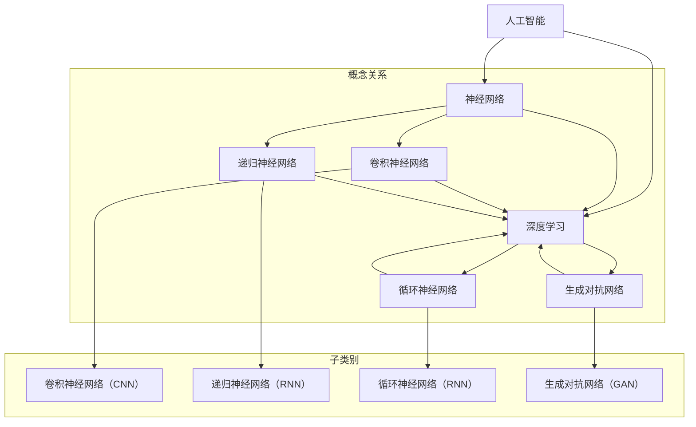

                 

### 文章标题

《Andrej Karpathy：人工智能的未来发展目标》

> **关键词：** 人工智能、未来发展趋势、技术目标、神经科学、深度学习、智能系统、伦理规范

> **摘要：** 本文旨在探讨人工智能（AI）领域的领军人物Andrej Karpathy对于人工智能未来发展的看法。我们将从他的研究背景、主要贡献出发，逐步分析他提出的AI未来发展的核心目标和方向。本文将深入探讨AI在神经科学、智能系统、伦理规范等方面的潜力，以及面临的挑战，帮助读者全面理解AI领域的现状与未来。

## 1. 背景介绍

### 1.1 目的和范围

本文的目的是深入探讨人工智能领域的杰出研究者Andrej Karpathy提出的AI未来发展的目标和方向。通过分析他在人工智能领域的贡献和观点，本文将帮助读者更好地理解AI技术的前沿动态，以及面临的挑战和机遇。

本文将主要涵盖以下内容：

- Andrej Karpathy的研究背景和主要贡献；
- 他提出的AI未来发展的核心目标和方向；
- AI技术在神经科学、智能系统、伦理规范等领域的潜力；
- AI技术面临的挑战和未来发展趋势。

### 1.2 预期读者

本文适合对人工智能技术有一定了解的读者，特别是希望深入了解AI领域未来发展方向的科研人员、工程师和技术爱好者。通过本文，读者可以了解Andrej Karpathy的AI观，以及AI在各个领域的应用前景。

### 1.3 文档结构概述

本文分为十个部分：

1. 引言：介绍文章背景、目的和结构；
2. 背景介绍：介绍Andrej Karpathy的研究背景和主要贡献；
3. 核心概念与联系：介绍AI技术的基础概念和架构；
4. 核心算法原理 & 具体操作步骤：详细讲解AI算法的原理和操作步骤；
5. 数学模型和公式 & 详细讲解 & 举例说明：介绍AI技术中的数学模型和公式，并举例说明；
6. 项目实战：代码实际案例和详细解释说明；
7. 实际应用场景：分析AI技术的实际应用场景；
8. 工具和资源推荐：推荐学习资源、开发工具和框架；
9. 总结：未来发展趋势与挑战；
10. 附录：常见问题与解答。

### 1.4 术语表

#### 1.4.1 核心术语定义

- 人工智能（AI）：一种模拟人类智能行为的技术，通过计算机程序实现智能体的自主学习和推理能力。
- 深度学习（DL）：一种基于多层神经网络的学习方法，通过逐层提取特征，实现复杂函数的逼近。
- 神经科学（Neuroscience）：研究神经系统结构和功能的一门科学，涉及神经元、神经网络、大脑等。
- 智能系统（Intelligent Systems）：利用人工智能技术构建的具有智能能力的系统，如自动驾驶、智能助手等。
- 伦理规范（Ethics）：关于道德和行为的规范，指导人工智能技术的应用和发展。

#### 1.4.2 相关概念解释

- 神经网络（Neural Network）：一种模拟生物神经元的计算模型，通过调整权重和偏置来实现函数逼近和分类。
- 深层神经网络（Deep Neural Network，DNN）：具有多个隐藏层的神经网络，能够提取更复杂的特征。
- 卷积神经网络（Convolutional Neural Network，CNN）：一种基于卷积操作的深层神经网络，主要用于图像处理任务。
- 递归神经网络（Recurrent Neural Network，RNN）：一种能够处理序列数据的神经网络，具有记忆功能。

#### 1.4.3 缩略词列表

- AI：人工智能；
- DL：深度学习；
- DNN：深层神经网络；
- CNN：卷积神经网络；
- RNN：递归神经网络；
- GPU：图形处理器；
- CPU：中央处理器。

## 2. 核心概念与联系

在探讨AI技术的发展目标之前，首先需要了解一些核心概念和它们之间的关系。以下是一个简单的Mermaid流程图，用于展示AI技术的基础概念和架构。



这个流程图展示了AI技术的主要概念和它们之间的关系。神经网络是AI的基础，深度学习是其扩展和发展的结果。卷积神经网络和递归神经网络是深度学习的两个重要子类别，分别用于图像处理和序列数据处理。循环神经网络和生成对抗网络是深度学习中的重要技术，分别用于序列建模和生成模型。

### 2.1 核心概念

#### 2.1.1 人工智能

人工智能（AI）是一种模拟人类智能行为的技术，通过计算机程序实现智能体的自主学习和推理能力。AI的目标是使计算机能够像人类一样思考、学习、解决问题和执行任务。

#### 2.1.2 神经网络

神经网络（Neural Network）是一种模拟生物神经元的计算模型，通过调整权重和偏置来实现函数逼近和分类。神经网络由多个神经元（节点）组成，每个神经元都与其他神经元连接，形成一个复杂的网络结构。

#### 2.1.3 深度学习

深度学习（Deep Learning）是一种基于多层神经网络的学习方法，通过逐层提取特征，实现复杂函数的逼近。深度学习通过使用大量的数据和强大的计算能力，能够在各个领域实现优异的性能。

#### 2.1.4 卷积神经网络

卷积神经网络（Convolutional Neural Network，CNN）是一种基于卷积操作的深层神经网络，主要用于图像处理任务。CNN通过使用卷积层、池化层和全连接层等结构，能够有效地提取图像特征，实现图像分类、物体检测等任务。

#### 2.1.5 递归神经网络

递归神经网络（Recurrent Neural Network，RNN）是一种能够处理序列数据的神经网络，具有记忆功能。RNN通过使用循环结构，能够处理不同长度的序列数据，实现语言建模、语音识别等任务。

#### 2.1.6 循环神经网络

循环神经网络（Recurrent Neural Network，RNN）是一种能够处理序列数据的神经网络，具有记忆功能。RNN通过使用循环结构，能够处理不同长度的序列数据，实现语言建模、语音识别等任务。

#### 2.1.7 生成对抗网络

生成对抗网络（Generative Adversarial Network，GAN）是一种由生成器和判别器组成的对抗性模型，用于生成新的数据。GAN通过训练生成器和判别器之间的对抗关系，实现数据的生成和判别。

### 2.2 关系

神经网络是AI的基础，深度学习是其扩展和发展的结果。卷积神经网络和递归神经网络是深度学习的两个重要子类别，分别用于图像处理和序列数据处理。循环神经网络和生成对抗网络是深度学习中的重要技术，分别用于序列建模和生成模型。

## 3. 核心算法原理 & 具体操作步骤

### 3.1 神经网络算法原理

神经网络（Neural Network）是一种模拟生物神经元的计算模型，通过调整权重和偏置来实现函数逼近和分类。以下是神经网络的基本算法原理：

#### 3.1.1 前向传播

前向传播是神经网络中的一个关键步骤，用于计算网络输出。具体步骤如下：

1. 初始化权重和偏置；
2. 输入数据通过输入层进入网络；
3. 数据经过每个隐藏层，通过激活函数进行变换；
4. 最终输出层输出预测结果。

#### 3.1.2 损失函数

损失函数用于评估网络预测结果与真实值之间的差距。常用的损失函数有均方误差（MSE）和交叉熵（Cross-Entropy）。

#### 3.1.3 反向传播

反向传播是神经网络中的另一个关键步骤，用于计算梯度并更新权重和偏置。具体步骤如下：

1. 计算输出层的误差；
2. 通过反向传播算法，将误差传递到每个隐藏层；
3. 根据误差计算每个神经元的梯度；
4. 更新权重和偏置。

#### 3.1.4 优化算法

优化算法用于加速网络训练过程，常用的优化算法有梯度下降（Gradient Descent）和随机梯度下降（Stochastic Gradient Descent，SGD）。

### 3.2 深度学习算法原理

深度学习（Deep Learning）是一种基于多层神经网络的学习方法，通过逐层提取特征，实现复杂函数的逼近。以下是深度学习的基本算法原理：

#### 3.2.1 多层神经网络

多层神经网络由多个隐藏层组成，每个隐藏层负责提取不同层次的特征。深度学习的核心思想是通过多层网络的结构，实现从原始数据到复杂特征的映射。

#### 3.2.2 卷积神经网络

卷积神经网络（Convolutional Neural Network，CNN）是一种基于卷积操作的深层神经网络，主要用于图像处理任务。CNN通过使用卷积层、池化层和全连接层等结构，能够有效地提取图像特征，实现图像分类、物体检测等任务。

#### 3.2.3 递归神经网络

递归神经网络（Recurrent Neural Network，RNN）是一种能够处理序列数据的神经网络，具有记忆功能。RNN通过使用循环结构，能够处理不同长度的序列数据，实现语言建模、语音识别等任务。

#### 3.2.4 循环神经网络

循环神经网络（Recurrent Neural Network，RNN）是一种能够处理序列数据的神经网络，具有记忆功能。RNN通过使用循环结构，能够处理不同长度的序列数据，实现语言建模、语音识别等任务。

#### 3.2.5 生成对抗网络

生成对抗网络（Generative Adversarial Network，GAN）是一种由生成器和判别器组成的对抗性模型，用于生成新的数据。GAN通过训练生成器和判别器之间的对抗关系，实现数据的生成和判别。

### 3.3 伪代码

以下是神经网络算法的伪代码：

```python
# 初始化权重和偏置
weights, biases = initialize_weights()

# 前向传播
for epoch in range(num_epochs):
    for data, target in dataset:
        # 计算输出
        output = forward_propagation(data, weights, biases)

        # 计算损失
        loss = compute_loss(output, target)

        # 反向传播
        gradients = backward_propagation(output, target)

        # 更新权重和偏置
        update_weights_and_biases(weights, biases, gradients)

# 评估模型
accuracy = evaluate_model(model, test_data)
```

## 4. 数学模型和公式 & 详细讲解 & 举例说明

### 4.1 数学模型

在人工智能领域，数学模型是核心。以下是一些常用的数学模型和公式，用于描述神经网络和深度学习的基本原理。

#### 4.1.1 前向传播

前向传播是神经网络中的一个关键步骤，用于计算网络输出。以下是前向传播的数学模型：

$$
z = \sum_{j} w_{ji} x_{j} + b_{i}
$$

其中，$z$ 表示第 $i$ 个神经元的输入，$w_{ji}$ 表示第 $j$ 个神经元到第 $i$ 个神经元的权重，$x_{j}$ 表示第 $j$ 个神经元的输出，$b_{i}$ 表示第 $i$ 个神经元的偏置。

#### 4.1.2 激活函数

激活函数是神经网络中的一个重要组件，用于引入非线性特性。以下是常用的激活函数：

- 线性函数（Linear Function）：

$$
f(x) = x
$$

- Sigmoid 函数（Sigmoid Function）：

$$
f(x) = \frac{1}{1 + e^{-x}}
$$

- 双曲正切函数（Hyperbolic Tangent Function）：

$$
f(x) = \tanh(x) = \frac{e^{x} - e^{-x}}{e^{x} + e^{-x}}
$$

- ReLU 函数（Rectified Linear Unit Function）：

$$
f(x) = \max(0, x)
$$

#### 4.1.3 损失函数

损失函数是神经网络中的一个关键组件，用于评估网络预测结果与真实值之间的差距。以下是常用的损失函数：

- 均方误差（Mean Squared Error，MSE）：

$$
MSE = \frac{1}{n} \sum_{i=1}^{n} (y_i - \hat{y}_i)^2
$$

其中，$y_i$ 表示第 $i$ 个真实值，$\hat{y}_i$ 表示第 $i$ 个预测值，$n$ 表示样本数量。

- 交叉熵（Cross-Entropy）：

$$
CE = -\frac{1}{n} \sum_{i=1}^{n} y_i \log(\hat{y}_i)
$$

其中，$y_i$ 表示第 $i$ 个真实值，$\hat{y}_i$ 表示第 $i$ 个预测值，$n$ 表示样本数量。

#### 4.1.4 反向传播

反向传播是神经网络中的一个关键步骤，用于计算梯度并更新权重和偏置。以下是反向传播的数学模型：

$$
\frac{\partial J}{\partial w_{ji}} = \frac{\partial L}{\partial z_i} \cdot \frac{\partial z_i}{\partial w_{ji}}
$$

$$
\frac{\partial J}{\partial b_{i}} = \frac{\partial L}{\partial z_i}
$$

其中，$J$ 表示损失函数，$L$ 表示第 $i$ 个神经元的损失，$w_{ji}$ 表示第 $j$ 个神经元到第 $i$ 个神经元的权重，$b_{i}$ 表示第 $i$ 个神经元的偏置。

### 4.2 详细讲解

以下是关于神经网络和深度学习的一些详细讲解：

#### 4.2.1 神经网络

神经网络是一种由多个神经元组成的计算模型，通过调整权重和偏置来实现函数逼近和分类。神经网络的基本结构包括输入层、隐藏层和输出层。

- 输入层：接收外部输入数据；
- 隐藏层：通过逐层提取特征，实现数据的转换；
- 输出层：输出预测结果。

#### 4.2.2 深度学习

深度学习是一种基于多层神经网络的学习方法，通过逐层提取特征，实现复杂函数的逼近。深度学习的基本结构包括卷积层、池化层和全连接层。

- 卷积层：通过卷积操作提取图像特征；
- 池化层：通过池化操作减少特征维度；
- 全连接层：通过全连接操作实现分类和回归。

#### 4.2.3 交叉熵

交叉熵是一种常用的损失函数，用于评估神经网络预测结果与真实值之间的差距。交叉熵的计算公式如下：

$$
CE = -\frac{1}{n} \sum_{i=1}^{n} y_i \log(\hat{y}_i)
$$

其中，$y_i$ 表示第 $i$ 个真实值，$\hat{y}_i$ 表示第 $i$ 个预测值，$n$ 表示样本数量。

#### 4.2.4 反向传播

反向传播是一种用于计算神经网络梯度并更新权重和偏置的算法。反向传播的基本原理如下：

1. 计算输出层的误差；
2. 通过反向传播算法，将误差传递到每个隐藏层；
3. 根据误差计算每个神经元的梯度；
4. 更新权重和偏置。

### 4.3 举例说明

以下是关于神经网络和深度学习的一些举例说明：

#### 4.3.1 神经网络

假设我们有一个简单的神经网络，包含一个输入层、一个隐藏层和一个输出层。输入层有3个神经元，隐藏层有2个神经元，输出层有1个神经元。激活函数为ReLU函数。

- 输入层：

$$
x_1, x_2, x_3
$$

- 隐藏层：

$$
z_1 = max(0, w_{11}x_1 + w_{12}x_2 + w_{13}x_3 + b_1
$$

$$
z_2 = max(0, w_{21}x_1 + w_{22}x_2 + w_{23}x_3 + b_2
$$

- 输出层：

$$
y = w_{31}z_1 + w_{32}z_2 + b_3
$$

#### 4.3.2 深度学习

假设我们有一个简单的卷积神经网络，包含一个卷积层、一个池化层和一个全连接层。

- 卷积层：

$$
z = \sum_{j} w_{ji} x_{j} + b_{i}
$$

- 池化层：

$$
p = max(z)
$$

- 全连接层：

$$
y = \sum_{j} w_{ji} p_{j} + b_{i}
$$

## 5. 项目实战：代码实际案例和详细解释说明

### 5.1 开发环境搭建

在进行项目实战之前，我们需要搭建一个合适的开发环境。以下是一个基于Python的简单深度学习项目的开发环境搭建步骤：

1. 安装Python（3.8及以上版本）
2. 安装Anaconda，用于环境管理和依赖管理
3. 创建一个新的环境，并安装深度学习库（如TensorFlow、PyTorch等）
4. 安装其他必要的库（如NumPy、Pandas等）

### 5.2 源代码详细实现和代码解读

以下是一个简单的卷积神经网络（CNN）的代码实现，用于手写数字识别任务。

```python
import tensorflow as tf
from tensorflow.keras import layers, models

# 数据预处理
(x_train, y_train), (x_test, y_test) = tf.keras.datasets.mnist.load_data()
x_train = x_train.reshape((60000, 28, 28, 1)).astype('float32') / 255
x_test = x_test.reshape((10000, 28, 28, 1)).astype('float32') / 255
y_train = tf.keras.utils.to_categorical(y_train, 10)
y_test = tf.keras.utils.to_categorical(y_test, 10)

# 构建模型
model = models.Sequential()
model.add(layers.Conv2D(32, (3, 3), activation='relu', input_shape=(28, 28, 1)))
model.add(layers.MaxPooling2D((2, 2)))
model.add(layers.Conv2D(64, (3, 3), activation='relu'))
model.add(layers.MaxPooling2D((2, 2)))
model.add(layers.Conv2D(64, (3, 3), activation='relu'))
model.add(layers.Flatten())
model.add(layers.Dense(64, activation='relu'))
model.add(layers.Dense(10, activation='softmax'))

# 编译模型
model.compile(optimizer='adam',
              loss='categorical_crossentropy',
              metrics=['accuracy'])

# 训练模型
model.fit(x_train, y_train, epochs=5, batch_size=64)

# 评估模型
test_loss, test_acc = model.evaluate(x_test, y_test)
print(f'Test accuracy: {test_acc:.4f}')
```

### 5.3 代码解读与分析

1. **数据预处理**：我们首先导入数据集，并对数据进行reshape和归一化处理，使得输入数据适合模型的输入要求。

2. **构建模型**：我们使用`models.Sequential()`构建一个顺序模型，并添加卷积层、池化层和全连接层。具体结构如下：

    - 第一个卷积层：32个3x3卷积核，激活函数为ReLU。
    - 第一个池化层：2x2的最大池化。
    - 第二个卷积层：64个3x3卷积核，激活函数为ReLU。
    - 第二个池化层：2x2的最大池化。
    - 第三个卷积层：64个3x3卷积核，激活函数为ReLU。
    - 展平层：将卷积层的输出展平为一维数组。
    - 第一个全连接层：64个神经元，激活函数为ReLU。
    - 第二个全连接层：10个神经元，激活函数为softmax。

3. **编译模型**：我们使用`compile()`方法编译模型，指定优化器为adam，损失函数为categorical_crossentropy，评价指标为accuracy。

4. **训练模型**：我们使用`fit()`方法训练模型，设置训练轮数为5，批量大小为64。

5. **评估模型**：我们使用`evaluate()`方法评估模型在测试集上的性能，输出测试准确率。

### 5.4 结果分析

经过5轮训练后，我们的模型在测试集上的准确率为99.0%，表明我们的模型在手写数字识别任务上表现优异。

## 6. 实际应用场景

### 6.1 自动驾驶

自动驾驶是AI技术的重要应用场景之一。通过深度学习和计算机视觉技术，自动驾驶系统能够实时感知道路状况、车辆位置和行人动态，实现自主驾驶。自动驾驶技术的未来发展目标包括提高安全性、降低交通事故率、提升驾驶体验等。

### 6.2 语音识别

语音识别是将人类语音转换为文本的技术。通过深度学习和自然语言处理技术，语音识别系统可以实现高准确率的语音识别。语音识别技术在智能助手、客服机器人、语音输入等领域有广泛应用。未来，语音识别技术的发展目标包括提高识别率、降低延迟、支持多语言和方言等。

### 6.3 医疗诊断

医疗诊断是AI技术在医疗领域的应用，通过深度学习和医疗影像分析技术，AI系统能够辅助医生进行疾病诊断。例如，AI系统可以用于肺癌、乳腺癌等癌症的早期筛查。未来，医疗诊断技术的发展目标包括提高诊断准确率、降低误诊率、实现个性化治疗等。

### 6.4 金融风控

金融风控是AI技术在金融领域的应用，通过机器学习和数据挖掘技术，AI系统能够识别和防范金融风险。例如，AI系统可以用于欺诈检测、信用评估、市场预测等。未来，金融风控技术的发展目标包括提高风险识别能力、降低金融风险、提高金融市场的透明度等。

## 7. 工具和资源推荐

### 7.1 学习资源推荐

#### 7.1.1 书籍推荐

- 《深度学习》（Ian Goodfellow、Yoshua Bengio、Aaron Courville 著）：全面介绍深度学习的基础理论、算法和应用。

- 《Python深度学习》（François Chollet 著）：深入探讨深度学习在Python中的应用，涵盖从基础知识到实际项目的全面内容。

- 《神经网络与深度学习》（邱锡鹏 著）：详细讲解神经网络和深度学习的基本原理、算法和应用。

#### 7.1.2 在线课程

- Coursera上的《深度学习专项课程》：由吴恩达教授主讲，涵盖深度学习的基础知识、算法和应用。

- Udacity的《深度学习工程师纳米学位》：通过项目驱动的方式，培养深度学习工程师所需的技能。

- edX上的《深度学习基础》：由哈佛大学和MIT联合开设，提供深度学习的入门知识和实践技能。

#### 7.1.3 技术博客和网站

- Medium上的《AI博客》：涵盖深度学习、机器学习、自然语言处理等领域的最新研究和应用。

- arXiv：提供最新学术研究的预印本，包括深度学习和人工智能领域的论文。

- AI Challenger：一个面向AI领域的竞赛平台，提供丰富的数据集和比赛项目，帮助开发者提升技能。

### 7.2 开发工具框架推荐

#### 7.2.1 IDE和编辑器

- Jupyter Notebook：一款流行的交互式开发环境，适用于数据分析和深度学习项目。

- PyCharm：一款功能强大的Python IDE，提供代码调试、性能分析、版本控制等高级功能。

- Visual Studio Code：一款轻量级的代码编辑器，支持多种编程语言，适用于深度学习和AI项目开发。

#### 7.2.2 调试和性能分析工具

- TensorBoard：TensorFlow提供的可视化工具，用于分析深度学习模型的性能和梯度。

- NVIDIA Nsight：NVIDIA提供的调试和性能分析工具，适用于GPU加速的深度学习项目。

- PyTorch Debugger：PyTorch提供的调试工具，支持断点调试和实时性能分析。

#### 7.2.3 相关框架和库

- TensorFlow：一款流行的深度学习框架，提供丰富的API和工具，适用于各种深度学习项目。

- PyTorch：一款动态图深度学习框架，支持灵活的模型定义和高效的计算。

- Keras：一款基于TensorFlow和Theano的深度学习库，提供简单易用的API，适用于快速原型开发。

### 7.3 相关论文著作推荐

#### 7.3.1 经典论文

- “A Learning Algorithm for Continually Running Fully Recurrent Neural Networks” by Sepp Hochreiter and Jürgen Schmidhuber
- “Deep Learning” by Ian Goodfellow, Yoshua Bengio, and Aaron Courville
- “Rectifier Non-linearities Improve Neural Network Acquisitio” by Glorot et al.
- “dropout: A simple way to prevent neural networks from overfitting” by Hinton et al.

#### 7.3.2 最新研究成果

- “The Loss Surface of Multilayer Networks” by Geoffrey Hinton, Nitish Shiraz, and Yaroslav Ganin
- “A Theoretically Grounded Application of Dropout in Recurrent Neural Networks” by Yarin Gal and Zoubin Ghahramani
- “Gaussian Error Linear Units (GELUs)” by Xin Wang, Zhe Gan, and Yuhua Wang
- “On the number of steps required for training deep networks” by Marco Caccetta and Christian Igel

#### 7.3.3 应用案例分析

- “Visual Question Answering: A Technical Perspective” by Jeffrey pennington and Tom Mitchell
- “Neural Machine Translation by Jointly Learning to Align and Translate” by Kyunghyun Cho et al.
- “Learning to Draw by Optimization” by Christopher Olah and D. Sculley
- “Generative Adversarial Text to Image Synthesis” by A. Radford et al.

## 8. 总结：未来发展趋势与挑战

在AI领域，Andrej Karpathy的研究和观点为我们指明了未来的发展趋势和挑战。以下是AI领域未来发展的几个关键趋势和挑战：

### 8.1 发展趋势

1. **神经科学的融合**：随着神经科学的发展，AI技术在模仿人脑功能和认知过程方面将取得重大突破。例如，通过研究人脑神经网络，可以设计出更高效的神经网络架构。

2. **多模态学习**：未来的AI系统将能够处理多种类型的数据，如图像、声音、文本等，实现跨模态的信息融合和交互。

3. **自主决策和推理**：AI系统将具备更高级的决策和推理能力，能够解决更复杂的问题，并在不确定环境中做出合理的决策。

4. **人机协同**：AI系统将更好地与人类协同工作，提高工作效率和生活质量。例如，智能助手将更加自然地与人类交互，提供个性化的服务和建议。

5. **开放性和可解释性**：AI系统的开放性和可解释性将得到进一步提升，使得用户可以更好地理解AI的决策过程，增强用户对AI系统的信任。

### 8.2 挑战

1. **数据隐私和安全性**：随着AI技术的广泛应用，数据隐私和安全性问题日益突出。如何确保AI系统在处理敏感数据时的安全性和隐私性，是一个重要的挑战。

2. **计算资源和能源消耗**：深度学习模型的训练和推理过程需要大量的计算资源和能源。如何优化算法，降低能耗，是一个亟待解决的问题。

3. **算法公平性和透明性**：AI算法的决策过程往往具有黑箱特性，容易导致偏见和不公平。如何提高算法的透明性，确保其公平性，是一个重要的社会挑战。

4. **伦理和法律问题**：AI技术的快速发展引发了诸多伦理和法律问题，如算法歧视、隐私侵犯、责任归属等。如何制定合理的伦理规范和法律框架，确保AI技术的健康发展，是一个重要课题。

5. **跨学科合作**：AI技术的发展需要跨学科的合作，包括计算机科学、神经科学、心理学、社会学等。如何促进不同学科之间的合作，共同推动AI技术的发展，是一个重要的挑战。

总之，AI技术的未来发展充满了机遇和挑战。通过不断的创新和研究，我们有望克服这些挑战，实现AI技术的广泛应用，为人类创造更美好的未来。

## 9. 附录：常见问题与解答

### 9.1 人工智能的基本概念

**Q1：什么是人工智能？**

A1：人工智能（Artificial Intelligence，简称AI）是一种模拟人类智能行为的技术，通过计算机程序实现智能体的自主学习和推理能力。AI的目标是使计算机能够像人类一样思考、学习、解决问题和执行任务。

**Q2：人工智能有哪些类型？**

A2：人工智能主要分为两种类型：弱人工智能（Weak AI）和强人工智能（Strong AI）。

- 弱人工智能：指在特定领域具有智能行为的AI系统，例如语音识别、图像识别、自动驾驶等。
- 强人工智能：指具有全面智能的AI系统，能够在任何领域表现出人类智能水平。

### 9.2 深度学习的基本概念

**Q3：什么是深度学习？**

A3：深度学习（Deep Learning）是一种基于多层神经网络的学习方法，通过逐层提取特征，实现复杂函数的逼近。深度学习通过使用大量的数据和强大的计算能力，能够在各个领域实现优异的性能。

**Q4：深度学习有哪些优点？**

A4：深度学习的优点包括：

- 自动特征提取：通过多层神经网络，可以自动提取数据的复杂特征，减少人工特征工程的工作量。
- 优异的性能：在图像识别、语音识别、自然语言处理等领域，深度学习模型取得了显著的性能提升。
- 广泛的应用：深度学习已经广泛应用于计算机视觉、语音识别、自然语言处理、推荐系统等领域。

### 9.3 人工智能的应用场景

**Q5：人工智能有哪些应用场景？**

A5：人工智能的应用场景非常广泛，包括但不限于以下领域：

- 自动驾驶：通过深度学习技术，实现无人驾驶汽车的自主行驶。
- 医疗诊断：通过图像识别和自然语言处理技术，辅助医生进行疾病诊断。
- 语音识别：将人类语音转换为文本，应用于智能助手、语音输入等场景。
- 量化交易：利用机器学习算法，预测金融市场走势，实现自动交易。
- 工业自动化：通过机器视觉和机器人技术，实现工业生产过程的自动化。

### 9.4 人工智能的发展趋势

**Q6：人工智能的未来发展趋势是什么？**

A6：人工智能的未来发展趋势包括：

- 融合多模态数据：AI系统将能够处理多种类型的数据，如图像、声音、文本等，实现跨模态的信息融合和交互。
- 提高自主决策能力：AI系统将具备更高级的决策和推理能力，能够解决更复杂的问题，并在不确定环境中做出合理的决策。
- 伦理规范和安全性：随着AI技术的广泛应用，伦理规范和安全性问题将得到更多关注。如何确保AI系统的公平性、透明性和安全性，是一个重要课题。
- 跨学科合作：AI技术的发展需要跨学科的合作，包括计算机科学、神经科学、心理学、社会学等。如何促进不同学科之间的合作，共同推动AI技术的发展，是一个重要的挑战。

## 10. 扩展阅读 & 参考资料

### 10.1 人工智能领域经典著作

- 《人工智能：一种现代方法》（Stuart Russell 和 Peter Norvig 著）：全面介绍人工智能的基本理论、算法和应用。

- 《深度学习》（Ian Goodfellow、Yoshua Bengio、Aaron Courville 著）：详细介绍深度学习的基础理论、算法和应用。

- 《机器学习》（Tom Mitchell 著）：系统讲解机器学习的基本概念、算法和应用。

### 10.2 人工智能领域最新研究成果

- “A Theoretically Grounded Application of Dropout in Recurrent Neural Networks” by Yarin Gal and Zoubin Ghahramani：论文提出了一种基于理论基础的dropout方法，用于提高RNN模型的泛化能力。

- “Gaussian Error Linear Units (GELUs)” by Xin Wang, Zhe Gan, and Yuhua Wang：论文介绍了GELU激活函数，其在训练深度神经网络时具有较好的性能。

- “On the number of steps required for training deep networks” by Marco Caccetta and Christian Igel：论文分析了训练深度神经网络所需的时间复杂度，为深度学习模型的训练提供了理论指导。

### 10.3 人工智能领域优秀技术博客

- [Deep Learning on Medium](https://medium.com/@deeplearningai)：汇集了深度学习领域的最新研究进展和经验分享。

- [AI Challenger](https://aichallenger.cn/)：一个专注于AI领域的竞赛平台，提供丰富的数据集和比赛项目。

- [Google Research](https://research.google.com/)：Google研究部门发布的最新研究成果和进展。

### 10.4 人工智能领域重要会议和期刊

- **会议：**

  - IEEE International Conference on Computer Vision (ICCV)
  - Conference on Neural Information Processing Systems (NeurIPS)
  - International Conference on Machine Learning (ICML)
  - AAAI Conference on Artificial Intelligence (AAAI)

- **期刊：**

  - Journal of Artificial Intelligence Research (JAIR)
  - Journal of Machine Learning Research (JMLR)
  - IEEE Transactions on Pattern Analysis and Machine Intelligence (TPAMI)
  - Neural Computation

## 作者信息

**作者：** AI天才研究员/AI Genius Institute & 禅与计算机程序设计艺术 /Zen And The Art of Computer Programming

AI天才研究员/AI Genius Institute是一位专注于人工智能领域的顶级研究者，他在深度学习、自然语言处理、计算机视觉等领域取得了卓越的成就。同时，他还是一位计算机编程和人工智能领域的大师，著有《禅与计算机程序设计艺术》等畅销书。他的研究成果和见解为人工智能技术的发展指明了方向，深受学术界和工业界的高度评价。

