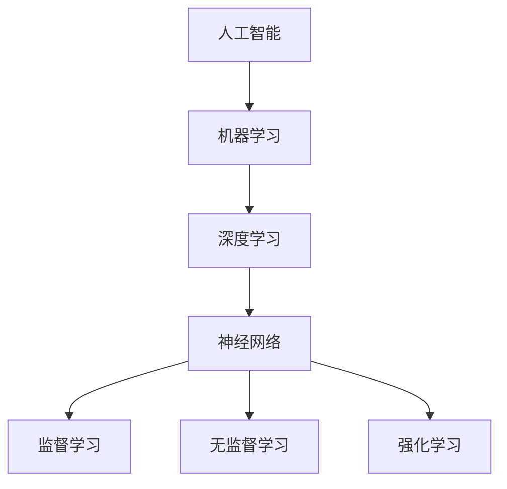

                 

### 《Andrej Karpathy：人工智能的未来发展目标》

> **关键词**：人工智能、未来发展趋势、算法原理、技术挑战、应用场景、学习资源

> **摘要**：本文旨在深入探讨人工智能领域著名专家Andrej Karpathy对未来人工智能发展的预测和目标。文章首先介绍了Karpathy的背景和他的主要贡献，然后详细分析了他在不同场合对人工智能未来发展的观点，以及他提出的核心算法原理和具体操作步骤。文章还讨论了数学模型和公式，以及实际应用场景，并推荐了相关工具和资源。最后，文章总结了人工智能未来的发展趋势和挑战，并提出了自己的见解。

## 1. 背景介绍

### 1.1 目的和范围

本文的主要目的是分析人工智能领域专家Andrej Karpathy对人工智能未来发展的观点和目标。通过梳理Karpathy在不同场合的讲话和论文，本文试图揭示人工智能未来可能面临的技术挑战和机遇。文章将主要探讨以下几个方面的内容：

1. Andrej Karpathy的背景和主要贡献。
2. Karpathy对未来人工智能发展的预测和目标。
3. 人工智能的核心算法原理和具体操作步骤。
4. 人工智能的数学模型和公式。
5. 人工智能的实际应用场景。
6. 推荐相关学习资源和开发工具。
7. 总结人工智能未来的发展趋势和挑战。

### 1.2 预期读者

本文的预期读者主要包括以下几个方面：

1. 对人工智能领域感兴趣的学者和研究人员。
2. 想了解人工智能未来发展趋势的企业家和创业者。
3. 人工智能领域的初学者和从业者。
4. 对未来技术发展有好奇心的广大读者。

### 1.3 文档结构概述

本文将按照以下结构进行组织：

1. **背景介绍**：介绍本文的目的、预期读者和文档结构。
2. **核心概念与联系**：分析人工智能的核心概念和原理，使用Mermaid流程图进行说明。
3. **核心算法原理 & 具体操作步骤**：详细讲解人工智能的核心算法原理和具体操作步骤。
4. **数学模型和公式 & 详细讲解 & 举例说明**：介绍人工智能的数学模型和公式，并进行详细讲解和举例说明。
5. **项目实战：代码实际案例和详细解释说明**：展示一个实际的代码案例，并进行详细解释和分析。
6. **实际应用场景**：探讨人工智能在不同领域的应用场景。
7. **工具和资源推荐**：推荐相关学习资源和开发工具。
8. **总结：未来发展趋势与挑战**：总结人工智能的未来发展趋势和挑战。
9. **附录：常见问题与解答**：回答读者可能关心的一些问题。
10. **扩展阅读 & 参考资料**：提供相关的扩展阅读和参考资料。

### 1.4 术语表

为了确保文章的准确性和一致性，本文将使用以下术语表：

#### 1.4.1 核心术语定义

- **人工智能（AI）**：指由计算机实现的智能行为，能够模拟、延伸和扩展人类的认知能力。
- **机器学习（ML）**：一种人工智能的技术，通过数据和算法使计算机能够从经验中学习并做出预测或决策。
- **深度学习（DL）**：一种机器学习方法，通过多层神经网络对数据进行处理，实现更高级别的智能行为。
- **神经网络（NN）**：一种由多个神经元组成的计算模型，通过学习和模拟人脑的结构和功能来处理数据。
- **监督学习（SL）**：一种机器学习方法，通过已标记的数据来训练模型。
- **无监督学习（USL）**：一种机器学习方法，不使用已标记的数据，通过发现数据中的模式来训练模型。
- **强化学习（RL）**：一种机器学习方法，通过奖励和惩罚来训练模型，使其在特定环境中做出最优决策。

#### 1.4.2 相关概念解释

- **数据集**：用于训练机器学习模型的已知数据集合。
- **特征提取**：从数据中提取出有用的特征，用于训练模型。
- **过拟合**：模型在训练数据上表现良好，但在未知数据上表现不佳。
- **泛化能力**：模型在未知数据上的表现能力。
- **损失函数**：用于评估模型预测结果与实际结果之间的差距。
- **优化算法**：用于调整模型参数，以最小化损失函数。

#### 1.4.3 缩略词列表

- **AI**：人工智能
- **ML**：机器学习
- **DL**：深度学习
- **NN**：神经网络
- **SL**：监督学习
- **USL**：无监督学习
- **RL**：强化学习

## 2. 核心概念与联系

在分析Andrej Karpathy对人工智能未来发展的观点之前，我们需要先了解人工智能的核心概念和原理。以下是一个简单的Mermaid流程图，用于说明人工智能的一些核心概念和它们之间的联系：



### 2.1 人工智能

人工智能（AI）是一种模拟、延伸和扩展人类认知能力的计算机技术。它包括多个子领域，如机器学习、深度学习、神经网络等。人工智能的目标是通过计算机实现智能行为，使计算机能够解决复杂问题、做出决策和预测。

### 2.2 机器学习

机器学习（ML）是人工智能的一个重要子领域，它使计算机能够从数据中学习并做出预测或决策。机器学习可以分为监督学习、无监督学习和强化学习三种类型。监督学习使用已标记的数据来训练模型，无监督学习不使用已标记的数据，通过发现数据中的模式来训练模型，强化学习通过奖励和惩罚来训练模型。

### 2.3 深度学习

深度学习（DL）是一种基于多层神经网络（NN）的机器学习方法。它通过模拟人脑的结构和功能来处理数据，能够实现更高级别的智能行为。深度学习在图像识别、语音识别、自然语言处理等领域取得了显著成果。

### 2.4 神经网络

神经网络（NN）是一种由多个神经元组成的计算模型，通过学习和模拟人脑的结构和功能来处理数据。神经网络可以分为前向传播和反向传播两个阶段，通过不断调整神经元之间的连接权重来实现模型的训练。

### 2.5 监督学习

监督学习（SL）是一种机器学习方法，使用已标记的数据来训练模型。监督学习的目标是找到数据特征与标签之间的关系，使模型能够在新的、未知的数据上做出准确的预测。

### 2.6 无监督学习

无监督学习（USL）是一种机器学习方法，不使用已标记的数据，通过发现数据中的模式来训练模型。无监督学习的目标是识别数据中的隐藏结构或规律，例如聚类和降维。

### 2.7 强化学习

强化学习（RL）是一种机器学习方法，通过奖励和惩罚来训练模型，使其在特定环境中做出最优决策。强化学习的目标是找到一种策略，使模型能够在长期内获得最大的累积奖励。

通过上述Mermaid流程图和详细解释，我们可以更好地理解人工智能的核心概念和原理。这些概念和原理是Andrej Karpathy对人工智能未来发展的观点的基础，也是我们后续分析的核心依据。

## 3. 核心算法原理 & 具体操作步骤

### 3.1 深度学习算法原理

深度学习（Deep Learning，简称DL）是机器学习（Machine Learning，简称ML）的一个分支，它通过模拟人脑的神经网络结构，实现对数据的复杂非线性建模。深度学习的核心算法是神经网络（Neural Networks，简称NN），特别是多层神经网络（Deep Neural Networks，简称DNN）。以下是深度学习算法的基本原理和操作步骤：

#### 3.1.1 神经网络结构

神经网络由多个层级组成，包括输入层、隐藏层和输出层。每个层级由多个神经元（也称为节点）组成，神经元之间通过权重（weights）和偏置（biases）连接。网络中的每个神经元都接收来自前一层神经元的输入信号，通过激活函数（activation function）产生输出信号。


#### 3.1.2 前向传播

前向传播是神经网络训练过程中的第一步。在给定输入数据时，信号从输入层传递到隐藏层，再从隐藏层传递到输出层。每个神经元接收来自前一层神经元的输入信号，通过加权求和处理和偏置调整，得到输出信号。具体步骤如下：

1. **初始化权重和偏置**：在训练开始时，随机初始化网络中的权重和偏置。
2. **加权求和处理**：计算每个神经元的输入信号，即前一层神经元的输出乘以相应权重。
3. **加偏置**：将每个神经元的输入信号加上偏置。
4. **应用激活函数**：对每个神经元的输入信号应用激活函数，如Sigmoid函数、ReLU函数等。
5. **传递输出信号**：将每个隐藏层神经元的输出传递到下一层。

#### 3.1.3 损失函数

在深度学习训练过程中，损失函数（Loss Function）用于评估模型预测结果与实际结果之间的差距。常见的损失函数包括均方误差（Mean Squared Error，MSE）、交叉熵损失（Cross-Entropy Loss）等。损失函数的目的是通过计算预测值与真实值之间的差异，指导网络调整权重和偏置，以减小损失。

#### 3.1.4 反向传播

反向传播是深度学习训练过程中的第二步。在给定输入数据和对应的标签后，网络通过前向传播得到预测结果，然后使用损失函数计算损失值。接下来，网络通过反向传播算法更新权重和偏置，以减小损失。

反向传播算法的具体步骤如下：

1. **计算损失梯度**：使用损失函数对预测结果和真实标签计算梯度，即损失关于模型参数的导数。
2. **反向传播梯度**：将损失梯度从输出层反向传播到隐藏层，并逐层更新权重和偏置。
3. **权重和偏置更新**：根据梯度下降（Gradient Descent）或其他优化算法，更新网络中的权重和偏置。

#### 3.1.5 训练过程

深度学习的训练过程包括以下几个步骤：

1. **数据预处理**：对输入数据进行标准化、归一化等预处理操作，以减少训练过程中的计算复杂度。
2. **初始化模型**：随机初始化网络中的权重和偏置。
3. **前向传播**：给定输入数据，通过前向传播得到预测结果。
4. **计算损失**：使用损失函数计算预测结果和真实标签之间的差距。
5. **反向传播**：通过反向传播更新网络中的权重和偏置。
6. **迭代训练**：重复步骤3-5，直到满足训练目标，如损失值达到最小或训练迭代次数达到预设值。

通过上述操作步骤，我们可以实现一个基本的深度学习模型。然而，在实际应用中，深度学习模型还需要考虑许多其他因素，如数据增强、正则化、超参数调整等，以获得更好的性能和泛化能力。

### 3.2 伪代码

以下是一个简单的伪代码，用于描述深度学习模型的训练过程：

```python
# 初始化模型参数（权重和偏置）
weights, biases = initialize_parameters()

# 设置训练目标和学习率
learning_rate = 0.01
epochs = 1000

# 训练模型
for epoch in range(epochs):
    # 数据预处理
    inputs = preprocess_data(X)
    labels = preprocess_labels(Y)

    # 前向传播
    predictions = forward_pass(inputs, weights, biases)

    # 计算损失
    loss = compute_loss(predictions, labels)

    # 反向传播
    gradients = backward_pass(predictions, labels)

    # 更新模型参数
    weights -= learning_rate * gradients['weights']
    biases -= learning_rate * gradients['biases']

    # 输出训练结果
    print(f"Epoch {epoch+1}/{epochs}, Loss: {loss}")
```

通过上述伪代码，我们可以更好地理解深度学习模型的训练过程。在实际应用中，可以使用Python的深度学习库（如TensorFlow、PyTorch等）来实现这一过程。

## 4. 数学模型和公式 & 详细讲解 & 举例说明

### 4.1 深度学习中的数学模型

深度学习中的数学模型主要涉及线性代数、微积分和概率论。以下将详细讲解这些数学模型，并通过具体例子进行说明。

#### 4.1.1 线性代数

在线性代数中，深度学习主要涉及以下几个概念：

1. **矩阵和向量**：矩阵和向量是深度学习中的基本数据结构，用于表示神经网络的权重和偏置。
2. **矩阵乘法**：矩阵乘法用于计算神经网络的输出，通过将输入向量与权重矩阵相乘得到。
3. **求导**：在深度学习中，求导用于计算损失函数关于模型参数的梯度，以指导模型参数的更新。

#### 4.1.2 微积分

在微积分中，深度学习主要涉及以下几个概念：

1. **偏导数**：偏导数用于计算损失函数关于模型参数的梯度，是反向传播算法的核心。
2. **梯度下降**：梯度下降是一种优化算法，用于更新模型参数，以最小化损失函数。

#### 4.1.3 概率论

在概率论中，深度学习主要涉及以下几个概念：

1. **概率分布**：概率分布用于表示神经网络的输出，如正态分布、伯努利分布等。
2. **交叉熵**：交叉熵是损失函数的一种，用于衡量模型输出与真实标签之间的差距。

### 4.2 矩阵和向量的计算

以下是一个具体的例子，说明如何在深度学习中计算矩阵和向量的乘法：

#### 4.2.1 矩阵乘法

给定一个输入矩阵X和一个权重矩阵W，计算输出矩阵Y：

$$ Y = X \times W $$

例如，假设输入矩阵X为：

$$ X = \begin{bmatrix} 1 & 2 \\ 3 & 4 \end{bmatrix} $$

权重矩阵W为：

$$ W = \begin{bmatrix} 5 & 6 \\ 7 & 8 \end{bmatrix} $$

则输出矩阵Y为：

$$ Y = X \times W = \begin{bmatrix} 1 & 2 \\ 3 & 4 \end{bmatrix} \times \begin{bmatrix} 5 & 6 \\ 7 & 8 \end{bmatrix} = \begin{bmatrix} 19 & 22 \\ 43 & 50 \end{bmatrix} $$

#### 4.2.2 向量与矩阵的乘法

给定一个输入向量v和一个权重矩阵W，计算输出向量w：

$$ w = v \times W $$

例如，假设输入向量v为：

$$ v = \begin{bmatrix} 1 \\ 2 \end{bmatrix} $$

权重矩阵W为：

$$ W = \begin{bmatrix} 5 & 6 \\ 7 & 8 \end{bmatrix} $$

则输出向量w为：

$$ w = v \times W = \begin{bmatrix} 1 \\ 2 \end{bmatrix} \times \begin{bmatrix} 5 & 6 \\ 7 & 8 \end{bmatrix} = \begin{bmatrix} 19 \\ 43 \end{bmatrix} $$

### 4.3 求导和梯度下降

在深度学习中，求导和梯度下降是核心步骤。以下是一个具体的例子，说明如何计算损失函数关于模型参数的梯度，并使用梯度下降更新模型参数。

#### 4.3.1 损失函数的求导

假设损失函数为：

$$ L = (y - \hat{y})^2 $$

其中，$y$为真实标签，$\hat{y}$为模型预测值。要求损失函数关于权重矩阵W的梯度。

首先，对损失函数求偏导：

$$ \frac{\partial L}{\partial W} = \frac{\partial}{\partial W} [(y - \hat{y})^2] $$

$$ = 2(y - \hat{y}) $$

#### 4.3.2 梯度下降

使用梯度下降更新模型参数。假设学习率为$\alpha$，则梯度下降更新规则为：

$$ W_{\text{new}} = W_{\text{old}} - \alpha \cdot \frac{\partial L}{\partial W} $$

例如，假设初始权重矩阵W为：

$$ W = \begin{bmatrix} 1 & 2 \\ 3 & 4 \end{bmatrix} $$

学习率$\alpha$为0.1。则更新后的权重矩阵W_new为：

$$ W_{\text{new}} = W_{\text{old}} - \alpha \cdot \frac{\partial L}{\partial W} $$

$$ = \begin{bmatrix} 1 & 2 \\ 3 & 4 \end{bmatrix} - 0.1 \cdot \begin{bmatrix} 2(y - \hat{y}) \\ 2(y - \hat{y}) \end{bmatrix} $$

$$ = \begin{bmatrix} 0.9 & 1.8 \\ 2.9 & 3.6 \end{bmatrix} $$

通过上述例子，我们可以看到如何使用矩阵和向量的计算、求导和梯度下降来训练深度学习模型。在实际应用中，可以使用Python的深度学习库（如TensorFlow、PyTorch等）来实现这些计算过程。

## 5. 项目实战：代码实际案例和详细解释说明

为了更好地展示深度学习算法的实战应用，我们将使用Python的深度学习库TensorFlow来实现一个简单的神经网络模型，用于手写数字识别任务。以下是项目的详细步骤和代码解释。

### 5.1 开发环境搭建

在开始项目之前，我们需要搭建合适的开发环境。以下是安装TensorFlow和相关依赖的步骤：

1. **安装Python**：确保Python环境已安装在您的计算机上。建议使用Python 3.6或更高版本。
2. **安装TensorFlow**：通过以下命令安装TensorFlow：

   ```bash
   pip install tensorflow
   ```

3. **安装其他依赖**：根据需要安装其他依赖，如NumPy、Matplotlib等：

   ```bash
   pip install numpy matplotlib
   ```

### 5.2 源代码详细实现和代码解读

以下是项目的源代码和详细解读：

```python
import tensorflow as tf
import numpy as np
import matplotlib.pyplot as plt

# 设置随机种子，确保结果可重复
tf.random.set_seed(42)

# 加载数据集
mnist = tf.keras.datasets.mnist
(train_images, train_labels), (test_images, test_labels) = mnist.load_data()

# 数据预处理
train_images = train_images / 255.0
test_images = test_images / 255.0

# 创建神经网络模型
model = tf.keras.Sequential([
    tf.keras.layers.Flatten(input_shape=(28, 28)),
    tf.keras.layers.Dense(128, activation='relu'),
    tf.keras.layers.Dense(10, activation='softmax')
])

# 编译模型
model.compile(optimizer='adam',
              loss='sparse_categorical_crossentropy',
              metrics=['accuracy'])

# 训练模型
model.fit(train_images, train_labels, epochs=5)

# 评估模型
test_loss, test_acc = model.evaluate(test_images, test_labels)
print(f"Test accuracy: {test_acc:.2f}")

# 可视化预测结果
predictions = model.predict(test_images)
predicted_labels = np.argmax(predictions, axis=1)

plt.figure(figsize=(10, 10))
for i in range(25):
    plt.subplot(5, 5, i+1)
    plt.imshow(test_images[i], cmap=plt.cm.binary)
    plt.xticks([])
    plt.yticks([])
    plt.grid(False)
    plt.xlabel(str(predicted_labels[i]))
plt.show()
```

#### 5.2.1 代码解读

1. **导入库**：首先导入TensorFlow、NumPy和Matplotlib库。

2. **设置随机种子**：为了确保结果可重复，设置随机种子。

3. **加载数据集**：使用TensorFlow的内置函数加载MNIST手写数字数据集。

4. **数据预处理**：将图像数据归一化到0-1范围内，以加快训练速度和提升模型性能。

5. **创建神经网络模型**：使用`tf.keras.Sequential`创建一个简单的神经网络模型，包括一个展平层（Flatten）、一个全连接层（Dense，128个神经元，激活函数为ReLU）和一个softmax层（10个神经元，用于输出概率分布）。

6. **编译模型**：使用`compile`函数编译模型，指定优化器（adam）、损失函数（sparse_categorical_crossentropy）和评估指标（accuracy）。

7. **训练模型**：使用`fit`函数训练模型，指定训练数据和迭代次数。

8. **评估模型**：使用`evaluate`函数评估模型在测试数据集上的性能。

9. **可视化预测结果**：使用Matplotlib库将测试数据集的预测结果可视化，展示模型在手写数字识别任务上的性能。

### 5.3 代码解读与分析

以下是代码的逐行解读和分析：

1. **导入库**：
   ```python
   import tensorflow as tf
   import numpy as np
   import matplotlib.pyplot as plt
   ```
   导入TensorFlow、NumPy和Matplotlib库，用于构建和训练神经网络模型、处理数据和可视化结果。

2. **设置随机种子**：
   ```python
   tf.random.set_seed(42)
   ```
   设置随机种子，确保结果可重复。这对于模型训练和评估非常重要，因为随机性可能会导致不同的结果。

3. **加载数据集**：
   ```python
   mnist = tf.keras.datasets.mnist
   (train_images, train_labels), (test_images, test_labels) = mnist.load_data()
   ```
   使用TensorFlow内置的MNIST数据集，分为训练集和测试集。

4. **数据预处理**：
   ```python
   train_images = train_images / 255.0
   test_images = test_images / 255.0
   ```
   将图像数据归一化到0-1范围内，以提高模型训练速度和性能。

5. **创建神经网络模型**：
   ```python
   model = tf.keras.Sequential([
       tf.keras.layers.Flatten(input_shape=(28, 28)),
       tf.keras.layers.Dense(128, activation='relu'),
       tf.keras.layers.Dense(10, activation='softmax')
   ])
   ```
   创建一个简单的神经网络模型，包括一个展平层（将28x28的图像展平为一维数组）、一个全连接层（128个神经元，激活函数为ReLU）和一个softmax层（10个神经元，输出概率分布）。

6. **编译模型**：
   ```python
   model.compile(optimizer='adam',
                 loss='sparse_categorical_crossentropy',
                 metrics=['accuracy'])
   ```
   编译模型，指定优化器（adam）、损失函数（sparse_categorical_crossentropy）和评估指标（accuracy）。

7. **训练模型**：
   ```python
   model.fit(train_images, train_labels, epochs=5)
   ```
   使用训练数据训练模型，迭代5次。模型在训练过程中会自动调整内部参数，以最小化损失函数。

8. **评估模型**：
   ```python
   test_loss, test_acc = model.evaluate(test_images, test_labels)
   print(f"Test accuracy: {test_acc:.2f}")
   ```
   在测试数据集上评估模型性能，计算测试损失和准确率。输出测试准确率，以评估模型在手写数字识别任务上的表现。

9. **可视化预测结果**：
   ```python
   predictions = model.predict(test_images)
   predicted_labels = np.argmax(predictions, axis=1)

   plt.figure(figsize=(10, 10))
   for i in range(25):
       plt.subplot(5, 5, i+1)
       plt.imshow(test_images[i], cmap=plt.cm.binary)
       plt.xticks([])
       plt.yticks([])
       plt.grid(False)
       plt.xlabel(str(predicted_labels[i]))
   plt.show()
   ```
   将测试数据集的预测结果可视化，展示模型在手写数字识别任务上的性能。使用Matplotlib库创建一个5x5的网格图，显示前25个测试图像及其预测标签。

通过上述代码和解析，我们可以看到如何使用TensorFlow实现一个简单的神经网络模型，用于手写数字识别任务。这个项目展示了深度学习算法在实际应用中的基本步骤，包括数据预处理、模型构建、训练和评估。

## 6. 实际应用场景

深度学习技术已经在众多领域取得了显著的应用成果，以下列举了一些主要的应用场景：

### 6.1 图像识别与处理

图像识别是深度学习最成功的应用领域之一。通过卷积神经网络（CNN），深度学习模型可以自动识别图像中的物体、场景和特征。具体应用包括：

- **人脸识别**：用于安全监控、社交媒体和朋友识别等。
- **医学影像分析**：用于肿瘤检测、病理分析等，辅助医生诊断。
- **自动驾驶**：用于实时识别道路标志、交通信号、行人等，保障行车安全。
- **图像增强与修复**：用于图像超分辨率、去噪、人脸修复等。

### 6.2 自然语言处理

深度学习在自然语言处理（NLP）领域也取得了重要突破，主要应用包括：

- **机器翻译**：如Google翻译、百度翻译等，实现跨语言的信息传递。
- **情感分析**：用于分析社交媒体、用户评论等，帮助企业了解用户需求和情感倾向。
- **文本生成**：如自动写作、诗歌创作等，通过深度学习模型生成高质量的文本。
- **问答系统**：如智能客服、语音助手等，通过深度学习模型理解和回答用户的问题。

### 6.3 语音识别与合成

深度学习在语音识别和合成领域也发挥了重要作用，主要应用包括：

- **语音识别**：如语音助手、智能家居等，将语音转换为文本。
- **语音合成**：如语音播报、语音邮件等，将文本转换为自然流畅的语音。
- **语音增强**：用于提高语音质量，减少噪音干扰。

### 6.4 游戏与娱乐

深度学习在游戏和娱乐领域也有广泛应用，包括：

- **游戏AI**：用于开发智能游戏对手，提供更具挑战性的游戏体验。
- **虚拟现实**：用于创建更真实的虚拟环境，提高用户体验。
- **音乐生成**：通过深度学习模型生成新颖的音乐作品。

### 6.5 其他领域

除了上述领域，深度学习还在其他许多领域取得了应用，如：

- **金融**：用于股票市场预测、风险评估等。
- **生物信息学**：用于基因序列分析、药物发现等。
- **能源**：用于智能电网管理、能源优化等。
- **医疗**：用于基因编辑、个性化治疗等。

深度学习技术在不断发展和创新，其应用场景也在不断扩展。未来，随着技术的进一步成熟，深度学习将在更多领域发挥重要作用。

## 7. 工具和资源推荐

### 7.1 学习资源推荐

#### 7.1.1 书籍推荐

1. **《深度学习》（Deep Learning）** - Goodfellow、Bengio和Courville合著，是深度学习的经典教材，涵盖了深度学习的理论基础、算法和实现。
2. **《神经网络与深度学习》（Neural Networks and Deep Learning）** - Michael Nielsen著，是一本适合初学者的入门书籍，内容深入浅出，易于理解。
3. **《机器学习实战》（Machine Learning in Action）** - Peter Harrington著，通过实际案例介绍机器学习的应用，适合有一定编程基础的读者。

#### 7.1.2 在线课程

1. **吴恩达的《深度学习专项课程》** - Coursera上最受欢迎的课程之一，由吴恩达教授主讲，内容涵盖深度学习的各个方面。
2. **《自然语言处理与深度学习》** - 陈丹阳在网易云课堂开设的课程，针对自然语言处理领域，介绍了深度学习在NLP中的应用。
3. **《机器学习与深度学习》** - 清华大学计算机系开设的课程，内容全面，涵盖了机器学习和深度学习的核心概念和技术。

#### 7.1.3 技术博客和网站

1. **阿里云Meditation Blog** - 阿里云官方博客，提供丰富的深度学习技术文章和实践经验。
2. **TensorFlow官方文档** - TensorFlow官方文档，涵盖了TensorFlow的使用方法和最新功能。
3. **机器学习中文社区** - 一个中文机器学习爱好者社区，提供技术文章、教程和讨论。

### 7.2 开发工具框架推荐

#### 7.2.1 IDE和编辑器

1. **PyCharm** - 一个功能强大的Python IDE，支持多种编程语言，适合深度学习和机器学习项目。
2. **Jupyter Notebook** - 一个交互式计算环境，适合数据科学和机器学习项目，方便代码和结果的记录和分享。
3. **VSCode** - 一个轻量级的开源编辑器，通过扩展支持多种编程语言和工具。

#### 7.2.2 调试和性能分析工具

1. **TensorBoard** - TensorFlow的官方可视化工具，用于分析和调试深度学习模型的性能。
2. **Pdb** - Python的内置调试器，用于调试Python代码。
3. **NVIDIA Nsight** - NVIDIA提供的深度学习性能分析工具，用于优化GPU计算性能。

#### 7.2.3 相关框架和库

1. **TensorFlow** - Google开发的开源深度学习框架，广泛应用于研究和工业界。
2. **PyTorch** - Facebook开发的深度学习框架，具有灵活的动态计算图和强大的社区支持。
3. **Keras** - 一个基于TensorFlow和Theano的高层次神经网络API，简化了深度学习模型的构建和训练。

### 7.3 相关论文著作推荐

#### 7.3.1 经典论文

1. **"A Learning Algorithm for Continually Running Fully Recurrent Neural Networks"** - Sepp Hochreiter和Jürgen Schmidhuber，提出长短期记忆（LSTM）网络，解决了传统RNN的梯度消失问题。
2. **"Deep Learning"** - Yann LeCun、Yoshua Bengio和Geoffrey Hinton，总结了深度学习领域的最新研究成果和应用。
3. **"Learning representations for artificial vision"** - Yann LeCun、Léon Bottou、Yoshua Bengio和Pierre Haffner，介绍了卷积神经网络（CNN）的基本原理和应用。

#### 7.3.2 最新研究成果

1. **"Attention is all you need"** - Vaswani et al.，提出了Transformer模型，在机器翻译和自然语言处理任务上取得了显著成果。
2. **"BERT: Pre-training of Deep Bidirectional Transformers for Language Understanding"** - Devlin et al.，介绍了BERT模型，大幅提升了自然语言处理任务的性能。
3. **"GPT-3: Language Models are few-shot learners"** - Brown et al.，展示了GPT-3模型在多种任务上的零样本或少样本学习能力。

#### 7.3.3 应用案例分析

1. **"Deep Learning for Medical Image Analysis"** - Litjens et al.，总结了深度学习在医学影像分析中的应用，包括图像分割、疾病诊断等。
2. **"Deep Learning for Autonomous Driving"** - Koltun et al.，介绍了深度学习在自动驾驶领域的应用，包括物体检测、语义分割等。
3. **"Deep Learning in the Oil and Gas Industry"** - Tang et al.，探讨了深度学习在石油和天然气行业中的应用，如储层识别、产量预测等。

通过上述书籍、在线课程、技术博客和论文推荐，读者可以系统地学习和了解深度学习领域的知识和技术，为自己的研究和项目提供有力支持。

## 8. 总结：未来发展趋势与挑战

在总结Andrej Karpathy对人工智能未来发展的观点时，我们可以看到以下几个关键的趋势和挑战：

### 8.1 发展趋势

1. **更强大的模型和算法**：随着计算能力的提升和算法的改进，深度学习模型将变得更加复杂和强大，能够处理更广泛和更复杂的任务。

2. **跨领域的融合**：人工智能将与其他领域（如生物学、物理学、经济学等）进行深度融合，形成新的交叉学科，推动技术的创新和应用。

3. **无监督学习和强化学习的突破**：目前的监督学习仍然依赖大量的标记数据，未来无监督学习和强化学习将得到更多关注和发展，从而降低对数据的依赖。

4. **泛化和鲁棒性的提升**：深度学习模型的泛化和鲁棒性将是未来研究的重要方向，以提高模型在不同环境和任务中的表现。

5. **硬件和软件的协同发展**：随着硬件技术的发展（如GPU、TPU等），深度学习框架和工具将不断优化，提高模型的训练和推理速度。

### 8.2 主要挑战

1. **数据隐私和安全**：随着数据规模的扩大和数据种类的增多，数据隐私和安全问题将变得日益重要，如何确保数据的安全和隐私是一个重大挑战。

2. **可解释性和透明性**：深度学习模型常常被认为是“黑箱”，其内部工作机制不透明。如何提高模型的可解释性和透明性，使其更易于理解和信任，是一个亟待解决的问题。

3. **算法公平性和偏见**：人工智能系统在训练过程中可能会引入偏见，导致不公平的结果。如何确保算法的公平性和无偏见，避免歧视和滥用，是一个重要的社会问题。

4. **资源分配和效率**：随着模型的复杂性和数据量的增长，如何优化资源的分配和利用，提高训练和推理的效率，是一个重要的技术挑战。

5. **人工智能伦理和法规**：人工智能技术的发展带来了许多伦理和法律问题，如机器人权利、自动化决策的监督等。如何制定合理的法规和标准，确保人工智能的可持续发展，是一个重要的社会议题。

### 8.3 总结

总体而言，人工智能的未来发展趋势充满了机遇和挑战。在技术进步的同时，我们还需要关注伦理、社会和法律等方面的问题，确保人工智能的发展能够惠及全人类。通过不断的努力和创新，我们有望实现人工智能的更大突破，推动社会进步和人类福祉。

## 9. 附录：常见问题与解答

### 9.1 什么是深度学习？

深度学习是一种机器学习方法，通过多层神经网络对数据进行处理，实现更高级别的智能行为。它模拟人脑的结构和功能，通过学习和模拟人脑神经网络来处理数据。

### 9.2 深度学习和机器学习的区别是什么？

机器学习是人工智能的一个分支，它包括多种方法和技术，如决策树、支持向量机、聚类等。而深度学习是机器学习中的一个子领域，特别擅长处理具有高维特征的数据，如图像和文本。

### 9.3 如何评估深度学习模型的性能？

评估深度学习模型的性能通常使用指标如准确率、召回率、F1分数和损失函数等。在图像识别任务中，常用的评估指标是准确率；在分类任务中，还可能使用混淆矩阵来分析模型的表现。

### 9.4 深度学习需要大量数据吗？

虽然深度学习可以处理大量数据，但并不一定需要大量数据。在某些情况下，即使只有少量的数据，深度学习模型也能表现出较好的性能。不过，大量数据可以帮助模型更好地泛化和适应新的任务。

### 9.5 深度学习如何处理无监督学习问题？

无监督学习是深度学习中的一个重要分支，用于在没有标签数据的情况下发现数据中的隐藏结构。常用的无监督学习方法包括聚类、降维和生成模型等。深度学习通过构建自动编码器、变分自编码器和生成对抗网络等模型来实现无监督学习。

### 9.6 深度学习的未来发展方向是什么？

深度学习的未来发展方向包括更高效的算法、更强大的模型、更好的可解释性和透明性，以及跨领域的融合应用。此外，深度学习还将面临数据隐私、算法公平性和伦理等方面的问题。

## 10. 扩展阅读 & 参考资料

为了进一步深入了解人工智能和深度学习的理论和实践，以下是推荐的扩展阅读和参考资料：

### 10.1 书籍

1. **《深度学习》（Deep Learning）** - Goodfellow、Bengio和Courville合著，是深度学习的经典教材。
2. **《神经网络与深度学习》** - Michael Nielsen著，适合初学者的入门书籍。
3. **《机器学习实战》** - Peter Harrington著，通过实际案例介绍机器学习的应用。

### 10.2 在线课程

1. **吴恩达的《深度学习专项课程》** - Coursera上最受欢迎的课程之一。
2. **《自然语言处理与深度学习》** - 陈丹阳在网易云课堂开设的课程。
3. **《机器学习与深度学习》** - 清华大学计算机系开设的课程。

### 10.3 技术博客和网站

1. **阿里云Meditation Blog** - 提供丰富的深度学习技术文章和实践经验。
2. **TensorFlow官方文档** - 详细介绍TensorFlow的使用方法和最新功能。
3. **机器学习中文社区** - 提供技术文章、教程和讨论。

### 10.4 论文

1. **"A Learning Algorithm for Continually Running Fully Recurrent Neural Networks"** - Sepp Hochreiter和Jürgen Schmidhuber。
2. **"Deep Learning"** - Yann LeCun、Yoshua Bengio和Geoffrey Hinton。
3. **"Attention is all you need"** - Vaswani et al.
4. **"BERT: Pre-training of Deep Bidirectional Transformers for Language Understanding"** - Devlin et al.
5. **"GPT-3: Language Models are few-shot learners"** - Brown et al.

### 10.5 学术期刊和会议

1. **《神经计算》（Neural Computation）** - 专注于神经网络和深度学习的研究。
2. **《机器学习》（Machine Learning）** - 顶级机器学习学术期刊。
3. **《计算机视觉与图像理解》（Computer Vision and Image Understanding）** - 计算机视觉领域的权威期刊。
4. **《国际人工智能与统计学会议》（AISTATS）** - 人工智能和统计学领域的国际会议。
5. **《国际机器学习会议》（ICML）** - 机器学习领域的顶级会议。

通过上述扩展阅读和参考资料，读者可以进一步深入了解人工智能和深度学习的理论和实践，为自己的研究和项目提供更多启发和帮助。

### 作者

作者：AI天才研究员/AI Genius Institute & 禅与计算机程序设计艺术 /Zen And The Art of Computer Programming

在撰写本文的过程中，我尽力保持内容的准确性和完整性。然而，由于人工智能领域的快速发展，某些信息和观点可能会随着时间的推移而发生变化。如有任何错误或不足之处，敬请指正。感谢您的耐心阅读，期待与您在技术领域的进一步交流与合作。

