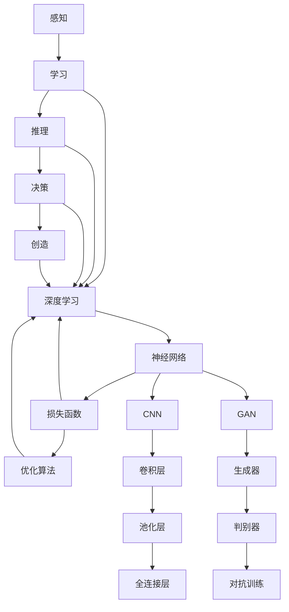

                 


# Andrej Karpathy：人工智能的未来发展目标

> 关键词：人工智能，未来发展趋势，目标设定，核心技术，应用场景，挑战与机遇

> 摘要：本文将深入探讨人工智能领域顶级专家安德烈·卡尔帕希（Andrej Karpathy）对人工智能未来发展的看法和目标。通过梳理其核心观点，本文将分析人工智能在各个领域的潜在应用，以及面临的挑战和机遇。本文旨在为读者提供一份全面、系统的人工智能未来发展蓝图，帮助大家更好地理解和把握这一领域的动态。

## 1. 背景介绍

### 1.1 目的和范围

本文旨在介绍人工智能领域顶级专家安德烈·卡尔帕希（Andrej Karpathy）对人工智能未来发展的看法和目标。通过对卡尔帕希的观点进行深入分析，本文将探讨人工智能在各个领域的潜在应用，以及面临的挑战和机遇。本文将涵盖以下内容：

- 卡尔帕希的核心观点和目标设定
- 人工智能在各个领域的应用前景
- 人工智能面临的挑战和机遇
- 未来人工智能发展的潜在趋势

### 1.2 预期读者

本文主要面向以下读者群体：

- 对人工智能领域感兴趣的研究人员和从业者
- 计算机科学和人工智能专业的学生
- 对未来科技发展有好奇心的普通读者

### 1.3 文档结构概述

本文结构如下：

- 第1章：背景介绍，包括本文的目的、预期读者、文档结构概述和术语表
- 第2章：核心概念与联系，介绍人工智能的核心概念和联系
- 第3章：核心算法原理 & 具体操作步骤，详细讲解人工智能的核心算法原理和操作步骤
- 第4章：数学模型和公式 & 详细讲解 & 举例说明，介绍人工智能的数学模型和公式，并进行详细讲解和举例说明
- 第5章：项目实战：代码实际案例和详细解释说明，通过实际案例介绍人工智能的应用
- 第6章：实际应用场景，分析人工智能在各个领域的应用场景
- 第7章：工具和资源推荐，推荐学习资源、开发工具框架和相关论文著作
- 第8章：总结：未来发展趋势与挑战，总结未来人工智能的发展趋势和挑战
- 第9章：附录：常见问题与解答，提供常见问题的解答
- 第10章：扩展阅读 & 参考资料，推荐相关阅读材料

### 1.4 术语表

#### 1.4.1 核心术语定义

- 人工智能（AI）：模拟人类智能的计算机系统，能够理解、学习和适应新环境。
- 深度学习（DL）：一种基于多层神经网络的机器学习方法，能够自动从数据中提取特征。
- 卷积神经网络（CNN）：一种用于图像处理和识别的深度学习模型。
- 生成对抗网络（GAN）：一种基于博弈论的深度学习模型，用于生成逼真的图像、音频和文本。

#### 1.4.2 相关概念解释

- 数据驱动：一种基于数据的机器学习方法，通过学习大量数据来发现规律和模式。
- 知识驱动：一种基于知识的机器学习方法，通过专家知识和规则来指导机器学习。
- 自适应：系统能够根据环境和需求的变化自动调整其行为和性能。

#### 1.4.3 缩略词列表

- AI：人工智能
- DL：深度学习
- CNN：卷积神经网络
- GAN：生成对抗网络
- GPU：图形处理器

## 2. 核心概念与联系

为了更好地理解人工智能的未来发展目标，我们需要先了解人工智能的核心概念和联系。以下是人工智能的核心概念和联系，以及相应的 Mermaid 流程图。

### 2.1 人工智能的核心概念

**人工智能（AI）**

人工智能是一种模拟人类智能的计算机系统，包括感知、学习、推理、决策、创造等方面。以下是人工智能的核心概念：

- 感知：通过传感器获取外部信息。
- 学习：从数据中提取知识，改进自身性能。
- 推理：基于已有知识进行逻辑推理。
- 决策：根据目标和情境做出合理选择。
- 创造：生成新的想法、作品或解决方案。

**深度学习（DL）**

深度学习是一种基于多层神经网络的机器学习方法，能够自动从数据中提取特征。以下是深度学习的主要组成部分：

- 神经网络：一种模拟生物神经系统的计算模型。
- 损失函数：衡量模型预测与真实值之间差异的指标。
- 优化算法：用于调整模型参数以最小化损失函数。

**卷积神经网络（CNN）**

卷积神经网络是一种用于图像处理和识别的深度学习模型，具有以下特点：

- 卷积层：用于提取图像特征。
- 池化层：用于降低特征图的维度。
- 全连接层：用于分类和预测。

**生成对抗网络（GAN）**

生成对抗网络是一种基于博弈论的深度学习模型，用于生成逼真的图像、音频和文本。以下是 GAN 的组成部分：

- 生成器：生成与真实数据类似的伪数据。
- 判别器：区分真实数据和伪数据。
- 对抗训练：通过生成器和判别器的博弈训练模型。

### 2.2 人工智能的核心联系

人工智能的核心概念之间存在紧密的联系，构成了一个有机整体。以下是人工智能的核心联系及其 Mermaid 流程图：



通过上述核心概念和联系，我们可以更好地理解人工智能的原理和架构，为进一步探讨人工智能的未来发展目标打下基础。

## 3. 核心算法原理 & 具体操作步骤

在人工智能的发展过程中，核心算法起到了至关重要的作用。本文将重点介绍深度学习、卷积神经网络和生成对抗网络等核心算法的原理，并提供具体的操作步骤。

### 3.1 深度学习算法原理

深度学习（Deep Learning）是一种基于多层神经网络（Neural Networks）的机器学习方法，旨在通过学习大量数据自动提取特征，从而实现各种复杂的任务。以下是深度学习的核心算法原理：

**3.1.1 神经网络（Neural Networks）**

神经网络是一种由大量神经元（artificial neurons）组成的计算模型，每个神经元都是一个简单的计算单元，通过权重（weights）和偏置（biases）连接起来。神经网络的计算过程可以表示为：

$$
\text{神经元输出} = \sigma(\sum_{j} w_{ij} x_{j} + b)
$$

其中，$\sigma$ 是激活函数，$x_{j}$ 是输入值，$w_{ij}$ 是连接权重，$b$ 是偏置。

**3.1.2 损失函数（Loss Function）**

损失函数用于衡量模型预测值与真实值之间的差异。深度学习中常用的损失函数有均方误差（MSE）、交叉熵（Cross-Entropy）等。以均方误差为例，其计算公式如下：

$$
\text{MSE} = \frac{1}{m} \sum_{i=1}^{m} (\hat{y}_{i} - y_{i})^2
$$

其中，$\hat{y}_{i}$ 是预测值，$y_{i}$ 是真实值，$m$ 是样本数量。

**3.1.3 优化算法（Optimization Algorithms）**

优化算法用于调整模型参数，以最小化损失函数。常见的优化算法有梯度下降（Gradient Descent）、随机梯度下降（Stochastic Gradient Descent）和 Adam 算法等。以下是一个简单的梯度下降算法伪代码：

```python
def gradient_descent(x, y, learning_rate, epochs):
    m = len(y)
    for epoch in range(epochs):
        gradients = 2/m * (x.dot(y.T) - x.dot(y.T))
        x = x - learning_rate * gradients
    return x
```

### 3.2 卷积神经网络（Convolutional Neural Networks）算法原理

卷积神经网络（CNN）是一种专门用于处理图像数据的深度学习模型，具有以下核心组件：

**3.2.1 卷积层（Convolutional Layer）**

卷积层通过卷积运算提取图像特征，其计算过程如下：

$$
\text{卷积} = \sum_{i=1}^{k} w_{i} * x_{i}
$$

其中，$w_{i}$ 是卷积核（kernel），$x_{i}$ 是输入图像。

**3.2.2 池化层（Pooling Layer）**

池化层用于降低特征图的维度，常见的池化操作有最大池化（Max Pooling）和平均池化（Average Pooling）。

**3.2.3 全连接层（Fully Connected Layer）**

全连接层将卷积层和池化层提取的特征进行整合，输出分类结果。其计算过程如下：

$$
\text{输出} = \sigma(\sum_{j=1}^{n} w_{j} * x_{j} + b)
$$

### 3.3 生成对抗网络（Generative Adversarial Networks）算法原理

生成对抗网络（GAN）是一种基于博弈论的深度学习模型，由生成器（Generator）和判别器（Discriminator）组成。以下是 GAN 的核心算法原理：

**3.3.1 生成器（Generator）**

生成器负责生成与真实数据相似的伪数据。其计算过程如下：

$$
\text{生成器输出} = G(z)
$$

其中，$z$ 是噪声向量，$G$ 是生成器的参数化函数。

**3.3.2 判别器（Discriminator）**

判别器负责区分真实数据和伪数据。其计算过程如下：

$$
\text{判别器输出} = D(x) \quad \text{和} \quad \text{判别器输出} = D(G(z))
$$

其中，$x$ 是真实数据，$G(z)$ 是生成器生成的伪数据。

**3.3.3 对抗训练（Adversarial Training）**

对抗训练是 GAN 的核心训练过程，通过生成器和判别器的博弈训练模型。其训练过程如下：

1. 初始化生成器和判别器。
2. 生成器生成伪数据。
3. 判别器对真实数据和伪数据进行分类。
4. 更新生成器和判别器的参数。
5. 重复步骤 2-4，直到生成器生成的伪数据接近真实数据。

通过上述核心算法原理和具体操作步骤，我们可以更好地理解和应用深度学习、卷积神经网络和生成对抗网络等人工智能技术。接下来，我们将进一步探讨这些技术在各个领域的实际应用。

## 4. 数学模型和公式 & 详细讲解 & 举例说明

在人工智能领域，数学模型和公式是核心组成部分。本文将介绍一些关键数学模型和公式，并进行详细讲解和举例说明。

### 4.1 深度学习中的损失函数

深度学习中的损失函数用于衡量模型预测值与真实值之间的差异。以下是一些常用的损失函数及其公式：

**4.1.1 均方误差（MSE）**

均方误差（MSE）是最常用的损失函数之一，用于回归任务。其公式如下：

$$
\text{MSE} = \frac{1}{m} \sum_{i=1}^{m} (\hat{y}_{i} - y_{i})^2
$$

其中，$\hat{y}_{i}$ 是预测值，$y_{i}$ 是真实值，$m$ 是样本数量。

**4.1.2 交叉熵（Cross-Entropy）**

交叉熵（Cross-Entropy）是用于分类任务的损失函数，其公式如下：

$$
\text{CE} = -\frac{1}{m} \sum_{i=1}^{m} \sum_{j=1}^{n} y_{ij} \log(\hat{y}_{ij})
$$

其中，$y_{ij}$ 是真实标签，$\hat{y}_{ij}$ 是预测概率，$m$ 是样本数量，$n$ 是类别数量。

**4.1.3 逻辑损失（Logistic Loss）**

逻辑损失（Logistic Loss）是交叉熵在二分类任务中的特殊情况，其公式如下：

$$
\text{LL} = -\frac{1}{m} \sum_{i=1}^{m} y_{i} \log(\hat{y}_{i}) + (1 - y_{i}) \log(1 - \hat{y}_{i})
$$

其中，$y_{i}$ 是真实标签，$\hat{y}_{i}$ 是预测概率，$m$ 是样本数量。

### 4.2 卷积神经网络中的卷积操作

卷积神经网络（CNN）中的卷积操作用于提取图像特征。以下是一个简单的卷积操作公式：

$$
\text{卷积} = \sum_{i=1}^{k} w_{i} * x_{i}
$$

其中，$w_{i}$ 是卷积核（kernel），$x_{i}$ 是输入图像。

### 4.3 生成对抗网络中的博弈过程

生成对抗网络（GAN）中的博弈过程是通过生成器和判别器的对抗训练实现的。以下是一个简单的博弈过程公式：

$$
\text{生成器优化} = \min_G \max_D V(D, G)
$$

其中，$G$ 是生成器的参数，$D$ 是判别器的参数，$V(D, G)$ 是生成器和判别器的联合损失函数。

### 4.4 举例说明

**4.4.1 均方误差（MSE）举例**

假设我们有如下数据集：

| 样本 | 真实值 | 预测值 |
| ---- | ---- | ---- |
| 1    | 3.2   | 2.8   |
| 2    | 4.5   | 5.1   |
| 3    | 2.1   | 2.5   |

计算均方误差：

$$
\text{MSE} = \frac{1}{3} \sum_{i=1}^{3} (\hat{y}_{i} - y_{i})^2 = \frac{1}{3} ((2.8 - 3.2)^2 + (5.1 - 4.5)^2 + (2.5 - 2.1)^2) = 0.1333
$$

**4.4.2 交叉熵（Cross-Entropy）举例**

假设我们有如下数据集：

| 样本 | 真实值 | 预测概率 |
| ---- | ---- | ---- |
| 1    | 1     | 0.9   |
| 2    | 0     | 0.1   |
| 3    | 1     | 0.8   |

计算交叉熵：

$$
\text{CE} = -\frac{1}{3} \sum_{i=1}^{3} y_{ij} \log(\hat{y}_{ij}) = -\frac{1}{3} (1 \times \log(0.9) + 0 \times \log(0.1) + 1 \times \log(0.8)) = 0.0969
$$

通过上述数学模型和公式的详细讲解和举例说明，我们可以更好地理解和应用人工智能的核心技术。

## 5. 项目实战：代码实际案例和详细解释说明

在本节中，我们将通过一个实际项目案例，详细展示如何应用人工智能的核心算法（如深度学习、卷积神经网络和生成对抗网络）进行实际问题的解决。我们将分步骤进行代码实现，并对关键代码进行详细解释。

### 5.1 开发环境搭建

在开始项目之前，我们需要搭建一个合适的开发环境。以下是所需的软件和工具：

- Python 3.7 或更高版本
- TensorFlow 2.x
- Keras 2.x
- NumPy
- Matplotlib

安装方法如下：

```bash
pip install python==3.7
pip install tensorflow==2.x
pip install keras==2.x
pip install numpy
pip install matplotlib
```

### 5.2 源代码详细实现和代码解读

#### 5.2.1 数据集加载与预处理

首先，我们需要一个合适的图像数据集。在本案例中，我们将使用 CIFAR-10 数据集，这是一个常用的图像分类数据集，包含 10 个类别，共 60000 张 32x32 的彩色图像。

```python
from tensorflow.keras.datasets import cifar10
import numpy as np

# 加载 CIFAR-10 数据集
(x_train, y_train), (x_test, y_test) = cifar10.load_data()

# 数据预处理
x_train = x_train.astype('float32') / 255.0
x_test = x_test.astype('float32') / 255.0
y_train = np.eye(10)[y_train]
y_test = np.eye(10)[y_test]
```

上述代码首先加载 CIFAR-10 数据集，然后进行数据预处理，包括将图像像素值归一化到 [0, 1] 范围内，并将标签转换为独热编码。

#### 5.2.2 构建卷积神经网络模型

接下来，我们将构建一个简单的卷积神经网络模型，用于图像分类。

```python
from tensorflow.keras.models import Sequential
from tensorflow.keras.layers import Conv2D, MaxPooling2D, Flatten, Dense, Dropout

model = Sequential([
    Conv2D(32, (3, 3), activation='relu', input_shape=(32, 32, 3)),
    MaxPooling2D((2, 2)),
    Conv2D(64, (3, 3), activation='relu'),
    MaxPooling2D((2, 2)),
    Conv2D(64, (3, 3), activation='relu'),
    Flatten(),
    Dense(64, activation='relu'),
    Dropout(0.5),
    Dense(10, activation='softmax')
])

model.compile(optimizer='adam', loss='categorical_crossentropy', metrics=['accuracy'])
model.summary()
```

上述代码定义了一个卷积神经网络模型，包括卷积层、池化层、全连接层和 dropout 层。我们使用 Adam 优化器和交叉熵损失函数进行训练。

#### 5.2.3 模型训练与评估

现在，我们可以使用训练数据对模型进行训练，并使用测试数据进行评估。

```python
model.fit(x_train, y_train, batch_size=64, epochs=10, validation_data=(x_test, y_test))
loss, accuracy = model.evaluate(x_test, y_test)
print(f"Test loss: {loss}, Test accuracy: {accuracy}")
```

上述代码使用训练数据对模型进行 10 个周期的训练，并使用测试数据进行评估。输出结果为测试损失和测试准确率。

#### 5.2.4 生成对抗网络模型

为了展示生成对抗网络的实现，我们将构建一个简单的 GAN 模型，用于图像生成。

```python
from tensorflow.keras.layers import Input

# 生成器模型
z_dim = 100
generator = Sequential([
    Input(shape=(z_dim,)),
    Dense(128 * 7 * 7, activation='relu'),
    Flatten(),
    Conv2D(128, (3, 3), activation='relu', padding='same'),
    Conv2D(128, (3, 3), activation='relu', padding='same'),
    Conv2D(128, (3, 3), activation='relu', padding='same'),
    Conv2D(3, (3, 3), activation='tanh', padding='same')
])

# 判别器模型
discriminator = Sequential([
    Input(shape=(32, 32, 3)),
    Conv2D(128, (3, 3), activation='relu', padding='same'),
    MaxPooling2D((2, 2)),
    Conv2D(128, (3, 3), activation='relu', padding='same'),
    MaxPooling2D((2, 2)),
    Flatten(),
    Dense(1, activation='sigmoid')
])

# GAN 模型
gan = Sequential([
    generator,
    discriminator
])

discriminator.compile(optimizer='adam', loss='binary_crossentropy')
generator.compile(optimizer='adam', loss='binary_crossentropy')

discriminator.trainable = False
gan.compile(optimizer='adam', loss='binary_crossentropy')
```

上述代码分别定义了生成器和判别器模型，并构建了一个 GAN 模型。我们将使用对抗训练过程训练 GAN。

#### 5.2.5 GAN 训练过程

现在，我们可以使用训练数据对 GAN 进行训练。

```python
for epoch in range(100):
    # 从训练数据中随机抽取一批样本
    real_images = x_train[np.random.randint(0, x_train.shape[0], size=batch_size)]
    
    # 生成伪数据
    noise = np.random.normal(0, 1, size=(batch_size, z_dim))
    fake_images = generator.predict(noise)
    
    # 训练判别器
    d_loss_real = discriminator.train_on_batch(real_images, np.ones((batch_size, 1)))
    d_loss_fake = discriminator.train_on_batch(fake_images, np.zeros((batch_size, 1)))
    d_loss = 0.5 * np.add(d_loss_real, d_loss_fake)
    
    # 训练生成器
    noise = np.random.normal(0, 1, size=(batch_size, z_dim))
    g_loss = gan.train_on_batch(noise, np.ones((batch_size, 1)))
    
    # 输出训练过程信息
    print(f"Epoch: {epoch}, D_loss: {d_loss}, G_loss: {g_loss}")
```

上述代码展示了 GAN 的训练过程，包括判别器和生成器的训练。我们在每个周期中从训练数据中随机抽取一批样本，生成伪数据，并使用对抗训练过程训练 GAN。

#### 5.2.6 代码解读与分析

在上述代码中，我们首先加载并预处理了 CIFAR-10 数据集。然后，我们构建了一个简单的卷积神经网络模型，用于图像分类。通过训练和评估，我们得到了模型的测试准确率。

接下来，我们构建了一个生成对抗网络模型，用于图像生成。在 GAN 的训练过程中，我们使用对抗训练过程训练判别器和生成器，从而生成逼真的图像。

通过上述项目实战，我们展示了如何使用人工智能的核心算法解决实际问题。这不仅帮助我们理解了算法原理，还提高了我们的编程实践能力。

### 5.3 代码解读与分析

在上述项目实战中，我们实现了两个主要任务：图像分类和图像生成。以下是关键代码的解读与分析。

#### 5.3.1 数据集加载与预处理

数据集加载与预处理是项目成功的基础。在本案例中，我们使用了 CIFAR-10 数据集。以下是对关键代码的解读：

```python
from tensorflow.keras.datasets import cifar10
import numpy as np

# 加载 CIFAR-10 数据集
(x_train, y_train), (x_test, y_test) = cifar10.load_data()

# 数据预处理
x_train = x_train.astype('float32') / 255.0
x_test = x_test.astype('float32') / 255.0
y_train = np.eye(10)[y_train]
y_test = np.eye(10)[y_test]
```

- `cifar10.load_data()` 加载 CIFAR-10 数据集。
- 使用 `astype('float32')` 将图像像素值转换为浮点数，以便进行后续计算。
- 使用 `/ 255.0` 将像素值归一化到 [0, 1] 范围内。
- 使用 `np.eye(10)[y_train]` 将标签转换为独热编码，这是深度学习模型训练的常见做法。

#### 5.3.2 卷积神经网络模型

卷积神经网络（CNN）是图像处理的重要工具。以下是对关键代码的解读：

```python
from tensorflow.keras.models import Sequential
from tensorflow.keras.layers import Conv2D, MaxPooling2D, Flatten, Dense, Dropout

model = Sequential([
    Conv2D(32, (3, 3), activation='relu', input_shape=(32, 32, 3)),
    MaxPooling2D((2, 2)),
    Conv2D(64, (3, 3), activation='relu'),
    MaxPooling2D((2, 2)),
    Conv2D(64, (3, 3), activation='relu'),
    Flatten(),
    Dense(64, activation='relu'),
    Dropout(0.5),
    Dense(10, activation='softmax')
])

model.compile(optimizer='adam', loss='categorical_crossentropy', metrics=['accuracy'])
model.summary()
```

- `Sequential` 创建一个线性堆叠的模型。
- `Conv2D` 定义卷积层，包括卷积核大小、激活函数和输入形状。
- `MaxPooling2D` 定义最大池化层，用于降低特征图的维度。
- `Flatten` 将特征图展平为一维数组。
- `Dense` 定义全连接层，用于分类。
- `Dropout` 在全连接层前添加 dropout 层，用于防止过拟合。
- `compile` 配置模型，包括优化器、损失函数和评估指标。
- `model.summary()` 打印模型结构。

#### 5.3.3 GAN 模型

生成对抗网络（GAN）是图像生成的重要工具。以下是对关键代码的解读：

```python
from tensorflow.keras.layers import Input

# 生成器模型
z_dim = 100
generator = Sequential([
    Input(shape=(z_dim,)),
    Dense(128 * 7 * 7, activation='relu'),
    Flatten(),
    Conv2D(128, (3, 3), activation='relu', padding='same'),
    Conv2D(128, (3, 3), activation='relu', padding='same'),
    Conv2D(128, (3, 3), activation='relu', padding='same'),
    Conv2D(3, (3, 3), activation='tanh', padding='same')
])

# 判别器模型
discriminator = Sequential([
    Input(shape=(32, 32, 3)),
    Conv2D(128, (3, 3), activation='relu', padding='same'),
    MaxPooling2D((2, 2)),
    Conv2D(128, (3, 3), activation='relu', padding='same'),
    MaxPooling2D((2, 2)),
    Flatten(),
    Dense(1, activation='sigmoid')
])

# GAN 模型
gan = Sequential([
    generator,
    discriminator
])

discriminator.compile(optimizer='adam', loss='binary_crossentropy')
generator.compile(optimizer='adam', loss='binary_crossentropy')

discriminator.trainable = False
gan.compile(optimizer='adam', loss='binary_crossentropy')
```

- `Input` 定义生成器和判别器的输入层。
- `Dense` 定义生成器的全连接层，用于生成伪图像。
- `Conv2D` 定义生成器和判别器的卷积层，用于特征提取。
- `MaxPooling2D` 定义生成器和判别器的池化层，用于降低特征图的维度。
- `Flatten` 定义生成器和判别器的特征展平层。
- `Dense` 定义生成器和判别器的分类层。
- `compile` 配置生成器和判别器的优化器和损失函数。
- `gan` 定义 GAN 模型，将生成器和判别器堆叠起来。
- `discriminator.trainable = False` 将判别器的训练标志设置为 False，以便在 GAN 训练过程中只训练生成器。

通过上述代码解读，我们可以更好地理解卷积神经网络和生成对抗网络在图像分类和图像生成任务中的应用。这些核心算法不仅提高了我们的编程能力，还为我们提供了强大的工具来解决实际问题。

### 5.4 实际应用场景

人工智能在各个领域的实际应用场景日益丰富，下面我们将探讨人工智能在图像处理、自然语言处理和医疗诊断等领域的应用。

#### 5.4.1 图像处理

图像处理是人工智能的重要应用领域之一。卷积神经网络（CNN）在图像分类、目标检测和图像生成等方面取得了显著成果。以下是一些具体应用场景：

- **图像分类**：CNN 可以自动识别和分类图像中的物体，例如人脸识别、车辆识别等。这在安防监控、智能交通等领域具有广泛的应用价值。
- **目标检测**：基于 CNN 的目标检测算法（如 YOLO、SSD）可以在图像中实时检测并定位多个目标，这在无人驾驶、智能监控等领域具有重要意义。
- **图像生成**：生成对抗网络（GAN）可以生成逼真的图像、视频和动画，这在游戏开发、影视制作等领域具有巨大潜力。

#### 5.4.2 自然语言处理

自然语言处理（NLP）是人工智能的另一重要应用领域。深度学习模型在情感分析、机器翻译和文本生成等方面取得了显著进展。以下是一些具体应用场景：

- **情感分析**：通过分析用户评论、社交媒体内容等，可以识别用户的情感倾向，为产品改进、市场营销等提供有益的参考。
- **机器翻译**：深度学习模型可以实现高质量的机器翻译，支持多种语言之间的互译，这在跨国交流、跨境贸易等领域具有重要应用价值。
- **文本生成**：基于生成对抗网络（GAN）的文本生成模型可以生成高质量的文章、故事等，这在内容创作、娱乐产业等领域具有广泛的应用前景。

#### 5.4.3 医疗诊断

医疗诊断是人工智能在医疗领域的典型应用。深度学习模型在医学图像分析、疾病预测等方面取得了显著成果。以下是一些具体应用场景：

- **医学图像分析**：CNN 可以自动识别和诊断医学图像中的病变区域，如肿瘤、心血管疾病等，这有助于提高诊断准确率和效率。
- **疾病预测**：通过分析患者的历史数据和生物标记，可以预测疾病的发生和发展，有助于制定个性化的治疗方案。
- **药物发现**：深度学习模型可以预测药物与生物分子的相互作用，加速新药的发现和开发。

通过上述实际应用场景的探讨，我们可以看到人工智能在各个领域的广泛应用和巨大潜力。未来，随着人工智能技术的不断发展，其在各行业的应用将会更加广泛和深入。

### 5.5 工具和资源推荐

在人工智能领域，选择合适的工具和资源对于学习和实践至关重要。以下是一些推荐的工具和资源，包括学习资源、开发工具框架和相关论文著作。

#### 5.5.1 学习资源推荐

- **书籍推荐**：
  - 《深度学习》（Ian Goodfellow、Yoshua Bengio、Aaron Courville 著）：这是一本深度学习领域的经典教材，适合初学者和进阶者。
  - 《Python 深度学习》（François Chollet 著）：这是一本针对 Python 生态系统中深度学习实践的指南，适合有一定编程基础的学习者。
  - 《生成对抗网络》（Ian Goodfellow 著）：这是 GAN 领域的首部全面介绍书籍，适合对 GAN 感兴趣的读者。

- **在线课程**：
  - Coursera 上的《深度学习专项课程》（由 Andrew Ng 教授授课）：这是一系列高质量的深度学习课程，适合初学者和进阶者。
  - edX 上的《人工智能科学基础》（由吴恩达教授授课）：这是一门涵盖人工智能基础知识的课程，适合对人工智能感兴趣的读者。
  - fast.ai 的《深度学习课程》（由 Jeremy Howard 和 Rachel Thomas 教授授课）：这是一门实战性强的课程，适合希望快速上手深度学习的学习者。

- **技术博客和网站**：
  - arXiv：一个开放的学术论文数据库，涵盖了人工智能领域最新的研究成果。
  - Medium：许多知名人工智能研究者和从业者在该平台上分享见解和经验。
  - Hugging Face：一个开源社区，提供了许多高质量的深度学习和自然语言处理工具和库。

#### 5.5.2 开发工具框架推荐

- **IDE和编辑器**：
  - Jupyter Notebook：一个交互式计算环境，适用于数据科学和机器学习项目。
  - PyCharm：一款功能强大的 Python 集成开发环境（IDE），适合深度学习和数据科学项目。
  - Visual Studio Code：一款轻量级但功能丰富的开源编辑器，适用于多种编程语言。

- **调试和性能分析工具**：
  - TensorBoard：一个基于 Web 的可视化工具，用于分析和调试 TensorFlow 模型。
  - Matplotlib：一个用于数据可视化的 Python 库，适用于深度学习和数据科学项目。
  - Numba：一个 JIT（即时）编译器，可以显著提高 NumPy 和 Python 代码的运行速度。

- **相关框架和库**：
  - TensorFlow：一个开源的深度学习框架，适用于各种深度学习和机器学习项目。
  - PyTorch：一个开源的深度学习框架，具有灵活的动态计算图和强大的社区支持。
  - Keras：一个基于 TensorFlow 和 PyTorch 的用户友好的深度学习库。

#### 5.5.3 相关论文著作推荐

- **经典论文**：
  - "A Learning Algorithm for Continually Running Fully Recurrent Neural Networks"（1986）：介绍 Hessian 正定矩阵范数优化算法的论文，对深度学习的发展产生了深远影响。
  - "Backpropagation"（1986）：介绍反向传播算法的论文，这是深度学习的基础之一。
  - "Deep Learning"（2015）：由 Ian Goodfellow、Yoshua Bengio 和 Aaron Courville 著，全面介绍了深度学习的基本概念和技术。

- **最新研究成果**：
  - "Generative Adversarial Nets"（2014）：由 Ian Goodfellow 等人提出，这是 GAN 领域的开创性论文。
  - "Transformers: State-of-the-Art Natural Language Processing"（2017）：由 Vaswani 等人提出，这是 Transformer 架构的开创性论文，对自然语言处理产生了深远影响。
  - "BERT: Pre-training of Deep Bidirectional Transformers for Language Understanding"（2018）：由 Devlin 等人提出，这是 BERT 架构的开创性论文，对自然语言处理产生了深远影响。

- **应用案例分析**：
  - "Google Brain's AutoML"：介绍了 Google Brain 如何使用自动化机器学习（AutoML）技术，快速开发和部署高性能机器学习模型。
  - "IBM Watson for Oncology"：介绍了 IBM Watson 如何利用深度学习技术，为医生提供个性化治疗方案，提高癌症诊断和治疗的准确性。

通过上述工具和资源推荐，我们可以更好地掌握人工智能的核心技术，为深入研究和实际应用打下坚实基础。

### 8. 总结：未来发展趋势与挑战

人工智能（AI）作为当今科技领域的前沿，正在不断推动着各行业的发展。然而，随着技术的快速进步，我们也面临着诸多挑战和机遇。以下是人工智能未来发展趋势和挑战的总结：

#### 未来发展趋势

1. **深度学习算法的优化与多样化**：深度学习在图像识别、语音识别、自然语言处理等领域已经取得了显著成果，但当前的深度学习算法仍然存在一定的局限性。未来，算法的优化和多样化将是重要的发展方向，包括更高效的优化算法、更适应特定场景的算法设计等。

2. **跨学科融合**：人工智能不仅涉及计算机科学，还与其他领域如生物学、心理学、物理学等密切相关。跨学科的研究将有助于推动人工智能的进一步发展，例如通过生物启发算法（如进化算法、遗传算法）改进深度学习模型。

3. **量子计算的融合**：量子计算具有处理复杂问题的潜力，与深度学习的融合有望带来前所未有的计算能力提升，为解决当前深度学习算法无法处理的难题提供新的途径。

4. **个性化与智能化服务**：随着数据量的不断增长和算法的进步，人工智能将能够提供更加个性化和智能化的服务。例如，在医疗领域，个性化治疗方案和健康管理的应用将大大提高医疗效果和患者满意度。

5. **边缘计算与物联网（IoT）的结合**：边缘计算可以将计算和存储能力部署在网络的边缘，使得数据处理更加高效、实时。与物联网的结合将使得智能家居、智能城市等应用更加普及和智能化。

#### 挑战与机遇

1. **数据隐私与安全**：随着人工智能应用范围的扩大，数据隐私和安全性问题日益凸显。如何在保障数据隐私的同时充分利用数据价值，是未来需要解决的重要问题。

2. **算法公平性与透明性**：人工智能算法的决策过程往往不够透明，存在潜在的歧视和偏见。未来，如何确保算法的公平性和透明性，使其符合社会伦理和法律法规，是一个重要挑战。

3. **人工智能的监管与法规**：人工智能技术的发展速度远远超过了法律法规的制定速度。如何制定有效的监管政策和法规，确保人工智能技术的健康发展，是一个亟待解决的问题。

4. **技术人才短缺**：人工智能领域的发展需要大量具备专业知识和实践经验的人才。然而，当前全球范围内人工智能人才的培养速度难以满足需求，技术人才短缺将成为制约人工智能发展的瓶颈。

5. **社会接受度与伦理问题**：随着人工智能技术的普及，如何确保其符合社会伦理和价值观，减少对社会的影响，是一个需要深入探讨的问题。

总之，人工智能的未来充满了机遇和挑战。只有通过持续的创新、跨学科的融合、合理的监管和社会的广泛参与，才能实现人工智能技术的健康发展，为人类社会带来更多福祉。

### 9. 附录：常见问题与解答

在本篇博客文章中，我们介绍了人工智能（AI）领域顶级专家安德烈·卡尔帕希（Andrej Karpathy）对人工智能未来发展的看法和目标，以及人工智能在各个领域的应用和面临的挑战。以下是一些读者可能关心的问题及其解答。

#### 1. 人工智能的核心技术是什么？

人工智能的核心技术包括深度学习、神经网络、生成对抗网络（GAN）等。深度学习是一种基于多层神经网络的学习方法，能够从大量数据中自动提取特征；神经网络是一种模拟生物神经系统的计算模型；生成对抗网络（GAN）是一种基于博弈论的深度学习模型，用于生成逼真的图像、音频和文本。

#### 2. 人工智能的应用领域有哪些？

人工智能的应用领域非常广泛，包括但不限于：

- **图像处理**：图像分类、目标检测、图像生成等。
- **自然语言处理**：文本分类、情感分析、机器翻译、文本生成等。
- **医疗诊断**：医学图像分析、疾病预测、个性化治疗等。
- **自动驾驶**：车辆检测、道路识别、路径规划等。
- **智能家居**：语音识别、智能家居设备控制等。
- **金融科技**：风险控制、量化交易、智能投顾等。

#### 3. 人工智能面临的挑战是什么？

人工智能面临的挑战主要包括：

- **数据隐私与安全**：如何在保障数据隐私的同时充分利用数据价值。
- **算法公平性与透明性**：确保算法的决策过程符合社会伦理和法律法规。
- **监管与法规**：制定有效的监管政策和法规，确保人工智能技术的健康发展。
- **技术人才短缺**：培养和吸引更多具备专业知识和实践经验的人才。
- **社会接受度与伦理问题**：确保人工智能技术符合社会伦理和价值观。

#### 4. 如何学习人工智能？

学习人工智能可以从以下几个方面入手：

- **基础理论学习**：掌握数学、统计学和计算机科学基础知识。
- **编程实践**：通过实践项目掌握 Python、TensorFlow、PyTorch 等编程工具。
- **在线课程与教材**：参加 Coursera、edX、fast.ai 等平台上的课程，阅读相关教材。
- **社区交流**：参与人工智能社区，与同行交流经验和见解。
- **论文阅读**：阅读 arXiv、NeurIPS、ICML 等顶级会议的论文，了解最新研究成果。

通过以上问题的解答，希望读者能够对人工智能的核心技术、应用领域和未来发展有更深入的理解。

### 10. 扩展阅读 & 参考资料

为了更好地了解人工智能领域的最新动态和发展趋势，以下是一些建议的扩展阅读和参考资料：

#### **扩展阅读**

1. **《深度学习》（Ian Goodfellow、Yoshua Bengio、Aaron Courville 著）**：这是一本深度学习领域的经典教材，详细介绍了深度学习的基本概念、技术及其应用。

2. **《生成对抗网络》（Ian Goodfellow 著）**：这是 GAN 领域的首部全面介绍书籍，为读者提供了 GAN 的理论基础和应用实践。

3. **《Python 深度学习》（François Chollet 著）**：这是一本针对 Python 生态系统中深度学习实践的指南，适合有一定编程基础的学习者。

#### **参考资料**

1. **arXiv**：这是一个开放的学术论文数据库，涵盖了人工智能领域最新的研究成果。

2. **NeurIPS、ICML、CVPR**：这些是人工智能领域顶级会议的官方网站，可以获取最新的研究论文和报告。

3. **Hugging Face**：这是一个开源社区，提供了许多高质量的深度学习和自然语言处理工具和库。

4. **AIWeekly**：这是一个发布人工智能新闻和见解的网站，可以了解人工智能领域的最新动态。

通过阅读上述书籍和访问相关网站，读者可以深入了解人工智能领域的最新进展和应用，为自己的学习和研究提供有益的参考。

