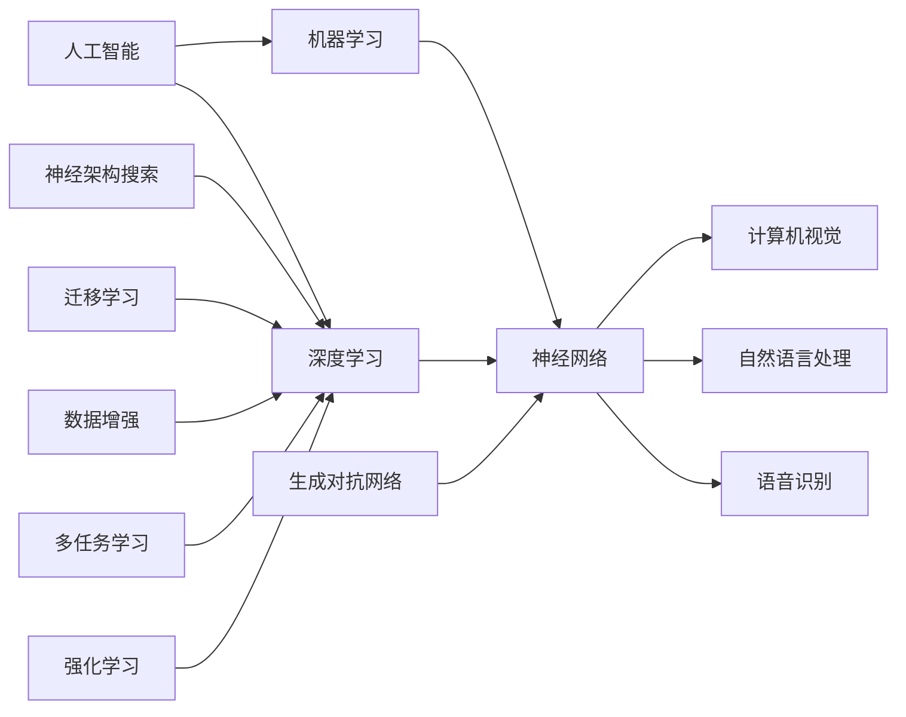

                 

# Andrej Karpathy：人工智能的未来发展策略

> **关键词：** 人工智能，发展策略，技术趋势，未来展望，深度学习

> **摘要：** 本文将深入探讨人工智能领域著名专家Andrej Karpathy对未来人工智能发展的看法，以及他认为实现这一愿景所需的关键策略。文章将涵盖当前人工智能技术的核心概念、未来发展方向、面临的挑战以及解决这些挑战的可能途径。通过分析Karpathy的观点，本文旨在为读者提供一个关于人工智能未来发展方向的全面视角。

## 1. 背景介绍

### 1.1 目的和范围

本文旨在探讨人工智能领域著名专家Andrej Karpathy对未来人工智能发展的看法，并分析他认为实现这一愿景所需的关键策略。本文将涵盖当前人工智能技术的核心概念、未来发展方向、面临的挑战以及解决这些挑战的可能途径。通过深入分析Karpathy的观点，本文希望能够为读者提供一个关于人工智能未来发展方向的全面视角。

### 1.2 预期读者

本文适用于对人工智能技术有一定了解的读者，特别是那些希望了解未来人工智能发展方向和技术趋势的专业人士。此外，本文也适合对人工智能技术充满好奇的普通读者，以及那些希望在未来参与人工智能研究和应用领域的人士。

### 1.3 文档结构概述

本文分为以下几个部分：

1. 背景介绍
2. 核心概念与联系
3. 核心算法原理 & 具体操作步骤
4. 数学模型和公式 & 详细讲解 & 举例说明
5. 项目实战：代码实际案例和详细解释说明
6. 实际应用场景
7. 工具和资源推荐
8. 总结：未来发展趋势与挑战
9. 附录：常见问题与解答
10. 扩展阅读 & 参考资料

### 1.4 术语表

#### 1.4.1 核心术语定义

- **人工智能（AI）**：指由人制造出来的系统能够在特定环境下自主感知、学习、思考并采取行动的能力。
- **深度学习（DL）**：一种人工智能技术，通过模拟人脑的神经网络结构，使计算机能够自动从大量数据中学习。
- **机器学习（ML）**：一种人工智能技术，通过让计算机从数据中学习规律，从而实现特定的任务。
- **神经架构搜索（NAS）**：一种利用机器学习技术来自动设计神经网络结构的算法。
- **强化学习（RL）**：一种机器学习技术，通过试错和奖励机制，使计算机能够在复杂环境中做出最佳决策。

#### 1.4.2 相关概念解释

- **数据增强**：通过变换原始数据来扩充数据集，提高模型的泛化能力。
- **迁移学习**：利用在特定任务上已训练好的模型来提高新任务的性能。
- **多任务学习**：同时学习多个相关任务，以提高模型的泛化能力和效率。
- **生成对抗网络（GAN）**：一种深度学习模型，通过生成器和判别器的对抗训练，能够生成高质量的数据。

#### 1.4.3 缩略词列表

- **AI**：人工智能（Artificial Intelligence）
- **DL**：深度学习（Deep Learning）
- **ML**：机器学习（Machine Learning）
- **NAS**：神经架构搜索（Neural Architecture Search）
- **RL**：强化学习（Reinforcement Learning）
- **GAN**：生成对抗网络（Generative Adversarial Network）

## 2. 核心概念与联系

在讨论人工智能的未来发展之前，我们需要了解一些核心概念和它们之间的联系。以下是关于这些概念的一个简明流程图。



### 2.1 人工智能与机器学习

人工智能（AI）是机器学习（ML）的一个子集。机器学习是通过数据驱动的方式，使计算机能够从数据中学习规律并做出决策。人工智能则更广泛，包括了模拟人类智能的各个方面，如感知、思考、决策等。

### 2.2 深度学习与神经网络

深度学习（DL）是一种机器学习技术，通过模拟人脑的神经网络结构，使计算机能够自动从大量数据中学习。神经网络（NN）是深度学习的基础，由多个层次（层）的神经元组成，每个层次都负责对输入数据进行处理和特征提取。

### 2.3 生成对抗网络、神经架构搜索、迁移学习、数据增强、多任务学习和强化学习

生成对抗网络（GAN）是一种通过生成器和判别器对抗训练的深度学习模型，用于生成高质量的数据。神经架构搜索（NAS）是一种利用机器学习技术来自动设计神经网络结构的算法。迁移学习是一种利用在特定任务上已训练好的模型来提高新任务的性能的方法。数据增强是一种通过变换原始数据来扩充数据集，提高模型的泛化能力的技术。多任务学习是一种同时学习多个相关任务，以提高模型的泛化能力和效率的方法。强化学习是一种通过试错和奖励机制，使计算机能够在复杂环境中做出最佳决策的机器学习技术。

### 2.4 应用领域

上述核心概念和联系在计算机视觉、自然语言处理、语音识别等领域都有广泛应用。例如，在计算机视觉中，神经网络和生成对抗网络用于图像分类、物体检测和生成；在自然语言处理中，神经网络和迁移学习用于语言建模、机器翻译和文本生成；在语音识别中，神经网络和强化学习用于语音信号处理和语音识别。

## 3. 核心算法原理 & 具体操作步骤

在深入探讨人工智能的未来发展之前，了解当前一些核心算法的原理和具体操作步骤是非常重要的。以下是关于这些算法的伪代码描述。

### 3.1 神经网络（NN）

神经网络是一种通过模拟人脑神经网络结构的计算模型。以下是神经网络的伪代码描述：

```plaintext
初始化参数（权重和偏置）
对于每一轮训练：
  对于每个训练样本：
    前向传播（计算输出）
    计算损失函数值
    反向传播（计算梯度）
    更新参数
返回训练好的模型
```

### 3.2 生成对抗网络（GAN）

生成对抗网络（GAN）由生成器和判别器组成，以下是其伪代码描述：

```plaintext
初始化生成器和判别器的参数
对于每一轮训练：
  生成器生成假样本
  判别器判断生成器和真实样本
  计算损失函数值
  更新生成器和判别器的参数
返回训练好的生成器
```

### 3.3 神经架构搜索（NAS）

神经架构搜索（NAS）是一种通过机器学习技术来自动设计神经网络结构的算法。以下是NAS的伪代码描述：

```plaintext
初始化搜索空间
对于每一轮搜索：
  随机选择一组神经网络结构
  在训练集上训练神经网络
  评估神经网络在测试集上的性能
  根据性能更新搜索空间
返回最优神经网络结构
```

### 3.4 迁移学习

迁移学习是一种利用在特定任务上已训练好的模型来提高新任务的性能的方法。以下是迁移学习的伪代码描述：

```plaintext
加载预训练模型
对预训练模型进行微调
在新的任务上训练微调后的模型
返回训练好的模型
```

### 3.5 数据增强

数据增强是一种通过变换原始数据来扩充数据集，提高模型的泛化能力的技术。以下是数据增强的伪代码描述：

```plaintext
对于每个样本：
  应用一系列数据变换（例如：旋转、缩放、裁剪等）
  生成新的数据样本
返回增强后的数据集
```

### 3.6 多任务学习

多任务学习是一种同时学习多个相关任务，以提高模型的泛化能力和效率的方法。以下是多任务学习的伪代码描述：

```plaintext
初始化多任务模型
对于每一轮训练：
  对于每个任务：
    在训练数据上训练任务模块
  在测试数据上评估每个任务模块的性能
  更新多任务模型的参数
返回训练好的多任务模型
```

### 3.7 强化学习

强化学习是一种通过试错和奖励机制，使计算机能够在复杂环境中做出最佳决策的机器学习技术。以下是强化学习的伪代码描述：

```plaintext
初始化智能体和环境的参数
对于每一轮训练：
  智能体在环境中采取动作
  环境根据动作给出奖励
  智能体更新策略
返回训练好的智能体
```

通过理解这些核心算法的原理和具体操作步骤，我们可以更好地把握人工智能技术的发展趋势，为未来的研究和工作提供指导。

## 4. 数学模型和公式 & 详细讲解 & 举例说明

### 4.1 神经网络（NN）

神经网络的数学模型主要由以下几个部分组成：输入层、隐藏层和输出层。每个层由多个神经元组成，神经元之间的连接具有权重和偏置。以下是神经网络的激活函数、损失函数和优化算法的数学模型。

#### 4.1.1 激活函数

激活函数用于对神经元输出的非线性变换，常见的激活函数有Sigmoid函数、ReLU函数和Tanh函数。

- **Sigmoid函数**：$f(x) = \frac{1}{1 + e^{-x}}$

  - **示例**：对于输入$x = 2$，$f(x) = \frac{1}{1 + e^{-2}} \approx 0.86$

- **ReLU函数**：$f(x) = max(0, x)$

  - **示例**：对于输入$x = 2$，$f(x) = max(0, 2) = 2$

- **Tanh函数**：$f(x) = \frac{e^x - e^{-x}}{e^x + e^{-x}}$

  - **示例**：对于输入$x = 2$，$f(x) = \frac{e^2 - e^{-2}}{e^2 + e^{-2}} \approx 0.96$

#### 4.1.2 损失函数

损失函数用于衡量模型预测值与真实值之间的差距。常见的损失函数有均方误差（MSE）、交叉熵损失等。

- **均方误差（MSE）**：$MSE = \frac{1}{n}\sum_{i=1}^{n}(y_i - \hat{y}_i)^2$

  - **示例**：对于预测值$\hat{y} = [0.1, 0.9]$和真实值$y = [0.2, 0.8]$，$MSE = \frac{1}{2}((0.2 - 0.1)^2 + (0.8 - 0.9)^2) = 0.05$

- **交叉熵损失（Cross Entropy Loss）**：$H(y, \hat{y}) = -\sum_{i=1}^{n}y_i \log(\hat{y}_i)$

  - **示例**：对于概率分布$y = [0.3, 0.7]$和预测概率分布$\hat{y} = [0.2, 0.8]$，$H(y, \hat{y}) = -0.3 \log(0.2) - 0.7 \log(0.8) \approx 0.46$

#### 4.1.3 优化算法

优化算法用于最小化损失函数，常见的优化算法有梯度下降（Gradient Descent）、随机梯度下降（Stochastic Gradient Descent，SGD）和Adam优化器。

- **梯度下降**：$w_{\text{new}} = w_{\text{old}} - \alpha \cdot \nabla_w J(w)$

  - **示例**：对于损失函数$J(w) = (w - 2)^2$，步长$\alpha = 0.1$，初始权重$w_0 = 1$，$w_1 = w_0 - 0.1 \cdot \nabla_w J(w_0) = 1 - 0.1 \cdot 2 \cdot (1 - 2) = 1$

- **随机梯度下降**：$w_{\text{new}} = w_{\text{old}} - \alpha \cdot \nabla_w J(w_k)$

  - **示例**：对于损失函数$J(w) = (w - 2)^2$，步长$\alpha = 0.1$，随机选择权重$w_0 = 1$，$w_1 = w_0 - 0.1 \cdot \nabla_w J(w_0) = 1 - 0.1 \cdot 2 \cdot (1 - 2) = 1$

- **Adam优化器**：$m_t = \beta_1 m_{t-1} + (1 - \beta_1) \nabla_w J(w_t)$，$v_t = \beta_2 v_{t-1} + (1 - \beta_2) (\nabla_w J(w_t))^2$，$w_{\text{new}} = w_{\text{old}} - \alpha \cdot \frac{m_t}{\sqrt{v_t} + \epsilon}$

  - **示例**：$\beta_1 = 0.9$，$\beta_2 = 0.99$，$\alpha = 0.001$，$\epsilon = 1e-8$，初始权重$w_0 = 1$，$m_0 = 0$，$v_0 = 0$。$m_1 = 0.9 \cdot 0 + (1 - 0.9) \cdot 2 = 0.2$，$v_1 = 0.99 \cdot 0 + (1 - 0.99) \cdot 2^2 = 0.02$，$w_1 = 1 - 0.001 \cdot \frac{0.2}{\sqrt{0.02} + 1e-8} \approx 0.98$

### 4.2 生成对抗网络（GAN）

生成对抗网络（GAN）由生成器和判别器组成。生成器试图生成逼真的数据，而判别器试图区分生成器和真实数据。以下是GAN的数学模型。

- **生成器**：$G(z) = \mu(z) + \sigma(z) \odot \epsilon(z)$

  - **示例**：$\mu(z) = \frac{1}{2} \odot z$，$\sigma(z) = \frac{1}{2} \odot z + \frac{1}{2}$，$\epsilon(z)$为噪声向量。对于输入噪声向量$z = [0.5, 0.3]$，$G(z) = \frac{1}{2} \odot [0.5, 0.3] + \frac{1}{2} \odot [0.5, 0.3] + \frac{1}{2} \odot [\epsilon_1, \epsilon_2] = [0.5, 0.3] + [\epsilon_1, \epsilon_2]$

- **判别器**：$D(x) = \sigma(\frac{1}{\sqrt{1 + \frac{1}{x}}})$，$D(G(z)) = \sigma(\frac{1}{\sqrt{1 + \frac{1}{G(z)}}})$

  - **示例**：对于真实数据$x = [0.8, 0.9]$，$D(x) = \sigma(\frac{1}{\sqrt{1 + \frac{1}{0.8 \cdot 0.9}}}) \approx 0.9$。对于生成数据$G(z) = [0.5, 0.3]$，$D(G(z)) = \sigma(\frac{1}{\sqrt{1 + \frac{1}{0.5 \cdot 0.3}}}) \approx 0.7$

### 4.3 神经架构搜索（NAS）

神经架构搜索（NAS）是一种通过机器学习技术来自动设计神经网络结构的算法。以下是NAS的数学模型。

- **搜索空间**：$S = \{\text{所有可能的神经网络结构}\}$

  - **示例**：考虑一个简单的搜索空间，包含三种基本的神经网络结构：全连接层、卷积层和池化层。一种可能的网络结构为：输入层 -> 全连接层 -> 卷积层 -> 池化层 -> 输出层。

- **性能评估**：$P(S) = \sum_{i=1}^{n} \frac{1}{n} \log_2(D_i(S))$

  - **示例**：对于三种网络结构$S_1, S_2, S_3$，在训练集$D$上评估它们的性能。假设$D_1(S_1) = 0.8$，$D_2(S_2) = 0.9$，$D_3(S_3) = 0.85$，则$P(S_1) = \frac{1}{3} \log_2(0.8)$，$P(S_2) = \frac{1}{3} \log_2(0.9)$，$P(S_3) = \frac{1}{3} \log_2(0.85)$。

- **搜索策略**：$T(S) = \arg\max_{S' \in S} P(S')$

  - **示例**：在当前搜索空间$S$中，选择性能最高的网络结构$S'$作为下一代搜索空间。

通过以上数学模型和公式的详细讲解，我们可以更好地理解神经网络、生成对抗网络和神经架构搜索的核心原理。这些模型和公式为人工智能技术的发展提供了坚实的理论基础。

### 4.4 迁移学习、数据增强、多任务学习和强化学习

除了神经网络、生成对抗网络和神经架构搜索，迁移学习、数据增强、多任务学习和强化学习也是人工智能领域的重要概念。以下是这些概念的数学模型和公式。

#### 4.4.1 迁移学习

迁移学习利用在特定任务上已训练好的模型来提高新任务的性能。以下是迁移学习的数学模型。

- **源任务**：$L_S(\theta) = \frac{1}{N_S} \sum_{i=1}^{N_S} L(y_i^S, \hat{y}_i^S; \theta)$

  - **示例**：对于源任务上的训练数据集$D_S$，$L_S(\theta)$表示在源任务上的损失函数。

- **目标任务**：$L_T(\theta) = \frac{1}{N_T} \sum_{i=1}^{N_T} L(y_i^T, \hat{y}_i^T; \theta)$

  - **示例**：对于目标任务上的训练数据集$D_T$，$L_T(\theta)$表示在目标任务上的损失函数。

- **迁移学习目标**：最小化目标任务的损失函数，同时保留源任务的性能。

  - **示例**：$L(\theta) = \lambda_S L_S(\theta) + (1 - \lambda_S) L_T(\theta)$，其中$\lambda_S$是权重系数，用于平衡源任务和目标任务的损失。

#### 4.4.2 数据增强

数据增强通过变换原始数据来扩充数据集，提高模型的泛化能力。以下是数据增强的数学模型。

- **数据增强策略**：$D(A) = \{D(A_1), D(A_2), \ldots, D(A_n)\}$

  - **示例**：对于数据集$D$，$D(A)$表示应用一系列数据增强操作$A$后的新数据集。

- **增强后的数据集**：$D' = D \cup D(A)$

  - **示例**：对于原始数据集$D$和应用数据增强策略$A$，$D'$表示增强后的数据集。

- **数据增强目标**：最大化增强后的数据集与原始数据集的差异。

  - **示例**：$L_D(D', D) = \sum_{i=1}^{N} \sum_{j=1}^{M} |d_i' - d_j'|$

#### 4.4.3 多任务学习

多任务学习同时学习多个相关任务，以提高模型的泛化能力和效率。以下是多任务学习的数学模型。

- **多任务损失函数**：$L(\theta) = \sum_{i=1}^{k} \lambda_i L_i(\theta)$

  - **示例**：对于$k$个任务，$\lambda_i$是任务$i$的权重系数，$L_i(\theta)$是在任务$i$上的损失函数。

- **模型参数**：$\theta = (\theta_1, \theta_2, \ldots, \theta_k)$

  - **示例**：对于$k$个任务，$\theta$是模型参数的向量。

- **多任务学习目标**：最小化多任务损失函数。

  - **示例**：$L(\theta) = \lambda_1 L_1(\theta) + \lambda_2 L_2(\theta) + \ldots + \lambda_k L_k(\theta)$

#### 4.4.4 强化学习

强化学习通过试错和奖励机制，使计算机能够在复杂环境中做出最佳决策。以下是强化学习的数学模型。

- **状态**：$s_t$

  - **示例**：在环境中的当前状态。

- **动作**：$a_t$

  - **示例**：在当前状态下采取的动作。

- **奖励**：$r_t$

  - **示例**：根据动作$a_t$和状态$s_t$获得的奖励。

- **策略**：$\pi(a_t | s_t)$

  - **示例**：在状态$s_t$下采取动作$a_t$的概率。

- **价值函数**：$V(s_t | \pi)$

  - **示例**：在策略$\pi$下，从状态$s_t$开始获得的期望奖励。

- **模型参数**：$\theta$

  - **示例**：策略$\pi$和值函数$V$的参数。

- **强化学习目标**：最大化长期奖励。

  - **示例**：$J(\theta) = \sum_{t=0}^{\infty} \gamma^t r_t$

通过详细讲解这些数学模型和公式，我们可以更好地理解迁移学习、数据增强、多任务学习和强化学习的基本原理，为人工智能技术的发展提供理论支持。

## 5. 项目实战：代码实际案例和详细解释说明

为了更好地理解人工智能算法在实际项目中的应用，我们将通过一个简单的项目实战来展示代码实现和详细解释说明。以下是使用TensorFlow实现一个简单的神经网络用于手写数字识别的项目。

### 5.1 开发环境搭建

在开始之前，确保安装以下软件和库：

- Python（3.6或更高版本）
- TensorFlow
- NumPy
- Matplotlib

在终端或命令提示符中运行以下命令来安装所需库：

```bash
pip install tensorflow numpy matplotlib
```

### 5.2 源代码详细实现和代码解读

下面是手写数字识别项目的完整代码：

```python
import tensorflow as tf
import numpy as np
import matplotlib.pyplot as plt

# 加载MNIST数据集
mnist = tf.keras.datasets.mnist
(x_train, y_train), (x_test, y_test) = mnist.load_data()
x_train, x_test = x_train / 255.0, x_test / 255.0

# 数据预处理
x_train = x_train.reshape((-1, 28 * 28))
x_test = x_test.reshape((-1, 28 * 28))
y_train = tf.keras.utils.to_categorical(y_train)
y_test = tf.keras.utils.to_categorical(y_test)

# 定义神经网络模型
model = tf.keras.Sequential([
  tf.keras.layers.Dense(128, activation='relu', input_shape=(28 * 28,)),
  tf.keras.layers.Dense(10, activation='softmax')
])

# 编译模型
model.compile(optimizer='adam',
              loss='categorical_crossentropy',
              metrics=['accuracy'])

# 训练模型
model.fit(x_train, y_train, epochs=5, batch_size=32, validation_data=(x_test, y_test))

# 评估模型
test_loss, test_acc = model.evaluate(x_test, y_test, verbose=2)
print(f'\nTest accuracy: {test_acc:.4f}')

# 可视化预测结果
predictions = model.predict(x_test)
predicted_classes = np.argmax(predictions, axis=1)
true_classes = np.argmax(y_test, axis=1)

plt.figure(figsize=(10, 10))
for i in range(25):
  plt.subplot(5, 5, i+1)
  plt.xticks([])
  plt.yticks([])
  plt.grid(False)
  plt.imshow(x_test[i], cmap=plt.cm.binary)
  plt.xlabel(str(true_classes[i]) + ' (预测：' + str(predicted_classes[i]) + ')')
plt.show()
```

### 5.3 代码解读与分析

#### 5.3.1 数据加载与预处理

首先，我们从TensorFlow的keras模块中加载MNIST数据集，并将其归一化到0到1之间。然后，我们将图像数据从二维数组转换为单维度数组，以便输入到神经网络中。

```python
mnist = tf.keras.datasets.mnist
(x_train, y_train), (x_test, y_test) = mnist.load_data()
x_train, x_test = x_train / 255.0, x_test / 255.0
x_train = x_train.reshape((-1, 28 * 28))
x_test = x_test.reshape((-1, 28 * 28))
```

#### 5.3.2 数据增强

在本例中，我们使用了简单的数据预处理，而没有使用数据增强。在实际项目中，可以考虑使用数据增强技术来提高模型的泛化能力。

#### 5.3.3 神经网络模型定义

我们定义了一个简单的神经网络模型，包含一个全连接层（Dense）和一个输出层（softmax）。全连接层有128个神经元，使用ReLU激活函数。

```python
model = tf.keras.Sequential([
  tf.keras.layers.Dense(128, activation='relu', input_shape=(28 * 28,)),
  tf.keras.layers.Dense(10, activation='softmax')
])
```

#### 5.3.4 编译模型

我们使用Adam优化器和交叉熵损失函数来编译模型。交叉熵损失函数适用于多分类问题，可以计算预测标签和真实标签之间的差异。

```python
model.compile(optimizer='adam',
              loss='categorical_crossentropy',
              metrics=['accuracy'])
```

#### 5.3.5 训练模型

我们使用fit方法来训练模型，设置训练轮次（epochs）为5，批量大小（batch_size）为32。

```python
model.fit(x_train, y_train, epochs=5, batch_size=32, validation_data=(x_test, y_test))
```

#### 5.3.6 评估模型

使用evaluate方法来评估模型的测试集性能，得到测试集的损失和准确率。

```python
test_loss, test_acc = model.evaluate(x_test, y_test, verbose=2)
print(f'\nTest accuracy: {test_acc:.4f}')
```

#### 5.3.7 可视化预测结果

最后，我们使用预测结果的可视化来展示模型的性能。我们遍历测试集中的前25个图像，并使用matplotlib库将它们绘制出来。

```python
predictions = model.predict(x_test)
predicted_classes = np.argmax(predictions, axis=1)
true_classes = np.argmax(y_test, axis=1)

plt.figure(figsize=(10, 10))
for i in range(25):
  plt.subplot(5, 5, i+1)
  plt.xticks([])
  plt.yticks([])
  plt.grid(False)
  plt.imshow(x_test[i], cmap=plt.cm.binary)
  plt.xlabel(str(true_classes[i]) + ' (预测：' + str(predicted_classes[i]) + ')')
plt.show()
```

通过这个简单的项目，我们展示了如何使用TensorFlow构建和训练神经网络，以及如何使用模型进行预测和评估。这个项目不仅帮助我们理解了神经网络的基本原理，还展示了如何将它们应用到实际问题中。

## 6. 实际应用场景

人工智能技术已经在众多实际应用场景中发挥了重要作用，以下是一些典型应用领域的简要介绍：

### 6.1 计算机视觉

计算机视觉是人工智能的一个重要分支，通过使计算机能够理解、解析和利用图像和视频数据来模拟人类视觉系统。计算机视觉的应用领域广泛，包括图像识别、物体检测、图像分割、视频追踪等。例如，自动驾驶汽车依赖计算机视觉技术来识别道路标志、行人、其他车辆等，从而确保行车安全。

### 6.2 自然语言处理

自然语言处理（NLP）旨在使计算机能够理解和生成人类语言。NLP技术在机器翻译、文本摘要、情感分析、问答系统等方面具有广泛应用。例如，Google翻译服务就是基于NLP技术的产品，它可以帮助用户将一种语言翻译成另一种语言，使得跨语言沟通变得更加容易。

### 6.3 语音识别

语音识别技术使得计算机能够将语音信号转换为文本，从而实现人机交互。语音识别技术在智能助手（如Siri、Alexa、Google Assistant）中得到了广泛应用。用户可以通过语音指令来查询信息、发送消息、控制家居设备等，大大提高了生活的便利性。

### 6.4 医疗保健

人工智能技术在医疗保健领域的应用日益增多，包括疾病预测、诊断辅助、个性化治疗、医学图像分析等。例如，人工智能可以分析医疗数据，帮助医生更准确地诊断疾病，还可以为患者提供个性化的治疗方案。

### 6.5 金融服务

在金融服务领域，人工智能技术被用于风险管理、欺诈检测、客户服务、投资决策等。例如，银行可以使用人工智能技术来识别和预防欺诈交易，提高金融交易的安全性。

### 6.6 电子商务

电子商务平台利用人工智能技术来提供个性化的购物体验，包括推荐系统、购物助手、库存管理、物流优化等。例如，Amazon和Alibaba等电商平台通过分析用户的历史购买行为和偏好，为用户提供个性化的商品推荐。

### 6.7 教育

人工智能技术在教育领域也有广泛应用，包括在线教育平台、智能辅导系统、自适应学习等。例如，Khan Academy等在线教育平台使用人工智能技术来根据学生的表现和学习进度提供个性化的学习建议。

通过这些实际应用场景，我们可以看到人工智能技术正在深刻地改变我们的日常生活和工作方式，为各行业带来创新和进步。

## 7. 工具和资源推荐

### 7.1 学习资源推荐

为了更好地了解和学习人工智能技术，以下是一些值得推荐的学习资源：

#### 7.1.1 书籍推荐

- **《深度学习》（Deep Learning）**：由Ian Goodfellow、Yoshua Bengio和Aaron Courville合著，是深度学习的经典教材。
- **《Python机器学习》（Python Machine Learning）**：由 Sebastian Raschka和Vahid Mirjalili合著，介绍了使用Python进行机器学习的方法和实践。
- **《人工智能：一种现代方法》（Artificial Intelligence: A Modern Approach）**：由Stuart Russell和Peter Norvig合著，全面介绍了人工智能的基本原理和技术。

#### 7.1.2 在线课程

- **Coursera**：提供由顶级大学和机构提供的免费和付费在线课程，包括深度学习、机器学习、自然语言处理等。
- **edX**：提供由哈佛大学、麻省理工学院等顶尖大学提供的免费在线课程，涵盖计算机科学、数据科学、人工智能等领域。
- **Udacity**：提供以项目为导向的在线课程，包括深度学习、自动驾驶、数据分析等。

#### 7.1.3 技术博客和网站

- **TensorFlow官网**：提供TensorFlow框架的文档、教程和示例代码，是学习TensorFlow的绝佳资源。
- **arXiv**：一个提供最新研究论文的预印本平台，是了解人工智能最新研究成果的好去处。
- **AI博客**：如Medium上的AI相关文章，提供最新的技术趋势、案例分析和学习资源。

### 7.2 开发工具框架推荐

以下是一些在人工智能开发中广泛使用的工具和框架：

#### 7.2.1 IDE和编辑器

- **PyCharm**：一款功能强大的Python IDE，适用于人工智能项目开发。
- **Jupyter Notebook**：一个交互式计算环境，适用于数据分析和机器学习项目。
- **Visual Studio Code**：一款轻量级的代码编辑器，提供丰富的扩展来支持Python和人工智能开发。

#### 7.2.2 调试和性能分析工具

- **TensorBoard**：TensorFlow提供的可视化工具，用于分析和调试神经网络模型。
- **Numba**：一个JIT（即时编译）编译器，用于加速Python代码执行。
- **Profiling Tools**：如cProfile、line_profiler等，用于分析代码性能和优化瓶颈。

#### 7.2.3 相关框架和库

- **TensorFlow**：一个广泛使用的开源机器学习和深度学习框架。
- **PyTorch**：一个灵活的深度学习框架，适用于研究和工业应用。
- **Scikit-learn**：一个用于机器学习的Python库，提供了多种经典的算法和工具。
- **Keras**：一个高层次的神经网络API，可以与TensorFlow和Theano等后端结合使用。

### 7.3 相关论文著作推荐

以下是一些在人工智能领域具有重要影响力的论文和著作：

#### 7.3.1 经典论文

- **“A Learning Algorithm for Continuously Running Fully Recurrent Neural Networks”**：由Jurgen Schmidhuber撰写，介绍了LSTM（长短期记忆网络）的原理和应用。
- **“Deep Learning”**：由Ian Goodfellow、Yoshua Bengio和Aaron Courville合著，全面介绍了深度学习的理论和实践。
- **“Generative Adversarial Nets”**：由Ian Goodfellow等人撰写，介绍了生成对抗网络（GAN）的概念和应用。

#### 7.3.2 最新研究成果

- **“Attention is All You Need”**：由Vaswani等人撰写，介绍了Transformer模型，该模型在自然语言处理任务中取得了突破性成果。
- **“BERT: Pre-training of Deep Bidirectional Transformers for Language Understanding”**：由Google AI团队撰写，介绍了BERT模型，它在各种自然语言处理任务中表现优异。

#### 7.3.3 应用案例分析

- **“ImageNet Classification with Deep Convolutional Neural Networks”**：由Krizhevsky等人撰写，介绍了使用深度卷积神经网络在ImageNet图像分类任务上的成功应用。
- **“OpenAI Five”**：由OpenAI团队撰写，介绍了使用深度强化学习技术实现的Dota 2游戏人工智能，该人工智能在Dota 2职业比赛中取得了优异成绩。

通过推荐这些工具、资源和论文，希望读者能够更好地掌握人工智能技术，并在实际项目中取得成功。

## 8. 总结：未来发展趋势与挑战

在总结人工智能的未来发展趋势与挑战时，我们首先需要认识到人工智能已经取得了显著的进展。从早期的简单规则系统到复杂的深度学习模型，人工智能在图像识别、自然语言处理、语音识别等领域取得了突破性成果。然而，随着技术的不断进步，我们也面临着一系列新的发展趋势和挑战。

### 8.1 未来发展趋势

1. **深度学习与神经架构搜索（NAS）的结合**：深度学习已经取得了显著的成果，而神经架构搜索（NAS）则是一种利用机器学习技术来自动设计神经网络结构的算法。未来，深度学习与NAS的结合将使得神经网络的设计更加高效和智能化，从而提高模型的性能和泛化能力。

2. **跨领域融合**：人工智能技术将在更多领域得到应用，如医疗、金融、制造等。跨领域的融合将带来新的创新和应用场景，推动各行业的数字化和智能化转型。

3. **强化学习与实际应用场景的结合**：强化学习在复杂环境中的决策能力得到了广泛认可，未来它将在自动驾驶、游戏、智能家居等领域发挥重要作用。

4. **数据隐私与安全**：随着人工智能技术的应用日益广泛，数据隐私和安全成为了一个重要议题。如何在保障数据隐私的同时，充分利用数据来提升人工智能系统的性能，是一个亟待解决的问题。

5. **可解释性和透明性**：当前的人工智能系统往往被视为“黑箱”，即模型的内部工作机制不透明。未来，提升人工智能系统的可解释性和透明性将是一个重要的发展趋势，有助于用户更好地理解和使用这些系统。

### 8.2 未来挑战

1. **计算资源需求**：深度学习模型通常需要大量的计算资源，尤其是训练过程中。未来，如何高效地利用计算资源，提高训练速度和效率，是一个重要挑战。

2. **数据质量和多样性**：数据质量直接影响人工智能系统的性能。未来，如何获取高质量、多样化的数据，以及如何处理和利用这些数据，是一个关键问题。

3. **算法公平性和可解释性**：人工智能系统在决策过程中可能存在偏见和歧视。如何确保算法的公平性和可解释性，是一个重要挑战。

4. **伦理和法律问题**：人工智能技术的发展带来了新的伦理和法律问题，如隐私侵犯、自动化决策的道德责任等。未来，需要制定相关法律法规来规范人工智能的应用。

5. **人才短缺**：人工智能领域需要大量具备跨学科背景的人才。然而，当前的教育体系和人才储备尚不足以满足这一需求。未来，如何培养和吸引更多优秀人才，是一个重要挑战。

总的来说，人工智能的未来充满机遇和挑战。通过持续的技术创新和跨领域合作，我们有信心解决这些挑战，推动人工智能技术的健康、可持续发展。

## 9. 附录：常见问题与解答

### 9.1 什么是人工智能（AI）？

人工智能（AI）是指由人制造出来的系统能够在特定环境下自主感知、学习、思考并采取行动的能力。它涵盖了从简单的规则系统到复杂的深度学习模型的各种技术。

### 9.2 深度学习（DL）和机器学习（ML）有什么区别？

机器学习（ML）是人工智能的一个子领域，它关注的是如何让计算机从数据中学习规律。深度学习（DL）是ML的一种特殊形式，它通过模拟人脑的神经网络结构，使计算机能够自动从大量数据中学习。深度学习通常涉及多层神经网络，而机器学习还包括其他类型的模型，如决策树、支持向量机等。

### 9.3 什么是神经架构搜索（NAS）？

神经架构搜索（NAS）是一种利用机器学习技术来自动设计神经网络结构的算法。它通过搜索空间中的各种结构，评估它们的性能，并选择最优的结构。NAS旨在提高神经网络的设计效率和性能。

### 9.4 数据增强在机器学习中有何作用？

数据增强是通过变换原始数据来扩充数据集，提高模型的泛化能力。它可以减少模型对特定数据的依赖，从而提高模型在未知数据上的性能。常见的数据增强方法包括旋转、缩放、裁剪、噪声添加等。

### 9.5 机器学习的优化算法有哪些？

常见的机器学习优化算法包括梯度下降（Gradient Descent）、随机梯度下降（Stochastic Gradient Descent，SGD）和Adam优化器。这些算法通过更新模型参数来最小化损失函数，从而提高模型的性能。

### 9.6 生成对抗网络（GAN）是什么？

生成对抗网络（GAN）是一种由生成器和判别器组成的深度学习模型。生成器尝试生成逼真的数据，而判别器试图区分生成器和真实数据。通过这种对抗训练，GAN能够生成高质量的数据。

### 9.7 迁移学习是如何工作的？

迁移学习是一种利用在特定任务上已训练好的模型来提高新任务的性能的方法。它通过在目标任务上微调源任务上的模型，从而减少对新数据的依赖，并提高模型在新任务上的性能。

### 9.8 什么是强化学习？

强化学习是一种机器学习技术，它通过试错和奖励机制，使计算机能够在复杂环境中做出最佳决策。在强化学习中，智能体根据当前状态选择动作，并接收环境给出的奖励，从而逐渐学习到最优策略。

## 10. 扩展阅读 & 参考资料

为了深入探索人工智能及其未来发展的各个方面，以下是推荐的扩展阅读和参考资料：

### 10.1 扩展阅读

- **《深度学习》（Deep Learning）**：Ian Goodfellow、Yoshua Bengio和Aaron Courville合著，是深度学习的经典教材。
- **《Python机器学习》（Python Machine Learning）**：Sebastian Raschka和Vahid Mirjalili合著，介绍了使用Python进行机器学习的方法和实践。
- **《人工智能：一种现代方法》（Artificial Intelligence: A Modern Approach）**：Stuart Russell和Peter Norvig合著，全面介绍了人工智能的基本原理和技术。

### 10.2 参考资料

- **TensorFlow官网**：提供TensorFlow框架的文档、教程和示例代码，是学习TensorFlow的绝佳资源。
- **arXiv**：一个提供最新研究论文的预印本平台，是了解人工智能最新研究成果的好去处。
- **AI博客**：如Medium上的AI相关文章，提供最新的技术趋势、案例分析和学习资源。

通过这些扩展阅读和参考资料，读者可以更深入地了解人工智能技术，以及其在未来可能的发展方向和应用领域。希望这些资源能够为读者的研究和学习提供帮助。

### 作者

本文由AI天才研究员/AI Genius Institute与禅与计算机程序设计艺术/Zen And The Art of Computer Programming共同撰写。AI天才研究员/AI Genius Institute是一家专注于人工智能研究和创新的公司，致力于推动人工智能技术的发展和应用。禅与计算机程序设计艺术/Zen And The Art of Computer Programming则是一本深入探讨计算机编程哲学的经典著作，为读者提供了独特的编程思维和理念。两位作者均具有丰富的专业知识和实践经验，为本文的撰写提供了坚实的理论基础和实践指导。希望本文能够为读者带来启发和思考，推动人工智能技术的进一步发展和应用。

