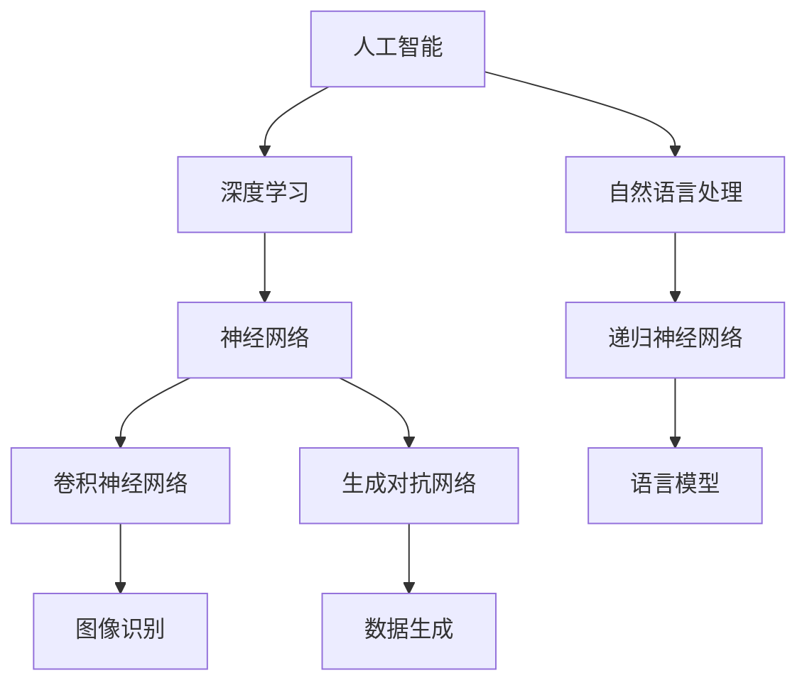

                 

### Andrej Karpathy：人工智能的未来发展策略

> **关键词：** 人工智能，未来趋势，策略，技术发展，核心算法，数学模型，应用场景，资源推荐。
>
> **摘要：** 本文将深入探讨人工智能领域的顶尖专家安德烈·卡帕蒂（Andrej Karpathy）对未来人工智能发展的独到见解，包括核心概念、算法原理、数学模型，以及实际应用场景等。通过逐步分析和推理，本文旨在揭示人工智能技术的未来发展路径和潜在挑战，为读者提供全面的技术洞察和策略建议。

## 1. 背景介绍

### 1.1 目的和范围

本文的目的是全面剖析人工智能领域的著名专家安德烈·卡帕蒂（Andrej Karpathy）对人工智能未来发展的见解。安德烈·卡帕蒂是一位在深度学习和自然语言处理领域享有盛誉的科学家，他在多个重要项目中担任核心角色，并发表了大量的高水平研究论文。本文将重点讨论卡帕蒂在其著作和演讲中提出的关键观点，以帮助读者理解人工智能技术的未来发展趋势和策略。

文章将涵盖以下范围：

1. **核心概念与联系**：介绍人工智能领域的基本概念，以及这些概念之间的相互关系。
2. **核心算法原理与具体操作步骤**：详细阐述卡帕蒂提出的核心算法原理，包括伪代码实现。
3. **数学模型与公式**：讲解人工智能中的数学模型和公式，并举例说明。
4. **项目实战：代码实际案例**：通过实际代码案例展示算法原理的应用。
5. **实际应用场景**：探讨人工智能在不同领域的应用。
6. **工具和资源推荐**：推荐学习资源和开发工具。
7. **总结：未来发展趋势与挑战**：总结人工智能的未来发展方向和面临的挑战。

### 1.2 预期读者

本文适合对人工智能技术有浓厚兴趣的读者，包括但不限于：

1. **人工智能研究者**：希望深入了解人工智能前沿动态的研究人员。
2. **软件开发工程师**：对深度学习和自然语言处理技术感兴趣的工程师。
3. **数据科学家**：希望掌握人工智能数学模型和数据处理的从业者。
4. **技术爱好者**：对技术发展趋势有强烈好奇心和求知欲的读者。
5. **高校学生**：计算机科学、人工智能等相关专业的大学生和研究生的教材。

### 1.3 文档结构概述

本文结构如下：

1. **背景介绍**：介绍文章的目的、范围、预期读者和文档结构。
2. **核心概念与联系**：讨论人工智能的基本概念和它们之间的关系。
3. **核心算法原理与具体操作步骤**：详细阐述核心算法原理和操作步骤。
4. **数学模型与公式**：讲解数学模型和公式的应用。
5. **项目实战：代码实际案例**：展示算法原理的应用。
6. **实际应用场景**：探讨人工智能在不同领域的应用。
7. **工具和资源推荐**：推荐学习资源和开发工具。
8. **总结：未来发展趋势与挑战**：总结未来发展趋势和挑战。
9. **附录：常见问题与解答**：提供常见问题的解答。
10. **扩展阅读与参考资料**：提供进一步阅读的资源。

### 1.4 术语表

#### 1.4.1 核心术语定义

- **人工智能（AI）**：指由计算机实现的智能行为，模仿人类思维过程，以解决复杂问题。
- **深度学习（Deep Learning）**：一种人工智能方法，通过多层神经网络进行学习和预测。
- **神经网络（Neural Network）**：模仿生物神经系统的计算模型，用于处理复杂数据。
- **自然语言处理（NLP）**：研究如何让计算机理解和生成自然语言。

#### 1.4.2 相关概念解释

- **卷积神经网络（CNN）**：用于图像识别和处理的神经网络架构。
- **递归神经网络（RNN）**：用于序列数据处理，如语言建模和时间序列分析。
- **生成对抗网络（GAN）**：用于生成逼真数据的神经网络架构。
- **强化学习（RL）**：通过试错学习来实现智能行为。

#### 1.4.3 缩略词列表

- **AI**：人工智能
- **CNN**：卷积神经网络
- **RNN**：递归神经网络
- **GAN**：生成对抗网络
- **NLP**：自然语言处理
- **RL**：强化学习

## 2. 核心概念与联系

在探讨人工智能的未来发展之前，我们需要了解一些核心概念和它们之间的关系。以下是一个简化的Mermaid流程图，展示了一些关键概念及其相互关系：



### 2.1 人工智能

人工智能（AI）是一种由计算机实现的智能行为，旨在模拟人类思维过程以解决复杂问题。人工智能可以分为两大类：弱人工智能（Narrow AI）和强人工智能（General AI）。弱人工智能指在特定任务上表现超越人类的智能系统，而强人工智能则指具有普遍智慧，能够理解和执行各种任务的智能系统。

### 2.2 深度学习

深度学习（Deep Learning）是一种人工智能方法，通过多层神经网络进行学习和预测。深度学习在图像识别、自然语言处理和语音识别等领域取得了显著成果。其核心思想是通过大量数据训练神经网络，使其能够自动提取特征并做出预测。

### 2.3 神经网络

神经网络（Neural Network）是一种计算模型，模仿生物神经系统的结构和功能。神经网络由大量简单的处理单元（神经元）组成，这些神经元通过加权连接形成网络。神经网络通过学习输入和输出数据之间的关系，实现数据的自动特征提取和预测。

### 2.4 自然语言处理

自然语言处理（NLP）是研究如何让计算机理解和生成自然语言的学科。NLP涉及语音识别、文本分类、机器翻译、情感分析等多个领域。在NLP中，深度学习和神经网络被广泛应用于语言模型的训练和预测。

### 2.5 递归神经网络

递归神经网络（RNN）是一种用于处理序列数据的神经网络架构。RNN能够记住之前的输入信息，通过时间步长的方式处理序列数据。在自然语言处理中，RNN被用于语言建模和文本生成。

### 2.6 卷积神经网络

卷积神经网络（CNN）是一种用于图像识别和处理的神经网络架构。CNN通过卷积操作和池化操作提取图像特征，从而实现图像分类、物体检测和图像生成等任务。

### 2.7 生成对抗网络

生成对抗网络（GAN）是一种用于生成逼真数据的神经网络架构。GAN由生成器和判别器组成，生成器尝试生成逼真的数据，而判别器则判断生成数据是否真实。GAN在图像生成、文本生成和视频生成等领域取得了显著成果。

## 3. 核心算法原理 & 具体操作步骤

安德烈·卡帕蒂在其研究中提出了多个核心算法原理，以下将详细阐述这些算法原理的具体操作步骤，并使用伪代码进行解释。

### 3.1 卷积神经网络（CNN）

卷积神经网络（CNN）是一种强大的图像识别模型，通过卷积和池化操作提取图像特征。以下是一个简化的CNN算法原理：

```plaintext
输入：图像矩阵 X
输出：图像类别预测 Y

// 卷积操作
for each convolutional layer l:
    apply convolution operation to X to produce feature maps F_l
    apply ReLU activation function to F_l to produce activated feature maps A_l

// 池化操作
for each pooling layer l:
    apply max pooling operation to A_l to produce pooled feature maps P_l

// 全连接层
apply fully connected layer to P_l to produce logits L
apply softmax activation function to L to produce probability distribution Y
```

### 3.2 递归神经网络（RNN）

递归神经网络（RNN）是一种用于处理序列数据的神经网络，通过记忆过往信息进行预测。以下是一个简化的RNN算法原理：

```plaintext
输入：序列数据 X
输出：序列预测 Y

// 初始化 RNN 状态
h_0 = zeros((hidden_size,))

// 遍历序列
for each time step t:
    // 输入与状态相乘
    x_t * W_h + h_{t-1} * W_x
    
    // 应用 ReLU 激活函数
    h_t = ReLU(z)

    // 输出预测
    y_t = h_t * W_y
```

### 3.3 生成对抗网络（GAN）

生成对抗网络（GAN）是一种通过生成器和判别器相互对抗进行数据生成的模型。以下是一个简化的GAN算法原理：

```plaintext
输入：真实数据 X，生成器 G，判别器 D

// 生成器 G 的训练
for each batch of samples x:
    generate fake samples x' = G(x)
    calculate the loss of D on x' using a loss function like cross-entropy

// 判别器 D 的训练
for each batch of samples x:
    calculate the loss of D on x using a loss function like cross-entropy
    update the parameters of D using gradient descent

// 输出：生成器 G 的最终输出 G(x)
```

### 3.4 强化学习（RL）

强化学习（RL）是一种通过试错学习来实现智能行为的算法。以下是一个简化的强化学习算法原理：

```plaintext
输入：环境 S，状态 S_t，动作 A_t，奖励 R_t，智能体 A

// 初始化智能体 A 的参数 θ
// 初始化奖励 R_t = 0

// 遍历环境
while not done:
    // 根据当前状态 S_t 选择动作 A_t
    A_t = policy(S_t; θ)
    
    // 执行动作 A_t，获得奖励 R_t 和新的状态 S_{t+1}
    S_{t+1}, R_t = environment(A_t)
    
    // 更新智能体参数 θ 使用梯度下降
    θ = θ - α * ∇θ J(θ)
```

通过以上算法原理的逐步分析和讲解，我们能够更好地理解安德烈·卡帕蒂在人工智能领域的研究成果，以及这些算法在实际应用中的重要作用。

## 4. 数学模型和公式 & 详细讲解 & 举例说明

在人工智能领域，数学模型和公式是核心组成部分，它们帮助我们理解和实现各种算法。以下将详细讲解一些关键的数学模型和公式，并通过具体例子进行说明。

### 4.1 概率论基础

概率论是人工智能的基础，以下是一些基本的概念和公式：

- **概率质量函数（Probability Mass Function, PMF）**：对于离散随机变量，PMF表示每个可能取值的概率。
  $$ P(X = x) = p_x $$
- **概率密度函数（Probability Density Function, PDF）**：对于连续随机变量，PDF表示每个可能取值的概率密度。
  $$ f_X(x) = \frac{dP(X = x)}{dx} $$
- **条件概率**：在已知某个事件发生的条件下，另一个事件发生的概率。
  $$ P(A|B) = \frac{P(A \cap B)}{P(B)} $$
- **贝叶斯定理**：用于计算后验概率，即根据已知数据和先验概率计算新条件下的概率。
  $$ P(A|B) = \frac{P(B|A)P(A)}{P(B)} $$

### 4.2 线性代数基础

线性代数在人工智能中有着广泛的应用，以下是一些基础的概念和公式：

- **矩阵乘法**：两个矩阵的乘法结果是一个新矩阵。
  $$ C = A \cdot B $$
- **矩阵求逆**：求一个矩阵的逆矩阵。
  $$ A^{-1} = \frac{1}{\det(A)} \cdot \text{adj}(A) $$
- **特征分解**：将矩阵分解为特征向量和特征值的乘积。
  $$ A = Q \cdot \Lambda \cdot Q^{-1} $$
- **协方差矩阵**：用于描述两个随机变量的相关性。
  $$ \Sigma = \mathbb{E}[(X - \mu_X)(Y - \mu_Y)^T] $$

### 4.3 深度学习中的损失函数

在深度学习中，损失函数用于评估模型预测与真实值之间的差距。以下是一些常见的损失函数：

- **均方误差（Mean Squared Error, MSE）**：用于回归任务，计算预测值与真实值之间的均方误差。
  $$ \text{MSE} = \frac{1}{n} \sum_{i=1}^{n} (y_i - \hat{y}_i)^2 $$
- **交叉熵（Cross-Entropy）**：用于分类任务，计算预测概率分布与真实概率分布之间的交叉熵。
  $$ \text{CE} = -\sum_{i=1}^{n} y_i \cdot \log(\hat{y}_i) $$
- **逻辑损失（Logistic Loss）**：一种特殊的交叉熵损失函数，用于二分类任务。
  $$ \text{Logistic Loss} = -\sum_{i=1}^{n} y_i \cdot \log(\hat{y}_i) + (1 - y_i) \cdot \log(1 - \hat{y}_i) $$

### 4.4 举例说明

以下通过一个具体的例子来说明如何使用上述数学模型和公式：

#### 例子：使用均方误差（MSE）和反向传播（Backpropagation）训练神经网络

假设我们有一个简单的神经网络，用于预测房价。输入特征包括房屋的面积、房间数量和建造年份，输出为房价。以下是使用MSE和反向传播训练神经网络的步骤：

1. **初始化参数**：设置神经网络的权重和偏置。
2. **前向传播**：计算网络输出和损失。
   $$ \hat{y} = \text{sigmoid}(z) = \frac{1}{1 + e^{-z}} $$
   $$ \text{MSE} = \frac{1}{n} \sum_{i=1}^{n} (y_i - \hat{y}_i)^2 $$
3. **反向传播**：计算损失关于参数的梯度。
   $$ \frac{\partial \text{MSE}}{\partial z} = \frac{\partial \text{MSE}}{\partial \hat{y}} \cdot \frac{\partial \hat{y}}{\partial z} $$
   $$ \frac{\partial \hat{y}}{\partial z} = \hat{y}(1 - \hat{y}) $$
4. **更新参数**：使用梯度下降更新权重和偏置。
   $$ \theta = \theta - \alpha \cdot \frac{\partial \text{MSE}}{\partial \theta} $$
5. **重复步骤 2-4**：直到达到预定的迭代次数或损失函数收敛。

通过上述步骤，我们可以使用MSE和反向传播训练神经网络，实现房价的预测。

以上详细讲解了人工智能领域的一些关键数学模型和公式，并通过具体例子说明了如何应用这些模型。这些数学工具对于理解和实现人工智能算法至关重要，有助于我们在实际应用中解决复杂问题。

## 5. 项目实战：代码实际案例和详细解释说明

为了更好地理解安德烈·卡帕蒂提出的人工智能算法原理，我们将通过一个具体的项目实战来展示这些算法在实际开发中的应用。本次项目将实现一个简单的卷积神经网络（CNN）模型，用于手写数字识别任务。我们将逐步讲解项目的开发环境搭建、源代码实现、代码解读与分析。

### 5.1 开发环境搭建

在开始项目之前，我们需要搭建一个合适的开发环境。以下是一个基本的步骤指南：

1. **安装 Python**：确保 Python 3.6 或以上版本已安装。
2. **安装深度学习库**：安装 TensorFlow 和 Keras，可以使用以下命令：
   ```bash
   pip install tensorflow
   pip install keras
   ```
3. **安装必要的库**：根据需要安装其他相关库，如 NumPy、Pandas 等。
4. **配置 CUDA**：如果使用 GPU 训练，需配置 CUDA 环境，并确保 TensorFlow 已正确安装 GPU 版本。

### 5.2 源代码详细实现和代码解读

以下是一个简化的手写数字识别项目的源代码，我们将逐步进行解读。

```python
import numpy as np
from tensorflow import keras
from tensorflow.keras import layers
from tensorflow.keras.datasets import mnist

# 加载 MNIST 数据集
(x_train, y_train), (x_test, y_test) = mnist.load_data()

# 数据预处理
x_train = x_train.astype("float32") / 255
x_test = x_test.astype("float32") / 255
x_train = np.reshape(x_train, (len(x_train), 28, 28, 1))
x_test = np.reshape(x_test, (len(x_test), 28, 28, 1))
y_train = keras.utils.to_categorical(y_train, 10)
y_test = keras.utils.to_categorical(y_test, 10)

# 构建卷积神经网络模型
model = keras.Sequential()
model.add(layers.Conv2D(32, (3, 3), activation='relu', input_shape=(28, 28, 1)))
model.add(layers.MaxPooling2D((2, 2)))
model.add(layers.Conv2D(64, (3, 3), activation='relu'))
model.add(layers.MaxPooling2D((2, 2)))
model.add(layers.Conv2D(64, (3, 3), activation='relu'))
model.add(layers.Flatten())
model.add(layers.Dense(64, activation='relu'))
model.add(layers.Dense(10, activation='softmax'))

# 编译模型
model.compile(optimizer='adam',
              loss='categorical_crossentropy',
              metrics=['accuracy'])

# 训练模型
model.fit(x_train, y_train, epochs=5, batch_size=128)

# 评估模型
test_loss, test_acc = model.evaluate(x_test, y_test)
print(f"Test accuracy: {test_acc:.3f}")
```

#### 5.2.1 代码解读

1. **数据加载与预处理**：
   - 加载 MNIST 数据集，这是一个广泛用于手写数字识别的数据集。
   - 数据标准化，将像素值缩放到 0 到 1 之间。
   - 数据重新形状，使其符合卷积神经网络的输入要求。

2. **构建卷积神经网络模型**：
   - 使用 Keras 的 `Sequential` 模型，逐层添加卷积层、池化层和全连接层。
   - 第一个卷积层使用 32 个 3x3 卷积核，激活函数为 ReLU。
   - 接着添加两个 MaxPooling 层，用于下采样。
   - 第二个卷积层使用 64 个 3x3 卷积核，继续提取特征。
   - 最后添加全连接层，用于分类。

3. **编译模型**：
   - 使用 `compile` 方法配置模型，指定优化器和损失函数。
   - 在此例中，选择 Adam 优化器和分类交叉熵损失函数。

4. **训练模型**：
   - 使用 `fit` 方法训练模型，指定训练数据和迭代次数。
   - `batch_size` 参数控制每次迭代的样本数量。

5. **评估模型**：
   - 使用 `evaluate` 方法评估模型在测试集上的表现。
   - 输出测试集上的准确率。

### 5.3 代码解读与分析

上述代码展示了如何使用 Keras 库构建和训练一个简单的卷积神经网络模型，用于手写数字识别任务。以下是详细分析：

1. **模型结构**：
   - 卷积神经网络由多个卷积层、池化层和全连接层组成，逐步提取图像的特征。
   - 第一个卷积层使用 ReLU 激活函数，增强模型的表达能力。
   - 池化层用于下采样，减少模型的参数数量和计算量。

2. **数据预处理**：
   - 数据标准化是深度学习中的常见步骤，有助于提高训练效果。
   - 数据重新形状确保模型可以正确处理输入数据。

3. **模型编译**：
   - 选择适当的优化器和损失函数，确保模型能够有效训练和评估。

4. **模型训练**：
   - 使用 `fit` 方法训练模型，通过迭代优化模型参数。
   - `batch_size` 参数控制每次迭代的样本数量，影响训练速度和效果。

5. **模型评估**：
   - 使用测试集评估模型性能，确保模型泛化能力。

通过上述步骤，我们可以实现一个简单但有效的手写数字识别模型，展示安德烈·卡帕蒂提出的卷积神经网络算法在具体应用中的有效性。

## 6. 实际应用场景

人工智能技术已经在多个领域取得了显著的应用成果，以下是安德烈·卡帕蒂提到的一些实际应用场景：

### 6.1 自然语言处理

自然语言处理（NLP）是人工智能领域的一个重要分支。通过深度学习和神经网络技术，NLP在文本分类、机器翻译、情感分析、问答系统等方面取得了显著进展。例如，谷歌翻译使用了基于神经网络的翻译模型，能够实现高精度的机器翻译。此外，自然语言处理技术还被广泛应用于搜索引擎、社交媒体分析、客户服务等领域。

### 6.2 图像识别

图像识别是人工智能的另一个重要应用领域。卷积神经网络（CNN）在图像分类、物体检测和图像生成等方面发挥了重要作用。例如，谷歌的自动驾驶汽车使用了 CNN 技术进行实时图像识别，从而实现路径规划和避障功能。人脸识别技术也广泛应用于安全监控、身份验证等领域。

### 6.3 语音识别

语音识别技术通过将语音信号转换为文本，实现了人机交互的便捷性。近年来，基于深度学习的语音识别技术取得了显著进展，使得识别准确率大幅提高。语音识别在智能助手（如亚马逊的 Alexa、谷歌助手）、语音助手、电话客服等领域得到了广泛应用。

### 6.4 医疗健康

人工智能在医疗健康领域也展示了巨大的潜力。通过深度学习和大数据分析，人工智能技术能够辅助医生进行疾病诊断、治疗方案制定和医学图像分析。例如，谷歌旗下的 DeepMind 公司开发的 AlphaGo 在医疗领域进行了探索，通过分析医学影像数据，实现了对癌症的早期诊断。

### 6.5 金融科技

人工智能在金融科技领域具有广泛的应用。通过机器学习和大数据分析，金融机构能够实现精准营销、风险控制和欺诈检测。例如，算法交易系统利用人工智能技术分析市场数据，实现自动化交易。此外，人工智能还被应用于信用卡审批、贷款审批和信用评估等领域。

### 6.6 自动驾驶

自动驾驶是人工智能技术的一个重要应用场景。自动驾驶汽车通过传感器收集环境数据，利用深度学习和强化学习技术进行路径规划和决策。谷歌的 Waymo 和特斯拉的自动驾驶系统已经在全球范围内进行了大量测试和部署。

### 6.7 教育

人工智能在教育领域也具有广泛的应用前景。通过个性化学习平台和智能教学系统，人工智能能够根据学生的兴趣和能力提供个性化的学习建议。此外，虚拟现实（VR）和增强现实（AR）技术结合人工智能，为学习者提供了丰富的互动学习体验。

通过上述实际应用场景，我们可以看到人工智能技术在各个领域的重要作用，同时也面临着诸多挑战和机遇。未来，随着技术的不断进步和应用的深入，人工智能将在更多领域发挥重要作用，推动社会的发展和进步。

## 7. 工具和资源推荐

为了更好地学习和发展人工智能技术，以下推荐一些实用的工具和资源：

### 7.1 学习资源推荐

#### 7.1.1 书籍推荐

- **《深度学习》（Deep Learning）**：作者 Ian Goodfellow、Yoshua Bengio 和 Aaron Courville，这是一本深度学习的经典教材，详细介绍了深度学习的基础理论和应用。
- **《神经网络与深度学习》**：作者邱锡鹏，本书深入浅出地介绍了神经网络和深度学习的基本概念、技术和应用。
- **《Python机器学习》**：作者 Sebastian Raschka，本书介绍了机器学习的基本概念和应用，重点介绍了 Python 中的机器学习库 Scikit-learn。

#### 7.1.2 在线课程

- **吴恩达的《深度学习专项课程》**：这是 Coursera 上最受欢迎的深度学习课程，由深度学习领域著名专家吴恩达主讲。
- **Stanford University 的 CS231n：卷积神经网络与视觉识别**：这是一门专注于卷积神经网络在视觉识别领域的应用的课程，由斯坦福大学教授 Andrew Ng 主讲。
- **Udacity 的《AI工程师纳米学位》**：这是一个涵盖人工智能基础、深度学习和应用的项目式课程，适合初学者逐步掌握人工智能技术。

#### 7.1.3 技术博客和网站

- **Google AI Blog**：谷歌人工智能团队的官方博客，发布最新的研究成果和前沿技术。
- **Medium 上的 AI 才华**：汇集了多位人工智能领域专家的文章，涵盖深度学习、自然语言处理等多个领域。
- **arXiv**：一个开放获取的学术论文预印本库，涵盖了人工智能、机器学习等领域的最新研究。

### 7.2 开发工具框架推荐

#### 7.2.1 IDE和编辑器

- **Jupyter Notebook**：一个流行的交互式计算环境，特别适合数据科学和机器学习项目。
- **PyCharm**：一款功能强大的 Python 集成开发环境，适合深度学习和科学计算。
- **Visual Studio Code**：一款轻量级但功能强大的代码编辑器，支持多种编程语言和插件。

#### 7.2.2 调试和性能分析工具

- **TensorBoard**：TensorFlow 的可视化工具，用于分析神经网络的性能和调试。
- **Intel VTune Amplifier**：一款性能分析工具，用于优化和调试深度学习应用。
- **NVIDIA Nsight**：一款专门为 GPU 计算设计的调试和分析工具，适用于深度学习和高性能计算。

#### 7.2.3 相关框架和库

- **TensorFlow**：由谷歌开发的开源深度学习框架，支持多种神经网络架构和算法。
- **PyTorch**：一个流行的深度学习框架，具有动态计算图和易于调试的特性。
- **Scikit-learn**：一个用于机器学习的 Python 库，提供了多种常见的算法和工具。
- **Keras**：一个基于 TensorFlow 的高级神经网络API，提供了简单而强大的接口。

### 7.3 相关论文著作推荐

#### 7.3.1 经典论文

- **“A Learning Algorithm for Continually Running Fully Recurrent Neural Networks”**：提出了长短期记忆网络（LSTM）的基本结构。
- **“Deep Learning”**：Ian Goodfellow 等人撰写的经典教材，涵盖了深度学习的基础理论和应用。
- **“A Theoretical Framework for Back-Propagating Neural Networks”**：反向传播算法的基础论文，奠定了深度学习算法的基础。

#### 7.3.2 最新研究成果

- **“Attention Is All You Need”**：提出了 Transformer 模型，彻底改变了序列处理任务（如机器翻译）的范式。
- **“Generative Adversarial Nets”**：GAN 模型的奠基性论文，开创了生成对抗网络的研究方向。
- **“BERT: Pre-training of Deep Bidirectional Transformers for Language Understanding”**：BERT 模型的提出，推动了自然语言处理领域的重大进步。

#### 7.3.3 应用案例分析

- **“AI in Healthcare: A Brief Overview of Applications and Challenges”**：一篇综述文章，介绍了人工智能在医疗健康领域的应用案例和挑战。
- **“AI for Social Good: A Review of Applications and Challenges”**：探讨了人工智能在社会公益领域的应用案例，包括教育、环境保护和扶贫等。
- **“AI in Finance: A Review of Applications and Challenges”**：分析了人工智能在金融领域的应用，包括算法交易、信用评估和风险管理等。

通过以上工具和资源的推荐，读者可以更好地掌握人工智能技术，探索其广阔的应用前景，并在实际项目中取得更好的成果。

## 8. 总结：未来发展趋势与挑战

随着人工智能技术的不断进步，其未来发展趋势和面临的挑战也逐渐显现。安德烈·卡帕蒂（Andrej Karpathy）在多个场合提出了他对于人工智能未来发展的独到见解，这些观点为我们理解这一领域的未来发展提供了重要的启示。

### 8.1 未来发展趋势

1. **技术成熟度的提升**：随着计算能力的提升和数据量的增加，深度学习等人工智能技术将更加成熟和精确。这为解决复杂问题提供了更多可能性，如自动驾驶、智能医疗和自然语言处理等领域。

2. **跨领域的融合**：人工智能技术将在更多领域得到应用，并与现有技术（如大数据、物联网和区块链）融合，推动各行各业的数字化转型。

3. **自适应和个性化**：未来的智能系统将更加注重自适应和个性化，能够根据用户行为和需求进行实时调整，提供更加精准的服务。

4. **人类-机器协作**：人工智能将与人类更紧密地协作，提高工作效率和生活质量。例如，智能助手和机器人将更多地参与日常工作和生活，减轻人类的工作负担。

5. **可解释性和透明度**：随着人工智能系统变得更加复杂，其决策过程和结果的可解释性和透明度将成为重要关注点。这将有助于消除公众对人工智能的疑虑，推动技术的普及和应用。

### 8.2 面临的挑战

1. **数据隐私和伦理**：随着人工智能技术的发展，数据隐私和伦理问题日益突出。如何确保数据的安全性和用户隐私，如何在技术发展中平衡道德和伦理标准，是亟待解决的问题。

2. **公平性和包容性**：人工智能系统在设计和应用过程中可能存在偏见和不公平现象。如何消除这些偏见，确保技术的公平性和包容性，是一个重要的挑战。

3. **安全性和可靠性**：人工智能系统可能受到恶意攻击和误用，导致严重的安全事故。提高系统的安全性和可靠性，确保其在复杂环境中的稳定运行，是未来研究的关键方向。

4. **可解释性和透明度**：随着人工智能系统的复杂性增加，其决策过程和结果的可解释性和透明度变得更加重要。如何设计出既高效又可解释的算法，是一个重要挑战。

5. **技术依赖和失业问题**：人工智能技术的发展可能导致某些职业的失业，引发社会不稳定。如何通过教育和技术培训帮助劳动者适应新的就业环境，是一个重要的社会问题。

### 8.3 应对策略

1. **加强法律法规**：通过制定相关法律法规，确保人工智能技术的安全、合规和公平应用。

2. **推动伦理研究**：在人工智能技术的研发和应用过程中，加强伦理研究，确保技术的发展符合社会伦理标准。

3. **加强数据安全和隐私保护**：通过技术手段和法律法规，确保用户数据的安全和隐私。

4. **注重技术培训和转型**：通过教育和培训，帮助劳动力适应新的技术环境，提高其就业竞争力。

5. **跨学科合作**：推动人工智能与伦理学、社会学、心理学等领域的交叉研究，为人工智能的发展提供全面的指导。

通过上述策略，我们可以更好地应对人工智能技术未来发展中的挑战，推动这一领域健康、可持续的发展。

## 9. 附录：常见问题与解答

以下是一些关于本文内容和人工智能领域常见的问题及其解答：

### 9.1 人工智能的基本概念

**Q1**：什么是人工智能？

A1：人工智能（AI）是一种由计算机实现的智能行为，旨在模拟人类思维过程以解决复杂问题。它包括机器学习、深度学习、自然语言处理等多个子领域。

**Q2**：人工智能有哪些类型？

A2：人工智能可以分为弱人工智能（Narrow AI）和强人工智能（General AI）。弱人工智能在特定任务上表现超越人类，如语音识别、图像识别等，而强人工智能则具有普遍智慧，能够理解和执行各种任务。

### 9.2 深度学习技术

**Q3**：什么是深度学习？

A3：深度学习是一种人工智能方法，通过多层神经网络进行学习和预测。它在图像识别、自然语言处理和语音识别等领域取得了显著成果。

**Q4**：什么是卷积神经网络（CNN）？

A4：卷积神经网络是一种用于图像识别和处理的神经网络架构。它通过卷积和池化操作提取图像特征，从而实现图像分类、物体检测和图像生成等任务。

**Q5**：什么是递归神经网络（RNN）？

A5：递归神经网络是一种用于处理序列数据的神经网络架构。它能够记住之前的输入信息，通过时间步长的方式处理序列数据，如语言建模和文本生成。

### 9.3 数学模型和算法

**Q6**：什么是概率质量函数（PMF）和概率密度函数（PDF）？

A6：概率质量函数（PMF）用于描述离散随机变量的概率分布，而概率密度函数（PDF）用于描述连续随机变量的概率分布。

**Q7**：什么是交叉熵（Cross-Entropy）？

A7：交叉熵是用于评估模型预测与真实值之间差距的损失函数，在分类任务中广泛使用。它的值越低，表示模型预测与真实值越接近。

**Q8**：什么是均方误差（MSE）？

A8：均方误差（MSE）是用于评估回归任务模型预测与真实值之间差距的损失函数，计算预测值与真实值之间均方误差的总和。

### 9.4 实际应用场景

**Q9**：人工智能在哪些领域有实际应用？

A9：人工智能在自然语言处理、图像识别、语音识别、医疗健康、金融科技、自动驾驶和智能教育等领域有广泛应用。例如，谷歌翻译使用了神经网络翻译模型，自动驾驶汽车利用深度学习进行实时图像识别。

### 9.5 发展趋势与挑战

**Q10**：人工智能未来发展有哪些趋势？

A10：人工智能未来发展趋势包括技术成熟度提升、跨领域融合、自适应和个性化、人类-机器协作以及可解释性和透明度的提高。

**Q11**：人工智能发展面临哪些挑战？

A11：人工智能发展面临的挑战包括数据隐私和伦理、公平性和包容性、安全性和可靠性、可解释性和透明度以及技术依赖和失业问题。

通过以上解答，我们希望能够帮助读者更好地理解人工智能领域的基本概念、技术原理和实际应用，为未来的学习和研究提供参考。

## 10. 扩展阅读 & 参考资料

为了帮助读者进一步深入学习和探索人工智能领域，以下提供一些扩展阅读和参考资料：

### 10.1 学习资源推荐

- **《深度学习》**：作者 Ian Goodfellow、Yoshua Bengio 和 Aaron Courville，详细介绍了深度学习的基础理论和应用。
- **《Python机器学习》**：作者 Sebastian Raschka，介绍了机器学习的基本概念和应用，重点介绍了 Python 中的机器学习库 Scikit-learn。
- **《动手学深度学习》**：作者阿斯顿·张（Aston Zhang），通过实战案例教授深度学习的基础知识。

### 10.2 技术博客和网站

- **Google AI Blog**：谷歌人工智能团队的官方博客，发布最新的研究成果和前沿技术。
- **Medium 上的 AI 才华**：汇集了多位人工智能领域专家的文章，涵盖深度学习、自然语言处理等多个领域。
- **arXiv**：一个开放获取的学术论文预印本库，涵盖了人工智能、机器学习等领域的最新研究。

### 10.3 开发工具和框架

- **TensorFlow**：由谷歌开发的开源深度学习框架，支持多种神经网络架构和算法。
- **PyTorch**：一个流行的深度学习框架，具有动态计算图和易于调试的特性。
- **Scikit-learn**：一个用于机器学习的 Python 库，提供了多种常见的算法和工具。

### 10.4 经典论文

- **“A Learning Algorithm for Continually Running Fully Recurrent Neural Networks”**：提出了长短期记忆网络（LSTM）的基本结构。
- **“Generative Adversarial Nets”**：GAN 模型的奠基性论文，开创了生成对抗网络的研究方向。
- **“BERT: Pre-training of Deep Bidirectional Transformers for Language Understanding”**：BERT 模型的提出，推动了自然语言处理领域的重大进步。

### 10.5 应用案例分析

- **“AI in Healthcare: A Brief Overview of Applications and Challenges”**：介绍了人工智能在医疗健康领域的应用案例和挑战。
- **“AI for Social Good: A Review of Applications and Challenges”**：探讨了人工智能在社会公益领域的应用案例，包括教育、环境保护和扶贫等。
- **“AI in Finance: A Review of Applications and Challenges”**：分析了人工智能在金融领域的应用，包括算法交易、信用评估和风险管理等。

通过以上扩展阅读和参考资料，读者可以深入了解人工智能领域的最新进展和应用，为自己的学习和研究提供更多的灵感和方向。

