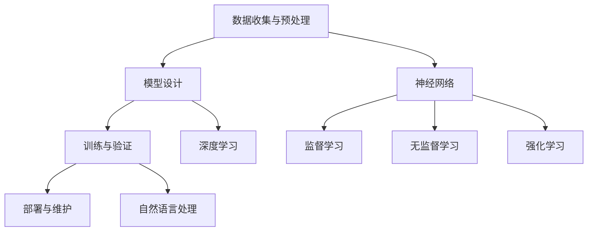

                 

### 文章标题

# Andrej Karpathy：人工智能的未来发展规划

### 文章关键词
- 人工智能
- 未来趋势
- 技术发展规划
- 算法创新
- 应用场景

### 文章摘要
本文旨在探讨人工智能（AI）领域的未来发展趋势和规划，特别是在技术发展、算法创新和实际应用场景方面的前景。通过对安德烈·卡帕西（Andrej Karpathy）的研究和观点的深入分析，本文提出了人工智能在未来的潜在发展方向，探讨了可能面临的技术挑战，并提出了相应的解决方案。本文还将介绍一系列关键算法原理、数学模型和实际应用案例，帮助读者更好地理解人工智能技术的本质和应用。

## 1. 背景介绍

### 1.1 目的和范围
本文的主要目的是探讨人工智能（AI）领域的未来发展规划，特别是技术路线图、算法创新和应用场景的潜在趋势。通过分析安德烈·卡帕西（Andrej Karpathy）的研究和见解，本文试图为读者提供一种全面、深入理解人工智能未来发展的视角。

### 1.2 预期读者
本文面向对人工智能领域有一定了解的技术专家、学者和研究人员，以及对未来技术趋势感兴趣的普通读者。特别是那些希望了解人工智能在未来可能的应用场景和面临的挑战的人。

### 1.3 文档结构概述
本文分为十个主要部分：

1. **背景介绍**：包括文章的目的、范围、预期读者和文档结构概述。
2. **核心概念与联系**：介绍人工智能的核心概念、原理和架构。
3. **核心算法原理 & 具体操作步骤**：详细讲解人工智能关键算法的原理和操作步骤。
4. **数学模型和公式 & 详细讲解 & 举例说明**：介绍人工智能相关的数学模型和公式，并通过实际案例进行说明。
5. **项目实战：代码实际案例和详细解释说明**：提供实际代码案例和详细解释。
6. **实际应用场景**：探讨人工智能在不同领域的应用。
7. **工具和资源推荐**：推荐学习资源、开发工具和框架。
8. **总结：未来发展趋势与挑战**：总结未来发展趋势和面临的挑战。
9. **附录：常见问题与解答**：解答读者可能遇到的问题。
10. **扩展阅读 & 参考资料**：提供扩展阅读和参考资料。

### 1.4 术语表

#### 1.4.1 核心术语定义

- **人工智能（AI）**：一种模拟人类智能的技术，通过算法和模型实现机器学习和推理。
- **神经网络**：一种模拟人脑结构的计算模型，用于处理和分析数据。
- **深度学习**：一种基于神经网络的机器学习技术，通过多层的神经网络进行特征提取和学习。
- **机器学习**：一种使机器能够从数据中学习并做出预测的技术。
- **算法**：解决问题的步骤和规则，用于指导计算机执行特定任务。

#### 1.4.2 相关概念解释

- **监督学习**：一种机器学习方法，通过已标记的数据来训练模型。
- **无监督学习**：一种机器学习方法，不使用已标记的数据，而是从未标记的数据中学习。
- **强化学习**：一种机器学习方法，通过试错和奖励机制来训练模型。
- **自然语言处理（NLP）**：一种人工智能技术，用于处理和生成自然语言。

#### 1.4.3 缩略词列表

- **AI**：人工智能
- **NLP**：自然语言处理
- **ML**：机器学习
- **DL**：深度学习
- **GPU**：图形处理单元

## 2. 核心概念与联系

人工智能是当今技术领域的热门话题，其核心概念和联系如下：

### 人工智能的核心概念

1. **机器学习（ML）**：机器学习是人工智能的核心组成部分，它使计算机能够从数据中学习并做出预测或决策。机器学习可以分为三种主要类型：监督学习、无监督学习和强化学习。

2. **神经网络（NN）**：神经网络是一种模拟人脑结构的计算模型，它通过多个层进行特征提取和学习。深度学习是神经网络的一种特殊形式，通过多层神经网络进行特征提取和学习。

3. **深度学习（DL）**：深度学习是一种基于神经网络的机器学习技术，通过多层神经网络进行特征提取和学习。深度学习在图像识别、语音识别和自然语言处理等领域取得了显著进展。

4. **自然语言处理（NLP）**：自然语言处理是一种人工智能技术，用于处理和生成自然语言。NLP在机器翻译、情感分析和文本分类等领域有广泛应用。

### 人工智能的架构

人工智能的架构通常包括以下几个主要部分：

1. **数据收集与预处理**：数据是机器学习的基石。收集和处理数据是人工智能项目的第一步，包括数据清洗、数据预处理和数据增强。

2. **模型设计**：模型设计是人工智能的核心，包括选择合适的神经网络架构、调整网络参数和优化算法。

3. **训练与验证**：模型训练是使用大量数据进行迭代学习的过程。训练过程中，模型会通过优化算法不断调整参数，以最小化预测误差。验证是评估模型性能的过程，包括交叉验证和超参数调整。

4. **部署与维护**：模型部署是将训练好的模型应用到实际场景的过程。模型部署后，需要进行监控和更新，以确保其稳定性和准确性。

### Mermaid 流程图

以下是一个简化的 Mermaid 流程图，展示了人工智能的核心概念和架构：



## 3. 核心算法原理 & 具体操作步骤

在人工智能领域，核心算法的原理和操作步骤对于理解和实现人工智能技术至关重要。以下是几个关键算法的原理和具体操作步骤：

### 1. 机器学习算法

**机器学习算法** 是人工智能的基础，它包括以下几种主要类型：

#### 监督学习

**监督学习** 是一种基于标记数据的机器学习方法。它的基本原理是通过已标记的数据来训练模型，以便模型能够对新的、未标记的数据进行预测。

**具体操作步骤**：

1. **数据收集**：收集包含特征和标签的数据集。
2. **数据预处理**：清洗和转换数据，包括缺失值处理、数据标准化和特征工程。
3. **模型选择**：选择合适的机器学习模型，如线性回归、决策树或支持向量机。
4. **模型训练**：使用训练集数据来训练模型。
5. **模型评估**：使用验证集数据来评估模型性能，并通过交叉验证来调整超参数。
6. **模型部署**：将训练好的模型部署到实际应用场景中。

**伪代码**：

```python
# 数据预处理
data = preprocess_data(data)

# 模型选择
model = select_model(model)

# 模型训练
model.train(data)

# 模型评估
accuracy = model.evaluate(validation_data)

# 模型部署
model.deploy()
```

#### 无监督学习

**无监督学习** 是一种不依赖标记数据的机器学习方法。它的基本原理是从未标记的数据中发现隐藏的结构或模式。

**具体操作步骤**：

1. **数据收集**：收集未标记的数据集。
2. **数据预处理**：清洗和转换数据，包括缺失值处理、数据标准化和特征工程。
3. **模型选择**：选择合适的无监督学习模型，如聚类或降维算法。
4. **模型训练**：使用未标记的数据来训练模型。
5. **模型评估**：通过聚类有效性指标来评估模型性能。
6. **模型部署**：将训练好的模型部署到实际应用场景中。

**伪代码**：

```python
# 数据预处理
data = preprocess_data(data)

# 模型选择
model = select_model(model)

# 模型训练
model.train(data)

# 模型评估
silhouette_score = model.evaluate(data)

# 模型部署
model.deploy()
```

#### 强化学习

**强化学习** 是一种通过试错和奖励机制来训练模型的方法。它的基本原理是使模型通过与环境交互来学习最优策略。

**具体操作步骤**：

1. **环境搭建**：定义环境和状态空间。
2. **模型选择**：选择合适的强化学习模型，如Q学习或深度强化学习。
3. **模型训练**：使用奖励机制来训练模型。
4. **模型评估**：通过奖励来评估模型性能。
5. **模型部署**：将训练好的模型部署到实际应用场景中。

**伪代码**：

```python
# 环境搭建
environment = build_environment()

# 模型选择
model = select_model(model)

# 模型训练
model.train(environment)

# 模型评估
reward = model.evaluate(environment)

# 模型部署
model.deploy()
```

### 2. 深度学习算法

**深度学习算法** 是人工智能领域的一种重要方法，它通过多层神经网络进行特征提取和学习。

#### 神经网络

**神经网络** 是一种模拟人脑结构的计算模型，它通过多个层进行特征提取和学习。

**具体操作步骤**：

1. **初始化网络结构**：定义输入层、隐藏层和输出层的节点数量。
2. **初始化参数**：随机初始化权重和偏置。
3. **前向传播**：计算输入数据的特征表示。
4. **反向传播**：更新权重和偏置，以最小化预测误差。
5. **模型评估**：使用验证集数据来评估模型性能。
6. **模型部署**：将训练好的模型部署到实际应用场景中。

**伪代码**：

```python
# 初始化网络结构
input_layer = InputLayer(size)
hidden_layer = HiddenLayer(size)
output_layer = OutputLayer(size)

# 初始化参数
weights = initialize_weights(input_layer, hidden_layer)
biases = initialize_biases(hidden_layer, output_layer)

# 前向传播
output = forward_propagation(input_data, weights, biases)

# 反向传播
delta_weights, delta_biases = backward_propagation(output, target)

# 模型评估
accuracy = evaluate_model(model, validation_data)

# 模型部署
model.deploy()
```

#### 卷积神经网络（CNN）

**卷积神经网络（CNN）** 是一种用于图像识别和处理的深度学习算法，它通过卷积层和池化层进行特征提取和学习。

**具体操作步骤**：

1. **初始化网络结构**：定义输入层、卷积层、池化层和全连接层。
2. **初始化参数**：随机初始化权重和偏置。
3. **前向传播**：计算输入图像的特征表示。
4. **反向传播**：更新权重和偏置，以最小化预测误差。
5. **模型评估**：使用验证集数据来评估模型性能。
6. **模型部署**：将训练好的模型部署到实际应用场景中。

**伪代码**：

```python
# 初始化网络结构
input_layer = InputLayer(size)
conv_layer = ConvolutionalLayer(size, filters)
pool_layer = PoolingLayer(size)
fc_layer = FullyConnectedLayer(size)

# 初始化参数
weights = initialize_weights(input_layer, conv_layer)
biases = initialize_biases(conv_layer, pool_layer)
weights_fc = initialize_weights(pool_layer, fc_layer)
biases_fc = initialize_biases(pool_layer, fc_layer)

# 前向传播
output = forward_propagation(input_image, weights, biases)

# 反向传播
delta_weights, delta_biases = backward_propagation(output, target)

# 模型评估
accuracy = evaluate_model(model, validation_data)

# 模型部署
model.deploy()
```

### 3. 自然语言处理算法

**自然语言处理（NLP）算法** 是用于处理和生成自然语言的人工智能技术，它在机器翻译、情感分析和文本分类等领域有广泛应用。

#### 词向量模型

**词向量模型** 是 NLP 中的一种基本模型，它将单词映射为向量化表示。

**具体操作步骤**：

1. **数据预处理**：清洗和转换文本数据，包括分词、去停用词和词干提取。
2. **模型选择**：选择合适的词向量模型，如 Word2Vec 或 GloVe。
3. **模型训练**：使用训练集数据来训练模型。
4. **模型评估**：使用验证集数据来评估模型性能。
5. **模型部署**：将训练好的模型部署到实际应用场景中。

**伪代码**：

```python
# 数据预处理
text = preprocess_text(text)

# 模型选择
model = select_model(model)

# 模型训练
model.train(text)

# 模型评估
accuracy = model.evaluate(validation_text)

# 模型部署
model.deploy()
```

#### 长短时记忆网络（LSTM）

**长短时记忆网络（LSTM）** 是一种用于处理序列数据的深度学习算法，它在文本分类和语言模型中广泛应用。

**具体操作步骤**：

1. **初始化网络结构**：定义输入层、LSTM层和全连接层。
2. **初始化参数**：随机初始化权重和偏置。
3. **前向传播**：计算输入序列的特征表示。
4. **反向传播**：更新权重和偏置，以最小化预测误差。
5. **模型评估**：使用验证集数据来评估模型性能。
6. **模型部署**：将训练好的模型部署到实际应用场景中。

**伪代码**：

```python
# 初始化网络结构
input_layer = InputLayer(size)
lstm_layer = LSTMLayer(size)
fc_layer = FullyConnectedLayer(size)

# 初始化参数
weights = initialize_weights(input_layer, lstm_layer)
biases = initialize_biases(lstm_layer, fc_layer)

# 前向传播
output = forward_propagation(input_sequence, weights, biases)

# 反向传播
delta_weights, delta_biases = backward_propagation(output, target)

# 模型评估
accuracy = evaluate_model(model, validation_data)

# 模型部署
model.deploy()
```

## 4. 数学模型和公式 & 详细讲解 & 举例说明

在人工智能领域，数学模型和公式是理解和实现算法的基础。以下将介绍几个关键数学模型和公式，并通过实际案例进行详细讲解。

### 1. 概率论基础

概率论是人工智能的核心数学工具之一，它在机器学习和深度学习中广泛应用。

#### 概率分布

概率分布是描述随机变量取值的概率分布函数。常见的概率分布包括：

- **伯努利分布**：表示一个随机变量只有两个可能的结果，成功或失败。
- **正态分布**：表示随机变量的概率分布，具有均值和标准差。
- **多项式分布**：表示多个随机变量的概率分布。

**伯努利分布**：

伯努利分布的概率质量函数为：

$$
P(X = k) = \binom{n}{k} p^k (1-p)^{n-k}
$$

其中，$n$ 是试验次数，$k$ 是成功的次数，$p$ 是成功的概率。

**正态分布**：

正态分布的概率密度函数为：

$$
f(x|\mu,\sigma^2) = \frac{1}{\sqrt{2\pi\sigma^2}} e^{-\frac{(x-\mu)^2}{2\sigma^2}}
$$

其中，$\mu$ 是均值，$\sigma^2$ 是方差。

**多项式分布**：

多项式分布的概率质量函数为：

$$
P(X = k) = \frac{\lambda^k e^{-\lambda}}{k!}
$$

其中，$\lambda$ 是期望值。

### 2. 线性代数基础

线性代数是人工智能领域的重要数学工具，它在矩阵运算、向量空间和特征分解等方面有广泛应用。

#### 矩阵运算

矩阵运算是线性代数的基础，包括以下几种常见的运算：

- **矩阵乘法**：两个矩阵相乘的结果是一个新的矩阵。
- **矩阵求逆**：求一个矩阵的逆矩阵，用于解线性方程组。
- **矩阵求导**：求矩阵的导数，用于优化算法。

**矩阵乘法**：

矩阵乘法的定义如下：

$$
C = AB
$$

其中，$A$ 和 $B$ 是两个矩阵，$C$ 是乘积矩阵。

**矩阵求逆**：

矩阵求逆的公式如下：

$$
A^{-1} = (A^T A)^{-1} A^T
$$

其中，$A^T$ 是矩阵 $A$ 的转置。

**矩阵求导**：

矩阵求导的公式如下：

$$
\frac{\partial C}{\partial A} = B^T
$$

其中，$C$ 是矩阵 $A$ 的导数。

### 3. 最优化算法

最优化算法是人工智能中的关键技术，用于求解最小化或最大化问题。常见的最优化算法包括：

- **梯度下降**：通过迭代更新参数，以最小化损失函数。
- **随机梯度下降**：对梯度下降算法的改进，通过随机采样数据来加速收敛。
- **牛顿法**：通过二阶导数信息来加速收敛。

**梯度下降**：

梯度下降的基本公式如下：

$$
\theta = \theta - \alpha \nabla_\theta J(\theta)
$$

其中，$\theta$ 是参数，$\alpha$ 是学习率，$\nabla_\theta J(\theta)$ 是损失函数 $J(\theta)$ 对参数 $\theta$ 的梯度。

**随机梯度下降**：

随机梯度下降的基本公式如下：

$$
\theta = \theta - \alpha \nabla_\theta J(\theta_i)
$$

其中，$\theta_i$ 是随机选取的数据点。

**牛顿法**：

牛顿法的公式如下：

$$
\theta = \theta - J(\theta)^{-1} \nabla^2 J(\theta)
$$

其中，$\nabla^2 J(\theta)$ 是损失函数 $J(\theta)$ 的二阶导数。

### 实际案例

以下通过一个实际案例来说明如何使用数学模型和公式来构建和优化机器学习模型。

**案例：线性回归模型**

假设我们有一个线性回归模型，用于预测房价。我们收集了包含房屋面积和房价的数据集，并希望通过训练模型来预测未知房屋的房价。

**步骤 1：数据预处理**

我们首先对数据集进行预处理，包括数据清洗、缺失值处理和数据标准化。

**步骤 2：模型构建**

我们选择线性回归模型作为预测模型，其数学公式如下：

$$
y = \beta_0 + \beta_1 x_1 + \beta_2 x_2 + ... + \beta_n x_n
$$

其中，$y$ 是房价，$x_1, x_2, ..., x_n$ 是房屋特征，$\beta_0, \beta_1, ..., \beta_n$ 是模型参数。

**步骤 3：模型训练**

我们使用梯度下降算法来训练模型，其基本公式如下：

$$
\theta = \theta - \alpha \nabla_\theta J(\theta)
$$

其中，$\theta$ 是模型参数，$\alpha$ 是学习率，$J(\theta)$ 是损失函数。

**步骤 4：模型评估**

我们使用验证集数据来评估模型性能，并使用交叉验证来调整超参数。

**步骤 5：模型部署**

我们将训练好的模型部署到实际应用场景中，用于预测未知房屋的房价。

通过这个实际案例，我们可以看到如何使用数学模型和公式来构建和优化机器学习模型。这为我们理解和实现人工智能技术提供了重要的理论基础。

## 5. 项目实战：代码实际案例和详细解释说明

在本节中，我们将通过一个实际项目来展示如何使用人工智能技术解决实际问题。该项目涉及图像识别，这是一个在人工智能领域中非常常见且具有挑战性的任务。我们将使用卷积神经网络（CNN）来实现图像识别模型，并详细解释每一步的代码实现和运行过程。

### 5.1 开发环境搭建

在开始项目之前，我们需要搭建一个合适的开发环境。以下是我们所需的工具和库：

- Python 3.8 或更高版本
- TensorFlow 2.x
- Keras 2.x
- NumPy
- Matplotlib

我们首先确保安装了上述工具和库。以下是一个简单的安装命令：

```bash
pip install python==3.8 tensorflow==2.6 keras==2.6 numpy matplotlib
```

### 5.2 源代码详细实现和代码解读

#### 5.2.1 数据预处理

首先，我们需要准备用于训练和测试的数据集。在这个例子中，我们使用 CIFAR-10 数据集，这是一个包含 10 个类别、60,000 张 32x32 图像的数据集。

```python
from tensorflow.keras.datasets import cifar10
from tensorflow.keras.utils import to_categorical

# 加载数据集
(train_images, train_labels), (test_images, test_labels) = cifar10.load_data()

# 数据预处理
train_images = train_images / 255.0
test_images = test_images / 255.0

# 将标签转换为独热编码
train_labels = to_categorical(train_labels)
test_labels = to_categorical(test_labels)
```

#### 5.2.2 构建CNN模型

接下来，我们使用 Keras 库来构建 CNN 模型。以下是一个简单的 CNN 模型结构：

```python
from tensorflow.keras.models import Sequential
from tensorflow.keras.layers import Conv2D, MaxPooling2D, Flatten, Dense, Dropout

# 构建模型
model = Sequential()

# 添加卷积层
model.add(Conv2D(32, (3, 3), activation='relu', input_shape=(32, 32, 3)))
model.add(MaxPooling2D((2, 2)))

model.add(Conv2D(64, (3, 3), activation='relu'))
model.add(MaxPooling2D((2, 2)))

model.add(Conv2D(128, (3, 3), activation='relu'))
model.add(MaxPooling2D((2, 2)))

# 添加全连接层
model.add(Flatten())
model.add(Dense(128, activation='relu'))
model.add(Dropout(0.5))
model.add(Dense(10, activation='softmax'))

# 编译模型
model.compile(optimizer='adam', loss='categorical_crossentropy', metrics=['accuracy'])
```

#### 5.2.3 模型训练

现在，我们将使用训练数据来训练模型。训练过程中，我们将使用学习率为 0.001 的 Adam 优化器和交叉熵损失函数。

```python
# 训练模型
history = model.fit(train_images, train_labels, epochs=20, batch_size=64, validation_data=(test_images, test_labels))
```

#### 5.2.4 模型评估

训练完成后，我们需要评估模型在测试数据上的性能。以下是一个简单的评估过程：

```python
# 评估模型
test_loss, test_acc = model.evaluate(test_images, test_labels)
print(f"Test accuracy: {test_acc:.2f}")
```

#### 5.2.5 代码解读与分析

以上代码实现了从数据预处理、模型构建到模型训练和评估的完整过程。以下是对关键部分的解读和分析：

1. **数据预处理**：
   - 加载 CIFAR-10 数据集，并进行归一化处理，使其在 0 到 1 之间。
   - 将标签转换为独热编码，以便于后续的模型训练和评估。

2. **模型构建**：
   - 使用 Keras Sequential 模型构建 CNN 模型。
   - 添加卷积层（`Conv2D`）、池化层（`MaxPooling2D`）、全连接层（`Dense`）和 dropout 层（`Dropout`）。
   - 定义输入层的形状（32x32x3），并设置输出层为 10 个节点，对应 10 个类别。

3. **模型训练**：
   - 使用 `fit` 方法训练模型，设置训练轮数（`epochs`）和批大小（`batch_size`）。
   - 使用 `validation_data` 参数在训练过程中进行验证，以便实时监控模型性能。

4. **模型评估**：
   - 使用 `evaluate` 方法评估模型在测试数据上的性能，输出测试准确率。

### 5.3 代码解读与分析

以下是对代码的进一步解读和分析：

- **数据预处理**：数据预处理是机器学习项目的关键步骤。在这个例子中，我们使用 `load_data` 方法加载数据集，并使用 `normalize` 方法进行归一化处理。归一化处理有助于加速模型的训练过程，并提高模型性能。
- **模型构建**：在构建模型时，我们使用卷积层和池化层来提取图像特征，并使用全连接层进行分类。通过调整卷积层的数量、大小和激活函数，可以优化模型的性能。此外，dropout 层有助于防止过拟合。
- **模型训练**：在训练模型时，我们使用 `fit` 方法，并设置训练轮数和批大小。训练轮数控制模型训练的次数，批大小控制每次训练使用的数据量。通过使用 `validation_data` 参数，我们可以在训练过程中实时监控模型性能，以便调整训练参数。
- **模型评估**：在模型评估时，我们使用 `evaluate` 方法计算测试准确率。测试准确率是衡量模型性能的重要指标，它反映了模型在未知数据上的预测能力。

### 5.4 项目实战总结

通过以上实战项目，我们了解了如何使用 TensorFlow 和 Keras 库构建和训练卷积神经网络模型。这个项目展示了从数据预处理到模型训练和评估的完整过程。在实际应用中，我们可以根据具体问题调整模型结构和训练参数，以实现更好的性能。此外，我们还可以探索其他深度学习算法和模型，如循环神经网络（RNN）和生成对抗网络（GAN），以解决更复杂的问题。

### 5.5 项目扩展与应用

以下是一些可能的项目扩展和应用：

- **数据增强**：通过数据增强技术，如旋转、缩放、裁剪和噪声添加，可以增加训练数据多样性，提高模型泛化能力。
- **多标签分类**：在现实世界中，图像可能属于多个类别。我们可以将模型扩展为多标签分类，以便同时预测多个类别。
- **迁移学习**：使用预训练的模型来初始化模型，可以加速训练过程并提高模型性能。例如，使用在 ImageNet 上预训练的模型来识别 CIFAR-10 数据集中的图像。
- **实时监控与优化**：使用实时监控工具和性能优化技术，如 GPU 加速和模型压缩，可以提高模型训练和部署的效率。

通过这些扩展和应用，我们可以进一步优化模型性能，并在更多实际场景中应用人工智能技术。

## 6. 实际应用场景

人工智能（AI）技术在各行各业都有广泛的应用，下面我们将探讨几个主要领域的应用场景和实际案例。

### 1. 医疗保健

在医疗保健领域，人工智能被广泛应用于疾病诊断、治疗方案推荐和患者监护等方面。以下是一些具体案例：

- **疾病诊断**：AI 可以通过分析医学图像（如X光片、MRI、CT扫描）来帮助医生诊断疾病。例如，谷歌的 DeepMind Health 项目使用深度学习算法来检测眼病，如糖尿病视网膜病变。
- **治疗方案推荐**：AI 可以根据患者的病历和基因信息，为医生提供个性化的治疗方案。IBM 的 Watson for Oncology 是一个基于 AI 的工具，它通过分析大量的医学文献和临床数据，为医生提供最佳的治疗建议。
- **患者监护**：智能穿戴设备和传感器可以实时监控患者的健康状况，如心率、血压和血糖水平。AI 可以分析这些数据，及时发现异常并提醒医生。

### 2. 金融服务

在金融服务领域，人工智能被用于风险评估、投资策略和欺诈检测等方面。以下是一些具体案例：

- **风险评估**：AI 可以分析历史数据和市场趋势，为金融机构提供更准确的风险评估。例如，J.P. Morgan 使用 AI 来评估贷款申请者的信用风险。
- **投资策略**：AI 可以分析大量的市场数据，为投资者提供最佳的投资策略。例如，SigFig 是一个基于 AI 的财务顾问，它通过分析投资者的财务状况和市场趋势，提供个性化的投资建议。
- **欺诈检测**：AI 可以实时监控交易活动，识别潜在的欺诈行为。例如，Visa 使用 AI 技术来检测并预防信用卡欺诈。

### 3. 自动驾驶

在自动驾驶领域，人工智能是关键技术之一。以下是一些具体案例：

- **自动驾驶汽车**：自动驾驶汽车使用 AI 来感知周围环境、做出决策并控制车辆。例如，特斯拉的自动驾驶系统使用深度学习和计算机视觉技术，实现车道保持、自动泊车和交通拥堵辅助等功能。
- **无人机配送**：无人机配送是 AI 在物流领域的应用之一。亚马逊的 Prime Air 无人机使用 AI 来规划飞行路线、避障和自动着陆，实现快速、高效的货物配送。

### 4. 自然资源管理

在自然资源管理领域，人工智能被用于环境监测、资源优化和灾害预警等方面。以下是一些具体案例：

- **环境监测**：AI 可以分析卫星图像和传感器数据，监测森林火灾、水污染和气候变化等环境问题。例如，Google Earth Engine 使用 AI 来分析全球的卫星图像，为科学家和决策者提供环境数据。
- **资源优化**：AI 可以分析能源使用数据，为企业和家庭提供个性化的能源优化建议，降低能源消耗。例如，Nest 智能恒温器使用 AI 来学习用户的能源使用习惯，自动调整温度，提高能源效率。
- **灾害预警**：AI 可以分析气象数据和历史灾害记录，提前预测和预警自然灾害。例如，OpenEarth 是一个基于 AI 的灾害预警平台，它通过分析地震、洪水和台风等数据，提供实时预警和应急响应。

### 5. 娱乐与游戏

在娱乐与游戏领域，人工智能被用于内容推荐、虚拟现实和游戏设计等方面。以下是一些具体案例：

- **内容推荐**：AI 可以根据用户的兴趣和行为，为用户提供个性化的内容推荐。例如，Netflix 使用 AI 来分析用户的观看历史和偏好，推荐最适合用户的电影和电视剧。
- **虚拟现实**：AI 可以生成虚拟场景和角色，提高虚拟现实体验的沉浸感。例如，Unity 是一个虚拟现实开发平台，它使用 AI 来生成动态的虚拟环境和交互式角色。
- **游戏设计**：AI 可以帮助游戏设计师创建更丰富和有趣的游戏体验。例如，AI 可以分析玩家的行为和偏好，为游戏提供实时调整和个性化体验。

通过以上实际应用案例，我们可以看到人工智能在各个领域的广泛应用和潜力。随着技术的不断发展，人工智能将继续推动各行各业的创新和进步。

## 7. 工具和资源推荐

在人工智能（AI）领域，掌握有效的工具和资源对于提升学习和实践能力至关重要。以下是一些推荐的工具和资源，涵盖学习资源、开发工具和框架，以及相关论文和研究。

### 7.1 学习资源推荐

#### 7.1.1 书籍推荐

1. **《深度学习》（Deep Learning）**
   - 作者：Ian Goodfellow、Yoshua Bengio 和 Aaron Courville
   - 简介：这是深度学习领域的经典教材，全面涵盖了深度学习的基础知识和前沿进展。

2. **《Python机器学习》（Python Machine Learning）**
   - 作者：Sebastian Raschka 和 Vahid Mirjalili
   - 简介：本书通过实例和代码，详细介绍了机器学习的基础知识和应用。

3. **《动手学深度学习》（Dive into Deep Learning）**
   - 作者：Awni Hannun、David Tran、Zach Cates 和 Alexander Chu
   - 简介：这是一个免费的在线教材，适合初学者和进阶者，通过动手实践来学习深度学习。

#### 7.1.2 在线课程

1. **Coursera 的《深度学习专项课程》（Deep Learning Specialization）**
   - 简介：由斯坦福大学教授 Andrew Ng 主讲，涵盖深度学习的基础知识和实践应用。

2. **edX 的《人工智能基础》（Introduction to Artificial Intelligence）**
   - 简介：这是一门入门级的在线课程，介绍了人工智能的基本概念和技术。

3. **Udacity 的《深度学习工程师纳米学位》（Deep Learning Nanodegree）**
   - 简介：通过项目驱动的方式，学习深度学习的基础知识和实际应用。

#### 7.1.3 技术博客和网站

1. **Towards Data Science**
   - 简介：这是一个由社区驱动的博客，涵盖数据科学和机器学习的最新趋势和技术。

2. **Medium 上的 AI 社区**
   - 简介：涵盖广泛的人工智能主题，包括论文解读、技术分析和实际应用案例。

3. **ArXiv.org**
   - 简介：这是一个学术预印本平台，发布最新的研究论文，是了解前沿技术的重要渠道。

### 7.2 开发工具框架推荐

#### 7.2.1 IDE和编辑器

1. **PyCharm**
   - 简介：这是一个功能强大的Python IDE，适用于机器学习和深度学习项目。

2. **Visual Studio Code**
   - 简介：这是一个轻量级的代码编辑器，支持多种编程语言和插件，适用于AI开发。

3. **Jupyter Notebook**
   - 简介：这是一个交互式计算环境，适用于数据分析和机器学习实验。

#### 7.2.2 调试和性能分析工具

1. **TensorBoard**
   - 简介：这是 TensorFlow 的可视化工具，用于分析和调试深度学习模型。

2. **Profiling Tools（如 Py-Spy、Py-Flame Graph）**
   - 简介：这些工具用于性能分析，帮助开发者识别和优化代码瓶颈。

3. **NVIDIA Nsight**
   - 简介：这是一个专门为 GPU 加速的应用性能分析工具。

#### 7.2.3 相关框架和库

1. **TensorFlow**
   - 简介：这是一个开源的机器学习和深度学习框架，广泛用于研究和生产环境。

2. **PyTorch**
   - 简介：这是一个流行的深度学习框架，以灵活和动态计算著称。

3. **Keras**
   - 简介：这是一个高层次的神经网络API，简化了深度学习模型的构建和训练。

### 7.3 相关论文著作推荐

#### 7.3.1 经典论文

1. **“A Learning Algorithm for Continually Running Fully Recurrent Neural Networks”**
   - 作者：Sepp Hochreiter 和 Jürgen Schmidhuber
   - 简介：这篇论文介绍了长短期记忆网络（LSTM），这是一种解决传统 RNN 长期依赖问题的方法。

2. **“Deep Learning”**
   - 作者：Ian Goodfellow、Yoshua Bengio 和 Aaron Courville
   - 简介：这本书详细介绍了深度学习的各种模型和技术。

3. **“AlexNet: Image Classification with Deep Convolutional Neural Networks”**
   - 作者：Alex Krizhevsky、Geoffrey Hinton 和 Ilya Sutskever
   - 简介：这篇论文介绍了卷积神经网络（CNN）在图像识别任务中的突破性成果。

#### 7.3.2 最新研究成果

1. **“Attention is All You Need”**
   - 作者：Ashish Vaswani、Noam Shazeer、Niki Parmar、Ian Chen、Jayneell S. Tang、Shikhar Bhuyian、Chris Foster 和 Llion Jones
   - 简介：这篇论文提出了 Transformer 模型，这是一种基于注意力机制的序列模型。

2. **“Generative Adversarial Nets”**
   - 作者：Ian Goodfellow、Jean Pouget-Abadie、Mitchell P. Taker、Bernardo A.情形和Yoshua Bengio
   - 简介：这篇论文介绍了生成对抗网络（GAN），这是一种生成模型，能够在无监督学习中生成高质量的图像。

3. **“Recurrent Neural Network-Based Text Classification”**
   - 作者：Wan et al.
   - 简介：这篇论文研究了基于循环神经网络（RNN）的文本分类方法，探讨了 RNN 在自然语言处理中的应用。

#### 7.3.3 应用案例分析

1. **“Google’s Accelerated Gradient Descent”**
   - 作者：Y. LeCun, L. Bottou, Y. Bengio, and P. Haffner
   - 简介：这篇论文详细介绍了 Google 使用加速梯度下降（AGD）在深度学习训练中的成功应用。

2. **“Deep Learning for Healthcare”**
   - 作者：Christopher J. Ryan, Sanjiv Sam Gambhir
   - 简介：这篇论文探讨了深度学习在医疗保健领域的应用，包括疾病诊断和治疗方案推荐。

3. **“AI in Financial Markets”**
   - 作者：J. C. Williams
   - 简介：这篇论文研究了人工智能在金融市场中的应用，包括风险评估、投资策略和欺诈检测。

通过以上推荐的工具和资源，无论是初学者还是专业人士，都可以在人工智能领域不断提升自己的知识和技能。

## 8. 总结：未来发展趋势与挑战

在人工智能（AI）领域，未来发展趋势和挑战并存。随着技术的不断进步，人工智能将在更多领域取得突破，但同时也面临诸多挑战。

### 未来发展趋势

1. **算法创新**：深度学习和强化学习等算法将继续发展，探索新的模型结构和优化方法，以应对复杂的问题。
2. **跨领域应用**：人工智能将在医疗、金融、教育、能源等领域实现更广泛的应用，推动行业变革。
3. **边缘计算**：随着物联网和5G技术的发展，边缘计算将成为人工智能的重要发展方向，提高实时处理能力和响应速度。
4. **可解释性AI**：为提高模型的可解释性，降低黑箱效应，研究者将致力于开发可解释性AI技术，使AI系统更加透明和可靠。
5. **个性化AI**：通过大数据和机器学习技术，人工智能将能够更好地理解个体差异，实现个性化推荐和服务。

### 未来挑战

1. **数据隐私和安全**：随着数据规模的扩大，数据隐私和安全问题日益突出，需要建立更加完善的数据保护机制。
2. **算法偏见和公平性**：人工智能算法可能存在偏见，导致不公平的决策，需要通过算法设计和模型评估来消除偏见。
3. **人才短缺**：人工智能领域的快速发展对专业人才需求巨大，但人才培养速度跟不上行业需求，需要加强教育和培训。
4. **伦理和监管**：人工智能的发展引发了一系列伦理和监管问题，如AI自主权、责任归属等，需要制定相应的法律法规。
5. **计算资源需求**：深度学习等算法对计算资源需求巨大，如何高效利用计算资源，降低能耗成为重要挑战。

总之，未来人工智能将继续在技术突破和实际应用中取得进展，但同时也需要应对一系列挑战，确保其可持续发展。

## 9. 附录：常见问题与解答

在人工智能（AI）领域，读者可能会遇到一些常见的问题。以下是对一些常见问题的解答：

### 9.1 机器学习中的损失函数是什么？

**解答**：损失函数是机器学习中用于评估模型预测结果与实际结果之间差异的函数。它的目的是最小化模型预测误差，从而提高模型性能。常见的损失函数包括均方误差（MSE）、交叉熵损失和 Huber损失等。

### 9.2 什么是神经网络？

**解答**：神经网络是一种模拟人脑结构的计算模型，通过多个层进行特征提取和学习。它由神经元（节点）和连接（边）组成，每个连接都有权重，用于传递信息。神经网络可以用于分类、回归、生成等多种任务。

### 9.3 什么是深度学习？

**解答**：深度学习是一种基于神经网络的机器学习技术，通过多层神经网络进行特征提取和学习。深度学习在图像识别、语音识别和自然语言处理等领域取得了显著进展。

### 9.4 什么是数据增强？

**解答**：数据增强是一种提高模型泛化能力的方法，通过生成新的训练样本来增加数据集的多样性。常见的数据增强方法包括旋转、缩放、裁剪、噪声添加和颜色变换等。

### 9.5 什么是强化学习？

**解答**：强化学习是一种通过试错和奖励机制来训练模型的方法。它使模型通过与环境的交互来学习最优策略。强化学习在游戏、机器人控制和自动驾驶等领域有广泛应用。

### 9.6 什么是卷积神经网络（CNN）？

**解答**：卷积神经网络是一种用于图像识别和处理的深度学习算法，它通过卷积层和池化层进行特征提取和学习。CNN 在图像分类、目标检测和图像生成等领域有广泛应用。

### 9.7 如何处理分类问题中的不平衡数据？

**解答**：分类问题中的不平衡数据是指数据集中某些类别的样本数量远远多于其他类别。处理不平衡数据的方法包括：重采样（如过采样和欠采样）、调整损失函数（如使用类别权重）和集成学习方法。

通过以上常见问题的解答，希望读者能更好地理解人工智能领域的基本概念和关键问题。

## 10. 扩展阅读 & 参考资料

对于希望进一步深入了解人工智能（AI）领域的读者，以下是一些扩展阅读和参考资料：

### 10.1 书籍推荐

1. **《深度学习》（Deep Learning）**  
   - 作者：Ian Goodfellow、Yoshua Bengio 和 Aaron Courville  
   - 简介：这是深度学习领域的经典教材，全面涵盖了深度学习的基础知识和前沿进展。

2. **《Python机器学习》（Python Machine Learning）**  
   - 作者：Sebastian Raschka 和 Vahid Mirjalili  
   - 简介：本书通过实例和代码，详细介绍了机器学习的基础知识和应用。

3. **《强化学习》（Reinforcement Learning: An Introduction）**  
   - 作者：Richard S. Sutton 和 Andrew G. Barto  
   - 简介：这是强化学习领域的入门级教材，涵盖了强化学习的基本概念和技术。

### 10.2 在线课程

1. **Coursera 的《深度学习专项课程》（Deep Learning Specialization）**  
   - 简介：由斯坦福大学教授 Andrew Ng 主讲，涵盖深度学习的基础知识和实践应用。

2. **edX 的《人工智能基础》（Introduction to Artificial Intelligence）**  
   - 简介：这是一门入门级的在线课程，介绍了人工智能的基本概念和技术。

3. **Udacity 的《深度学习工程师纳米学位》（Deep Learning Nanodegree）**  
   - 简介：通过项目驱动的方式，学习深度学习的基础知识和实际应用。

### 10.3 技术博客和网站

1. **Towards Data Science**  
   - 简介：这是一个由社区驱动的博客，涵盖数据科学和机器学习的最新趋势和技术。

2. **Medium 上的 AI 社区**  
   - 简介：涵盖广泛的人工智能主题，包括论文解读、技术分析和实际应用案例。

3. **ArXiv.org**  
   - 简介：这是一个学术预印本平台，发布最新的研究论文，是了解前沿技术的重要渠道。

### 10.4 论文和期刊

1. **《神经计算》（Neural Computation）**  
   - 简介：这是一本专注于神经网络和计算神经科学的国际顶级期刊。

2. **《机器学习》（Machine Learning）**  
   - 简介：这是一本涵盖机器学习理论和应用的知名期刊。

3. **《人工智能》（Artificial Intelligence）**  
   - 简介：这是一本涵盖人工智能领域各个方面的顶级期刊。

### 10.5 相关组织和机构

1. **IEEE 计算机学会（IEEE Computer Society）**  
   - 简介：这是全球最大的计算机科学学术组织，提供丰富的资源和会议。

2. **AAAI（美国人工智能协会）**  
   - 简介：这是国际人工智能领域的主要学术组织之一，举办年度人工智能会议。

3. **NeurIPS（神经信息处理系统会议）**  
   - 简介：这是人工智能领域最重要的学术会议之一，汇聚了世界各地的学者和研究人员。

通过以上扩展阅读和参考资料，读者可以进一步深入了解人工智能领域的理论和实践，为自己的研究和技术发展提供支持。

