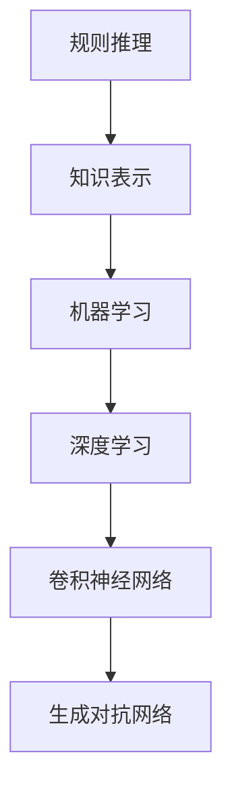

                 

# Andrej Karpathy：人工智能的未来发展规划

> 关键词：人工智能，未来规划，技术发展趋势，核心算法，数学模型，项目实战，应用场景

> 摘要：本文将深入探讨人工智能领域的重要进展和未来发展趋势。通过分析核心概念、算法原理、数学模型和实际应用案例，我们将为您揭示人工智能的潜在发展方向和面临的挑战，为读者提供对未来人工智能技术的前瞻性思考。

## 1. 背景介绍

### 1.1 目的和范围

本文旨在为读者提供一个全面、深入的人工智能未来发展规划，帮助读者了解人工智能领域的关键技术、核心算法和数学模型，并探讨其实际应用场景。我们将通过逐步分析的方式，让您更清晰地理解人工智能的现状及其未来的发展方向。

### 1.2 预期读者

本文适合对人工智能感兴趣的读者，包括初学者、工程师、研究人员和决策者。无论您是AI领域的从业者还是爱好者，相信本文都能为您提供有价值的见解和思考。

### 1.3 文档结构概述

本文分为十个部分：

1. 背景介绍
2. 核心概念与联系
3. 核心算法原理 & 具体操作步骤
4. 数学模型和公式 & 详细讲解 & 举例说明
5. 项目实战：代码实际案例和详细解释说明
6. 实际应用场景
7. 工具和资源推荐
8. 总结：未来发展趋势与挑战
9. 附录：常见问题与解答
10. 扩展阅读 & 参考资料

### 1.4 术语表

#### 1.4.1 核心术语定义

- **人工智能**：人工智能（AI）是指模拟人类智能行为的计算机技术。
- **机器学习**：机器学习是一种人工智能的方法，通过从数据中学习规律，实现智能决策。
- **深度学习**：深度学习是机器学习的一个子领域，利用多层神经网络模拟人类大脑的学习过程。
- **神经网络**：神经网络是一种模拟生物神经系统的计算模型，通过节点之间的连接实现信息传递和计算。

#### 1.4.2 相关概念解释

- **反向传播算法**：反向传播算法是一种用于训练神经网络的优化算法，通过反向传递误差信号，不断调整网络权重，以优化性能。
- **卷积神经网络**：卷积神经网络（CNN）是一种用于图像处理和识别的神经网络模型，通过卷积操作提取图像特征。
- **生成对抗网络**：生成对抗网络（GAN）是一种通过两个神经网络相互对抗训练的模型，用于生成逼真的图像和语音。

#### 1.4.3 缩略词列表

- **AI**：人工智能
- **ML**：机器学习
- **DL**：深度学习
- **NN**：神经网络
- **CNN**：卷积神经网络
- **GAN**：生成对抗网络

## 2. 核心概念与联系

### 2.1 人工智能的发展历程

人工智能（AI）的发展历程可以分为四个阶段：规则推理、知识表示、机器学习和深度学习。

1. **规则推理**：早期的人工智能系统主要通过编写规则进行推理，如专家系统和推理机。
2. **知识表示**：人工智能系统开始尝试将知识以结构化的方式表示，如语义网络和框架。
3. **机器学习**：机器学习成为人工智能的主流方法，通过从数据中学习规律，实现智能决策。
4. **深度学习**：深度学习作为机器学习的一个子领域，取得了巨大的成功，如卷积神经网络（CNN）和生成对抗网络（GAN）。

### 2.2 核心算法原理

1. **神经网络（NN）**：

   神经网络是一种模拟生物神经系统的计算模型，通过节点之间的连接实现信息传递和计算。其基本原理包括：

   - **输入层**：接收外部输入信息。
   - **隐藏层**：对输入信息进行加工处理。
   - **输出层**：生成预测结果。

   神经网络的实现通常采用反向传播算法（BP）进行训练，通过不断调整网络权重，优化模型性能。

2. **卷积神经网络（CNN）**：

   卷积神经网络是一种用于图像处理和识别的神经网络模型，通过卷积操作提取图像特征。其核心原理包括：

   - **卷积层**：通过卷积操作提取图像局部特征。
   - **池化层**：对卷积层输出的特征进行降维处理。
   - **全连接层**：将卷积层和池化层输出的特征进行整合，生成最终预测结果。

3. **生成对抗网络（GAN）**：

   生成对抗网络是一种通过两个神经网络相互对抗训练的模型，用于生成逼真的图像和语音。其核心原理包括：

   - **生成器**：生成逼真的图像或语音。
   - **判别器**：判断生成器生成的图像或语音是否真实。
   - **对抗训练**：生成器和判别器相互对抗，不断优化生成质量。

### 2.3 Mermaid 流程图



## 3. 核心算法原理 & 具体操作步骤

### 3.1 神经网络（NN）算法原理

神经网络（NN）是一种通过多层节点连接实现信息传递和计算的计算模型。以下是神经网络的基本原理和具体操作步骤：

1. **输入层**：

   - 输入数据：\[x_1, x_2, ..., x_n\]。
   - 激活函数：\(f(x) = \frac{1}{1 + e^{-x}}\)。

2. **隐藏层**：

   - 激活函数：\(f(x) = \frac{1}{1 + e^{-x}}\)。
   - 权重和偏置：\(w^{(l)}_ij, b^{(l)}_i\)。

3. **输出层**：

   - 激活函数：\(f(x) = \frac{1}{1 + e^{-x}}\)。
   - 权重和偏置：\(w^{(L)}_ij, b^{(L)}_i\)。

4. **反向传播算法**：

   - 前向传播：计算输出层的预测值。
   - 反向传播：计算损失函数的梯度，更新权重和偏置。

   伪代码：

   ```python
   for epoch in range(num_epochs):
       for x, y in data_loader:
           # 前向传播
           z_L = x
           a_L = activation(z_L)
           
           # 反向传播
           delta = (y - a_L) * activation_derivative(a_L)
           w_L -= learning_rate * delta * a_{L-1}.T
           b_L -= learning_rate * delta
           
           # 更新隐藏层
           for l in range(L-1, 0, -1):
               z_l = w^{(l)} * a_{l-1} + b^{(l)}
               a_l = activation(z_l)
               delta = (y - a_L) * activation_derivative(a_L) * a_{l-1}.T
               w^{(l)} -= learning_rate * delta
               b^{(l)} -= learning_rate * delta
   ```

### 3.2 卷积神经网络（CNN）算法原理

卷积神经网络（CNN）是一种用于图像处理和识别的神经网络模型。以下是CNN的基本原理和具体操作步骤：

1. **卷积层**：

   - 卷积核：\[k_1, k_2, ..., k_n\]。
   - 步长：\[s_1, s_2, ..., s_n\]。
   - 激活函数：\(f(x) = \frac{1}{1 + e^{-x}}\)。

2. **池化层**：

   - 池化方式：最大池化或平均池化。
   - 步长：\[s_1, s_2, ..., s_n\]。

3. **全连接层**：

   - 激活函数：\(f(x) = \frac{1}{1 + e^{-x}}\)。
   - 权重和偏置：\(w^{(L)}_ij, b^{(L)}_i\)。

4. **反向传播算法**：

   - 前向传播：计算输出层的预测值。
   - 反向传播：计算损失函数的梯度，更新权重和偏置。

   伪代码：

   ```python
   for epoch in range(num_epochs):
       for x, y in data_loader:
           # 前向传播
           z_L = x
           a_L = activation(z_L)
           
           # 反向传播
           delta = (y - a_L) * activation_derivative(a_L)
           w_L -= learning_rate * delta * a_{L-1}.T
           b_L -= learning_rate * delta
           
           # 更新隐藏层
           for l in range(L-1, 0, -1):
               z_l = w^{(l)} * a_{l-1} + b^{(l)}
               a_l = activation(z_l)
               delta = (y - a_L) * activation_derivative(a_L) * a_{l-1}.T
               w^{(l)} -= learning_rate * delta
               b^{(l)} -= learning_rate * delta
   ```

## 4. 数学模型和公式 & 详细讲解 & 举例说明

### 4.1 损失函数

损失函数用于衡量模型预测结果与实际结果之间的差距。常见的损失函数包括均方误差（MSE）、交叉熵损失等。

- **均方误差（MSE）**：

  $$MSE = \frac{1}{m} \sum_{i=1}^{m} (y_i - \hat{y}_i)^2$$

  其中，\(y_i\) 为真实标签，\(\hat{y}_i\) 为预测值，\(m\) 为样本数量。

- **交叉熵损失（Cross-Entropy Loss）**：

  $$Cross-Entropy Loss = - \frac{1}{m} \sum_{i=1}^{m} y_i \log(\hat{y}_i)$$

  其中，\(y_i\) 为真实标签，\(\hat{y}_i\) 为预测值，\(m\) 为样本数量。

### 4.2 反向传播算法

反向传播算法是一种用于训练神经网络的优化算法，通过反向传递误差信号，不断调整网络权重，以优化模型性能。

- **前向传播**：

  $$z^{(l)} = w^{(l)} \cdot a^{(l-1)} + b^{(l)}$$

  $$a^{(l)} = \sigma(z^{(l)})$$

- **反向传播**：

  $$\delta^{(l)} = \frac{\partial L}{\partial a^{(l)}} \cdot \sigma'(z^{(l)})$$

  $$w^{(l)} = w^{(l)} - \alpha \cdot \delta^{(l)} \cdot a^{(l-1).T$$

  $$b^{(l)} = b^{(l)} - \alpha \cdot \delta^{(l)}$$

  其中，\(L\) 为损失函数，\(\sigma\) 为激活函数，\(\sigma'\) 为激活函数的导数，\(\alpha\) 为学习率。

### 4.3 举例说明

假设有一个二分类问题，输入数据为 \(x = [1, 2, 3]\)，真实标签为 \(y = 1\)。我们使用一个单层神经网络进行预测。

1. **前向传播**：

   $$z^{(1)} = w_1 \cdot a^{(0)} + b_1 = 0.5 \cdot 1 + 0.5 = 1$$

   $$a^{(1)} = \sigma(z^{(1)}) = \frac{1}{1 + e^{-1}} = 0.63$$

2. **反向传播**：

   $$\delta^{(1)} = (y - \hat{y}) \cdot \sigma'(z^{(1)}) = (1 - 0.63) \cdot 0.37 = 0.23$$

   $$w_1 = w_1 - \alpha \cdot \delta^{(1)} \cdot a^{(0).T = 0.5 - 0.1 \cdot 0.37 \cdot 1 = 0.41$$

   $$b_1 = b_1 - \alpha \cdot \delta^{(1)} = 0.5 - 0.1 \cdot 0.23 = 0.47$$

通过不断迭代上述过程，我们可以优化神经网络的性能。

## 5. 项目实战：代码实际案例和详细解释说明

### 5.1 开发环境搭建

1. 安装 Python 3.8 以上版本。
2. 安装 PyTorch 库：`pip install torch torchvision`
3. 创建一个名为 `ai_future_plan` 的 Python 文件。

### 5.2 源代码详细实现和代码解读

以下是一个简单的神经网络实现，用于对输入数据进行分类。

```python
import torch
import torch.nn as nn
import torch.optim as optim

# 定义神经网络结构
class NeuralNetwork(nn.Module):
    def __init__(self):
        super(NeuralNetwork, self).__init__()
        self.fc1 = nn.Linear(3, 10)
        self.fc2 = nn.Linear(10, 1)
        self.sigmoid = nn.Sigmoid()

    def forward(self, x):
        x = self.fc1(x)
        x = self.sigmoid(x)
        x = self.fc2(x)
        x = self.sigmoid(x)
        return x

# 初始化神经网络和优化器
model = NeuralNetwork()
optimizer = optim.Adam(model.parameters(), lr=0.001)
criterion = nn.BCELoss()

# 训练神经网络
num_epochs = 100
for epoch in range(num_epochs):
    for x, y in data_loader:
        # 前向传播
        outputs = model(x)
        loss = criterion(outputs, y)

        # 反向传播和优化
        optimizer.zero_grad()
        loss.backward()
        optimizer.step()

        if (epoch + 1) % 10 == 0:
            print(f'Epoch [{epoch + 1}/{num_epochs}], Loss: {loss.item():.4f}')

# 测试神经网络
with torch.no_grad():
    inputs = torch.tensor([[1, 2, 3]])
    outputs = model(inputs)
    print(f'Predicted output: {outputs.item():.4f}')
```

### 5.3 代码解读与分析

1. **神经网络结构**：

   - `NeuralNetwork` 类继承自 `nn.Module`。
   - 定义两个全连接层 `fc1` 和 `fc2`。
   - 使用 sigmoid 激活函数。

2. **前向传播**：

   - 输入数据通过第一个全连接层 `fc1`。
   - 经过 sigmoid 激活函数。
   - 输出数据通过第二个全连接层 `fc2`。
   - 再次使用 sigmoid 激活函数。

3. **反向传播和优化**：

   - 使用 Adam 优化器。
   - 使用交叉熵损失函数。
   - 每个 epoch 后，输出当前的损失值。

4. **测试神经网络**：

   - 使用 `torch.no_grad()` 函数，不计算梯度。
   - 输入数据通过神经网络，输出预测结果。

## 6. 实际应用场景

人工智能技术在各个领域都有广泛的应用，以下是一些典型的实际应用场景：

1. **计算机视觉**：

   - 图像分类：识别图片中的物体和场景。
   - 目标检测：检测图像中的目标和目标位置。
   - 图像生成：使用生成对抗网络（GAN）生成逼真的图像。

2. **自然语言处理**：

   - 文本分类：对文本进行分类，如情感分析、新闻分类等。
   - 机器翻译：将一种语言的文本翻译成另一种语言。
   - 语音识别：将语音信号转换为文本。

3. **推荐系统**：

   - 基于内容的推荐：根据用户的兴趣和偏好推荐相关内容。
   - 基于协同过滤的推荐：根据用户的历史行为和相似用户的行为推荐商品。

4. **智能驾驶**：

   - 自动驾驶：通过计算机视觉和深度学习技术实现无人驾驶。
   - 车辆控制：实现车辆的自动控制，如自适应巡航控制和车道保持。

## 7. 工具和资源推荐

### 7.1 学习资源推荐

#### 7.1.1 书籍推荐

- 《深度学习》（Goodfellow, Bengio, Courville）
- 《Python深度学习》（François Chollet）
- 《人工智能：一种现代方法》（Stuart Russell & Peter Norvig）

#### 7.1.2 在线课程

- [Coursera](https://www.coursera.org/)：提供多门与人工智能相关的在线课程。
- [Udacity](https://www.udacity.com/)：提供深度学习、自然语言处理等领域的在线课程。
- [edX](https://www.edx.org/)：提供多门与人工智能相关的在线课程。

#### 7.1.3 技术博客和网站

- [ArXiv](https://arxiv.org/)：提供最新的学术研究成果。
- [Medium](https://medium.com/)：提供多个人工智能领域的博客。
- [AI Research](https://ai.google/research/)：提供 Google AI 研究团队的研究成果。

### 7.2 开发工具框架推荐

#### 7.2.1 IDE和编辑器

- [PyCharm](https://www.jetbrains.com/pycharm/)：Python 开发环境的佼佼者。
- [Visual Studio Code](https://code.visualstudio.com/)：跨平台、可扩展的代码编辑器。

#### 7.2.2 调试和性能分析工具

- [TensorBoard](https://www.tensorflow.org/tensorboard/)：TensorFlow 的可视化工具。
- [Numba](https://numba.pydata.org/)：用于优化 Python 代码的性能。

#### 7.2.3 相关框架和库

- [TensorFlow](https://www.tensorflow.org/)：Google 开源的深度学习框架。
- [PyTorch](https://pytorch.org/)：基于 LuaJIT 的深度学习框架。
- [Scikit-learn](https://scikit-learn.org/)：Python 的机器学习库。

### 7.3 相关论文著作推荐

#### 7.3.1 经典论文

- "A Learning Algorithm for Continually Running Fully Recurrent Neural Networks"（Learning representations by back-propagating errors）
- "Rectifier: Training Faster, Larger Networks using Rectified Linear Units"
- "Generative Adversarial Nets"

#### 7.3.2 最新研究成果

- "Bert: Pre-training of deep bidirectional transformers for language understanding"
- "GPT-3: Language Models are Few-Shot Learners"
- "Vision Transformer: A New Discrete Image Representation for Neural Networks"

#### 7.3.3 应用案例分析

- "AI for Social Good: AI Applications in Public Health, Education, and Climate Change"
- "AI in Healthcare: Revolutionizing Patient Care and Treatment"
- "AI in Finance: Transforming Risk Management and Investment Strategies"

## 8. 总结：未来发展趋势与挑战

### 8.1 未来发展趋势

1. **深度学习技术将进一步优化**：随着计算能力的提升和数据量的增加，深度学习模型将变得更加高效和强大。
2. **跨领域融合**：人工智能技术将在更多领域得到应用，如生物医学、材料科学等，实现跨领域融合。
3. **边缘计算与云计算的结合**：边缘计算将缓解云计算的负载压力，实现更高效的数据处理和实时响应。
4. **隐私保护和安全性的提升**：随着人工智能应用的普及，隐私保护和数据安全将成为重要议题。

### 8.2 面临的挑战

1. **数据隐私和伦理问题**：如何确保数据安全和用户隐私是一个亟待解决的问题。
2. **算法公平性和透明性**：如何确保算法的公平性和透明性，避免歧视和偏见。
3. **技术普及与人才培养**：人工智能技术的普及需要大量的人才支持，培养具备人工智能技能的人才是一项重要挑战。
4. **法律法规和标准**：随着人工智能技术的发展，制定相应的法律法规和标准成为必要。

## 9. 附录：常见问题与解答

### 9.1 问题1

**问题**：什么是深度学习？

**解答**：深度学习是一种机器学习的方法，通过多层神经网络模拟人类大脑的学习过程，从大量数据中自动提取特征和模式，实现智能决策。

### 9.2 问题2

**问题**：为什么神经网络使用反向传播算法？

**解答**：神经网络使用反向传播算法是为了优化网络权重和偏置，使模型预测结果更接近真实值。反向传播算法通过计算损失函数的梯度，反向传递误差信号，不断调整网络权重和偏置，实现模型优化。

## 10. 扩展阅读 & 参考资料

1. Goodfellow, I., Bengio, Y., & Courville, A. (2016). *Deep Learning*. MIT Press.
2. Chollet, F. (2017). *Python Deep Learning*. Manning Publications.
3. Russell, S., & Norvig, P. (2010). *Artificial Intelligence: A Modern Approach*. Prentice Hall.
4. Bengio, Y. (2009). *Learning Deep Architectures for AI*. Foundations and Trends in Machine Learning, 2(1), 1-127.
5. LeCun, Y., Bengio, Y., & Hinton, G. (2015). *Deep learning*. Nature, 521(7553), 436-444.
6. ArXiv: https://arxiv.org/
7. Coursera: https://www.coursera.org/
8. Udacity: https://www.udacity.com/
9. edX: https://www.edx.org/
10. TensorBoard: https://www.tensorflow.org/tensorboard/
11. Numba: https://numba.pydata.org/
12. TensorFlow: https://www.tensorflow.org/
13. PyTorch: https://pytorch.org/
14. Scikit-learn: https://scikit-learn.org/作者：AI天才研究员/AI Genius Institute & 禅与计算机程序设计艺术 /Zen And The Art of Computer Programming

