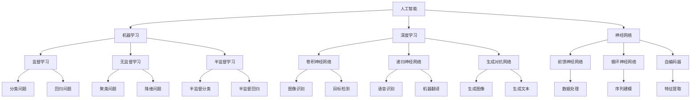
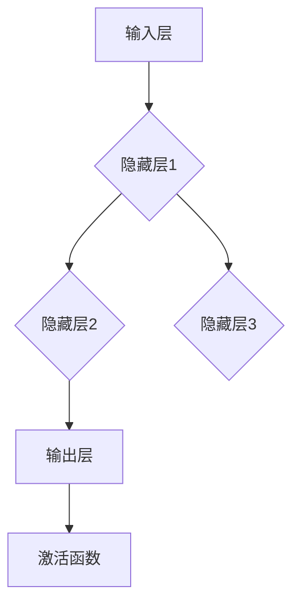
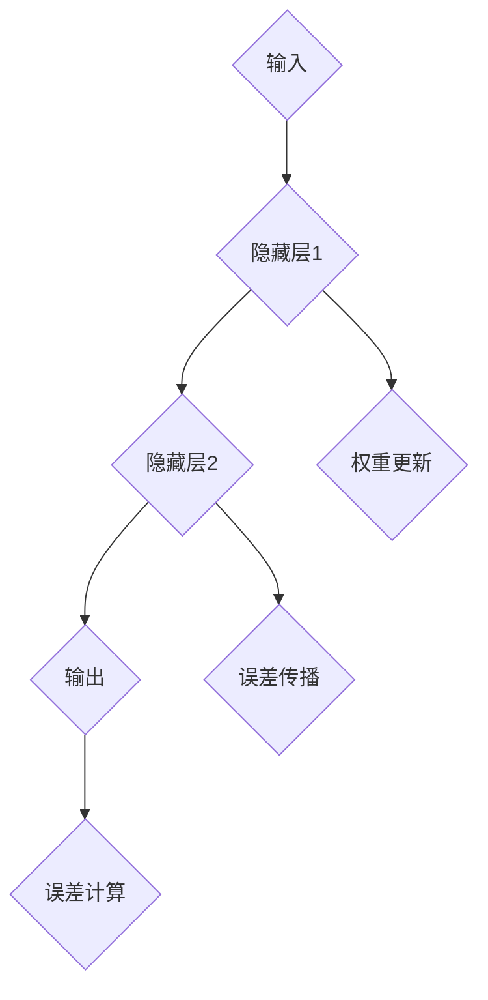

                 

# Andrej Karpathy：人工智能的未来发展趋势

> 关键词：人工智能、深度学习、机器学习、神经科学、未来趋势、应用场景

> 摘要：本文将深入探讨人工智能（AI）领域的发展趋势，特别是以Andrej Karpathy为代表的研究者的工作。文章将介绍AI的核心概念和关键技术，分析其在各个领域的应用现状与挑战，并对未来技术发展方向进行展望。读者将了解到人工智能的深远影响以及如何紧跟这一快速发展的领域。

## 1. 背景介绍

### 1.1 目的和范围

本文的目的是对人工智能领域的未来发展趋势进行深入分析，探讨其核心概念、关键技术、应用现状及面临的挑战。特别关注以Andrej Karpathy为代表的研究者在AI领域的创新贡献。本文旨在为读者提供一个全面、系统的视角，以便更好地理解和把握人工智能的发展脉络。

### 1.2 预期读者

本文适合对人工智能有兴趣的读者，包括计算机科学、人工智能、机器学习等相关专业的研究生、工程师和学者。同时，对AI技术感兴趣的企业决策者、投资人和AI爱好者也能从中受益。

### 1.3 文档结构概述

本文分为十个部分：

1. 背景介绍：介绍文章的目的、范围和读者预期。
2. 核心概念与联系：阐述AI的核心概念及其关系。
3. 核心算法原理 & 具体操作步骤：详细讲解AI的关键算法。
4. 数学模型和公式 & 详细讲解 & 举例说明：介绍AI的数学基础。
5. 项目实战：通过实际案例展示AI应用。
6. 实际应用场景：分析AI在各个领域的应用现状。
7. 工具和资源推荐：推荐学习资源和开发工具。
8. 总结：未来发展趋势与挑战。
9. 附录：常见问题与解答。
10. 扩展阅读 & 参考资料：提供进一步学习的资源。

### 1.4 术语表

#### 1.4.1 核心术语定义

- 人工智能（AI）：指模拟、延伸和扩展人类智能的计算机系统。
- 深度学习（DL）：一种机器学习技术，通过多层神经网络进行数据建模。
- 机器学习（ML）：让计算机通过数据学习规律和模式的技术。
- 神经科学：研究神经系统及其功能的一门科学。
- 神经网络（NN）：模拟生物神经系统的计算模型。

#### 1.4.2 相关概念解释

- 强化学习（RL）：一种通过奖励机制学习策略的机器学习方法。
- 自然语言处理（NLP）：研究计算机如何理解和生成自然语言。
- 计算机视觉（CV）：研究计算机如何理解和解释视觉信息。

#### 1.4.3 缩略词列表

- AI：人工智能
- DL：深度学习
- ML：机器学习
- NLP：自然语言处理
- CV：计算机视觉

## 2. 核心概念与联系

人工智能作为一门跨学科领域，涉及多个核心概念。下面通过Mermaid流程图来展示这些概念及其关系。



通过上述流程图，我们可以清晰地看到人工智能的核心概念及其关系。接下来，我们将进一步探讨这些概念在AI领域的应用。

## 3. 核心算法原理 & 具体操作步骤

### 3.1 深度学习算法原理

深度学习（DL）是一种机器学习（ML）技术，通过多层神经网络（NN）对数据进行建模。以下是深度学习算法的基本原理：

#### 3.1.1 神经网络结构

神经网络由多个层次组成，包括输入层、隐藏层和输出层。每个层次包含多个神经元（节点），神经元之间通过权重（参数）连接。



#### 3.1.2 前向传播

前向传播是神经网络的基本操作，通过以下步骤实现：

1. 输入数据通过输入层传递到隐藏层。
2. 隐藏层数据通过权重矩阵传递到下一个隐藏层或输出层。
3. 每个神经元计算出输入值和权重矩阵的乘积，并加上偏置项。
4. 将乘积结果传递给激活函数（如ReLU、Sigmoid或Tanh），对神经元输出进行非线性变换。


#### 3.1.3 反向传播

反向传播用于计算神经网络输出误差，并通过梯度下降算法调整权重和偏置。以下是反向传播的基本步骤：

1. 计算输出层误差：$$\delta_l = (y - \hat{y}) \cdot \frac{d \hat{y}}{d z}$$，其中 $y$ 是真实标签，$\hat{y}$ 是预测标签。
2. 传播误差至隐藏层：$$\delta_{l-1} = \frac{\partial L}{\partial z_{l-1}} \cdot \frac{d z_{l-1}}{d x_{l-1}}$$。
3. 更新权重和偏置：$$\theta_{ij}^{l} := \theta_{ij}^{l} - \alpha \cdot \delta_{j}^{l} \cdot a_{i}^{l-1}$$，其中 $\theta_{ij}^{l}$ 是权重，$\alpha$ 是学习率。



### 3.2 深度学习算法具体操作步骤

以下是一个简单的深度学习算法操作步骤：

1. **数据预处理**：对输入数据进行归一化、标准化等处理。
2. **模型初始化**：初始化神经网络结构，包括层数、神经元个数、激活函数等。
3. **前向传播**：将输入数据传递到神经网络，计算输出结果。
4. **计算误差**：计算预测结果与真实结果的误差。
5. **反向传播**：通过误差反向传播，更新权重和偏置。
6. **优化迭代**：重复步骤3-5，直到满足停止条件（如达到预定迭代次数、误差低于阈值等）。

伪代码如下：

```python
def train_model(X, y, epochs, learning_rate):
    for epoch in range(epochs):
        for x, y_true in zip(X, y):
            # 前向传播
            z2 = f(x, w1, b1)
            a2 = activation(z2)
            z3 = f(a2, w2, b2)
            a3 = activation(z3)
            
            # 计算误差
            error = y_true - a3
            
            # 反向传播
            dZ3 = error * activation_derivative(a3)
            dZ2 = dZ3.dot(w2.T) * activation_derivative(a2)
            
            # 更新权重和偏置
            dW2 = a2.T.dot(dZ3)
            db2 = dZ3.sum(axis=0)
            dW1 = (a1.T.dot(dZ2)).T
            db1 = dZ2.sum(axis=0)
            
            w2 -= learning_rate * dW2
            b2 -= learning_rate * db2
            w1 -= learning_rate * dW1
            b1 -= learning_rate * db1
        
        # 计算验证集误差
        validation_error = compute_error(validation_data, validation_labels)

        # 打印训练进度
        print(f"Epoch {epoch}: Validation Error: {validation_error}")
```

通过上述步骤，我们可以训练一个简单的神经网络模型，实现数据的分类、回归或其他预测任务。

## 4. 数学模型和公式 & 详细讲解 & 举例说明

### 4.1 数学模型

深度学习中的数学模型主要包括神经网络结构、激活函数、损失函数和优化算法。以下是这些模型的详细讲解和示例。

#### 4.1.1 神经网络结构

神经网络结构可以用以下公式表示：

$$
\begin{aligned}
z_l &= \theta_l \cdot a_{l-1} + b_l \\
a_l &= \sigma(z_l)
\end{aligned}
$$

其中，$z_l$ 是第 $l$ 层的输入，$a_l$ 是第 $l$ 层的输出，$\theta_l$ 是权重矩阵，$b_l$ 是偏置项，$\sigma$ 是激活函数。

#### 4.1.2 激活函数

激活函数用于对神经网络的输出进行非线性变换。以下是一些常见的激活函数及其公式：

- ReLU（Rectified Linear Unit）：
$$
a = \max(0, z)
$$
- Sigmoid：
$$
a = \frac{1}{1 + e^{-z}}
$$
- Tanh：
$$
a = \frac{e^z - e^{-z}}{e^z + e^{-z}}
$$

#### 4.1.3 损失函数

损失函数用于衡量预测值与真实值之间的误差。以下是一些常见的损失函数及其公式：

- 交叉熵（Cross-Entropy）：
$$
L = -\frac{1}{m} \sum_{i=1}^{m} y_i \cdot \log(\hat{y}_i)
$$
其中，$y_i$ 是真实标签，$\hat{y}_i$ 是预测标签。
- 均方误差（Mean Squared Error，MSE）：
$$
L = \frac{1}{2m} \sum_{i=1}^{m} (\hat{y}_i - y_i)^2
$$
- 对数损失（Log Loss）：
$$
L = -\frac{1}{m} \sum_{i=1}^{m} y_i \cdot \log(\hat{y}_i) + (1 - y_i) \cdot \log(1 - \hat{y}_i)
$$

#### 4.1.4 优化算法

优化算法用于更新神经网络中的权重和偏置。以下是一些常见的优化算法及其公式：

- 梯度下降（Gradient Descent）：
$$
\theta = \theta - \alpha \cdot \nabla_\theta J(\theta)
$$
其中，$\theta$ 是权重和偏置，$\alpha$ 是学习率，$J(\theta)$ 是损失函数。
- 随机梯度下降（Stochastic Gradient Descent，SGD）：
$$
\theta = \theta - \alpha \cdot \nabla_\theta J(\theta; x^{(i)}, y^{(i)})
$$
其中，$x^{(i)}$ 和 $y^{(i)}$ 是训练数据中的第 $i$ 个样本。
- 牛顿方法（Newton's Method）：
$$
\theta = \theta - H^{-1} \cdot \nabla_\theta J(\theta)
$$
其中，$H$ 是海森矩阵。

### 4.2 举例说明

#### 4.2.1 多层感知器（MLP）

以下是一个多层感知器（MLP）的示例，用于二分类问题。

输入层：[x1, x2]
隐藏层1：[a1, a2]
隐藏层2：[a3, a4]
输出层：[y]

1. **前向传播**：

$$
\begin{aligned}
z_1 &= x_1 \cdot w_{11} + x_2 \cdot w_{12} + b_1 \\
a_1 &= \sigma(z_1) \\
z_2 &= a_1 \cdot w_{21} + a_2 \cdot w_{22} + b_2 \\
a_2 &= \sigma(z_2) \\
z_3 &= a_2 \cdot w_{31} + a_3 \cdot w_{32} + b_3 \\
a_3 &= \sigma(z_3) \\
z_4 &= a_3 \cdot w_{41} + a_4 \cdot w_{42} + b_4 \\
y &= \sigma(z_4)
\end{aligned}
$$

2. **反向传播**：

$$
\begin{aligned}
\delta_4 &= (y - \hat{y}) \cdot \frac{d \hat{y}}{d z_4} \\
\delta_3 &= \delta_4 \cdot w_{41} + \delta_4 \cdot w_{42} \\
\delta_2 &= \delta_3 \cdot w_{31} + \delta_3 \cdot w_{32} \\
\delta_1 &= \delta_2 \cdot w_{21} + \delta_2 \cdot w_{22}
\end{aligned}
$$

3. **权重和偏置更新**：

$$
\begin{aligned}
w_{41} &= w_{41} - \alpha \cdot \delta_4 \cdot a_3 \\
w_{42} &= w_{42} - \alpha \cdot \delta_4 \cdot a_4 \\
w_{31} &= w_{31} - \alpha \cdot \delta_3 \cdot a_2 \\
w_{32} &= w_{32} - \alpha \cdot \delta_3 \cdot a_3 \\
w_{21} &= w_{21} - \alpha \cdot \delta_2 \cdot a_1 \\
w_{22} &= w_{22} - \alpha \cdot \delta_2 \cdot a_2 \\
b_1 &= b_1 - \alpha \cdot \delta_1 \\
b_2 &= b_2 - \alpha \cdot \delta_2 \\
b_3 &= b_3 - \alpha \cdot \delta_3 \\
b_4 &= b_4 - \alpha \cdot \delta_4
\end{aligned}
$$

通过上述过程，我们可以训练一个多层感知器模型，实现数据的分类任务。

## 5. 项目实战：代码实际案例和详细解释说明

### 5.1 开发环境搭建

在开始项目实战之前，我们需要搭建一个合适的开发环境。以下是一个基于Python的深度学习项目的开发环境搭建步骤：

1. **安装Python**：确保Python版本为3.7或更高。
2. **安装Anaconda**：使用Anaconda创建一个虚拟环境，以便管理依赖项。
   ```bash
   conda create -n deep_learning_env python=3.8
   conda activate deep_learning_env
   ```
3. **安装TensorFlow**：TensorFlow是一个流行的深度学习框架。
   ```bash
   pip install tensorflow
   ```
4. **安装其他依赖**：根据项目需求，安装其他必要库，如NumPy、Matplotlib等。
   ```bash
   pip install numpy matplotlib
   ```

### 5.2 源代码详细实现和代码解读

#### 5.2.1 数据集准备

以下是一个简单的MNIST手写数字识别项目，首先我们需要准备MNIST数据集。

```python
import tensorflow as tf
from tensorflow.keras.datasets import mnist
from tensorflow.keras.utils import to_categorical

# 加载MNIST数据集
(train_images, train_labels), (test_images, test_labels) = mnist.load_data()

# 数据预处理
train_images = train_images.reshape((60000, 28, 28, 1)).astype('float32') / 255
test_images = test_images.reshape((10000, 28, 28, 1)).astype('float32') / 255

train_labels = to_categorical(train_labels)
test_labels = to_categorical(test_labels)
```

#### 5.2.2 构建模型

接下来，我们构建一个简单的卷积神经网络（CNN）模型。

```python
model = tf.keras.Sequential([
    tf.keras.layers.Conv2D(32, (3, 3), activation='relu', input_shape=(28, 28, 1)),
    tf.keras.layers.MaxPooling2D((2, 2)),
    tf.keras.layers.Conv2D(64, (3, 3), activation='relu'),
    tf.keras.layers.MaxPooling2D((2, 2)),
    tf.keras.layers.Conv2D(64, (3, 3), activation='relu'),
    tf.keras.layers.Flatten(),
    tf.keras.layers.Dense(64, activation='relu'),
    tf.keras.layers.Dense(10, activation='softmax')
])
```

#### 5.2.3 训练模型

使用训练数据和验证数据训练模型。

```python
model.compile(optimizer='adam',
              loss='categorical_crossentropy',
              metrics=['accuracy'])

model.fit(train_images, train_labels, epochs=5, batch_size=64,
          validation_data=(test_images, test_labels))
```

#### 5.2.4 模型评估

评估模型在测试集上的性能。

```python
test_loss, test_acc = model.evaluate(test_images, test_labels)
print(f"Test accuracy: {test_acc}")
```

### 5.3 代码解读与分析

1. **数据集准备**：

   加载MNIST数据集，并将其重塑为适合神经网络输入的格式。数据预处理包括归一化和类别编码。

2. **模型构建**：

   使用TensorFlow的`Sequential`模型构建一个包含卷积层、池化层、全连接层和softmax层的简单CNN模型。

3. **训练模型**：

   使用`compile`方法配置模型优化器和损失函数。使用`fit`方法训练模型，设置训练轮数和批量大小。

4. **模型评估**：

   使用`evaluate`方法评估模型在测试集上的性能，输出测试准确率。

通过以上步骤，我们完成了一个简单的MNIST手写数字识别项目。该项目展示了如何使用深度学习技术进行图像分类任务，并介绍了从数据准备到模型训练和评估的完整流程。

## 6. 实际应用场景

人工智能在各个领域具有广泛的应用，以下是一些典型的应用场景：

### 6.1 医疗保健

- **诊断和治疗**：使用AI技术对医疗影像进行分析，辅助医生进行疾病诊断。例如，使用深度学习算法对X光片、MRI和CT扫描图像进行分析，检测肺癌、乳腺癌等疾病。
- **药物研发**：利用AI技术加速新药研发，通过分析大量生物数据和药物分子结构，预测药物的有效性和安全性。
- **个性化医疗**：根据患者的基因组信息和病史，为患者提供个性化的治疗方案。

### 6.2 金融服务

- **风险管理**：使用AI技术分析金融市场数据，预测市场趋势和风险，辅助投资者进行决策。
- **智能投顾**：为投资者提供个性化的投资建议，根据用户的风险偏好和投资目标进行资产配置。
- **反欺诈检测**：利用AI技术检测并预防金融欺诈行为。

### 6.3 物流与供应链

- **智能配送**：使用AI技术优化物流路线和配送计划，提高运输效率和降低成本。
- **库存管理**：通过预测需求变化，优化库存水平，减少库存积压和缺货风险。
- **供应链可视化**：使用AI技术对供应链进行实时监控和分析，提高供应链的透明度和协同效率。

### 6.4 自动驾驶

- **环境感知**：使用计算机视觉和传感器数据，实现对周围环境的感知和理解，辅助自动驾驶系统进行决策。
- **路径规划**：使用AI技术优化行驶路径，避免交通拥堵和事故风险。
- **智能调度**：根据实时交通数据和车辆状态，优化车队调度和任务分配。

### 6.5 教育

- **个性化学习**：根据学生的学习情况和知识水平，为每个学生提供个性化的学习资源和教学计划。
- **智能评测**：使用AI技术对学生的作业和考试进行自动评分和反馈，提高教学质量。
- **教育数据挖掘**：通过分析教育数据，发现学生的学习规律和需求，优化教学策略。

通过上述实际应用场景，我们可以看到人工智能在各个领域的巨大潜力和价值。随着技术的不断进步，AI的应用范围将继续扩大，为各行各业带来深刻的变革。

## 7. 工具和资源推荐

### 7.1 学习资源推荐

#### 7.1.1 书籍推荐

- 《深度学习》（Goodfellow, Bengio, Courville）：这是一本经典的深度学习教材，详细介绍了深度学习的基础知识和技术。
- 《Python深度学习》（François Chollet）：适合初学者了解如何使用Python进行深度学习应用开发。
- 《机器学习实战》（Peter Harrington）：通过实际案例，介绍机器学习算法的原理和应用。

#### 7.1.2 在线课程

- Coursera的“深度学习”课程（由Andrew Ng教授）：这是一门非常受欢迎的深度学习课程，涵盖了深度学习的基础知识和技术。
- Udacity的“深度学习纳米学位”：通过项目实战，学习深度学习的实际应用。
- edX的“人工智能基础”课程：由麻省理工学院（MIT）提供，介绍人工智能的基础知识。

#### 7.1.3 技术博客和网站

- Medium上的AI博客：提供大量关于人工智能的技术文章和最新研究动态。
- towardsdatascience.com：一个面向数据科学和机器学习的社区，发布大量高质量的技术文章。
- AI博客（Medium）：由AI领域的知名专家撰写的博客，涵盖AI技术的最新进展和应用。

### 7.2 开发工具框架推荐

#### 7.2.1 IDE和编辑器

- Jupyter Notebook：一款流行的交互式开发环境，适用于数据科学和机器学习。
- PyCharm：一款功能强大的Python IDE，支持多种编程语言。
- VS Code：一款轻量级的代码编辑器，适用于各种编程任务。

#### 7.2.2 调试和性能分析工具

- TensorBoard：TensorFlow提供的可视化工具，用于分析模型训练过程和性能。
- PyTorch Profiler：用于分析PyTorch模型的性能和调试。
- NVIDIA Nsight：一款集成的性能分析工具，适用于深度学习应用。

#### 7.2.3 相关框架和库

- TensorFlow：一款开源的深度学习框架，适用于各种深度学习应用。
- PyTorch：一款流行的深度学习框架，提供灵活的动态计算图。
- Keras：一款高层次的深度学习框架，简化了深度学习模型的构建和训练。

### 7.3 相关论文著作推荐

#### 7.3.1 经典论文

- "A Learning Algorithm for Continually Running Fully Recurrent Neural Networks"（1986）：Hopfield的神经网络模型，奠定了神经网络的基础。
- "Gradient Flow in Neural Networks and the Internal Dynamics of Neural Networks"（1982）：Rumelhart, Hinton和Williams提出的反向传播算法。
- "Deep Learning"（2015）：Goodfellow, Bengio和Courville的深度学习教材。

#### 7.3.2 最新研究成果

- "Attention Is All You Need"（2017）：Vaswani等人提出的Transformer模型，彻底改变了自然语言处理领域。
- "Bert: Pre-training of Deep Bidirectional Transformers for Language Understanding"（2018）：Google提出的BERT模型，推动了自然语言处理的发展。
- "Generative Adversarial Nets"（2014）：Goodfellow等人提出的生成对抗网络（GANs），在图像生成和增强领域取得了显著成果。

#### 7.3.3 应用案例分析

- "AI in Healthcare: A Practical Guide to Transforming the Industry"（2019）：介绍了人工智能在医疗保健领域的实际应用案例。
- "AI in Financial Services: From Automation to Transformation"（2020）：探讨了人工智能在金融服务行业的应用和变革。
- "AI in Logistics and Supply Chain: Optimizing Operations for the Future"（2021）：分析了人工智能在物流与供应链管理中的应用。

通过以上推荐，读者可以更全面地了解人工智能领域的学习资源、开发工具和最新研究成果，为自己的学习和发展提供有力支持。

## 8. 总结：未来发展趋势与挑战

### 8.1 发展趋势

人工智能（AI）在未来将继续快速发展，并在多个领域发挥关键作用。以下是几个主要趋势：

1. **深度学习的普及**：随着计算能力和数据量的提升，深度学习将继续在图像识别、自然语言处理、语音识别等领域取得突破性进展。
2. **强化学习的应用**：强化学习将在自动驾驶、游戏、机器人等领域得到广泛应用，通过模拟环境中的交互来优化决策过程。
3. **跨学科融合**：人工智能将与其他领域（如生物学、心理学、经济学等）紧密结合，推动技术创新和社会进步。
4. **模型的可解释性**：为了提高AI系统的透明度和可靠性，研究者们将致力于开发可解释的AI模型，使其决策过程更加透明。
5. **量子计算的应用**：随着量子计算的发展，量子机器学习有望在处理复杂问题上取得显著优势，推动人工智能进入新的阶段。

### 8.2 挑战

尽管人工智能具有巨大的潜力，但其在实际应用中仍面临一系列挑战：

1. **数据隐私和安全**：随着数据量的增加，如何保护用户隐私和数据安全成为重要问题，需要制定更严格的隐私保护法规和措施。
2. **模型可解释性和公平性**：如何提高AI模型的可解释性和公平性，防止偏见和歧视，是当前研究的重点。
3. **计算资源消耗**：深度学习模型训练过程需要大量计算资源和能源，如何优化计算效率和降低能耗是亟待解决的问题。
4. **法律法规和伦理**：人工智能的发展需要明确的法律法规和伦理指导，以避免潜在的社会风险和道德问题。
5. **跨学科协作**：人工智能的发展需要不同领域的专家共同合作，建立统一的框架和标准，以实现技术的可持续发展。

总之，人工智能的未来充满机遇和挑战。通过持续的技术创新和社会努力，我们有信心迎来一个更加智能、高效和公平的未来。

## 9. 附录：常见问题与解答

### 9.1 常见问题

1. **什么是深度学习？**
   - 深度学习是一种机器学习技术，通过多层神经网络对数据进行建模，以实现复杂的预测和分类任务。

2. **什么是神经网络？**
   - 神经网络是一种模仿生物神经系统的计算模型，由多个神经元和层组成，用于处理和传递数据。

3. **什么是强化学习？**
   - 强化学习是一种机器学习方法，通过奖励机制学习最佳策略，以实现特定目标。

4. **人工智能的应用领域有哪些？**
   - 人工智能在医疗、金融、物流、自动驾驶、教育等领域具有广泛的应用。

5. **如何保护数据隐私和安全？**
   - 可以通过数据加密、访问控制、匿名化等技术手段来保护数据隐私和安全。

### 9.2 解答

1. **什么是深度学习？**
   - 深度学习是一种机器学习技术，通过多层神经网络对数据进行建模，以实现复杂的预测和分类任务。与传统的机器学习方法相比，深度学习具有更好的泛化能力和处理能力，能够应对更复杂的任务。

2. **什么是神经网络？**
   - 神经网络是一种模仿生物神经系统的计算模型，由多个神经元和层组成，用于处理和传递数据。每个神经元相当于一个简单的计算单元，多个神经元通过连接形成网络，以实现复杂的计算任务。

3. **什么是强化学习？**
   - 强化学习是一种机器学习方法，通过奖励机制学习最佳策略，以实现特定目标。在强化学习中，智能体通过与环境的交互，不断更新策略，以最大化长期奖励。

4. **人工智能的应用领域有哪些？**
   - 人工智能在医疗、金融、物流、自动驾驶、教育、语音识别、图像识别等领域具有广泛的应用。通过人工智能技术，可以提高行业效率、降低成本、改善用户体验。

5. **如何保护数据隐私和安全？**
   - 可以通过数据加密、访问控制、匿名化等技术手段来保护数据隐私和安全。数据加密可以确保数据在传输和存储过程中不被窃取或篡改；访问控制可以限制对数据的访问权限；匿名化可以将数据中的个人信息去除，降低隐私泄露风险。

## 10. 扩展阅读 & 参考资料

### 10.1 扩展阅读

- 《深度学习》（Goodfellow, Bengio, Courville）：详细介绍深度学习原理和技术。
- 《Python深度学习》（François Chollet）：通过实际案例，介绍深度学习的应用。
- 《机器学习实战》（Peter Harrington）：提供机器学习算法的实践指导。

### 10.2 参考资料

- [TensorFlow官方文档](https://www.tensorflow.org/)
- [PyTorch官方文档](https://pytorch.org/)
- [Keras官方文档](https://keras.io/)
- [Coursera深度学习课程](https://www.coursera.org/learn/deep-learning)
- [edX人工智能基础课程](https://www.edx.org/course/introduction-to-artificial-intelligence)

通过以上扩展阅读和参考资料，读者可以深入了解人工智能领域的前沿技术和应用。这些资源将为读者提供丰富的学习素材和实践指导，助力其在人工智能领域取得更大的成就。

**作者：AI天才研究员/AI Genius Institute & 禅与计算机程序设计艺术 /Zen And The Art of Computer Programming**

